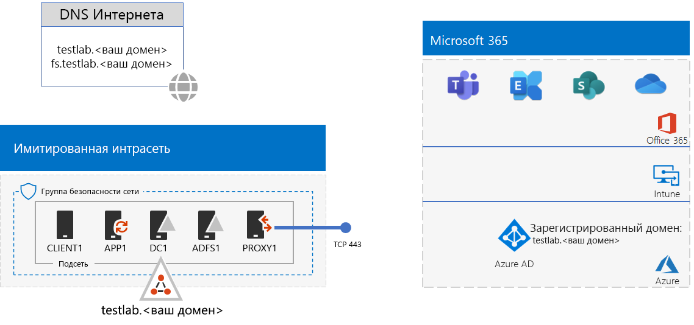
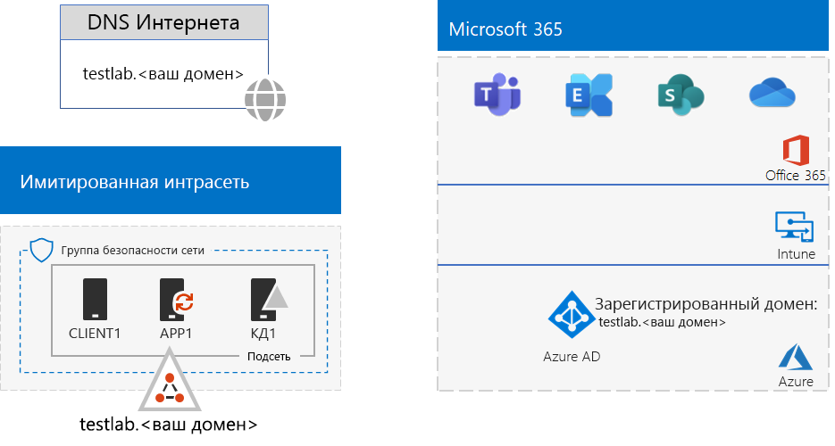
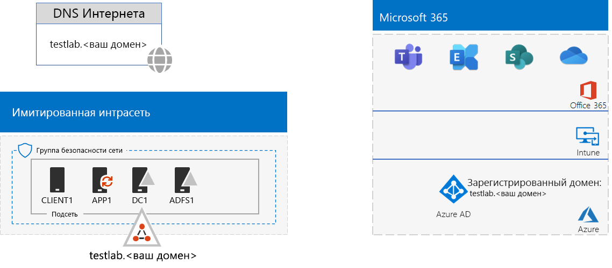

# <a name="federated-identity-for-your-microsoft-365-test-environment"></a><span data-ttu-id="e4c6d-103">Федеративная идентификация для среды тестирования Microsoft 365</span><span class="sxs-lookup"><span data-stu-id="e4c6d-103">Federated identity for your Microsoft 365 test environment</span></span>

<span data-ttu-id="e4c6d-104">*Это руководство по лаборатории тестирования можно использовать для тестовых сред Microsoft 365 корпоративный и Office 365 корпоративный.*</span><span class="sxs-lookup"><span data-stu-id="e4c6d-104">*This Test Lab Guide can be used for both Microsoft 365 Enterprise and Office 365 Enterprise test environments.*</span></span>

<span data-ttu-id="e4c6d-p101">Office 365 поддерживает федеративную идентификацию. Это означает, что Office 365 не проверяет непосредственно учетные данные, а направляет подключающегося пользователя на федеративный сервер аутентификации, которому доверяет. Если учетные данные пользователя правильны, сервер федеративной аутентификации выдает токен безопасности, который клиент затем отправляет в Office 365 как доказательство аутентификации. Федеративная идентификация позволяет разгрузить и масштабировать аутентификацию для подписки на Office 365, а также реализовать расширенные сценарии аутентификации и безопасности.</span><span class="sxs-lookup"><span data-stu-id="e4c6d-p101">Office 365 supports federated identity. This means that instead of performing the validation of credentials itself, Office 365 refers the connecting user to a federated authentication server that Office 365 trusts. If the user's credentials are correct, the federated authentication server issues a security token that the client then sends to Office 365 as proof of authentication. Federated identity allows for the offloading and scaling up of authentication for an Office 365 subscription and advanced authentication and security scenarios.</span></span>
  
<span data-ttu-id="e4c6d-109">В этой статье описано, как можно настроить федеративную аутентификацию для среды тестирования Microsoft 365 или Office 365, чтобы получить представленную ниже конфигурацию.</span><span class="sxs-lookup"><span data-stu-id="e4c6d-109">This article describes how you can configure federated authentication for your Microsoft 365 or Office 365 test environment, resulting in the following:</span></span>


  
<span data-ttu-id="e4c6d-111">Конфигурация состоит из следующих компонентов:</span><span class="sxs-lookup"><span data-stu-id="e4c6d-111">This configuration consists of:</span></span> 
  
- <span data-ttu-id="e4c6d-112">Пробная или рабочая подписка на Microsoft 365 E5 или Office 365 E5.</span><span class="sxs-lookup"><span data-stu-id="e4c6d-112">A Microsoft 365 E5 or Office 365 E5 trial or production subscription.</span></span>
    
- <span data-ttu-id="e4c6d-p102">Упрощенная интрасеть организации, подключенная к Интернету и состоящая из пяти виртуальных машин в подсети виртуальной сети Azure (DC1, APP1, CLIENT1, ADFS1 и PROXY1). Azure AD Connect работает на APP1 для синхронизации списка учетных записей в домене доменных служб Active Directory с Office 365. PROXY1 получает входящие запросы аутентификации. ADFS1 проверяет учетные данные с помощью DC1 и выдает маркеры безопасности.</span><span class="sxs-lookup"><span data-stu-id="e4c6d-p102">A simplified organization intranet connected to the Internet, consisting of five virtual machines on a subnet of an Azure virtual network (DC1, APP1, CLIENT1, ADFS1, and PROXY1). Azure AD Connect runs on APP1 to synchronize the list of accounts in the Active Directory Domain Services domain to Office 365. PROXY1 receives the incoming authentication requests. ADFS1 validates credentials with DC1 and issues security tokens.</span></span>
    
<span data-ttu-id="e4c6d-117">Настройка этой среды разработки и тестирования состоит из пяти указанных ниже этапов.</span><span class="sxs-lookup"><span data-stu-id="e4c6d-117">There are five phases to setting up this dev/test environment:</span></span>
  
1. <span data-ttu-id="e4c6d-118">Создание тестовой среды с синхронизацией хэшей паролей для имитации корпоративной среды.</span><span class="sxs-lookup"><span data-stu-id="e4c6d-118">Create the simulated enterprise test environment with password hash synchronization.</span></span>
    
2. <span data-ttu-id="e4c6d-119">Создание сервера AD FS (ADFS1).</span><span class="sxs-lookup"><span data-stu-id="e4c6d-119">Create the AD FS server (ADFS1).</span></span>
    
3. <span data-ttu-id="e4c6d-120">Создание веб-прокси-сервера (PROXY1).</span><span class="sxs-lookup"><span data-stu-id="e4c6d-120">Create the web proxy server (PROXY1).</span></span>
    
4. <span data-ttu-id="e4c6d-121">Создание самозаверяющего сертификата и настройка ADFS1 и PROXY1.</span><span class="sxs-lookup"><span data-stu-id="e4c6d-121">Create a self-signed certificate and configure ADFS1 and PROXY1.</span></span>
    
5. <span data-ttu-id="e4c6d-122">Настройка федеративной идентификации для Office 365.</span><span class="sxs-lookup"><span data-stu-id="e4c6d-122">Configure Office 365 for federated identity.</span></span>
    
> [!NOTE]
> <span data-ttu-id="e4c6d-123">Эту среду тестирования невозможно настроить, имея пробную подписку на Azure.</span><span class="sxs-lookup"><span data-stu-id="e4c6d-123">You cannot configure this test environment with an Azure Trial subscription.</span></span> 
  
## <a name="phase-1-configure-password-hash-synchronization-for-your-microsoft-365-test-environment"></a><span data-ttu-id="e4c6d-124">Этап 1. Настройка синхронизации хэша паролей для тестовой среды Microsoft 365</span><span class="sxs-lookup"><span data-stu-id="e4c6d-124">Phase 1: Configure password hash synchronization for your Microsoft 365 test environment</span></span>

<span data-ttu-id="e4c6d-p103">Следуйте инструкциям в статье [Синхронизация хэша паролей для Microsoft 365](password-hash-sync-m365-ent-test-environment.md). Ниже показана итоговая конфигурация.</span><span class="sxs-lookup"><span data-stu-id="e4c6d-p103">Follow the instructions in [password hash synchronization for Microsoft 365](password-hash-sync-m365-ent-test-environment.md). Here is your resulting configuration.</span></span>
  

  
<span data-ttu-id="e4c6d-128">Конфигурация состоит из следующих компонентов:</span><span class="sxs-lookup"><span data-stu-id="e4c6d-128">This configuration consists of:</span></span> 
  
- <span data-ttu-id="e4c6d-129">Пробные или платные подписки на Microsoft 365 E5 или Office 365 E5.</span><span class="sxs-lookup"><span data-stu-id="e4c6d-129">A Microsoft 365 E5 or Office 365 E5 trial or paid subscriptions.</span></span>
- <span data-ttu-id="e4c6d-130">Упрощенная интрасеть организации, подключенная к Интернету и состоящая из виртуальных машин DC1, APP1 и CLIENT1 в подсети, входящей в виртуальную сеть Azure.</span><span class="sxs-lookup"><span data-stu-id="e4c6d-130">A simplified organization intranet connected to the Internet, consisting of the DC1, APP1, and CLIENT1 virtual machines on a subnet of an Azure virtual network.</span></span> <span data-ttu-id="e4c6d-131">Azure AD Connect работает на APP1 для периодической синхронизации домена AD DS TESTLAB с клиентом Azure AD, связанным с подписками на Microsoft 365 или Office 365.</span><span class="sxs-lookup"><span data-stu-id="e4c6d-131">Azure AD Connect runs on APP1 to synchronize the TESTLAB AD DS domain to the Azure AD tenant of your Microsoft 365 or Office 365 subscriptions periodically.</span></span>

## <a name="phase-2-create-the-ad-fs-server"></a><span data-ttu-id="e4c6d-132">Этап 2. Создание сервера AD FS</span><span class="sxs-lookup"><span data-stu-id="e4c6d-132">Phase 2: Create the AD FS server</span></span>

<span data-ttu-id="e4c6d-133">Сервер AD FS обеспечивает федеративную аутентификацию между Office 365 и учетными записями в домене corp.contoso.com, размещенном на DC1.</span><span class="sxs-lookup"><span data-stu-id="e4c6d-133">An AD FS server provides federated authentication between Office 365 and the accounts in the corp.contoso.com domain hosted on DC1.</span></span>
  
<span data-ttu-id="e4c6d-134">Чтобы создать виртуальную машину Azure для ADFS1, укажите имя своей подписки, группы ресурсов и расположение Azure для базовой конфигурации, а затем выполните указанные ниже команды в командной строке Azure PowerShell на локальном компьютере.</span><span class="sxs-lookup"><span data-stu-id="e4c6d-134">To create an Azure virtual machine for ADFS1, fill in the name of your subscription and the resource group and Azure location for your Base Configuration, and then run these commands at the Azure PowerShell command prompt on your local computer.</span></span>
  
```powershell
$subscrName="<your Azure subscription name>"
$rgName="<the resource group name of your Base Configuration>"
$vnetName="TlgBaseConfig-01-VNET"
# NOTE: If you built your simulated intranet with Azure PowerShell, comment the previous line with a "#" and remove the "#" from the next line.
#$vnetName="TestLab"
Connect-AzAccount
Select-AzSubscription -SubscriptionName $subscrName
$staticIP="10.0.0.100"
$locName=(Get-AzResourceGroup -Name $rgName).Location
$vnet=Get-AzVirtualNetwork -Name $vnetName -ResourceGroupName $rgName
$pip = New-AzPublicIpAddress -Name ADFS1-PIP -ResourceGroupName $rgName -Location $locName -AllocationMethod Dynamic
$nic = New-AzNetworkInterface -Name ADFS1-NIC -ResourceGroupName $rgName -Location $locName -SubnetId $vnet.Subnets[0].Id -PublicIpAddressId $pip.Id -PrivateIpAddress $staticIP
$vm=New-AzVMConfig -VMName ADFS1 -VMSize Standard_D2_v2
$cred=Get-Credential -Message "Type the name and password of the local administrator account for ADFS1."
$vm=Set-AzVMOperatingSystem -VM $vm -Windows -ComputerName ADFS1 -Credential $cred -ProvisionVMAgent -EnableAutoUpdate
$vm=Set-AzVMSourceImage -VM $vm -PublisherName MicrosoftWindowsServer -Offer WindowsServer -Skus 2016-Datacenter -Version "latest"
$vm=Add-AzVMNetworkInterface -VM $vm -Id $nic.Id
$vm=Set-AzVMOSDisk -VM $vm -Name "ADFS-OS" -DiskSizeInGB 128 -CreateOption FromImage -StorageAccountType "Standard_LRS"
New-AzVM -ResourceGroupName $rgName -Location $locName -VM $vm
```

<span data-ttu-id="e4c6d-135">После этого на [портале Azure](https://portal.azure.com) подключитесь к виртуальной машине ADFS1, используя имя и пароль учетной записи локального администратора ADFS1. Затем откройте командную строку Windows PowerShell.</span><span class="sxs-lookup"><span data-stu-id="e4c6d-135">Next, use the [Azure portal](https://portal.azure.com) to connect to the ADFS1 virtual machine using the ADFS1 local administrator account name and password, and then open a Windows PowerShell command prompt.</span></span>
  
<span data-ttu-id="e4c6d-136">Чтобы проверить разрешение имен и сетевое подключение между ADFS1 и DC1, выполните команду **ping dc1.corp.contoso.com** и убедитесь, что поступило четыре ответа.</span><span class="sxs-lookup"><span data-stu-id="e4c6d-136">To check name resolution and network communication between ADFS1 and DC1, run the **ping dc1.corp.contoso.com** command and check that there are four replies.</span></span>
  
<span data-ttu-id="e4c6d-137">Далее присоедините виртуальную машину ADFS1 к домену CORP, выполнив указанные ниже команды в командной строке Windows PowerShell на ADFS1.</span><span class="sxs-lookup"><span data-stu-id="e4c6d-137">Next, join the ADFS1 virtual machine to the CORP domain with these commands at the Windows PowerShell prompt on ADFS1.</span></span>
  
```powershell
$cred=Get-Credential -UserName "CORP\User1" -Message "Type the User1 account password."
Add-Computer -DomainName corp.contoso.com -Credential $cred
Restart-Computer
```

<span data-ttu-id="e4c6d-138">Ниже показана итоговая конфигурация.</span><span class="sxs-lookup"><span data-stu-id="e4c6d-138">Here is your resulting configuration.</span></span>
  

  
## <a name="phase-3-create-the-web-proxy-server"></a><span data-ttu-id="e4c6d-140">Этап 3. Создание веб-прокси-сервера</span><span class="sxs-lookup"><span data-stu-id="e4c6d-140">Phase 3: Create the web proxy server</span></span>

<span data-ttu-id="e4c6d-141">PROXY1 обеспечивает передачу сообщений аутентификации через прокси-соединения между подключающимися пользователями и ADFS1.</span><span class="sxs-lookup"><span data-stu-id="e4c6d-141">PROXY1 provides proxying of authentication messages between users trying to authenticate and ADFS1.</span></span>
  
<span data-ttu-id="e4c6d-142">Чтобы создать виртуальную машину Azure для PROXY1, укажите имя группы ресурсов, расположение Azure, а затем выполните указанные ниже команды в командной строке Azure PowerShell на локальном компьютере.</span><span class="sxs-lookup"><span data-stu-id="e4c6d-142">To create an Azure virtual machine for PROXY1, fill in the name of your resource group and Azure location, and then run these commands at the Azure PowerShell command prompt on your local computer.</span></span>
  
```powershell
$rgName="<the resource group name of your Base Configuration>"
$vnetName="TlgBaseConfig-01-VNET"
# NOTE: If you built your simulated intranet with Azure PowerShell, comment the previous line with a "#" and remove the "#" from the next line.
#$vnetName="TestLab"
$staticIP="10.0.0.101"
$locName=(Get-AzResourceGroup -Name $rgName).Location
$vnet=Get-AzVirtualNetwork -Name $vnetName -ResourceGroupName $rgName
$pip = New-AzPublicIpAddress -Name PROXY1-PIP -ResourceGroupName $rgName -Location $locName -AllocationMethod Static
$nic = New-AzNetworkInterface -Name PROXY1-NIC -ResourceGroupName $rgName -Location $locName -SubnetId $vnet.Subnets[0].Id -PublicIpAddressId $pip.Id -PrivateIpAddress $staticIP
$vm=New-AzVMConfig -VMName PROXY1 -VMSize Standard_D2_v2
$cred=Get-Credential -Message "Type the name and password of the local administrator account for PROXY1."
$vm=Set-AzVMOperatingSystem -VM $vm -Windows -ComputerName PROXY1 -Credential $cred -ProvisionVMAgent -EnableAutoUpdate
$vm=Set-AzVMSourceImage -VM $vm -PublisherName MicrosoftWindowsServer -Offer WindowsServer -Skus 2016-Datacenter -Version "latest"
$vm=Add-AzVMNetworkInterface -VM $vm -Id $nic.Id
$vm=Set-AzVMOSDisk -VM $vm -Name "PROXY1-OS" -DiskSizeInGB 128 -CreateOption FromImage -StorageAccountType "Standard_LRS"
New-AzVM -ResourceGroupName $rgName -Location $locName -VM $vm
```

> [!NOTE]
> <span data-ttu-id="e4c6d-143">Машине PROXY1 присваивается статический общедоступный IP-адрес, который не должен меняться при перезапуске виртуальной машины PROXY1, так как на него указывает созданная вами общедоступная запись DNS.</span><span class="sxs-lookup"><span data-stu-id="e4c6d-143">PROXY1 is assigned a static public IP address because you will create a public DNS record that points to it and it must not change when you restart the PROXY1 virtual machine.</span></span> 
  
<span data-ttu-id="e4c6d-p105">После этого добавьте правило в группу безопасности сети для подсети CorpNet, чтобы разрешить прием не запрошенного входящего трафика из Интернета на частный IP-адрес и TCP-порт 443 машины PROXY1. Выполните эти команды в командной строке Azure PowerShell на локальном компьютере.</span><span class="sxs-lookup"><span data-stu-id="e4c6d-p105">Next, add a rule to the network security group for the CorpNet subnet to allow unsolicited inbound traffic from the Internet to PROXY1's private IP address and TCP port 443. Run these commands at the Azure PowerShell command prompt on your local computer.</span></span>
  
```powershell
$rgName="<the resource group name of your Base Configuration>"
Get-AzNetworkSecurityGroup -Name CorpNet -ResourceGroupName $rgName | Add-AzNetworkSecurityRuleConfig -Name "HTTPS-to-PROXY1" -Description "Allow TCP 443 to PROXY1" -Access "Allow" -Protocol "Tcp" -Direction "Inbound" -Priority 101 -SourceAddressPrefix "Internet" -SourcePortRange "*" -DestinationAddressPrefix "10.0.0.101" -DestinationPortRange "443" | Set-AzNetworkSecurityGroup
```

<span data-ttu-id="e4c6d-146">После этого подключитесь к виртуальной машине PROXY1 на [портале Azure](https://portal.azure.com), используя имя и пароль учетной записи локального администратора PROXY1. Затем откройте командную строку Windows PowerShell на PROXY1.</span><span class="sxs-lookup"><span data-stu-id="e4c6d-146">Next, use the [Azure portal](https://portal.azure.com) to connect to the PROXY1 virtual machine using the PROXY1 local administrator account name and password, and then open a Windows PowerShell command prompt on PROXY1.</span></span>
  
<span data-ttu-id="e4c6d-147">Чтобы проверить разрешение имен и сетевое подключение между PROXY1 и DC1, выполните команду **ping dc1.corp.contoso.com** и убедитесь, что поступило четыре ответа.</span><span class="sxs-lookup"><span data-stu-id="e4c6d-147">To check name resolution and network communication between PROXY1 and DC1, run the **ping dc1.corp.contoso.com** command and check that there are four replies.</span></span>
  
<span data-ttu-id="e4c6d-148">Далее присоедините виртуальную машину PROXY1 к домену CORP, выполнив указанные ниже команды в командной строке Windows PowerShell на PROXY1.</span><span class="sxs-lookup"><span data-stu-id="e4c6d-148">Next, join the PROXY1 virtual machine to the CORP domain with these commands at the Windows PowerShell prompt on PROXY1.</span></span>
  
```powershell
$cred=Get-Credential -UserName "CORP\User1" -Message "Type the User1 account password."
Add-Computer -DomainName corp.contoso.com -Credential $cred
Restart-Computer
```

<span data-ttu-id="e4c6d-149">Выведите на экран общедоступный IP-адрес PROXY1 с помощью этих команд Azure PowerShell на локальном компьютере:</span><span class="sxs-lookup"><span data-stu-id="e4c6d-149">Display the public IP address of PROXY1 with these Azure PowerShell commands on your local computer:</span></span>
  
```powershell
Write-Host (Get-AzPublicIpaddress -Name "PROXY1-PIP" -ResourceGroup $rgName).IPAddress
```

<span data-ttu-id="e4c6d-p106">После этого обратитесь к своему поставщику общедоступных DNS и создайте запись A для имени **fs.testlab.**\<доменное_имя_DNS>, которая разрешается в IP-адрес, отображаемый командой **Write-Host**. Имя **fs.testlab.**\<доменное_имя_DNS> далее именуется *FQDN службы федерации*.</span><span class="sxs-lookup"><span data-stu-id="e4c6d-p106">Next, work with your public DNS provider and create a new public DNS A record for **fs.testlab.**\<your DNS domain name> that resolves to the IP address displayed by the **Write-Host** command. The **fs.testlab.**\<your DNS domain name> is hereafter referred to as the  *federation service FQDN*.</span></span>
  
<span data-ttu-id="e4c6d-152">После этого воспользуйтесь учетными данными CORP\\User1 на [портале Azure](https://portal.azure.com), чтобы подключиться к виртуальной машине DC1, а затем выполните следующие команды в командной строке Windows PowerShell, открытой от имени администратора:</span><span class="sxs-lookup"><span data-stu-id="e4c6d-152">Next, use the [Azure portal](https://portal.azure.com) to connect to the DC1 virtual machine using the CORP\\User1 credentials, and then run the following commands at an administrator-level Windows PowerShell command prompt:</span></span>
  
```powershell
Add-DnsServerPrimaryZone -Name corp.contoso.com -ZoneFile corp.contoso.com.dns
Add-DnsServerResourceRecordA -Name "fs" -ZoneName corp.contoso.com -AllowUpdateAny -IPv4Address "10.0.0.100" -TimeToLive 01:00:00
```
<span data-ttu-id="e4c6d-153">Эти команды создают внутреннюю запись DNS A, чтобы виртуальные машины в виртуальной сети Azure могли превращать внутреннее полное доменное имя в частный IP-адрес ADFS1.</span><span class="sxs-lookup"><span data-stu-id="e4c6d-153">These commands create an internal DNS A record so that virtual machines on the Azure virtual network can resolve the internal federation FQDN to ADFS1's private IP address.</span></span>
  
<span data-ttu-id="e4c6d-154">Ниже показана итоговая конфигурация.</span><span class="sxs-lookup"><span data-stu-id="e4c6d-154">Here is your resulting configuration.</span></span>
  

  
## <a name="phase-4-create-a-self-signed-certificate-and-configure-adfs1-and-proxy1"></a><span data-ttu-id="e4c6d-156">Этап 4. Создание самозаверяющего сертификата и настройка ADFS1 и PROXY1</span><span class="sxs-lookup"><span data-stu-id="e4c6d-156">Phase 4: Create a self-signed certificate and configure ADFS1 and PROXY1</span></span>

<span data-ttu-id="e4c6d-157">На этом этапе создается самозаверяющий цифровой сертификат для полного доменного имени службы федерации и настраиваются ADFS1 и PROXY1 как ферма AD FS.</span><span class="sxs-lookup"><span data-stu-id="e4c6d-157">In this phase, you create a self-signed digital certificate for your federation service FQDN and configure ADFS1 and PROXY1 as an AD FS farm.</span></span>
  
<span data-ttu-id="e4c6d-158">Сначала подключитесь к виртуальной машине DC1 на [портале Azure](https://portal.azure.com), используя учетные данные CORP\\User1, а затем откройте командную строку Windows PowerShell от имени администратора. </span><span class="sxs-lookup"><span data-stu-id="e4c6d-158">First, use the [Azure portal](https://portal.azure.com) to connect to the DC1 virtual machine using the CORP\\User1 credentials, and then open an administrator-level Windows PowerShell command prompt.</span></span>
  
<span data-ttu-id="e4c6d-159">После этого создайте на DC1 учетную запись службы AD FS с помощью этой команды в командной строке Windows PowerShell:</span><span class="sxs-lookup"><span data-stu-id="e4c6d-159">Next, create AD FS service account with this command at the Windows PowerShell command prompt on DC1:</span></span>
  
```powershell
New-ADUser -SamAccountName ADFS-Service -AccountPassword (read-host "Set user password" -assecurestring) -name "ADFS-Service" -enabled $true -PasswordNeverExpires $true -ChangePasswordAtLogon $false
```
<span data-ttu-id="e4c6d-p107">Обратите внимание, что при выполнении этой команды вам будет предложено ввести пароль учетной записи. Выберите надежный пароль и запишите его в безопасном месте. Он понадобится вам на текущем этапе и на этапе 5.</span><span class="sxs-lookup"><span data-stu-id="e4c6d-p107">Note that this command prompts you to supply the account password. Choose a strong password and record it in a secured location. You will need it for this phase and Phase 5.</span></span>
  
<span data-ttu-id="e4c6d-p108">Подключитесь к виртуальной машине ADFS1 на [портале Azure](https://portal.azure.com), используя учетные данные CORP\\User1. Откройте командную строку Windows PowerShell на ADFS1 от имени администратора, введите FQDN службы федерации и выполните следующие команды для создания самозаверяющего сертификата:</span><span class="sxs-lookup"><span data-stu-id="e4c6d-p108">Use the [Azure portal](https://portal.azure.com) to connect to the ADFS1 virtual machine using the CORP\\User1 credentials. Open an administrator-level Windows PowerShell command prompt on ADFS1, fill in your federation service FQDN, and then run these commands to create a self-signed certificate:</span></span>
  
```powershell
$fedServiceFQDN="<federation service FQDN>"
New-SelfSignedCertificate -DnsName $fedServiceFQDN -CertStoreLocation "cert:\LocalMachine\My"
New-Item -path c:\Certs -type directory
New-SmbShare -name Certs -path c:\Certs -changeaccess CORP\User1
```

<span data-ttu-id="e4c6d-165">После этого выполните указанные ниже действия, чтобы сохранить новый самозаверяющий сертификат в виде файла.</span><span class="sxs-lookup"><span data-stu-id="e4c6d-165">Next, use these steps to save the new self-signed certificate as a file.</span></span>
  
1. <span data-ttu-id="e4c6d-166">Нажмите кнопку **Пуск**, введите **mmc.exe** и нажмите клавишу **ВВОД**.</span><span class="sxs-lookup"><span data-stu-id="e4c6d-166">Click **Start**, type **mmc.exe**, and then press **Enter**.</span></span>
    
2. <span data-ttu-id="e4c6d-167">Выберите **Файл > Добавить или удалить оснастку**.</span><span class="sxs-lookup"><span data-stu-id="e4c6d-167">Click **File > Add/Remove Snap-in**.</span></span>
    
3. <span data-ttu-id="e4c6d-168">В окне **Добавление или удаление оснасток** дважды щелкните пункт **Сертификаты** в списке доступных оснасток, выберите пункт **Учетная запись компьютера** и нажмите кнопку **Далее**.</span><span class="sxs-lookup"><span data-stu-id="e4c6d-168">In **Add or Remove Snap-ins**, double-click **Certificates** in the list of available snap-ins, click **Computer account**, and then click **Next**.</span></span>
    
4. <span data-ttu-id="e4c6d-169">В окне **Выбор компьютера** последовательно нажмите кнопки **Готово** и **ОК**.</span><span class="sxs-lookup"><span data-stu-id="e4c6d-169">In **Select Computer**, click **Finish**, and then click **OK**.</span></span>
    
5. <span data-ttu-id="e4c6d-170">В области дерева выберите **Сертификаты (локальный компьютер) > Личное > Сертификаты**.</span><span class="sxs-lookup"><span data-stu-id="e4c6d-170">In the tree pane, open **Certificates (Local Computer) > Personal > Certificates**.</span></span>
    
6. <span data-ttu-id="e4c6d-171">Щелкните правой кнопкой мыши сертификат с FQDN службы федерации, выберите **Все задачи**, а затем нажмите **Экспорт**.</span><span class="sxs-lookup"><span data-stu-id="e4c6d-171">Right-click the certificate with your federation service FQDN, click **All tasks**, and then click **Export**.</span></span>
    
7. <span data-ttu-id="e4c6d-172">На странице **Добро пожаловать** нажмите кнопку **Далее**.</span><span class="sxs-lookup"><span data-stu-id="e4c6d-172">On the **Welcome** page, click **Next**.</span></span>
    
8. <span data-ttu-id="e4c6d-173">На странице **Экспортирование закрытого ключа** последовательно нажмите кнопки **Да** и **Далее**.</span><span class="sxs-lookup"><span data-stu-id="e4c6d-173">On the **Export Private Key** page, click **Yes**, and then click **Next**.</span></span>
    
9. <span data-ttu-id="e4c6d-174">На странице **Формат экспортируемого файла** выберите **Экспортировать все расширенные свойства** и нажмите кнопку **Далее**.</span><span class="sxs-lookup"><span data-stu-id="e4c6d-174">On the **Export File Format** page, click **Export all extended properties**, and then click **Next**.</span></span>
    
10. <span data-ttu-id="e4c6d-175">На странице **Безопасность** выберите элемент **Пароль** и введите пароль в поля **Пароль** и **Подтвердите пароль**.</span><span class="sxs-lookup"><span data-stu-id="e4c6d-175">On the **Security** page, click **Password** and type a password in **Password** and **Confirm password.**</span></span>
    
11. <span data-ttu-id="e4c6d-176">На странице **Имя экспортируемого файла** нажмите **Обзор**.</span><span class="sxs-lookup"><span data-stu-id="e4c6d-176">On the **File to Export** page, click **Browse**.</span></span>
    
12. <span data-ttu-id="e4c6d-177">Перейдите в папку **C:\\Certs**, введите **SSL** в поле **Имя файла** и нажмите кнопку **Сохранить**.</span><span class="sxs-lookup"><span data-stu-id="e4c6d-177">Browse to the **C:\\Certs** folder, type **SSL** in **File name**, and then click **Save.**</span></span>
    
13. <span data-ttu-id="e4c6d-178">На странице **Имя экспортируемого файла** нажмите кнопку **Далее**.</span><span class="sxs-lookup"><span data-stu-id="e4c6d-178">On the **File to Export** page, click **Next**.</span></span>
    
14. <span data-ttu-id="e4c6d-p109">На странице **Завершение работы мастера экспорта сертификатов** последовательно нажмите кнопки **Готово** и **ОК**.</span><span class="sxs-lookup"><span data-stu-id="e4c6d-p109">On the **Completing the Certificate Export Wizard** page, click **Finish**. When prompted, click **OK**.</span></span>
    
<span data-ttu-id="e4c6d-181">После этого установите службу AD FS, выполнив следующую команду в командной строке Windows PowerShell на ADFS1:</span><span class="sxs-lookup"><span data-stu-id="e4c6d-181">Next, install the AD FS service with this command at the Windows PowerShell command prompt on ADFS1:</span></span>
  
```powershell
Install-WindowsFeature ADFS-Federation -IncludeManagementTools
```

<span data-ttu-id="e4c6d-182">Дождитесь завершения установки.</span><span class="sxs-lookup"><span data-stu-id="e4c6d-182">Wait for the installation to complete.</span></span>
  
<span data-ttu-id="e4c6d-183">После этого выполните указанные ниже действия, чтобы настроить службу AD FS.</span><span class="sxs-lookup"><span data-stu-id="e4c6d-183">Next, configure the AD FS service with these steps:</span></span>
  
1. <span data-ttu-id="e4c6d-184">Нажмите кнопку **Пуск** и выберите значок **Диспетчер серверов**.</span><span class="sxs-lookup"><span data-stu-id="e4c6d-184">Click **Start**, and then click the **Server Manager** icon.</span></span>
    
2. <span data-ttu-id="e4c6d-185">В области дерева диспетчера серверов выберите **AD FS**.</span><span class="sxs-lookup"><span data-stu-id="e4c6d-185">In the tree pane of Server Manager, click **AD FS**.</span></span>
    
3. <span data-ttu-id="e4c6d-186">На панели инструментов вверху нажмите оранжевый символ предупреждения и выберите **Настроить службу федерации на этом сервере**.</span><span class="sxs-lookup"><span data-stu-id="e4c6d-186">In the tool bar at the top, click the orange caution symbol, and then click **Configure the federation service on this server**.</span></span>
    
4. <span data-ttu-id="e4c6d-187">На странице **Добро пожаловать** в мастере настройки служб федерации Active Directory нажмите кнопку **Далее**.</span><span class="sxs-lookup"><span data-stu-id="e4c6d-187">On the **Welcome** page of the Active Directory Federation Services Configuration Wizard, click **Next**.</span></span>
    
5. <span data-ttu-id="e4c6d-188">На странице **Подключение к AD DS** нажмите кнопку **Далее**.</span><span class="sxs-lookup"><span data-stu-id="e4c6d-188">On the **Connect to AD DS** page, click **Next**.</span></span>
    
6. <span data-ttu-id="e4c6d-189">На странице **Настройка свойств службы**:</span><span class="sxs-lookup"><span data-stu-id="e4c6d-189">On the **Specify Service Properties** page:</span></span>
    
  - <span data-ttu-id="e4c6d-190">Щелкните стрелку вниз и выберите **SSL-сертификат** с FQDN службы федерации.</span><span class="sxs-lookup"><span data-stu-id="e4c6d-190">For **SSL Certificate**, click the down arrow, and then click the certificate with the name of your federation service FQDN.</span></span>
    
  - <span data-ttu-id="e4c6d-191">В окне **Отображаемое имя службы федерации** введите название вымышленной организации.</span><span class="sxs-lookup"><span data-stu-id="e4c6d-191">In **Federation Service Display Name**, type the name of your fictional organization.</span></span>
    
  - <span data-ttu-id="e4c6d-192">Нажмите кнопку **Далее**.</span><span class="sxs-lookup"><span data-stu-id="e4c6d-192">Click **Next**.</span></span>
    
7. <span data-ttu-id="e4c6d-193">На странице **Выбор учетной записи службы** нажмите **Выбрать** для параметра **Имя учетной записи**.</span><span class="sxs-lookup"><span data-stu-id="e4c6d-193">On the **Specify Service Account** page, click **Select** for **Account name**.</span></span>
    
8. <span data-ttu-id="e4c6d-194">В поле **Выберите пользователя или учетную запись службы** введите **ADFS-Service**, затем последовательно нажмите кнопки **Проверить имена** и **ОК**.</span><span class="sxs-lookup"><span data-stu-id="e4c6d-194">In **Select User or Service Account**, type **ADFS-Service**, click **Check Names**, and then click **OK**.</span></span>
    
9. <span data-ttu-id="e4c6d-195">В поле **Пароль учетной записи** введите пароль для учетной записи ADFS-Service и нажмите кнопку **Далее**.</span><span class="sxs-lookup"><span data-stu-id="e4c6d-195">In **Account Password**, type the password for the ADFS-Service account, and then click **Next**.</span></span>
    
10. <span data-ttu-id="e4c6d-196">На странице **Выбор базы данных конфигурации** нажмите кнопку **Далее**.</span><span class="sxs-lookup"><span data-stu-id="e4c6d-196">On the **Specify Configuration Database** page, click **Next**.</span></span>
    
11. <span data-ttu-id="e4c6d-197">На странице **Просмотр параметров** нажмите кнопку **Далее**.</span><span class="sxs-lookup"><span data-stu-id="e4c6d-197">On the **Review Options** page, click **Next**.</span></span>
    
12. <span data-ttu-id="e4c6d-198">На странице **Предварительные проверки** нажмите **Настроить**.</span><span class="sxs-lookup"><span data-stu-id="e4c6d-198">On the **Pre-requisite Checks** page, click **Configure**.</span></span>
    
13. <span data-ttu-id="e4c6d-199">На странице **Результаты** нажмите **Закрыть**.</span><span class="sxs-lookup"><span data-stu-id="e4c6d-199">On the **Results** page, click **Close**.</span></span>
    
14. <span data-ttu-id="e4c6d-200">Нажмите кнопку **Пуск**, щелкните значок питания, выберите **Перезагрузка** и нажмите кнопку **Продолжить**.</span><span class="sxs-lookup"><span data-stu-id="e4c6d-200">Click **Start**, click the power icon, click **Restart**, and then click **Continue**.</span></span>
    
<span data-ttu-id="e4c6d-201">Откройте [портал Azure](https://portal.azure.com) и подключитесь к PROXY1, используя учетные данные CORP\\User1.</span><span class="sxs-lookup"><span data-stu-id="e4c6d-201">From the [Azure portal](https://portal.azure.com), connect to PROXY1 with the CORP\\User1 account credentials.</span></span>
  
<span data-ttu-id="e4c6d-202">После этого выполните указанные ниже действия, чтобы установить самозаверяющий сертификат и настроить PROXY1.</span><span class="sxs-lookup"><span data-stu-id="e4c6d-202">Next, use these steps to install the self-signed certificate and configure PROXY1.</span></span>
  
1. <span data-ttu-id="e4c6d-203">Нажмите кнопку **Пуск**, введите **mmc.exe** и нажмите клавишу **ВВОД**.</span><span class="sxs-lookup"><span data-stu-id="e4c6d-203">Click **Start**, type **mmc.exe**, and then press **Enter**.</span></span>
    
2. <span data-ttu-id="e4c6d-204">Выберите **Файл > Добавить или удалить оснастку**.</span><span class="sxs-lookup"><span data-stu-id="e4c6d-204">Click **File > Add/Remove Snap-in**.</span></span>
    
3. <span data-ttu-id="e4c6d-205">В окне **Добавление или удаление оснасток** дважды щелкните пункт **Сертификаты** в списке доступных оснасток, выберите пункт **Учетная запись компьютера** и нажмите кнопку **Далее**.</span><span class="sxs-lookup"><span data-stu-id="e4c6d-205">In **Add or Remove Snap-ins**, double-click **Certificates** in the list of available snap-ins, click **Computer account**, and then click **Next**.</span></span>
    
4. <span data-ttu-id="e4c6d-206">В окне **Выбор компьютера** последовательно нажмите кнопки **Готово** и **ОК**.</span><span class="sxs-lookup"><span data-stu-id="e4c6d-206">In **Select Computer**, click **Finish**, and then click **OK**.</span></span>
    
5. <span data-ttu-id="e4c6d-207">В области дерева выберите **Сертификаты (локальный компьютер) > Личное > Сертификаты**.</span><span class="sxs-lookup"><span data-stu-id="e4c6d-207">In the tree pane, open **Certificates (Local Computer) > Personal > Certificates**.</span></span>
    
6. <span data-ttu-id="e4c6d-208">Щелкните правой кнопкой пункт **Личное** и выберите **Все задачи** > **Импорт**.</span><span class="sxs-lookup"><span data-stu-id="e4c6d-208">Right-click **Personal**, click **All tasks**, and then click **Import**.</span></span>
    
7. <span data-ttu-id="e4c6d-209">На странице **Добро пожаловать** нажмите кнопку **Далее**.</span><span class="sxs-lookup"><span data-stu-id="e4c6d-209">On the **Welcome** page, click **Next**.</span></span>
    
8. <span data-ttu-id="e4c6d-210">На странице **Имя импортируемого файла** введите **\\\\adfs1\\certs\\ssl.pfx** и нажмите кнопку **Далее**.</span><span class="sxs-lookup"><span data-stu-id="e4c6d-210">On the **File to Import** page, type **\\\\adfs1\\certs\\ssl.pfx**, and then click **Next**.</span></span>
    
9. <span data-ttu-id="e4c6d-211">На странице **Защита с помощью закрытого ключа** введите пароль сертификата в поле **Пароль** и нажмите кнопку **Далее**.</span><span class="sxs-lookup"><span data-stu-id="e4c6d-211">On the **Private key protection** page, type the certificate password in **Password**, and then click **Next.**</span></span>
    
10. <span data-ttu-id="e4c6d-212">На странице **Хранилище сертификатов** нажмите кнопку **Далее**.</span><span class="sxs-lookup"><span data-stu-id="e4c6d-212">On the **Certificate store** page, click **Next.**</span></span>
    
11. <span data-ttu-id="e4c6d-213">На странице **Завершение** нажмите кнопку **Готово**.</span><span class="sxs-lookup"><span data-stu-id="e4c6d-213">On the **Completing** page, click **Finish**.</span></span>
    
12. <span data-ttu-id="e4c6d-214">На странице **Хранилище сертификатов** нажмите кнопку **Далее**.</span><span class="sxs-lookup"><span data-stu-id="e4c6d-214">On the **Certificate Store** page, click **Next**.</span></span>
    
13. <span data-ttu-id="e4c6d-215">Нажмите кнопку **ОК**.</span><span class="sxs-lookup"><span data-stu-id="e4c6d-215">When prompted, click **OK**.</span></span>
    
14. <span data-ttu-id="e4c6d-216">Выберите **Сертификаты** в области дерева.</span><span class="sxs-lookup"><span data-stu-id="e4c6d-216">Click **Certificates** in the tree pane.</span></span>
    
15. <span data-ttu-id="e4c6d-217">Щелкните сертификат правой кнопкой мыши и выберите **Копировать**.</span><span class="sxs-lookup"><span data-stu-id="e4c6d-217">Right-click the certificate, and then click **Copy**.</span></span>
    
16. <span data-ttu-id="e4c6d-218">В области дерева выберите **Доверенные корневые центры сертификации > Сертификаты**.</span><span class="sxs-lookup"><span data-stu-id="e4c6d-218">In the tree pane, open **Trusted Root Certification Authorities > Certificates**.</span></span>
    
17. <span data-ttu-id="e4c6d-219">Щелкните правой кнопкой мыши под списком установленных сертификатов и выберите **Вставить**.</span><span class="sxs-lookup"><span data-stu-id="e4c6d-219">Move your mouse pointer below the list of installed certificates, right-click, and then click **Paste**.</span></span>
    
<span data-ttu-id="e4c6d-220">Откройте командную строку администратора PowerShell и выполните следующую команду:</span><span class="sxs-lookup"><span data-stu-id="e4c6d-220">Open an administrator-level PowerShell command prompt and run the following command:</span></span>
  
```powershell
Install-WindowsFeature Web-Application-Proxy -IncludeManagementTools
```

<span data-ttu-id="e4c6d-221">Дождитесь завершения установки.</span><span class="sxs-lookup"><span data-stu-id="e4c6d-221">Wait for the installation to complete.</span></span>
  
<span data-ttu-id="e4c6d-222">Сделайте так, чтобы прокси-служба веб-приложения использовала ADFS1 в качестве сервера федерации:</span><span class="sxs-lookup"><span data-stu-id="e4c6d-222">Use these steps to configure the web application proxy service to use ADFS1 as its federation server:</span></span>
  
1. <span data-ttu-id="e4c6d-223">Нажмите кнопку **Пуск** и выберите пункт **Диспетчер серверов**.</span><span class="sxs-lookup"><span data-stu-id="e4c6d-223">Click **Start**, and then click **Server Manager**.</span></span>
    
2. <span data-ttu-id="e4c6d-224">В области дерева выберите **Удаленный доступ**.</span><span class="sxs-lookup"><span data-stu-id="e4c6d-224">In the tree pane, click **Remote Access**.</span></span>
    
3. <span data-ttu-id="e4c6d-225">На панели инструментов вверху нажмите оранжевый символ предупреждения и выберите **Открытие мастера прокси веб-приложения**.</span><span class="sxs-lookup"><span data-stu-id="e4c6d-225">In the tool bar at the top, click the orange caution symbol, and then click **Open the Web Application Proxy Wizard**.</span></span>
    
4. <span data-ttu-id="e4c6d-226">На странице **Добро пожаловать** в мастере настройки прокси веб-приложений нажмите кнопку **Далее**.</span><span class="sxs-lookup"><span data-stu-id="e4c6d-226">On the **Welcome** page of the Web Application Proxy Configuration Wizard, click **Next**.</span></span>
    
5. <span data-ttu-id="e4c6d-227">На странице **Сервер федерации**:</span><span class="sxs-lookup"><span data-stu-id="e4c6d-227">On the **Federation Server** page:</span></span>
    
  - <span data-ttu-id="e4c6d-228">Введите FQDN службы федерации в поле **Имя службы федерации**.</span><span class="sxs-lookup"><span data-stu-id="e4c6d-228">Type your federation service FQDN in **Federation service name**.</span></span>
    
  - <span data-ttu-id="e4c6d-229">Введите **CORP\\User1** в поле **Имя пользователя**.</span><span class="sxs-lookup"><span data-stu-id="e4c6d-229">Type **CORP\\User1** in **User name**.</span></span>
    
  - <span data-ttu-id="e4c6d-230">Введите пароль для учетной записи User1 в поле **Пароль**.</span><span class="sxs-lookup"><span data-stu-id="e4c6d-230">Type the password for the User1 account in **Password**.</span></span>
    
  - <span data-ttu-id="e4c6d-231">Нажмите кнопку **Далее**.</span><span class="sxs-lookup"><span data-stu-id="e4c6d-231">Click **Next**.</span></span>
    
6. <span data-ttu-id="e4c6d-232">На странице **Сертификат прокси-сервера AD FS** щелкните стрелку вниз, выберите сертификат с FQDN службы федерации и нажмите кнопку **Далее**.</span><span class="sxs-lookup"><span data-stu-id="e4c6d-232">On the **AD FS Proxy Certificate** page, click the down arrow, click the certificate with your federation service FQDN, and then click **Next**.</span></span>
    
7. <span data-ttu-id="e4c6d-233">На странице **Подтверждение** нажмите **Настроить**.</span><span class="sxs-lookup"><span data-stu-id="e4c6d-233">On the **Confirmation** page, click **Configure**.</span></span>
    
8. <span data-ttu-id="e4c6d-234">На странице **Результаты** нажмите **Закрыть**.</span><span class="sxs-lookup"><span data-stu-id="e4c6d-234">On the **Results** page, click **Close**.</span></span>

    
## <a name="phase-5-configure-office-365-for-federated-identity"></a><span data-ttu-id="e4c6d-235">Этап 5. Настройка федеративной идентификации для Office 365</span><span class="sxs-lookup"><span data-stu-id="e4c6d-235">Phase 5: Configure Office 365 for federated identity</span></span>

<span data-ttu-id="e4c6d-236">Используйте учетные данные CORP\\User1 на [портале Azure](https://portal.azure.com), чтобы подключиться к виртуальной машине APP1.</span><span class="sxs-lookup"><span data-stu-id="e4c6d-236">Use the [Azure portal](https://portal.azure.com) to connect to the APP1 virtual machine with the CORP\\User1 account credentials.</span></span>
  
<span data-ttu-id="e4c6d-237">Выполните следующие действия, чтобы настроить федеративную аутентификацию для Azure AD Connect и подписки на Office 365:</span><span class="sxs-lookup"><span data-stu-id="e4c6d-237">Use these steps to configure Azure AD Connect and your Office 365 subscription for federated authentication:</span></span>
  
1. <span data-ttu-id="e4c6d-238">На рабочем столе дважды щелкните значок **Azure AD Connect**.</span><span class="sxs-lookup"><span data-stu-id="e4c6d-238">From the desktop, double-click **Azure AD Connect**.</span></span>
    
2. <span data-ttu-id="e4c6d-239">На странице **Вас приветствует Azure AD Connect** нажмите **Настроить**.</span><span class="sxs-lookup"><span data-stu-id="e4c6d-239">On the **Welcome to Azure AD Connect** page, click **Configure**.</span></span>
    
3. <span data-ttu-id="e4c6d-240">На странице **Дополнительные задачи** выберите **Смена имени пользователя для входа** и нажмите кнопку **Далее**.</span><span class="sxs-lookup"><span data-stu-id="e4c6d-240">On the **Additional tasks** page, click **Change user sign-in**, and then click **Next**.</span></span>
    
4. <span data-ttu-id="e4c6d-241">На странице **Подключение к Azure AD** введите имя и пароль учетной записи глобального администратора Office 365 и нажмите кнопку **Далее**.</span><span class="sxs-lookup"><span data-stu-id="e4c6d-241">On the **Connect to Azure AD** page, type your Office 365 global administrator account name and password, and then click **Next**.</span></span>
    
5. <span data-ttu-id="e4c6d-242">На странице **Вход пользователя** выберите **Федерация с AD FS** и нажмите кнопку **Далее**.</span><span class="sxs-lookup"><span data-stu-id="e4c6d-242">On the **User sign-in** page, click **Federation with AD FS**, and then click **Next**.</span></span>
    
6. <span data-ttu-id="e4c6d-243">На странице **Ферма AD FS** выберите **Использовать существующую ферму AD FS**, введите **ADFS1** в поле **Имя сервера** и нажмите кнопку **Далее**.</span><span class="sxs-lookup"><span data-stu-id="e4c6d-243">On the **AD FS farm** page, click **Use an existing AD FS farm**, type **ADFS1** in **Server Name**, and then click **Next**.</span></span>
    
7. <span data-ttu-id="e4c6d-244">Введите учетные данные учетной записи CORP\\User1 и нажмите кнопку **ОК**.</span><span class="sxs-lookup"><span data-stu-id="e4c6d-244">When prompted for server credentials, enter the credentials of the CORP\\User1 account, and then click **OK**.</span></span>
    
8. <span data-ttu-id="e4c6d-245">На странице учетных записей **Администратор домена** введите **CORP\\User1** в поле **Имя пользователя** и пароль учетной записи в поле **Пароль**, затем нажмите кнопку **Далее**.</span><span class="sxs-lookup"><span data-stu-id="e4c6d-245">On the **Domain Administrator** credentials page, type **CORP\\User1** in **Username** and the account password in **Password**, and then click **Next**.</span></span>
    
9. <span data-ttu-id="e4c6d-246">На странице **Учетная запись службы AD FS** введите **CORP\\ADFS-Service** в поле **Имя пользователя домена** и пароль учетной записи в поле **Пароль пользователя домена**, затем нажмите кнопку **Далее**.</span><span class="sxs-lookup"><span data-stu-id="e4c6d-246">On the **AD FS service account** page, type **CORP\\ADFS-Service** in **Domain Username** and the account password in **Domain User Password**, and then click **Next**.</span></span>
    
10. <span data-ttu-id="e4c6d-247">На странице **Домен Azure AD**, в поле **Домен**, выберите имя домена, созданного и добавленного в подписку на Office 365 на этапе 1 и нажмите кнопку **Далее**.</span><span class="sxs-lookup"><span data-stu-id="e4c6d-247">On the **Azure AD Domain** page, in **Domain**, select the name of the domain you previously created and added to your Office 365 subscription in Phase 1, and then click **Next**.</span></span>
    
11. <span data-ttu-id="e4c6d-248">На странице **Готово к настройке** нажмите кнопку **Настроить**.</span><span class="sxs-lookup"><span data-stu-id="e4c6d-248">On the **Ready to configure** page, click **Configure**.</span></span>
    
12. <span data-ttu-id="e4c6d-249">На странице **Установка завершена** нажмите **Проверить**.</span><span class="sxs-lookup"><span data-stu-id="e4c6d-249">On the **Installation complete** page, click **Verify**.</span></span>
    
    <span data-ttu-id="e4c6d-250">Появятся сообщения о том, что конфигурации интрасети и Интернета проверены.</span><span class="sxs-lookup"><span data-stu-id="e4c6d-250">You should see messages indicating that both the intranet and Internet configuration was verified.</span></span>
    
13. <span data-ttu-id="e4c6d-251">На странице **Установка завершена** нажмите **Выход**.</span><span class="sxs-lookup"><span data-stu-id="e4c6d-251">On the **Installation complete** page, click **Exit**.</span></span>
    
<span data-ttu-id="e4c6d-252">Действия для демонстрации работы федеративной аутентификации:</span><span class="sxs-lookup"><span data-stu-id="e4c6d-252">To demonstrate that federated authentication is working:</span></span>
  
1. <span data-ttu-id="e4c6d-253">Откройте новый частный экземпляр браузера на локальном компьютере и перейдите по адресу [https://admin.microsoft.com](https://admin.microsoft.com).</span><span class="sxs-lookup"><span data-stu-id="e4c6d-253">Open a new private instance of your browser on your local computer and go to [https://admin.microsoft.com](https://admin.microsoft.com).</span></span>
    
2. <span data-ttu-id="e4c6d-254">Войдите с помощью учетных данных **user1@**\<домен, созданный на этапе 1>. </span><span class="sxs-lookup"><span data-stu-id="e4c6d-254">For the sign-in credentials, type **user1@**\<the domain created in Phase 1>.</span></span> 
    
    <span data-ttu-id="e4c6d-p110">Например, если тестовый домен — **testlab.contoso.com**, необходимо ввести "user1@testlab.contoso.com". Нажмите клавишу TAB и подождите, пока Office 365 не перенаправит вас автоматически.</span><span class="sxs-lookup"><span data-stu-id="e4c6d-p110">For example, if your test domain is **testlab.contoso.com**, you would type "user1@testlab.contoso.com". Press TAB or allow Office 365 to automatically redirect you.</span></span>
    
    <span data-ttu-id="e4c6d-p111">Вы увидите страницу **Подключение не является частным**, потому что установили самозаверяющий сертификат на ADFS1, который ваш компьютер не может проверить. В рабочем развертывании федеративной аутентификации будет использоваться сертификат из доверенного центра сертификации, и эта страница не будет появляться.</span><span class="sxs-lookup"><span data-stu-id="e4c6d-p111">You should now see a **Your connection is not private** page. You are seeing this because you installed a self-signed certificate on ADFS1 that your desktop computer cannot validate. In a production deployment of federated authentication, you would use a certificate from a trusted certification authority and your users would not see this page.</span></span>
    
3. <span data-ttu-id="e4c6d-260">На странице **Подключение не является частным** нажмите **Дополнительно**, а затем нажмите **Перейти к \<FQDN_службы_федерации**. </span><span class="sxs-lookup"><span data-stu-id="e4c6d-260">On the **Your connection is not private** page, click **Advanced**, and then click **Proceed to \<your federation service FQDN>**.</span></span> 
    
4. <span data-ttu-id="e4c6d-261">На странице с именем вымышленной организации войдите с помощью следующих учетных данных:</span><span class="sxs-lookup"><span data-stu-id="e4c6d-261">On the page with the name of your fictional organization, sign in with the following:</span></span>
    
  - <span data-ttu-id="e4c6d-262">имя **CORP\\User1**;</span><span class="sxs-lookup"><span data-stu-id="e4c6d-262">**CORP\\User1** for the name</span></span>
    
  - <span data-ttu-id="e4c6d-263">пароль учетной записи User1.</span><span class="sxs-lookup"><span data-stu-id="e4c6d-263">The password for the User1 account</span></span>
    
    <span data-ttu-id="e4c6d-264">Откроется **Домашняя страница Microsoft Office**.</span><span class="sxs-lookup"><span data-stu-id="e4c6d-264">You should see the **Microsoft Office Home** page.</span></span>
    
<span data-ttu-id="e4c6d-p112">Эта процедура демонстрирует, что между пробной подпиской на Office 365 и доменом AD DS corp.contoso.com, размещенным на DC1, настроена федеративная аутентификация. Вот основные принципы процесса аутентификации:</span><span class="sxs-lookup"><span data-stu-id="e4c6d-p112">This procedure demonstrates that your Office 365 trial subscription is federated with the AD DS corp.contoso.com domain hosted on DC1. Here are the basics of the authentication process:</span></span>
  
1. <span data-ttu-id="e4c6d-267">Когда вы используете федеративный домен, созданный на этапе 1, в имени учетной записи для входа, Office 365 перенаправляет ваш браузер на полное доменное имя службы федерации и PROXY1.</span><span class="sxs-lookup"><span data-stu-id="e4c6d-267">When you use the federated domain that you created in Phase 1 within the sign-in account name, Office 365 redirects your browser to your federation service FQDN and PROXY1.</span></span>
    
2. <span data-ttu-id="e4c6d-268">PROXY1 направляет локальный компьютер на страницу входа вымышленной организации.</span><span class="sxs-lookup"><span data-stu-id="e4c6d-268">PROXY1 sends your local computer the fictional company sign-in page.</span></span>
    
3. <span data-ttu-id="e4c6d-269">Когда вы отправляете имя CORP\\User1 и пароль на PROXY1, сервер пересылает эти данные на ADFS1.</span><span class="sxs-lookup"><span data-stu-id="e4c6d-269">When you send CORP\\User1 and the password to PROXY1, it forwards them to ADFS1.</span></span>
    
4. <span data-ttu-id="e4c6d-270">ADFS1 проверяет имя CORP\\User1 и пароль с помощью DC1 и отправляет на локальный компьютер токен безопасности.</span><span class="sxs-lookup"><span data-stu-id="e4c6d-270">ADFS1 validates CORP\\User1 and the password with DC1 and sends your local computer a security token.</span></span>
    
5. <span data-ttu-id="e4c6d-271">Локальный компьютер отправляет токен безопасности в Office 365.</span><span class="sxs-lookup"><span data-stu-id="e4c6d-271">Your local computer sends the security token to Office 365.</span></span>
    
6. <span data-ttu-id="e4c6d-272">Office 365 проверяет, действительно ли маркер безопасности создан на ADFS1, и разрешает доступ.</span><span class="sxs-lookup"><span data-stu-id="e4c6d-272">Office 365 validates that the security token was created by ADFS1 and allows access.</span></span>
    
<span data-ttu-id="e4c6d-p113">Теперь для вашей пробной подписки на Office 365 настроена федеративная аутентификация. Вы можете использовать эту среду разработки и тестирования для расширенных сценариев аутентификации.</span><span class="sxs-lookup"><span data-stu-id="e4c6d-p113">Your Office 365 trial subscription is now configured with federated authentication. You can use this dev/test environment for advanced authentication scenarios.</span></span>
  
## <a name="next-step"></a><span data-ttu-id="e4c6d-275">Следующий шаг</span><span class="sxs-lookup"><span data-stu-id="e4c6d-275">Next step</span></span>

<span data-ttu-id="e4c6d-276">Сведения о том, как выполнить в Azure развертывание федеративной проверки подлинности с высокой доступностью для рабочей среды Microsoft 365 или Office 365, см. в статье [Развертывание в Azure федеративной проверки подлинности для обеспечения высокой доступности в случае использования Office 365](https://docs.microsoft.com/office365/enterprise/deploy-high-availability-federated-authentication-for-office-365-in-azure).</span><span class="sxs-lookup"><span data-stu-id="e4c6d-276">When you are ready to deploy production-ready, high availability federated authentication for Microsoft 365 or Office 365 in Azure, see [Deploy high availability federated authentication for Office 365 in Azure](https://docs.microsoft.com/office365/enterprise/deploy-high-availability-federated-authentication-for-office-365-in-azure).</span></span>
  
