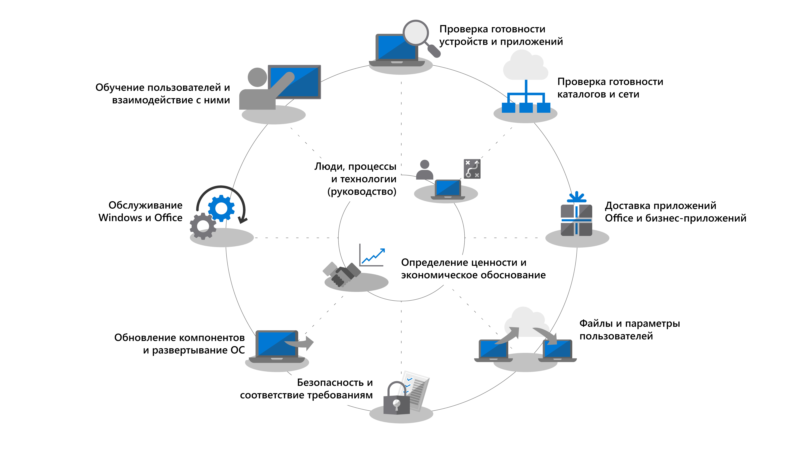
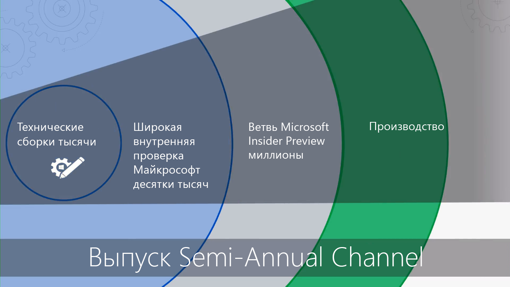

# Начало работы. Развертывание компьютеров

<table>
<thead>
<td></td>
<td>
<strong>Начало работы. Руководство по пользователям, процессу и технологии</strong>

Узнайте о преимуществах Windows 10 и приложений Microsoft 365 для предприятий, о значительных изменениях и рекомендациях по сравнению с предыдущими развертываниями, а также советах по обеспечению плавного перехода на Windows 10 и приложения Microsoft 365 для предприятий.
</td>
<td></td>
</thead>
</table>

>[!NOTE]
>В этой серии мы объясним, как лучше всего использовать существующие инструменты, и ознакомим вас с новыми технологиями, службами и методами, использование которых стало возможным благодаря облаку.  Полный процесс развертывания для настольных ПК описан в статье [Центр развертывания компьютеров](https://aka.ms/HowToShift).
>

Добро пожаловать в Центр развертывания компьютеров, центральное место, где вы узнаете, как составить план и выполнить переход на Windows 10 и приложения Microsoft 365 для предприятий. Это позволит вам пользоваться преимуществами безопасного рабочего пространства на базе самых современных возможностей для продуктивной работы, работы в команде и взаимодействия.

Если вы еще не развернули новую среду на вашем компьютере, у нас есть для вас хорошие новости, потому что процесс развертывания был доработан. Такие пошлые проблемы, как совместимость приложений, сегодня вызывают гораздо меньше трудностей. Новые инструменты, а также получаемая из облака информация, позволят вам двигаться вперед увереннее, быстрее и эффективней, чем раньше.

В этом введении мы вкратце расскажем об изменениях и опишем процесс развертывания компьютеров. Вы ознакомитесь с рекомендуемыми этапами по переходу на Windows 10 и приложения Microsoft 365 для предприятий, подробно узнаете, как использовать существующие средства и процессы и в то же время применять современные технологии управления и подходы.

## Зачем нужно обновление?

Windows 10 в сочетании с умным облаком Майкрософт позволяет создать безопасную рабочую область с самыми широкими возможностями для пользователей и упростить поддерживающую инфраструктуру.

Одними из ключевых объектов современных практик управления являются устройства, на которых выполняется регулярное обновление компонентов. В этой серии вы узнаете о новых возможностях, которые предназначены для того, чтобы помочь вам перейти на Windows 10 и приложения Microsoft 365 для предприятий, выполняя своевременную установку полугодичных выпусков для обоих продуктов.

[Windows 10 для ИТ-специалистов](https://www.microsoft.com/itpro/windows-10)

[Приложения Microsoft 365 для предприятий на предприятии](https://docs.microsoft.com/deployoffice/about-office-365-proplus-in-the-enterprise)

## Изменения

Рассмотрим вначале, что изменилось и улучшилось после вашего последнего развертывания компьютеров. Если вы давно не переходили на новую компьютерную среду, то, вероятно, используете Windows 7 и Office 2010 или Office 2013. Если это так, то с момента вашего последнего значительного обновления многое улучшилось. Ниже перечислены некоторые главные изменения.

**Удостоверения и доступ.** Windows 10 и приложения Microsoft 365 для предприятий с подключением к облачным службам для продуктивной работы, безопасности и управления имеют в своей основе новую службу удостоверений и управления: Azure Active Directory (Azure AD). Это позволяет использовать единый вход и безопасное подключение ко всем облачным службам, что означает, что если вы собираетесь использовать преимущества таких служб Microsoft 365, как Office 365, Intune или Windows Autopilot, вам потребуется Azure AD.

[Microsoft 365](https://www.microsoft.com/microsoft-365/default.aspx)

**Безопасная предзагрузочная среда.** На смену BIOS идет встроенная 64-битная прошивка UEFI. Это не только ускоряет загрузку, но и является необходимым условием для использования многих современных средств безопасности Windows 10. Хотя Windows 10 будет запускаться на BIOS, настоятельно рекомендуется использовать UEFI. Если вы не перешли с BIOS на UEFI с 64-разрядной версией, сейчас самое подходящее время. Существуют инструменты, которые позволяют выполнить этот переход либо во время обновления Windows 10, либо после него.

**Облачное управление устройством.** Такие службы, как Microsoft Intune, помогают управлять устройствами под Windows 10 также, как вы уже управляете другими мобильными устройствами, в одном месте. Microsoft Intune предоставляет уникальную возможность совместного управления вашими устройствами под Windows 10 с помощью Microsoft Endpoint Configuration Manager. Используйте Configuration Manager во время перехода на Windows 10, а затем добавьте Microsoft Intune. При совместной работе Microsoft Endpoint Configuration Manager становится интеллектуальным центром внутри вашей организации, подключенным к интеллектуальному облаку Майкрософт. Это позволяет обеспечить безопасность управления устройствами ваших пользователей, где бы они ни находились, например, при подключении к инфраструктуре вашей организации или при использовании общедоступного облака.

[Совместное управление устройствами с Windows 10](https://docs.microsoft.com/configmgr/core/clients/manage/co-management-overview)

**Облачная служба развертывания.** Для покупателей новых ПК мы представили новую облачную службу для развертывание устройств Microsoft 365 под названием служба Windows AutoPilot Deployment. AutoPilot интегрирован с поставщиками оборудования, и новый ПК автоматически регистрируется в Autopilot, что позволяет доставлять новый ПК непосредственно конечному пользователю. При первом включении ПК выполняется быстрая настройка в соответствии с конфигурацией вашей организации и адаптируется под конкретные потребности пользователя.

[Windows Autopilot](https://www.microsoft.com/windowsforbusiness/windows-autopilot)

**Развертывания по типу "нажми и работай".** При подготовке классических приложений Office предпочтительным вариантом являются приложения Microsoft 365 для предприятий. Это обеспечивает доступ к самым последним возможностям в Office по мере их разработки, поэтому вам не нужно будет ждать годы, прежде чем вы получите новые возможности. Также вы получите новую установку под названием "нажми и работай".

Технология "нажми и работай" существенно отличается от пакетов на базе MSI, использовавшихся ранее. Технология "нажми и работай" работает легче и быстрее, поддерживает обновления в фоновом режиме, чтобы ваши пользователи могли быстро приступить к работе. Это по-прежнему локальная копия Office, и вы можете продолжить использовать существующие средства развертывания, например Microsoft Endpoint Configuration Manager, чтобы подготовить и настроить приложения.

[Руководство по развертыванию приложений Microsoft 365 для предприятий](https://docs.microsoft.com/DeployOffice/deployment-guide-for-office-365-proplus)

**Обновления раз в полгода.** После перехода на Windows 10 и приложения Microsoft 365 для предприятий обновления с новыми возможностями предоставляются каждые полгода. Но с Майкрософт, которая будет предоставлять информацию из облака, вы сможете быстро и надежно развернуть эти обновления на сотни или тысячи устройств. Как обновление «на месте», обновление компонентов сохраняет приложения, данные и конфигурации из предыдущего выпуска.

## Процесс развертывания

Прежде чем приступить к работе, могут понадобиться план высокого уровня и люди, которые будут поддерживать переход. Наш процесс развертывания выделяет критические шаги, которые помогут вам определиться с ключевыми участниками группы и ресурсами для управления в следующих областях развертывания.

**[Шаг 1: Готовность устройства и приложения](https://aka.ms/mdd1) ** Для успешного развертывания нужно знать, что вы имеете. Это значит, что необходимо создать ведомость устройств и приложений и подтвердить их совместимость. Быстрее справиться с этой задачей вам помогут инструменты, доступные в нашей облачной службе "Аналитика компьютеров". Аналитика компьютеров позволяет пользоваться данными логики совместимости и диагностики, полученными от сотен миллионов ПК, для оценки приложений и драйверов, работающих на вашем устройстве, чтобы вы могли определить готовность ваших компьютеров. Вы можете даже экспортировать список "ПК, готовые к развертыванию" из Аналитики компьютеров для Configuration Manager, если вы используете этот инструмент, что позволит создать основанные на данных наборы целевых ПК по мере их подготовки.

[Начало работы со средством "Проверка готовности к обновлению"](https://docs.microsoft.com/windows/deployment/upgrade/upgrade-readiness-get-started)

**[Шаг 2: Готовность каталога сети](https://aka.ms/mdd2) ** Если вы еще этого не сделали, вам может понадобиться внедрение Azure Active Directory для дальнейшего управления идентификацией и доступом. Вам также может понадобиться подготовка сети для перемещения системных изображений, пакетов приложения, файлов пользователя и обновления по сети. Это подразумевает большой объем дополнительных данных; ваша сеть должна обладать способностью справится с дополнительной нагрузкой без влияния на повседневную работу вашей организации. Существует целый ряд возможностей по оптимизации сети, начиная с регулирования пропускной способности и одноранговой сети и заканчивая динамической очисткой полосы пропускания и разностное обновление.

[BranchCache и одноранговый кэш](https://blogs.technet.microsoft.com/swisspfe/2018/01/25/branch-cache-vs-peer-cache/)

**[Шаг 3: Office и доставка бизнес-приложения](https://aka.ms/mdd3) ** Хотя Windows еще поддерживает установку с помощью MSI, теперь также поддерживаются новые механизмы установки, оптимизированные для автоматического развертывания и непрерывного обновления. Клиенты приложений Microsoft 365 для предприятий и Office 2019 используют технологию установки "нажми и работай". Вы можете сделать доступным диапазон приложений UWP, а также обнаружить, что вам все больше и больше приходится развертывать сторонние приложения и собственные бизнес-приложения, использующие новые приложения на основе пакетов MSIX. Этот шаг гарантирует, что ваши приложения готовы для автоматического развертывания, и что вы выполните успешную настройку, если ваши приложения развертываются с помощью технологии "нажми и работай", MSIX традиционной MSI, либо это приложения UWP, развернутые из Microsoft Store для бизнеса.

[Общие сведения о MSIX](https://blogs.msdn.microsoft.com/sgern/2018/06/15/msix-intro/)

**[Шаг 4. Перенос файлов и параметров пользователя.](https://aka.ms/mdd4)** Это критический этап в любом цикле замены или обновления компьютеров: файлы, данные и параметры пользователей нужно перенести и сохранить при миграции. Этот шаг охватывает варианты ручной или автоматизированной миграции, включая хорошо известные и новые.

Как и в предыдущих обновлениях, средство миграции пользовательской среды остается ценным инструментом для автоматизации этого процесса и оно останется неотъемлемой частью миграции, осуществляемой с помощью Microsoft Endpoint Configuration Manager или Microsoft Deployment Toolkit. Однако перемещение данных в процессе миграции может стать узким горлышком в отношении скорости замены ПК из-за физических ограничений, которые действуют при переносе иногда сотен гигабайт для одного ПК дважды - сначала с существующего компьютера, а затем обратно на новый компьютер. Новый параметр OneDrive, перенос известных папок, позволяет синхронизировать документы пользователя, изображения и файлы на компьютере в большом масштабе, в облако или перед развертыванием.

[Перенаправление и перенос известных папок Windows в OneDrive](https://docs.microsoft.com/onedrive/redirect-known-folders)

**[Шаг 5. Безопасность и соответствие требованиям.](https://aka.ms/mdd5)** В этой области произошло много позитивных изменений с переходом на Windows 10 и приложения Microsoft 365 для предприятий. Важно ознакомиться с новыми встроенными функциями и сравнить их с уже существующими. Например, новые средства безопасности Windows 10 на основе виртуализации могут предотвратить кражу учетных данных, защитить от браузерных эксплойтов и выполнения вредоносного кода, изолируя процессы ядра и секреты от операционной системы. Кроме того, облачные службы, такие как Advanced Threat Protection, предоставляют унифицированную платформу для укрепления безопасности, выявления нарушений, расследования и реагирования. Advanced Threat Protection также обеспечивает защиту от вредоносных вложений электронной почты, небезопасных гиперссылок и других угроз.

[Microsoft Security](https://www.microsoft.com/security/default.aspx)

**[Шаг 6. Развертывание ОС и обновления компонентов.](https://aka.ms/mdd6)** Когда все будет готово, переходите к следующему шагу — развертыванию образов ОС. Большой объем работ при этом можно выполнить с помощью последовательностей и инфраструктуры System Center Configuration Manager. Рекомендуется сначала определить целевую группу первых пользователей организации и выполнить развертывание в ней, используя репрезентативную набор оборудования и приложений. После этого можно использовать данные, полученные от этих устройств и пользователей, для постепенного охвата все большего количества компьютеров.

[Знакомство с развертыванием операционной системы в Configuration Manager](https://docs.microsoft.com/configmgr/osd/understand/introduction-to-operating-system-deployment)

**[Шаг 7: Windows и Office как услуга](https://aka.ms/mdd7) ** Этот шаг представляет важный сдвиг в том, как вы поддерживаете компьютерные ресурсы пользователей. Во время перехода на Windows 10 и приложения Microsoft 365 для предприятий вы можете перейти к управлению Windows и Office как услугой. Вместо масштабного перехода на новые технологии каждые несколько лет вы будет постоянно получать новые возможности, интерфейсы и средства защиты пользователей. Обновления один раз в полгода будут предоставлять новые возможности осенью и весной каждый год, а ежемесячные накопительные обновления с исправлениями будут содержать исправления проблем с безопасностью надежностью и прочих ошибок. Вы можете отказаться от развертывания клиента Office 2019, но мы настоятельно рекомендуем перейти на приложения Microsoft 365 для предприятий. Он использует похожий план обслуживания для Windows, поэтому ваши пользователи будут получать обновления приложений Office на регулярной основе.

[Общие сведения о Windows как услуга](https://docs.microsoft.com/windows/deployment/update/waas-overview)
[Общие сведения об Office как услуге](https://docs.microsoft.com/DeployOffice/overview-of-update-channels-for-office-365-proplus)

**[Шаг 8: Коммуникация с пользователем и обучение](https://aka.ms/mdd8) ** Этот последний шаг имеет критическое значение для привлечения внимания к новым возможностям для улучшения командной работы, общения, безопасности и многого другого. Перед широким развертыванием, которое затронет пользователей, не входящих в круг первых пользователей, мы рекомендуем организовать коммуникацию с пользователями и обучение. Это поможет вам подтолкнуть изменения в том, как люди используют новые возможности в Office, Windows или другие бизнес-приложения и службы. Чтобы помочь вам в этом, мы предоставляем бесплатное обучение онлайн через Microsoft FastTrack. Кроме того, мы опубликовали бесплатные примеры планов и сроков коммуникации вместе с шаблонами электронных писем, сообщений в социальных сетях и интрасети, которые должны помочь вам развернуть Windows 10. Как организация, использующая Microsoft 365, ваша организация также может иметь право на получение прямой поддержки.

## Следующий этап

Теперь вы знаете, какие новые возможности и отличия имеют Windows 10 и приложения Microsoft 365 для предприятий. Мы ознакомились с рекомендуемым процессом развертывания. Вооружившись подробным руководством и инструментами для перехода на Windows 10 и приложения Microsoft 365 для предприятий, мы можем приступать к работе.

## [Шаг 1. Проверка готовности устройств и приложений](https://aka.ms/mdd1)

