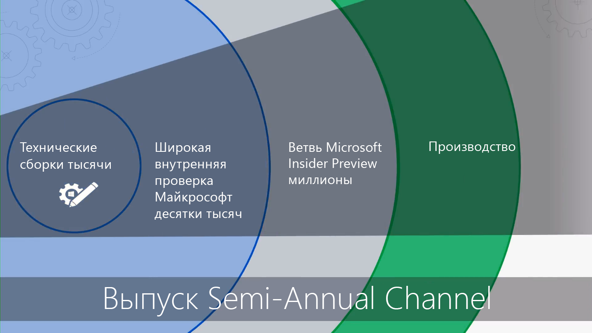

# Начало работы. Развертывание компьютеровGetting Started - Desktop Deployment

<table>
<thead>
<td></td>
<td>
<strong>Начало работы. Руководство по пользователям, процессу и технологии</strong><strong>Getting Started: People, Process and Technology Guidance</strong>

Узнайте о преимуществах Windows 10 и Office 365 профессиональный плюс, значительных изменениях и рекомендациях по сравнению с предыдущими развертываниями, а также советах по обеспечению плавного перехода на Windows 10 и Office 365 профессиональный плюс.Discover the benefits of Windows 10 and Office 365 ProPlus, major changes and considerations versus previous deployments, and best practices to ensure a smooth transition to Windows 10 and Office 365 ProPlus.
</td>
<td></td>
</thead>
</table>

>[!NOTE]
>В этой серии мы объясним, как лучше всего использовать существующие инструменты, и ознакомим вас с новыми технологиями, службами и методами, использование которых стало возможным благодаря облаку.In this series we will explain the best ways to use existing tools and introduce you to new technologies, services, and methods enabled by the Cloud.  Полный процесс развертывания для настольных ПК описан в [Центре развертывания современных компьютеров](https://aka.ms/HowToShift).To see the full desktop deployment process, visit the [Desktop Deployment Center](https://aka.ms/HowToShift).
>

Добро пожаловать в Центр развертывания компьютеров, центральное место, где вы узнаете, как составить план и выполнить переход на Windows 10 и Office 365 профессиональный плюс.Welcome to the Desktop Deployment Center, our central place to learn how to help you plan and make the shift to Windows 10 and Office 365 ProPlus. Это позволит вам пользоваться преимуществами безопасного рабочего пространства на базе самых современных возможностей для продуктивной работы, работы в команде и взаимодействия.This will allow you take advantage of a secure workspace, powered by the latest productivity, teamwork, and collaboration experiences.

Если вы еще не развернули новую среду на вашем компьютере, у нас есть для вас хорошие новости, потому что процесс развертывания был доработан.If you haven’t deployed a new desktop environment for a while, the good news is much about the deployment process has improved. Такие пошлые проблемы, как совместимость приложений, сегодня вызывают гораздо меньше трудностей.Challenges of the past, such as application compatibility, are much less of an issue today. Новые инструменты, а также получаемая из облака информация, позволят вам двигаться вперед увереннее, быстрее и эффективней, чем раньше.New tools, as well as insight delivered from the Cloud, enable you to move forward with confidence faster and more efficiently than ever before.

В этом введении мы вкратце расскажем об изменениях и опишем процесс развертывания компьютеров. Вы ознакомитесь с рекомендуемыми этапами по переходу на Windows 10 и Office 365 профессиональный плюс, подробно узнаете, как использовать существующие средства и процессы и в то же время применять современные технологии управления и подходы.In this introduction we’ll outline what has changed and go on a tour of the Desktop Deployment Wheel. This will guide you through the recommended steps for your shift to Windows 10 and Office 365 ProPlus, detailing how to leverage your existing tools and processes while adopting modern management technology and approaches along the way.

## Зачем нужно обновление?Why upgrade?

Windows 10 в сочетании с умным облаком Майкрософт позволяет создать безопасную рабочую область с самыми широкими возможностями для пользователей и упростить поддерживающую инфраструктуру.In combination, Windows 10 and the Microsoft Intelligence Cloud enhance your ability to deliver the most empowering and secure workspace for your users while allowing you to simplify your supporting infrastructure.

Одними из ключевых объектов современных практик управления являются устройства, на которых выполняется регулярное обновление компонентов.One of the key tenants of modern management practices is devices that are always up-to-date. В этой серии вы узнаете о новых возможностях, которые предназначены для того, чтобы помочь вам перейти на Windows 10 и Office 365 профессиональный плюс, выполняя своевременную установку полугодичных выпусков для обоих продуктов.Through this series you will read about new capabilities that are being delivered to help you move to Windows 10 and Office 365 ProPlus while staying current with the semi-annual releases of both.

[Windows 10 для ИТ-специалистовWindows 10 for the IT Pro](https://www.microsoft.com/en-us/itpro/windows-10)

  [Office 365 профессиональный плюс на предприятии](https://docs.microsoft.com/ru-RU/deployoffice/about-office-365-proplus-in-the-enterprise)[About Office 365 ProPlus in the enterprise](https://docs.microsoft.com/en-us/deployoffice/about-office-365-proplus-in-the-enterprise)

## ИзмененияWhat has Changed

Рассмотрим вначале, что изменилось и улучшилось после вашего последнего развертывания компьютеров. Если вы давно не переходили на новую компьютерную среду, то, вероятно, используете Windows 7 и Office 2010 или Office 2013. Если это так, то с момента вашего последнего значительного обновления многое улучшилось. Ниже перечислены некоторые главные изменения.Let’s start by taking a look at what has changed and improved since your last desktop deployment. If you haven’t shifted your desktop environment in a while you’re likely using Windows 7 and Office 2010 or Office 2013. If you are, you'll notice a few things have evolved since your last major upgrade. Here are some of the core changes:

**Удостоверения и доступ.** Windows 10 и Office 365 профессиональный плюс с подключением к облачным службам для продуктивной работы, безопасности и управления имеют в своей основе новую службу удостоверений и управления: Azure Active Directory (Azure AD).**Identity and Access:** Windows 10 and Office 365 ProPlus, with its connectivity to cloud productivity, security, and management services, has a new Identity and Access Management service at its core: Azure Active Directory (Azure AD). Это позволяет использовать единый вход и безопасное подключение ко всем облачным службам, что означает, что если вы собираетесь использовать преимущества таких служб Microsoft 365, как Office 365, Intune или Windows Autopilot, вам потребуется Azure AD.This enables single sign-on and secure connectivity across your cloud services, meaning that you are going to need Azure AD in place to take advantage of Microsoft 365 services such as Office 365, Intune, or Windows Autopilot.

[Microsoft 365Microsoft 365](https://www.microsoft.com/en-us/microsoft-365/default.aspx)

**Безопасная предзагрузочная среда.** На смену BIOS идет встроенная 64-битная прошивка UEFI.**Secure Pre-Boot Environment:** 64-bit UEFI firmware replaces BIOS. Это не только ускоряет загрузку, но и является необходимым условием для использования многих современных средств безопасности Windows 10.This not only speeds up boot times, it is required to enable many of the modern security capabilities in Windows 10. Хотя Windows 10 будет запускаться на BIOS, настоятельно рекомендуется использовать UEFI.While Windows 10 will run on BIOS, UEFI is strongly recommended. Если вы не перешли с BIOS на UEFI с 64-разрядной версией, сейчас самое подходящее время.If you have not switched from BIOS to UEFI and leveraging 64-bit, now is the time. Существуют инструменты, которые позволяют выполнить этот переход либо во время обновления Windows 10, либо после него.There are tools to help you make this switch either during a Windows 10 upgrade, or after it.

**Облачное управление устройством.** Такие службы, как Microsoft Intune, помогают управлять устройствами под Windows 10 также, как вы уже управляете другими мобильными устройствами, в одном месте.**Cloud-based device Management:** Services like Microsoft Intune help you manage your Windows 10 devices as you do other mobile devices, all from one place. Microsoft Intune предоставляет уникальную возможность совместного управления вашими устройствами под Windows 10 с помощью System Center Configuration Manager.What makes Microsoft Intune unique is the ability to co-manage your Windows 10 devices with System Center Configuration Manager. Используйте System Center Configuration Manager во время перехода на Windows 10, а затем добавьте Microsoft Intune.You can use System Center Configuration Manager to help you in your shift to Windows 10, and then add Microsoft Intune. При совместной работе System Center Configuration Manager становится интеллектуальным центром внутри вашей организации, подключенным к интеллектуальному облаку Microsoft.Working together, System Center Configuration Manager becomes the intelligent edge within your organization, connected to the Microsoft intelligent cloud. Это позволяет обеспечить безопасность управления устройствами ваших пользователей, где бы они ни находились, например, при подключении к инфраструктуре вашей организации или при использовании общедоступного облака.This allows you to manage your users’ devices securely wherever they are, whether connected on your organization’s infrastructure or in the public cloud.

  [Совместное управление устройствами с Windows 10](https://docs.microsoft.com/ru-RU/sccm/core/clients/manage/co-management-overview)[Co-management for Windows 10 devices](https://docs.microsoft.com/en-us/sccm/core/clients/manage/co-management-overview)

**Облачная служба развертывания.** Для покупателей новых ПК мы представили новую облачную службу для развертывание устройств Microsoft 365 под названием служба Windows AutoPilot Deployment.**Cloud-based Deployment Service:** As you acquire new PCs we’ve introduced a new cloud service to help you deploy Microsoft 365 devices called the Windows Autopilot deployment service. AutoPilot интегрирован с поставщиками оборудования, и новый ПК автоматически регистрируется в Autopilot, что позволяет доставлять новый ПК непосредственно конечному пользователю.Autopilot is integrated with your hardware providers and new PCs are automatically registered in Autopilot enabling the new PC to be shipped directly to the end-user. При первом включении ПК выполняется быстрая настройка в соответствии с конфигурацией вашей организации и адаптируется под конкретные потребности пользователя.When the PC is powered on the first time it is quickly configured to your organizations desired configuration and customized for the specific needs of the user.

[Windows AutopilotWindows Autopilot](https://www.microsoft.com/en-us/windowsforbusiness/windows-autopilot)

**Развертывания по типу "нажми и работай".** При подготовке классических приложений Office, Office 365 профессиональный плюс является предпочтительным вариантом.**Click-to-Run Deployments:** When provisioning Office desktop apps, Office 365 ProPlus is the preferred option. Это обеспечивает доступ к самым последним возможностям в Office по мере их разработки, поэтому вам не нужно будет ждать годы, прежде чем вы получите новые возможности.This gives you access to the newest innovations in Office as they are developed, so you won’t need to wait years before getting new capabilities. Также вы получите новую установку под названием "нажми и работай".You’ll also use a new installation called Click-to-Run.

Технология "Нажми и работай" существенно отличается от пакетов на базе MSI, использовавшихся ранее.Click-to-Run is quite different from the MSI-based packages of the past. Технология "Нажми и работай" работает легче и быстрее, поддерживает обновления в фоновом режиме, чтобы ваши пользователи могли быстро приступить к работе.Click-to-Run is faster, lighter, and supports updates in the background to keep your users to be up and running. Это по-прежнему локальная копия Office, и вы можете продолжить использовать существующие средства развертывания, например System Center Configuration Manager, чтобы подготовить и настроить приложения.It is still a local copy of Office and you can continue to use your existing deployment tools, like System Center Configuration Manager, to provision and configure the apps.

  [Руководство по развертыванию Office 365 профессиональный плюс](https://docs.microsoft.com/ru-RU/DeployOffice/deployment-guide-for-office-365-proplus)[Deployment guide for Office 365 ProPlus](https://docs.microsoft.com/en-us/DeployOffice/deployment-guide-for-office-365-proplus)

**Обновления раз в полгода.** После перехода на Windows 10 и Office 365 профессиональный плюс, обновления с новыми возможностями предоставляются каждые полгода.**Semi-Annual Updates:** Once you have moved to Windows 10 and Office 365 ProPlus, updates are delivered semi-annually with new features. Но с Майкрософт, которая будет предоставлять информацию из облака, вы сможете быстро и надежно развернуть эти обновления на сотни или тысячи устройств.But with Microsoft able to deliver insights from the cloud to help, you can quickly and confidently roll out these updates to hundreds or thousands of devices. Как обновление «на месте», обновление компонентов сохраняет приложения, данные и конфигурации из предыдущего выпуска.Like an in-place upgrade, the Feature Update preserves apps, data, and configurations from the previous release.

## Процесс развертыванияThe Deployment Process Wheel

Прежде чем приступить к работе, могут понадобиться план высокого уровня и люди, которые будут поддерживать переход.Before you get started, you’ll want to create a high-level plan and get the necessary sponsors on board. Наш процесс развертывания выделяет критические шаги, которые помогут вам определиться с ключевыми участниками группы и ресурсами для управления в следующих областях развертывания.Our deployment process wheel outlines critical steps to help you to identify core team members and resources to manage in the following deployment areas.

\*\*[Шаг 1: Готовность устройства и приложения](https://aka.ms/mdd1) \*\* Для успешного развертывания нужно знать, что вы имеете.**[Step 1: Device and App readiness](https://aka.ms/mdd1)** For a successful deployment you must first know what you have. Это значит, что необходимо создать ведомость устройств и приложений и подтвердить их совместимость.That means taking an inventory of your devices and apps and verifying compatibility. Быстрее справиться с этой задачей вам помогут инструменты Windows Analytics, доступные в нашей облачной службе.To help with this you can leverage the tools available in our cloud-based service, Windows Analytics. Windows Analytics позволяет пользоваться данными логики совместимости и диагностики, полученные от сотен миллионов ПК, для оценки приложений и драйверов, работающих на вашем устройстве, чтобы вы могли оценить готовность парка компьютерной техники.Windows Analytics allows you tap into compatibility intelligence and diagnostic data gathered from hundreds of millions of PCs, to assess the apps and drivers running on your device so you can establish the readiness of your desktop estate. Вы можете даже экспортировать список «ПК, готовых к развертыванию» из Windows Analytics для System Center Configuration Manager, если вы используете этот инструмент, что позволит создать основанные на данных наборы заданных ПК по мере их приготовления к развертыванию.You can even export a list of “PCs ready for deployment” from Windows Analytics to System Center Configuration Manager if you use it, allowing you to build data-driven collections of targeted PCs as they become ready.

  [Начало работы со средством "Проверка готовности к обновлению"](https://docs.microsoft.com/ru-RU/windows/deployment/upgrade/upgrade-readiness-get-started)[Get started with Upgrade Readiness](https://docs.microsoft.com/en-us/windows/deployment/upgrade/upgrade-readiness-get-started)

\*\*[Шаг 2: Готовность каталога сети](https://aka.ms/mdd2) \*\* Если вы еще этого не сделали, вам может понадобиться внедрение Azure Active Directory для дальнейшего управления идентификацией и доступом.**[Step 2: Directory and Network Readiness](https://aka.ms/mdd2)** If you haven’t already, you’ll want to implement Azure Active Directory for identity and access management next. Вам также может понадобиться подготовка сети для перемещения системных изображений, пакетов приложения, файлов пользователя и обновления по сети.You will also want to prepare your network for the movement of system images, application packages, user files, and updates across it. Это подразумевает большой объем дополнительных данных; ваша сеть должна обладать способностью справится с дополнительной нагрузкой без влияния на повседневную работу вашей организации.That means a large amount of additional data; your network must have the capacity to handle this extra load without impact to the day-to-day work of your organization. Существует целый ряд возможностей по оптимизации сети, начиная с регулирования пропускной способности и одноранговой сети и заканчивая динамической очисткой полосы пропускания и разностное обновление.We have a range of networking optimizations available from bandwidth throttling and peer-to-peer options to dynamic bandwidth scavenging and differential updating.

[BranchCache и одноранговый кэшBranchCache vs. Peer Cache](https://blogs.technet.microsoft.com/swisspfe/2018/01/25/branch-cache-vs-peer-cache/)

\*\*[Шаг 3: Office и доставка бизнес-приложения](https://aka.ms/mdd3) \*\* Хотя Windows еще поддерживает установку с помощью MSI, теперь также поддерживаются новые механизмы установки, оптимизированные для автоматического развертывания и непрерывного обновления.**[Step 3: Office and Line of Business App Delivery](https://aka.ms/mdd3)** While Windows continues to support MSI-based installations it also now supports newer installations mechanisms, optimized for automated deployment and continuous updates. Клиенты Office 365 профессиональный плюс и Office 2019 г. используют технологию установки "нажми и работай".Office 365 ProPlus and Office 2019 clients use Click-to-Run installation technology. Вы можете сделать доступным диапазон приложений UWP, а также обнаружить, что вам все больше и больше приходится развертывать сторонние приложения и собственные бизнес-приложения, использующие новые приложения на основе пакетов MSIX.You may want to make a range of UWP apps available, and you may increasingly find yourself deploying third-party apps and in-house developed Line of Business Apps that use the new MSIX-based packaging apps. Этот шаг гарантирует, что ваши приложения готовы для автоматического развертывания, и что вы выполните успешную настройку, если ваши приложения развертываются с помощью технологии "нажми и работай", MSIX традиционной MSI, либо это приложения UWP, развернутые из Microsoft Store для бизнеса.This step ensures your apps are ready for automated deployments, and that you are set up for success whether your apps deploy using Click-to-Run, MSIX, conventional MSI-based, or are UWP apps deployed from a Microsoft Store from Business you set up.

[Общие сведения о MSIXMSIX Intro](https://blogs.msdn.microsoft.com/sgern/2018/06/15/msix-intro/)

**[Шаг 4. Перенос файлов и параметров пользователя.](https://aka.ms/mdd4)** Это критический этап в любом цикле замены или обновления компьютеров: файлы, данные и параметры пользователей нужно перенести и сохранить при миграции.**[Step 4: User Files and Settings Migration](https://aka.ms/mdd4)** This is a critical step in any PC replacement or refresh cycle: you have to ensure users’ files, data, and settings move successfully and are preserved over the migration. Этот шаг охватывает варианты ручной или автоматизированной миграции, включая хорошо известные и новые.This step covers the options available for manual or automated migrations, including well-known and new options.

Как и в предыдущих обновлениях, средство миграции пользовательской среды остается ценным инструментом для автоматизации данного процесса и оно останется неотъемлемой частью миграции, организуемой с помощью System Center Configuration Manager или Microsoft Deployment Toolkit.As in previous upgrades, the User State Migration Tool continues to be a valuable tool to automate this process and it remains an integral part of migrations orchestrated using System Center Configuration Manager or the Microsoft Deployment Toolkit. Однако перемещение данных в процессе миграции может стать узким горлышком в отношении скорости замены ПК из-за физических ограничений, которые действуют при переносе иногда сотен гигабайт для одного ПК дважды - сначала с существующего компьютера, а затем обратно на новый компьютер.But moving all this data at migration can be a timing bottleneck for PC replacement due to the physics involved in transferring sometimes hundreds of gigabytes per PC twice – first from the existing desktop, then back down to the new desktop. Новый параметр OneDrive, перенос известных папок, позволяет синхронизировать документы пользователя, изображения и файлы на компьютере в большом масштабе, в облако или перед развертыванием.A new option enabled by OneDrive is Known Folder Move used to sync user documents, pictures, and desktop files at scale, in the cloud, and ahead of deployment.

  [Перенаправление и перенос известных папок Windows в OneDrive](https://docs.microsoft.com/ru-RU/onedrive/redirect-known-folders)[Redirect and move Windows known folders to OneDrive](https://docs.microsoft.com/en-us/onedrive/redirect-known-folders)

**[Шаг 5. Безопасность и соответствие требованиям.](https://aka.ms/mdd5)** В этой области произошло много позитивных изменений с переходом на Windows 10 и Office 365 профессиональный плюс. Важно ознакомиться с новыми встроенными функциями и сравнить их с уже имеющимися. Например, новые возможности Windows 10, в частности средства безопасности на основе виртуализации, могут предотвратить кражу учетных данных, защитить от браузерных эксплойтов и выполнения вредоносных кодов, изолируя процессы ядра и секретны от операционной системы. Кроме того, такие облачные службы, как Advanced Threat Protection, предоставляют унифицированную платформу для усиления безопасности, выявления нарушений, расследований и реагирования. Advanced Threat Protection может также защитить от вредоносных вложений электронной почты, небезопасных гиперссылок и других угроз.**[Step 5: Security and Compliance](https://aka.ms/mdd5)** Security and Compliance is an area with a lot upside when moving to Windows 10 and Office 365 ProPlus. It is important you familiarize yourself with the new built-in capabilities and compare that with what you already have. For example, new capabilities in Windows 10 using virtualization-based security can prevent credential theft, protect against browser-based exploits and malicious code execution by isolating core processes and secrets from the operating system. In addition, cloud services like Advanced Threat Protection give you a unified platform for security hardening, post-breach detection, investigation, and response. Advanced Threat Protection can also safeguard you against malicious email attachments, unsafe hyperlinks and more.

[Microsoft SecurityMicrosoft Security](https://www.microsoft.com/en-us/security/default.aspx)

**[Шаг 6. Развертывание ОС и обновления компонентов.](https://aka.ms/mdd6)** Когда все будет готово, переходите к следующему шагу — развертыванию образов ОС. Большой объем работ при этом можно выполнить с помощью последовательностей и инфраструктуры System Center Configuration Manager. Рекомендуется сначала определить целевую группу первых пользователей организации и выполнить развертывание в ней, используя репрезентативную набор оборудования и приложений. После этого можно использовать данные, полученные от этих устройств и пользователей, для постепенного охвата все большего количества компьютеров.**[Step 6: OS Deployment and Feature Updates](https://aka.ms/mdd6)** With everything prepared, the next step is to deploy the OS images. A lot of the heavy lifting for can be done using System Center Configuration Manage task sequences and infrastructure. The recommended approach is to deploy in phases, first targeting and deploying to an “early adopter group” in your organization using a representative set of hardware and apps. You can then use the data from those devices and users to gradually target more and more PCs.

  [Знакомство с развертыванием операционной системы в System Center Configuration Manager](https://docs.microsoft.com/ru-RU/sccm/osd/understand/introduction-to-operating-system-deployment)[Introduction to operating system deployment in System Center Configuration Manager](https://docs.microsoft.com/en-us/sccm/osd/understand/introduction-to-operating-system-deployment)

\*\*[Шаг 7: Windows и Office как служба](https://aka.ms/mdd7) \*\* Этот шаг представляет важный сдвиг в том, как вы поддерживаете компьютерные ресурсы пользователей.**[Step 7: Windows and Office as a Service](https://aka.ms/mdd7)** This represents a major shift in the way you maintain users’ desktop real-estate. Во время перехода на Windows 10 и Office 365 профессиональный плюс вы можете перейти к управлению Windows и Office как службой.With this move to Windows 10 and Office 365 ProPlus you can move to managing Windows and Office as a service. Вместо масштабного перехода на новые технологии каждые несколько лет вы будет постоянно получать новые возможности, интерфейсы и средства защиты пользователей.In place of a massive shift in technology every few years, you will continually be bringing new capabilities, experiences, and protections to your user. Обновления один раз в полгода будут предоставлять новые возможности осенью и весной каждый год, а ежемесячные накопительные обновления с исправлениями будут содержать исправления проблем с безопасностью надежностью и прочих ошибок.Semi-annual feature updates deliver new capabilities in the Fall and Spring of each year, while monthly cumulative Quality Updates will contain security, reliability, and bug fixes. Хотя вы можете отказаться от развертывания клиента Office 2019, мы настоятельно рекомендуем перейти на Office 365 профессиональный плюс.While you can opt to deploy the Office 2019 client, we strongly recommend you to move to Office 365 ProPlus. Он использует похожий план обслуживания для Windows, поэтому ваши пользователи будут получать обновления приложений Office на регулярной основе.This follows a similar service plan to Windows so your users get updates to the Office apps on a regular basis too.

  [Общие сведения о Windows как услуга](https://docs.microsoft.com/ru-RU/windows/deployment/update/waas-overview)
[Общие сведения об Office как услуге](https://docs.microsoft.com/ru-RU/DeployOffice/overview-of-update-channels-for-office-365-proplus)[Overview of Windows as a service](https://docs.microsoft.com/en-us/windows/deployment/update/waas-overview)
[Overview of Office as a service](https://docs.microsoft.com/en-us/DeployOffice/overview-of-update-channels-for-office-365-proplus)

\*\*[Шаг 8: Коммуникация с пользователем и обучение](https://aka.ms/mdd8) \*\* Этот последний шаг имеет критическое значение для привлечения внимания к новым возможностям для улучшения командной работы, общения, безопасности и многого другого.**[Step 8: User Communications and Training](https://aka.ms/mdd8)** This last step is critical to driving usage of new capabilities for enhancing teamwork, communications, security, and more. Перед широким развертыванием, которое затронет пользователей, не входящих в круг первых пользователей, мы рекомендуем организовать коммуникацию с пользователями и обучение.Before broad deployment is targeted to users outside early adopter rings, we recommend you roll out user communication and training. Это поможет вам подтолкнуть изменения в том, как люди используют новые возможности в Office, Windows или другие бизнес-приложения и службы.This will help drive desired changes in how people use new capabilities in Office, Windows, or other line of business apps and services. Чтобы помочь вам в этом, мы предоставляем бесплатное обучение онлайн через Microsoft FastTrack.To assist, we provide free online training via Microsoft FastTrack. Кроме того, мы опубликовали бесплатные примеры планов и сроков коммуникации вместе с шаблонами электронных писем, сообщений в социальных сетях и интрасети, которые должны помочь вам развернуть Windows 10.Plus, we’ve published free sample communication plans and timelines together with email, social, and intranet templates to help with your rollout of Windows 10. Как организация, использующая Microsoft 365 или Office 365, ваша организация также может иметь право на получение прямой поддержки.As a Microsoft 365 or Office 365 organization, your organization may also be eligible for and direct support.

## Следующий этапNext Step

Теперь вы знаете, какие новые возможности и отличию имеют Windows 10 и Office 365 профессиональный плюс, и мы познакомились рекомендуемым процессом развертывания.Now you know what’s new and different in Windows 10 and Office 365 ProPlus, and we have walked through our recommended deployment process wheel. Вооружившись детальным руководством и инструментами для перехода на Windows 10 и Office 365 профессиональный, мы можем приступать к работе.With this taste for the end-to-end guidance and tools available for you to make the shift to Windows 10 and Office 365 ProPlus, let’s get started.

## [Шаг 1. Проверка готовности устройств и приложенийStep 1: Device and App Readiness](https://aka.ms/mdd1)

