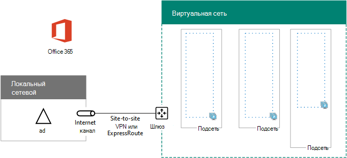

# <a name="high-availability-federated-authentication-phase-1-configure-azure"></a><span data-ttu-id="28193-103">Этап 1. Федеративная проверка подлинности для обеспечения высокой доступности: настройка Azure</span><span class="sxs-lookup"><span data-stu-id="28193-103">High availability federated authentication Phase 1: Configure Azure</span></span>

<span data-ttu-id="28193-104">На этом этапе вы создадите группы ресурсов, виртуальную сеть (VNet) и группы доступности в Azure, где будут размещаться виртуальные машины на этапах 2, 3 и 4.</span><span class="sxs-lookup"><span data-stu-id="28193-104">In this phase, you create the resource groups, virtual network (VNet), and availability sets in Azure that will host the virtual machines in phases 2, 3, and 4.</span></span> <span data-ttu-id="28193-105">Прежде чем переходить к разделу [Phase 2: Configure domain controllers](high-availability-federated-authentication-phase-2-configure-domain-controllers.md), необходимо завершить этот этап.</span><span class="sxs-lookup"><span data-stu-id="28193-105">You must complete this phase before moving on to [Phase 2: Configure domain controllers](high-availability-federated-authentication-phase-2-configure-domain-controllers.md).</span></span> <span data-ttu-id="28193-106">[В статье Развертывание федеративной проверки подлинности с высоким уровнем доступности для Microsoft 365 в Azure](deploy-high-availability-federated-authentication-for-microsoft-365-in-azure.md) для всех фаз.</span><span class="sxs-lookup"><span data-stu-id="28193-106">See [Deploy high availability federated authentication for Microsoft 365 in Azure](deploy-high-availability-federated-authentication-for-microsoft-365-in-azure.md) for all of the phases.</span></span>
  
<span data-ttu-id="28193-107">Azure необходимо подготовить к работе с этими основными компонентами:</span><span class="sxs-lookup"><span data-stu-id="28193-107">Azure must be provisioned with these basic components:</span></span>
  
- <span data-ttu-id="28193-108">Группы ресурсов</span><span class="sxs-lookup"><span data-stu-id="28193-108">Resource groups</span></span>
    
- <span data-ttu-id="28193-109">Нелокальная виртуальная сеть Azure с подсетями для размещения виртуальных машин Azure</span><span class="sxs-lookup"><span data-stu-id="28193-109">A cross-premises Azure virtual network (VNet) with subnets for hosting the Azure virtual machines</span></span>
    
- <span data-ttu-id="28193-110">Группы безопасности сети для изоляции подсети</span><span class="sxs-lookup"><span data-stu-id="28193-110">Network security groups for performing subnet isolation</span></span>
    
- <span data-ttu-id="28193-111">Группы доступности</span><span class="sxs-lookup"><span data-stu-id="28193-111">Availability sets</span></span>
    
## <a name="configure-azure-components"></a><span data-ttu-id="28193-112">Настройка компонентов Azure</span><span class="sxs-lookup"><span data-stu-id="28193-112">Configure Azure components</span></span>

<span data-ttu-id="28193-113">Перед настройкой компонентов Azure заполните указанные ниже таблицы.</span><span class="sxs-lookup"><span data-stu-id="28193-113">Before you begin configuring Azure components, fill in the following tables.</span></span> <span data-ttu-id="28193-114">Распечатайте этот раздел и запишите необходимую информацию или скопируйте его в документ и заполните там.</span><span class="sxs-lookup"><span data-stu-id="28193-114">To assist you in the procedures for configuring Azure, print this section and write down the needed information or copy this section to a document and fill it in.</span></span> <span data-ttu-id="28193-115">Укажите параметры виртуальной сети в таблице V.</span><span class="sxs-lookup"><span data-stu-id="28193-115">For the settings of the VNet, fill in Table V.</span></span>
  
|<span data-ttu-id="28193-116">**Элемент**</span><span class="sxs-lookup"><span data-stu-id="28193-116">**Item**</span></span>|<span data-ttu-id="28193-117">**Параметр конфигурации**</span><span class="sxs-lookup"><span data-stu-id="28193-117">**Configuration setting**</span></span>|<span data-ttu-id="28193-118">**Описание**</span><span class="sxs-lookup"><span data-stu-id="28193-118">**Description**</span></span>|<span data-ttu-id="28193-119">**Значение**</span><span class="sxs-lookup"><span data-stu-id="28193-119">**Value**</span></span>|
|:-----|:-----|:-----|:-----|
|<span data-ttu-id="28193-120">1.</span><span class="sxs-lookup"><span data-stu-id="28193-120">1.</span></span>  <br/> |<span data-ttu-id="28193-121">Имя виртуальной сети</span><span class="sxs-lookup"><span data-stu-id="28193-121">VNet name</span></span>  <br/> |<span data-ttu-id="28193-122">Имя виртуальной сети (например, FedAuthNet).</span><span class="sxs-lookup"><span data-stu-id="28193-122">A name to assign to the VNet (example FedAuthNet).</span></span>  <br/> |  <br/> |
|<span data-ttu-id="28193-124">2.</span><span class="sxs-lookup"><span data-stu-id="28193-124">2.</span></span>  <br/> |<span data-ttu-id="28193-125">Расположение виртуальной сети</span><span class="sxs-lookup"><span data-stu-id="28193-125">VNet location</span></span>  <br/> |<span data-ttu-id="28193-126">Региональный центр обработки данных Azure, в котором будет расположена виртуальная сеть.</span><span class="sxs-lookup"><span data-stu-id="28193-126">The regional Azure datacenter that will contain the virtual network.</span></span>  <br/> |  <br/> |
|<span data-ttu-id="28193-128">3.</span><span class="sxs-lookup"><span data-stu-id="28193-128">3.</span></span>  <br/> |<span data-ttu-id="28193-129">IP-адрес VPN-устройства</span><span class="sxs-lookup"><span data-stu-id="28193-129">VPN device IP address</span></span>  <br/> |<span data-ttu-id="28193-130">Общедоступный IPv4-адрес интерфейса VPN-устройства в Интернете.</span><span class="sxs-lookup"><span data-stu-id="28193-130">The public IPv4 address of your VPN device's interface on the Internet.</span></span>  <br/> |  <br/> |
|<span data-ttu-id="28193-132">4.</span><span class="sxs-lookup"><span data-stu-id="28193-132">4.</span></span>  <br/> |<span data-ttu-id="28193-133">Адресное пространство виртуальной сети</span><span class="sxs-lookup"><span data-stu-id="28193-133">VNet address space</span></span>  <br/> |<span data-ttu-id="28193-p103">Адресное пространство виртуальной сети. Чтобы определить это адресное пространство, обратитесь в ИТ-отдел.</span><span class="sxs-lookup"><span data-stu-id="28193-p103">The address space for the virtual network. Work with your IT department to determine this address space.</span></span>  <br/> |  <br/> |
|<span data-ttu-id="28193-137">5.</span><span class="sxs-lookup"><span data-stu-id="28193-137">5.</span></span>  <br/> |<span data-ttu-id="28193-138">Общий ключ IPsec</span><span class="sxs-lookup"><span data-stu-id="28193-138">IPsec shared key</span></span>  <br/> |<span data-ttu-id="28193-139">32-значный случайный буквенно-цифровой ключ для аутентификации обеих сторон VPN-подключения типа "сеть-сеть".</span><span class="sxs-lookup"><span data-stu-id="28193-139">A 32-character random, alphanumeric string that will be used to authenticate both sides of the site-to-site VPN connection.</span></span> <span data-ttu-id="28193-140">Чтобы определить значение этого ключа, обратитесь в ИТ-отдел.</span><span class="sxs-lookup"><span data-stu-id="28193-140">Work with your IT or security department to determine this key value.</span></span> <span data-ttu-id="28193-141">Вы также можете ознакомиться со статьей [Создание случайной строки для предварительного ключа IPsec](https://social.technet.microsoft.com/wiki/contents/articles/32330.create-a-random-string-for-an-ipsec-preshared-key.aspx).</span><span class="sxs-lookup"><span data-stu-id="28193-141">Alternately, see [Create a random string for an IPsec preshared key](https://social.technet.microsoft.com/wiki/contents/articles/32330.create-a-random-string-for-an-ipsec-preshared-key.aspx).</span></span>  <br/> |  <br/> |
   
 <span data-ttu-id="28193-143">**Таблица V. Настройка распределенной виртуальной сети**</span><span class="sxs-lookup"><span data-stu-id="28193-143">**Table V: Cross-premises virtual network configuration**</span></span>
  
<span data-ttu-id="28193-p105">После этого укажите подсети этого решения в таблице S. Все адресные пространства должны быть указаны в формате CIDR (формате префиксов сети). Пример: 10.24.64.0/20.</span><span class="sxs-lookup"><span data-stu-id="28193-p105">Next, fill in Table S for the subnets of this solution. All address spaces should be in Classless Interdomain Routing (CIDR) format, also known as network prefix format. An example is 10.24.64.0/20.</span></span>
  
<span data-ttu-id="28193-p106">Для первых трех подсетей укажите имя и одно пространство IP-адресов на основе адресного пространства виртуальной сети. Для подсети шлюза определите 27-битовое адресное пространство (с длиной префикса /27) для подсети шлюза Azure шлюза. Для этого выполните следующие действия:</span><span class="sxs-lookup"><span data-stu-id="28193-p106">For the first three subnets, specify a name and a single IP address space based on the virtual network address space. For the gateway subnet, determine the 27-bit address space (with a /27 prefix length) for the Azure gateway subnet with the following:</span></span>
  
1. <span data-ttu-id="28193-149">Для переменных битов в адресном пространстве виртуальной сети задайте значение 1 (не больше бит, используемых подсетью шлюза), а для остальных битов задайте значение 0.</span><span class="sxs-lookup"><span data-stu-id="28193-149">Set the variable bits in the address space of the VNet to 1, up to the bits being used by the gateway subnet, then set the remaining bits to 0.</span></span>
    
2. <span data-ttu-id="28193-150">Преобразуйте результат в десятичное число и выразите его как адресное пространство, длина префикса которого соответствует размеру подсети шлюза.</span><span class="sxs-lookup"><span data-stu-id="28193-150">Convert the resulting bits to decimal and express it as an address space with the prefix length set to the size of the gateway subnet.</span></span>
    
<span data-ttu-id="28193-151">В разделе [Калькулятор адресного пространства для подсетей шлюза Azure](address-space-calculator-for-azure-gateway-subnets.md) для командного блока PowerShell и консольного приложения C# или Python, выполняющего это вычисление.</span><span class="sxs-lookup"><span data-stu-id="28193-151">See [Address space calculator for Azure gateway subnets](address-space-calculator-for-azure-gateway-subnets.md) for a PowerShell command block and C# or Python console application that performs this calculation for you.</span></span>
  
<span data-ttu-id="28193-152">Определите эти адресные пространства из адресного пространства виртуальной сети при поддержке ИТ-отдела.</span><span class="sxs-lookup"><span data-stu-id="28193-152">Work with your IT department to determine these address spaces from the virtual network address space.</span></span>
  
|<span data-ttu-id="28193-153">**Элемент**</span><span class="sxs-lookup"><span data-stu-id="28193-153">**Item**</span></span>|<span data-ttu-id="28193-154">**Имя подсети**</span><span class="sxs-lookup"><span data-stu-id="28193-154">**Subnet name**</span></span>|<span data-ttu-id="28193-155">**Адресное пространство подсети**</span><span class="sxs-lookup"><span data-stu-id="28193-155">**Subnet address space**</span></span>|<span data-ttu-id="28193-156">**Назначение**</span><span class="sxs-lookup"><span data-stu-id="28193-156">**Purpose**</span></span>|
|:-----|:-----|:-----|:-----|
|<span data-ttu-id="28193-157">1.</span><span class="sxs-lookup"><span data-stu-id="28193-157">1.</span></span>  <br/> |  <br/> |  <br/> |<span data-ttu-id="28193-160">Подсеть, используемая контроллером домена доменных служб Active Directory (AD DS) и виртуальными машинами сервера синхронизации каталогов (ВМ).</span><span class="sxs-lookup"><span data-stu-id="28193-160">The subnet used by the Active Directory Domain Services (AD DS) domain controller and directory synchronization server virtual machines (VMs).</span></span>  <br/> |
|<span data-ttu-id="28193-161">2.</span><span class="sxs-lookup"><span data-stu-id="28193-161">2.</span></span>  <br/> |  <br/> |  <br/> |<span data-ttu-id="28193-164">Подсеть, используемая виртуальными машинами AD FS.</span><span class="sxs-lookup"><span data-stu-id="28193-164">The subnet used by the AD FS VMs.</span></span>  <br/> |
|<span data-ttu-id="28193-165">3.</span><span class="sxs-lookup"><span data-stu-id="28193-165">3.</span></span>  <br/> |  <br/> |  <br/> |<span data-ttu-id="28193-168">Подсеть, используемая виртуальными машинами прокси-серверов веб-приложений.</span><span class="sxs-lookup"><span data-stu-id="28193-168">The subnet used by the web application proxy VMs.</span></span>  <br/> |
|<span data-ttu-id="28193-169">4.</span><span class="sxs-lookup"><span data-stu-id="28193-169">4.</span></span>  <br/> |<span data-ttu-id="28193-170">GatewaySubnet</span><span class="sxs-lookup"><span data-stu-id="28193-170">GatewaySubnet</span></span>  <br/> |  <br/> |<span data-ttu-id="28193-172">Подсеть, используемая виртуальными машинами шлюза Azure.</span><span class="sxs-lookup"><span data-stu-id="28193-172">The subnet used by the Azure gateway VMs.</span></span>  <br/> |
   
 <span data-ttu-id="28193-173">**Таблица S. Подсети виртуальной сети**</span><span class="sxs-lookup"><span data-stu-id="28193-173">**Table S: Subnets in the virtual network**</span></span>
  
<span data-ttu-id="28193-174">После этого укажите статические IP-адреса, назначенные виртуальным машинам и экземплярам балансировщика нагрузки, в таблице I.</span><span class="sxs-lookup"><span data-stu-id="28193-174">Next, fill in Table I for the static IP addresses assigned to virtual machines and load balancer instances.</span></span>
  
|<span data-ttu-id="28193-175">**Элемент**</span><span class="sxs-lookup"><span data-stu-id="28193-175">**Item**</span></span>|<span data-ttu-id="28193-176">**Назначение**</span><span class="sxs-lookup"><span data-stu-id="28193-176">**Purpose**</span></span>|<span data-ttu-id="28193-177">**IP-адрес в подсети**</span><span class="sxs-lookup"><span data-stu-id="28193-177">**IP address on the subnet**</span></span>|<span data-ttu-id="28193-178">**Значение**</span><span class="sxs-lookup"><span data-stu-id="28193-178">**Value**</span></span>|
|:-----|:-----|:-----|:-----|
|<span data-ttu-id="28193-179">1.</span><span class="sxs-lookup"><span data-stu-id="28193-179">1.</span></span>  <br/> |<span data-ttu-id="28193-180">Статический IP-адрес первого контроллера домена</span><span class="sxs-lookup"><span data-stu-id="28193-180">Static IP address of the first domain controller</span></span>  <br/> |<span data-ttu-id="28193-181">Четвертый возможный IP-адрес для адресного пространства подсети, определенной в элементе 1 таблицы S.</span><span class="sxs-lookup"><span data-stu-id="28193-181">The fourth possible IP address for the address space of the subnet defined in Item 1 of Table S.</span></span>  <br/> |  <br/> |
|<span data-ttu-id="28193-183">2.</span><span class="sxs-lookup"><span data-stu-id="28193-183">2.</span></span>  <br/> |<span data-ttu-id="28193-184">Статический IP-адрес второго контроллера домена</span><span class="sxs-lookup"><span data-stu-id="28193-184">Static IP address of the second domain controller</span></span>  <br/> |<span data-ttu-id="28193-185">Пятый возможный IP-адрес адресного пространства подсети, определенной в элементе 1 таблицы S.</span><span class="sxs-lookup"><span data-stu-id="28193-185">The fifth possible IP address for the address space of the subnet defined in Item 1 of Table S.</span></span>  <br/> |  <br/> |
|<span data-ttu-id="28193-187">3.</span><span class="sxs-lookup"><span data-stu-id="28193-187">3.</span></span>  <br/> |<span data-ttu-id="28193-188">Статический IP-адрес сервера синхронизации службы каталогов</span><span class="sxs-lookup"><span data-stu-id="28193-188">Static IP address of the directory synchronization server</span></span>  <br/> |<span data-ttu-id="28193-189">Шестой возможный IP-адрес адресного пространства подсети, определенной в элементе 1 таблицы S.</span><span class="sxs-lookup"><span data-stu-id="28193-189">The sixth possible IP address for the address space of the subnet defined in Item 1 of Table S.</span></span>  <br/> |  <br/> |
|<span data-ttu-id="28193-191">4.</span><span class="sxs-lookup"><span data-stu-id="28193-191">4.</span></span>  <br/> |<span data-ttu-id="28193-192">Статический IP-адрес внутреннего балансировщика нагрузки для серверов AD FS</span><span class="sxs-lookup"><span data-stu-id="28193-192">Static IP address of the internal load balancer for the AD FS servers</span></span>  <br/> |<span data-ttu-id="28193-193">Четвертый возможный IP-адрес для адресного пространства подсети, определенный в элементе 2 таблицы S.</span><span class="sxs-lookup"><span data-stu-id="28193-193">The fourth possible IP address for the address space of the subnet defined in Item 2 of Table S.</span></span>  <br/> |  <br/> |
|<span data-ttu-id="28193-195">5.</span><span class="sxs-lookup"><span data-stu-id="28193-195">5.</span></span>  <br/> |<span data-ttu-id="28193-196">Статический IP-адрес первого сервера AD FS</span><span class="sxs-lookup"><span data-stu-id="28193-196">Static IP address of the first AD FS server</span></span>  <br/> |<span data-ttu-id="28193-197">Пятый возможный IP-адрес адресного пространства подсети, определенной в элементе 2 таблицы S.</span><span class="sxs-lookup"><span data-stu-id="28193-197">The fifth possible IP address for the address space of the subnet defined in Item 2 of Table S.</span></span>  <br/> |  <br/> |
|<span data-ttu-id="28193-199">6.</span><span class="sxs-lookup"><span data-stu-id="28193-199">6.</span></span>  <br/> |<span data-ttu-id="28193-200">Статический IP-адрес второго сервера AD FS</span><span class="sxs-lookup"><span data-stu-id="28193-200">Static IP address of the second AD FS server</span></span>  <br/> |<span data-ttu-id="28193-201">Шестой возможный IP-адрес адресного пространства подсети, определенной в элементе 2 таблицы S.</span><span class="sxs-lookup"><span data-stu-id="28193-201">The sixth possible IP address for the address space of the subnet defined in Item 2 of Table S.</span></span>  <br/> |  <br/> |
|<span data-ttu-id="28193-203">7.</span><span class="sxs-lookup"><span data-stu-id="28193-203">7.</span></span>  <br/> |<span data-ttu-id="28193-204">Статический IP-адрес первого прокси-сервера веб-приложений</span><span class="sxs-lookup"><span data-stu-id="28193-204">Static IP address of the first web application proxy server</span></span>  <br/> |<span data-ttu-id="28193-205">Четвертый возможный IP-адрес для адресного пространства подсети, определенный в элементе 3 таблицы S.</span><span class="sxs-lookup"><span data-stu-id="28193-205">The fourth possible IP address for the address space of the subnet defined in Item 3 of Table S.</span></span>  <br/> |  <br/> |
|<span data-ttu-id="28193-207">8.</span><span class="sxs-lookup"><span data-stu-id="28193-207">8.</span></span>  <br/> |<span data-ttu-id="28193-208">Статический IP-адрес второго прокси-сервера веб-приложений</span><span class="sxs-lookup"><span data-stu-id="28193-208">Static IP address of the second web application proxy server</span></span>  <br/> |<span data-ttu-id="28193-209">Пятый возможный IP-адрес адресного пространства подсети, определенной в элементе 3 таблицы S.</span><span class="sxs-lookup"><span data-stu-id="28193-209">The fifth possible IP address for the address space of the subnet defined in Item 3 of Table S.</span></span>  <br/> |  <br/> |
   
 <span data-ttu-id="28193-211">**Таблица I. Статические IP-адреса в виртуальной сети**</span><span class="sxs-lookup"><span data-stu-id="28193-211">**Table I: Static IP addresses in the virtual network**</span></span>
  
<span data-ttu-id="28193-212">В таблице D укажите два DNS-сервера в локальной сети, которые необходимо использовать при начальной настройке контроллеров домена в виртуальной сети. Чтобы определить этот список, обратитесь в ИТ-отдел.</span><span class="sxs-lookup"><span data-stu-id="28193-212">For two Domain Name System (DNS) servers in your on-premises network that you want to use when initially setting up the domain controllers in your virtual network, fill in Table D. Work with your IT department to determine this list.</span></span>
  
|<span data-ttu-id="28193-213">**Элемент**</span><span class="sxs-lookup"><span data-stu-id="28193-213">**Item**</span></span>|<span data-ttu-id="28193-214">**Понятное имя DNS-сервера**</span><span class="sxs-lookup"><span data-stu-id="28193-214">**DNS server friendly name**</span></span>|<span data-ttu-id="28193-215">**IP-адрес DNS-сервера**</span><span class="sxs-lookup"><span data-stu-id="28193-215">**DNS server IP address**</span></span>|
|:-----|:-----|:-----|
|<span data-ttu-id="28193-216">1.</span><span class="sxs-lookup"><span data-stu-id="28193-216">1.</span></span>  <br/> |  <br/> |  <br/> |
|<span data-ttu-id="28193-219">2.</span><span class="sxs-lookup"><span data-stu-id="28193-219">2.</span></span>  <br/> |  <br/> |  <br/> |
   
 <span data-ttu-id="28193-222">**Таблица D. Локальные DNS-сервера**</span><span class="sxs-lookup"><span data-stu-id="28193-222">**Table D: On-premises DNS servers**</span></span>
  
<span data-ttu-id="28193-223">Для маршрутизации пакетов из локальной сети в сеть Организации через VPN-подключение типа "сеть-сеть" необходимо настроить виртуальную сеть с помощью локальной сети, содержащей список адресных пространств (в нотации CIDR) для всех достижимых расположений в локальной сети Организации.</span><span class="sxs-lookup"><span data-stu-id="28193-223">To route packets from the cross-premises network to your organization network across the site-to-site VPN connection, you must configure the virtual network with a local network that has a list of the address spaces (in CIDR notation) for all of the reachable locations on your organization's on-premises network.</span></span> <span data-ttu-id="28193-224">Список адресных пространств, которые определяют локальную сеть, должен быть уникален и не должен пересекаться с адресным пространством, используемым для других виртуальных или локальных сетей.</span><span class="sxs-lookup"><span data-stu-id="28193-224">The list of address spaces that define your local network must be unique and must not overlap with the address space used for other virtual networks or other local networks.</span></span>
  
<span data-ttu-id="28193-p108">Укажите список адресных пространств локальной сети в таблице L. Обратите внимание, что представлено три пустых поля, но обычно требуется больше. Определите этот список адресных пространств при поддержке ИТ-отдела.</span><span class="sxs-lookup"><span data-stu-id="28193-p108">For the set of local network address spaces, fill in Table L. Note that three blank entries are listed but you will typically need more. Work with your IT department to determine this list of address spaces.</span></span>
  
|<span data-ttu-id="28193-227">**Элемент**</span><span class="sxs-lookup"><span data-stu-id="28193-227">**Item**</span></span>|<span data-ttu-id="28193-228">**Адресное пространство локальной сети**</span><span class="sxs-lookup"><span data-stu-id="28193-228">**Local network address space**</span></span>|
|:-----|:-----|
|<span data-ttu-id="28193-229">1.</span><span class="sxs-lookup"><span data-stu-id="28193-229">1.</span></span>  <br/> |  <br/> |
|<span data-ttu-id="28193-231">2.</span><span class="sxs-lookup"><span data-stu-id="28193-231">2.</span></span>  <br/> |  <br/> |
|<span data-ttu-id="28193-233">3.</span><span class="sxs-lookup"><span data-stu-id="28193-233">3.</span></span>  <br/> |  <br/> |
   
 <span data-ttu-id="28193-235">**Таблица L. Префиксы адресов для локальной сети**</span><span class="sxs-lookup"><span data-stu-id="28193-235">**Table L: Address prefixes for the local network**</span></span>
  
<span data-ttu-id="28193-236">Теперь приступим к созданию инфраструктуры Azure для размещения федеративной проверки подлинности для Microsoft 365.</span><span class="sxs-lookup"><span data-stu-id="28193-236">Now let's begin building the Azure infrastructure to host your federated authentication for Microsoft 365.</span></span>
  
> [!NOTE]
> <span data-ttu-id="28193-237">Для указанных ниже последовательностей команд используется последняя версия Azure PowerShell.</span><span class="sxs-lookup"><span data-stu-id="28193-237">The following command sets use the latest version of Azure PowerShell.</span></span> <span data-ttu-id="28193-238">Ознакомьтесь [с статьей начало работы с Azure PowerShell](https://docs.microsoft.com/powershell/azure/get-started-azureps).</span><span class="sxs-lookup"><span data-stu-id="28193-238">See [Get started with Azure PowerShell](https://docs.microsoft.com/powershell/azure/get-started-azureps).</span></span> 
  
<span data-ttu-id="28193-239">Запустите командную строку Azure PowerShell и войдите в свою учетную запись.</span><span class="sxs-lookup"><span data-stu-id="28193-239">First, start an Azure PowerShell prompt and login to your account.</span></span>
  
```powershell
Connect-AzAccount
```

> [!TIP]
> <span data-ttu-id="28193-240">Для создания блоков команд PowerShell, готовых к запуску, на основе настраиваемых параметров, используйте эту [книгу настройки Microsoft Excel](https://github.com/MicrosoftDocs/OfficeDocs-Enterprise/raw/live/Enterprise/downloads/O365FedAuthInAzure_Config.xlsx).</span><span class="sxs-lookup"><span data-stu-id="28193-240">To generate ready-to-run PowerShell command blocks based on your custom settings, use this [Microsoft Excel configuration workbook](https://github.com/MicrosoftDocs/OfficeDocs-Enterprise/raw/live/Enterprise/downloads/O365FedAuthInAzure_Config.xlsx).</span></span> 

<span data-ttu-id="28193-241">Получите имя подписки с помощью следующей команды.</span><span class="sxs-lookup"><span data-stu-id="28193-241">Get your subscription name using the following command.</span></span>
  
```powershell
Get-AzSubscription | Sort Name | Select Name
```

<span data-ttu-id="28193-242">Для более ранних версий Azure PowerShell используйте эту команду.</span><span class="sxs-lookup"><span data-stu-id="28193-242">For older versions of Azure PowerShell, use this command instead.</span></span>
  
```powershell
Get-AzSubscription | Sort Name | Select SubscriptionName
```

<span data-ttu-id="28193-243">Укажите свою подписку Azure.</span><span class="sxs-lookup"><span data-stu-id="28193-243">Set your Azure subscription.</span></span> <span data-ttu-id="28193-244">Замените все в кавычках, в том числе \< and > символами, правильным именем.</span><span class="sxs-lookup"><span data-stu-id="28193-244">Replace everything within the quotes, including the \< and > characters, with the correct name.</span></span>
  
```powershell
$subscrName="<subscription name>"
Select-AzSubscription -SubscriptionName $subscrName
```

<span data-ttu-id="28193-p111">После этого создайте новые группы ресурсов. Чтобы задать уникальные имена, отобразите уже существующие группы ресурсов с помощью указанной команды.</span><span class="sxs-lookup"><span data-stu-id="28193-p111">Next, create the new resource groups. To determine a unique set of resource group names, use this command to list your existing resource groups.</span></span>
  
```powershell
Get-AzResourceGroup | Sort ResourceGroupName | Select ResourceGroupName
```

<span data-ttu-id="28193-247">Укажите уникальные имена групп ресурсов в следующей таблице.</span><span class="sxs-lookup"><span data-stu-id="28193-247">Fill in the following table for the set of unique resource group names.</span></span>
  
|<span data-ttu-id="28193-248">**Элемент**</span><span class="sxs-lookup"><span data-stu-id="28193-248">**Item**</span></span>|<span data-ttu-id="28193-249">**Имя группы ресурсов**</span><span class="sxs-lookup"><span data-stu-id="28193-249">**Resource group name**</span></span>|<span data-ttu-id="28193-250">**Назначение**</span><span class="sxs-lookup"><span data-stu-id="28193-250">**Purpose**</span></span>|
|:-----|:-----|:-----|
|<span data-ttu-id="28193-251">1.</span><span class="sxs-lookup"><span data-stu-id="28193-251">1.</span></span>  <br/> |  <br/> |<span data-ttu-id="28193-253">Контроллеры доменов</span><span class="sxs-lookup"><span data-stu-id="28193-253">Domain controllers</span></span>  <br/> |
|<span data-ttu-id="28193-254">2.</span><span class="sxs-lookup"><span data-stu-id="28193-254">2.</span></span>  <br/> |  <br/> |<span data-ttu-id="28193-256">Серверы AD FS</span><span class="sxs-lookup"><span data-stu-id="28193-256">AD FS servers</span></span>  <br/> |
|<span data-ttu-id="28193-257">3.</span><span class="sxs-lookup"><span data-stu-id="28193-257">3.</span></span>  <br/> |  <br/> |<span data-ttu-id="28193-259">Прокси-серверы веб-приложений</span><span class="sxs-lookup"><span data-stu-id="28193-259">Web application proxy servers</span></span>  <br/> |
|<span data-ttu-id="28193-260">4.</span><span class="sxs-lookup"><span data-stu-id="28193-260">4.</span></span>  <br/> |  <br/> |<span data-ttu-id="28193-262">Элементы инфраструктуры</span><span class="sxs-lookup"><span data-stu-id="28193-262">Infrastructure elements</span></span>  <br/> |
   
 <span data-ttu-id="28193-263">**Таблица R. Группы ресурсов**</span><span class="sxs-lookup"><span data-stu-id="28193-263">**Table R: Resource groups**</span></span>
  
<span data-ttu-id="28193-264">Создайте новые группы ресурсов с помощью этих команд.</span><span class="sxs-lookup"><span data-stu-id="28193-264">Create your new resource groups with these commands.</span></span>
  
```powershell
$locName="<an Azure location, such as West US>"
$rgName="<Table R - Item 1 - Name column>"
New-AzResourceGroup -Name $rgName -Location $locName
$rgName="<Table R - Item 2 - Name column>"
New-AzResourceGroup -Name $rgName -Location $locName
$rgName="<Table R - Item 3 - Name column>"
New-AzResourceGroup -Name $rgName -Location $locName
$rgName="<Table R - Item 4 - Name column>"
New-AzResourceGroup -Name $rgName -Location $locName
```

<span data-ttu-id="28193-265">Затем создайте виртуальную сеть Azure и подсети.</span><span class="sxs-lookup"><span data-stu-id="28193-265">Next, you create the Azure virtual network and its subnets.</span></span>
  
```powershell
$rgName="<Table R - Item 4 - Resource group name column>"
$locName="<your Azure location>"
$vnetName="<Table V - Item 1 - Value column>"
$vnetAddrPrefix="<Table V - Item 4 - Value column>"
$dnsServers=@( "<Table D - Item 1 - DNS server IP address column>", "<Table D - Item 2 - DNS server IP address column>" )
# Get the shortened version of the location
$locShortName=(Get-AzResourceGroup -Name $rgName).Location

# Create the subnets
$subnet1Name="<Table S - Item 1 - Subnet name column>"
$subnet1Prefix="<Table S - Item 1 - Subnet address space column>"
$subnet1=New-AzVirtualNetworkSubnetConfig -Name $subnet1Name -AddressPrefix $subnet1Prefix
$subnet2Name="<Table S - Item 2 - Subnet name column>"
$subnet2Prefix="<Table S - Item 2 - Subnet address space column>"
$subnet2=New-AzVirtualNetworkSubnetConfig -Name $subnet2Name -AddressPrefix $subnet2Prefix
$subnet3Name="<Table S - Item 3 - Subnet name column>"
$subnet3Prefix="<Table S - Item 3 - Subnet address space column>"
$subnet3=New-AzVirtualNetworkSubnetConfig -Name $subnet3Name -AddressPrefix $subnet3Prefix
$gwSubnet4Prefix="<Table S - Item 4 - Subnet address space column>"
$gwSubnet=New-AzVirtualNetworkSubnetConfig -Name "GatewaySubnet" -AddressPrefix $gwSubnet4Prefix

# Create the virtual network
New-AzVirtualNetwork -Name $vnetName -ResourceGroupName $rgName -Location $locName -AddressPrefix $vnetAddrPrefix -Subnet $gwSubnet,$subnet1,$subnet2,$subnet3 -DNSServer $dnsServers

```

<span data-ttu-id="28193-266">Затем создайте группы безопасности сети для каждой подсети с виртуальными машинами.</span><span class="sxs-lookup"><span data-stu-id="28193-266">Next, you create network security groups for each subnet that has virtual machines.</span></span> <span data-ttu-id="28193-267">Для выполнения изоляции подсети можно добавить правила для определенных типов трафика, разрешенного или запрещенного для группы безопасности сети в подсети.</span><span class="sxs-lookup"><span data-stu-id="28193-267">To perform subnet isolation, you can add rules for the specific types of traffic allowed or denied to the network security group of a subnet.</span></span>
  
```powershell
# Create network security groups
$vnet=Get-AzVirtualNetwork -ResourceGroupName $rgName -Name $vnetName

New-AzNetworkSecurityGroup -Name $subnet1Name -ResourceGroupName $rgName -Location $locShortName
$nsg=Get-AzNetworkSecurityGroup -Name $subnet1Name -ResourceGroupName $rgName
Set-AzVirtualNetworkSubnetConfig -VirtualNetwork $vnet -Name $subnet1Name -AddressPrefix $subnet1Prefix -NetworkSecurityGroup $nsg

New-AzNetworkSecurityGroup -Name $subnet2Name -ResourceGroupName $rgName -Location $locShortName
$nsg=Get-AzNetworkSecurityGroup -Name $subnet2Name -ResourceGroupName $rgName
Set-AzVirtualNetworkSubnetConfig -VirtualNetwork $vnet -Name $subnet2Name -AddressPrefix $subnet2Prefix -NetworkSecurityGroup $nsg

New-AzNetworkSecurityGroup -Name $subnet3Name -ResourceGroupName $rgName -Location $locShortName
$nsg=Get-AzNetworkSecurityGroup -Name $subnet3Name -ResourceGroupName $rgName
Set-AzVirtualNetworkSubnetConfig -VirtualNetwork $vnet -Name $subnet3Name -AddressPrefix $subnet3Prefix -NetworkSecurityGroup $nsg
$vnet | Set-AzVirtualNetwork
```

<span data-ttu-id="28193-268">Затем используйте следующие команды, чтобы создать шлюзы для VPN-подключения типа "сеть-сеть".</span><span class="sxs-lookup"><span data-stu-id="28193-268">Next, use these commands to create the gateways for the site-to-site VPN connection.</span></span>
  
```powershell
$rgName="<Table R - Item 4 - Resource group name column>"
$locName="<Azure location>"
$vnetName="<Table V - Item 1 - Value column>"
$vnet=Get-AzVirtualNetwork -Name $vnetName -ResourceGroupName $rgName
$subnet=Get-AzVirtualNetworkSubnetConfig -VirtualNetwork $vnet -Name "GatewaySubnet"

# Attach a virtual network gateway to a public IP address and the gateway subnet
$publicGatewayVipName="PublicIPAddress"
$vnetGatewayIpConfigName="PublicIPConfig"
New-AzPublicIpAddress -Name $vnetGatewayIpConfigName -ResourceGroupName $rgName -Location $locName -AllocationMethod Dynamic
$publicGatewayVip=Get-AzPublicIpAddress -Name $vnetGatewayIpConfigName -ResourceGroupName $rgName
$vnetGatewayIpConfig=New-AzVirtualNetworkGatewayIpConfig -Name $vnetGatewayIpConfigName -PublicIpAddressId $publicGatewayVip.Id -Subnet $subnet

# Create the Azure gateway
$vnetGatewayName="AzureGateway"
$vnetGateway=New-AzVirtualNetworkGateway -Name $vnetGatewayName -ResourceGroupName $rgName -Location $locName -GatewayType Vpn -VpnType RouteBased -IpConfigurations $vnetGatewayIpConfig

# Create the gateway for the local network
$localGatewayName="LocalNetGateway"
$localGatewayIP="<Table V - Item 3 - Value column>"
$localNetworkPrefix=@( <comma-separated, double-quote enclosed list of the local network address prefixes from Table L, example: "10.1.0.0/24", "10.2.0.0/24"> )
$localGateway=New-AzLocalNetworkGateway -Name $localGatewayName -ResourceGroupName $rgName -Location $locName -GatewayIpAddress $localGatewayIP -AddressPrefix $localNetworkPrefix

# Define the Azure virtual network VPN connection
$vnetConnectionName="S2SConnection"
$vnetConnectionKey="<Table V - Item 5 - Value column>"
$vnetConnection=New-AzVirtualNetworkGatewayConnection -Name $vnetConnectionName -ResourceGroupName $rgName -Location $locName -ConnectionType IPsec -SharedKey $vnetConnectionKey -VirtualNetworkGateway1 $vnetGateway -LocalNetworkGateway2 $localGateway

```

> [!NOTE]
> <span data-ttu-id="28193-269">Федеративная проверка подлинности для отдельных пользователей не зависит от локальных ресурсов.</span><span class="sxs-lookup"><span data-stu-id="28193-269">Federated authentication of individual users does not rely on any on-premises resources.</span></span> <span data-ttu-id="28193-270">Однако если VPN-подключение типа "сеть-сеть" становится недоступным, контроллеры домена в виртуальной сети не будут получать обновления учетных записей пользователей и групп, которые были сделаны в локальных доменных службах Active Directory.</span><span class="sxs-lookup"><span data-stu-id="28193-270">However, if this site-to-site VPN connection becomes unavailable, the domain controllers in the VNet will not receive updates to user accounts and groups made in the on-premises Active Directory Domain Services.</span></span> <span data-ttu-id="28193-271">Чтобы это не происходило, можно настроить высокий уровень доступности для VPN-подключения типа "сеть-сеть".</span><span class="sxs-lookup"><span data-stu-id="28193-271">To ensure this does not happen, you can configure high availability for your site-to-site VPN connection.</span></span> <span data-ttu-id="28193-272">Дополнительные сведения см в разделе [высокодоступное подключение между локальными и виртуальными виртуальными машинами](https://docs.microsoft.com/azure/vpn-gateway/vpn-gateway-highlyavailable)</span><span class="sxs-lookup"><span data-stu-id="28193-272">For more information, see [Highly Available Cross-Premises and VNet-to-VNet Connectivity](https://docs.microsoft.com/azure/vpn-gateway/vpn-gateway-highlyavailable)</span></span>
  
<span data-ttu-id="28193-273">После этого запишите общедоступный IPv4-адрес VPN-шлюза Azure для виртуальной сети из результата этой команды:</span><span class="sxs-lookup"><span data-stu-id="28193-273">Next, record the public IPv4 address of the Azure VPN gateway for your virtual network from the display of this command:</span></span>
  
```powershell
Get-AzPublicIpAddress -Name $publicGatewayVipName -ResourceGroupName $rgName
```

<span data-ttu-id="28193-274">Затем настройте локальное VPN-устройство для подключения к VPN-шлюзу Azure.</span><span class="sxs-lookup"><span data-stu-id="28193-274">Next, configure your on-premises VPN device to connect to the Azure VPN gateway.</span></span> <span data-ttu-id="28193-275">Дополнительную информацию можно узнать в статье [Настройка VPN-устройства](https://docs.microsoft.com/azure/vpn-gateway/vpn-gateway-about-vpn-devices).</span><span class="sxs-lookup"><span data-stu-id="28193-275">For more information, see [Configure your VPN device](https://docs.microsoft.com/azure/vpn-gateway/vpn-gateway-about-vpn-devices).</span></span>
  
<span data-ttu-id="28193-276">Чтобы настроить локальное VPN-устройство, вам потребуется следующее:</span><span class="sxs-lookup"><span data-stu-id="28193-276">To configure your on-premises VPN device, you will need the following:</span></span>
  
- <span data-ttu-id="28193-277">Общедоступный IPv4-адрес VPN-шлюза Azure.</span><span class="sxs-lookup"><span data-stu-id="28193-277">The public IPv4 address of the Azure VPN gateway.</span></span>
    
- <span data-ttu-id="28193-278">Предварительный ключ IPsec для VPN-подключения типа "сеть-сеть" (таблица V, элемент 5, столбец "значение").</span><span class="sxs-lookup"><span data-stu-id="28193-278">The IPsec pre-shared key for the site-to-site VPN connection (Table V - Item 5 - Value column).</span></span>
    
<span data-ttu-id="28193-p115">Убедитесь, что адресное пространство виртуальной сети доступно из локальной сети. Для этого добавьте маршрут, соответствующий адресному пространству виртуальной сети на вашем VPN-устройстве и сообщите этот маршрут остальной инфраструктуре маршрутизации в сети организации. Чтобы определить, как это сделать, обратитесь в ИТ-отдел.</span><span class="sxs-lookup"><span data-stu-id="28193-p115">Next, ensure that the address space of the virtual network is reachable from your on-premises network. This is usually done by adding a route corresponding to the virtual network address space to your VPN device and then advertising that route to the rest of the routing infrastructure of your organization network. Work with your IT department to determine how to do this.</span></span>
  
<span data-ttu-id="28193-p116">После этого определите имена четырех групп доступности. Заполните таблицу A.</span><span class="sxs-lookup"><span data-stu-id="28193-p116">Next, define the names of three availability sets. Fill out Table A.</span></span> 
  
|<span data-ttu-id="28193-284">**Элемент**</span><span class="sxs-lookup"><span data-stu-id="28193-284">**Item**</span></span>|<span data-ttu-id="28193-285">**Назначение**</span><span class="sxs-lookup"><span data-stu-id="28193-285">**Purpose**</span></span>|<span data-ttu-id="28193-286">**Имя группы доступности**</span><span class="sxs-lookup"><span data-stu-id="28193-286">**Availability set name**</span></span>|
|:-----|:-----|:-----|
|<span data-ttu-id="28193-287">1.</span><span class="sxs-lookup"><span data-stu-id="28193-287">1.</span></span>  <br/> |<span data-ttu-id="28193-288">Контроллеры доменов</span><span class="sxs-lookup"><span data-stu-id="28193-288">Domain controllers</span></span>  <br/> |  <br/> |
|<span data-ttu-id="28193-290">2.</span><span class="sxs-lookup"><span data-stu-id="28193-290">2.</span></span>  <br/> |<span data-ttu-id="28193-291">Серверы AD FS</span><span class="sxs-lookup"><span data-stu-id="28193-291">AD FS servers</span></span>  <br/> |  <br/> |
|<span data-ttu-id="28193-293">3.</span><span class="sxs-lookup"><span data-stu-id="28193-293">3.</span></span>  <br/> |<span data-ttu-id="28193-294">Прокси-серверы веб-приложений</span><span class="sxs-lookup"><span data-stu-id="28193-294">Web application proxy servers</span></span>  <br/> |  <br/> |
   
 <span data-ttu-id="28193-296">**Таблица A. Группы доступности**</span><span class="sxs-lookup"><span data-stu-id="28193-296">**Table A: Availability sets**</span></span>
  
<span data-ttu-id="28193-297">Вам потребуются эти имена при создании виртуальных машин на этапах 2, 3 и 4.</span><span class="sxs-lookup"><span data-stu-id="28193-297">You will need these names when you create the virtual machines in phases 2, 3, and 4.</span></span>
  
<span data-ttu-id="28193-298">Создайте новые группы доступности с помощью этих команд Azure PowerShell.</span><span class="sxs-lookup"><span data-stu-id="28193-298">Create the new availability sets with these Azure PowerShell commands.</span></span>
  
```powershell
$locName="<the Azure location for your new resource group>"
$rgName="<Table R - Item 1 - Resource group name column>"
$avName="<Table A - Item 1 - Availability set name column>"
New-AzAvailabilitySet -ResourceGroupName $rgName -Name $avName -Location $locName -Sku Aligned  -PlatformUpdateDomainCount 5 -PlatformFaultDomainCount 2
$rgName="<Table R - Item 2 - Resource group name column>"
$avName="<Table A - Item 2 - Availability set name column>"
New-AzAvailabilitySet -ResourceGroupName $rgName -Name $avName -Location $locName -Sku Aligned  -PlatformUpdateDomainCount 5 -PlatformFaultDomainCount 2
$rgName="<Table R - Item 3 - Resource group name column>"
$avName="<Table A - Item 3 - Availability set name column>"
New-AzAvailabilitySet -ResourceGroupName $rgName -Name $avName -Location $locName -Sku Aligned  -PlatformUpdateDomainCount 5 -PlatformFaultDomainCount 2
```

<span data-ttu-id="28193-299">Ниже показана конфигурация, полученная в результате успешного выполнения этого этапа.</span><span class="sxs-lookup"><span data-stu-id="28193-299">This is the configuration resulting from the successful completion of this phase.</span></span>
  
<span data-ttu-id="28193-300">**Этап 1: инфраструктура Azure для федеративной проверки подлинности с высоким уровнем доступности для Microsoft 365**</span><span class="sxs-lookup"><span data-stu-id="28193-300">**Phase 1: The Azure infrastructure for high availability federated authentication for Microsoft 365**</span></span>


  
## <a name="next-step"></a><span data-ttu-id="28193-302">Следующий шаг</span><span class="sxs-lookup"><span data-stu-id="28193-302">Next step</span></span>

<span data-ttu-id="28193-303">Используйте [этап 2: Configure Domain Controllers](high-availability-federated-authentication-phase-2-configure-domain-controllers.md) , чтобы продолжить настройку этой рабочей нагрузки.</span><span class="sxs-lookup"><span data-stu-id="28193-303">Use [Phase 2: Configure domain controllers](high-availability-federated-authentication-phase-2-configure-domain-controllers.md) to continue with the configuration of this workload.</span></span>
  
## <a name="see-also"></a><span data-ttu-id="28193-304">См. также</span><span class="sxs-lookup"><span data-stu-id="28193-304">See Also</span></span>

[<span data-ttu-id="28193-305">Развертывание федеративной проверки подлинности для обеспечения высокой доступности Microsoft 365 в Azure</span><span class="sxs-lookup"><span data-stu-id="28193-305">Deploy high availability federated authentication for Microsoft 365 in Azure</span></span>](deploy-high-availability-federated-authentication-for-microsoft-365-in-azure.md)
  
[<span data-ttu-id="28193-306">Федеративная идентификация для среды разработки и тестирования Microsoft 365</span><span class="sxs-lookup"><span data-stu-id="28193-306">Federated identity for your Microsoft 365 dev/test environment</span></span>](federated-identity-for-your-microsoft-365-dev-test-environment.md)
  
[<span data-ttu-id="28193-307">Центр архитектуры и решений Microsoft 365</span><span class="sxs-lookup"><span data-stu-id="28193-307">Microsoft 365 solution and architecture center</span></span>](../solutions/solution-architecture-center.md)

[<span data-ttu-id="28193-308">Общие сведения об удостоверении Microsoft 365 и Azure Active Directory</span><span class="sxs-lookup"><span data-stu-id="28193-308">Understanding Microsoft 365 identity and Azure Active Directory</span></span>](about-microsoft-365-identity.md)


