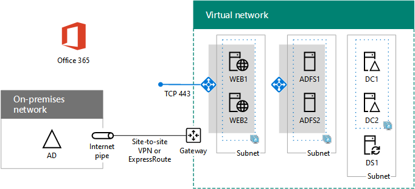

# <a name="high-availability-federated-authentication-phase-4-configure-web-application-proxies"></a>Этап 4. Федеративная проверка подлинности для обеспечения высокой доступности: настройка прокси веб-приложений

На этом этапе развертывания высокой доступности для Microsoft 365 федерарной проверки подлинности в службах инфраструктуры Azure создается внутренний балансировщик нагрузки и два сервера AD FS.
  
Перед переходом на этап [5: Настройка федерационной](high-availability-federated-authentication-phase-5-configure-federated-authentic.md)проверки подлинности для Microsoft 365. См. в рублях Развертывание [федерарной](deploy-high-availability-federated-authentication-for-microsoft-365-in-azure.md) проверки подлинности с высокой доступностью для Microsoft 365 в Azure для всех этапов.
  
## <a name="create-the-internet-facing-load-balancer-in-azure"></a>Создание балансировки нагрузки, относящаяся к Интернету, в Azure

Необходимо создать балансировку нагрузки с подключением к Интернету, чтобы Azure равномерно распределяла входящий трафик проверки подлинности клиентов из Интернета между двумя прокси-серверами веб-приложений.
  
> [!NOTE]
> Для указанных ниже последовательностей команд используется последняя версия Azure PowerShell. См. [начало работы с Azure PowerShell](/powershell/azure/get-started-azureps). 
  
Если вы предоставили значения расположения и группы ресурсов, запустите в результате блок в командной Azure PowerShell или в ISE PowerShell.
  
> [!TIP]
> Для создания готовых к запуску командных блоков PowerShell на основе настраиваемой настройки используйте Microsoft Excel [конфигурации.](https://github.com/MicrosoftDocs/OfficeDocs-Enterprise/raw/live/Enterprise/downloads/O365FedAuthInAzure_Config.xlsx) 

```powershell
# Set up key variables
$locName="<your Azure location>"
$rgName="<Table R - Item 4 - Resource group name column>"

$publicIP=New-AzPublicIpAddress -ResourceGroupName $rgName -Name "WebProxyPublicIP" -Location $LocName -AllocationMethod "Static"
$frontendIP=New-AzLoadBalancerFrontendIpConfig -Name "WebAppProxyServers-LBFE" -PublicIpAddress $publicIP
$beAddressPool=New-AzLoadBalancerBackendAddressPoolConfig -Name "WebAppProxyServers-LBBE"
$healthProbe=New-AzLoadBalancerProbeConfig -Name "WebServersProbe" -Protocol "TCP" -Port 443 -IntervalInSeconds 15 -ProbeCount 2
$lbrule=New-AzLoadBalancerRuleConfig -Name "WebTraffic" -FrontendIpConfiguration $frontendIP -BackendAddressPool $beAddressPool -Probe $healthProbe -Protocol "TCP" -FrontendPort 443 -BackendPort 443
New-AzLoadBalancer -ResourceGroupName $rgName -Name "WebAppProxyServers" -Location $locName -LoadBalancingRule $lbrule -BackendAddressPool $beAddressPool -Probe $healthProbe -FrontendIpConfiguration $frontendIP
```

Чтобы отобразить общедоступный IP-адрес, присвоенный вашему балансированию нагрузки с подключением к Интернету, запустите эти команды в командной Azure PowerShell на локальном компьютере:
  
```powershell
Write-Host (Get-AzPublicIpaddress -Name "WebProxyPublicIP" -ResourceGroup $rgName).IPAddress
```

## <a name="determine-your-federation-service-fqdn-and-create-dns-records"></a>Определение FQDN службы федерации и создание записей DNS

Чтобы определить имя службы федерации в Интернете, необходимо определить имя службы федерации. Azure AD Подключение настраивает Microsoft 365 с этим именем в фазе 5, который станет частью URL-адреса, который Microsoft 365 для подключения клиентов для получения маркера безопасности. Пример : fs.contoso.com (fs означает службу федерации).
  
После создания службы федерации FDQN создайте общедоступный домен DNS Запись для службы федерации FDQN, которая решается на общедоступный IP-адрес балансировки нагрузки в Интернете.
  
|**Имя**|**Type** (Тип)|**TTL** (Срок жизни)|**Значение**|
|:-----|:-----|:-----|:-----|
|FDQN службы федерации  <br/> |A  <br/> |3600  <br/> |общедоступный IP-адрес балансира нагрузки, отображаемого командой **Write-Host** в предыдущем разделе. <br/> |
   
Пример:
  
|**Имя**|**Type** (Тип)|**TTL** (Срок жизни)|**Значение**|
|:-----|:-----|:-----|:-----|
|fs.contoso.com  <br/> |A  <br/> |3600  <br/> |131.107.249.117  <br/> |
   
Далее добавьте запись DNS-адресов в личное пространство имен DNS организации, которое решает проблему FQDN службы федерации, в частный IP-адрес, присвоенный внутреннему балансилю нагрузки для серверов AD FS (таблица I, пункт 4, столбец Value).
  
## <a name="create-the-web-application-proxy-server-virtual-machines-in-azure"></a>Создание виртуальных машин прокси-сервера веб-приложения в Azure

Используйте следующий блок Azure PowerShell для создания виртуальных машин для двух прокси-серверов веб-приложения. 
  
Обратите внимание, что Azure PowerShell командные наборы используют значения из следующих таблиц:
  
- таблица M (для виртуальных машин);
    
- таблица R (для групп ресурсов);
    
- таблица V (для параметров виртуальной сети);
    
- таблица S (для подсетей);
    
- таблица I (для статических IP-адресов);
    
- таблица A (для групп доступности).
    
Напомним, что вы определили таблицу M в фазе [2:](high-availability-federated-authentication-phase-2-configure-domain-controllers.md) Настройка контроллеров доменов и таблиц R, V, S, I и A на этапе [1: Настройка Azure](high-availability-federated-authentication-phase-1-configure-azure.md).
  
Задав правильные значения, выполните полученный блок в командной строке Azure PowerShell или в интегрированной среде сценариев PowerShell.
  
```powershell
# Set up variables common to both virtual machines
$locName="<your Azure location>"
$vnetName="<Table V - Item 1 - Value column>"
$subnetName="<Table R - Item 3 - Subnet name column>"
$avName="<Table A - Item 3 - Availability set name column>"
$rgNameTier="<Table R - Item 3 - Resource group name column>"
$rgNameInfra="<Table R - Item 4 - Resource group name column>"

$rgName=$rgNameInfra
$vnet=Get-AzVirtualNetwork -Name $vnetName -ResourceGroupName $rgName
$subnet=Get-AzVirtualNetworkSubnetConfig -VirtualNetwork $vnet -Name $subnetName
$backendSubnet=Get-AzVirtualNetworkSubnetConfig -Name $subnetName -VirtualNetwork $vnet
$webLB=Get-AzLoadBalancer -ResourceGroupName $rgName -Name "WebAppProxyServers"

$rgName=$rgNameTier
$avSet=Get-AzAvailabilitySet -Name $avName -ResourceGroupName $rgName

# Create the first web application proxy server virtual machine
$vmName="<Table M - Item 6 - Virtual machine name column>"
$vmSize="<Table M - Item 6 - Minimum size column>"
$staticIP="<Table I - Item 7 - Value column>"
$diskStorageType="<Table M - Item 6 - Storage type column>"

$nic=New-AzNetworkInterface -Name ($vmName +"-NIC") -ResourceGroupName $rgName -Location $locName -Subnet $backendSubnet -LoadBalancerBackendAddressPool $webLB.BackendAddressPools[0] -PrivateIpAddress $staticIP
$vm=New-AzVMConfig -VMName $vmName -VMSize $vmSize -AvailabilitySetId $avset.Id

$cred=Get-Credential -Message "Type the name and password of the local administrator account for the first web application proxy server." 
$vm=Set-AzVMOperatingSystem -VM $vm -Windows -ComputerName $vmName -Credential $cred -ProvisionVMAgent -EnableAutoUpdate
$vm=Set-AzVMSourceImage -VM $vm -PublisherName MicrosoftWindowsServer -Offer WindowsServer -Skus 2016-Datacenter -Version "latest"
$vm=Add-AzVMNetworkInterface -VM $vm -Id $nic.Id
$vm=Set-AzVMOSDisk -VM $vm -Name ($vmName +"-OS") -DiskSizeInGB 128 -CreateOption FromImage -StorageAccountType $diskStorageType
New-AzVM -ResourceGroupName $rgName -Location $locName -VM $vm

# Create the second web application proxy virtual machine
$vmName="<Table M - Item 7 - Virtual machine name column>"
$vmSize="<Table M - Item 7 - Minimum size column>"
$staticIP="<Table I - Item 8 - Value column>"
$diskStorageType="<Table M - Item 7 - Storage type column>"

$nic=New-AzNetworkInterface -Name ($vmName +"-NIC") -ResourceGroupName $rgName -Location $locName  -Subnet $backendSubnet -LoadBalancerBackendAddressPool $webLB.BackendAddressPools[0] -PrivateIpAddress $staticIP
$vm=New-AzVMConfig -VMName $vmName -VMSize $vmSize -AvailabilitySetId $avset.Id

$cred=Get-Credential -Message "Type the name and password of the local administrator account for the second web application proxy server." 
$vm=Set-AzVMOperatingSystem -VM $vm -Windows -ComputerName $vmName -Credential $cred -ProvisionVMAgent -EnableAutoUpdate
$vm=Set-AzVMSourceImage -VM $vm -PublisherName MicrosoftWindowsServer -Offer WindowsServer -Skus 2016-Datacenter -Version "latest"
$vm=Add-AzVMNetworkInterface -VM $vm -Id $nic.Id
$vm=Set-AzVMOSDisk -VM $vm -Name ($vmName +"-OS") -DiskSizeInGB 128 -CreateOption FromImage -StorageAccountType $diskStorageType
New-AzVM -ResourceGroupName $rgName -Location $locName -VM $vm
```

> [!NOTE]
> Эти виртуальные машины предназначены для работы в интрасети, поэтому им не назначается общедоступный IP-адрес или метка доменного имени DNS и они не подключаются к Интернету. Однако это также означает, что к ним невозможно подключиться с помощью портала Azure. Команда **Подключиться** недоступна при просмотре свойств виртуальной машины. Для подключения к виртуальной машине с помощью частного IP-адреса или имени DNS интрасети и учетных данных учетной записи локального администратора используйте вспомогательный инструмент удаленного рабочего стола или другой инструмент удаленного рабочего стола.
  
Здесь показана конфигурация, полученная в результате успешного выполнения этого этапа (с заполнителями вместо имен компьютеров).
  
**Этап 4. Балансировщик нагрузки с подключением к Интернету и прокси-серверы веб-приложений для инфраструктуры федерарной проверки подлинности высокой доступности в Azure**


  
## <a name="next-step"></a>Следующий этап

Используйте [этап 5. Настройка федерационной](high-availability-federated-authentication-phase-5-configure-federated-authentic.md) проверки подлинности для Microsoft 365 для продолжения настройки этой рабочей нагрузки.
  
## <a name="see-also"></a>См. также

[Развертывание федеративной проверки подлинности для обеспечения высокой доступности Microsoft 365 в Azure](deploy-high-availability-federated-authentication-for-microsoft-365-in-azure.md)
  
[Federated identity for your Microsoft 365 dev/test environment](federated-identity-for-your-microsoft-365-dev-test-environment.md)
  
[Центр архитектуры и решений Microsoft 365](../solutions/index.yml)