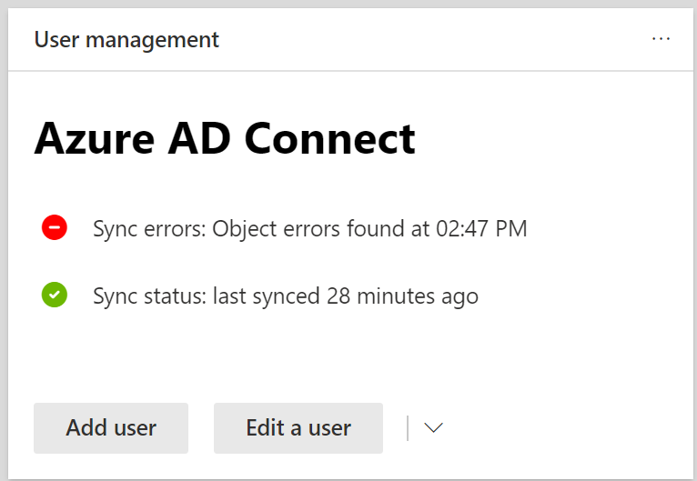

# Просмотр ошибок синхронизации службы каталогов в Microsoft 365View directory synchronization errors in Microsoft 365

Ошибки синхронизации службы каталогов можно просмотреть в Центре администрирования Microsoft 365.You can view directory synchronization errors in the Microsoft 365 admin center. Отображаются только ошибки объекта User.Only the User object errors are displayed. Чтобы просмотреть ошибки с помощью PowerShell, см. раздел "Определение объектов [с помощью DirSyncProvisioningErrors".](https://docs.microsoft.com/azure/active-directory/hybrid/how-to-connect-syncservice-duplicate-attribute-resiliency)To view errors with PowerShell, see [Identify objects with DirSyncProvisioningErrors](https://docs.microsoft.com/azure/active-directory/hybrid/how-to-connect-syncservice-duplicate-attribute-resiliency).

## Просмотр ошибок синхронизации службы каталогов в Центре администрирования Microsoft 365View directory synchronization errors in the Microsoft 365 admin center

Чтобы просмотреть все ошибки в Центре администрирования Microsoft 365:To view any errors in the Microsoft 365 admin center:
  
1. Во sign in to the [Microsoft 365 admin center](https://admin.microsoft.com) with a global administrator account.Sign in to the [Microsoft 365 admin center](https://admin.microsoft.com) with a global administrator account. 
    
2. На **домашней** странице вы увидите карточку управления **"Пользователь".**On the **Home** page, you'll see the **User management** card. 
    
    
  
3. На карточке выберите **ошибки** синхронизации в **Azure AD Connect,** чтобы увидеть ошибки на странице **ошибок синхронизации каталогов.**On the card, choose **Sync errors** under **Azure AD Connect** to see the errors on the **Directory sync errors** page.   
    
    

4. Выберите любую из ошибок, чтобы отобразить в области сведений сведения об ошибке и советы по ее устранению.Choose any of the errors to display the details pane with information about the error and tips on how to fix it.

   
  
После просмотра см. устранение проблем с синхронизацией службы каталогов [для Microsoft 365,](fix-problems-with-directory-synchronization.md) чтобы устранить выявленные проблемы.After viewing, see [fixing problems with directory synchronization for Microsoft 365](fix-problems-with-directory-synchronization.md) to correct any identified issues.

