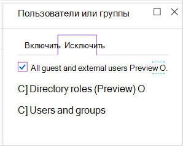

# Политики для разрешения гостевых и внешних поправных доступаPolicies for allowing guest and external B2B access
В этой статье описывается, как настроить рекомендуемые политики доступа к удостоверениям и устройствам, чтобы разрешить доступ к учетной записи B2B (гости и внешние пользователи).This article describes how to adjust the recommended common identity and device access policies to allow B2B account access (guest and external users). Это руководство строится на [общих политиках идентификации и доступа к устройствам](identity-access-policies.md).This guidance builds on the [Common identity and device access policies](identity-access-policies.md).

Эти рекомендации предназначены для применения к **базовому** уровню защиты.These recommendations are designed to apply to the **baseline** tier of protection. Тем не менее, вы можете скорректировать рекомендации на основе степени детализации ваших потребностей для **конфиденциальной** и **строго регулируемой** защиты.However, you can adjust the recommendations based on the granularity of your needs for **sensitive** and **highly regulated** protection. 

Предоставление пути для пользователей B2B для проверки подлинности в клиенте Azure AD не дает этим пользователям доступа ко всей среде.Providing a path for B2B users to authenticate with your Azure AD tenant doesn't give these users access to your entire environment. Пользователи B2B имеют доступ только к ресурсам, к которым они имеют доступ (например, файлы), в службах, предоставленных в политиках условного доступа.B2B users only have access to resources that are shared with them (such as files) within the services granted in the conditional access policies.

## Обновление общих политик для разрешения и защиты гостевого и внешнего доступаUpdating the common policies to allow and protect guest and external access 

На следующей схеме показаны общие политики идентификации и доступа к устройствам, а также приводятся политики, которые необходимо добавить или обновить для защиты гостей и внешнего доступа, а также с помощью значка карандаша.The following diagram illustrates the common identity and device access policies and indicates (with a pencil icon) which policies to add or update to protect guest and external access. 

В следующей таблице перечислены политики, которые необходимо обновить, или создать новую.The following table lists the policies you either need to update or create new. Общие политики ссылаются на соответствующие инструкции по настройке в статье [Common Identity and Device Access Policies Policies](identity-access-policies.md) .The common policies link to the associated configuration instructions in the [Common identity and device access policies](identity-access-policies.md) article.

|Уровень защитыProtection level|ПолитикиPolicies|Дополнительные сведенияMore information|
|:---------------|:-------|:----------------|
|**Базовый****Baseline**|[Требовать постоянного постоянного для гостевых и внешних пользователейRequire MFA always for guest and external users](identity-access-policies.md#require-mfa-based-on-sign-in-risk)|Создайте новое правило и примените его только к гостям и внешним пользователям.Create this new rule and apply it only to guests and external users. В разделе риск для входа оставьте флажок все параметры снятым, чтобы всегда применять MFA.Under sign-in risk, leave all options unchecked to always enforce MFA.|
|        |[Требовать, чтобы риск входа в систему был *средним* или *высоким*Require MFA when sign-in risk is *medium* or *high*](identity-access-policies.md#require-mfa-based-on-sign-in-risk)|Измените это правило, чтобы исключить гостевых и внешних пользователей.Modify this rule to exclude guest and external users.|
|        |[Требовать использования соответствующих политике компьютеровRequire compliant PCs](identity-access-policies.md#require-compliant-pcs-but-not-compliant-phones-and-tablets)|Измените это правило, чтобы исключить гостевых и внешних пользователей.Modify this rule to exclude guest and external users.|

Чтобы включить или исключить гостей и внешних пользователей в правилах условного доступа, перейдите на вкладку включить или исключить и проверьте **всех гостей и внешних пользователей**.To include or exclude guests and external users in conditional access rules, click the include or exclude tab and check **All guests and external users**.

## Дополнительные сведенияMore information

### Гости и внешние пользователиGuests vs. external users
В Azure AD гостевые и внешние пользователи одинаковы.In Azure AD, guest and external users are the same. Тип пользователя для обоих из них — гость.The user type for both of these is Guest. Гостевые пользователи — это пользователи B2B.Guest users are B2B users.

Microsoft Teams различает гостевые пользователи и внешних пользователей в приложении, но они являются пользователями B2B при проверке подлинности.Microsoft Teams differentiates between guest users and external users within the app, but these are both B2B users when authenticating. Для получения дополнительных сведений о гостевых и внешних пользователях Teams, ознакомьтесь с разделом [Включение гостевого и внешнего доступа для Teams](teams-access-policies.md#enabling-guest-and-external-access-for-teams).For more information about Teams guest and external users, see [Enabling guest and external access for Teams](teams-access-policies.md#enabling-guest-and-external-access-for-teams).

### Требовать постоянного постоянного для гостевых и внешних пользователейRequire MFA always for guest and external users
Это правило запрашивает у гостей регистрацию для MFA в клиенте независимо от того, зарегистрированы ли они для MFA в своем домашнем клиенте.This rule prompts guests to register for MFA in your tenant, regardless of whether they're registered for MFA in their home tenant. При доступе к ресурсам в клиенте виртуальные машины и внешние пользователи должны использовать MFA для каждого запроса.When accessing resources in your tenant, guests and external users are required to use MFA for every request. 

### Исключение гостевых и внешних пользователей из MFA на основе рискаExcluding guest and external users from risk-based MFA
В то время как организации могут применять политики на основе риска для пользователей B2B, использующих защиту от удостоверений, существуют ограничения на реализацию защиты идентификации для пользователей по обеспечению совместной работы в каталоге ресурсов, так как их удостоверения существуют в основном каталоге.While organizations can enforce risk-based policies for B2B users using Identity Protection, there are limitations in the implementation of Identity Protection for B2B collaboration users in a resource directory due to their identity existing in their home directory. Из-за этих ограничений Майкрософт рекомендует исключить гостевых пользователей из политик MFA на основе риска и требовать, чтобы эти пользователи всегда использовали MFA.Due to these limitations, Microsoft recommends you exclude guest users from risk-based MFA policies and require these users to always use MFA. 

Дополнительную информацию можно узнать в статье [ограничения защиты от удостоверений для пользователей совместной работы в B2B](https://docs.microsoft.com/azure/active-directory/identity-protection/concept-identity-protection-b2b#limitations-of-identity-protection-for-b2b-collaboration-users).For more information, see [Limitations of Identity Protection for B2B collaboration users](https://docs.microsoft.com/azure/active-directory/identity-protection/concept-identity-protection-b2b#limitations-of-identity-protection-for-b2b-collaboration-users). 

### Исключение гостевых и внешних пользователей из системы управления устройствамиExcluding guest and external users from device management 
Управлять устройством может только одна организация.Only one organization can manage a device. Если вы не исключите гостевые и внешние пользователи из политик, требующих соответствия требованиям к устройствам, эти политики будут блокировать этих пользователей.If you don't exclude guest and external users from policies that require device compliance, these policies will block these users. 

## Дальнейшие действияNext steps

[Сведения о том, как включить условный доступ к TeamsLearn how to enable Teams conditional access](teams-access-policies.md)

