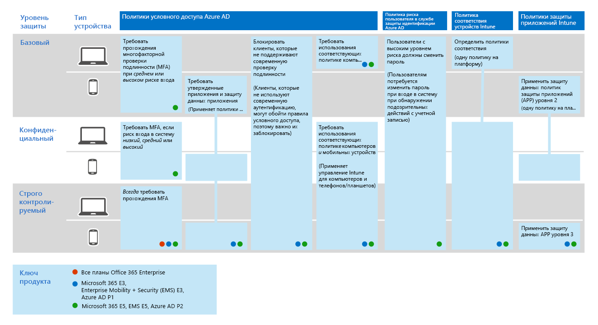
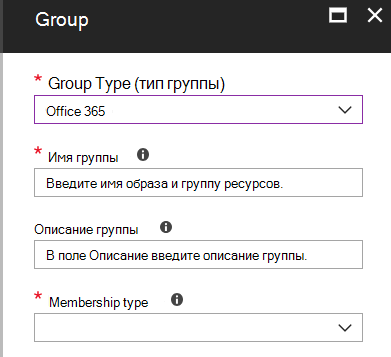

# Основные политики доступа для удостоверений и устройств
В этой статье описываются распространенные рекомендуемые политики для защиты доступа к облачным службам, в том числе локальные приложения, опубликованные с помощью прокси-сервера приложения Azure AD. 

В этом руководстве рассказывается, как развертывать рекомендуемые политики в новой подготовленной среде. Настройка этих политик в отдельной лабораторной среде позволяет ознакомиться с рекомендуемыми политиками и оценить их до того, как они будут выдаваться в предварительных и рабочих средах. Новая среда может быть только облачной или гибридной.  

## Набор политик 

На следующей схеме показан рекомендуемый набор политик. Здесь показано, к какому уровню защиты применяется каждая политика, а также применяются ли политики к компьютерам, телефонам и планшетам или обеим категориям устройств. Кроме того, здесь указывается, где настроены эти политики.

устройствам[просмотреть более крупную версию этого изображения](https://github.com/MicrosoftDocs/microsoft-365-docs/raw/public/microsoft-365/media/Identity_device_access_policies_byplan.png)

В оставшейся части этой статьи рассказывается, как настроить эти политики. 

Рекомендуется использовать многофакторную проверку подлинности перед регистрацией устройств в Intune для гарантии того, что устройство находится в среде выполнения предполагаемого пользователя. Кроме того, необходимо зарегистрировать устройства в Intune перед применением политик соответствия требованиям к устройствам.

Чтобы обеспечить время для выполнения этих задач, рекомендуем реализовать базовые политики в порядке, указанном в этой таблице. Однако политики MFA для конфиденциальной и строго регулируемой защиты можно реализовать в любое время.

|Уровень защиты|Политики|Дополнительные сведения|
|:---------------|:-------|:----------------|
|**Базовый уровень**|[Требовать, чтобы риск входа в систему был *средним* или *высоким*](#require-mfa-based-on-sign-in-risk)| |
|        |[Блокировать клиенты, не поддерживающие современную проверку подлинности](#block-clients-that-dont-support-modern-authentication)|Клиенты, для которых не используется современная проверка подлинности, могут обходить правила условного доступа, поэтому важно заблокировать эти|
|        |[Высокий риск пользователи должны изменить пароль](#high-risk-users-must-change-password)|Принудительно изменяет пароль пользователя при входе в учетную запись, если для учетной записи обнаружены действия с повышенными рисками|
|        |[Применение политик защиты данных приложений](#apply-app-data-protection-policies)|Одна политика на платформу (iOS, Android, Windows). Политики защиты приложений Intune (APP) являются предопределенными наборами защиты от уровня 1 до уровня 3.|
|        |[Требовать утвержденные приложения и защиту приложений](#require-approved-apps-and-app-protection)|Обеспечивает защиту мобильных приложений для телефонов и планшетных ПК|
|        |[Определение политик соответствия требованиям устройств](#define-device-compliance-policies)|Одна политика для каждой платформы|
|        |[Требовать использования соответствующих политике компьютеров](#require-compliant-pcs-but-not-compliant-phones-and-tablets)|Обеспечивает управление компьютерами в Intune|
|**Конфиденциальный**|[Требовать, когда риск входа в систему *мал*, *средний* или *высокий*](#require-mfa-based-on-sign-in-risk)| |
|         |[Требовать соответствующие компьютеры *и* мобильные устройства](#require-compliant-pcs-and-mobile-devices)|Принудительное управление Intune для ПК и телефонов и планшетов|
|**Строго регулируемый уровень**|[*Всегда* требовать MFA](#require-mfa-based-on-sign-in-risk)|
| | |

## Назначение политик пользователям
Перед настройкой политик Определите группы Azure AD, которые вы используете для каждого уровня защиты. Как правило, базовая защита применяется ко всем сотрудникам Организации. Для пользователя, включенного для базовой и конфиденциальной защиты, будут применены все базовые политики плюс политики конфиденциальной защиты. Защита является накопительной и применяется наиболее строгая политика. 

Рекомендуем создать группу Azure AD для исключения условного доступа. Добавьте эту группу ко всем правилам условного доступа в разделе "исключить". Это позволяет получить доступ к пользователю при устранении неполадок, связанных с доступом. Рекомендуется использовать только временное решение. Отслеживайте изменения в этой группе и следите за тем, чтобы группа исключений использовалась только как задумано. 

На следующем рисунке приведен пример назначения и исключений пользователей.

На приведенном ниже рисунке для команды "самый высокий секретный проект X" назначается политика условного доступа, которая должна *всегда*иметь mfa. Будьте разумны при применении более высоких уровней защиты для пользователей. Участники этой группы проекта должны будут предоставлять две формы проверки подлинности при каждом входе в систему, даже если они не просматривают строго регулируемого контента.  

Все группы Azure AD, созданные в рамках этих рекомендаций, должны быть созданы в виде групп Office 365. Это особенно важно для развертывания Azure Information Protection (AIP) при защите документов в SharePoint Online.

## Запрос MFA на основе риска входа
Прежде чем приступать к MFA, сначала используйте политику регистрации MFA для защиты удостоверений для регистрации пользователей в MFA. После регистрации пользователей можно применить MFA для входа. Необходимые [условия](identity-access-prerequisites.md) включают регистрацию всех пользователей с помощью mfa.

Чтобы создать политику условного доступа, выполните следующие действия. 

1. Войдите на [портал Azure](https://portal.azure.com) со своими учетными данными. После успешного входа вы увидите панель мониторинга Azure.

2. В меню слева выберите **Azure Active Directory**.

3. В разделе **Безопасность** выберите **Условный доступ**.

4. Выберите **Создать политику**.

 В следующих таблицах описываются параметры политики условного доступа, которые необходимо реализовать для этой политики.

**назначения**;

|Type|Элемент Property|Значения|"Заметки"|
|:---|:---------|:-----|:----|
|Пользователи или группы|Включить|Выберите пользователей и группы — выберите определенную группу безопасности, содержащую целевых пользователей|Следует начать с группы безопасности, в которую входят пользователи пилотного проекта|
||Исключить|Исключение группы безопасности, учетных записей служб (удостоверений приложений)|Членство изменялось по мере необходимости во временной основе|
|Облачные приложения|Включить|Выберите приложения, к которым необходимо применить это правило. Например, выберите Office 365 Exchange Online||
|Условия|Настроено|Да|Выполните настройку в соответствии с вашей средой и потребностями|
|Риск при входе|Уровень риска||Ознакомьтесь с рекомендациями, приведенными в следующей таблице|

**Риск при входе**

Примените параметры на основе целевого уровня защиты.

|Свойство|Уровень защиты|Значения|"Заметки"|
|:---|:---------|:-----|:----|
|Уровень риска|Базовый уровень|Высокий, средний|Выберите оба варианта|
| |Конфиденциальный|Высокий, средний, минимальный|Выберите все три варианта|
| |Строго регулируемый уровень| |Оставить все параметры снятыми, чтобы всегда применять MFA|

**Средства управления доступом**

|Type|Элемент Property|Значения|"Заметки"|
|:---|:---------|:-----|:----|
|Предоставить|Предоставление доступа|Верно|выбрано|
||Требовать многофакторную идентификацию|True|Check|
||Требовать, чтобы устройство было помечено как соответствующее требованиям|False||
||Требуется гибридное устройство, подключенное к Azure AD|False||
||Требуется утвержденное клиентское приложение|False||
||Требовать все выбранные средства управления|True|выбрано|

> [!NOTE]
> Обязательно включите эту политику, выбрав пункт **вкл**. Кроме того, рекомендуется проверить политику с помощью средства " [что если](https://docs.microsoft.com/azure/active-directory/active-directory-conditional-access-whatif) ".

## Блокировать клиенты, не поддерживающие современную проверку подлинности
1. Войдите на [портал Azure](https://portal.azure.com) со своими учетными данными. После успешного входа вы увидите панель мониторинга Azure.

2. В меню слева выберите **Azure Active Directory**.

3. В разделе **Безопасность** выберите **Условный доступ**.

4. Выберите **Создать политику**.

В следующих таблицах описываются параметры политики условного доступа, которые необходимо реализовать для этой политики.

**назначения**;

|Type|Элемент Property|Значения|"Заметки"|
|:---|:---------|:-----|:----|
|Пользователи или группы|Include|Выберите пользователей и группы — выберите определенную группу безопасности, содержащую целевых пользователей|Следует начать с группы безопасности, в которую входят пользователи пилотного проекта|
||Исключить|Исключение группы безопасности, учетных записей служб (удостоверений приложений)|Изменение членства по мере необходимости на временной основе|
|Облачные приложения|Include|Выберите приложения, к которым необходимо применить это правило. Например, выберите Office 365 Exchange Online||
|Условия|Настроено|Да|Настройка клиентских приложений|
|Клиентские приложения|Настроено|Да|Мобильные приложения и клиенты для настольных ПК, другие клиенты (выберите и то, и другое).|

**Средства управления доступом**

|Type|Элемент Property|Значения|"Заметки"|
|:---|:---------|:-----|:----|
|Предоставить|Заблокировать доступ|Верно|выбрано|
||Требовать многофакторную идентификацию|False||
||Требовать, чтобы устройство было помечено как соответствующее требованиям|False||
||Требуется гибридное устройство, подключенное к Azure AD|False||
||Требуется утвержденное клиентское приложение|False||
||Требовать все выбранные средства управления|True|выбрано|

> [!NOTE]
> Обязательно включите эту политику, выбрав пункт **вкл**. Кроме того, рекомендуется проверить политику с помощью средства " [что если](https://docs.microsoft.com/azure/active-directory/active-directory-conditional-access-whatif) ".

## Высокий риск пользователи должны изменить пароль
Чтобы принудительно сменить пароль для всех скомпрометированных учетных записей пользователей с высоким уровнем риска при входе в систему, необходимо применить следующую политику.

Войдите на [портал Microsoft Azure (https://portal.azure.com)](https://portal.azure.com/) с помощью учетных данных администратора и последовательно выберите **Защита идентификации Azure AD > Политика риска пользователя**.

**назначения**;

|Type|Элемент Property|Значения|"Заметки"|
|:---|:---------|:-----|:----|
|Users|Включить|Все пользователи|Выбрано|
||Исключить|Нет||
|Условия|Риск пользователя|Высокий|Выбрано|

**Элементы управления**

| Type | Элемент Property | Значения                  | "Заметки" |
|:-----|:-----------|:------------------------|:------|
|      | Access     | Разрешить доступ            | Верно  |
|      | Доступ     | Требовать смену пароля | True  |

**Проверка:** неприменимо

> [!NOTE]
> Обязательно включите эту политику, выбрав пункт **вкл**. Кроме того, рекомендуется протестировать политику с помощью средства " [что если](https://docs.microsoft.com/azure/active-directory/active-directory-conditional-access-whatif) ".

## Применение политик защиты данных приложений
Политики защиты приложений (APP) определяют, какие приложения разрешены и какие действия они могут выполнять с данными вашей организации. Параметры, доступные в приложении APP, позволяют организациям адаптировать защиту к определенным потребностям. В некоторых случаях может быть неясно, какие параметры политики требуются для реализации полного сценария. Чтобы упростить усиление защиты конечных точек мобильных клиентов, корпорация Майкрософт предоставила таксономию для платформы защиты данных приложений для управления мобильными приложениями iOS и Android. 

Структура защиты данных приложений организована на трех отдельных уровнях конфигурации, при этом каждый уровень строится на предыдущем уровне: 

- **Enterprise Basic Data Protection** (уровень 1) обеспечивает защиту приложений с помощью ПИН-кода и шифрование и выполнение операций выборочного стирания. Для устройств Android этот уровень проверяет аттестацию устройств Android. Это конфигурация начального уровня, обеспечивающая аналогичные элементы управления защитой данных в политиках почтовых ящиков Exchange Online, а также сведения о заполнении пользователями приложения. 
- **Усовершенствованная защита данных в корпоративной среде** (уровень 2) содержит механизмы защиты от утечки данных приложений и минимальные требования к ОС. Это конфигурация, которая применяется для большинства мобильных пользователей, обращающихся к рабочим или учебным данным. 
- **Высокая защита данных в корпоративной среде** (уровень 3) содержит расширенные механизмы защиты данных, усиленную конфигурацию ПИН-кода и защиту от угроз для мобильных устройств. Эта конфигурация желательно для пользователей, которые обращаются к данным с высоким уровнем риска. 

Чтобы просмотреть конкретные рекомендации по каждому уровню конфигурации и минимальным приложениям, которые необходимо защищать, ознакомьтесь со статьей [Data Protection Framework с помощью политик защиты приложений](https://docs.microsoft.com/mem/intune/apps/app-protection-framework). 

Используя принципы, описанные в разделе [конфигурации доступа для удостоверений и устройств](microsoft-365-policies-configurations.md), базовые и конфиденциальные уровни защиты сопоставлены с расширенными корпоративными параметрами защиты данных уровня 2. Уровень защиты с высоким уровнем защиты тесно сопоставлен с высокими настройками защиты данных предприятия уровня 3.

|Уровень защиты |Политика защиты приложений  |Дополнительные сведения  |
|---------|---------|---------|
|Базовый уровень     | [Расширенная защита данных второго уровня](https://docs.microsoft.com/mem/intune/apps/app-protection-framework#level-2-enterprise-enhanced-data-protection)        | Параметры политики, примененные на уровне 2, включают все параметры политики, Рекомендуемые для уровня 1, и добавляют или обновляют указанные ниже параметры политики для реализации большего числа элементов управления и более сложной конфигурации, чем уровень 1.         |
|Конфиденциальный     | [Расширенная защита данных второго уровня](https://docs.microsoft.com/mem/intune/apps/app-protection-framework#level-2-enterprise-enhanced-data-protection)        | Параметры политики, примененные на уровне 2, включают все параметры политики, Рекомендуемые для уровня 1, и добавляют или обновляют указанные ниже параметры политики для реализации большего числа элементов управления и более сложной конфигурации, чем уровень 1.        |
|Строго регулируемая     | [Высокий уровень защиты данных предприятия уровня 3](https://docs.microsoft.com/mem/intune/apps/app-protection-framework#level-3-enterprise-high-data-protection)        | Параметры политики, примененные на уровне 3, включают все параметры политики, Рекомендуемые для уровней 1 и 2, и добавляют или обновляют указанные ниже параметры политики для реализации большего числа элементов управления и более сложной конфигурации, чем уровень 2.        |

Чтобы создать новую политику защиты приложений для каждой платформы (iOS и Android) в Microsoft Endpoint Manager с помощью параметров платформы защиты данных, администраторы могут:
1. Создайте политики вручную, выполнив действия, описанные в статье [Создание и развертывание политик защиты приложений с помощью Microsoft Intune](https://docs.microsoft.com/mem/intune/apps/app-protection-policies). 
2. Импортируйте [шаблоны JSON платформы настройки политики защиты приложений Intune](https://github.com/microsoft/Intune-Config-Frameworks/tree/master/AppProtectionPolicies) с помощью [скриптов PowerShell в Intune](https://github.com/microsoftgraph/powershell-intune-samples).

## Требовать утвержденные приложения и защиту приложений
Чтобы применить политики защиты приложений, примененные в Intune, необходимо создать правило условного доступа, чтобы оно потребовало утвержденных клиентских приложений, и условия, заданные в политиках защиты приложений. 

Для применения политик защиты приложений требуется набор политик, описанный в статье [требования к политике защиты приложений для облачного доступа к приложениям с условным доступом](https://docs.microsoft.com/azure/active-directory/conditional-access/app-protection-based-conditional-access). Эти политики включены в этот рекомендуемый набор политик настройки удостоверений и доступа.

Чтобы создать правило условного доступа, требующее утвержденные приложения и защиту приложений, выполните действие "шаг 1: Настройка политики условного доступа Azure AD для Office 365" в [сценарии 1: Office 365 приложения требуют утвержденных приложений с политиками защиты приложений](https://docs.microsoft.com/azure/active-directory/conditional-access/app-protection-based-conditional-access#scenario-1-office-365-apps-require-approved-apps-with-app-protection-policies), что позволяет использовать Outlook для iOS и Android, но блокирует подключение клиентов Exchange ActiveSync к Exchange Online.

   > [!NOTE]
   > Эта политика гарантирует, что мобильные пользователи смогут получить доступ ко всем конечным точкам Office, используя соответствующие приложения.

Если вы включите мобильный доступ к Exchange Online, реализуйте [блокировку клиентов ActiveSync](secure-email-recommended-policies.md#block-activesync-clients), которая не позволяет клиентам Exchange ActiveSync использовать обычную проверку подлинности для подключения к Exchange Online. Эта политика не изображена на рисунке в начале этой статьи. Он описывается и рассказано в разделе [рекомендации по политике защиты электронной почты](secure-email-recommended-policies.md).

 Эти политики используют элементы управления предоставлением разрешений для [утвержденного клиентского приложения](https://docs.microsoft.com/azure/active-directory/conditional-access/concept-conditional-access-grant#require-approved-client-app) и [требуют политики защиты приложений](https://docs.microsoft.com/azure/active-directory/conditional-access/concept-conditional-access-grant#require-app-protection-policy).

Наконец, блокировка устаревшей проверки подлинности для других клиентских приложений на устройствах с iOS и Android гарантирует, что эти клиенты не смогут обходить правила условного доступа. Если вы подписаны на рекомендации, описанные в этой статье, вы уже настроили [Блокирование клиентов, не поддерживающих современные проверки подлинности](#block-clients-that-dont-support-modern-authentication).

<!---
With Conditional Access, organizations can restrict access to approved (modern authentication capable) iOS and Android client apps with Intune app protection policies applied to them. Several conditional access policies are required, with each policy targeting all potential users. Details on creating these policies can be found in [Require app protection policy for cloud app access with Conditional Access](https://docs.microsoft.com/azure/active-directory/conditional-access/app-protection-based-conditional-access).

1. Follow "Step 1: Configure an Azure AD Conditional Access policy for Office 365" in [Scenario 1: Office 365 apps require approved apps with app protection policies](https://docs.microsoft.com/azure/active-directory/conditional-access/app-protection-based-conditional-access#scenario-1-office-365-apps-require-approved-apps-with-app-protection-policies), which allows Outlook for iOS and Android, but blocks OAuth capable Exchange ActiveSync clients from connecting to Exchange Online.

   > [!NOTE]
   > This policy ensures mobile users can access all Office endpoints using the applicable apps.

2. If enabling mobile access to Exchange Online, implement [Block ActiveSync clients](secure-email-recommended-policies.md#block-activesync-clients), which prevents Exchange ActiveSync clients leveraging basic authentication from connecting to Exchange Online.

   The above policies leverage the grant controls [Require approved client app](https://docs.microsoft.com/azure/active-directory/conditional-access/concept-conditional-access-grant#require-approved-client-app) and [Require app protection policy](https://docs.microsoft.com/azure/active-directory/conditional-access/concept-conditional-access-grant#require-app-protection-policy).

3. Disable legacy authentication for other client apps on iOS and Android devices. For more information, see [Block clients that don't support modern authentication](#block-clients-that-dont-support-modern-authentication).
-->

## Определение политик соответствия требованиям устройств

Политики соответствия требованиям устройств определяют требования, которым должны удовлетворять устройства, чтобы они были помечены как соответствующие требованиям. Создайте политики соответствия требованиям для устройств Intune в центре администрирования Microsoft Endpoint Manager.

Создайте политику для каждой платформы:
- Администратор устройств Android
- Android Enterprise
- iOS/Ипадос
- macOS
- Этот параметр доступен для следующих типов устройств:
- Windows 8,1 и более поздние версии
- Windows 10 и более поздние версии

Чтобы создать политики соответствия требованиям устройств, войдите в [центр администрирования Microsoft Endpoint Manager](https://go.microsoft.com/fwlink/?linkid=2109431) с помощью учетных данных администратора, а затем перейдите к разделу**политики****соответствия требованиям** >  **устройств** > . Выберите **создать политику**.

Для развертывания политик соответствия требованиям к устройствам они должны быть назначены группам пользователей. Вы назначаете политику после ее создания и сохранения. В центре администрирования выберите политику и нажмите кнопку **назначения**. Выбрав группы, которые будут получать политику, нажмите кнопку **сохранить** , чтобы сохранить назначение группы и развернуть политику.

Пошаговые инструкции по созданию политик соответствия требованиям в Intune приведены в статье [Создание политики соответствия в Microsoft Intune](https://docs.microsoft.com/mem/intune/protect/create-compliance-policy) в документации по Intune.

Следующие параметры рекомендуются для Windows 10.

**Работоспособность устройства: правила оценки службы аттестации работоспособности Windows**

|Элемент Property|Значения|"Заметки"|
|:---------|:-----|:----|
|Требовать BitLocker|Обязательность||
|Требовать включения безопасной загрузки на устройстве|Обязательность||
|Требовать целостность кода|Обязательность||

**Свойства устройства**

|Type|Элемент Property|Значения|"Заметки"|
|:---|:---------|:-----|:----|
|Версия операционной системы|all|Не настроено||

**Безопасность системы**

|Type|Элемент Property|Значения|"Заметки"|
|:---|:---------|:-----|:----|
|Password|Запрос пароля для разблокировки мобильных устройств|Обязательность||
||Простые пароли|Блок||
||Тип пароля|Устройство по умолчанию||
||Минимальная длина пароля|6 ||
||Максимальное количество минут бездействия до обязательного ввода пароля|15 |Этот параметр поддерживается для Android версий 4,0 и более поздних версий, а также для KNOX 4,0 и более поздних версий. Для устройств с iOS поддерживается для iOS 8,0 и более поздних версий|
||Срок действия пароля (дней)|41||
||Количество предыдущих паролей для предотвращения повторного использования|5 ||
||Требовать пароль при возврате устройства в состояние простоя (мобильный и holographic)|Обязательность|Доступно для Windows 10 и более поздних версий|
|Шифрование|Шифрование хранилища данных на устройстве|Обязательность||
|Безопасность устройств|Брандмауэра|Обязательность||
||Защита от вирусов|Обязательность||
||Антишпионская программа|Обязательность|Для этого параметра требуется решение для защиты от шпионских программ, зарегистрированное в центре безопасности Windows|
|Обеспечиваем|Антивредоносная программа защитника Майкрософт|Обязательность||
||Минимальная версия антивредоносной программы защитника Майкрософт||Поддерживается только для настольных компьютеров с Windows 10. Корпорация Майкрософт рекомендует не более пяти версий за последнюю версию.|
||Срок действия подписи антивредоносной программы защитника Майкрософт|Обязательность||
||Защита в режиме реального времени|Обязательность|Поддерживается только для Windows 10 Desktop|

**ATP в Microsoft Defender**

|Type|Элемент Property|Значения|"Заметки"|
|:---|:---------|:-----|:----|
|Правила Advanced Threat Protection в защитнике Майкрософт|Потребовать, чтобы устройство было в показателе риска или на уровне машины|Средний||

## Требуются совместимые компьютеры (но не совместимые телефоны и Планшетные ПК)
Прежде чем добавлять политику, чтобы потребовать соответствия требованиям компьютеров, обязательно Зарегистрируйте устройства для управления в Intune. Рекомендуется использовать многофакторную проверку подлинности перед регистрацией устройств в Intune для гарантии того, что устройство находится в среде выполнения предполагаемого пользователя. 

Чтобы потребовать соответствия требованиям компьютеров:

1. Войдите на [портал Azure](https://portal.azure.com) со своими учетными данными. После успешного входа вы увидите панель мониторинга Azure.

2. В меню слева выберите **Azure Active Directory**.

3. В разделе **Безопасность** выберите **Условный доступ**.

4. Выберите **Создать политику**.

5. Введите имя политики, а затем выберите **Пользователей и группы**, к которым нужно ее применить.

6. Выберите **Облачные приложения**.

7. Нажмите кнопку **выбрать приложения**, выберите нужные приложения в списке **облачные приложения** . Например, выберите Office 365 Exchange Online. Нажмите кнопку **выбрать** и **Готово**.

8. Чтобы обеспечить соответствие требованиям компьютеров, но не совместимых телефонов и планшетов, выберите пункт **условия** и **платформы устройств**. Выберите **пункт Выбор платформ устройств** и выберите **Windows** и **macOS**.

9. Выберите **Предоставление** в разделе **Элементы управления доступом**.

10. Выберите команду **предоставить доступ**, выберите **требовать, чтобы устройство было помечено как соответствующее требованиям**. Для нескольких элементов управления установите флажок **требовать все выбранные элементы управления**и нажмите кнопку **выбрать**. 

11. Нажмите кнопку **Создать**.

Если ваша цель требует использования совместимых ПК *и* мобильных устройств, не выбирайте платформы. Это обеспечивает соответствие для всех устройств. 

## Требовать соответствующие компьютеры *и* мобильные устройства

Чтобы требовать соблюдение требований для всех устройств:

1. Войдите на [портал Azure](https://portal.azure.com) со своими учетными данными. После успешного входа вы увидите панель мониторинга Azure.

2. В меню слева выберите **Azure Active Directory**.

3. В разделе **Безопасность** выберите **Условный доступ**.

4. Выберите **Создать политику**.

5. Введите имя политики, а затем выберите **Пользователей и группы**, к которым нужно ее применить.

6. Выберите **Облачные приложения**.

7. Нажмите кнопку **выбрать приложения**, выберите нужные приложения в списке **облачные приложения** . Например, выберите Office 365 Exchange Online. Нажмите кнопку **выбрать** и **Готово**.

8. Выберите **Предоставление** в разделе **Элементы управления доступом**.

9. Выберите команду **предоставить доступ**, выберите **требовать, чтобы устройство было помечено как соответствующее требованиям**. Для нескольких элементов управления установите флажок **требовать все выбранные элементы управления**и нажмите кнопку **выбрать**. 

10. Нажмите кнопку **Создать**.

При создании этой политики не выбирайте платформы. Это обеспечивает соответствие устройств требованиям.

## Дальнейшие действия

[Сведения о политиках для защиты электронной почты](secure-email-recommended-policies.md)
