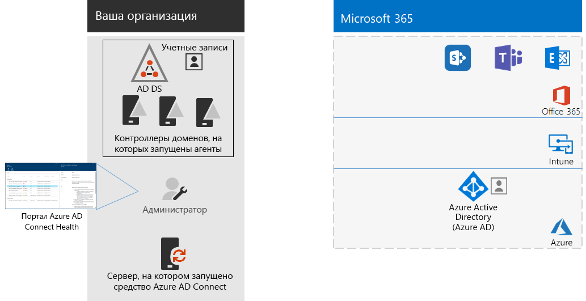

# Шаг 4. Добавление учетных записей пользователей

## Создание учетных записей пользователей, если используется только облачная идентификация

Если используется только облачная идентификация, создавайте пользователей и группы в Azure Active Directory (Azure AD). Вы можете использовать:

- Центр администрирования Microsoft 365
- Портал Azure
- Azure PowerShell

## Синхронизация удостоверений для гибридного удостоверения

*Это обязательный этап для гибридных развертываний; он применяется к планам E3 и E5 Microsoft 365 корпоративный.*

В этом разделе синхронизируются локальные доменные службы Active Directory (AD DS) с клиентом Azure AD, используемым в Office 365, Microsoft Intune и других облачных службах, входящих в состав Microsoft 365 корпоративный.

Azure AD Connect — это поддерживаемое корпорацией Майкрософт средство, с помощью которого вы сможете синхронизировать только те удостоверения, которые вам действительно нужны, из сред AD DS с одним или несколькими лесами в свой клиент Azure AD. На рисунке ниже показан базовый процесс для синхронизации Azure AD Connect.

1. Средство Azure AD Connect, запущенное на сервере, опрашивает службы AD DS на наличие изменений в учетных записях, группах и контактах.
2. Azure AD Connect отправляет эти изменения в клиент Azure AD вашей подписки на Microsoft 365.

Первое решение, которое необходимо принять касательно гибридного решения для работы с удостоверениями, связано с требованием проверки подлинности. Ниже перечислены возможные варианты.

- С помощью **управляемой проверки подлинности** Azure AD выполняет процесс проверки подлинности при входе пользователей в систему. Существует два указанных ниже метода управляемой проверки подлинности. 
    - **Синхронизация хэша паролей (PHS)**. [Рекомендованный и обязательный метод для некоторых премиум-функций.] Это самый простой способ включения проверки подлинности для объектов локального каталога в Azure AD. Azure AD Connect извлекает хэшированный пароль из AD DS, выполняет дополнительную обработку пароля для хэширования пароля и синхронизирует его с Azure AD. Дополнительные сведения см. в статье о [реализации синхронизации хэша паролей с помощью службы синхронизации Azure AD Connect](https://docs.microsoft.com/azure/active-directory/hybrid/how-to-connect-password-hash-synchronization).
    - **Сквозная проверка подлинности** — это простое решение для проверки подлинности паролей для служб на основе Azure AD. При сквозной проверке подлинности используется агент, работающий на одном или нескольких локальных серверах и проверяющий операции проверки подлинности пользователей непосредственно с помощью локальных служб AD DS. Дополнительные сведения см. в статье [Вход пользователей с помощью сквозной проверки подлинности Azure Active Directory](https://docs.microsoft.com/azure/active-directory/connect/active-directory-aadconnect-pass-through-authentication).
- При использовании **федеративной проверки подлинности** процесс проверки подлинности перенаправляется другому поставщику удостоверений через сервер федерации удостоверений, например через службы федерации Active Directory (AD FS), для входа пользователя в систему. Поставщик удостоверений может использовать дополнительные методы проверки подлинности, например проверку подлинности на основе смарт-карт. Дополнительные сведения см. в статье [Выбор подходящего метода проверки подлинности для вашего гибридного решения для работы с удостоверениями Azure Active Directory](https://docs.microsoft.com/azure/security/azure-ad-choose-authn).

Просмотрите это видео с обзором моделей удостоверений и проверки подлинности для Microsoft 365 корпоративный.

 

> [!VIDEO https://www.microsoft.com/videoplayer/embed/RE2Pjwu]

После того как вы определили гибридное решение для работы с удостоверениями, скачайте и запустите [средство устранения ошибок синхронизации каталогов IdFix](https://www.microsoft.com/download/details.aspx?id=36832), чтобы проанализировать AD DS на наличие проблем.

После устранения всех проблем, найденных средством IdFix, прочитайте статью [Реализация синхронизации хэшей паролей](https://docs.microsoft.com/azure/active-directory/connect/active-directory-aadconnectsync-implement-password-hash-synchronization) с рекомендациями по установке средства Azure AD Connect и настройке синхронизации каталогов между локальными службами AD DS и клиентом Azure AD для вашей подписки на Microsoft 365. После начала синхронизации вы будете обслуживать свои учетные записи пользователей и группы с помощью своего локального поставщика удостоверений, например AD DS.

Корпорация Майкрософт предоставляет набор рекомендаций для [удостоверений и доступа к устройству](microsoft-365-policies-configurations.md) с целью обеспечения безопасности и эффективности работы сотрудников. 

- Данные о рекомендуемых требованиях для гибридных сред см. в колонке **Active Directory с синхронизацией хэша пароля** [предварительных требований](identity-access-prerequisites.md#prerequisites). 

- Данные о рекомендуемых требованиях для исключительно облачных сред см. в колонке **Только в облаке** [предварительных требований](identity-access-prerequisites.md#prerequisites).

После появления локальных пользователей и групп в Azure AD вы можете приступить к назначению лицензий и использованию рабочих нагрузок, например OneDrive для бизнеса и Exchange Online.

|||
|:-------|:-----|
|| [Руководство по лаборатории тестирования: синхронизация хэшей паролей](password-hash-sync-m365-ent-test-environment.md)  [Руководство по лаборатории тестирования: сквозная проверка подлинности](pass-through-auth-m365-ent-test-environment.md) |
|||

Прежде чем перейти к следующему шагу, проверьте [условия](identity-exit-criteria.md#crit-identity-sync), при выполнении которых можно считать данный раздел завершенным.

## Отслеживание работоспособности функции синхронизации

*Это необязательная процедура, применимая к версиям Microsoft 365 E3 и E5*

В этом разделе вы установите агент Azure AD Connect Health на все свои локальные контроллеры доменов AD DS, чтобы отслеживать инфраструктуру идентификации и службы синхронизации, предоставляемые Azure AD Connect. Сведения, полученные в результате отслеживания, доступны на портале Azure AD Connect Health. Там вы можете просматривать оповещения, результаты отслеживания производительности, аналитические данные об использовании и прочие сведения.

Ключевое решение о способе использования Azure AD Connect Health зависит от способа, которым вы используете Azure AD Connect.

- Если вы используете **управляемую проверку подлинности**, начните работу с прочтения статьи [Мониторинг синхронизации Azure AD Connect с помощью Azure AD Connect Health](https://docs.microsoft.com/azure/active-directory/connect-health/active-directory-aadconnect-health-sync), чтобы понять и настроить Azure AD Connect Health.
- Если вы синхронизируете только имена учетных записей и групп, используя **федеративную проверку подлинности** с помощью служб федерации Active Directory (AD FS), для начала прочитайте статью [Мониторинг AD FS с помощью Azure AD Connect Health](https://docs.microsoft.com/azure/active-directory/connect-health/active-directory-aadconnect-health-adfs), чтобы понять и настроить Azure AD Connect Health.

Когда вы завершите этот раздел, у вас будут указанные ниже элементы.

- На каждом из ваших локальных серверов поставщиков удостоверений установлен агент Azure AD Connect Health.
- На портале Azure AD Connect Health отображается текущее состояние вашей локальной инфраструктуры и действий по синхронизации с клиентом Azure AD для вашей подписки на Microsoft 365.

Промежуточной контрольной точкой в данном разделе служат [критерии выхода](identity-exit-criteria.md#crit-identity-sync-health).

## Упрощение процедуры обновления паролей

*Этот этап не является обязательным для гибридных развертываний. Он применяется к версиям E3 и E5 набора Microsoft 365 корпоративный.*

В этом разделе описывается, как разрешить пользователям сбрасывать свои пароли в Azure Active Directory (Azure AD), которые затем реплицируются в локальные доменные службы Active Directory (AD DS). Этот процесс называется обратной записью паролей. Благодаря обратной записи паролей пользователям не нужно обновлять свои пароли в локальных доменных службах AD DS, где хранятся учетные записи и их атрибуты. Это важно для роуминга и удаленных пользователей, у которых нет подключения к локальной сети для удаленного доступа.

Функция обратной записи пароля необходима, чтобы полностью использовать возможности функции защиты идентификации Azure AD, например чтобы требовать от пользователей изменять свои локальные пароли при высоком риске компрометации учетной записи.

Дополнительные сведения и инструкции по настройке см. в статье [Практическое руководство. Настройка компонента обратной записи паролей](https://docs.microsoft.com/azure/active-directory/active-directory-passwords-writeback).

>[!Note]
>Выполните обновление до последней версии Azure AD Connect, чтобы использовать лучшие новые функции по мере их выпуска. Дополнительные сведения см. в статье [Выборочная установка Azure AD Connect](https://docs.microsoft.com/azure/active-directory/connect/active-directory-aadconnect-get-started-custom).
>

|||
|:-------|:-----|
|| [Руководство для лаборатории тестирования: обратная запись пароля](password-writeback-m365-ent-test-environment.md) |
|||

Промежуточной контрольной точкой в данном разделе служат [критерии выхода](identity-exit-criteria.md#crit-identity-pw-writeback).

|||
|:-------|:-----|
|| [Управление с помощью групп](identity-use-group-management.md) |
