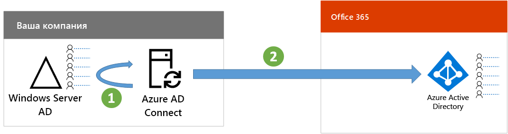
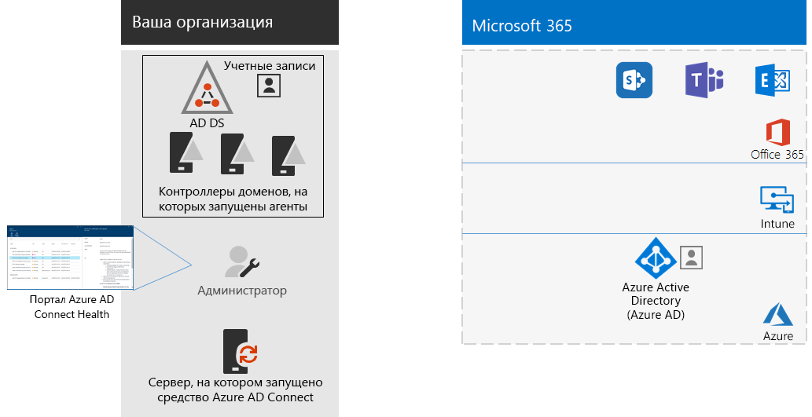

# Шаг 3. Настройка гибридного удостоверенияStep 3: Configure hybrid identity

## Синхронизация удостоверенийSynchronize identities

*Это обязательный этап для гибридных развертываний; он применяется к планам E3 и E5 Microsoft 365 корпоративный.**This is required for hybrid environments and applies to both the E3 and E5 versions of Microsoft 365 Enterprise*

В этом разделе синхронизируются локальные доменные службы Active Directory (AD DS) с клиентом Azure Active Directory (Azure AD), используемым в ваших подписках на Office 365 и Enterprise Mobility + Security (EMS).In this section, you'll synchronize your on-premises Active Directory Domain Services (AD DS) with the Azure Active Directory (Azure AD) tenant used by your Office 365 and Enterprise Mobility + Security (EMS) subscriptions.

Azure AD Connect — это поддерживаемое корпорацией Майкрософт средство, с помощью которого вы сможете синхронизировать только те удостоверения, которые вам действительно нужны, из сред AD DS с одним или несколькими лесами в свой клиент Azure AD.Azure AD Connect is the supported Microsoft tool that guides you through synchronizing only the identities you really need from single or multi-forest AD DS environments to your Azure AD tenant. На рисунке ниже показан базовый процесс для синхронизации Azure AD Connect.The following figure shows the basic process for Azure AD Connect synchronization.

1. Средство Azure AD Connect, запущенное на сервере, опрашивает службы AD DS на наличие изменений в учетных записях, группах и контактах.Azure AD Connect running on a server polls AD DS for changes in accounts, groups, and contacts.
2. Azure AD Connect отправляет эти изменения в клиент Azure AD вашей подписки на Microsoft 365.Azure AD Connect sends those changes to the Azure AD tenant of your Microsoft 365 subscription.

Первое решение, которое необходимо принять касательно гибридного решения для работы с удостоверениями, связано с требованием проверки подлинности. Ниже перечислены возможные варианты.The first decision in your hybrid identity solution is your authentication requirement. The following options are options:

- С помощью **управляемой проверки подлинности** Azure AD выполняет процесс проверки подлинности при входе пользователей в систему. Существует два указанных ниже метода управляемой проверки подлинности.With **managed authentication**, Azure AD handles the authentication process for user sign-in. There are two methods for managed authentication: 
    - **Синхронизация хэша паролей (PHS)**. [Рекомендованный и обязательный метод для некоторых премиум-функций.]**Password Hash Sync (PHS)** [Recommended and required for some premium features]. Это самый простой способ включения проверки подлинности для объектов локального каталога в Azure AD.This is the simplest way to enable authentication for on-premises directory objects in Azure AD. Azure AD Connect извлекает хэшированный пароль из AD DS, выполняет дополнительную обработку пароля для повышения безопасности и сохраняет его в Azure AD.Azure AD Connect extracts the hashed password from AD DS, does extra security processing on the password, and saves it in Azure AD. Дополнительные сведения см. в статье о [реализации синхронизации хэша паролей с помощью службы синхронизации Azure AD Connect](https://docs.microsoft.com/azure/active-directory/connect/active-directory-aadconnectsync-implement-password-synchronization).For more information, see [Implement password hash synchronization with Azure AD Connect sync](https://docs.microsoft.com/azure/active-directory/connect/active-directory-aadconnectsync-implement-password-synchronization).
    - **Сквозная проверка подлинности** — это простое решение для проверки подлинности паролей для служб на основе Azure AD.**Pass-through Authentication (PTA)** provides a simple password validation solution for Azure AD-based services. При сквозной проверке подлинности используется агент, работающий на одном или нескольких локальных серверах и проверяющий операции проверки подлинности пользователей непосредственно с помощью локальных служб AD DS.PTA uses an agent running on one or more on-premises servers to validate the user authentications directly with your on-premises AD DS. Дополнительные сведения см. в статье [Вход пользователей с помощью сквозной проверки подлинности Azure Active Directory](https://docs.microsoft.com/azure/active-directory/connect/active-directory-aadconnect-pass-through-authentication).For more information, see [User sign-in with Azure Active Directory Pass-through Authentication](https://docs.microsoft.com/azure/active-directory/connect/active-directory-aadconnect-pass-through-authentication).
- При использовании **федеративной проверки подлинности** процесс проверки подлинности перенаправляется другому поставщику удостоверений через сервер федерации удостоверений, например через службы федерации Active Directory (AD FS), для входа пользователя в систему. Поставщик удостоверений может использовать дополнительные методы проверки подлинности, например проверку подлинности на основе смарт-карт. Дополнительные сведения см. в статье [Выбор подходящего метода проверки подлинности для вашего гибридного решения для работы с удостоверениями Azure Active Directory](https://docs.microsoft.com/azure/security/azure-ad-choose-authn).With **federated authentication**, the authentication process is redirected to another identity provider through an identity federation server, such as Active Directory Federation Services (AD FS), for a user’s sign-in. The identity provider can provide additional authentication methods, such as smartcard-based authentication. For more information, see [Choosing the right authentication method for your Azure Active Directory hybrid identity solution](https://docs.microsoft.com/azure/security/azure-ad-choose-authn).

После того как вы определили гибридное решение для работы с удостоверениями, скачайте и запустите [средство устранения ошибок синхронизации каталогов IdFix](https://www.microsoft.com/download/details.aspx?id=36832), чтобы проанализировать AD DS на наличие проблем.After you've determined your hybrid identity solution, download and run the [IdFix Directory Synchronization Error Remediation Tool](https://www.microsoft.com/download/details.aspx?id=36832) to analyze your AD DS for issues.

После устранения всех проблем, найденных средством IdFix, прочитайте статью [Реализация синхронизации хэшей паролей](https://docs.microsoft.com/azure/active-directory/connect/active-directory-aadconnectsync-implement-password-hash-synchronization) с рекомендациями по установке средства Azure AD Connect и настройке синхронизации каталогов между локальными службами AD DS и клиентом Azure AD для ваших подписок на Office 365 и EMS.After resolving all of the issues identified by the IdFix tool, see [Implement password hash synchronization](https://docs.microsoft.com/azure/active-directory/connect/active-directory-aadconnectsync-implement-password-hash-synchronization) for guidance on installing the Azure AD Connect tool and configuring directory synchronization between your on-premises AD DS and the Azure AD tenant for your Office 365 and EMS subscriptions. После начала синхронизации вы будете обслуживать свои учетные записи пользователей и группы с помощью своего локального поставщика удостоверений, например AD DS.After synchronization starts, you'll maintain your user accounts and groups with your on-premises identity provider, such as AD DS.

Корпорация Майкрософт предоставляет набор рекомендаций для [удостоверений и доступа к устройству](microsoft-365-policies-configurations.md) с целью обеспечения безопасности и эффективности работы сотрудников.Microsoft provides a set of recommendations for [identity and device access](microsoft-365-policies-configurations.md) to ensure a secure and productive workforce. 

- Данные о рекомендуемых требованиях для гибридных сред см. в колонке **Active Directory с синхронизацией хэша пароля** [предварительных требований](identity-access-prerequisites.md#prerequisites).For recommended requirements for hybrid environments, see the **Active Directory with password hash sync** column in [prerequisites](identity-access-prerequisites.md#prerequisites). 

- Данные о рекомендуемых требованиях для исключительно облачных сред см. в колонке **Только в облаке** [предварительных требований](identity-access-prerequisites.md#prerequisites).For recommended requirements for cloud only environments, see the **Cloud only** column in [prerequisites](identity-access-prerequisites.md#prerequisites).

После того как ваши локальные пользователи и группы будут созданы в Azure AD, вы можете приступать к назначению лицензий и использованию Exchange Online.Once your on-premises users and groups are present in Azure AD, you can start assigning licenses and using Exchange Online. Данные о развертывании Exchange Online для ваших пользователей и миграции локальных почтовых ящиков см. в статье [Развертывания Exchange Online для Microsoft 365 корпоративный](exchangeonline-workload.md).To roll out Exchange Online to your users and migrate on-premises mailboxes, see [Deploy Exchange Online for Microsoft 365 Enterprise](exchangeonline-workload.md).

|||
|:-------|:-----|
|| [Руководство по лаборатории тестирования: синхронизация хэшей паролейTest Lab Guide: Password hash synchronization](password-hash-sync-m365-ent-test-environment.md)  [Руководство по лаборатории тестирования: сквозная проверка подлинностиTest Lab Guide: Pass-through authentication](pass-through-auth-m365-ent-test-environment.md) |
|||

Прежде чем перейти к следующему шагу, проверьте [условия](identity-exit-criteria.md#crit-identity-sync), при выполнении которых можно считать данный раздел завершенным.As an interim checkpoint, you can see the [exit criteria](identity-exit-criteria.md#crit-identity-sync) corresponding to this section.

## Отслеживание работоспособности функции синхронизацииMonitor synchronization health

*Это необязательный этап; он применяется к планам E3 и E5 Microsoft 365 корпоративный.**This is optional and applies to both the E3 and E5 versions of Microsoft 365 Enterprise*

В этом разделе вы установите агент Azure AD Connect Health на все свои локальные серверы удостоверений, чтобы отслеживать инфраструктуру идентификации и службы синхронизации, предоставляемые Azure AD Connect.In this section, you'll install an Azure AD Connect Health agent on each of your on-premises identity servers to monitor your identity infrastructure and the synchronization services provided by Azure AD Connect. Сведения, полученные в результате отслеживания, доступны на портале Azure AD Connect Health. Там вы можете просматривать оповещения, результаты отслеживания производительности, аналитические данные об использовании и прочие сведения.The monitoring information is made available in an Azure AD Connect Health portal, where you can view alerts, performance monitoring, usage analytics, and other information.

Ключевое решение о способе использования Azure AD Connect Health зависит от способа, которым вы используете Azure AD Connect.The key design decision of how to use Azure AD Connect Health is based on how you are using Azure AD Connect:

- Если вы используете **управляемую проверку подлинности**, начните работу с прочтения статьи [Мониторинг синхронизации Azure AD Connect с помощью Azure AD Connect Health](https://docs.microsoft.com/azure/active-directory/connect-health/active-directory-aadconnect-health-sync), чтобы понять и настроить Azure AD Connect Health.If you’re using the **managed authentication** option, start with [Using Azure AD Connect Health with sync](https://docs.microsoft.com/azure/active-directory/connect-health/active-directory-aadconnect-health-sync) to understand and configure Azure AD Connect Health.
- Если вы синхронизируете только имена учетных записей и групп, используя **федеративную проверку подлинности** с помощью служб федерации Active Directory (AD FS), для начала прочитайте статью [Мониторинг AD FS с помощью Azure AD Connect Health](https://docs.microsoft.com/azure/active-directory/connect-health/active-directory-aadconnect-health-adfs), чтобы понять и настроить Azure AD Connect Health.If you're synchronizing just the names of the accounts and groups using **federated authentication** with Active Directory Federation Services (AD FS), start with [Using Azure AD Connect Health with AD FS](https://docs.microsoft.com/azure/active-directory/connect-health/active-directory-aadconnect-health-adfs) to understand and configure Azure AD Connect Health.

Когда вы завершите этот раздел, у вас будут указанные ниже элементы.When you complete this section, you’ll have:

- На каждом из ваших локальных серверов поставщиков удостоверений установлен агент Azure AD Connect Health.The Azure AD Connect Health agent installed on your on-premises identity provider servers.
- На портале Azure AD Connect Health отображается текущее состояние вашей локальной инфраструктуры и действий по синхронизации с клиентом Azure AD для ваших подписок Office 365 и EMS.The Azure AD Connect Health portal displaying the current state of your on-premises infrastructure and synchronization activities with the Azure AD tenant for your Office 365 and EMS subscriptions.

Прежде чем перейти к следующему шагу, проверьте [условия](identity-exit-criteria.md#crit-identity-sync-health), при выполнении которых можно считать данный раздел завершенным.As an interim checkpoint, you can see the [exit criteria](identity-exit-criteria.md#crit-identity-sync-health) for this section.

## Следующий шагNext step

|||
|:-------|:-----|
| [Настройка безопасной проверки подлинности пользователейConfigure secure user authentication](identity-multi-factor-authentication.md)
