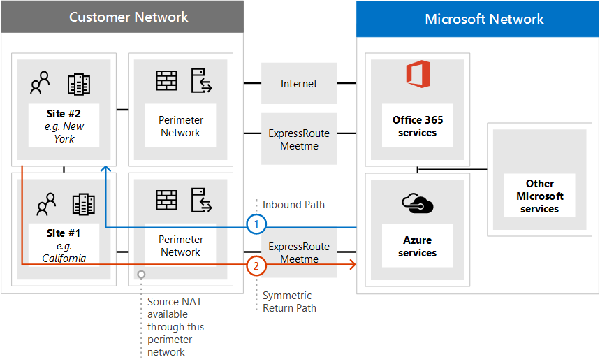

# <a name="implementing-expressroute-for-office-365"></a>Реализация средства ExpressRoute для Office 365

*Эта статья относится к Microsoft 365 корпоративный и Office 365 корпоративный.*

ExpressRoute для Office 365 предоставляет альтернативный путь маршрутки ко многим службам Office 365 с доступом к Интернету. Архитектура ExpressRoute для Office 365 основана на рекламных общедоступных IP-префиксах служб Office 365, которые уже доступны через Интернет в ваших готовых схемах ExpressRoute для последующего перераспределения этих IP-префиксов в сеть. С помощью ExpressRoute для многих служб Office 365 можно эффективно включить несколько различных путей маршрутов через Интернет и Через ExpressRoute. Такое состояние маршрутов в вашей сети может значительно изменить процесс конструирования внутренней сетевой топологии.
  
 **Состояние:** Полное руководство 2
  
Необходимо тщательно спланировать реализацию ExpressRoute для Office 365, чтобы учесть сложность сети, так как маршруты доступны как через выделенную схему с маршрутами, внедренными в основную сеть, так и через Интернет. Если вы и ваша команда не выполните подробное планирование и тестирование в этом руководстве, существует высокий риск периодических или полной потери подключения к службам Office 365, когда включена схема ExpressRoute.
  
Для успешной реализации необходимо проанализировать требования к инфраструктуре, провести подробную оценку и проектирование сети, тщательно спланировать поэтапное и контролируемое внедрение, а также разработать подробный план проверки и тестирования. В крупной распределенной среде реализации часто встречаются в течение нескольких месяцев. Это руководство предназначено для планирования заранее.
  
Планирование крупных успешных развертывание может занять шесть месяцев и часто включает участников групп из многих областей организации, включая администраторов сети, брандмауэра и прокси-сервера, администраторов Office 365, безопасности, поддержки конечных пользователей, управления проектами и спонсоров руководителей. Инвестиции в процесс планирования снижают вероятность сбоев развертывания, что приводит к простою или сложному и дорогостоящее устранению неполадок.
  
Мы ожидаем, что следующие предварительные требования будут выполнены до начала работы этого руководства по реализации.
  
1. Вы выполнили сетевую оценку, чтобы определить, рекомендуется ли ExpressRoute и утвержден ли он.

2. Вы выбрали поставщика сетевой службы ExpressRoute. Сведения о партнерах [ExpressRoute и расположениях пиринга.](https://azure.microsoft.com/documentation/articles/expressroute-locations/)

3. Вы уже прочли и поняли документацию [ExpressRoute,](https://azure.microsoft.com/documentation/services/expressroute/) и ваша внутренняя сеть может соответствовать предварительным требованиям ExpressRoute.

4. Ваша команда прочитала все открытые инструкции и документацию на сайте , а также просмотрела серию обучающих статей [https://aka.ms/expressrouteoffice365](https://aka.ms/expressrouteoffice365) [https://aka.ms/ert](https://aka.ms/ert) Azure ExpressRoute для Office [365](https://channel9.msdn.com/series/aer) на Channel 9, чтобы получить представление о важных технических подробностях, в том числе:

      - Зависимости служб SaaS от Интернета.

      - Как избежать асимметричных маршрутов и обработать сложную маршрутику.

      - Как включить элементы управления безопасностью, доступностью и уровнем приложений.

## <a name="begin-by-gathering-requirements"></a>Начните с сбора требований
<a name="requirements"> </a>

Начните с определения функций и служб, которые планируется принять в организации. Необходимо определить, какие функции различных служб Office 365 будут использоваться и в каких расположениях в вашей сети будут работать пользователи, использующие эти функции. С помощью каталога сценариев необходимо добавить сетевые атрибуты, необходимые для каждого из этих сценариев; например, потоки входящий и исходящие сетевые трафикы, а также если конечные точки Office 365 доступны через ExpressRoute или нет.
  
Чтобы собрать требования организации:
  
- Каталогизация входящий и исходящие сетевые трафик для служб Office 365, которые использует ваша организация. Описание потоков, необходимых для различных сценариев Office 365, можно получить на странице URL-адресов и диапазонов IP-адресов Office 365.

- Соберите документацию по существующей сетевой топологии с подробными сведениями о внутренней магистрали и топологии WAN, подключениях к сайтам-посредникам, подключениях пользователей за последнюю границу, маршруте к точкам периметра сети и службах прокси-сервера.

  - Определите конечные точки входящие службы на схемах сети, к которой будут подключаться Office 365 и другие службы Майкрософт, и показывая пути подключения ExpressRoute и Интернет.

  - Определите все географические расположения пользователей и подключение WAN между расположениями, а также расположения, в которых в настоящее время имеется доступ к Интернету, и расположения, для которых предлагается доступ к расположению пиринга ExpressRoute.

  - Определите все устройства, например прокси-устройства, брандмауэры и так далее, и заявите их связь с потоками через Интернет и ExpressRoute.

  - Документировать, будут ли конечные пользователи получать доступ к службам Office 365 через прямую маршрутику или прокси-сервер косвенного приложения для потоков Интернета и ExpressRoute.

- Добавьте расположение клиента и мест для встречи в схему сети.

- Оценка ожидаемой и наблюдаемой производительности сети и характеристик задержки из основных местоположений пользователей в Office 365. Помните, что Office 365 — это глобальный и распределенный набор служб, и пользователи будут подключаться к расположениям, которые могут быть не в их клиенте. По этой причине рекомендуется измерять и оптимизировать задержку между пользователем и ближайшим краем глобальной сети Майкрософт через ExpressRoute и подключения к Интернету. Для данной задачи можно использовать результаты оценки сети.

- Список требований к сетевой безопасности и высокой доступности компании, которые должны быть выполнены с помощью нового подключения ExpressRoute. Например, как пользователи продолжают получать доступ к Office 365 в случае сбоя выходов из Интернета или expressRoute.

- Документировать, какие входящие и исходящие сетевые потоки Office 365 будут использовать интернет-путь, а какие будут использовать ExpressRoute. Для определения географических расположений пользователей и сведений о локальной сетевой топологии может потребоваться, чтобы план был разным.

### <a name="catalog-your-outbound-and-inbound-network-traffic"></a>Каталогизация исходящие и входящие сетевые трафикы
<a name="trafficCatalog"> </a>

Чтобы свести к минимуму маршрутику и другие сетевые сложности, рекомендуется использовать ExpressRoute для Office 365 только для потоков сетевого трафика, необходимых для подключения, выделенного в связи с нормативными требованиями или в результате оценки сети. Кроме того, мы рекомендуем вам разграничить область маршрутации ExpressRoute и подход к потоку исходящие и входящие сетевые трафикы как разные и отдельные этапы проекта реализации. Развертывание ExpressRoute для Office 365 только для инициированных пользователем потоков исходящие сетевые трафик и оставить входящий сетевой трафик через Интернет может помочь контролировать увеличение сложности топологии и риски внедрения дополнительных асимметричных маршрутов.
  
Каталог сетевого трафика должен содержать список всех входящие и исходящие сетевые подключения между локальной сетью и Корпорацией Майкрософт.
  
- Исходящие потоки сетевого трафика — это любые сценарии, в которых подключение инициировался из локальной среды, например из внутренних клиентов или серверов, с назначением служб Майкрософт. Эти подключения могут быть прямыми к Office 365 или косвенными, например, когда подключение проходит через прокси-серверы, брандмауэры или другие сетевые устройства по пути к Office 365.

- Потоки входящий сетевой трафик — это любые сценарии, в которых подключение инициировался из облака Майкрософт к локальному хосту. Эти подключения обычно должны проходить через брандмауэр и другую инфраструктуру безопасности, требуемую политикой безопасности клиентов для внешних потоков.

Ознакомьтесь  с разделом "Обеспечение симметрии маршрута" статьи "Маршруты с помощью [ExpressRoute для Office 365",](https://support.office.com/article/Routing-with-ExpressRoute-for-Office-365-e1da26c6-2d39-4379-af6f-4da213218408) чтобы определить, какие службы будут отправлять входящий трафик, и найди столбец с пометкой **ExpressRoute для Office 365** в справочной статье по конечным точкам [Office 365,](https://support.office.com/article/Office-365-URLs-and-IP-address-ranges-8548a211-3fe7-47cb-abb1-355ea5aa88a2) чтобы определить остальные сведения о подскоке.
  
Для каждой службы, для которых требуется исходящие подключения, необходимо описать планируемое подключение для службы, включая маршрутацию сети, конфигурацию прокси-сервера, проверку пакетов и потребности в пропускной способности.
  
Для каждой службы, для которых требуется входящий подключение, потребуется дополнительная информация. Серверы в облаке Майкрософт будут устанавливать подключения к локальной сети. для правильного установления подключений необходимо описать все аспекты этого подключения, в том числе; общедоступные записи DNS для служб, которые будут принимать эти входящие подключения, IP-адреса в формате CIDR в формате CIDR, оборудование isP, а также как входящие nat или исходные NAT обрабатываются для этих подключений.
  
Входящие подключения следует проверять независимо от того, подключаются ли они через Интернет или Через ExpressRoute, чтобы обеспечить асимметричную маршрутику. В некоторых случаях к локальной конечной точке, к которую службы Office 365 инициируют входящие подключения, также может потребоваться доступ со стороны других служб Майкрософт и других служб. Важно, что включение маршрутов ExpressRoute в эти службы в целях Office 365 не разрывает другие сценарии. Во многих случаях клиентам может потребоваться внести определенные изменения во внутреннюю сеть, например NAT на основе источника, чтобы гарантировать, что входящие потоки от Майкрософт останутся симметричными после включения ExpressRoute.
  
Вот пример требуемого уровня детализации. В этом случае гибридная система Exchange будет маршрутить к локальной системе через ExpressRoute.

|**Свойство Connection**|**Значение**|
|:-----|:-----|
|**Направление сетевого трафика** <br/> |Входящий  <br/> |
|**Служба** <br/> |Гибридное развертывание Exchange  <br/> |
|**Общедоступные конечные точки Office 365 (источник)** <br/> |Exchange Online (IP-адреса)  <br/> |
|**Public On-Premises Endpoint (destination)** <br/> |5.5.5.5  <br/> |
|**Запись DNS для общего доступа (Интернет)** <br/> |Autodiscover.contoso.com  <br/> |
|**Будет ли эта конечная точка локально использоваться другими (не от Office 365) службами Майкрософт** <br/> |Нет  <br/> |
|**Будет ли эта конечная точка локальной использоваться пользователями или системами в Интернете** <br/> |Да  <br/> |
|**Внутренние системы, опубликованные через общедоступные конечные точки** <br/> |Exchange Server клиентского доступа (локально) 192.168.101, 192.168.102, 192.168.103  <br/> |
|**Объявление IP-адреса для общедоступных конечных точек** <br/> |**В Интернет**: 5.5.0.0/16  <br/> **To ExpressRoute**: 5.5.5.0/24  <br/> |
|**Элементы управления безопасностью и периметром** <br/> |**Интернет-путь**: DeviceID_002  <br/> **Путь ExpressRoute**: DeviceID_003  <br/> |
|**Высокая доступность** <br/> |Активный/активный в двух геопозиционных резервированиях  <br/> Схемы ExpressRoute — Чикаго и Даллас  <br/> |
|**Управление симметрией пути** <br/> |**Метод**: Source NAT  <br/> **Интернет-путь:** исходные входящие подключения NAT к 192.168.5.5  <br/> |**Путь ExpressRoute:** исходные подключения NAT к 192.168.1.0 (Чикаго) и 192.168.2.0 (Даллас)  <br/> |

Вот пример службы, которая только исходящие:

|**Свойство Connection**|**Значение**|
|:-----|:-----|
|**Направление сетевого трафика** <br/> |Исходящие  <br/> |
|**Служба** <br/> |SharePoint Online  <br/> |
|**Конечная точка локальной компании (источник)** <br/> |Рабочие станции пользователей  <br/> |
|**Общедоступные конечные точки Office 365 (назначение)** <br/> |SharePoint Online (IP-адреса)  <br/> |
|**Запись DNS для общего доступа (Интернет)** <br/> |\*.sharepoint.com (и дополнительные FQDNs)  <br/> |
|**Рекомендации ПО CDN** <br/> |cdn.sharepointonline.com (и дополнительные FQDN) IP-адреса, поддерживаемые поставщиками CDN)  <br/> |
|**Ip advertisement and NAT in use** <br/> |**Интернет-путь/nat источника**: 1.1.1.0/24  <br/> **Путь ExpressRoute/Исходный NAT**: 1.1.2.0/24 (Чикаго) и 1.1.3.0/24 (Даллас)  <br/> |
|**Метод Connectivity** <br/> |**Интернет**: через прокси-сервер 7-го уровня (PAC-файл)  <br/> **ExpressRoute**: прямая маршрутка (без прокси-сервера)  <br/> |
|**Элементы управления безопасностью и периметром** <br/> |**Интернет-путь**: DeviceID_002  <br/> **Путь ExpressRoute**: DeviceID_003  <br/> |
|**Высокая доступность** <br/> |**Интернет-путь:** избыточный интернет-эксгресс  <br/> **Путь ExpressRoute:** активная и активная "горячее" маршруты по 2 географически избыточным схемам ExpressRoute — Чикаго и Даллас  <br/> |
|**Управление симметрией пути** <br/> |**Метод:** исходный NAT для всех подключений  <br/> |

### <a name="your-network-topology-design-with-regional-connectivity"></a>Проектирование сетевой топологии с региональными подключениями
<a name="topology"> </a>

После того как вы поймете службы и связанные с ними потоки сетевого трафика, вы можете создать сетевую схему, включаемую эти новые требования к подключению и иллюстрирующие изменения, которые будут внесены для использования ExpressRoute для Office 365. Схема должна включать:
  
1. Все расположения пользователей, из которых будет доступ к Office 365 и другим службам.

2. Все точки доступа к Интернету и ExpressRoute.

3. Все исходящие и входящие устройства, которые управляют подключением к сети и из нее, включая маршрутизаторы, брандмауэры, прокси-серверы приложений и обнаружение и предотвращение вторжений.

4. Внутренние назначения для всего входящий трафик, например внутренние серверы ADFS, которые принимают подключения от прокси-серверов веб-приложения ADFS.

5. Каталог всех IP-подсетей, которые будут объявлены

6. Определите каждое расположение, в котором люди будут получать доступ к Office 365, и со списком мест для встречи, которые будут использоваться для ExpressRoute.

7. Расположения и части внутренней сетевой топологии, в которых префиксы IP Microsoft, которые были приняты, фильтруются и распространяются из ExpressRoute.

8. Топология сети должна иллюстрировать географическое положение каждого сегмента сети и способ подключения к сети Майкрософт через ExpressRoute и/или Интернет.

На схеме ниже показано каждое место, где люди будут использовать Office 365, а также входящие и исходящие объявления маршрутов в Office 365.
  

  
Для исходящие трафик люди имеют доступ к Office 365 одним из трех способов:
  
1. Через место встречи в Северной Америке для людей в Калифорнии.

2. Через место встречи в Гонконге для людей в Гонконге.

3. Через Интернет в Бангладеш, где меньше людей и не предусмотрена ни одна из каналов ExpressRoute.


  
Аналогичным образом, входящий сетевой трафик из Office 365 возвращается одним из трех способов:
  
1. Через место встречи в Северной Америке для людей в Калифорнии.

2. Через место встречи в Гонконге для людей в Гонконге.

3. Через Интернет в Бангладеш, где меньше людей и не предусмотрена ни одна из каналов ExpressRoute.


  
### <a name="determine-the-appropriate-meet-me-location"></a>Определение подходящего места для встречи

Выбор расположений для встречи, которые являются физическим расположением, в котором канал ExpressRoute подключает сеть к сети Майкрософт, зависит от расположений, из которых пользователи будут получать доступ к Office 365. Как предложение SaaS Office 365 не работает в рамках региональной модели IaaS или PaaS так же, как Azure. Вместо этого Office 365 — это распределенный набор служб совместной работы, где пользователям может потребоваться подключиться к конечным точкам в нескольких центрах обработки данных и регионах, которые могут не обязательно быть в одном расположении или регионе, где находится клиент пользователя.
  
Это означает, что при выборе мест для проведения встречи для ExpressRoute для Office 365 следует учитывать, откуда будут подключаться люди в вашей организации. Общая рекомендация по оптимальному подключению Office 365 — реализовать маршрутику, чтобы запросы пользователей к службам Office 365 были переданы в сеть Майкрософт по самому короткому сетевому пути. Эту маршрутику также часто называют "горячей" маршрутичностью. Например, если большинство пользователей Office 365 находятся в одном или двух местах, выбор мест для встречи со мной, которые находятся в непосредственной близости от расположения этих пользователей, создаст оптимальный дизайн. Если в вашей компании большое количество пользователей в различных регионах, может потребоваться наличие нескольких каналов ExpressRoute и мест для проведения встречи. Для некоторых местоположений пользователей самый короткий или оптимальный путь к сети Майкрософт и Office 365 может быть не через внутренние ТОЧКИ связи WAN и ExpressRoute, а через Интернет.
  
Часто в регионе с относительной близостью к пользователям можно выбрать несколько мест для встречи. Заполните следующую таблицу для принятия решений.

|**Запланированные места встречи с ExpressRoute в Калифорнии и Нью-Йорке**||
|:-----|:-----|
|Расположение  <br/> |Количество людей  <br/> |Ожидаемая задержка в сети Майкрософт через интернет-эксгрисс  <br/> |Ожидаемая задержка в сети Майкрософт через ExpressRoute  <br/> |
|Нью-Йорк  <br/> |10 000  <br/> |~15 мс  <br/> |~10 мс (через Микросхема-  <br/> |
|Округ Вашингтон  <br/> |15,000  <br/> |~20 мс  <br/> |~10 мс (через Нью-Йорк)  <br/> |
|Даллас  <br/> |5,000  <br/> |~15 мс  <br/> |~40 мс (через Нью-Йорк)  <br/> |

После разработки глобальной сетевой архитектуры, в которой показан регион Office 365, места встречи поставщика сетевой службы ExpressRoute и количество людей по расположению, ее можно использовать для определения того, можно ли выполнить оптимизацию. Кроме того, здесь могут быть глобальными сетевыми подключениями для разкрутки, при которых трафик перенабирается в удаленное расположение, чтобы получить место встречи. Если в глобальной сети обнаружена разкрутка, ее следует устранять, прежде чем продолжить. Либо найдите другое место для встречи, либо используйте выборочные точки доступа к Интернету, чтобы избежать разкрутки.
  
На первой схеме показан пример клиента с двумя физическими расположениями в Северной Америке. Вы можете увидеть сведения о расположениях офисов, расположениях клиентов Office 365 и нескольких вариантах для мест проведения встречи ExpressRoute. В этом примере клиент выбрал место для встречи на основе двух принципов в порядке:
  
1. Ближайшая близость к людям в организации.

2. Ближе всего к центру обработки данных Майкрософт, в котором находится Office 365.


  
На второй схеме показан пример того, как с подобной информацией и принятием решений сталкиваются клиенты из разных раз. У этого клиента есть небольшой офис в Бангладеш, где только небольшая группа из десяти человек нацелена на рост своего места в регионе. Существует место для встречи в Ченнаи и центр обработки данных Майкрософт с Office 365, который находится в Ченнаи, чтобы было понятно место для встречи; однако для десяти человек затраты на дополнительную схему огрубны. При взгляде на сеть вам потребуется определить, является ли задержка, необходимая для отправки сетевого трафика по сети, более эффективной, чем расходы на затраченные средства на получение другой схемы ExpressRoute.
  
Кроме того, десять человек в Бангладеш могут работать с более быстрой производительностью благодаря сетевому трафику, который передается через Интернет в сеть Майкрософт, чем маршрутизироваться по внутренней сети, как мы показали на вводных схемах и воспроизводятся ниже.
  

  
## <a name="create-your-expressroute-for-office-365-implementation-plan"></a>Создание плана реализации ExpressRoute для Office 365
<a name="implementation"> </a>

План реализации должен включать как технические сведения о настройке ExpressRoute, так и сведения о настройке всей другой инфраструктуры в сети, например следующие.
  
- Спланируйте, какие службы разделены между ExpressRoute и Интернетом.

- Планирование пропускной способности, безопасности, высокой доступности и от сбойов.

- Проектирование входящие и исходящие маршрутизации, включая правильную оптимизацию пути маршрутизации для разных местоположений

- Определите, как далеко маршруты ExpressRoute будут объявляться в вашей сети и как клиенты могут выбирать путь к Интернету или ExpressRoute; например, прямая маршрутка или прокси приложения.

- Планирование изменений записей DNS, включая [записи sender Policy Framework.](https://technet.microsoft.com/library/dn789058%28v=exchg.150%29.aspx)

- Планирование стратегии NAT, включая исходящие и входящие исходные nat.

### <a name="plan-your-routing-with-both-internet-and-expressroute-network-paths"></a>Планирование маршрутов с использованием сетевых путей к Интернету и ExpressRoute
<a name="paths"> </a>

- Для начального развертывания все входящие службы, такие как входящие сообщения электронной почты или гибридное подключение, рекомендуется использовать Интернет.

- Планирование маршрутов локальной сети клиента конечных пользователей, например настройка [файла PAC/WPAD,](https://aka.ms/manageo365endpoints)маршрута по умолчанию, прокси-серверов и объявлений маршрутов BGP.

- Планирование маршрутов периметра, включая прокси-серверы, брандмауэры и облачные прокси-серверы.

### <a name="plan-your-bandwidth-security-high-availability-and-failover"></a>Планирование пропускной способности, безопасности, высокой доступности и от сбойов
<a name="availability"> </a>

Создайте план пропускной способности, необходимой для каждой основной рабочей нагрузки Office 365. Отдельно оценив требования к пропускной способности Exchange Online, SharePoint Online и Skype для бизнеса Online. Вы можете использовать калькуляторы оценки, предоставленные для Exchange Online и Skype для бизнеса, как отправную точку; Однако для полного понимания потребностей организации в пропускной способности требуется пилотный тест с образцом профилей и местоположений пользователей.
  
Добавьте в план способ обработки безопасности в каждом интернет-расположении и расположении вытеснения ExpressRoute, помните, что все подключения ExpressRoute к Office 365 используют общедоступный пиринг и должны быть защищены в соответствии с политиками безопасности вашей компании при подключении к внешним сетям.
  
Добавьте в план сведения о том, какие люди будут затронуты в результате отключения и как эти люди смогут выполнять свою работу на полную мощность простейшим способом.
  
#### <a name="plan-bandwidth-requirements-including-skype-for-business-requirements-on-jitter-latency-congestion-and-headroom"></a>Планирование требований к пропускной способности, включая требования Skype для бизнеса к дрожаниям, задержке, перегрузке и запасу
  
Skype для бизнеса Online также предъявляет особые дополнительные требования к сети, которые подробно описаны в статье "Качество мультимедиа и производительность сетевого подключения [в Skype для бизнеса Online".](https://support.office.com/article/Media-Quality-and-Network-Connectivity-Performance-in-Skype-for-Business-Online-5fe3e01b-34cf-44e0-b897-b0b2a83f0917)
  
Ознакомьтесь с **планированием пропускной способности Azure ExpressRoute** в планировании сети с [помощью ExpressRoute для Office 365.](https://support.office.com/article/Network-planning-with-ExpressRoute-for-Office-365-103208f1-e788-4601-aa45-504f896511cd)
  
При оценке пропускной способности с пилотными пользователями вы можете воспользоваться нашим руководством; [Настройка производительности Office 365 с использованием базовых параметров и истории производительности.](https://support.office.com/article/Office-365-performance-tuning-using-baselines-and-performance-history-1492cb94-bd62-43e6-b8d0-2a61ed88ebae)
  
#### <a name="plan-for-high-availability-requirements"></a>Планирование требований к высокой доступности
  
Создайте план обеспечения высокой доступности для удовлетворения своих потребностей и включите его в обновленную схему сетевой топологии. Ознакомьтесь с разделом "Высокая доступность и отбой с **помощью Azure ExpressRoute в** планировании сети с помощью [ExpressRoute для Office 365".](https://support.office.com/article/Network-planning-with-ExpressRoute-for-Office-365-103208f1-e788-4601-aa45-504f896511cd)
  
#### <a name="plan-for-network-security-requirements"></a>Планирование требований к безопасности сети
  
Создайте план для удовлетворения требований к безопасности сети и включите его в обновленную схему сетевой топологии. Ознакомьтесь с разделом "Применение элементов управления безопасностью к **Azure ExpressRoute для сценариев Office 365"** в разделе "Планирование сети с [помощью ExpressRoute для Office 365".](https://support.office.com/article/Network-planning-with-ExpressRoute-for-Office-365-103208f1-e788-4601-aa45-504f896511cd)
  
### <a name="design-outbound-service-connectivity"></a>Проектирование подключения к исходящие службы
<a name="outbound"> </a>

ExpressRoute для Office 365 предъявляет требования к исходящие сети, которые могут быть незнакомы.  В частности, IP-адреса, которые представляют пользователей и сети для Office 365 и выступают в качестве исходных конечных точек для исходящие сетевые подключения к Майкрософт, должны выполнять определенные требования, описанные ниже.
  
1. Конечные точки должны быть общедоступными IP-адресами, зарегистрированными в вашей компании или оператором, предоставляющим подключение ExpressRoute.

2. Конечные точки должны быть объявлены корпорации Майкрософт и проверены/приняты ExpressRoute.

3. Конечные точки не должны объявляться в Интернете с той же или более предпочтительной метрикой маршрутики.

4. Конечные точки не должны использоваться для подключения к службам Майкрософт, которые не настроены через ExpressRoute.

Если сетевой дизайн не соответствует этим требованиям, существует высокий риск того, что пользователи не смогут подключаться к Office 365 и другим службам Майкрософт из-за маршрутной черной голограммы или асимметричной маршрутичности. Это происходит, когда запросы к службам Майкрософт перенанастраются через ExpressRoute, но ответы перенанастраются обратно через Интернет или наоборот, а ответы отброшены сетевыми устройствами с учетом состояния, такими как брандмауэры.
  
Наиболее распространенный метод, который можно использовать для удовлетворения вышеуказанных требований, — использовать исходный NAT, реализованный как часть сети или предоставляемый оператором ExpressRoute. Исходный NAT позволяет абстрагировать сведения и частные IP-адреса вашей интернет-сети от ExpressRoute и; В сочетании с надлежащими объявлениями IP-маршрутов обеспечивается простой механизм обеспечения симметрии пути. Если вы используете сетевые устройства с состоянием, специфичные для местоположений пиринга ExpressRoute, необходимо реализовать отдельные пулы NAT для каждого пиринга ExpressRoute, чтобы обеспечить симметрию пути.
  
Узнайте больше о [требованиях ExpressRoute NAT.](https://azure.microsoft.com/documentation/articles/expressroute-nat/)
  
Добавьте изменения для исходящие подключения к схеме сетевой топологии.
  
### <a name="design-inbound-service-connectivity"></a>Проектирование подключения к входящие службы
<a name="inbound"> </a>

В большинстве корпоративных развертывании Office 365 предполагается входящие подключения из Office 365 к локальной службе, например для гибридных сценариев Exchange, SharePoint и Skype для бизнеса, миграции почтовых ящиков и проверки подлинности с помощью инфраструктуры ADFS. Если вы включаете ExpressRoute для исходящие подключения между локальной сетью и Майкрософт, на эти входящие подключения могут случайно повлиять асимметричные маршруты, даже если эти потоки будут продолжать использовать Интернет. Рекомендуется использовать некоторые меры предосторожности, описанные ниже, чтобы не влиять на входящие потоки из Office 365 в локальной системе.
  
Чтобы свести к минимуму риски асимметричной маршрутичности для потоков входящий сетевой трафик, все входящие подключения должны использовать исходный NAT, прежде чем они будут перена перенаться в сегменты сети, которые имеют видимость маршрутизации в ExpressRoute. Если входящие подключения разрешены в сетевом сегменте с возможностью видимости маршрутов в ExpressRoute без исходных nat, запросы из Office 365 будут входить из Интернета, но ответ, возвращающийся в Office 365, будет предпочитать сетевой путь ExpressRoute обратно в сеть Майкрософт, что приводит к асимметричной маршрутике.
  
Для выполнения этого требования можно рассмотреть один из следующих шаблонов реализации:
  
1. Выполните исходный NAT, прежде чем запросы будут маршрутироваться во внутреннюю сеть с помощью сетевого оборудования, такого как брандмауэры или подсистемы балансировки нагрузки по пути из Интернета в ваши локальное системы.

2. Убедитесь, что маршруты ExpressRoute не распространяются на сегменты сети, в которых находятся входящие службы, такие как серверы переднего класса или системы обратного прокси-сервера, для обработки подключений к Интернету.

Явное учет этих сценариев в сети и сохранение всех входящий сетевой трафик через Интернет помогает свести к минимуму развертывание и операционный риск асимметричной маршрутации.
  
В некоторых случаях вы можете перенаправить некоторые входящие потоки через подключения ExpressRoute. В этих сценариях следует учесть следующие дополнительные соображения.
  
1. Office 365 может быть ориентирован только на конечные точки локальной службы, которые используют общедоступные IPS. Это означает, что даже если конечная точка локальной входящие точки только для Office 365 через ExpressRoute, с ней по-прежнему должен быть связан общедоступный IP-адрес.

2. Все разрешения имен DNS, выполняемые службами Office 365 для разрешения локальной конечной точки, выполняются с помощью общедоступных DNS. Это означает, что необходимо зарегистрировать входящие сопоставления конечных точек службы с IP-адресами в Интернете.

3. Чтобы получать входящие сетевые подключения через ExpressRoute, общедоступные IP-подсети для этих конечных точек должны быть объявлены в Microsoft over ExpressRoute.

4. Тщательно оцените эти потоки входящий сетевой трафик, чтобы убедиться, что к ним применяются надлежащие средства контроля безопасности и сети в соответствии с политиками безопасности и сети компании.

5. После того как ваши входящие конечные точки будут объявлены корпорации Майкрософт через ExpressRoute, ExpressRoute станет предпочтительным путем маршрутки к этим конечным точкам для всех служб Майкрософт, включая Office 365. Это означает, что эти подсети конечных точек должны использоваться только для связи со службами Office 365 и без других служб в сети Майкрософт. В противном случае ваша конструкция вызовет асимметричную маршрутику, в которой входящие подключения от других служб Майкрософт предпочтут маршрутировать входящие подключения через ExpressRoute, а путь возврата будет использовать Интернет.

6. В случае, если схема ExpressRoute или место встречи не будет доступно, необходимо убедиться, что входящие конечные точки локальной сети по-прежнему доступны для нахождения запросов по отдельному сетевому пути. Это может означать рекламные подсети для этих конечных точек через несколько каналов ExpressRoute.

7. Мы рекомендуем применять исходный NAT для всех потоков входящий сетевой трафик, входящий в сеть через ExpressRoute, особенно если эти потоки пересекают сетевые устройства с состоянием, такие как брандмауэры.

8. Некоторые из локальной служб, например прокси-сервер ADFS или служба автообнаружия Exchange, могут получать входящие запросы как от служб Office 365, так и от пользователей из Интернета. Для этих запросов Office 365 будет ориентирован на то же FQDN, что и запросы пользователей через Интернет. Разрешение входящие подключения пользователей из Интернета к этим конечным точкам в локальной сети, а принудительный использование ExpressRoute для подключений Office 365 представляет значительную сложность маршрутов. Для подавляющего большинства клиентов, реализующих такие сложные сценарии через ExpressRoute, не рекомендуется из-за операционных соображений. Эти дополнительные затраты включают в себя управление рисками асимметричной маршрутики и требуют тщательного управления рекламой и политиками маршрутики в различных измерениях.

### <a name="update-your-network-topology-plan-to-show-how-you-would-avoid-asymmetric-routes"></a>Обновите план сетевой топологии, чтобы показать, как избежать асимметричных маршрутов
<a name="asymmetric"> </a>

Вы хотите избежать асимметричной маршрутизации, чтобы пользователи в вашей организации могли без проблем использовать Office 365 и другие важные службы в Интернете. Существует две распространенные конфигурации, которые вызывают асимметричную маршрутику. Пришло время проверить конфигурацию сети, которая планируется использовать, и проверить, может ли существовать один из этих сценариев асимметричной маршрутики.
  
Для начала рассмотрим несколько различных ситуаций, связанных со следующей схемой сети. На этой схеме все серверы, получающие входящие запросы, такие как ADFS или локально гибридные серверы, находятся в центре обработки данных Нью-Джерси и объявляются в Интернете.
  
1. Несмотря на то что сеть периметра защищена, для входящих запросов отсутствует исходный NAT.

2. Серверы в центре обработки данных Нью-Джерси могут видеть маршруты Через Интернет и ExpressRoute.


  
У нас также есть рекомендации по их исправлению.
  
#### <a name="problem-1-cloud-to-on-premises-connection-over-the-internet"></a>Проблема 1. Облачное подключение к локальному подключению через Интернет
  
На следующей схеме показано асимметричное сетевое путь, который был сделан, когда конфигурация сети не предоставляет NAT для входящие запросы из Облака Майкрософт через Интернет.
  
1. Входящий запрос из Office 365 извлекает IP-адрес локальной конечной точки из общедоступных DNS и отправляет запрос в сеть периметра.

2. В этой неисправной конфигурации в сети периметра, куда отправляется трафик, отсутствует настройка или доступ к источнику NAT, в результате чего в качестве места назначения возвращается фактический исходный IP-адрес.

  - Сервер в вашей сети маршрутит возвращенный трафик в Office 365 через любое доступное сетевое подключение ExpressRoute.

  - Результатом является асимметричный путь для этого потока к Office 365, в результате чего соединение не работает.


  
##### <a name="solution-1a-source-nat"></a>Решение 1a: исходный NAT
  
Простое добавление источника NAT в входящий запрос устраняет эту неправильно сконфигурованную сеть. На этой схеме:
  
1. Входящий запрос продолжает проходить через сеть периметра центра обработки данных Нью-Джерси. На этот раз доступен исходный NAT.

2. Ответ от сервера возвращается к IP-адресу, связанному с исходным NAT, а не к исходному IP-адресу, в результате чего ответ возвращается по тому же сетевому пути.


  
##### <a name="solution-1b-route-scoping"></a>Решение 1b: области маршрута
  
Кроме того, можно отключить объявление префиксов BGP ExpressRoute, удалив альтернативный сетевой путь для этих компьютеров. На этой схеме:
  
1. Входящий запрос продолжает проходить через сеть периметра центра обработки данных Нью-Джерси. На этот раз префиксы, объявленные корпорацией Майкрософт по каналу ExpressRoute, недоступны в центре обработки данных Нью-Джерси.

2. Ответ от сервера возвращается к IP-адресу, связанному с исходным IP-адресом, через единственный доступный маршрут, в результате чего ответ возвращается по тому же сетевому пути.


  
#### <a name="problem-2-cloud-to-on-premises-connection-over-expressroute"></a>Проблема 2. Облачное подключение к локальному подключению через ExpressRoute
  
На следующей схеме показано асимметричное сетевое расположение, принятое, когда конфигурация сети не предоставляет NAT для входящие запросы из Облака Майкрософт через ExpressRoute.
  
1. Входящий запрос из Office 365 извлекает IP-адрес из DNS и отправляет запрос в сеть периметра.

2. В этой неисправной конфигурации в сети периметра, куда отправляется трафик, отсутствует настройка или доступ к источнику NAT, в результате чего в качестве места назначения возвращается фактический исходный IP-адрес.

  - Компьютер в сети маршрутит возвращаемой трафик в Office 365 через любое доступное сетевое подключение ExpressRoute.

  - Результатом является асимметричное подключение к Office 365.


  
##### <a name="solution-2-source-nat"></a>Решение 2. Исходный NAT
  
Простое добавление источника NAT в входящий запрос устраняет эту неправильно сконфигурованную сеть. На этой схеме:
  
1. Входящий запрос продолжает проходить через сеть периметра центра обработки данных Нью-Йорка. На этот раз доступен исходный NAT.

2. Ответ от сервера возвращается к IP-адресу, связанному с исходным NAT, а не к исходному IP-адресу, в результате чего ответ возвращается по тому же сетевому пути.


  
### <a name="paper-verify-that-the-network-design-has-path-symmetry"></a>В документе по проверке того, что проект сети имеет симметрию пути

На этом этапе необходимо проверить на бумаге, что ваш план реализации обеспечивает симметрию маршрута для различных сценариев, в которых вы будете использовать Office 365. Вы определите конкретный сетевой маршрут, который должен быть сделан, когда человек использует различные функции службы. Из локальной сети и маршруты WAN-подключения к устройствам периметра к пути подключения; ExpressRoute или Интернет, а также подключение к сетевой конечной точке.
  
Это необходимо сделать для всех сетевых служб Office 365, которые ранее были определены как службы, которые будут приняты в вашей организации.
  
В этом документе помогают проходить маршруты со вторым человеком. Объяснить им, откуда каждый сетевой прыжок должен получить свой следующий маршрут, и убедитесь, что вы знакомы с путями маршрутов. Помните, что ExpressRoute всегда предоставляет более объемный маршрут к IP-адресам сервера Майкрософт, что снижает стоимость маршрута по сравнению с интернет-маршрутом по умолчанию.
  
### <a name="design-client-connectivity-configuration"></a>Настройка подключения клиента разработки
<a name="asymmetric"> </a>


  
Если вы используете прокси-сервер для трафика, связанного с Интернетом, необходимо настроить все PAC-файлы или файлы конфигурации клиента, чтобы клиентские компьютеры в сети правильно настроили отправку трафика ExpressRoute в Office 365 без перенаправки прокси-сервера, а остальной трафик, включая трафик Office 365, отправляется соответствующему прокси-серверу. Ознакомьтесь с нашим руководством [по управлению конечными точками Office 365,](https://aka.ms/manageo365endpoints) например файлами PAC.
  
> [!NOTE]
> Конечные точки меняются часто, как и еженедельно. Следует вносить изменения только в зависимости от служб и функций, принятых в организации, чтобы уменьшить количество изменений, которые необходимо внести, чтобы оставаться в актуальных условиях. Уделите особое  внимание дате начала работы в RSS-канале, в которой объявляются изменения и записи всех прошлых изменений. Ip-адреса, которые объявляются, могут не объявляться или удаляться из рекламы до тех пор, пока не будет достигнута дата начала действия.
  
## <a name="build-your-deployment-and-testing-procedures"></a>Создание процедур развертывания и тестирования
<a name="testing"> </a>

План реализации должен включать как тестирование, так и планирование отката. Если реализация не работает должным образом, план должен быть разработан для влияния на наименьшее количество людей, прежде чем будут обнаружены проблемы. Ниже учесть некоторые высокоуровневые принципы, которые следует учитывать в вашем плане.
  
1. Поэтапное перенабор сегмента сети и пользовательской службы, чтобы свести к минимуму нарушения работы.

2. Планирование тестирования маршрутов с подключением traceroute и TCP с отдельного подключенного к Интернету хоста.

3. Желательно, чтобы тестирование входящие и исходящие службы можно было выполнять в изолированной тестовой сети с тестовой клиентом Office 365.

      - Кроме того, тестирование можно выполнить в производственной сети, если клиент еще не использует Office 365 или находится в пилотном режиме.

      - Кроме того, тестирование можно выполнить во время простоя производства, выделенного только для тестирования и мониторинга.

      - Кроме того, тестирование можно проверить, проверив маршруты для каждой службы на каждом узле маршрутизатора 3 уровня. Этот вариант следует использовать только в том случае, если другие проверки не возможны, так как отсутствие физического тестирования представляет риск.

### <a name="build-your-deployment-procedures"></a>Создание процедур развертывания

Процедуры развертывания должны развертываться для небольших групп людей поэтапно, чтобы разрешить тестирование перед развертыванием в больших группах людей. Ниже приводится несколько способов поэтапного развертывания ExpressRoute.
  
1. Настройка ExpressRoute с пирингом Майкрософт и перенаправка рекламы маршрута на один хост только для поэтапного тестирования.

2. Сначала объявлять маршруты в сеть ExpressRoute в один сегмент сети и расширять объявления маршрутов по сегменту сети или региону.

3. При первом развертывании Office 365 используйте сетевое развертывание ExpressRoute в качестве пилотного развертывания для небольшого количества людей.

4. При использовании прокси-серверов можно также настроить тестовый PAC-файл, чтобы направить небольшое количество пользователей в ExpressRoute с проверкой и отзывами перед добавлением дополнительных данных.

В плане реализации должен быть список всех процедур развертывания, которые необходимо принять, или команд, которые необходимо использовать для развертывания конфигурации сети. По инициации отключения сети все внося изменения должны быть внесены из письменного плана развертывания, который был написан заранее и рассмотрен одноранговой службой. См. наши рекомендации по технической настройке ExpressRoute.
  
- Обновление записей SPF TXT, если вы изменили IP-адреса для любых локального сервера, которые продолжат отправлять электронную почту.

- Обновление записей DNS для локального сервера, если ВЫ изменили IP-адреса для новой конфигурации NAT.

- Убедитесь, что вы подписаны на RSS-канал для уведомлений конечной точки Office 365, чтобы поддерживать любые конфигурации маршрутов или прокси-сервера.

После завершения развертывания ExpressRoute необходимо выполнить процедуры в плане тестирования. Результаты для каждой процедуры следует регистрировать в журнале. Необходимо включить процедуры отката в исходную производственную среду, если результаты тестового плана указывают на то, что реализация не была успешной.
  
### <a name="build-your-test-procedures"></a>Создание процедур тестирования

Процедуры тестирования должны включать тесты для каждой исходящие и входящие сетевые службы для Office 365, которые будут использовать ExpressRoute, и те, которые не будут использовать. Процедуры должны включать тестирование из каждого уникального сетевого расположения, включая пользователей, которые не находятся локально в корпоративной локальной сети.
  
Ниже примеры действий по проверке.
  
1. Ping from your on-premises router to your network operator router.

2. Проверьте, что объявления IP-адресов Office 365 и CRM Online 500+ и CRM Online получены вашим локальном маршрутизаторе.

3. Проверьте, работает ли nat входящие и исходящие данные между ExpressRoute и внутренней сетью.

4. Проверьте, что маршруты в NAT объявляются из маршрутизатора.

5. Проверьте, что ExpressRoute принял ваши объявленные префиксы.

      - Используйте следующий cmdlet для проверки рекламы пиринга:

      ```PowerShell
      Get-AzureRmExpressRouteCircuitRouteTable -DevicePath Primary -ExpressRouteCircuitName TestER -ResourceGroupName RG -PeeringType MicrosoftPeering
      ```

6. Проверьте, что общедоступный диапазон IP-адресов NAT не объявляется корпорации Майкрософт через любую другую сетевую сеть ExpressRoute или общедоступный интернет-канал, если он не является определенным подмножеством большего диапазона, как в предыдущем примере.

7. Цепи ExpressRoute сопряжены, проверяют, запущены ли оба сеанса BGP.

8. Настройка одного хоста внутри nat и использование ping, tracert и tcpping для проверки подключения к новой схеме с хост-outlook.office365.com. Кроме того, можно использовать такое средство, как Wireshark или Microsoft Network Monitor 3.4, на зеркальном порте msEE для проверки возможности подключения к IP-адресу, связанному с outlook.office365.com.

9. Тестирование функциональных возможностей уровня приложения для Exchange Online.

  - Проверьте, может ли Outlook подключиться к Exchange Online и отправлять и получать электронную почту.

  - Протестировать Outlook можно в интерактивном режиме.

  - Проверьте возможность подключения смартфона и возможности отправки и получения.

10. Тестирование функциональности уровня приложения для SharePoint Online

  - Протестируйте клиент синхронизации OneDrive для бизнеса.

  - Протестировать веб-доступ к SharePoint Online.

11. Тестирование функциональных возможностей уровня приложения для сценариев звонков Skype для бизнеса:

  - Присоединитесь к конференции в качестве пользователя, подлинность пользователя [приглашение, инициированное конечным пользователем].

  - Приглашение пользователя на конференц-вызов [приглашение, отправленного из MCU].

  - Присоединитесь к конференции как анонимный пользователь с помощью веб-приложения Skype для бизнеса.

  - Присоединитесь к вызову с проводного ПК, IP-телефона и мобильного устройства.

  - Call to federated user o Call to PSTN Validation: call is completed, call quality is acceptable, connection time is acceptable.

  - Убедитесь, что состояние присутствия для контактов обновлено как для участников клиента, так и для федераированных пользователей.

### <a name="common-problems"></a>Распространенные проблемы

Наиболее распространенная проблема реализации — асимметричная маршрутика. Вот несколько распространенных источников, которые необходимо найти:
  
- Использование открытой или плоской топологии сетевой маршрутики без использования nat источника.

- Не использовать SNAT для маршрутов во входящие службы через подключения к Интернету и ExpressRoute.

- Не тестировать входящие службы на ExpressRoute в тестовой сети перед развертыванием в широком масштабе.

## <a name="deploying-expressroute-connectivity-through-your-network"></a>Развертывание подключения ExpressRoute через сеть
<a name="testing"> </a>

Поэтапное развертывание на одном сегменте сети, постепенное развертывание подключения к различным частям сети с планом отката для каждого нового сегмента сети. Если развертывание соответствует развертыванию Office 365, сначала разверните развертывание для пилотных пользователей Office 365 и расширите его.
  
Сначала для тестирования, а затем для производства:
  
- Запустите этапы развертывания, чтобы включить ExpressRoute.

- Проверьте, как вы видите сетевые маршруты.

- Выполните тестирование для каждой входящие и исходящие службы.

- Откат при обнаружении проблем.

### <a name="set-up-a-test-connection-to-expressroute-with-a-test-network-segment"></a>Настройка тестового подключения к ExpressRoute с тестовым сетевым сегментом

Теперь, когда у вас есть завершенный план на бумаге, пришло время протестировать его в небольшом масштабе. В этом тесте будет устанавливаться одно подключение ExpressRoute с Пирингом (Майкрософт) к тестовой подсети в локальной сети. Вы можете настроить пробный клиент [Office 365](https://go.microsoft.com/fwlink/p/?LinkID=403802) с подключением к тестовой подсети и из нее и включить все исходящие и входящие службы, которые будут использовать в производственной подсети. Настройка DNS для тестового сегмента сети и создание всех входящие и исходящие службы. Выполните план тестирования и убедитесь, что вы знакомы с маршрутицией для каждой службы и распространением маршрута.
  
### <a name="execute-the-deployment-and-test-plans"></a>Выполнение планов развертывания и тестирования

Завершив описанные выше элементы, ознакомьтесь с областями, которые вы завершили, и убедитесь, что вы и ваша группа проверили их перед выполнением планов развертывания и тестирования.
  
- Список исходящие и входящие службы, участвующие в изменении сети.

- Схема глобальной сетевой архитектуры, на которой показаны как интернет-эксгресс, так и места встречи ExpressRoute.

- Схема сетевой маршрутки, демонстрирующие различные сетевые пути, используемые для каждой развернутой службы.

- План развертывания с действиями по реализации изменений и отката при необходимости.

- План тестирования для тестирования каждой службы Office 365 и сетевой службы.

- Завершена проверка производственных маршрутов для входящие и исходящие службы.

- Завершенный тест в тестовом сегменте сети, включая тестирование доступности.

Выберите окно отключения, достаточное для запуска всего плана развертывания и плана тестирования, и при необходимости у вас будет некоторое время для устранения неполадок и отката.
  
> [!CAUTION]
> Из-за сложного характера маршрутизации через Интернет и ExpressRoute рекомендуется добавить дополнительное время буфера в это окно для устранения неполадок сложной маршрутизации.
  
### <a name="configure-qos-for-skype-for-business-online"></a>Настройка QoS для Skype для бизнеса Online

QoS необходим для получения преимуществ голосовой и собраний для Skype для бизнеса Online. Вы можете настроить QoS после того, как убедитесь, что сетевое подключение ExpressRoute не блокирует доступ к другим службам Office 365. Конфигурация для QoS описана в статье [ExpressRoute и QoS в Skype для бизнеса Online.](https://support.office.com/article/ExpressRoute-and-QoS-in-Skype-for-Business-Online-20c654da-30ee-4e4f-a764-8b7d8844431d)
  
## <a name="troubleshooting-your-implementation"></a>Устранение неполадок реализации
<a name="troubleshooting"> </a>

В первую очередь нужно посмотреть на шаги в этом руководстве по реализации, пропущены ли какие-либо из них в плане реализации? По возможности выйдите и запустите дополнительное небольшое сетевое тестирование, чтобы реплицировать ошибку и отлалать ее там.
  
Определите, какие входящие или исходящие службы не удалось найти во время тестирования. Получите IP-адреса и подсети для каждой из служб, которые не удалось получить. Перейдите к схеме сетевой топологии на бумаге и проверьте маршрут. Проверьте, в частности, где объявлена маршрутка ExpressRoute. По возможности проверьте маршрутику во время простоя с помощью трассировки.
  
Запустите PSPing с сетевой трассировой для каждой конечной точки клиента и оцените исходные и конечные IP-адреса, чтобы проверить их правильность. Запустите telnet на любом почтовом сайте, который вы предоставляете через порт 25, и убедитесь, что SNAT скрывает исходный IP-адрес, если это ожидаемо.
  
Помните, что при развертывании Office 365 с подключением ExpressRoute необходимо обеспечить оптимальную настройку сети для ExpressRoute, а также оптимизировать другие компоненты сети, такие как клиентские компьютеры. Помимо использования этого руководства по планированию для устранения неполадок, которые вы могли пропустить, мы также написали план устранения неполадок производительности [для Office 365.](https://support.office.com/article/Performance-troubleshooting-plan-for-Office-365-e241e5d9-b1d8-4f1d-a5c8-4106b7325f8c)
  
Вы можете быстро вернуться сюда с помощью этой короткой ссылки: [https://aka.ms/implementexpressroute365](https://aka.ms/implementexpressroute365)
  
## <a name="related-topics"></a>Статьи по теме

[Оценка сетевого подключения к Office 365](assessing-network-connectivity.md)
  
[Azure ExpressRoute для Office 365](azure-expressroute.md)
  
[Управление подключением ExpressRoute для Office 365](managing-expressroute-for-connectivity.md)
  
[Маршрутизация с использованием ExpressRoute для Office 365](routing-with-expressroute.md)
  
[Планирование сети при использовании ExpressRoute для Office 365](network-planning-with-expressroute.md)
  
[Использование сообществ BGP в ExpressRoute для сценариев Office 365](bgp-communities-in-expressroute.md)
  
[Качество мультимедиа и характеристики сетевого подключения в случае Skype для бизнеса Online](https://support.office.com/article/5fe3e01b-34cf-44e0-b897-b0b2a83f0917)
  
[Оптимизация сети для Skype для бизнеса Online](https://support.office.com/article/b363bdca-b00d-4150-96c3-ec7eab5a8a43)
  
[ExpressRoute и качество обслуживания в Skype для бизнеса Online](https://support.office.com/article/20c654da-30ee-4e4f-a764-8b7d8844431d)
  
[Поток вызовов с использованием ExpressRoute](https://support.office.com/article/413acb29-ad83-4393-9402-51d88e7561ab)
  
[Настройка производительности Office 365 с помощью базовых показателей и журнала производительности](performance-tuning-using-baselines-and-history.md)
  
[План устранения проблем с производительностью Office 365](performance-troubleshooting-plan.md)
  
[URL-адреса и диапазоны IP-адресов для Office 365](https://support.office.com/article/8548a211-3fe7-47cb-abb1-355ea5aa88a2)
  
[Сеть Office 365 и настройка производительности](network-planning-and-performance.md)
