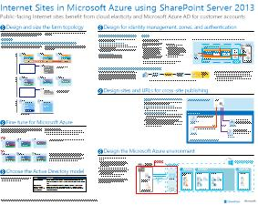

# Веб-сайты в Microsoft Azure, использующие SharePoint Server 2013

 Веб-сайты, SharePoint Server 2013, получают преимущество, находясь в службах инфраструктуры Azure. В этой статье приводятся ресурсы, посвященные разработке и реализации этого решения.

## Использование служб инфраструктуры Azure для веб-сайтов

Microsoft Azure предусматривает возможность размещения веб-сайтов на основе SharePoint Server 2013. Преимущества:

- фокус на разработке хорошего сайта, а не создании инфраструктуры;

- гибкость масштабирования решения в соответствии с потребностями;

- оплату только за нужные и используемые ресурсы;

- преимущества Azure Active Directory для учетных записей клиентов;

- Добавьте функции, недоступные в Microsoft 365, например глубокую отчетность и аналитику.

## Ресурсы

В приведенных ниже технических иллюстрациях и статьях представлены сведения о разработке и реализации веб-сайтов на платформе Azure с помощью SharePoint Server 2013.

|Ресурс|Дополнительные сведения|
|---|---|
|Веб-сайты **SharePoint Server 2013 в Azure**      [PDF](https://go.microsoft.com/fwlink/p/?LinkId=392552) \| [Visio](https://go.microsoft.com/fwlink/p/?LinkId=392551)|В этой модели показаны основные задачи проектирования и рекомендуемые варианты архитектуры для веб-сайтов в Azure.|
|**Пример проектирования: веб-сайты в Azure для SharePoint Server 2013**   [  ]   [PDF](https://go.microsoft.com/fwlink/p/?LinkId=392549)  \| [Visio](https://go.microsoft.com/fwlink/p/?LinkId=392548)|Используйте этот пример в качестве отправной точки для создания своей архитектуры.|
|**[Архитектуры Microsoft Azure для SharePoint 2013](microsoft-azure-architectures-for-sharepoint-2013.md)**   |В этой статье описано проектирование архитектур Azure для размещения решений SharePoint.|
|

## См. также

[Центр архитектуры и решений Microsoft 365](../solutions/index.yml)