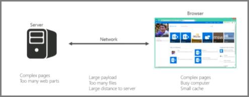

# Общие сведения о настройке производительности для SharePoint OnlineIntroduction to performance tuning for SharePoint Online

В этой статье объясняется, какие конкретные аспекты необходимо учитывать при разработке страниц для лучшей производительности в SharePoint Online.This article explains what specific aspects you need to consider when designing pages for best performance in SharePoint Online.
     
## Метрик SharePoint OnlineSharePoint Online metrics

Следующие широкие показатели для SharePoint Online предоставляют реальные данные о производительности:The following broad metrics for SharePoint Online provide real world data about performance:
  
- Скорость загрузки страницHow fast pages load
    
- Сколько разных поездок требуется на страницуHow many round trips required per page
    
- Проблемы со службойIssues with the service
    
- Другие вещи, которые вызывают ухудшение производительностиOther things that cause performance degradation
    
### Выводы, сделанные из-за данныхConclusions reached because of the data

Данные говорят нам:The data tells us:
  
- Большинство страниц хорошо выполняются в SharePoint Online.Most of the pages perform well on SharePoint Online.
    
- Не настраиваемые страницы загружаются очень быстро.Non-customized pages load very quickly.
    
- OneDrive для бизнеса, сайты команд и страницы системы, такие как _layouts и т.д., быстро загружаются.OneDrive for Business, team sites and system pages, such as _layouts, etc., are all quick to load.
    
- Для загрузки самых медленных 1% страниц SharePoint Online требуется более 5000 миллисекунд.The slowest 1% of SharePoint Online pages take more than 5,000 milliseconds to load.
    
Один простой тест, который можно использовать для измерения производительности, сравнивая время загрузки собственного портала с временем загрузки домашней страницы OneDrive для бизнеса, так как она использует несколько настраиваемых функций.One simple benchmark test you can use would be to measure performance by comparing the load time of your own portal against the load time of the OneDrive for Business home page as it uses few customized features. Это часто будет первым шагом, который поддержка попросит вас завершить при устранении неполадок с производительностью сети.This will often be the first step Support will ask you to complete when troubleshooting network performance issues.
  
## Использование стандартной учетной записи пользователя при проверке производительностиUse a standard user account when checking performance

Администратор коллекции сайтов, владелец сайта, редактор или участник относятся к дополнительным группам безопасности, имеют дополнительные разрешения и, следовательно, имеют дополнительные элементы, загружающие SharePoint на страницу.A Site Collection Administrator, Site Owner, Editor, or Contributor belong to additional security groups, have additional permissions, and therefore have additional elements that SharePoint loads on a page.
  
Это применимо к локальной sharePoint и SharePoint Online, но в локальном сценарии различия будут не так легко заметить, как в SharePoint Online.This is applicable to SharePoint on-premises and SharePoint Online but in an on-premises scenario the differences will not be as easily noticed as in SharePoint Online.
  
Чтобы правильно оценить, как будет работать страница для пользователей, следует использовать стандартную учетную запись пользователя, чтобы избежать загрузки элементов управления авторизации и дополнительного трафика, связанного с группами безопасности.In order to correctly evaluate how a page will perform for users, you should use a standard user account to avoid loading the authoring controls and additional traffic related to security groups.
  
## Категории подключения для настройки производительностиConnection categories for performance tuning

Связи между сервером и пользователем можно классифицировать на три основных компонента.You can categorize the connections between the server and the user into three main components. Рассмотрите их при разработке страниц SharePoint Online, чтобы получить представление о времени нагрузки.Consider these when designing SharePoint Online pages for insight into load times.
  
- **Сервер** Серверы, на которые Майкрософт размещены в центрах обработки данных.**Server** The servers that Microsoft hosts in datacenters.
    
- **Сеть** Сеть Майкрософт, Интернет и локальное подключение между центром обработки данных и пользователями.**Network** The Microsoft network, the Internet, and your on-premises network between the datacenter and your users.
    
- **Браузер** Загрузка страницы.**Browser** Where the page is loaded.
    
В этих трех подключениях обычно существует пять причин, которые вызывают 95% медленных страниц.Within these three connections there are typically five reasons that cause 95% of slow pages. Каждая из этих причин обсуждается в этой статье:Each of these reasons is discussed in this article:
  
- Проблемы с навигациейNavigation issues
    
- Свернутый контентContent roll up
    
- Большие файлыLarge files
    
- Много запросов на серверMany requests to the server
    
- Обработка веб-частиWeb Part processing
    
### Подключение к серверуServer connection

Многие проблемы, влияющие на производительность в локальной сети SharePoint, также относятся к SharePoint Online.Many of the issues that affect performance with SharePoint on-premises also apply to SharePoint Online.
  
Как вы и ожидали, у вас есть гораздо больше контроля над тем, как серверы выполняются с локальной SharePoint.As you would expect, you have far more control over how servers perform with on-premises SharePoint. С SharePoint Online все немного по-другому.With SharePoint Online things are a little different. Чем больше работы вы сделаете на сервере, тем дольше будет отрисовка страницы.The more work you make a server do, the longer it takes to render a page. В SharePoint самыми крупными виновниками в этом отношении являются сложные страницы с несколькими веб-частями.With SharePoint, the biggest culprit in this respect are complex pages with multiple web parts.
  
Локальное помещение SharePoint ServerSharePoint Server on-premises
  

  
SharePoint OnlineSharePoint Online
  

  
В SharePoint Online некоторые запросы на страницы могут вызывать несколько серверов.With SharePoint Online, certain page requests may actually end up calling multiple servers. Вы можете получить матрицу запросов между серверами для отдельного запроса.You could end up with a matrix of requests between servers for an individual request. Эти взаимодействия являются дорогостоящими с точки зрения нагрузки на страницу и замедляют процессы.These interactions are expensive from a page load perspective and will make things slow.
  
Примеры взаимодействия этих серверов с сервером:Examples of these server to server interactions are:
  
- Веб-SQL серверовWeb to SQL Servers
    
- Веб-серверы приложенийWeb to application servers
    
Другая вещь, которая может замедлить взаимодействие серверов, это пропуска кэш.The other thing that can slow down server interactions is cache misses. В отличие от локальной SharePoint, существует очень малая вероятность того, что вы нажмитесь на тот же сервер для страницы, которую вы посещали ранее; это делает кэшинг объектов устаревшим.Unlike on-premises SharePoint, there is a very slim chance that you will hit the same server for a page that you have visited previously; this makes object caching obsolete.
  
### Подключение к сети Network connection

С локальной sharePoint, которая не использует WAN, вы можете использовать высокоскоростное подключение между центрами обработки данных и конечными пользователями.With on-premises SharePoint that doesn't make use of a WAN, you may use a high-speed connection between datacenter and end-users. Как правило, с сетевой точки зрения все легко управлять.Generally, things are easy to manage from a network perspective.
  
В SharePoint Online необходимо учитывать еще несколько факторов. Например:With SharePoint Online, there are a few more factors to consider; for example:
  
- Сеть МайкрософтThe Microsoft network
    
- ИнтернетThe Internet
    
- The ISPThe ISP
    
Независимо от того, какую версию SharePoint (и какую сеть) вы используете, к числу вещей, которые обычно приводят к загружению сети, относятся следующие:Regardless of which version of SharePoint (and which network) you are using, things that will typically cause the network to be busy include:
  
- Большая полезной нагрузкиLarge payload
    
- Много файловMany files
    
- Большое физическое расстояние до сервераLarge physical distance to the server
    
Одной из функций, которую можно использовать в SharePoint Online, является Microsoft CDN (Сеть доставки контента).One feature that you can leverage in SharePoint Online is the Microsoft CDN (Content Delivery Network). CDN — это в основном распределенная коллекция серверов, развернутых в нескольких центрах обработки данных.A CDN is basically a distributed collection of servers deployed across multiple datacenters. С помощью CDN содержимое на страницах может быть организовано на сервере, близком к клиенту, даже если клиент находится далеко от исходящего SharePoint Server.With a CDN, content on pages can be hosted on a server close to the client even if the client is far away from the originating SharePoint Server. В будущем корпорация Майкрософт будет использовать эти дополнительные данные для хранения локальных экземпляров страниц, которые невозможно настроить, например домашней страницы администратора SharePoint Online.Microsoft will be using this more in the future to store local instances of pages which cannot be customized, for example the SharePoint Online admin home page. Дополнительные сведения о CDNs см. в [материалах сетей доставки контента.](content-delivery-networks.md)For more information about CDNs, see [Content delivery networks](content-delivery-networks.md).
  
Что-то, что вам нужно знать, но не может быть в состоянии сделать много о является скорость подключения вашего isP.Something that you need to be aware of but may not be able to do much about is the connection speed of your ISP. Простой тестовый инструмент скорости скажет вам скорость подключения.A simple speed test tool will tell you the connection speed.
  
### Подключение к браузеруBrowser connection

Существует несколько факторов, которые следует учитывать с помощью веб-браузеров с точки зрения производительности.There are a few factors to consider with web browsers from a performance perspective.
  
Посещение сложных страниц повлияет на производительность.Visiting complex pages will affect performance. Большинство браузеров имеют небольшой кэш (около 90 МБ), в то время как средняя веб-страница обычно составляет около 1,6 МБ.Most browsers only have a small cache (around 90MB), while the average web page is typically around 1.6MB. Это не займет много времени, чтобы привыкнуть.This doesn't take long to get used up.
  
Пропускная способность также может быть проблемой.Bandwidth may also be an issue. Например, если пользователь смотрит видео на другом сеансе, это повлияет на производительность страницы SharePoint.For example, if a user is watching videos in another session, this will affect the performance of your SharePoint page. Хотя вы не можете запретить пользователям потоковое мультимедиа, вы можете управлять загрузкой страницы для пользователей.While you can't prevent users from streaming media, you can control the way a page will load for users.
  
Ознакомьтесь со следующими статьями для различных методов настройки страниц SharePoint Online и других методов, которые помогут вам достичь оптимальной производительности.Check out the following articles for different SharePoint Online page customization techniques and other best practices to help you achieve optimal performance.
  
- [Параметры навигации для SharePoint OnlineNavigation options for SharePoint Online](navigation-options-for-sharepoint-online.md)
    
- [Используйте средство диагностики страниц для SharePoint OnlineUse the Page Diagnostics tool for SharePoint Online](page-diagnostics-for-spo.md)
    
- [Оптимизация изображений для SharePoint OnlineImage optimization for SharePoint Online](image-optimization-for-sharepoint-online.md)
    
- [Задержка при загрузке изображений и JavaScript-файлов в SharePoint OnlineDelay loading images and JavaScript in SharePoint Online](delay-loading-images-and-javascript-in-sharepoint-online.md)
    
- [Минификация и объединение в SharePoint OnlineMinification and bundling in SharePoint Online](minification-and-bundling-in-sharepoint-online.md)
    
- [Использование сети доставки содержимого Office 365 с SharePoint OnlineUse the Office 365 Content Delivery Network (CDN) with SharePoint Online](use-microsoft-365-cdn-with-spo.md)
    
- [Использование веб-части поиска контента вместо веб-части запроса контента для повышения производительности в SharePoint OnlineUsing Content Search Web Part instead of Content Query Web Part to improve performance in SharePoint Online](using-content-search-web-part-instead-of-content-query-web-part-to-improve-perfo.md)
    
- [Планирование и тестирование загрузки SharePoint OnlineCapacity planning and load testing SharePoint Online](capacity-planning-and-load-testing-sharepoint-online.md)
    
- [Диагностика проблем производительности в SharePoint OnlineDiagnosing performance issues with SharePoint Online](diagnosing-performance-issues-with-sharepoint-online.md)
    
- [Использование кэша объектов в SharePoint OnlineUsing the object cache with SharePoint Online](using-the-object-cache-with-sharepoint-online.md)
    
- [Как избежать регулирования количества запросов или блокировки в SharePoint OnlineHow to: Avoid getting throttled or blocked in SharePoint Online](/sharepoint/dev/general-development/how-to-avoid-getting-throttled-or-blocked-in-sharepoint-online)
