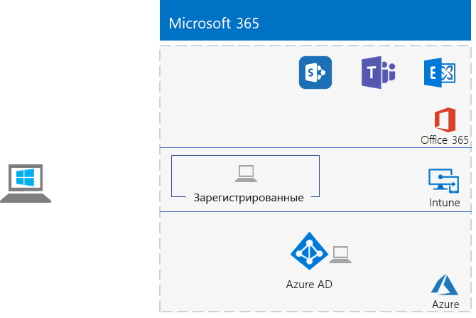

# <a name="the-lightweight-base-configuration"></a><span data-ttu-id="27ba1-103">Простая базовая конфигурация</span><span class="sxs-lookup"><span data-stu-id="27ba1-103">The lightweight base configuration</span></span>

<span data-ttu-id="27ba1-104">В этой статье представлены пошаговые инструкции по созданию упрощенной среды с подпиской на Microsoft 365 E5 и компьютером с ОС Windows 10 Корпоративная.</span><span class="sxs-lookup"><span data-stu-id="27ba1-104">This article provides you with step-by-step instructions to create a simplified environment with a Microsoft 365 E5 subscription and a computer running Windows 10 Enterprise.</span></span> 



<span data-ttu-id="27ba1-106">В получившейся среде можно будет тестировать функции [Microsoft 365 корпоративный](https://www.microsoft.com/microsoft-365/enterprise).</span><span class="sxs-lookup"><span data-stu-id="27ba1-106">Use the resulting environment to test the features and functionality of [Microsoft 365 Enterprise](https://www.microsoft.com/microsoft-365/enterprise).</span></span>


  
> [!TIP]
> <span data-ttu-id="27ba1-108">Щелкните [здесь](https://aka.ms/m365etlgstack), чтобы просмотреть схему всех статей, относящихся к руководствам по лаборатории тестирования Microsoft 365 корпоративный.</span><span class="sxs-lookup"><span data-stu-id="27ba1-108">Click [here](https://aka.ms/m365etlgstack) for a visual map to all the articles in the Microsoft 365 Enterprise Test Lab Guide stack.</span></span>

## <a name="phase-1-create-your-office-365-e5-subscription"></a><span data-ttu-id="27ba1-109">Этап 1. Создание подписки на Office 365 E5</span><span class="sxs-lookup"><span data-stu-id="27ba1-109">Phase 1: Create your Office 365 E5 subscription</span></span>

<span data-ttu-id="27ba1-110">Выполните действия, описанные в этапах 2 и 3 статьи [Среда разработки и тестирования Office 365](https://docs.microsoft.com/office365/enterprise/office-365-dev-test-environment), чтобы создать упрощенную среду разработки и тестирования Office 365.</span><span class="sxs-lookup"><span data-stu-id="27ba1-110">Follow the steps in Phase 2 and Phase 3 of the [Office 365 dev/test environment](https://docs.microsoft.com/office365/enterprise/office-365-dev-test-environment) to create a lightweight Office 365 dev/test environment.</span></span>

>[!Note]
><span data-ttu-id="27ba1-111">Вы создали пробную подписку на Office 365, поэтому среда разработки и тестирования имеет собственный клиент Azure AD, отличный от использующихся для любых доступных платных подписок.</span><span class="sxs-lookup"><span data-stu-id="27ba1-111">We have you create a trial subscription of Office 365 so that your dev/test environment has a separate Azure AD tenant from any paid subscriptions you currently have.</span></span> <span data-ttu-id="27ba1-112">Это разделение означает, что вы можете добавлять и удалять пользователей и группы в тестовом клиенте, никак не влияя на рабочие подписки.</span><span class="sxs-lookup"><span data-stu-id="27ba1-112">This separation means you can add and remove users and groups in the test tenant without affecting your production subscriptions.</span></span>
>
  
## <a name="phase-2-add-a-microsoft-365-e5-trial-subscription"></a><span data-ttu-id="27ba1-113">Этап 2. Добавление пробной подписки Microsoft 365 E5</span><span class="sxs-lookup"><span data-stu-id="27ba1-113">Phase 2: Add a Microsoft 365 E5 trial subscription</span></span>

<span data-ttu-id="27ba1-114">На этом этапе можно оформить пробную подписку Microsoft 365 E5 и добавить ее к той же организации, для которой создана пробная подписка на Office 365 E5.</span><span class="sxs-lookup"><span data-stu-id="27ba1-114">In this phase, you sign up for the Microsoft 365 E5 trial subscription and add it to the same organization as your Office 365 E5 trial subscription.</span></span>
  
<span data-ttu-id="27ba1-115">Сначала добавьте пробную подписку Microsoft 365 E5 и назначьте лицензию Microsoft 365 для учетной записи глобального администратора.</span><span class="sxs-lookup"><span data-stu-id="27ba1-115">First, add the Microsoft 365 E5 trial subscription and assign a Microsoft 365 license to your global administrator account.</span></span>
  
1. <span data-ttu-id="27ba1-116">С помощью закрытого экземпляра интернет-браузера войдите в Центр администрирования Microsoft 365 [http://admin.microsoft.com](http://admin.microsoft.com), используя данные учетной записи глобального администратора.</span><span class="sxs-lookup"><span data-stu-id="27ba1-116">With a private instance of an Internet browser, sign in to the Microsoft 365 admin center at [http://admin.microsoft.com](http://admin.microsoft.com) with your global administrator account credentials.</span></span>
    
2. <span data-ttu-id="27ba1-117">На странице **Центра администрирования Microsoft 365**, в области навигации слева, нажмите **Выставление счетов > Приобретение служб**.</span><span class="sxs-lookup"><span data-stu-id="27ba1-117">On the **Microsoft 365 admin center** page, in the left navigation, click **Billing > Purchase services**.</span></span>
    
3. <span data-ttu-id="27ba1-118">На странице **Приобретение служб** найдите пункт **Microsoft 365 E5**.</span><span class="sxs-lookup"><span data-stu-id="27ba1-118">On the **Purchase services** page, find the **Microsoft 365 E5** item.</span></span> <span data-ttu-id="27ba1-119">Наведите на него указатель мыши и выберите **Начать бесплатный пробный период**.</span><span class="sxs-lookup"><span data-stu-id="27ba1-119">Hover your mouse pointer over it and click **Start free trial**.</span></span>

4. <span data-ttu-id="27ba1-120">На странице **Пробная версия Microsoft 365 E5** выберите текстовое сообщение или звонок, введите свой номер телефона, затем нажмите кнопку **Отправить сообщение** или **Позвонить мне**.</span><span class="sxs-lookup"><span data-stu-id="27ba1-120">On the **Microsoft 365 E5 Trial** page, choose to receive a text or a call, enter your phone number, then click **Text me** or **Call me**.</span></span>

5. <span data-ttu-id="27ba1-121">На странице **Подтверждение заказа** нажмите кнопку **Попробовать**.</span><span class="sxs-lookup"><span data-stu-id="27ba1-121">On the **Confirm your order** page, click **Try now**.</span></span>

6. <span data-ttu-id="27ba1-122">На странице **Получение заказа** нажмите кнопку **Продолжить**.</span><span class="sxs-lookup"><span data-stu-id="27ba1-122">On the **Order receipt** page, click **Continue**.</span></span>

7. <span data-ttu-id="27ba1-123">В центре администрирования Microsoft 365 щелкните **Активные пользователи**, а учетную запись администратора.</span><span class="sxs-lookup"><span data-stu-id="27ba1-123">In the Microsoft 365 admin center, click **Active users**, and then your administrator account.</span></span>

8. <span data-ttu-id="27ba1-124">Нажмите **Изменить\*\*\*\*лицензии продукта**.</span><span class="sxs-lookup"><span data-stu-id="27ba1-124">Click **Edit** for **Product licenses**.</span></span>

9. <span data-ttu-id="27ba1-125">Отключите лицензию для Office 365 корпоративный E5 и включите лицензию для Microsoft 365 E5.</span><span class="sxs-lookup"><span data-stu-id="27ba1-125">Turn off the license for Office 365 Enterprise E5 and turn on the license for Microsoft 365 E5.</span></span>

10. <span data-ttu-id="27ba1-126">Нажмите **Сохранить и закрыть**.</span><span class="sxs-lookup"><span data-stu-id="27ba1-126">Click **Save > Close > Close**.</span></span>

<span data-ttu-id="27ba1-127">Затем, ***если вы выполнили этап 3*** [среды разработки и тестирования Office 365](https://docs.microsoft.com/office365/enterprise/office-365-dev-test-environment), повторите действия с 8 по 11 из предыдущей процедуры для всех остальных учетных записей (User 2, User 3, User 4 и User 5).</span><span class="sxs-lookup"><span data-stu-id="27ba1-127">Next, ***if you completed Phase 3 of the*** [Office 365 dev/test environment](https://docs.microsoft.com/office365/enterprise/office-365-dev-test-environment), repeat steps 8 through 11 of the previous procedure for all of your other accounts (User 2, User 3, User 4, and User 5).</span></span>
  
> [!NOTE]
> <span data-ttu-id="27ba1-128">Период действия пробной подписки Microsoft 365 E5 равен 30 дням.</span><span class="sxs-lookup"><span data-stu-id="27ba1-128">The Microsoft 365 E5 trial subscription is 30 days.</span></span> <span data-ttu-id="27ba1-129">Для среды постоянного тестирования переведите пробную подписку в платную подписку с небольшим количеством лицензий.</span><span class="sxs-lookup"><span data-stu-id="27ba1-129">For a permanent test environment, convert this trial subscription to a paid subscription with a small number of licenses.</span></span> 
  
<span data-ttu-id="27ba1-130">Теперь ваша тестовая среда содержит:</span><span class="sxs-lookup"><span data-stu-id="27ba1-130">Your test environment now has:</span></span>
  
- <span data-ttu-id="27ba1-131">Пробную подписку Microsoft 365 E5.</span><span class="sxs-lookup"><span data-stu-id="27ba1-131">A Microsoft 365 E5 trial subscription.</span></span>
- <span data-ttu-id="27ba1-132">Все подходящие учетные записи пользователей (либо только глобального администратора или всех пяти пользователей), поддерживающие Microsoft 365 E5.</span><span class="sxs-lookup"><span data-stu-id="27ba1-132">All your appropriate user accounts (either just the global administrator or all five user accounts) are enabled to use Microsoft 365 E5.</span></span>
    
<span data-ttu-id="27ba1-133">На рисунке 1 показана итоговая конфигурация с добавлением Microsoft 365 E5, включающая Office 365 и Enterprise Security + Management (EMS).</span><span class="sxs-lookup"><span data-stu-id="27ba1-133">Figure 1 shows your resulting configuration, which adds Microsoft 365 E5, which includes both Office 365 and Enterprise Security + Management (EMS).</span></span>
  
<span data-ttu-id="27ba1-134">**Рис. 1. Добавление пробной подписки Microsoft 365**</span><span class="sxs-lookup"><span data-stu-id="27ba1-134">**Figure 1: Adding the Microsoft 365 trial subscription**</span></span>


  
## <a name="phase-3-create-a-windows-10-enterprise-computer"></a><span data-ttu-id="27ba1-136">Этап 3. Создание изолированного компьютера с ОС Windows 10 Корпоративная</span><span class="sxs-lookup"><span data-stu-id="27ba1-136">Phase 3: Create a Windows 10 Enterprise computer</span></span>

<span data-ttu-id="27ba1-137">На этом этапе мы создадим изолированный компьютер с Windows 10 Корпоративная в виде физического компьютера либо виртуальной машины (обычной или в Azure).</span><span class="sxs-lookup"><span data-stu-id="27ba1-137">In this phase, you create a standalone computer running Windows 10 Enterprise as either a physical computer, a virtual machine, or an Azure virtual machine.</span></span>
  
### <a name="physical-computer"></a><span data-ttu-id="27ba1-138">Физический компьютер</span><span class="sxs-lookup"><span data-stu-id="27ba1-138">Physical computer</span></span>

<span data-ttu-id="27ba1-p104">Установите Windows 10 Корпоративная на персональном компьютере. Пробную версию Windows 10 Корпоративная можно скачать [здесь](https://www.microsoft.com/evalcenter/evaluate-windows-10-enterprise).</span><span class="sxs-lookup"><span data-stu-id="27ba1-p104">Obtain a personal computer and install Windows 10 Enterprise on it. You can download the Windows 10 Enterprise trial [here](https://www.microsoft.com/evalcenter/evaluate-windows-10-enterprise).</span></span>
  
### <a name="virtual-machine"></a><span data-ttu-id="27ba1-141">Виртуальная машина</span><span class="sxs-lookup"><span data-stu-id="27ba1-141">Virtual machine</span></span>

<span data-ttu-id="27ba1-p105">Создайте виртуальную машину с помощью выбранного гипервизора и установите на него Windows 10 Корпоративная. Пробную версию Windows 10 Корпоративная можно скачать [здесь](https://www.microsoft.com/evalcenter/evaluate-windows-10-enterprise).</span><span class="sxs-lookup"><span data-stu-id="27ba1-p105">Create a virtual machine using the hypervisor of your choice and install Windows 10 Enterprise on it. You can download the Windows 10 Enterprise trial [here](https://www.microsoft.com/evalcenter/evaluate-windows-10-enterprise).</span></span>
  
### <a name="virtual-machine-in-azure"></a><span data-ttu-id="27ba1-144">Виртуальная машина в Azure</span><span class="sxs-lookup"><span data-stu-id="27ba1-144">Virtual machine in Azure</span></span>

<span data-ttu-id="27ba1-p106">Для создания виртуальной машины с Windows 10 в Microsoft Azure ***необходима подписка на основе Visual Studio*** с доступом к образу Windows 10 Корпоративная. В других типах подписок Azure, например пробной или платной, подобный доступ отсутствует. Последние сведения по этой теме см. в статье [Использование клиента Windows в Azure для сценариев разработки и тестирования](https://docs.microsoft.com/azure/virtual-machines/windows/client-images).</span><span class="sxs-lookup"><span data-stu-id="27ba1-p106">To create a Windows 10 virtual machine in Microsoft Azure, ***you must have a Visual Studio-based subscription***, which has access to the image for Windows 10 Enterprise. Other types of Azure subscriptions, such as trial and paid subscriptions, do not have access to this image. For the latest information, see [Use Windows client in Azure for dev/test scenarios](https://docs.microsoft.com/azure/virtual-machines/windows/client-images).</span></span>
  
> [!NOTE]
> <span data-ttu-id="27ba1-p107">Для приведенных ниже последовательностей команд используется последняя версия Azure PowerShell. См. статью [Начало работы с командлетами Azure PowerShell](https://docs.microsoft.com/powershell/azureps-cmdlets-docs/). Эти наборы команд создают виртуальную машину под управлением Windows 10 Корпоративная с именем WIN10, а также всю необходимую инфраструктуру, включая группу ресурсов, учетную запись хранения и виртуальную сеть. Если вы уже знакомы со службами инфраструктуры Azure, адаптируйте эти инструкции в соответствии с вашей развернутой инфраструктурой.</span><span class="sxs-lookup"><span data-stu-id="27ba1-p107">The following command sets use the latest version of Azure PowerShell. See [Get started with Azure PowerShell cmdlets](https://docs.microsoft.com/powershell/azureps-cmdlets-docs/). These command sets build a Windows 10 Enterprise virtual machine named WIN10 and all of its required infrastructure, including a resource group, a storage account, and a virtual network. If you are already familiar with Azure infrastructure services, please adapt these instructions to suit your currently deployed infrastructure.</span></span> 
  
<span data-ttu-id="27ba1-152">Для начала запустите командную строку Microsoft PowerShell.</span><span class="sxs-lookup"><span data-stu-id="27ba1-152">First, start a Microsoft PowerShell prompt.</span></span>
  
<span data-ttu-id="27ba1-153">Войдите в свою учетную запись Azure с помощью указанной ниже команды.</span><span class="sxs-lookup"><span data-stu-id="27ba1-153">Sign in to your Azure account with the following command.</span></span>
  
```
Connect-AzAccount
```

<span data-ttu-id="27ba1-154">Получите имя подписки с помощью приведенной ниже команды.</span><span class="sxs-lookup"><span data-stu-id="27ba1-154">Get your subscription name using the following command.</span></span>
  
```
Get-AzSubscription | Sort Name | Select Name
```

<span data-ttu-id="27ba1-p108">Укажите свою подписку Azure. Замените текст в кавычках, в том числе символы "\<" и ">", на правильное имя.</span><span class="sxs-lookup"><span data-stu-id="27ba1-p108">Set your Azure subscription. Replace everything within the quotes, including the \< and > characters, with the correct name.</span></span>
  
```
$subscr="<subscription name>"
Get-AzSubscription -SubscriptionName $subscr | Select-AzSubscription
```

<span data-ttu-id="27ba1-p109">Затем создайте группу ресурсов. Чтобы выбрать уникальное имя для группы ресурсов, с помощью этой команды выведите имеющиеся группы ресурсов.</span><span class="sxs-lookup"><span data-stu-id="27ba1-p109">Next, create a new resource group. To determine a unique resource group name, use this command to list your existing resource groups.</span></span>
  
```
Get-AzResourceGroup | Sort ResourceGroupName | Select ResourceGroupName
```

<span data-ttu-id="27ba1-p110">Создайте группу ресурсов с помощью приведенных ниже команд. Замените все символы в кавычках (в том числе символы "\<" и ">") на правильные имена.</span><span class="sxs-lookup"><span data-stu-id="27ba1-p110">Create your new resource group with these commands. Replace everything within the quotes, including the \< and > characters, with the correct names.</span></span>
  
```
$rgName="<resource group name>"
$locName="<location name, such as West US>"
New-AzResourceGroup -Name $rgName -Location $locName
```

<span data-ttu-id="27ba1-p111">Далее используйте приведенные ниже команды для создания новой виртуальной сети и виртуальной машины WIN10. При появлении запроса укажите имя и пароль учетной записи локального администратора WIN10 и сохраните их в надежном месте.</span><span class="sxs-lookup"><span data-stu-id="27ba1-p111">Next, you create a new virtual network and the WIN10 virtual machine with these commands. When prompted, provide the name and password of the local administrator account for WIN10 and store these in a secure location.</span></span>
  
```
$corpnetSubnet=New-AzVirtualNetworkSubnetConfig -Name Corpnet -AddressPrefix 10.0.0.0/24
New-AzVirtualNetwork -Name "M365Ent-TestLab" -ResourceGroupName $rgName -Location $locName -AddressPrefix 10.0.0.0/8 -Subnet $corpnetSubnet
$rule1=New-AzNetworkSecurityRuleConfig -Name "RDPTraffic" -Description "Allow RDP to all VMs on the subnet" -Access Allow -Protocol Tcp -Direction Inbound -Priority 100 -SourceAddressPrefix Internet -SourcePortRange * -DestinationAddressPrefix * -DestinationPortRange 3389
New-AzNetworkSecurityGroup -Name Corpnet -ResourceGroupName $rgName -Location $locName -SecurityRules $rule1
$vnet=Get-AzVirtualNetwork -ResourceGroupName $rgName -Name "M365Ent-TestLab"
$nsg=Get-AzNetworkSecurityGroup -Name Corpnet -ResourceGroupName $rgName
Set-AzVirtualNetworkSubnetConfig -VirtualNetwork $vnet -Name Corpnet -AddressPrefix "10.0.0.0/24" -NetworkSecurityGroup $nsg
$vnet | Set-AzVirtualNetwork
$pip=New-AzPublicIpAddress -Name WIN10-PIP -ResourceGroupName $rgName -Location $locName -AllocationMethod Dynamic
$nic=New-AzNetworkInterface -Name WIN10-NIC -ResourceGroupName $rgName -Location $locName -SubnetId $vnet.Subnets[0].Id -PublicIpAddressId $pip.Id
$vm=New-AzVMConfig -VMName WIN10 -VMSize Standard_D1_V2
$cred=Get-Credential -Message "Type the name and password of the local administrator account for WIN10."
$vm=Set-AzVMOperatingSystem -VM $vm -Windows -ComputerName WIN10 -Credential $cred -ProvisionVMAgent -EnableAutoUpdate
$vm=Set-AzVMSourceImage -VM $vm -PublisherName MicrosoftWindowsDesktop -Offer Windows-10 -Skus RS3-Pro -Version "latest"
$vm=Add-AzVMNetworkInterface -VM $vm -Id $nic.Id
$vm=Set-AzVMOSDisk -VM $vm -Name WIN10-TestLab-OSDisk -DiskSizeInGB 128 -CreateOption FromImage
New-AzVM -ResourceGroupName $rgName -Location $locName -VM $vm
```

## <a name="phase-4-join-your-windows-10-computer-to-azure-ad"></a><span data-ttu-id="27ba1-163">Этап 4. Присоединение компьютера с Windows 10 к Azure AD</span><span class="sxs-lookup"><span data-stu-id="27ba1-163">Phase 4: Join your Windows 10 computer to Azure AD</span></span>

<span data-ttu-id="27ba1-164">После создания физической или виртуальной машины с Windows 10 Корпоративная войдите в систему, используя учетную запись локального администратора.</span><span class="sxs-lookup"><span data-stu-id="27ba1-164">After the physical or virtual machine with Windows 10 Enterprise is created, sign in with a local administrator account.</span></span>
  
> [!NOTE]
> <span data-ttu-id="27ba1-165">Чтобы подключиться к виртуальной машине в Azure, следуйте [этим инструкциям](https://docs.microsoft.com/azure/virtual-machines/windows/connect-logon).</span><span class="sxs-lookup"><span data-stu-id="27ba1-165">For a virtual machine in Azure, connect to it using [these instructions](https://docs.microsoft.com/azure/virtual-machines/windows/connect-logon).</span></span>
  
<span data-ttu-id="27ba1-166">Затем присоедините компьютер WIN10 к клиенту Azure AD, отвечающему за вашу подписку на Microsoft 365 E5.</span><span class="sxs-lookup"><span data-stu-id="27ba1-166">Next, join the WIN10 computer to the Azure AD tenant of your Microsoft 365 E5 subscription.</span></span>
  
1. <span data-ttu-id="27ba1-167">На рабочем столе компьютера WIN10 нажмите **Пуск > Параметры > Учетные записи > Доступ к учетной записи места работы или учебного заведения > Подключиться**.</span><span class="sxs-lookup"><span data-stu-id="27ba1-167">At the desktop of the WIN10 computer, click **Start > Settings > Accounts > Access work or school > Connect**.</span></span>
    
2. <span data-ttu-id="27ba1-168">В диалоговом окне **Настройка рабочей или учебной учетной записи** нажмите **Присоединить это устройство к Azure Active Directory**.</span><span class="sxs-lookup"><span data-stu-id="27ba1-168">In the **Set up a work or school account** dialog box, click **Join this device to Azure Active Directory**.</span></span>
    
3. <span data-ttu-id="27ba1-169">В диалоговом окне **Рабочая или учебная учетная запись** введите имя учетной записи глобального администратора подписки на Microsoft 365 E5 и нажмите кнопку **Далее**.</span><span class="sxs-lookup"><span data-stu-id="27ba1-169">In **Work or school account**, type the global administrator account name of your Microsoft 365 E5 subscription, and then click **Next**.</span></span>
    
4. <span data-ttu-id="27ba1-170">В поле **Введите пароль** укажите пароль к учетной записи глобального администратора, а затем нажмите кнопку **Войти**.</span><span class="sxs-lookup"><span data-stu-id="27ba1-170">In **Enter password**, type the password for your global administrator account, and then click **Sign in**.</span></span>
    
5. <span data-ttu-id="27ba1-171">Чтобы убедиться, что это ваша организация, нажмите кнопку **Присоединиться**, а затем нажмите**Готово**.</span><span class="sxs-lookup"><span data-stu-id="27ba1-171">When prompted to make sure this is your organization, click **Join**, and then click **Done**.</span></span>
    
6. <span data-ttu-id="27ba1-172">Закройте окно параметров.</span><span class="sxs-lookup"><span data-stu-id="27ba1-172">Close the settings window.</span></span>
    
<span data-ttu-id="27ba1-173">Затем установите Office 365 профессиональный плюс на компьютер WIN10</span><span class="sxs-lookup"><span data-stu-id="27ba1-173">Next, install Office 365 ProPlus on the WIN10 computer.</span></span>
  
1. <span data-ttu-id="27ba1-174">Откройте браузер Microsoft Edge и войдите в портал Office 365 с данными учетной записи глобального администратора.</span><span class="sxs-lookup"><span data-stu-id="27ba1-174">Open the Microsoft Edge browser and sign in to the Office portal with your global administrator account credentials.</span></span> <span data-ttu-id="27ba1-175">Дополнительные сведения см. в статье [Вход в Office 365](https://support.office.com/Article/Where-to-sign-in-to-Office-365-e9eb7d51-5430-4929-91ab-6157c5a050b4).</span><span class="sxs-lookup"><span data-stu-id="27ba1-175">For help, see [Where to sign in to Office 365](https://support.office.com/Article/Where-to-sign-in-to-Office-365-e9eb7d51-5430-4929-91ab-6157c5a050b4).</span></span>
    
2. <span data-ttu-id="27ba1-176">На главной вкладке **Microsoft Office** нажмите **Установить Office**.</span><span class="sxs-lookup"><span data-stu-id="27ba1-176">On the **Microsoft Office Home** tab, click **Install Office**.</span></span>
    
3. <span data-ttu-id="27ba1-177">Когда вам будет предложено выбрать действие, нажмите кнопку **Выполнить**, а затем выберите **Да** для пункта **Контроль учетных записей**.</span><span class="sxs-lookup"><span data-stu-id="27ba1-177">When prompted with what to do, click **Run**, and then click **Yes** for **User Account Control**.</span></span>
    
4. <span data-ttu-id="27ba1-p113">Подождите, пока Office завершит установку. Увидев оповещение **Настройка завершена**, дважды нажмите кнопку **Закрыть**.</span><span class="sxs-lookup"><span data-stu-id="27ba1-p113">Wait for Office to complete its installation. When you see **You're all set!**, click **Close** twice.</span></span>
    
<span data-ttu-id="27ba1-180">На рис. 3 представлена итоговая среда, куда входит компьютер WIN10, который:</span><span class="sxs-lookup"><span data-stu-id="27ba1-180">Figure 3 shows your resulting environment, which includes the WIN10 computer that has:</span></span>

- <span data-ttu-id="27ba1-181">присоединен к клиенту Azure AD, отвечающему за подписку Microsoft 365 E5;</span><span class="sxs-lookup"><span data-stu-id="27ba1-181">Joined the Azure AD tenant of your Microsoft 365 E5 subscription.</span></span>
- <span data-ttu-id="27ba1-182">зарегистрирован в Microsoft Intune (EMS) в качестве устройства Azure AD;</span><span class="sxs-lookup"><span data-stu-id="27ba1-182">Enrolled as an Azure AD device in Microsoft Intune (EMS).</span></span>
- <span data-ttu-id="27ba1-183">содержит установленный набор Office 365 профессиональный плюс.</span><span class="sxs-lookup"><span data-stu-id="27ba1-183">Has Office 365 ProPlus installed.</span></span>
  
<span data-ttu-id="27ba1-184">**Рис. 2. Окончательная конфигурация тестовой среды Microsoft 365**</span><span class="sxs-lookup"><span data-stu-id="27ba1-184">**Figure 2: The final configuration of the Microsoft 365 test environment**</span></span>


  
<span data-ttu-id="27ba1-186">Теперь вы готовы поэкспериментировать с дополнительными возможностями [Microsoft 365 корпоративный](https://www.microsoft.com/microsoft-365/enterprise).</span><span class="sxs-lookup"><span data-stu-id="27ba1-186">You are now ready to experiment with additional features of [Microsoft 365 Enterprise](https://www.microsoft.com/microsoft-365/enterprise).</span></span>
  
## <a name="next-steps"></a><span data-ttu-id="27ba1-187">Дальнейшие действия</span><span class="sxs-lookup"><span data-stu-id="27ba1-187">Next steps</span></span>

<span data-ttu-id="27ba1-188">Ознакомьтесь с этими дополнительными комплектами руководств по лаборатории тестирования:</span><span class="sxs-lookup"><span data-stu-id="27ba1-188">Explore these additional sets of Test Lab Guides:</span></span>
  
- [<span data-ttu-id="27ba1-189">Идентификация</span><span class="sxs-lookup"><span data-stu-id="27ba1-189">Identity</span></span>](m365-enterprise-test-lab-guides.md#identity)
- [<span data-ttu-id="27ba1-190">Управление мобильными устройствами</span><span class="sxs-lookup"><span data-stu-id="27ba1-190">Mobile device management</span></span>](m365-enterprise-test-lab-guides.md#mobile-device-management)
- [<span data-ttu-id="27ba1-191">Защита информации</span><span class="sxs-lookup"><span data-stu-id="27ba1-191">Information protection</span></span>](m365-enterprise-test-lab-guides.md#information-protection)
   

## <a name="see-also"></a><span data-ttu-id="27ba1-192">См. также</span><span class="sxs-lookup"><span data-stu-id="27ba1-192">See also</span></span>

[<span data-ttu-id="27ba1-193">Руководства по лаборатории тестирования для Microsoft 365 корпоративный</span><span class="sxs-lookup"><span data-stu-id="27ba1-193">Microsoft 365 Enterprise Test Lab Guides</span></span>](m365-enterprise-test-lab-guides.md)

[<span data-ttu-id="27ba1-194">Развертывание Microsoft 365 корпоративный</span><span class="sxs-lookup"><span data-stu-id="27ba1-194">Deploy Microsoft 365 Enterprise</span></span>](deploy-microsoft-365-enterprise.md)

[<span data-ttu-id="27ba1-195">Документация по Microsoft 365 корпоративный</span><span class="sxs-lookup"><span data-stu-id="27ba1-195">Microsoft 365 Enterprise documentation</span></span>](https://docs.microsoft.com/microsoft-365-enterprise/)
