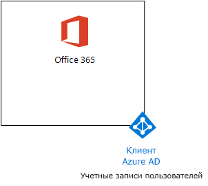

# <a name="the-lightweight-base-configuration"></a>Простая базовая конфигурация

В этой статье представлены пошаговые инструкции по созданию упрощенной среды, включающей Office 365 E5, "Enterprise Mobility + Security (EMS) E5" и компьютер с ОС Windows 10 Корпоративная. 


В получившейся среде можно будет тестировать функции [Microsoft 365 корпоративный](https://www.microsoft.com/microsoft-365/enterprise).


  
> [!TIP]
> Щелкните [здесь](https://aka.ms/m365etlgstack), чтобы просмотреть схему всех статей, относящихся к руководствам по лаборатории тестирования Microsoft 365 корпоративный.

## <a name="phase-1-create-your-office-365-e5-subscription"></a>Этап 1. Создание подписки на Office 365 E5

Выполните действия, описанные в этапах 2 и 3 статьи [Среда разработки и тестирования Office 365](https://docs.microsoft.com/office365/enterprise/office-365-dev-test-environment), чтобы создать упрощенную среду разработки и тестирования Office 365, показанную на рисунке 1.
  
**Рис. 1. Подписка на Office 365 E5 с учетными записями клиентов и пользователей Azure Active Directory (AD)**



> [!NOTE]
> Период пробной подписки на Office 365 E5 составляет 30 дней, но его легко продлить до 60 дней. Чтобы создать постоянную тестовую среду, создайте новую платную подписку с небольшим количеством лицензий. 
  
## <a name="phase-2-add-ems"></a>Этап 2. Добавление EMS

На этом этапе можно оформить пробную подписку на EMS E5 и добавить ее к той же организации, для которой создана пробная подписка на Office 365 E5.
  
Для начала добавьте пробную подписку EMS E5 и назначьте лицензию на EMS учетной записи глобального администратора.
  
1. С помощью приватного экземпляра веб-браузера войдите на портал Office 365, используя данные учетной записи глобального администратора. Сведения о том, как это сделать, см в статье [Вход в Office 365](https://support.office.com/Article/Where-to-sign-in-to-Office-365-e9eb7d51-5430-4929-91ab-6157c5a050b4).
    
2. Выберите плитку **Администрирование**.
    
3. Открыв вкладку **Центр администрирования Office** в браузере, на панели навигации слева щелкните **Выставление счетов > Приобретение служб**.
    
4. На странице **Приобретение служб** найдите элемент **Enterprise Mobility + Security E5**. Наведите на него указатель мыши и выберите **Начать бесплатный пробный период**.
    
5. На странице **Подтверждение заказа** нажмите кнопку **Попробовать**.
    
6. На странице **Получение заказа** нажмите кнопку **Продолжить**.
    
7. На вкладке браузера **Центр администрирования Office 365** на панели навигации слева выберите **Пользователи > Активные пользователи**.
    
8. Выберите свою учетную запись глобального администратора и щелкните ссылку **Изменить** для параметра **Лицензии на продукты**.
    
9. На панели **Лицензии на продукты** переведите переключатель **Enterprise Mobility + Security E5** в положение **Вкл.**, нажмите **Сохранить**, а затем дважды **Закрыть**.
    
> [!NOTE]
> Период пробной подписки на "Enterprise Mobility + Security E5" составляет 90 дней. Чтобы создать постоянную тестовую среду, создайте новую платную подписку с небольшим количеством лицензий. 
  
 ***Если вы выполнили этап 3*** [среды разработки и тестирования Office 365](https://docs.microsoft.com/office365/enterprise/office-365-dev-test-environment), повторите действия 8 и 9 из предыдущей процедуры для всех остальных учетных записей (User 2, User 3, User 4 и User 5).
  
Теперь ваша тестовая среда содержит:
  
- пробные подписки на Office 365 корпоративный E5 и EMS E5 с одним и тем же клиентом Azure AD для всех учетных записей пользователей из списка;
- все подходящие учетные записи пользователей (либо только глобального администратора или всех пяти пользователей), поддерживающие Office 365 E5 и EMS E5.
    
На рисунке 2 показана полученная в итоге конфигурация с EMS.
  
**Рис. 2. Добавление пробной подписки на EMS**


  
## <a name="phase-3-create-a-windows-10-enterprise-computer"></a>Этап 3. Создание изолированного компьютера с ОС Windows 10 Корпоративная

На этом этапе мы создадим изолированный компьютер с Windows 10 Корпоративная в виде физического компьютера либо виртуальной машины (обычной или в Azure).
  
### <a name="physical-computer"></a>Физический компьютер

Установите Windows 10 Корпоративная на персональном компьютере. Пробную версию Windows 10 Корпоративная можно скачать [здесь](https://www.microsoft.com/evalcenter/evaluate-windows-10-enterprise).
  
### <a name="virtual-machine"></a>Виртуальная машина

Создайте виртуальную машину с помощью выбранного гипервизора и установите на него Windows 10 Корпоративная. Пробную версию Windows 10 Корпоративная можно скачать [здесь](https://www.microsoft.com/evalcenter/evaluate-windows-10-enterprise).
  
### <a name="virtual-machine-in-azure"></a>Виртуальная машина в Azure

Для создания виртуальной машины с Windows 10 в Microsoft Azure ***необходима подписка на основе Visual Studio*** с доступом к образу Windows 10 Корпоративная. В других типах подписок Azure, например пробной или платной, подобный доступ отсутствует. Последние сведения по этой теме см. в статье [Использование клиента Windows в Azure для сценариев разработки и тестирования](https://docs.microsoft.com/azure/virtual-machines/windows/client-images).
  
> [!NOTE]
> Для приведенных ниже последовательностей команд используется последняя версия Azure PowerShell. См. статью [Начало работы с командлетами Azure PowerShell](https://docs.microsoft.com/powershell/azureps-cmdlets-docs/). Эти наборы команд создают виртуальную машину под управлением Windows 10 Корпоративная с именем WIN10, а также всю необходимую инфраструктуру, включая группу ресурсов, учетную запись хранения и виртуальную сеть. Если вы уже знакомы со службами инфраструктуры Azure, адаптируйте эти инструкции в соответствии с вашей развернутой инфраструктурой. 
  
Для начала запустите командную строку Microsoft PowerShell.
  
Войдите в свою учетную запись Azure с помощью указанной ниже команды.
  
```
Login-AzureRMAccount
```

Получите имя подписки с помощью приведенной ниже команды.
  
```
Get-AzureRMSubscription | Sort Name | Select Name
```

Укажите свою подписку Azure. Замените текст в кавычках, в том числе символы "\<" и ">", на правильное имя.
  
```
$subscr="<subscription name>"
Get-AzureRmSubscription -SubscriptionName $subscr | Select-AzureRmSubscription
```

Затем создайте группу ресурсов. Чтобы выбрать уникальное имя для группы ресурсов, с помощью этой команды выведите имеющиеся группы ресурсов.
  
```
Get-AzureRMResourceGroup | Sort ResourceGroupName | Select ResourceGroupName
```

Создайте группу ресурсов с помощью приведенных ниже команд. Замените все символы в кавычках (в том числе символы "\<" и ">") на правильные имена.
  
```
$rgName="<resource group name>"
$locName="<location name, such as West US>"
New-AzureRMResourceGroup -Name $rgName -Location $locName
```

Далее используйте приведенные ниже команды для создания новой виртуальной сети и виртуальной машины WIN10. При появлении запроса укажите имя и пароль учетной записи локального администратора WIN10 и сохраните их в надежном месте.
  
```
$corpnetSubnet=New-AzureRMVirtualNetworkSubnetConfig -Name Corpnet -AddressPrefix 10.0.0.0/24
New-AzureRMVirtualNetwork -Name "M365Ent-TestLab" -ResourceGroupName $rgName -Location $locName -AddressPrefix 10.0.0.0/8 -Subnet $corpnetSubnet
$rule1=New-AzureRMNetworkSecurityRuleConfig -Name "RDPTraffic" -Description "Allow RDP to all VMs on the subnet" -Access Allow -Protocol Tcp -Direction Inbound -Priority 100 -SourceAddressPrefix Internet -SourcePortRange * -DestinationAddressPrefix * -DestinationPortRange 3389
New-AzureRMNetworkSecurityGroup -Name Corpnet -ResourceGroupName $rgName -Location $locName -SecurityRules $rule1
$vnet=Get-AzureRMVirtualNetwork -ResourceGroupName $rgName -Name "M365Ent-TestLab"
$nsg=Get-AzureRMNetworkSecurityGroup -Name Corpnet -ResourceGroupName $rgName
Set-AzureRMVirtualNetworkSubnetConfig -VirtualNetwork $vnet -Name Corpnet -AddressPrefix "10.0.0.0/24" -NetworkSecurityGroup $nsg
$pip=New-AzureRMPublicIpAddress -Name WIN10-PIP -ResourceGroupName $rgName -Location $locName -AllocationMethod Dynamic
$nic=New-AzureRMNetworkInterface -Name WIN10-NIC -ResourceGroupName $rgName -Location $locName -SubnetId $vnet.Subnets[0].Id -PublicIpAddressId $pip.Id
$vm=New-AzureRMVMConfig -VMName WIN10 -VMSize Standard_D1_V2
$cred=Get-Credential -Message "Type the name and password of the local administrator account for WIN10."
$vm=Set-AzureRMVMOperatingSystem -VM $vm -Windows -ComputerName WIN10 -Credential $cred -ProvisionVMAgent -EnableAutoUpdate
$vm=Set-AzureRMVMSourceImage -VM $vm -PublisherName MicrosoftWindowsDesktop -Offer Windows-10 -Skus RS3-Pro -Version "latest"
$vm=Add-AzureRMVMNetworkInterface -VM $vm -Id $nic.Id
$vm=Set-AzureRmVMOSDisk -VM $vm -Name WIN10-TestLab-OSDisk -DiskSizeInGB 128 -CreateOption FromImage -StorageAccountType "Standard_LRS"
New-AzureRMVM -ResourceGroupName $rgName -Location $locName -VM $vm
```

## <a name="phase-4-join-your-windows-10-computer-to-azure-ad"></a>Этап 4. Присоединение компьютера с Windows 10 к Azure AD

После создания физической или виртуальной машины с Windows 10 Корпоративная войдите в систему, используя учетную запись локального администратора.
  
> [!NOTE]
> Чтобы подключиться к виртуальной машине в Azure, следуйте [этим инструкциям](https://docs.microsoft.com/azure/virtual-machines/windows/connect-logon).
  
Затем присоедините компьютер WIN10 к клиенту Azure AD, отвечающему за ваши подписки на Office 365 и EMS.
  
1. На рабочем столе компьютера WIN10 нажмите **Пуск > Параметры > Учетные записи > Доступ к учетной записи места работы или учебного заведения > Подключиться**.
    
2. В диалоговом окне **Настройка рабочей или учебной учетной записи** нажмите **Присоединить это устройство к Azure Active Directory**.
    
3. В диалоговом окне **Рабочая или учебная учетная запись** введите имя учетной записи глобального администратора подписки на Office 365 и нажмите кнопку **Далее**.
    
4. В поле **Введите пароль** укажите пароль к учетной записи глобального администратора, а затем нажмите кнопку **Войти**.
    
5. Чтобы убедиться, что это ваша организация, нажмите кнопку **Присоединиться**, а затем нажмите**Готово**.
    
6. Закройте окно параметров.
    
Затем установите Office 365 профессиональный плюс на компьютер WIN10
  
1. Откройте браузер Microsoft Edge и войдите на портал Office 365, используя учетные данные глобального администратора. Сведения о том, как это сделать, см. в статье [Вход в Office 365](https://support.office.com/Article/Where-to-sign-in-to-Office-365-e9eb7d51-5430-4929-91ab-6157c5a050b4).
    
2. На главной вкладке **Microsoft Office** нажмите **Установить Office 2016**.
    
3. Когда вам будет предложено выбрать действие, нажмите кнопку **Выполнить**, а затем выберите **Да** для пункта **Контроль учетных записей**.
    
4. Подождите, пока Office завершит установку. Увидев оповещение **Настройка завершена**, дважды нажмите кнопку **Закрыть**.
    
На рис. 3 представлена итоговая среда, куда входит компьютер WIN10, который:

- присоединен к клиенту Azure AD, отвечающему за подписки Office 365 и EMS;
- зарегистрирован в Intune (EMS) в качестве устройства Azure AD;
- содержит установленный набор Office 365 профессиональный плюс.
  
**Рис. 3. Окончательная конфигурация тестовой среды Microsoft 365**


  
Теперь вы готовы поэкспериментировать с дополнительными возможностями [Microsoft 365 корпоративный](https://www.microsoft.com/microsoft-365/enterprise).
  
## <a name="next-steps"></a>Дальнейшие действия

Ознакомьтесь с этими дополнительными комплектами руководств по лаборатории тестирования:
  
- [Идентификация](m365-enterprise-test-lab-guides.md#identity)
- [Управление мобильными устройствами](m365-enterprise-test-lab-guides.md#mobile-device-management)
- [Защита информации](m365-enterprise-test-lab-guides.md#information-protection)
   

## <a name="see-also"></a>См. также

[Руководства по лаборатории тестирования для Microsoft 365 корпоративный](m365-enterprise-test-lab-guides.md)

[Развертывание Microsoft 365 корпоративный](deploy-microsoft-365-enterprise.md)

[Документация по Microsoft 365 корпоративный](https://docs.microsoft.com/microsoft-365-enterprise/)
