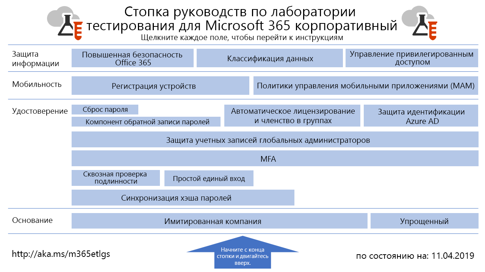

# Руководства по лаборатории тестирования для Microsoft 365 на крупных предприятиях

*Это относится к Microsoft 365 для крупных предприятий и Office 365 корпоративный.*

Руководства по лаборатории тестирования помогают быстро знакомиться с продуктами Майкрософт. Они содержат инструкции по настройке упрощенных и наглядных тестовых сред. Эти среды можно использовать для демонстрации и настройки, а также создания сложных экспериментов на протяжении срока действия пробной или платной подписки. 

Руководства по лаборатории тестирования делятся на модули. Каждый из них дополняет предыдущие, отображая несколько конфигураций, наиболее соответствующих вашим требованиям к учебной или тестовой конфигурации. Непосредственное знакомство с новым продуктом или сценарием помогает вам понять требования к его развертыванию, чтобы лучше спланировать его размещение в рабочей среде.

Кроме того, с помощью этих руководств можно создавать типичные среды для разработки и тестирования.
  

Перейдите в раздел [Руководства по лаборатории тестирования](../media/m365-enterprise-test-lab-guides/Microsoft365EnterpriseTLGStack.pdf)для наглядного отображения всех статей, относящихся к руководствам по лаборатории тестирования Microsoft 365 для крупных предприятий.

## Базовая настройка

Для начала необходимо создать тестовую среду для [Microsoft 365 для предприятий](https://docs.microsoft.com/microsoft-365-enterprise/). Можно создать два различных типа базовых конфигураций:

- Используйте [простую базовую конфигурацию](lightweight-base-configuration-microsoft-365-enterprise.md), если вы хотите настроить и продемонстрировать функции и возможности Microsoft 365 для крупных предприятий только в облачной среде, которая не включает каких-либо локальных компонентов.

- Используйте [базовую конфигурацию "имитация предприятия"](simulated-ent-base-configuration-microsoft-365-enterprise.md), если вы хотите настроить и продемонстрировать функции и возможности Microsoft 365 для крупных предприятий в гибридной облачной среде, содержащей локальные компоненты, такие как домен доменных служб Active Directory (AD DS).

Кроме того, вы можете создавать тестовые среды для Office 365 E5, не добавляя лицензию Microsoft 365 E5 в пробную или рабочую тестовую среду.
    
## Удостоверение

Функции и возможности, связанные с идентификацией, продемонстрированы в следующих статьях:

- [Синхронизация хэшей паролей](password-hash-sync-m365-ent-test-environment.md)
  
   Включение и тестирование синхронизации службы каталогов на основе хэша пароля из контроллера домена AD DS.

- [Сквозная проверка подлинности](pass-through-auth-m365-ent-test-environment.md)
  
   Включение и тестирование сквозной проверки подлинности на контроллере домена AD DS.

- [Федеративная проверка подлинности](federated-identity-for-your-microsoft-365-dev-test-environment.md)
  
   Включение и тестирование федеративной проверки подлинности на контроллере домена AD DS.

- [Простой единый вход Azure AD](single-sign-on-m365-ent-test-environment.md)
  
   Включение и тестирование простого единого входа (SSO) Azure AD с контроллером домена AD DS.

- [Многофакторная проверка подлинности](multi-factor-authentication-microsoft-365-test-environment.md)
  
   Включение и тестирование многофакторной проверки подлинности с использованием смартфона для определенной учетной записи.

- [Защита учетных записей глобальных администраторов](protect-global-administrator-accounts-microsoft-365-test-environment.md)
 
   Блокирование учетных записей глобальных администраторов с помощью политик условного доступа.

- [Обратная запись пароля](password-writeback-m365-ent-test-environment.md)

   Смена пароля учетной записи пользователя AD DS из Azure AD с помощью обратной записи пароля.

- [Сброс пароля](password-reset-m365-ent-test-environment.md)

   Используйте функцию самостоятельного сброса пароля (SSPR) для сброса пароля.

- [Автоматическое лицензирование и членство в группах](automate-licenses-group-membership-microsoft-365-test-environment.md)

   Упрощение администрирования новых учетных записей с помощью автоматического лицензирования и динамического членства в группах.

- [Защита идентификации Azure AD](azure-ad-identity-protection-microsoft-365-test-environment.md)

   Проверка текущих учетных записей пользователей на уязвимости.

- [Доступ к удостоверениям и устройствам](identity-device-access-m365-test-environment.md)

   Создание среды для тестирования рекомендуемых конфигураций доступа к удостоверениям и устройствам и политик условного доступа.

## Управление мобильными устройствами

Функции и возможности, связанные с управлением мобильными устройствами, продемонстрированы в следующих статьях:

- [Политики соответствия требованиям для устройств](mam-policies-for-your-microsoft-365-enterprise-dev-test-environment.md)
    
   Создайте группу пользователей и политику соответствия требованиям для устройств Windows 10.
    
- [Регистрация устройств с iOS и Android](enroll-ios-and-android-devices-in-your-microsoft-enterprise-365-dev-test-environ.md)
   
   Регистрация устройств с iOS или Android и удаленное управление ими.

## Защита информации

Функции и возможности, связанные с защитой информации, продемонстрированы в следующих статьях:

- [Повышенная безопасность в Microsoft 365](increased-o365-security-microsoft-365-enterprise-dev-test-environment.md)
    
   Настройка параметров для усиления защиты Microsoft 365 и изучение встроенных средств безопасности.
  
- [Классификация данных](data-classification-microsoft-365-enterprise-dev-test-environment.md)
    
   Настройка меток и присвоение их документу на сайте группы SharePoint Online.
    
- [Управление привилегированным доступом](privileged-access-microsoft-365-enterprise-dev-test-environment.md)
    
   Настройка управления привилегированным доступом для своевременного доступа к задачам, требующим привилегий и разрешений повышенного уровня, в вашей организации.

