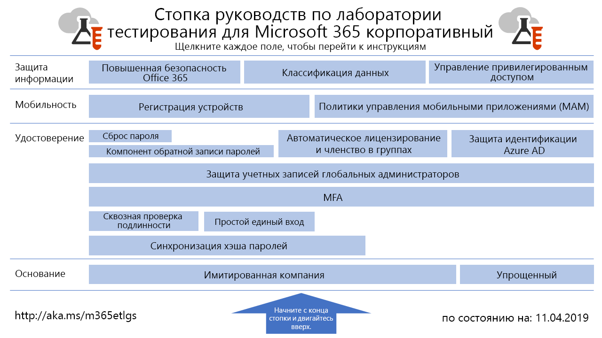

# Руководства по лаборатории тестирования для Microsoft 365 корпоративныйMicrosoft 365 Enterprise Test Lab Guides

Руководства по лаборатории тестирования помогают быстро знакомиться с продуктами Майкрософт. Они содержат инструкции по настройке упрощенных и наглядных тестовых сред. Эти среды можно использовать для демонстрации и настройки, а также создания сложных экспериментов на протяжении срока действия пробной или платной подписки.Test Lab Guides (TLGs) help you quickly learn about Microsoft products. They provide prescriptive instructions to configure simplified but representative test environments. You can use these environments for demonstration, customization, or creation of complex proofs of concept for the duration of a trial or paid subscription. 

Руководства по лаборатории тестирования делятся на модули. Каждый из них дополняет предыдущие, отображая несколько конфигураций, наиболее соответствующих вашим требованиям к учебной или тестовой конфигурации. Непосредственное знакомство с новым продуктом или сценарием помогает вам понять требования к его развертыванию, чтобы лучше спланировать его размещение в рабочей среде.TLGs are designed to be modular. They build upon each other to create multiple configurations that more closely match your learning or test configuration needs. The "I built it out myself and it works" hands-on experience helps you understand the deployment requirements of a new product or scenario so you can better plan for hosting it in production.

Кроме того, с помощью этих руководств можно создавать типичные среды для разработки и тестирования.You can also use TLGs to create representative environments for development and testing of applications, also known as dev/test environments.
  

Щелкните [здесь](media/m365-enterprise-test-lab-guides/Microsoft365EnterpriseTLGStack.pdf), чтобы просмотреть схему всех статей, относящихся к руководствам по лаборатории тестирования Microsoft 365 корпоративный.Click [here](media/m365-enterprise-test-lab-guides/Microsoft365EnterpriseTLGStack.pdf) for a visual map to all the articles in the Microsoft 365 Enterprise Test Lab Guide stack.

## Базовая настройкаBase configuration

Вначале нужно создать тестовую среду для [Microsoft 365 корпоративный](https://docs.microsoft.com/microsoft-365-enterprise/), включающую Office 365 E5, Enterprise Mobility + Security (EMS) E5 и Windows 10 Корпоративная. Ви можете создать два типа базовой конфигурации.First, you create a test environment for [Microsoft 365 Enterprise](https://docs.microsoft.com/microsoft-365-enterprise/) that includes Office 365 E5, Enterprise Mobility + Security (EMS) E5, and Windows 10 Enterprise. You can create two different types of base configurations:

- Используйте [простую базовую конфигурацию](lightweight-base-configuration-microsoft-365-enterprise.md), если вы хотите настроить и продемонстрировать функции и возможности Microsoft 365 корпоративный только в облачной среде, которая не включает каких-либо локальных компонентов.Use the [lightweight base configuration](lightweight-base-configuration-microsoft-365-enterprise.md) when you want to configure and demonstrate Microsoft 365 Enterprise features and capabilities in a cloud-only environment, which does not include any on-premises components.

- Используйте [базовую конфигурацию "имитация предприятия"](simulated-ent-base-configuration-microsoft-365-enterprise.md), если вы хотите настроить и продемонстрировать функции и возможности Microsoft 365 корпоративный в гибридной облачной среде, содержащей локальные компоненты такие как домен доменных служб Active Directory (AD DS).Use the [simulated enterprise base configuration](simulated-ent-base-configuration-microsoft-365-enterprise.md) when you want to configure and demonstrate Microsoft 365 Enterprise features and capabilities in a hybrid cloud environment, which uses on-premises components such as an Active Directory Domain Services (AD DS) domain.
    
## УдостоверениеIdentity

Функции и возможности, связанные с идентификацией, продемонстрированы в следующих статьях:To demonstrate identity-related features and capabilities, see:

- [Синхронизация хэшей паролейPassword hash synchronization](password-hash-sync-m365-ent-test-environment.md)
  
   Включение и тестирование синхронизации службы каталогов на основе хэша пароля из контроллера домена AD DS.Enable and test password hash-based directory synchronization from an AD DS domain controller.

- [Сквозная проверка подлинностиPass-through authentication](pass-through-auth-m365-ent-test-environment.md)
  
   Включение и тестирование сквозной проверки подлинности на контроллере домена AD DS.Enable and test pass-through authentication to an AD DS domain controller.

- [Простой единый вход Azure ADAzure AD Seamless Single Sign-on](single-sign-on-m365-ent-test-environment.md)
  
   Включение и тестирование простого единого входа (SSO) Azure AD с контроллером домена AD DS.Enable and test Azure AD Seamless Single Sign-on (SSO) with an AD DS domain controller.

- [Многофакторная проверка подлинностиMulti-factor authentication](multi-factor-authentication-microsoft-365-test-environment.md)
  
   Включение и тестирование многофакторной проверки подлинности с использованием смартфона для определенной учетной записи.Enable and test smart phone-based multi-factor authentication for a specific user account.

- [Защита учетных записей глобальных администраторовProtect global administrator accounts](protect-global-administrator-accounts-microsoft-365-test-environment.md)
 
   Блокирование учетных записей глобальных администраторов с помощью политик условного доступа.Lock down your global administrator accounts with conditional access policies.

- [Обратная запись пароляPassword writeback](password-writeback-m365-ent-test-environment.md)

   Смена пароля учетной записи пользователя AD DS из Azure AD с помощью обратной записи пароля.Use password writeback to change the password on your AD DS user account from Azure AD.

- [Сброс пароляPassword reset](password-reset-m365-ent-test-environment.md)

   Используйте функцию самостоятельного сброса пароля (SSPR) для сброса пароля.Use self-service password reset (SSPR) to reset your password.

- [Автоматическое лицензирование и членство в группахAutomatic licensing and group membership](automate-licenses-group-membership-microsoft-365-test-environment.md)

   Упрощение администрирования новых учетных записей с помощью автоматического лицензирования и динамического членства в группах.Make administering new accounts easier than ever with automatic licensing and dynamic group membership.

- [Защита идентификации Azure ADAzure AD Identity Protection](azure-ad-identity-protection-microsoft-365-test-environment.md)

   Проверка текущих учетных записей пользователей на уязвимости.Scan your current user accounts for vulnerabilities.

- [Доступ к удостоверениям и устройствамIdentity and device access](identity-device-access-m365-test-environment.md)

   Создание среды для тестирования рекомендуемых конфигураций доступа к удостоверениям и устройствам и политик условного доступа.Create an environment to test recommended identity and device access configurations and conditional access policies.

## Управление мобильными устройствамиMobile device management

Функции и возможности, связанные с управлением мобильными устройствами, продемонстрированы в следующих статьях:To demonstrate mobile device management-related features and capabilities, see:

- [Политики соответствия требованиям для устройствDevice compliance policies](mam-policies-for-your-microsoft-365-enterprise-dev-test-environment.md)
    
   Создайте группу пользователей и политику соответствия требованиям для устройств Windows 10.Create a user group and a device compliance policy for Windows 10 devices.
    
- [Регистрация устройств с iOS и AndroidEnroll iOS and Android devices](enroll-ios-and-android-devices-in-your-microsoft-enterprise-365-dev-test-environ.md)
   
   Регистрация устройств с iOS или Android и удаленное управление ими.Enroll iOS or Android devices and manage them remotely.

## Защита информацииInformation protection

Функции и возможности, связанные с защитой информации, продемонстрированы в следующих статьях:To demonstrate information protection-related features and capabilities, see:

- [Усиленная защита Office 365Increased Office 365 security](increased-o365-security-microsoft-365-enterprise-dev-test-environment.md)
    
   Настройка параметров для усиления защиты Office 365 и изучение встроенных средств безопасности.Configure settings for increased Office 365 security and investigate built-in security tools.
  
- [Классификация данныхData classification](data-classification-microsoft-365-enterprise-dev-test-environment.md)
    
   Настройка и присвоение метки Office 365 документу на сайте группы SharePoint Online.Configure and apply Office 365 labels to a document in a SharePoint Online team site.
    
- [Управление привилегированным доступомPrivileged access management](privileged-access-microsoft-365-enterprise-dev-test-environment.md)
    
   Настройка управления привилегированным доступом для своевременного доступа к задачам, требующим привилегий и разрешений повышенного уровня, в вашей организации Office 365.Configure privileged access management for just-in-time access to elevated and privileged tasks in your Office 365 organization.

