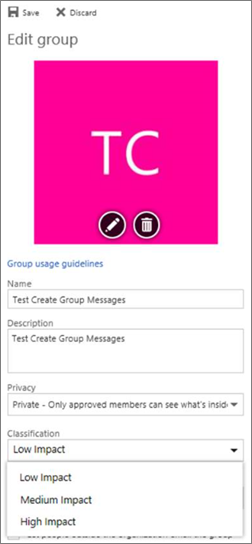

# <a name="manage-microsoft-365-groups-with-powershell"></a><span data-ttu-id="569f9-103">Управление группами Microsoft 365 с помощью PowerShell</span><span class="sxs-lookup"><span data-stu-id="569f9-103">Manage Microsoft 365 Groups with PowerShell</span></span>
 
<span data-ttu-id="569f9-104">*Эта статья относится к Microsoft 365 корпоративный и Office 365 корпоративный.*</span><span class="sxs-lookup"><span data-stu-id="569f9-104">*This article applies to both Microsoft 365 Enterprise and Office 365 Enterprise.*</span></span>

<span data-ttu-id="569f9-105">В этой статье приводятся инструкции по выполнению стандартных задач управления для групп в Microsoft PowerShell.</span><span class="sxs-lookup"><span data-stu-id="569f9-105">This article provides the steps for doing common management tasks for Groups in Microsoft PowerShell.</span></span> <span data-ttu-id="569f9-106">Кроме того, в нем перечислены командлеты PowerShell для групп.</span><span class="sxs-lookup"><span data-stu-id="569f9-106">It also lists the PowerShell cmdlets for Groups.</span></span> <span data-ttu-id="569f9-107">Сведения об управлении сайтами SharePoint можно найти [в статье Управление сайтами SharePoint Online с помощью PowerShell](https://docs.microsoft.com/sharepoint/manage-team-and-communication-sites-in-powershell).</span><span class="sxs-lookup"><span data-stu-id="569f9-107">For info about managing SharePoint sites, see [Manage SharePoint Online sites using PowerShell](https://docs.microsoft.com/sharepoint/manage-team-and-communication-sites-in-powershell).</span></span>

## <a name="link-to-your-microsoft-365-groups-usage-guidelines"></a><span data-ttu-id="569f9-108">Ссылки на рекомендации по использованию групп Microsoft 365</span><span class="sxs-lookup"><span data-stu-id="569f9-108">Link to your Microsoft 365 Groups usage guidelines</span></span>
<span data-ttu-id="569f9-109"><a name="BK_LinkToGuideLines"> </a></span><span class="sxs-lookup"><span data-stu-id="569f9-109"><a name="BK_LinkToGuideLines"> </a></span></span>

<span data-ttu-id="569f9-110">Когда пользователи [создают или редактируют группу в Outlook](https://support.office.com/article/04d0c9cf-6864-423c-a380-4fa858f27102.aspx), вы можете показывать им ссылку на рекомендации по использованию вашей организации.</span><span class="sxs-lookup"><span data-stu-id="569f9-110">When users [create or edit a group in Outlook](https://support.office.com/article/04d0c9cf-6864-423c-a380-4fa858f27102.aspx), you can show them a link to your organization's usage guidelines.</span></span> <span data-ttu-id="569f9-111">Например, если требуется добавить в имя группы определенный префикс или суффикс.</span><span class="sxs-lookup"><span data-stu-id="569f9-111">For example, if you require a specific prefix or suffix to be added to a group name.</span></span>
  
<span data-ttu-id="569f9-112">Используйте оболочку PowerShell Azure Active Directory (Azure AD), чтобы указать пользователям в Организации рекомендации по использованию для групп Microsoft 365.</span><span class="sxs-lookup"><span data-stu-id="569f9-112">Use the Azure Active Directory (Azure AD) PowerShell to point your users to your organization's usage guidelines for Microsoft 365 groups.</span></span> <span data-ttu-id="569f9-113">Изучите [командлеты Azure Active Directory для настройки параметров групп](https://go.microsoft.com/fwlink/?LinkID=827484) и следуйте шагам, описанным в разделе **CREATE Settings на уровне каталога** , чтобы определить гиперссылку на рекомендации по использованию.</span><span class="sxs-lookup"><span data-stu-id="569f9-113">Check out [Azure Active Directory cmdlets for configuring group settings](https://go.microsoft.com/fwlink/?LinkID=827484) and follow the steps in the **Create settings at the directory level** to define the usage guideline hyperlink.</span></span> <span data-ttu-id="569f9-114">После запуска командлета AAD пользователь увидит ссылку на свои рекомендации при создании или изменении группы в Outlook.</span><span class="sxs-lookup"><span data-stu-id="569f9-114">Once you run the AAD cmdlet, user's will see the link to your guidelines when they create or edit a group in Outlook.</span></span> 
  

  

  
## <a name="allow-users-to-send-as-the-microsoft-365-group"></a><span data-ttu-id="569f9-117">Разрешить пользователям отправлять сообщения в качестве группы Microsoft 365</span><span class="sxs-lookup"><span data-stu-id="569f9-117">Allow users to Send as the Microsoft 365 Group</span></span>
<span data-ttu-id="569f9-118"><a name="BK_LinkToGuideLines"> </a></span><span class="sxs-lookup"><span data-stu-id="569f9-118"><a name="BK_LinkToGuideLines"> </a></span></span>
  
<span data-ttu-id="569f9-119">Если вы хотите включить "Отправить как" для групп Microsoft 365, выполните командлеты [Add – RecipientPermission](https://docs.microsoft.com/powershell/module/exchange/Add-RecipientPermission) и [Get – RecipientPermission](https://docs.microsoft.com/powershell/module/exchange/Get-Recipient) , чтобы настроить этот параметр.</span><span class="sxs-lookup"><span data-stu-id="569f9-119">If you want to enable your Microsoft 365 groups to "Send As", use the [Add-RecipientPermission](https://docs.microsoft.com/powershell/module/exchange/Add-RecipientPermission) and the [Get-RecipientPermission](https://docs.microsoft.com/powershell/module/exchange/Get-Recipient) cmdlets to configure this.</span></span> <span data-ttu-id="569f9-120">После включения этого параметра пользователи группы Microsoft 365 могут использовать Outlook или Outlook в Интернете для отправки электронной почты и ответа в качестве группы Microsoft 365.</span><span class="sxs-lookup"><span data-stu-id="569f9-120">Once you enable this setting, Microsoft 365 group users can use Outlook or Outlook on the web to send and reply to email as the Microsoft 365 group.</span></span> <span data-ttu-id="569f9-121">Пользователи могут перейти к группе, создать новую электронную почту и изменить поле "Отправить как" на адрес электронной почты группы.</span><span class="sxs-lookup"><span data-stu-id="569f9-121">Users can go to the group, create a new email, and change the "Send As" field to the group's email address.</span></span> 

<span data-ttu-id="569f9-122">([Это также можно сделать в центре администрирования Exchange](https://docs.microsoft.com/office365/admin/create-groups/allow-members-to-send-as-or-send-on-behalf-of-group).)</span><span class="sxs-lookup"><span data-stu-id="569f9-122">([You can also do this in the Exchange Admin Center](https://docs.microsoft.com/office365/admin/create-groups/allow-members-to-send-as-or-send-on-behalf-of-group).)</span></span>
  
<span data-ttu-id="569f9-123">Используйте следующий сценарий, заменив *\<GroupAlias\>* псевдонимом группы, которую требуется обновить, и *\<UserAlias\>* указав псевдоним пользователя, которому необходимо предоставить разрешения.</span><span class="sxs-lookup"><span data-stu-id="569f9-123">Use the following script, replacing *\<GroupAlias\>* with the alias of the group that you want to update, and *\<UserAlias\>* with the alias of the user to whom you want to grant permissions.</span></span> <span data-ttu-id="569f9-124">Чтобы запустить этот скрипт, [подключитесь к Exchange Online PowerShell](https://docs.microsoft.com/powershell/exchange/exchange-online/connect-to-exchange-online-powershell/connect-to-exchange-online-powershell) .</span><span class="sxs-lookup"><span data-stu-id="569f9-124">[Connect to Exchange Online PowerShell](https://docs.microsoft.com/powershell/exchange/exchange-online/connect-to-exchange-online-powershell/connect-to-exchange-online-powershell) to run this script.</span></span>

```PowerShell
$groupAlias = "<GroupAlias>"

$userAlias = "<UserAlias>"


$groupsRecipientDetails = Get-Recipient -RecipientTypeDetails groupmailbox -Identity $groupAlias

Add-RecipientPermission -Identity $groupsRecipientDetails.Name -Trustee $userAlias -AccessRights SendAs
```

<span data-ttu-id="569f9-125">После выполнения командлета пользователи могут перейти в Outlook или Outlook в Интернете для отправки в качестве группы, добавив адрес электронной почты группы в поле " **от** ".</span><span class="sxs-lookup"><span data-stu-id="569f9-125">Once the cmdlet is executed, users can go to Outlook or Outlook on the web to send as the group, by adding the group email address to the **From** field.</span></span> 

## <a name="create-classifications-for-office-groups-in-your-organization"></a><span data-ttu-id="569f9-126">Создание классификаций для групп Office в Организации</span><span class="sxs-lookup"><span data-stu-id="569f9-126">Create classifications for Office groups in your organization</span></span>

<span data-ttu-id="569f9-127">Вы можете создавать метки конфиденциальности, которые пользователи в организации могут установить при создании группы Microsoft 365.</span><span class="sxs-lookup"><span data-stu-id="569f9-127">You can create sensitivity labels that the users in your organization can set when they create a Microsoft 365 Group.</span></span> <span data-ttu-id="569f9-128">Если вы хотите классифицировать группы, мы рекомендуем использовать метки чувствительности вместо функции классификации предыдущих групп.</span><span class="sxs-lookup"><span data-stu-id="569f9-128">If you want to classify groups, we recommend using sensitivity labels instead of the previous groups classification feature.</span></span> <span data-ttu-id="569f9-129">Сведения об использовании меток конфиденциальности приведены в разделе [Использование меток конфиденциальности для защиты содержимого в Microsoft Teams, microsoft 365 Groups и сайтов SharePoint](https://docs.microsoft.com/microsoft-365/compliance/sensitivity-labels-teams-groups-sites).</span><span class="sxs-lookup"><span data-stu-id="569f9-129">For information about using sensitivity labels, see [Use sensitivity labels to protect content in Microsoft Teams, Microsoft 365 groups, and SharePoint sites](https://docs.microsoft.com/microsoft-365/compliance/sensitivity-labels-teams-groups-sites).</span></span>

> [!IMPORTANT]
> <span data-ttu-id="569f9-130">Если вы используете метки классификации, они больше не будут доступны пользователям, которые создают группы после включения меток конфиденциальности.</span><span class="sxs-lookup"><span data-stu-id="569f9-130">If you are currently using classification labels, they will no longer be available to users who create groups once sensitivity labels are enabled.</span></span>

<span data-ttu-id="569f9-131">Вы по-прежнему можете использовать функцию классификации предыдущих групп.</span><span class="sxs-lookup"><span data-stu-id="569f9-131">You can still use the previous groups classification feature.</span></span> <span data-ttu-id="569f9-132">Вы можете создавать классификации, которые пользователи в организации могут установить при создании группы Office 365.</span><span class="sxs-lookup"><span data-stu-id="569f9-132">You can create classifications that the users in your organization can set when they create an Office 365 group.</span></span> <span data-ttu-id="569f9-133">Например, вы можете разрешить пользователям устанавливать "стандартные", "секрет" и "самый высокий секрет" при создании групп.</span><span class="sxs-lookup"><span data-stu-id="569f9-133">For example, you can allow users to set "Standard", "Secret", and "Top Secret" on groups they create.</span></span> <span data-ttu-id="569f9-134">Классификации групп не задаются по умолчанию и их необходимо создать, чтобы пользователи могли их настраивать.</span><span class="sxs-lookup"><span data-stu-id="569f9-134">Group classifications aren't set by default and you need to create it in order for your users to set it.</span></span> <span data-ttu-id="569f9-135">Используйте PowerShell Azure Active Directory, чтобы указать пользователям в Организации рекомендации по использованию для групп Office 365.</span><span class="sxs-lookup"><span data-stu-id="569f9-135">Use Azure Active Directory PowerShell to point your users to your organization's usage guidelines for Office 365 groups.</span></span>
  
<span data-ttu-id="569f9-136">Изучите [командлеты Azure Active Directory для настройки параметров групп](https://docs.microsoft.com/azure/active-directory/users-groups-roles/groups-settings-cmdlets) и следуйте шагам, описанным в разделе **CREATE Settings на уровне каталога** , чтобы определить классификацию для групп Office 365.</span><span class="sxs-lookup"><span data-stu-id="569f9-136">Check out [Azure Active Directory cmdlets for configuring group settings](https://docs.microsoft.com/azure/active-directory/users-groups-roles/groups-settings-cmdlets) and follow the steps in the **Create settings at the directory level** to define the classification for Office 365 groups.</span></span> 
  
```
$setting["ClassificationList"] = "Low Impact, Medium Impact, High Impact"
```

<span data-ttu-id="569f9-137">Чтобы связать описание с каждой классификацией, можно использовать атрибут параметров  *классификатиондескриптионс* для определения.</span><span class="sxs-lookup"><span data-stu-id="569f9-137">In order to associate a description to each classification you can use the settings attribute  *ClassificationDescriptions* to define.</span></span>
  
```
$setting["ClassificationDescriptions"] ="Classification:Description,Classification:Description"
```

<span data-ttu-id="569f9-138">где классификация соответствует строкам в Классификатионлист.</span><span class="sxs-lookup"><span data-stu-id="569f9-138">where Classification matches the strings in the ClassificationList.</span></span>

<span data-ttu-id="569f9-139">Пример.</span><span class="sxs-lookup"><span data-stu-id="569f9-139">Example:</span></span>
  
```
$setting["ClassificationDescriptions"] = "Low Impact: General communication, Medium Impact: Company internal data , High Impact: Data that has regulatory requirements"
```

<span data-ttu-id="569f9-140">После выполнения приведенного выше командлета Azure Active Directory для настройки классификации запустите командлет [Set – UnifiedGroup](https://docs.microsoft.com/powershell/module/exchange/Set-UnifiedGroup) , если необходимо задать классификацию для определенной группы.</span><span class="sxs-lookup"><span data-stu-id="569f9-140">After you run the above Azure Active Directory cmdlet to set your classification, run the [Set-UnifiedGroup](https://docs.microsoft.com/powershell/module/exchange/Set-UnifiedGroup) cmdlet if you want to set the classification for a specific group.</span></span> 
  
```
Set-UnifiedGroup <LowImpactGroup@constoso.com> -Classification <LowImpact> 
```

<span data-ttu-id="569f9-141">Или создайте новую группу с классификацией.</span><span class="sxs-lookup"><span data-stu-id="569f9-141">Or create a new group with a classification.</span></span>
  
```
New-UnifiedGroup <HighImpactGroup@constoso.com> -Classification <HighImpact> -AccessType <Public> 
```

<span data-ttu-id="569f9-142">Сведения об использовании Exchange Online PowerShell см. в статьях [Использование PowerShell с Exchange Online](https://docs.microsoft.com/powershell/exchange/exchange-online/exchange-online-powershell) и [Подключение к Exchange Online PowerShell](https://docs.microsoft.com/powershell/exchange/exchange-online/connect-to-exchange-online-powershell/connect-to-exchange-online-powershell).</span><span class="sxs-lookup"><span data-stu-id="569f9-142">Check out [Using PowerShell with Exchange Online](https://docs.microsoft.com/powershell/exchange/exchange-online/exchange-online-powershell) and [Connect to Exchange Online PowerShell](https://docs.microsoft.com/powershell/exchange/exchange-online/connect-to-exchange-online-powershell/connect-to-exchange-online-powershell) for more details on using Exchange Online PowerShell.</span></span> 
  
<span data-ttu-id="569f9-143">После включения этих параметров владелец группы сможет выбрать классификацию из раскрывающегося меню в Outlook в Интернете и Outlook и сохранить его на странице " **изменение** группы".</span><span class="sxs-lookup"><span data-stu-id="569f9-143">Once these settings are enabled, the group owner will be able to choose a classification from the drop down menu in Outlook on the Web and Outlook, and save it from the **Edit** group page.</span></span> 
  

  
## <a name="hide-office-365-groups-from-gal"></a><span data-ttu-id="569f9-145">Скрытие групп Office 365 из глобального списка адресов</span><span class="sxs-lookup"><span data-stu-id="569f9-145">Hide Office 365 Groups from GAL</span></span>
<span data-ttu-id="569f9-146"><a name="BKMK_CreateClassification"> </a></span><span class="sxs-lookup"><span data-stu-id="569f9-146"><a name="BKMK_CreateClassification"> </a></span></span>

<span data-ttu-id="569f9-147">Вы можете указать, будет ли группа Office 365 отображаться в глобальном списке адресов (GAL) и других списках в Организации.</span><span class="sxs-lookup"><span data-stu-id="569f9-147">You can specify whether an Office 365 group appears in the global address list (GAL) and other lists in your organization.</span></span> <span data-ttu-id="569f9-148">Например, если у вас есть юридическое лицо, которое не должно отображаться в списке адресов, можно остановить отображение этой группы в ГЛОБАЛЬном списке адресов.</span><span class="sxs-lookup"><span data-stu-id="569f9-148">For example, if you have a legal department group that you don't want to show up in the address list, you can stop that group from appearing in GAL.</span></span> <span data-ttu-id="569f9-149">Выполните командлет Set – Unified Group, чтобы скрыть список адресов группы, как показано ниже.</span><span class="sxs-lookup"><span data-stu-id="569f9-149">Run the Set-Unified Group cmdlet to hide the group from address list like this:</span></span>
  
```
Set-UnifiedGroup -Identity "Legal Department" -HiddenFromAddressListsEnabled $true
```

## <a name="allow-only-internal-users-to-send-message-to-office-365-group"></a><span data-ttu-id="569f9-150">Разрешить только внутренним пользователям отправлять сообщения в группу Office 365</span><span class="sxs-lookup"><span data-stu-id="569f9-150">Allow only internal users to send message to Office 365 group</span></span>
<span data-ttu-id="569f9-151"><a name="BKMK_CreateClassification"> </a></span><span class="sxs-lookup"><span data-stu-id="569f9-151"><a name="BKMK_CreateClassification"> </a></span></span>

<span data-ttu-id="569f9-152">Если вы не хотите, чтобы пользователи из другой организации отправляли почту в группу Office 365, можно изменить параметры этой группы.</span><span class="sxs-lookup"><span data-stu-id="569f9-152">If you don't want users from other organization to send email to an Office 365 group, you can change the settings for that group.</span></span> <span data-ttu-id="569f9-153">Она позволит только внутренним пользователям отправлять электронную почту в вашу группу.</span><span class="sxs-lookup"><span data-stu-id="569f9-153">It will allow only internal users to send an email to your group.</span></span> <span data-ttu-id="569f9-154">Если внешний пользователь попытается отправить сообщение в эту группу, оно будет отклонено.</span><span class="sxs-lookup"><span data-stu-id="569f9-154">If external user try to send message to that group they will be rejected.</span></span>
  
<span data-ttu-id="569f9-155">Выполните командлет Set – UnifiedGroup, чтобы обновить этот параметр, как показано ниже.</span><span class="sxs-lookup"><span data-stu-id="569f9-155">Run the Set-UnifiedGroup cmdlet to update this setting, like this:</span></span>

```
Set-UnifiedGroup -Identity "Internal senders only" -RequireSenderAuthenticationEnabled $true
```

## <a name="add-mailtips-to-the-office-365-groups"></a><span data-ttu-id="569f9-156">Добавление подсказок в группы Office 365</span><span class="sxs-lookup"><span data-stu-id="569f9-156">Add MailTips to the Office 365 Groups</span></span>
<span data-ttu-id="569f9-157"><a name="BKMK_CreateClassification"> </a></span><span class="sxs-lookup"><span data-stu-id="569f9-157"><a name="BKMK_CreateClassification"> </a></span></span>

<span data-ttu-id="569f9-158">Когда отправитель пытается отправить сообщение в группу Office 365, к ним можно будет отобразить подсказка.</span><span class="sxs-lookup"><span data-stu-id="569f9-158">Whenever a sender tries to send an email to an Office 365 group, a MailTip can be shown to them.</span></span>
  
<span data-ttu-id="569f9-159">Выполните командлет Set – Unified Group, чтобы добавить подсказка в группу:</span><span class="sxs-lookup"><span data-stu-id="569f9-159">Run the Set-Unified Group cmdlet to add a mailTip to the group:</span></span>

```
Set-UnifiedGroup -Identity "MailTip Group" -MailTip "This group has a MailTip"
```

<span data-ttu-id="569f9-160">Кроме того, в подсказка можно задать MailTipTranslations, задающий дополнительные языки для подсказка.</span><span class="sxs-lookup"><span data-stu-id="569f9-160">Along with MailTip, you can also set MailTipTranslations, which specifies additional languages for the MailTip.</span></span> <span data-ttu-id="569f9-161">Предположим, вы хотите использовать Испанский перевод, а затем выполните следующую команду:</span><span class="sxs-lookup"><span data-stu-id="569f9-161">Suppose you want to have the Spanish translation, then run the following command:</span></span>
  
```
Set-UnifiedGroup -Identity "MailaTip Group" -MailTip "This group has a MailTip" -MailTipTranslations "@{Add="ES:Esta caja no se supervisa."
```

## <a name="change-display-name-of-the-office-365-group"></a><span data-ttu-id="569f9-162">Изменение отображаемого имени группы Office 365</span><span class="sxs-lookup"><span data-stu-id="569f9-162">Change Display name of the Office 365 group</span></span>

<span data-ttu-id="569f9-163">Отображаемое имя указывает имя группы Office 365.</span><span class="sxs-lookup"><span data-stu-id="569f9-163">Display name specifies the name of the Office 365 group.</span></span> <span data-ttu-id="569f9-164">Это имя можно увидеть в центре администрирования Exchange или в центре администрирования Microsoft 365.</span><span class="sxs-lookup"><span data-stu-id="569f9-164">You can see this name in your exchange admin center or Microsoft 365 admin center.</span></span> <span data-ttu-id="569f9-165">Можно изменить отображаемое имя группы или назначить отображаемое имя существующей группе Office 365, выполнив команду Set – UnifiedGroup:</span><span class="sxs-lookup"><span data-stu-id="569f9-165">You can edit the display name of the group or assign a display name to an existing Office 365 group by running the Set-UnifiedGroup command:</span></span>

```
Set-UnifiedGroup -Identity "mygroup@contoso.com" -DisplayName "My new group"
```

## <a name="change-the-default-setting-of-office-365-groups-for-outlook-to-public-or-private"></a><span data-ttu-id="569f9-166">Изменение параметров по умолчанию для групп Office 365 для Outlook как общедоступных или частных</span><span class="sxs-lookup"><span data-stu-id="569f9-166">Change the default setting of Office 365 Groups for Outlook to Public or Private</span></span>
<span data-ttu-id="569f9-167"><a name="BKMK_CreateClassification"> </a></span><span class="sxs-lookup"><span data-stu-id="569f9-167"><a name="BKMK_CreateClassification"> </a></span></span>

<span data-ttu-id="569f9-168">По умолчанию группы Office 365 в Outlook создаются как частные.</span><span class="sxs-lookup"><span data-stu-id="569f9-168">Office 365 Groups in Outlook are created as Private by default.</span></span> <span data-ttu-id="569f9-169">Если организации требуется, чтобы группы Office 365 были созданы как общедоступные по умолчанию (или обратно в личный), используйте следующий синтаксис командлета PowerShell:</span><span class="sxs-lookup"><span data-stu-id="569f9-169">If your organization wants Office 365 Groups to be created as Public by default (or back to Private), use this PowerShell cmdlet syntax:</span></span>
  
 `Set-OrganizationConfig -DefaultGroupAccessType Public`
  
<span data-ttu-id="569f9-170">Для настройки в значение Private:</span><span class="sxs-lookup"><span data-stu-id="569f9-170">To set to Private:</span></span>
  
 `Set-OrganizationConfig -DefaultGroupAccessType Private`
  
<span data-ttu-id="569f9-171">Чтобы проверить параметр:</span><span class="sxs-lookup"><span data-stu-id="569f9-171">To verify the setting:</span></span> 
  
 `Get-OrganizationConfig | ft DefaultGroupAccessType`
  
<span data-ttu-id="569f9-172">Дополнительные сведения см. в статье [Set – OrganizationConfig](https://docs.microsoft.com/powershell/module/exchange/set-organizationconfig) и [Get – OrganizationConfig](https://docs.microsoft.com/powershell/module/exchange/Get-OrganizationConfig).</span><span class="sxs-lookup"><span data-stu-id="569f9-172">To learn more, see [Set-OrganizationConfig](https://docs.microsoft.com/powershell/module/exchange/set-organizationconfig) and [Get-OrganizationConfig](https://docs.microsoft.com/powershell/module/exchange/Get-OrganizationConfig).</span></span>
  
## <a name="office-365-groups-cmdlets"></a><span data-ttu-id="569f9-173">Командлеты Office 365 Groups</span><span class="sxs-lookup"><span data-stu-id="569f9-173">Office 365 Groups cmdlets</span></span>

<span data-ttu-id="569f9-174">С группами Office 365 можно использовать следующие командлеты.</span><span class="sxs-lookup"><span data-stu-id="569f9-174">The following cmdlets can be used with Office 365 Groups.</span></span>
  
|<span data-ttu-id="569f9-175">**Имя командлета**</span><span class="sxs-lookup"><span data-stu-id="569f9-175">**Cmdlet name**</span></span>|<span data-ttu-id="569f9-176">**Описание**</span><span class="sxs-lookup"><span data-stu-id="569f9-176">**Description**</span></span>|
|:-----|:-----|
|[<span data-ttu-id="569f9-177">Get — UnifiedGroup</span><span class="sxs-lookup"><span data-stu-id="569f9-177">Get-UnifiedGroup</span></span>](https://go.microsoft.com/fwlink/p/?LinkId=616182) <br/> |<span data-ttu-id="569f9-178">Используйте этот командлет, чтобы искать существующие группы Office 365 и просматривать свойства объекта Group.</span><span class="sxs-lookup"><span data-stu-id="569f9-178">Use this cmdlet to look up existing Office 365 Groups, and to view properties of the group object</span></span>  <br/> |
|[<span data-ttu-id="569f9-179">Set — UnifiedGroup</span><span class="sxs-lookup"><span data-stu-id="569f9-179">Set-UnifiedGroup</span></span>](https://go.microsoft.com/fwlink/p/?LinkId=616189) <br/> |<span data-ttu-id="569f9-180">Обновление свойств определенной группы Office 365</span><span class="sxs-lookup"><span data-stu-id="569f9-180">Update the properties of a specific Office 365 Group</span></span>  <br/> |
|[<span data-ttu-id="569f9-181">New — UnifiedGroup</span><span class="sxs-lookup"><span data-stu-id="569f9-181">New-UnifiedGroup</span></span>](https://go.microsoft.com/fwlink/p/?LinkId=616183) <br/> |<span data-ttu-id="569f9-182">Создайте новую группу Office 365.</span><span class="sxs-lookup"><span data-stu-id="569f9-182">Create a new Office 365 group.</span></span> <span data-ttu-id="569f9-183">Этот командлет предоставляет минимальный набор параметров для установки значений расширенных свойств используйте командлет Set – UnifiedGroup после создания новой группы</span><span class="sxs-lookup"><span data-stu-id="569f9-183">This cmdlet provides a minimal set of parameters, for setting values for extended properties use Set-UnifiedGroup after creating the new group</span></span>  <br/> |
|[<span data-ttu-id="569f9-184">Remove — UnifiedGroup</span><span class="sxs-lookup"><span data-stu-id="569f9-184">Remove-UnifiedGroup</span></span>](https://go.microsoft.com/fwlink/p/?LinkId=616186) <br/> |<span data-ttu-id="569f9-185">Удаление существующей группы Office 365</span><span class="sxs-lookup"><span data-stu-id="569f9-185">Delete an existing Office 365 Group</span></span>  <br/> |
|[<span data-ttu-id="569f9-186">Get — Унифиедграуплинкс</span><span class="sxs-lookup"><span data-stu-id="569f9-186">Get-UnifiedGroupLinks</span></span>](https://go.microsoft.com/fwlink/p/?LinkId=616194) <br/> |<span data-ttu-id="569f9-187">Получение сведений о членстве и владельце для группы Office 365</span><span class="sxs-lookup"><span data-stu-id="569f9-187">Retrieve membership and owner information for an Office 365 Group</span></span>  <br/> |
|[<span data-ttu-id="569f9-188">Add — Унифиедграуплинкс</span><span class="sxs-lookup"><span data-stu-id="569f9-188">Add-UnifiedGroupLinks</span></span>](https://go.microsoft.com/fwlink/p/?LinkId=616191) <br/> |<span data-ttu-id="569f9-189">Добавление сотен или тысяч пользователей или новых владельцев в существующую группу Office 365</span><span class="sxs-lookup"><span data-stu-id="569f9-189">Add hundred or thousands of users, or new owners, to an existing Office 365 Group</span></span>  <br/> |
|[<span data-ttu-id="569f9-190">Remove — Унифиедграуплинкс</span><span class="sxs-lookup"><span data-stu-id="569f9-190">Remove-UnifiedGroupLinks</span></span>](https://go.microsoft.com/fwlink/p/?LinkId=616195) <br/> |<span data-ttu-id="569f9-191">Удаление владельцев и членов существующей группы Office 365</span><span class="sxs-lookup"><span data-stu-id="569f9-191">Remove owners and members from an existing Office 365 Group</span></span>  <br/> |
|[<span data-ttu-id="569f9-192">Get — UserPhoto</span><span class="sxs-lookup"><span data-stu-id="569f9-192">Get-UserPhoto</span></span>](https://go.microsoft.com/fwlink/p/?LinkId=536510) <br/> |<span data-ttu-id="569f9-193">Используется для просмотра сведений о фотографии пользователя, связанной с учетной записью.</span><span class="sxs-lookup"><span data-stu-id="569f9-193">Used to view information about the user photo associated with an account.</span></span> <span data-ttu-id="569f9-194">Фотографии пользователей хранятся в Active Directory</span><span class="sxs-lookup"><span data-stu-id="569f9-194">User photos are stored in Active Directory</span></span>  <br/> |
|[<span data-ttu-id="569f9-195">Set — UserPhoto</span><span class="sxs-lookup"><span data-stu-id="569f9-195">Set-UserPhoto</span></span>](https://go.microsoft.com/fwlink/p/?LinkId=536511) <br/> |<span data-ttu-id="569f9-196">Используется для связывания фотографии пользователя с учетной записью.</span><span class="sxs-lookup"><span data-stu-id="569f9-196">Used to associate a user photo with an account.</span></span> <span data-ttu-id="569f9-197">Фотографии пользователей хранятся в Active Directory</span><span class="sxs-lookup"><span data-stu-id="569f9-197">User photos are stored in Active Directory</span></span>  <br/> |
|[<span data-ttu-id="569f9-198">Remove — UserPhoto</span><span class="sxs-lookup"><span data-stu-id="569f9-198">Remove-UserPhoto</span></span>](https://go.microsoft.com/fwlink/p/?LinkId=536512) <br/> |<span data-ttu-id="569f9-199">Удаление фотографии для группы Office 365</span><span class="sxs-lookup"><span data-stu-id="569f9-199">Remove the photo for an Office 365 group</span></span>  <br/> |

## <a name="related-topics"></a><span data-ttu-id="569f9-200">Связанные статьи</span><span class="sxs-lookup"><span data-stu-id="569f9-200">Related topics</span></span>

[<span data-ttu-id="569f9-201">Обновление списков рассылки до групп Office 365</span><span class="sxs-lookup"><span data-stu-id="569f9-201">Upgrade distribution lists to Office 365 Groups</span></span>](https://docs.microsoft.com/office365/admin/manage/upgrade-distribution-lists)

[<span data-ttu-id="569f9-202">Управление пользователями, которые могут создавать группы Office 365</span><span class="sxs-lookup"><span data-stu-id="569f9-202">Manage who can create Office 365 Groups</span></span>](https://docs.microsoft.com/office365/admin/create-groups/manage-creation-of-groups)

[<span data-ttu-id="569f9-203">Управление гостевым доступом к Группам Office 365</span><span class="sxs-lookup"><span data-stu-id="569f9-203">Manage guest access to Office 365 Groups</span></span>](https://support.office.com/article/bfc7a840-868f-4fd6-a390-f347bf51aff6)

[<span data-ttu-id="569f9-204">Изменение членства статической группы на Dynamic in</span><span class="sxs-lookup"><span data-stu-id="569f9-204">Change static group membership to dynamic in</span></span>](https://docs.microsoft.com/azure/active-directory/users-groups-roles/groups-change-type)
