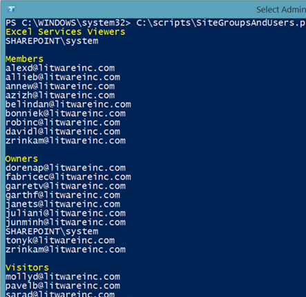

# <a name="manage-sharepoint-online-site-groups-with-powershell"></a>Управление группами сайтов SharePoint Online с помощью PowerShell

*Эта статья относится к Microsoft 365 корпоративный и Office 365 корпоративный.*

Хотя вы можете использовать Центр администрирования Microsoft 365, вы также можете использовать PowerShell для Microsoft 365 для управления группами SharePoint веб-сайтов.

## <a name="before-you-begin"></a>Подготовка

Процедуры в этой статье требуют подключения к SharePoint Online. Инструкции см. в статье [Connect to SharePoint Online PowerShell](/powershell/sharepoint/sharepoint-online/connect-sharepoint-online).

## <a name="view-sharepoint-online-with-powershell-for-microsoft-365"></a>Просмотр SharePoint Online с PowerShell для Microsoft 365

Центр администрирования SharePoint Online имеет несколько простых в использовании методов управления группами сайтов. Например, предположим, что вы хотите посмотреть на группы и участников группы для `https://litwareinc.sharepoint.com/sites/finance` сайта. Вот что нужно сделать, чтобы:

1. В центре SharePoint нажмите кнопку **Активные** сайты и нажмите URL-адрес сайта.
2. На странице сайта щелкните значок **Параметры** (расположен в верхнем правом углу страницы), а затем нажмите разрешения **сайта**.

И затем повторить процесс для следующего сайта, который необходимо просмотреть.

Чтобы получить список групп с PowerShell для Microsoft 365, можно использовать следующие команды:

```powershell
$siteURL = "https://litwareinc.sharepoint.com/sites/finance"
$x = Get-SPOSiteGroup -Site $siteURL
foreach ($y in $x)
    {
        Write-Host $y.Title -ForegroundColor "Yellow"
        Get-SPOSiteGroup -Site $siteURL -Group $y.Title | Select-Object -ExpandProperty Users
        Write-Host
    }
```

Существует два способа запуска этого набора команд в командной SharePoint командной командной SharePoint:

- Скопируйте команды в Блокнот (или другой текстовый редактор), измените значение переменной **$siteURL,** выберите команды и вклейте их в командную команду SharePoint Online Management Shell. Когда вы это сделаете, PowerShell остановится в **>>** запросе. Нажмите кнопку Ввод, чтобы выполнить `foreach` команду.<br/>
- Скопируйте команды в блокнот (или другой текстовый редактор), измените значение переменной **$siteURL**, а затем сохраните этот текстовый файл с именем и расширением .ps1 в подходящей папке. Далее запустите сценарий из командной SharePoint командной команды online Management Shell, указав его путь и имя файла. Вот пример необходимой команды:

```powershell
C:\Scripts\SiteGroupsAndUsers.ps1
```

В обоих случаях должно отобразиться что-то вроде этого:



Это все группы, созданные для сайта, и все пользователи, назначенные `https://litwareinc.sharepoint.com/sites/finance` этим группам. Имена групп обозначены желтым цветом, чтобы вы могли отличить имена групп от их участников.

В качестве другого примера можно привести командный набор, в который перечислены группы и все члены группы для всех SharePoint веб-сайтов.

```powershell
$x = Get-SPOSite
foreach ($y in $x)
    {
        Write-Host $y.Url -ForegroundColor "Yellow"
        $z = Get-SPOSiteGroup -Site $y.Url
        foreach ($a in $z)
            {
                 $b = Get-SPOSiteGroup -Site $y.Url -Group $a.Title
                 Write-Host $b.Title -ForegroundColor "Cyan"
                 $b | Select-Object -ExpandProperty Users
                 Write-Host
            }
    }
```

## <a name="see-also"></a>См. также

[Подключение к PowerShell в SharePoint Online](/powershell/sharepoint/sharepoint-online/connect-sharepoint-online)

[Создание сайтов и добавление пользователей в SharePoint Online с помощью PowerShell](create-sharepoint-sites-and-add-users-with-powershell.md)

[Управление пользователями и группами SharePoint Online с помощью PowerShell](manage-sharepoint-users-and-groups-with-powershell.md)

[Управление Microsoft 365 с помощью PowerShell](manage-microsoft-365-with-microsoft-365-powershell.md)

[Начало работы с PowerShell для Microsoft 365](getting-started-with-microsoft-365-powershell.md)
