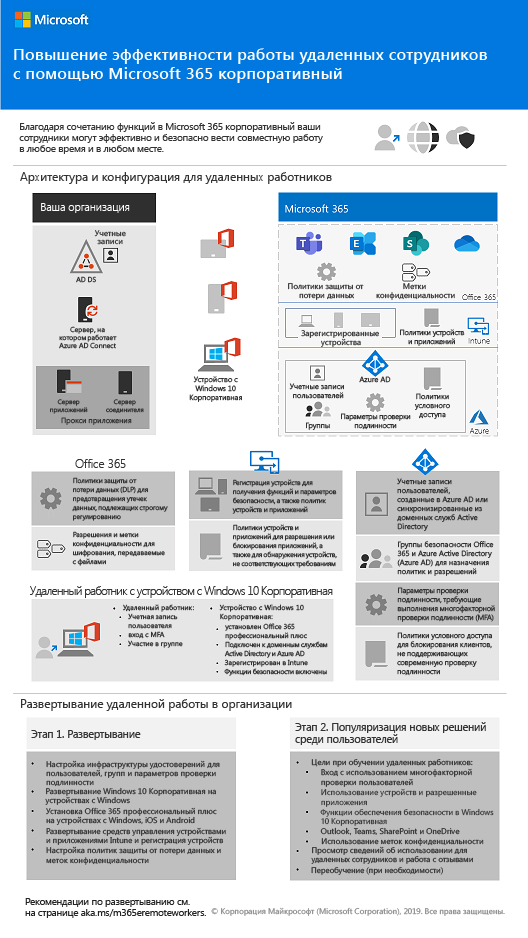
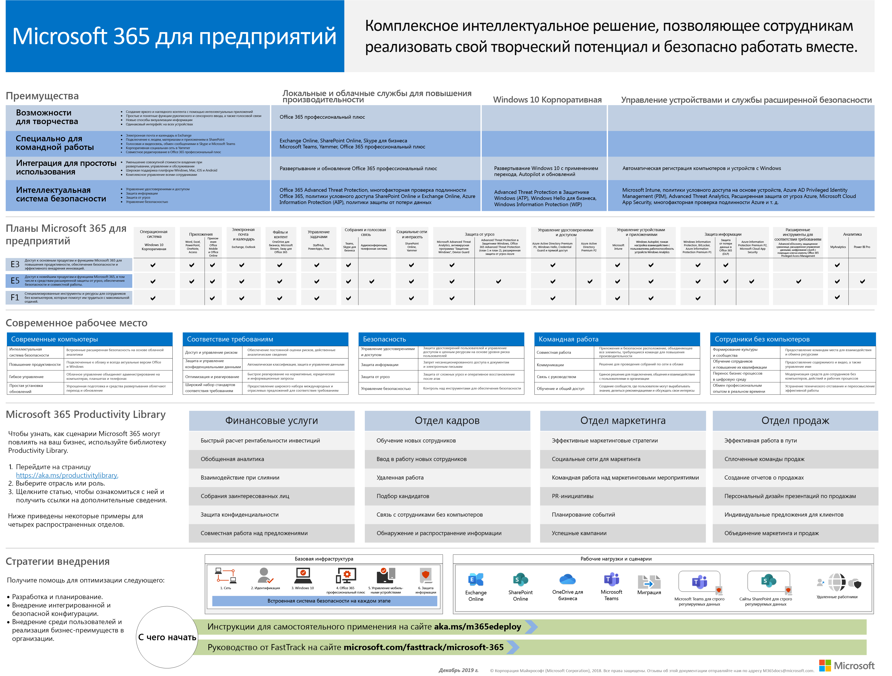
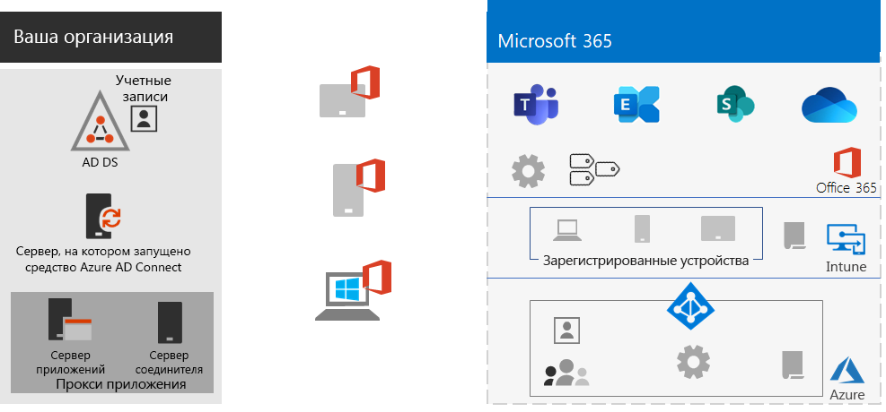
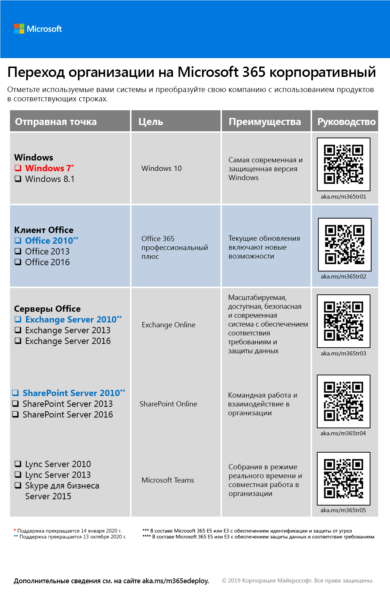
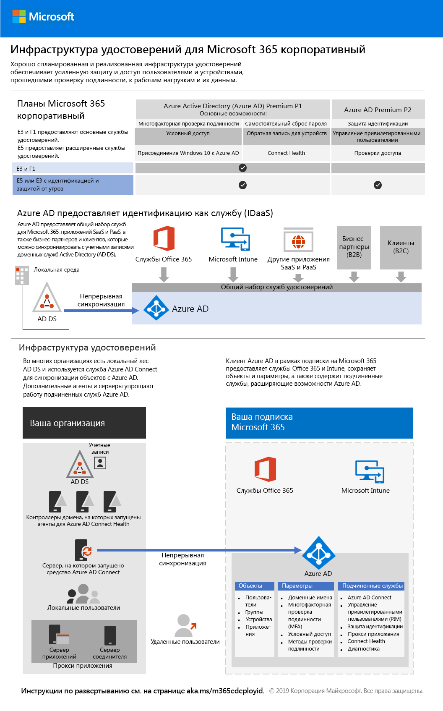
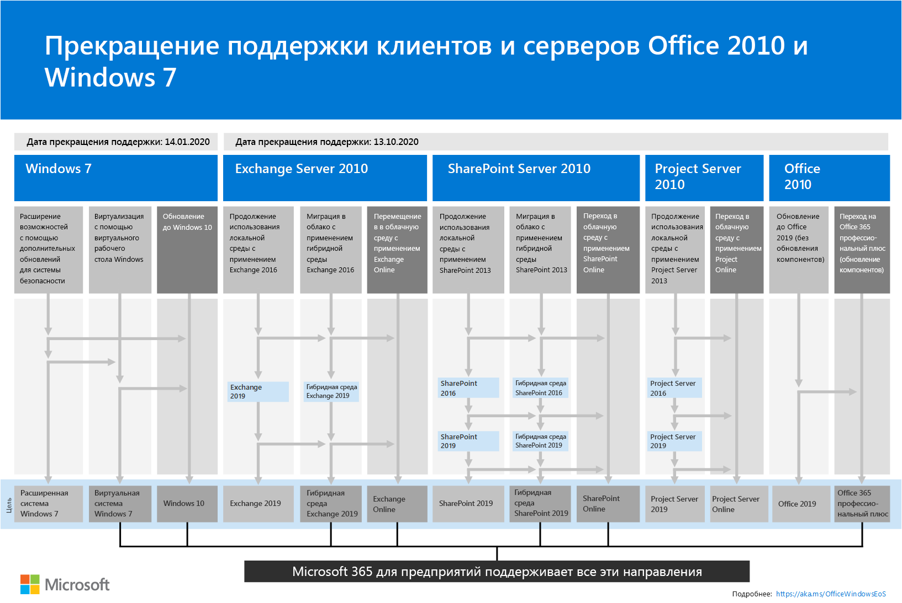
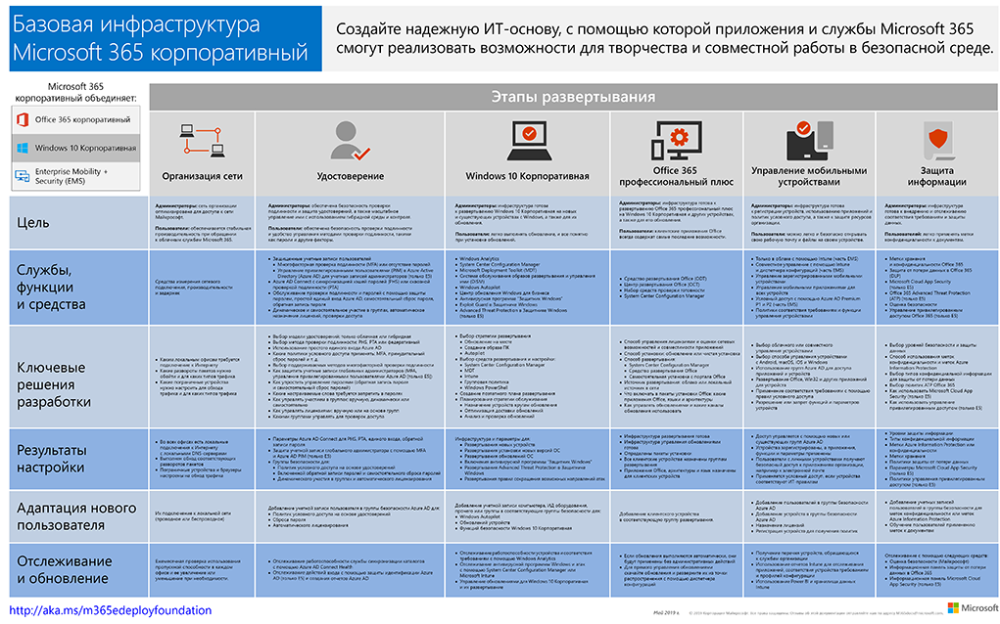
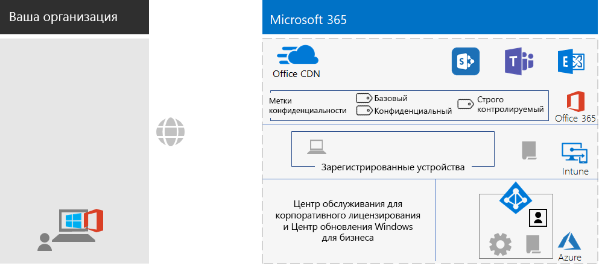

# Изменения содержимого развертывания Microsoft 365 корпоративныйChanges to Microsoft 365 Enterprise deployment content

## Октябрь 2019 г.October 2019

### Новое содержимоеNew content 

- [Teams для сценария со строго регулируемыми даннымиMicrosoft Teams for highly regulated data](secure-teams-highly-regulated-data-scenario.md)

  

- [Плакат "Возможности для удаленных работников"Empower remote workers poster](empower-people-to-work-remotely.md#poster)

   
 

### Обновления и улучшенияUpdates and enhancements

- Обновление [практического примера Contoso](contoso-case-study.md)Refresh of the [Contoso case study](contoso-case-study.md)
- Обновление рабочих нагрузок [Microsoft Teams](teams-workload.md), [Exchange Online](exchangeonline-workload.md) и [SharePoint Online](sharepoint-online-onedrive-workload.md)Refresh of the [Microsoft Teams](teams-workload.md), [Exchange Online](exchangeonline-workload.md), and [SharePoint Online](sharepoint-online-onedrive-workload.md) workloads
- Обновление сценария [сайтов SharePoint для жестко регламентированных данных](teams-sharepoint-online-sites-highly-regulated-data.md)Refresh of the [SharePoint sites for highly regulated data](teams-sharepoint-online-sites-highly-regulated-data.md) scenario
 
  

- [Плакат Microsoft 365 корпоративный](microsoft-365-overview.md#get-the-big-picture) для новых сценариев[Microsoft 365 Enterprise poster](microsoft-365-overview.md#get-the-big-picture) for new scenarios 

  

## Сентябрь 2019 г.September 2019

### Новое содержимоеNew content 

- [Сценарий удаленных сотрудниковRemote workers scenario](empower-people-to-work-remotely.md)

   
 
- [Шаг шифрования электронной почты](infoprotect-email-encryption.md) для [этапа 6 (защита данных)](infoprotect-infrastructure.md)[Email encryption step](infoprotect-email-encryption.md) for [Phase 6: Information Protection](infoprotect-infrastructure.md)

### Обновления и улучшенияUpdates and enhancements

- Реорганизация и обновление [этапа 2 (идентификация)](identity-infrastructure.md)Reorganization and refresh of [Phase 2: Identity](identity-infrastructure.md)
- Обновление [этапа 1 (сеть)](networking-infrastructure.md) и [этапа 6 (защита данных)](infoprotect-infrastructure.md)Refresh of [Phase 1: Networking](networking-infrastructure.md) and [Phase 6: Information Protection](infoprotect-infrastructure.md)

## Август 2019 г.August 2019

### Новое содержимоеNew content 

- [Плакат "Переход организации на Microsoft 365 корпоративный"Transition Your Organization to Microsoft 365 Enterprise poster](migration-microsoft-365-enterprise-workload.md#transition-your-entire-organization)

   
 
- [Плакат "Инфраструктура удостоверений для Microsoft 365 корпоративный"Identity infrastructure for Microsoft 365 Enterprise poster](identity-infrastructure.md)

  

  Объявления: [Блог технического сообщества Microsoft 365](https://techcommunity.microsoft.com/t5/Microsoft-365-Blog/Get-the-new-Identity-infrastructure-for-Microsoft-365-Enterprise/ba-p/874941)  |  [LinkedIn](https://www.linkedin.com/pulse/how-can-i-quickly-ramp-up-key-concepts-features-identity-joe-davies/?published=t)Announcements: [Microsoft 365 Technical Community blog](https://techcommunity.microsoft.com/t5/Microsoft-365-Blog/Get-the-new-Identity-infrastructure-for-Microsoft-365-Enterprise/ba-p/874941)  |  [LinkedIn](https://www.linkedin.com/pulse/how-can-i-quickly-ramp-up-key-concepts-features-identity-joe-davies/?published=t)

- [Плакат "Прекращение поддержки Windows 7 и Office 10"Windows 7 and Office 10 End-of-Support poster](migration-microsoft-365-enterprise-workload.md#summary-of-options-for-office-2010-clients-and-servers-and-windows-7)
  
  

  Объявления: [Блог технического сообщества Microsoft 365](https://techcommunity.microsoft.com/t5/Microsoft-365-Blog/Move-from-Office-2010-clients-and-servers-and-Windows-7-to/ba-p/846994)  |  [LinkedIn](https://www.linkedin.com/pulse/how-can-microsoft-365-enterprise-help-me-end-support-products-davies/)Announcements: [Microsoft 365 Technical Community blog](https://techcommunity.microsoft.com/t5/Microsoft-365-Blog/Move-from-Office-2010-clients-and-servers-and-Windows-7-to/ba-p/846994)  |  [LinkedIn](https://www.linkedin.com/pulse/how-can-microsoft-365-enterprise-help-me-end-support-products-davies/)

### Обновления и улучшенияUpdates and enhancements

- [Плакат Microsoft 365 корпоративный](microsoft-365-overview.md#get-the-big-picture) для новых сценариев повышения производительности[Microsoft 365 Enterprise poster](microsoft-365-overview.md#get-the-big-picture) for new productivity scenarios

   

## Июль 2019 г.July 2019

### Новое содержимоеNew content

- Книга Excel для статьи [Microsoft 365 корпоративный для некорпоративных организаций](deploy-foundation-infrastructure-non-enterprises.md#onboarding)Excel workbook for [Microsoft 365 Enterprise for non-enterprise organizations article](deploy-foundation-infrastructure-non-enterprises.md#onboarding)

## Май 2019 г.May 2019

### Новое содержимоеNew content

- [Плакат базовой инфраструктурыFoundation Infrastructure poster](deploy-foundation-infrastructure.md#at-a-glance)

  

  Объявления: [LinkedIn](https://www.linkedin.com/pulse/how-can-i-get-big-picture-microsoft-365-enterprise-joe-davies/)Announcements: [LinkedIn](https://www.linkedin.com/pulse/how-can-i-get-big-picture-microsoft-365-enterprise-joe-davies/)

 
- Статья [Microsoft 365 корпоративный для некорпоративных организаций](deploy-foundation-infrastructure-non-enterprises.md)[Microsoft 365 Enterprise for non-enterprise organizations article](deploy-foundation-infrastructure-non-enterprises.md)

  

  Объявления: [Блог технического сообщества Microsoft 365](https://techcommunity.microsoft.com/t5/Microsoft-365-Blog/Deploy-Microsoft-365-Enterprise-infrastructure-even-if-you-re/ba-p/900012)  |  [LinkedIn](https://www.linkedin.com/pulse/how-do-i-deploy-microsoft-365-enterprise-without-joe-davies/)Announcements: [Microsoft 365 Technical Community blog](https://techcommunity.microsoft.com/t5/Microsoft-365-Blog/Deploy-Microsoft-365-Enterprise-infrastructure-even-if-you-re/ba-p/900012)  |  [LinkedIn](https://www.linkedin.com/pulse/how-do-i-deploy-microsoft-365-enterprise-without-joe-davies/)

## Апрель 2019 г.April 2019

### Новое содержимоеNew content 

- Предварительное требование [Удостоверение и доступ к устройству](identity-device-access-m365-test-environment.md) руководств по лаборатории тестирования[Identity and device access](identity-device-access-m365-test-environment.md) prerequisite Test Lab Guides
- Шаги [Windows Information Protection](infoprotect-deploy-windows-information-protection.md) и [Защита от потери данных Office 365](infoprotect-data-loss-prevention.md) для [этапа 6 (защита данных)](infoprotect-infrastructure.md)[Windows Information Protection](infoprotect-deploy-windows-information-protection.md) and [Office 365 Data Loss Prevention](infoprotect-data-loss-prevention.md) steps for [Phase 6: Information Protection](infoprotect-infrastructure.md)

## См. такжеSee also

[Руководство по развертываниюDeployment guide](deploy-microsoft-365-enterprise.md)
