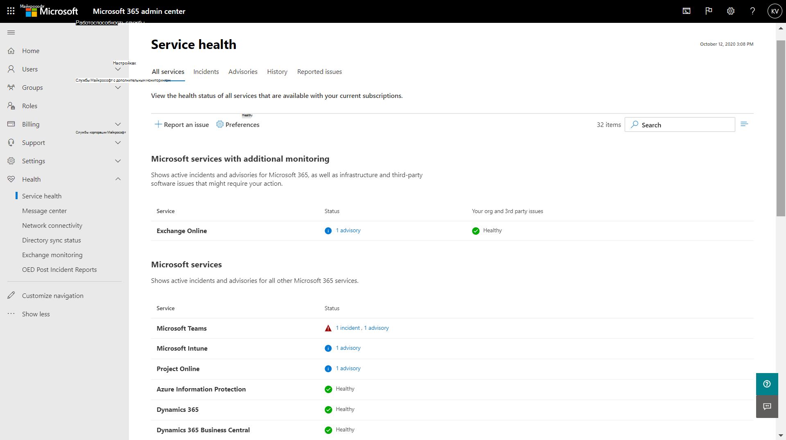
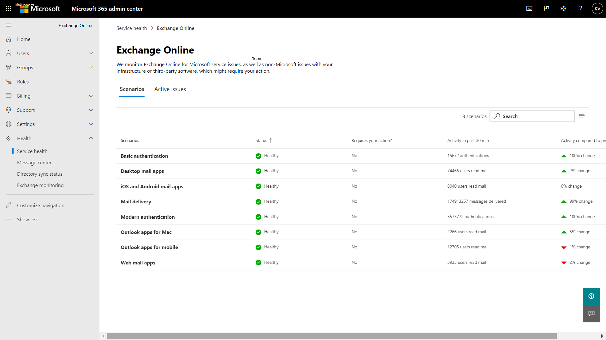
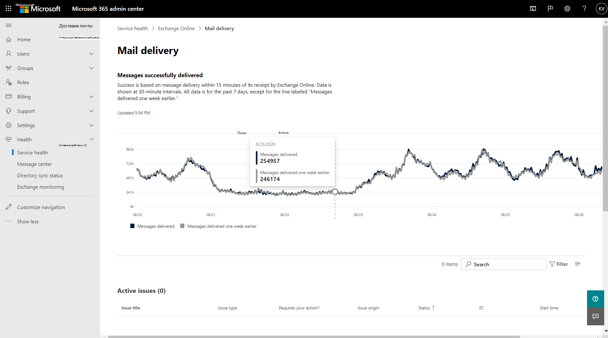
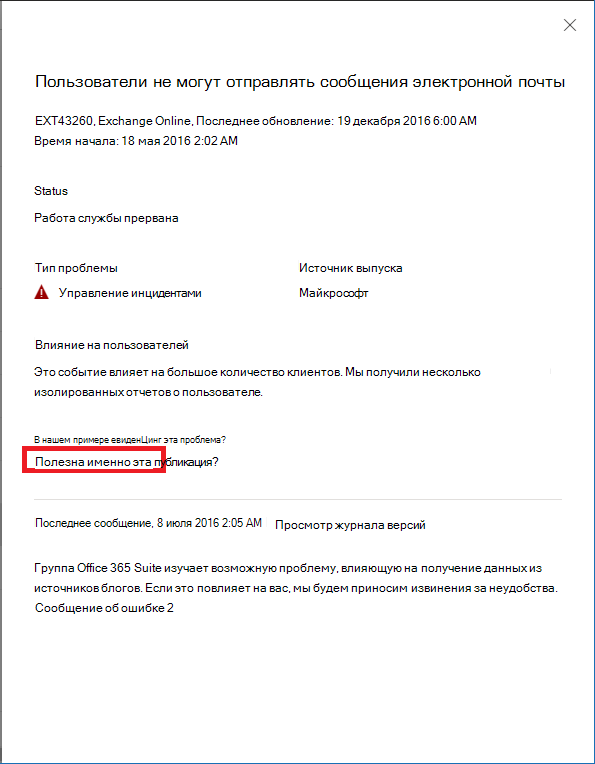

# Мониторинг Exchange Online для Microsoft 365Exchange Online monitoring for Microsoft 365

С помощью мониторинга Exchange Online в Центре администрирования Microsoft 365 вы можете отслеживать работоспособность службы Exchange в рамках подписки Microsoft 365 вашей организации.You can use Exchange Online monitoring in the Microsoft 365 admin center to monitor the health of the Exchange service for your organization’s Microsoft 365 subscription. Мониторинг Exchange Online предоставляет информацию об инцидентах и предупреждениях, собираемых в следующих категориях:Exchange Online monitoring provides you with information about incidents and advisories that are collected in these categories:

- **Инфраструктура**. Проблема обнаружена в инфраструктуре Microsoft 365, принадлежащей корпорации Майкрософт и используемой для обеспечения регулярных обновлений и устранения проблем.**Infrastructure**: Issue is detected in the Microsoft 365 infrastructure that Microsoft owns for providing regular updates and resolving the issue. Например, пользователи не могут получить доступ к Exchange Online из-за проблем в Exchange или другой облачной инфраструктуре Microsoft 365.For example, users cannot access Exchange Online because of issues with Exchange or other Microsoft 365 cloud infrastructure.
- **Сторонняя инфраструктура**. Проблема обнаружена в сторонней инфраструктуре, от которой зависит ваша организация. Для ее устранения требуется действие от вашей организации.**Third-party infrastructure**: Issue is detected in third-party infrastructure on which your organization has taken a dependency and requires action from your organization for resolution. Например, операции проверки подлинности пользователей регулируются сторонним поставщиком службы маркеров безопасности (STS), который не позволяет пользователям подключаться к Exchange Online.For example, user authentication transactions are getting throttled by a third-party security token service (STS) provider that prevents users from connecting to Exchange Online.
- **Пользовательская инфраструктура**. Проблема обнаружена в инфраструктуре вашей организации, и для ее устранения требуется действие от вашей организации.**Customer infrastructure**: Issue is detected in your organization's infrastructure and requires action from your organization for resolution. Например, пользователи не могут получить доступ к Exchange Online, так как они не могут получить маркер проверки подлинности от поставщика STS, размещенного в вашей организации, из-за просроченного сертификата.For example, users cannot access Exchange Online because they are unable to obtain an authentication token from STS provider hosted by your organization because of an expired certificate.

Ниже приведен пример страницы **Работоспособность служб** в Центре администрирования Microsoft 365, доступной в разделе **Работоспособность > Работоспособность службы**.Here is an example of the **Service health** page in the Microsoft 365 admin center, available from **Health > Service health**.

Значение столбца **Состояние** указывает, является ли служба работоспособной или с ней связаны предупреждения и инциденты на основе облачных служб, поддерживаемых корпорацией Майкрософт.The value of the **Status** column indicates whether the service is healthy or has advisories or incidents based on the cloud services that Microsoft maintains. 

Значение в столбце **Проблемы вашей организации и сторонних поставщиков** указывает, что инфраструктура вашей организации или сторонние программы влияют на работоспособность служб пользователей в Exchange Online.The value of the **Your org and 3rd party issues** column indicates that your organization's infrastructure or third-party software affects your users service health experience with Exchange Online. Предупреждения и инциденты требуют *ваших* действий по устранению.Advisories or incidents require *your* actions to resolve.

Ниже приведен пример страницы мониторинга **Exchange Online** в Центре администрирования Microsoft 365, доступной в разделе **Работоспособность > Работоспособность службы > Exchange Online**.Here is an example of the **Exchange Online** monitoring page in the Microsoft 365 admin center, available from **Health > Service health > Exchange Online**.

На странице мониторинга **Exchange Online** вы можете увидеть, работоспособна ли служба Exchange Online и связаны ли с ней какие-либо инциденты и предупреждения.With the **Exchange Online** monitoring page, you can see whether the Exchange Online service is healthy or not and whether there are any associated incidents or advisories. С помощью мониторинга Exchange Online вы можете просмотреть работоспособность служб для определенных почтовых сценариев и увидеть сигналы почти в режиме реального времени для определения воздействия сценария.With Exchange Online monitoring, you can look at the service health for specific email scenarios and view near real-time signals to determine the impact by scenario. 

## ТребованияRequirements

Эта предварительная версия включена для пользователей, отвечающих следующим требованиям:This preview is enabled for customers who meet these requirements: 

- У вашей организации должно быть не менее 5 000 лицензий на один или несколько следующих продуктов: Office 365 E3, Microsoft 365 E3, Office 365 E5, Microsoft 365 E5.Your organization needs to have a license count of at least 5,000, from one or a combination of these products: Office 365 E3, Microsoft 365 E3, Office 365 E5, Microsoft 365 E5. 

  Например, у вашей организации может быть 3 000 лицензий Office 365 E3 и 2 500 лицензий Microsoft 365 E5, что в итоге составляет 5 500 лицензий на соответствующие продукты.For example, your organization can have 3,000 Office 365 E3 licenses and 2,500 Microsoft 365 E5, for a total of 5,500 licenses from the qualifying products.

- У вашей организации должно быть как минимум 50 активных пользователей Exchange Online ежемесячно.Your organization needs to have at least 50 monthly active Exchange Online users.

С помощью мониторинга Exchange Online вы можете просматривать сведения о работоспособности следующих почтовых клиентов на основе действий по чтению писем:With Exchange Online monitoring you can view the health for the following email clients based on email read activity:

- Классическое приложение OutlookOutlook Desktop
- Outlook в ИнтернетеOutlook on the Web
- Собственные почтовые клиенты iOS и AndroidNative mail clients of iOS and Android 
- Приложение Outlook Mobile в iOS и AndroidOutlook Mobile app in iOS and Android 
- Клиент Outlook MacOutlook Mac client

В этих клиентах вы можете просматривать количество активных пользователей за последние 30 минут на основе чтения писем пользователями, а также количество инцидентов и предупреждений в панели мониторинга.For these clients, you can see the number of active users in the last 30 minutes based on users reading an email, along with number of incidents and advisories in the dashboard. Эти данные сравниваются с тем же интервалом прошлой недели, чтобы проверить, имеется ли проблема.This data is compared to the same interval for the previous week to see if there’s an issue. 

>[!Note]
> Количество активных пользователей измеряется по одному действию, например при чтении пользователем письма.Active user count is measured by a single activity, for example, when a user reads an email. В это показателе учитываются действия только за последние 30 минут.It only accounts for the last 30 minutes of activity.
>

Кроме того, вы можете отслеживать работоспособность Exchange Online в следующих сценариях:You can also monitor Exchange Online health for the following scenarios:

- **Поток обработки почты**. Количество сообщений, успешно доставленных в почтовый ящик без задержек после того, как сообщение достигло сети Microsoft 365.**Mail flow**: The number of messages successfully delivered to a mailbox without any delay after the message reached the Microsoft 365 network. 
- **Обычная проверка подлинности и современная проверка подлинности**. Количество пользователей, успешно прошедших проверку в службе Exchange Online.**Basic Authentication and Modern Authentication**: The number of users successfully validated in the Exchange Online service.

Во всех этих сценариях ключевые показатели указываются в основной панели мониторинга за последние 30 минут.For all these scenarios, the key numbers are for the last 30 minutes in the main dashboard. В подробных представлениях для каждого из этих сценариев демонстрируется тренд почти в режиме реального времени за последние семь дней с 30-минутным агрегированием в сравнении с прошлой неделей.Detailed views for each of these scenarios shows the near real-time trend for seven days with the 30-minute aggregate compared with the previous week. 

## Отправка отзывов и предложенийSend us feedback

Существует два способа обратной связи:There are two ways you can provide feedback:

- Использование параметра **Оставить отзыв**, доступного на каждой странице Центра администрирования Microsoft 365.Use the **Give feedback** option available on every page of the Microsoft 365 admin center.
- Отправка отзыва с помощью ссылки **Эта запись полезна?** для определенного инцидента или предупреждения.Submit feedback using the **Is this post helpful?** link for a specific incident or advisory.

## Вопросы и ответыFrequently asked questions

#### 1. Почему я не вижу элемент "Мониторинг Exchange Online" в разделе "Работоспособность" Центра администрирования Microsoft 365?1. Why don’t I see “Exchange Online monitoring” under Health in the Microsoft 365 admin center? 

Сначала включите новый Центр администрирования на **главной** странице Центра администрирования Microsoft 365.First, make sure you’ve enabled the new admin center on the **Home** page of the Microsoft 365 admin center. 

Затем убедитесь, что вы отвечаете обоим следующим требованиям:Then make sure you meet both of the following requirements: 

- У вашей организации должно быть не менее 5 000 лицензий на один или несколько следующих продуктов: Office 365 E3, Microsoft 365 E3, Office 365 E5, Microsoft 365 E5.Your organization needs to have a license count of at least 5,000, from one or a combination of these products: Office 365 E3, Microsoft 365 E3, Office 365 E5, Microsoft 365 E5. 
- У вашей организации должно быть как минимум 50 активных пользователей Exchange Online ежемесячно.Your organization needs to have at least 50 monthly active Exchange Online users.

Если количество лицензий в вашей организации ниже 5 000, а число активных пользователей — менее 50 в месяц, мониторинг Exchange Online не будет включен, пока не будут выполнены эти требования.If the license count for your organization goes below 5,000 users and the monthly active users goes below 50 users, Exchange Online monitoring won’t be enabled until these requirements are met.

#### 2. На панели мониторинга для каждого клиента отображается малое количество активных пользователей.2. The active user count in the dashboard for each client appears to be low. У нас есть много активных лицензий, назначенных пользователям.We have a lot of active licenses assigned to users. Что это означает?What does this mean? 

Количество активных пользователей, отображаемое при мониторинге, основано на 30-минутном промежутке, в котором пользователи выполняли действия, указанные в функции.The active user count shown in monitoring is based on a 30-minute window where users have performed the activity called out in the feature. Это не следует путать с количеством использований.This shouldn’t be confused with usage numbers. Чтобы просмотреть количество использований, воспользуйтесь отчетами о действиях в Центре администрирования Microsoft 365 (**Отчеты > Использование**).To view usage numbers, use activity reports in the Microsoft 365 admin center (**Reports > Usage**).

#### 3. Будут ли доступны другие сценарии мониторинга для других служб, таких как Teams и SharePoint?3. Will there be other monitoring scenarios for other services such as Teams and SharePoint? 

Майкрософт интегрирует эту функцию непосредственно в панель мониторинга работоспособности служб в Центре администрирования Microsoft 365.Microsoft is integrating this experience directly inside the Service Health dashboard in the Microsoft 365 admin center. Это позволит корпорации Майкрософт расширить сценарии мониторинга для других служб, о чем будет объявлено при появлении соответствующих новостей.This will provide opportunities for Microsoft to extend monitoring scenarios for other services, which will be announced when there is news to share. 

#### 4. Каков план в отношении общей доступности этой функции?4. What is the plan for general availability of this experience? 

Корпорация Майкрософт интегрировала мониторинг Exchange Online непосредственно в панель мониторинга **Работоспособность служб** в Центре администрирования Microsoft 365.Microsoft has integrated Exchange Online monitoring directly on the **Service Health** dashboard in the Microsoft 365 admin center. 

С помощью этой новой интегрированной функции корпорация Майкрософт планирует собрать ваши отзывы, а затем определить план в отношении общей доступности.With this new integrated experience, Microsoft's plan is to collect your feedback and then define our plan for general availability.

#### 5. Это бесплатная (включенная) или платная (дополнительная) функция?5. Is this a free (included) or paid (extra) feature? 

Эта функция выпущена в общедоступной предварительной версии и доступна только для пользователей, удовлетворяющих требованиям из вопроса 1.This feature is in Public preview and only available for customers that meet the requirements in question 1.

<!--
>[!Note]
>INTERNAL: That decision is pending
>
--> 

#### 6. Как оставить отзыв?6. How do I provide feedback? 

Для общего отзыва используйте значок **Оставить отзыв** в правом нижнем углу страницы мониторинга **Exchange Online**.For general feedback, use the **Give feedback** icon on the bottom-right corner of the **Exchange Online** monitoring page. 

Для отзыва об инцидентах или предупреждениях используйте ссылку **Эта запись полезна?**For feedback on incidents or advisories, use the **Is this post helpful?** link.

#### 7. Где обрабатываются данные для сценариев, демонстрирующих тренды действий?7. Where is the data instrumented for the scenarios that show activity trends?

Данные обрабатываются в службе Exchange Online. Если возникнет сбой, прежде чем запрос достигнет службы Exchange Online, или возникнет сбой в Exchange Online, вы увидите падение сигнала активности.The data is instrumented in the Exchange Online service. If there is a failure that happens before the request reaches Exchange Online or there is a failure in Exchange Online, you will see a drop in the activity signal.
