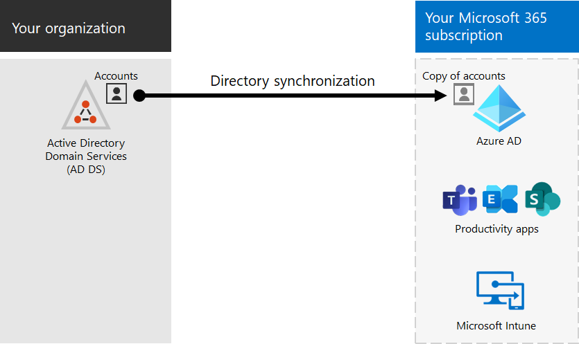

# Интеграция Microsoft 365 с локальной средой

*Эта статья относится к Microsoft 365 корпоративный и Office 365 корпоративный.*

Можно интегрировать Microsoft 365 с существующими локально-доменными службами Active Directory (AD DS) и с локальной установкой Exchange Server, Skype для бизнеса Server 2015 или SharePoint Server.
  
 - При интеграции AD DS можно синхронизировать и управлять учетной записью пользователей для обеих сред. Вы также можете добавить синхронизацию с hash паролем (PHS) или один вход (SSO), чтобы пользователи могли войти в обе среды с учетными данными на месте.
 - При интеграции с локальной серверной продукцией создается гибридная среда. Гибридная среда может помочь при миграции пользователей или сведений в Microsoft 365, или вы можете продолжать иметь некоторых пользователей или некоторые сведения на локальной основе, а некоторые в облаке. Дополнительные сведения о гибридных средах см. в [гибридном облаке.](../solutions/cloud-architecture-models.md#hybrid)

Вы также можете использовать советники Azure Active Directory (Azure AD) для настраиваемых указаний по настройке в центре администрирования Microsoft 365 (вы должны быть подписаны в Microsoft 365):

- [Руководство по настройке Azure AD](https://aka.ms/aadpguidance)
- [Синхронизация пользователей из каталога вашей организации](https://aka.ms/aadconnectpwsync)
- [Советник по развертыванию служб Федерации Active Directory (AD FS)](https://aka.ms/adfsguidance)
   
## Подготовка

Перед интеграцией Microsoft 365 и локальной среды также необходимо сделать планирование сети [и настройку производительности.](network-planning-and-performance.md) Кроме того, необходимо разобраться в доступных [моделях удостоверений.](about-microsoft-365-identity.md) 

Управление [учетной записью Microsoft 365](manage-microsoft-365-accounts.md) см. в списке средств, которые можно использовать для управления учетной записью пользователя Microsoft 365. 
  
## Интеграция Microsoft 365 с AD DS

Если у вас есть существующие учетные записи пользователей в AD DS, вы не хотите повторно создавать все эти учетные записи в Microsoft 365 и рискуете ввести различия или ошибки между средами. Синхронизация каталогов позволяет зеркально отражать эти учетные записи между локальной и интернет-средой. При синхронизации каталогов пользователям не нужно запоминать новые сведения для каждой среды, и вам не нужно создавать или обновлять учетные записи дважды. Вам потребуется подготовить [локальное каталог](prepare-for-directory-synchronization.md) для синхронизации каталогов.
  

  
Если вы хотите, чтобы пользователи могли войти в Microsoft 365 с учетными данными на локальной основе, можно также настроить SSO. С помощью SSO Microsoft 365 настраивается для доверия локальной среде для проверки подлинности пользователей.
  

### Синхронизация каталогов с синхронизацией с хашированием или проверкой подлинности с помощью пароля или без него (PTA)

Пользователь входит в локальное окружение со своей учетной записью пользователя (domain\username). Когда они идут в Microsoft 365, они должны снова войти в систему со своей работой или учетной записью школы (user@domain.com). Имя пользователя одинаково в обеих средах. При добавлении PHS или PTA у пользователя есть один и тот же пароль для обеих сред, но при входе в Microsoft 365 он должен будет предоставить эти учетные данные снова. Синхронизация каталогов с PHS является наиболее часто используемой синхронизацией каталогов.

Чтобы настроить синхронизацию каталогов, используйте Azure AD Connect. Инструкции см. в инструкции Настройка синхронизации каталогов [для Microsoft 365](set-up-directory-synchronization.md) и [Azure AD Connect с экспресс-настройками.](/azure/active-directory/hybrid/how-to-connect-install-express)

Дополнительные данные о [подготовке к синхронизации каталогов с Microsoft 365](prepare-for-directory-synchronization.md).

### Синхронизация каталогов с SSO

Пользователь входит в локальное окружение со своей учетной записью пользователя. Когда они идут в Microsoft 365, они либо вошел в систему автоматически, либо войдут в систему с помощью тех же учетных данных, что и для локальной среды (domain\username).

Чтобы настроить SSO, вы также используете Azure AD Connect. Инструкции см. в [специальной установке Azure AD Connect.](/azure/active-directory/hybrid/how-to-connect-install-custom)

Дополнительные сведения см. [в одном входе.](/azure/active-directory/manage-apps/what-is-single-sign-on)

## Azure AD Connect

Azure AD Connect заменяет старые версии средств интеграции удостоверений, таких как DirSync и Azure AD Sync. Если требуется обновить от Azure Active Directory Sync до Azure AD Connect, см. [инструкции по обновлению.](/azure/active-directory/hybrid/how-to-dirsync-upgrade-get-started) 

## См. также

[Обзор Microsoft 365 корпоративный](microsoft-365-overview.md)