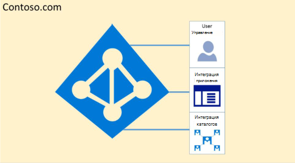
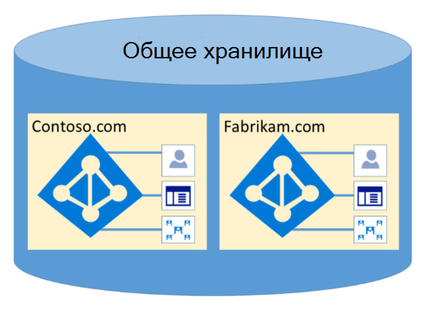

# Изоляция и управление доступом в Microsoft 365 в Azure Active Directory

Azure Active Directory (Azure AD) была разработана для более надежного размещения нескольких клиентов с помощью логической изоляции данных. Доступ к Azure AD осуществляется уровнем авторизации. Azure AD изолирует клиентов, использующих контейнеры клиентов, как границы безопасности, чтобы защитить контент клиента, чтобы получить доступ к содержимому и получить к нему доступ с помощью совместных клиентов. Уровень авторизации Azure AD выполняется для трех проверок:

- Включен участник для доступа к клиенту Azure AD?
- Включен участник для доступа к данным в этом клиенте?
- Роль субъекта в этом клиенте авторизована для типа запрашиваемого доступа к данным?

Приложение, пользователь, сервер или служба не могут получить доступ к Azure AD без соответствующей проверки подлинности, маркера или сертификата. Запросы отклоняются, если они не сопровождаются правильными учетными данными.

Фактически, Azure AD размещает каждого клиента в собственном защищенном контейнере, с политиками и разрешениями, а также в контейнере исключительно владельцем и управлением клиентом.
 

Понятие контейнеров клиентов глубоко недетализировано в службе каталогов на всех уровнях, от всех порталов до постоянного хранилища. Даже если несколько метаданных клиента Azure AD хранятся на одном физическом диске, между контейнерами, отличными от того, что определено службой каталогов, не существует отношения, которое, в свою очередь, зависит администратором клиента. Не существует прямого подключения к хранилищу Azure AD из запрашивающего приложения или службы без предварительного прохода по уровню авторизации.

В приведенном ниже примере Contoso и Fabrikam имеют отдельные выделенные контейнеры, и даже несмотря на то, что эти контейнеры могут совместно использовать одну и ту же базовую инфраструктуру, например серверы и хранилища, они не отличаются друг от друга и разделяются уровнями авторизации и управления доступом.
 

Кроме того, не существует компонентов приложений, которые можно выполнить из Azure AD, и невозможно принудительно подсчитать целостность другого клиента, получить доступ к ключам шифрования другого клиента или прочитать необработанные данные с сервера.

По умолчанию Azure AD запрещает все операции, выданные удостоверениями в других клиентах. Каждый клиент логически изолирован в Azure AD с помощью управления доступом на основе утверждений. Операции чтения и записи данных каталога ограничены контейнерами клиента и разделяются внутренним уровнем абстракции и уровнем управления доступом на основе ролей (RBAC), который совместно применяет клиент к границе безопасности. Каждый запрос на доступ к данным каталога обрабатывается этими слоями, и каждый запрос на доступ в Microsoft 365 наследует логику выше.

Azure AD — это Северная Америка, правительство США, Европейский союз, Европейский союз, Международный раздел. Клиент существует в отдельном разделе, а разделы могут содержать несколько клиентов. Сведения о разделах отменяются от пользователей. Данный раздел (включая все клиенты в нем) реплицируется в несколько центров обработки данных. Раздел для клиента выбирается на основе свойств клиента (например, кода страны). Секреты и другие конфиденциальные сведения в каждом разделе шифруются с помощью выделенного ключа. Ключи создаются автоматически при создании нового раздела.

Функциональные возможности системы Azure AD — это уникальный экземпляр для каждого сеанса пользователя. Кроме того, Azure AD использует технологии шифрования для обеспечения изоляции общих системных ресурсов на уровне сети, чтобы предотвратить несанкционированные и нежелательные передачи информации.
