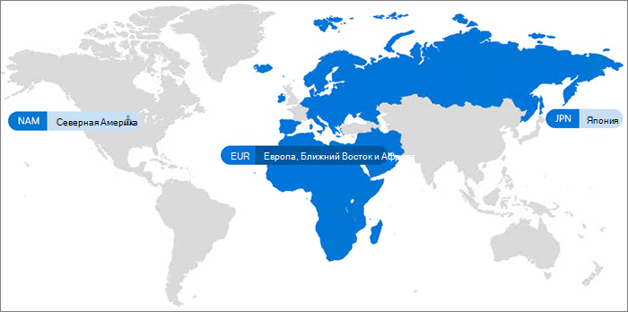

# Microsoft 365 Multi-Geo

С помощью Microsoft 365 Multi-Geo организация может расширить присутствие Microsoft 365 до нескольких географических регионов или стран в существующем клиенте. Обратитесь в службу поддержки учетных записей Майкрософт, чтобы зарегистрировать транснациональную компанию в Microsoft 365 Multi-Geo.
  
Использование Microsoft 365 Multi-Geo позволяет подготавливать и хранить неактивные данные в выбранных вами географических расположениях в соответствии с требованиями к месту расположения данных, а также предоставлять современные возможности для работы всем сотрудникам.

Видеовведение в Microsoft 365 с поддержкой нескольких регионов можно узнать в статье [SharePoint Online и OneDrive с поддержкой нескольких регионов, чтобы контролировать, где находятся данные](https://www.youtube.com/watch?v=Do9U3JuROhk).

## Архитектура с поддержкой нескольких регионов

В среде с поддержкой нескольких регионов клиент Microsoft 365 включает центральное расположение (где изначально подготавливается подписка на Microsoft 365) и одно или несколько вспомогательных расположений. В клиенте с поддержкой нескольких регионов управление сведениями о географических расположениях, группах и пользователях выполняется в Azure Active Directory (Azure AD). Так как информация клиента обрабатывается централизованно и синхронизируется с каждым регионом, общий доступ и возможности в компании носят глобальный характер.

Обратите внимание, что Microsoft 365 Multi-Geo не предназначен для повышения производительности. Он предназначен для соблюдения требований к месту расположения данных. Сведения о повышении производительности для Microsoft 365 см. в статье [Планирование сети и настройка производительности для Microsoft 365](https://support.office.com/article/e5f1228c-da3c-4654-bf16-d163daee8848). Вы также можете связаться с группой поддержки.

## Терминология

Ниже приводятся основные термины, используемые при описании Microsoft 365 Multi-Geo:

- **Центральное расположение** — географическое расположение, в котором изначально подготовлен клиент.
- **Администратор геообъекта** — администратор, который может управлять одним или несколькими периферийными расположениями.
- **Код региона** — код из трех букв для определенного географического расположения.
- **Географическое расположение** — регион, который можно использовать в клиенте с поддержкой нескольких регионов для размещения данных, включая почтовые ящики Exchange, а также сайты OneDrive и SharePoint.
- **Предпочтительное расположение данных (PDL)** — свойство пользователя, устанавливаемое администратором, которое указывает географическое расположение, где следует подготовить почтовый ящик Exchange и хранилище OneDrive пользователей. PDL также определяет, где подготовлены сайты SharePoint, созданные пользователем.
- **Вспомогательное расположение** — географическое расположение, где учитывающие регион рабочие нагрузки Microsoft 365 (SharePoint, OneDrive и Exchange) включены в клиенте с поддержкой нескольких регионов.
- **Клиент** — представление организации в Microsoft 365, которое имеет, как правило, один или несколько связанных с ним доменов (например, contoso.com).

## Лицензирование

Microsoft 365 с поддержкой нескольких регионов доступен как надстройка для планов подписки Microsoft 365 для клиентов EA с не менее чем 250 рабочих мест Microsoft 365 в клиенте и не менее чем 5% из этих рабочих мест, для которых используется поддержка нескольких регионов. За дополнительной информацией обращайтесь к команде, в которую входит ваша учетная запись.

- Microsoft 365 F1, E1, E3 или E5
- Exchange Online (план 1 или план 2)
- OneDrive для бизнеса (план 1 или план 2)
- SharePoint Online (план 1 или план 2)

## Доступность Microsoft 365 Multi-Geo

В настоящее время Microsoft 365 Multi-Geo доступен в таких странах и регионах:

[!INCLUDE [Microsoft 365 Multi-Geo locations](../includes/microsoft-365-multi-geo-locations.md)]

## Начало работы

Чтобы приступить к работе с несколькими регионами, следуйте указанным ниже инструкциям.

1. Совместно с группой специалистов, занимающихся учетными записями, добавьте план обслуживания _с поддержкой нескольких регионов в Microsoft 365_. Они помогут вам добавить необходимое количество лицензий. Функция поддержки нескольких регионов доступна клиентам EA с не менее 250 подписками на Microsoft 365.

   Прежде чем вы сможете начать работу в Microsoft 365 Multi-Geo, корпорации Майкрософт потребуется настроить ваш клиент Exchange Online для поддержки нескольких регионов. Этот разовый процесс настройки запускается после заказа плана обслуживания с *поддержкой нескольких регионов в Microsoft 365* и появления лицензий в вашем клиенте. Вы будете получать уведомления о рабочей нагрузке в [центре сообщений Microsoft 365](https://support.office.com/article/38FB3333-BFCC-4340-A37B-DEDA509C2093) после того, как ваш клиент завершит процесс настройки каждой рабочей нагрузки, а затем можете настроить и использовать возможности поддержки нескольких регионов Microsoft 365. Время, необходимое для настройки клиента для поддержки нескольких регионов, отличается от клиента к клиенту, но большинство клиентов завершаются в месяц после получения лицензий на функции. Для больших или более сложных клиентов может потребоваться больше времени для завершения процесса настройки. Для получения дополнительных сведений о конкретном клиенте обратитесь в группу учетных записей.

2. См. статью [Планирование среды с поддержкой нескольких регионов](plan-for-multi-geo.md).

3. Узнайте об [администрировании среды с поддержкой нескольких регионов](administering-a-multi-geo-environment.md) и о том, [как пользователи взаимодействуют со средой](multi-geo-user-experience.md).

4. Когда вы будете готовы настроить Microsoft 365 Multi-Geo, [настройте свой клиент для поддержки нескольких регионов](multi-geo-tenant-configuration.md).

5. [Настройка поиска](configure-search-for-multi-geo.md).

## См. также

[Поддержка нескольких регионов в Exchange Online и OneDrive](https://Aka.ms/GoMultiGeo)

[Поддержка нескольких регионов в OneDrive и SharePoint Online](multi-geo-capabilities-in-onedrive-and-sharepoint-online-in-microsoft-365.md)

[Поддержка нескольких регионов в Exchange Online](multi-geo-capabilities-in-exchange-online.md)

[Взаимодействие групп в нескольких географических средах](https://docs.microsoft.com/microsoftteams/teams-experience-o365odb-spo-multi-geo)
