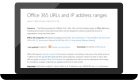
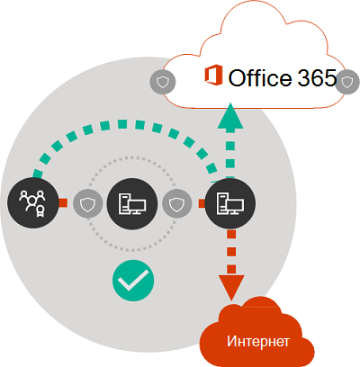

# Принципы сетевого подключения к Microsoft 365Microsoft 365 network connectivity principles

*Эта статья относится к Microsoft 365 корпоративный и Office 365 корпоративный.**This article applies to both Microsoft 365 Enterprise and Office 365 Enterprise.*

Прежде чем приступить к планированию сети для сетевого подключения к Microsoft 365, важно понять принципы подключения для безопасного управления трафиком Microsoft 365 и получения максимальной производительности.Before you begin planning your network for Microsoft 365 network connectivity, it is important to understand the connectivity principles for securely managing Microsoft 365 traffic and getting the best possible performance. Эта статья поможет вам понять новейшие рекомендации по безопасной оптимизации сетевого подключения Microsoft 365.This article will help you understand the most recent guidance for securely optimizing Microsoft 365 network connectivity.
  
Традиционные корпоративные сети в первую очередь предназначены для предоставления пользователям доступа к приложениям и данным, размещенным в центрах обработки данных компании с надежной защитой периметра.Traditional enterprise networks are designed primarily to provide users access to applications and data hosted in company operated datacenters with strong perimeter security. Традиционная модель предполагает, что пользователи будут обращаться к приложениям и данным из периметра корпоративной сети, через каналы связи глобальной сети из филиалов или через VPN-подключения.The traditional model assumes that users will access applications and data from inside the corporate network perimeter, over WAN links from branch offices, or remotely over VPN connections.
  
Внедрение приложений SaaS, таких как Microsoft 365, перемещает некоторую комбинацию служб и данных за пределы периметра сети.Adoption of SaaS applications like Microsoft 365 moves some combination of services and data outside the network perimeter. Без оптимизации трафик между пользователями и приложениями SaaS доставляется с задержкой, вызванной осмотром пакетов, разворотами пакетов, непреднамеренными подключениями к географически отдаленным конечным точкам и другими факторами.Without optimization, traffic between users and SaaS applications is subject to latency introduced by packet inspection, network hairpins, inadvertent connections to geographically distant endpoints and other factors. Вы можете обеспечить наилучшие производительность и надежность Microsoft 365, если поймете и реализуете основные рекомендации по оптимизации.You can ensure the best Microsoft 365 performance and reliability by understanding and implementing key optimization guidelines.
  
Из этой статьи вы узнаете об:In this article, you will learn about:
  
- [архитектуре Microsoft 365](microsoft-365-network-connectivity-principles.md#BKMK_Architecture) в отношении подключения клиентов к облаку;[Microsoft 365 architecture](microsoft-365-network-connectivity-principles.md#BKMK_Architecture) as it applies to customer connectivity to the cloud
- обновленных [принципах подключения Microsoft 365](microsoft-365-network-connectivity-principles.md#BKMK_Principles) и стратегиях оптимизации сетевого трафика и пользовательского интерфейса;Updated [Microsoft 365 connectivity principles](microsoft-365-network-connectivity-principles.md#BKMK_Principles) and strategies for optimizing network traffic and the end-user experience
- [веб-службе конечных точек Office 365](microsoft-365-network-connectivity-principles.md#BKMK_WebSvc), позволяющей сетевым администраторам использовать структурированный список конечных точек для сетевой оптимизации;The [Office 365 Endpoints web service](microsoft-365-network-connectivity-principles.md#BKMK_WebSvc), which allows network administrators to consume a structured list of endpoints for use in network optimization
- [новых категориях конечных точек Office 365](microsoft-365-network-connectivity-principles.md#BKMK_Categories) и рекомендациях по оптимизации;[New Office 365 endpoint categories](microsoft-365-network-connectivity-principles.md#BKMK_Categories) and optimization guidance
- [сравнении защиты периметра сети с защитой конечных точек;Comparing network perimeter security with endpoint security](microsoft-365-network-connectivity-principles.md#BKMK_SecurityComparison)
- вариантах [добавочной оптимизации](microsoft-365-network-connectivity-principles.md#BKMK_IncOpt) для трафика Microsoft 365;[Incremental optimization](microsoft-365-network-connectivity-principles.md#BKMK_IncOpt) options for Microsoft 365 traffic
- [тестировании подключения Microsoft 365](https://aka.ms/netonboard), новом инструменте для тестирования основных возможностей подключения к Microsoft 365.The [Microsoft 365 connectivity test](https://aka.ms/netonboard), a new tool for testing basic connectivity to Microsoft 365

## Архитектура Microsoft 365Microsoft 365 architecture

Microsoft 365 — это распределенное облако на основе модели "программное обеспечение как услуга" (SaaS), которое реализует сценарии эффективной и совместной работы с помощью разнообразных микрослужб и приложений, таких как Exchange Online, SharePoint Online, Skype для бизнеса Online, Microsoft Teams, Exchange Online Protection, Office в браузере и многие другие.Microsoft 365 is a distributed Software-as-a-Service (SaaS) cloud that provides productivity and collaboration scenarios through a diverse set of micro-services and applications, such as Exchange Online, SharePoint Online, Skype for Business Online, Microsoft Teams, Exchange Online Protection, Office in a browser, and many others. Несмотря на то что у определенных приложений Microsoft 365 могут быть уникальные функции, связанные с клиентскими сетями и подключением к облаку, все эти приложения объединяют некоторые основные принципы, цели и архитектурные шаблоны.While specific Microsoft 365 applications may have their unique features as it applies to customer network and connectivity to the cloud, they all share some key principals, goals, and architecture patterns. Эти принципы и архитектурные шаблоны для подключения являются типичными для многих других облаков SaaS и в то же время отличаются от типичных моделей развертывания облаков на основе моделей "платформа как услуга" и "инфраструктура как услуга", например Microsoft Azure.These principles and architecture patterns for connectivity are typical for many other SaaS clouds and at the same time being different from the typical deployment models of Platform-as-a-Service and Infrastructure-as-a-Service clouds, such as Microsoft Azure.
  
Одной из самых важных особенностей архитектуры Microsoft 365 (которую часто упускают из виду или неправильно понимают сетевые архитекторы) является то, что она представляет собой глобальную распределенную службу в контексте того, как к ней подключаются пользователи.One of the most significant architectural features of Microsoft 365 (that is often missed or misinterpreted by network architects) is that it is a truly global distributed service, in the context of how users connect to it. Важно знать расположение целевого клиента Microsoft 365, чтобы понять, где в облаке располагаются данные клиентов, но во время работы с Microsoft 365 пользователи не подключаются непосредственно к дискам, содержащим данные.The location of the target Microsoft 365 tenant is important to understand the locality of where customer data is stored within the cloud, but the user experience with Microsoft 365 doesn't involve connecting directly to disks containing the data. Взаимодействие пользователей с Microsoft 365 (включая производительность, надежность и другие важные качественные характеристики) включает подключение через входы в высокораспределенные службы, находящиеся в сотнях расположений Майкрософт по всему миру.The user experience with Microsoft 365 (including performance, reliability, and other important quality characteristics) involves connectivity through highly distributed service front doors that are scaled out across hundreds of Microsoft locations worldwide. В большинстве случаев максимальное удобство работы пользователей обеспечивается, если разрешить клиентской сети направлять запросы пользователей в ближайшую точку входа в службу Microsoft 365, а не подключаться к Microsoft 365 через точку выхода в центральном расположении или регионе.In the majority of cases, the best user experience is achieved by allowing the customer network to route user requests to the closest Microsoft 365 service entry point, rather than connecting to Microsoft 365 through an egress point in a central location or region.
  
Для большинства клиентов пользователи Microsoft 365 распределяются по множеству расположений.For most customers, Microsoft 365 users are distributed across many locations. Для получения наилучших результатов описанные в этом документе принципы следует рассматривать с точки зрения горизонтального (а не вертикального) увеличения масштаба, сосредоточившись на оптимизации подключения к ближайшей точке присутствия в глобальной сети Майкрософт, а не географическому местоположению клиента Microsoft 365.To achieve the best results, the principles outlined in this document should be looked at from the scale-out (not scale-up) point of view, focusing on optimizing connectivity to the nearest point of presence in the Microsoft Global Network, not to the geographic location of the Microsoft 365 tenant. По сути, это означает, что хотя данные клиента Microsoft 365 могут храниться в определенном географическом местоположении, среда Microsoft 365 для этого клиента остается распределенной и может находиться очень близко (в сети) к расположению каждого пользователя в клиенте.In essence, this means that even though Microsoft 365 tenant data may be stored in a specific geographic location, Microsoft 365 experience for that tenant remains distributed, and can be present in very close (network) proximity to every end-user location that the tenant has.
  
## Принципы подключения к Microsoft 365Microsoft 365 connectivity principles

Майкрософт рекомендует следовать приведенным ниже принципам для достижения оптимального подключения и производительности Microsoft 365.Microsoft recommends the following principles to achieve optimal Microsoft 365 connectivity and performance. Следуйте эти принципам подключения в Microsoft 365, чтобы управлять трафиком и обеспечить наилучшую производительность при подключении к Microsoft 365.Use these Microsoft 365 connectivity principles to manage your traffic and get the best performance when connecting to Microsoft 365.
  
Главная цель при проектировании сети — свести к минимуму задержку, сократив время кругового пути (RTT) из сети в глобальную сеть Майкрософт, общедоступную сетевую магистраль корпорации Майкрософт, которая соединяет все центры обработки данных Майкрософт с низкой задержкой и распределением точек входа в облачные приложения по всему миру.The primary goal in the network design should be to minimize latency by reducing the round-trip time (RTT) from your network into the Microsoft Global Network, Microsoft's public network backbone that interconnects all of Microsoft's datacenters with low latency and cloud application entry points spread around the world. Дополнительные сведения о глобальной сети Майкрософт см. в статье [Как Майкрософт строит свою быструю и надежную глобальную сеть](https://azure.microsoft.com/blog/how-microsoft-builds-its-fast-and-reliable-global-network/).You can learn more about the Microsoft Global Network at [How Microsoft builds its fast and reliable global network](https://azure.microsoft.com/blog/how-microsoft-builds-its-fast-and-reliable-global-network/).
  

### Определение и дифференциация трафика Microsoft 365Identify and differentiate Microsoft 365 traffic

  
Определение сетевого трафика Microsoft 365 — первый этап отграничения этого трафика от обычного сетевого трафика, направленного в Интернет.Identifying Microsoft 365 network traffic is the first step in being able to differentiate that traffic from generic Internet-bound network traffic. Соединение с Microsoft 365 можно оптимизировать с помощью сочетания таких подходов, как оптимизация сетевых маршрутов, правила брандмауэра, параметры прокси-сервера в браузере и обход сетевых устройств проверки для определенных конечных точек.Microsoft 365 connectivity can be optimized by implementing a combination of approaches like network route optimization, firewall rules, browser proxy settings, and bypass of network inspection devices for certain endpoints.
  
В предыдущих рекомендациях по оптимизации Microsoft 365 конечные точки Microsoft 365 делились на две категории: **обязательные** и **необязательные**.Previous Microsoft 365 optimization guidance divided Microsoft 365 endpoints into two categories, **Required** and **Optional**. По мере добавления конечных точек для поддержки новых служб и функций Microsoft 365 мы разделили конечные точки Microsoft 365 на три категории: **Оптимизация**, **Разрешения** и **По умолчанию**.As endpoints have been added to support new Microsoft 365 services and features, we have reorganized Microsoft 365 endpoints into three categories: **Optimize**, **Allow**, and **Default**. Рекомендации для каждой категории распространяются на все конечные точки в этой категории, что упрощает понимание и реализацию средств оптимизации.Guidelines for each category applies to all endpoints in the category, making optimizations easier to understand and implement.
  
Дополнительные сведения о категориях конечных точек Microsoft 365 и способах оптимизации см. в разделе [Новые категории конечных точек Office 365](microsoft-365-network-connectivity-principles.md#BKMK_Categories).For more information on Microsoft 365 endpoint categories and optimization methods, see the [New Office 365 endpoint categories](microsoft-365-network-connectivity-principles.md#BKMK_Categories) section.
  
Теперь Майкрософт публикует все конечные точки Microsoft 365 в виде веб-службы и предоставляет рекомендации по оптимальному использованию этих данных.Microsoft now publishes all Microsoft 365 endpoints as a web service and provides guidance on how best to use this data. Дополнительные сведения о том, как получать конечные точки Microsoft 365 и работать с ними, см. в статье [URL-адреса и диапазоны IP-адресов Office 365](https://support.office.com/article/office-365-urls-and-ip-address-ranges-8548a211-3fe7-47cb-abb1-355ea5aa88a2?ui=en-US&amp;rs=en-US&amp;ad=US).For more information on how to fetch and work with Microsoft 365 endpoints, see the article [Office 365 URLs and IP address ranges](https://support.office.com/article/office-365-urls-and-ip-address-ranges-8548a211-3fe7-47cb-abb1-355ea5aa88a2?ui=en-US&amp;rs=en-US&amp;ad=US).
  

### Локальная организация исходящего трафика для сетевых подключенийEgress network connections locally

  
Точки выхода из локальной службы DNS и Интернета крайне важны для сокращения задержки соединения и обеспечения подключения пользователей к ближайшей точке входа в службы Microsoft 365.Local DNS and Internet egress is of critical importance for reducing connection latency and ensuring that user connections are made to the nearest point of entry to Microsoft 365 services. В сложной сетевой топологии важно реализовать точки выхода из локальной службы DNS и Интернета вместе.In a complex network topology, it is important to implement both local DNS and local Internet egress together. Дополнительные сведения о том, как Microsoft 365 направляет клиентские подключения к ближайшей точке входа, см. в статье [Клиентские подключения](https://support.office.com/article/client-connectivity-4232abcf-4ae5-43aa-bfa1-9a078a99c78b).For more information about how Microsoft 365 routes client connections to the nearest point of entry, see the article [Client Connectivity](https://support.office.com/article/client-connectivity-4232abcf-4ae5-43aa-bfa1-9a078a99c78b).
  
До появления облачных служб, таких как Microsoft 365, подключение пользователей к Интернету, как фактор проектирования сетевой архитектуры, было относительно простым.Prior to the advent of cloud services such as Microsoft 365, end-user Internet connectivity as a design factor in network architecture was relatively simple. Если веб-службы и веб-сайты распределены по всему миру, задержка между корпоративными точками выхода и той или иной целевой конечной точкой, по большей части, зависит от географического расстояния.When Internet services and web sites are distributed around the globe, latency between corporate egress points and any given destination endpoint is largely a function of geographical distance.
  
В традиционной сетевой архитектуре все исходящие подключения к Интернету проходят по корпоративной сети и выходят из центрального расположения.In a traditional network architecture, all outbound Internet connections traverse the corporate network, and egress from a central location. По мере развития облачных предложений от Майкрософт распределенная сетевая архитектура с выходом в Интернет стала критически важна для поддержки чувствительных к задержке облачных служб.As Microsoft's cloud offerings have matured, a distributed Internet-facing network architecture has become critical for supporting latency-sensitive cloud services. Глобальная сеть Майкрософт рассчитана на соблюдение требований к задержке в инфраструктуре распределенных точек входа в службы — динамической структуре глобальных точек входа, которая направляет входящие подключения к облачным службам в ближайшую точку входа.The Microsoft Global Network was designed to accommodate latency requirements with the Distributed Service Front Door infrastructure, a dynamic fabric of global entry points that routes incoming cloud service connections to the closest entry point. Это необходимо, чтобы уменьшить длину "последней мили" для облачных клиентов Майкрософт, сократив маршрут между клиентом и облаком.This is intended to reduce the length of the "last mile" for Microsoft cloud customers by effectively shortening the route between the customer and the cloud.
  
Корпоративные глобальные сети часто проектируются с расчетом на обратную передачу сетевого трафика в главный офис центральной компании для проверки перед выходом в Интернет (как правило, через один или несколько прокси-серверов).Enterprise WANs are often designed to backhaul network traffic to a central company head office for inspection before egress to the Internet, usually through one or more proxy servers. На приведенной ниже схеме показана такая сетевая топология.The diagram below illustrates such a network topology.
  

  
Так как Microsoft 365 работает в глобальной сети Майкрософт, включающей интерфейсные серверы по всему миру, рядом с расположением пользователя часто будет находиться сервер переднего плана.Because Microsoft 365 runs on the Microsoft Global Network, which includes front-end servers around the world, there will often be a front-end server close to the user's location. Предоставив локальные точки выхода в Интернет и настроив внутренние DNS-серверы на локальное разрешение имен для конечных точек Microsoft 365, сетевой трафик, адресованный службе Microsoft 365, можно подключать к серверам переднего плана Microsoft 365, находящимся максимально близко к пользователю.By providing local Internet egress and by configuring internal DNS servers to provide local name resolution for Microsoft 365 endpoints, network traffic destined for Microsoft 365 can connect to Microsoft 365 front end servers as close as possible to the user. На приведенной ниже схеме показан пример сетевой топологии, с помощью которой пользователи могут подключаться из главного офиса, филиалов и удаленных расположений по кратчайшему маршруту к ближайшей точке входа в Microsoft 365.The diagram below shows an example of a network topology that allows users connecting from main office, branch office, and remote locations to follow the shortest route to the closest Microsoft 365 entry point.
  

  
Сократив таким образом сетевой путь к точкам входа в Microsoft 365, можно повысить производительность подключения и удобство работы пользователей с Microsoft 365, а также снизить влияние будущих изменений сетевой архитектуры на производительность и надежность Microsoft 365.Shortening the network path to Microsoft 365 entry points in this way can improve connectivity performance and the end-user experience in Microsoft 365, and can also help to reduce the impact of future changes to the network architecture on Microsoft 365 performance and reliability.
  
Кроме того, запросы DNS могут добавлять задержку, если отвечающий DNS-сервер находится далеко или занят.Also, DNS requests can introduce latency if the responding DNS server is distant or busy. Вы можете свести к минимуму задержку разрешения имен, подготовив локальные DNS-серверы в филиалах и убедившись, что они настроены на кэширование записей DNS надлежащим образом.You can minimize name resolution latency by provisioning local DNS servers in branch locations and making sure they are configured to cache DNS records appropriately.
  
Хотя региональный исходящий трафик может хорошо работать с Microsoft 365, в оптимальной модели подключения сетевые точки выхода всегда предоставляются в местоположении пользователя, будь то корпоративная сеть или удаленное расположение, например дом, гостиница, кафе или аэропорт.While regional egress can work well for Microsoft 365, the optimum connectivity model would be to always provide network egress at the user's location, regardless of whether this is on the corporate network or remote locations such as homes, hotels, coffee shops, and airports. Такая модель прямого выхода представлена на приведенной ниже схеме.This local direct egress model is represented in the diagram below.
  

  
Предприятия, в которых используется Microsoft 365, могут применять архитектуру распределенных точек входа в службы в глобальной сети Майкрософт, обеспечивая кратчайший маршрут для подключений к Microsoft 365 до ближайшей точки входа в глобальную сеть Майкрософт.Enterprises who have adopted Microsoft 365 can take advantage of the Microsoft Global Network's Distributed Service Front Door architecture by ensuring that user connections to Microsoft 365 take the shortest possible route to the nearest Microsoft Global Network entry point. Сетевая архитектура с локальными точками выхода выполняет эту задачу, позволяя направлять трафик Microsoft 365 через ближайшую точку выхода, независимо от расположения пользователя.The local egress network architecture does this by allowing Microsoft 365 traffic to be routed over the nearest egress, regardless of user location.
  
Архитектура с локальными точками выхода имеет следующие преимущества перед традиционной моделью:The local egress architecture has the following benefits over the traditional model:
  
- Обеспечивается оптимальная производительность Microsoft 365 благодаря оптимизации длины маршрутов.Provides optimal Microsoft 365 performance by optimizing route length. Инфраструктура распределенных точек входа в службы динамически направляет подключения пользователей в ближайшую точку входа в Microsoft 365.end-user connections are dynamically routed to the nearest Microsoft 365 entry point by the Distributed Service Front Door infrastructure.
- Снижается нагрузка на корпоративную сетевую инфраструктуру благодаря использованию локальных точек выхода.Reduces the load on corporate network infrastructure by allowing local egress.
- Подключения защищаются с обоих концов благодаря использованию функций защиты клиентских конечных точек и обеспечения безопасности в облаке.Secures connections on both ends by leveraging client endpoint security and cloud security features.

### Предотвращение разворотов пакетовAvoid network hairpins

  
Как правило, кратчайший, самый прямой маршрут между пользователем и ближайшей конечной точкой Microsoft 365 обеспечивает наилучшую производительность.As a general rule of thumb, the shortest, most direct route between user and closest Microsoft 365 endpoint will offer the best performance. Разворот пакетов происходит, когда трафик WAN или VPN, адресованный определенному расположению, сначала направляется в другое промежуточное расположение (например, стек безопасности, брокер облачного доступа или облачный веб-шлюз), добавляющее задержку и потенциальное перенаправление в географически отдаленную конечную точку.A network hairpin happens when WAN or VPN traffic bound for a particular destination is first directed to another intermediate location (such as security stack, cloud access broker, of cloud-based web gateway), introducing latency and potential redirection to a geographically distant endpoint. Развороты пакетов также могут быть вызваны неэффективностью маршрутизации и пиринга или неоптимальным (удаленным) поиском DNS.Network hairpins can also be caused by routing/peering inefficiencies or suboptimal (remote) DNS lookups.
  
Чтобы убедиться, что при подключении к Microsoft 365 не происходят развороты пакетов (даже в случае локальных точек выхода), проверьте, установлены ли отношения прямого пиринга между поставщиком услуг Интернета, используемым для предоставления точек выхода в Интернет, и глобальной сетью Майкрософт, находящейся близко к этому расположению.To ensure that Microsoft 365 connectivity is not subject to network hairpins even in the local egress case, check whether the ISP that is used to provide Internet egress for the user location has a direct peering relationship with the Microsoft Global Network in close proximity to that location. Вы также можете настроить маршрутизацию исходящего трафика, чтобы отправлять доверенный трафик Microsoft 365 напрямую, а не через прокси-сервер или туннель стороннего облака или поставщика услуг защиты облачных сетей, который обрабатывает ваш трафик, направляемый в Интернет.You may also want to configure egress routing to send trusted Microsoft 365 traffic directly, as opposed to proxying or tunneling through a third-party cloud or cloud-based network security vendor that processes your Internet-bound traffic. Разрешение локальных DNS-имен в конечных точках Microsoft 365 помогает гарантировать, что помимо прямой маршрутизации, для подключений пользователей используются ближайшие точки входа в Microsoft 365.Local DNS name resolution of Microsoft 365 endpoints helps to ensure that in addition to direct routing, the closest Microsoft 365 entry points are being used for user connections.
  
Если вы используете облачные службы защиты сетей для трафика Microsoft 365, оцените результат разворота и его влияние на производительность Microsoft 365.If you use cloud-based network or security services for your Microsoft 365 traffic, ensure that the result of the hairpin is evaluated and its impact on Microsoft 365 performance is understood. Для этого можно проверить количество и расположения поставщиков услуг, через которые направляется трафик, относительно количества филиалов и точек пиринга глобальной сети Майкрософт, качество отношений сетевого пиринга поставщика услуг с вашим поставщиком услуг Интернета и Майкрософт, а также влияние обратной передачи в инфраструктуре поставщиков услуг на производительность.This can be done by examining the number and locations of service provider locations through which the traffic is forwarded in relationship to number of your branch offices and Microsoft Global Network peering points, quality of the network peering relationship of the service provider with your ISP and Microsoft, and the performance impact of backhauling in the service provider infrastructure.
  
Из-за большого количества распределенных расположений с точками входа в Microsoft 365 и их близости к пользователям направление трафика Microsoft 365 в стороннюю сеть или к поставщику безопасности может отрицательно влиять на подключения к Microsoft 365, если сеть поставщиков не настроена для оптимального пиринга Microsoft 365.Due to the large number of distributed locations with Microsoft 365 entry points and their proximity to end-users, routing Microsoft 365 traffic to any third-party network or security provider can have an adverse impact on Microsoft 365 connections if the provider network is not configured for optimal Microsoft 365 peering.
  

### Оценка обхода прокси-серверов, устройств проверки трафика и дублирование технологий безопасностиAssess bypassing proxies, traffic inspection devices, and duplicate security technologies

  
Корпоративным клиентам следует проверить свои специальные методики защиты сети и снижения риска для трафика, адресованного службе Microsoft 365, и использовать функции обеспечения безопасности Microsoft 365, чтобы снизить зависимость от навязчивых, влияющих на производительность и дорогостоящих технологий сетевой безопасности для сетевого трафика в Microsoft 365.Enterprise customers should review their network security and risk reduction methods specifically for Microsoft 365 bound traffic and use Microsoft 365 security features to reduce their reliance on intrusive, performance impacting, and expensive network security technologies for Microsoft 365 network traffic.
  
В большинстве корпоративных сетей применяется сетевая защита интернет-трафика с помощью таких технологий, как прокси-серверы, проверка SSL, проверка пакетов и системы защиты от потери данных.Most enterprise networks enforce network security for Internet traffic using technologies like proxies, SSL inspection, packet inspection, and data loss prevention systems. Эти технологии выполняют важную задачу снижения риска для обычных интернет-запросов, но могут существенно снизить производительность, масштабируемость и удобство работы пользователей в отношении конечных точек Microsoft 365.These technologies provide important risk mitigation for generic Internet requests but can dramatically reduce performance, scalability, and the quality of end user experience when applied to Microsoft 365 endpoints.
  

#### Веб-служба конечных точек Office 365Office 365 Endpoints web service

Администраторы Microsoft 365 могут использовать сценарий или вызов метода REST для применения структурированного списка конечных точек в веб-службе конечных точек Office 365 и обновлять конфигурации брандмауэров периметра и других сетевых устройств.Microsoft 365 administrators can use a script or REST call to consume a structured list of endpoints from the Office 365 Endpoints web service and update the configurations of perimeter firewalls and other network devices. Это гарантирует, что трафик, адресованный службе Microsoft 365, определяется, обрабатывается надлежащим образом и управляется не так, как сетевой трафик, направленный на обычные (и зачастую неизвестные) веб-сайты в Интернете.This will ensure that traffic bound for Microsoft 365 is identified, treated appropriately and managed differently from network traffic bound for generic and often unknown Internet web sites. Дополнительные сведения о том, как использовать веб-службу конечных точек Office 365, см. в статье [URL-адреса и диапазоны IP-адресов Office 365](https://support.office.com/article/office-365-urls-and-ip-address-ranges-8548a211-3fe7-47cb-abb1-355ea5aa88a2?ui=en-US&amp;rs=en-US&amp;ad=US).For more information on how to use the Office 365 Endpoints web service, see the article [Office 365 URLs and IP address ranges](https://support.office.com/article/office-365-urls-and-ip-address-ranges-8548a211-3fe7-47cb-abb1-355ea5aa88a2?ui=en-US&amp;rs=en-US&amp;ad=US).
  
#### Сценарии PAC (автоматической настройки прокси-серверов)PAC (Proxy Automatic Configuration) scripts

Администраторы Microsoft 365 могут создавать сценарии PAC (автоматической настройки прокси-серверов), которые можно доставлять на компьютеры пользователей через WPAD или GPO.Microsoft 365 administrators can create PAC (Proxy Automatic Configuration) scripts that can be delivered to user computers via WPAD or GPO. Сценарии PAC можно использовать для обхода прокси-серверов для запросов Microsoft 365 от пользователей WAN или VPN, позволяя трафику Microsoft 365 использовать прямые подключения к Интернету, а не проходить по корпоративной сети.PAC scripts can be used to bypass proxies for Microsoft 365 requests from WAN or VPN users, allowing Microsoft 365 traffic to use direct Internet connections rather than traversing the corporate network.
  
#### Функции обеспечения безопасности в Microsoft 365Microsoft 365 security features

Корпорация Майкрософт открыта в отношении безопасности центров обработки данных, операционной безопасности и снижения риска на серверах Microsoft 365 и в конечных точках сети, которые она представляет.Microsoft is transparent about datacenter security, operational security, and risk reduction around Microsoft 365 servers and the network endpoints that they represent. В Microsoft 365 встроены функции обеспечения безопасности, например защита от потери данных, антивирусная защита, многофакторная проверка подлинности, защищенное хранилище, расширенная защита от угроз, Microsoft 365 Threat Intelligence, Оценка безопасности Microsoft 365, Exchange Online Protection и защита сети от DDOS-атак.Microsoft 365 built-in security features are available for reducing network security risk, such as Data Loss Prevention, Anti-Virus, Multi-Factor Authentication, Customer Lock Box, Advanced Threat Protection, Microsoft 365 Threat Intelligence, Microsoft 365 Secure Score, Exchange Online Protection, and Network DDOS Security.
  
Дополнительные сведения о безопасности глобальной сети и центров обработки данных Майкрософт см. в [Центре управления безопасностью Майкрософт](https://www.microsoft.com/trustcenter/security).For more information on Microsoft datacenter and Global Network security, see the [Microsoft Trust Center](https://www.microsoft.com/trustcenter/security).
  
## Новые категории конечных точек Office 365New Office 365 endpoint categories

Конечные точки Office 365 представляют разнообразный набор сетевых адресов и подсетей.Office 365 endpoints represent a varied set of network addresses and subnets. Конечные точки могут быть URL-адресами, IP-адресами или их диапазонами, а для некоторых конечных точек указаны конкретные порты TCP/UDP.Endpoints may be URLs, IP addresses or IP ranges, and some endpoints are listed with specific TCP/UDP ports. URL-адреса могут представлять собой FQDN (например, *account.office.net*) или URL-адреса с подстановочными знаками (например, *\*.office365.com*).URLs can either be an FQDN like *account.office.net*, or a wildcard URL like *\*.office365.com*.
  
> [!NOTE]
> Расположения конечных точек Office 365 в сети не связаны напрямую с расположением данных клиента Microsoft 365.The locations of Office 365 endpoints within the network are not directly related to the location of the Microsoft 365 tenant data. По этой причине клиентам следует рассматривать Microsoft 365 как распределенную и глобальную службу и не пытаться блокировать сетевые подключения к конечным точкам Office 365 по географическим критериям.For this reason, customers should look at Microsoft 365 as a distributed and global service and should not attempt to block network connections to Office 365 endpoints based on geographical criteria.
  
В предыдущих рекомендациях по управлению трафиком Microsoft 365 конечные точки делились на две категории: **обязательные** и **необязательные**.In our previous guidance for managing Microsoft 365 traffic, endpoints were organized into two categories, **Required** and **Optional**. Конечные точки в каждой категории нуждались в разных способах оптимизации в зависимости от важности службы, и у многих клиентов возникали трудности с обоснованием применения одних и тех же средств оптимизации ко всем URL- и IP-адресам Office 365.Endpoints within each category required different optimizations depending on the criticality of the service, and many customers faced challenges in justifying the application of the same network optimizations to the full list of Office 365 URLs and IP addresses.
  
В новой модели конечные точки делятся на три категории: **Оптимизация**, **Разрешения** и **По умолчанию**. Это помогает расставлять приоритеты для мер по оптимизации сети, чтобы обеспечить максимальную производительность и рентабельность инвестиций.In the new model, endpoints are segregated into three categories, **Optimize**, **Allow**, and **Default**, providing a priority-based pivot on where to focus network optimization efforts to realize the best performance improvements and return on investment. Конечные точки делятся на вышеуказанные категории по тому, насколько чувствительна работа пользователей к качеству сети, объему и кривой производительности сценариев, а также простоте реализации.The endpoints are consolidated in the above categories based on the sensitivity of the effective user experience to network quality, volume, and performance envelope of scenarios and ease of implementation. Рекомендуемые средства оптимизации можно одинаково применять ко всем конечным точкам из той или иной категории.Recommended optimizations can be applied the same way to all endpoints in a given category.
  
- Конечные точки из категории **Оптимизация** требуются для подключения ко всем службам Office 365 и представляют более 75 % пропускной способности, подключений и объема данных Office 365.**Optimize** endpoints are required for connectivity to every Office 365 service and represent over 75% of Office 365 bandwidth, connections, and volume of data. Эти конечные точки представляют сценарии Office 365, которые наиболее чувствительны к производительности, задержке и доступности сети.These endpoints represent Office 365 scenarios that are the most sensitive to network performance, latency, and availability. Все конечные точки размещаются в центрах обработки данных Майкрософт.All endpoints are hosted in Microsoft datacenters. Ожидаемая частота изменений конечных точек из этой категории намного ниже, чем у конечных точек из остальных двух категорий.The rate of change to the endpoints in this category is expected to be much lower than for the endpoints in the other two categories. Эта категория содержит небольшой (примерно 10) набор ключевых URL-адресов и определенный набор IP-подсетей специально для основных рабочих нагрузок Office 365, таких как Exchange Online, SharePoint Online, Skype для бизнеса Online и Microsoft Teams.This category includes a small (on the order of ~10) set of key URLs and a defined set of IP subnets dedicated to core Office 365 workloads such as Exchange Online, SharePoint Online, Skype for Business Online, and Microsoft Teams.

    Сокращенный список четко определенных критически важных конечных точек должен помочь вам быстрее и удобнее планировать и реализовать ценные средства оптимизации сети для этих целевых расположений.A condensed list of well-defined critical endpoints should help you to plan and implement high value network optimizations for these destinations faster and easier.

    К примерам конечных точек для *оптимизации* относятся *https://outlook.office365.com*, *https://\<tenant\>.sharepoint.com* и *https://\<tenant\>-my.sharepoint.com*.Examples of  *Optimize*  endpoints include *https://outlook.office365.com*, *https://\<tenant\>.sharepoint.com*, and *https://\<tenant\>-my.sharepoint.com*.

    Методы оптимизации:Optimization methods include:

  - Обход конечных точек для *оптимизации* в сетевых устройствах и службах, которые выполняют перехват трафика, расшифровку SSL, глубокую проверку пакетов и фильтрацию содержимого.Bypass  *Optimize*  endpoints on network devices and services that perform traffic interception, SSL decryption, deep packet inspection, and content filtering.
  - Обход локальных прокси-устройств и облачных прокси-служб, обычно используемых для обычного просмотра в Интернете.Bypass on-premises proxy devices and cloud-based proxy services commonly used for generic Internet browsing.
  - Определение приоритета оценки этих конечных точек как полностью доверенных сетевой инфраструктурой и системами периметра.Prioritize the evaluation of these endpoints as fully trusted by your network infrastructure and perimeter systems.
  - Определение приоритета для частичного или полного предотвращения обратной передачи в WAN и использование прямых распределенных точек выхода в Интернете, находящихся как можно ближе к пользователям или филиалам, для этих конечных точек.Prioritize reduction or elimination of WAN backhauling, and facilitate direct distributed Internet-based egress for these endpoints as close to users/branch locations as possible.
  - Использование прямого подключения к этим облачным конечным точкам для пользователей VPN путем реализации раздельного туннелирования.Facilitate direct connectivity to these cloud endpoints for VPN users by implementing split tunneling.
  - Гарантирование того, что IP-адреса, возвращаемые при разрешении DNS-имен, соответствуют пути маршрутизации исходящего трафика для этих конечных точек.Ensure that IP addresses returned by DNS name resolution match the routing egress path for these endpoints.
  - Определение приоритетов этих конечных точек для интеграции SD-WAN и прямой маршрутизации с минимальной задержкой в ближайшую точку интернет-пиринга в глобальной сети Майкрософт.Prioritize these endpoints for SD-WAN integration for direct, minimal latency routing into the nearest Internet peering point of the Microsoft global network.

- Конечные точки из категории **Разрешения** требуются для подключения к определенным службам и функциям Office 365, но не так чувствительны к производительности и задержке в сети, как конечные точки из категории *Оптимизация*.**Allow** endpoints are required for connectivity to specific Office 365 services and features, but are not as sensitive to network performance and latency as those in the *Optimize* category. Расход ресурсов сети этими конечными точками (с точки зрения пропускной способности и количества подключений) также становится меньше.The overall network footprint of these endpoints from the standpoint of bandwidth and connection count is also smaller. Эти конечные точки предназначены специально для Office 365 и размещаются в центрах хранения данных Майкрософт.These endpoints are dedicated to Office 365 and are hosted in Microsoft datacenters. Они представляют широкий ассортимент микрослужб Office 365 и их зависимостей (около 100 URL-адресов), а ожидаемая частота их изменения выше, чем у категории *Оптимизация*.They represent a broad set of Office 365 micro-services and their dependencies (on the order of ~100 URLs) and are expected to change at a higher rate than those in the  *Optimize*  category. Не все конечные точки из этой категории связаны с определенными выделенными IP-подсетями.Not all endpoints in this category are associated with defined dedicated IP subnets.

    Оптимизация сети для конечных точек из категории *Разрешения* может повысить удобство работы пользователей с Office 365, но некоторые клиенты могут уменьшить область оптимизации, чтобы свести к минимуму изменения сети.Network optimizations for  *Allow*  endpoints can improve the Office 365 user experience, but some customers may choose to scope those optimizations more narrowly to minimize changes to their network.

    К примерам конечных точек из категории *Разрешения* относятся *https://\*.protection.outlook.com* и *https://accounts.accesscontrol.windows.net*.Examples of *Allow* endpoints include *https://\*.protection.outlook.com* and *https://accounts.accesscontrol.windows.net*.

    Методы оптимизации:Optimization methods include:

  - Обход конечных точек из категории *Разрешения* в сетевых устройствах и службах, которые выполняют перехват трафика, расшифровку SSL, глубокую проверку пакетов и фильтрацию содержимого.Bypass *Allow*  endpoints on network devices and services that perform traffic interception, SSL decryption, deep packet inspection, and content filtering.
  - Определение приоритета оценки этих конечных точек как полностью доверенных сетевой инфраструктурой и системами периметра.Prioritize the evaluation of these endpoints as fully trusted by your network infrastructure and perimeter systems.
  - Определение приоритета для частичного или полного предотвращения обратной передачи в WAN и использование прямых распределенных точек выхода в Интернете, находящихся как можно ближе к пользователям или филиалам, для этих конечных точек.Prioritize reduction or elimination of WAN backhauling, and facilitate direct distributed Internet-based egress for these endpoints as close to users/branch locations as possible.
  - Гарантирование того, что IP-адреса, возвращаемые при разрешении DNS-имен, соответствуют пути маршрутизации исходящего трафика для этих конечных точек.Ensure that IP addresses returned by DNS name resolution match the routing egress path for these endpoints.
  - Определение приоритетов этих конечных точек для интеграции SD-WAN и прямой маршрутизации с минимальной задержкой в ближайшую точку интернет-пиринга в глобальной сети Майкрософт.Prioritize these endpoints for SD-WAN integration for direct, minimal latency routing into the nearest Internet peering point of the Microsoft global network.

- Конечные точки из категории **По умолчанию** представляют службы Office 365 и их зависимости, которые не нуждаются в оптимизации и могут обслуживаться клиентскими сетями как обычный трафик, направляющийся в Интернет.**Default** endpoints represent Office 365 services and dependencies that do not require any optimization, and can be treated by customer networks as normal Internet bound traffic. Некоторые конечные точки из этой категории могут не размещаться в центрах обработки данных Майкрософт.Some endpoints in this category may not be hosted in Microsoft datacenters. Примеры: *https://odc.officeapps.live.com* и *https://appexsin.stb.s-msn.com*.Examples include  *https://odc.officeapps.live.com*  and  *https://appexsin.stb.s-msn.com*.

Дополнительные сведения о методиках сетевой оптимизации в Office 365 см. в статье [Управление конечными точками Office 365](managing-office-365-endpoints.md).For more information about Office 365 network optimization techniques, see the article [Managing Office 365 endpoints](managing-office-365-endpoints.md).
  
## Сравнение защиты периметра сети с защитой конечных точекComparing network perimeter security with endpoint security

Цель традиционной системы сетевой безопасности — укрепить защиту периметра корпоративной сети от вторжений и вредоносных эксплойтов.The goal of traditional network security is to harden the corporate network perimeter against intrusion and malicious exploits. По мере того как в организациях внедряется Microsoft 365, некоторые сетевые службы и данные частично или полностью переносятся в облако.As organizations adopt Microsoft 365, some network services and data are partly or completely migrated to the cloud. Что касается фундаментального изменения сетевой архитектуры, этот процесс требует повторной проверки сетевой безопасности с учетом возникающих факторов:As for any fundamental change to network architecture, this process requires a reevaluation of network security that takes emerging factors into account:
  
- По мере внедрения облачных служб сетевые службы и данные распределяются между локальными центрами обработки данных и облаком, и одной лишь защиты периметра теперь недостаточно.As cloud services are adopted, network services and data are distributed between on-premises datacenters and the cloud, and perimeter security is no longer adequate on its own.
- Удаленные пользователи подключаются к корпоративным ресурсам как в локальных центрах обработки данных, так и в облаке, из неконтролируемых расположений, таких как дома, гостиницы и кафе.Remote users connect to corporate resources both in on-premises datacenters and in the cloud from uncontrolled locations such as homes, hotels, and coffee shops.
- Специализированные функции обеспечения безопасности все больше встраиваются в облачные службы и в перспективе могут дополнять или заменять имеющиеся системы безопасности.Purpose-built security features are increasingly built into cloud services and can potentially supplement or replace existing security systems.

Корпорация Майкрософт предлагает широкий ассортимент функций обеспечения безопасности Microsoft 365 и предоставляет инструкции по реализации лучших методик защиты, которые помогут вам обеспечить безопасность данных и сетей для Microsoft 365.Microsoft offers a wide range of Microsoft 365 security features and provides prescriptive guidance for employing security best practices that can help you to ensure data and network security for Microsoft 365. Ниже перечислены некоторые из рекомендуемых методик.Recommended best practices include the following:
  
- **Использование многофакторной проверки подлинности (MFA).** При использовании многофакторной проверки после правильного ввода пароля пользователям необходимо принять телефонный звонок, текстовое сообщение или уведомление в приложении на смартфоне.**Use multi-factor authentication (MFA)** MFA adds an additional layer of protection to a strong password strategy by requiring users to acknowledge a phone call, text message, or an app notification on their smart phone after correctly entering their password.

- **Использование Microsoft Cloud App Security.** Настройте политики для отслеживания аномальных действий и реагирования на них.**Use Microsoft Cloud App Security** Configure policies to track anomalous activity and act on it. Настройте в Microsoft Cloud App Security оповещения для администраторов об опасных или подозрительных действиях пользователей, таких как скачивание больших объемов данных, множество неудачных попыток входа или подключения с неизвестных или ненадежных IP-адресов.Set up alerts with Microsoft Cloud App Security so that admins can review unusual or risky user activity, such as downloading large amounts of data, multiple failed sign-in attempts, or connections from a unknown or dangerous IP addresses.

- **Настройка защиты от потери данных (DLP).** С помощью DLP можно определять конфиденциальные данные и создавать политики, предотвращающие случайное или намеренное разглашение информации сотрудниками.**Configure Data Loss Prevention (DLP)** DLP allows you to identify sensitive data and create policies that help prevent your users from accidentally or intentionally sharing the data. DLP применяется во всех службах Microsoft 365, включая Exchange Online, SharePoint Online и OneDrive, что позволяет соблюдать нормативные требования, не мешая работе пользователей.DLP works across Microsoft 365 including Exchange Online, SharePoint Online, and OneDrive so that your users can stay compliant without interrupting their workflow.

- **Использование защищенного хранилища.** С помощью защищенного хранилища администраторы Microsoft 365 могут управлять доступом сотрудников службы поддержки Майкрософт к своим данным.**Use Customer Lockbox** As a Microsoft 365 admin, you can use Customer Lockbox to control how a Microsoft support engineer accesses your data during a help session. Если сотруднику службы поддержки требуется получить доступ к данным для устранения неполадок, защищенное хранилище позволяет утвердить или отклонить запрос.In cases where the engineer requires access to your data to troubleshoot and fix an issue, Customer Lockbox allows you to approve or reject the access request.

- **Использование Оценки безопасности Office 365.** Средство анализа, которое рекомендует, что можно сделать, чтобы снизить риск.**Use Office 365 Secure Score** A security analytics tool that recommends what you can do to further reduce risk. Оценка безопасности проверяет параметры Microsoft 365 и действия в службе, а затем сравнивает их с базовыми показателями, установленными корпорацией Майкрософт.Secure Score looks at your Microsoft 365 settings and activities and compares them to a baseline established by Microsoft. Оценка будет зависеть от того, насколько ваша система соответствует рекомендациям по безопасности.You'll get a score based on how aligned you are with best security practices.

В комплексном подходе к усиленной безопасности должны учитываться перечисленные ниже факторы.A holistic approach to enhanced security should include consideration of the following:
  
- Смещение акцента с безопасности периметра на безопасность конечных точек путем применения функций защиты в облаке и клиенте Office.Shift emphasis from perimeter security towards endpoint security by applying cloud-based and Office client security features.
  - Уменьшение периметра безопасности до масштаба центра обработки данных.Shrink the security perimeter to the datacenter
  - Обеспечение эквивалентного доверия для устройств пользователей в офисе и удаленных расположениях.Enable equivalent trust for user devices inside the office or at remote locations
  - Приоритет отдается защите расположений данных и пользователей.Focus on securing the data location and the user location
  - Управляемые пользовательские компьютеры пользуются большим доверием в системе безопасности конечных точек.Managed user machines have higher trust with endpoint security
- Комплексное управление всеми аспектами информационной безопасности, где внимание уделяется не только периметру.Manage all information security holistically, not focusing solely on the perimeter
  - Переопределение глобальной сети и обеспечение безопасности сети периметра, где доверенному трафику разрешается обходить устройства защиты, а неуправляемые устройства размещаются в отдельных гостевых сетях Wi-Fi.Redefine WAN and building perimeter network security by allowing trusted traffic to bypass security devices and separating unmanaged devices to guest Wi-Fi networks
  - Снижение требований пограничной корпоративной глобальной сети к сетевой безопасности.Reduce network security requirements of the corporate WAN edge
  - Некоторые устройства защиты периметра сети, например брандмауэры, по-прежнему необходимы, но нагрузка снижена.Some network perimeter security devices such as firewalls are still required, but load is decreased
  - Создание локальных точек выхода для трафика Microsoft 365.Ensures local egress for Microsoft 365 traffic
- Улучшения можно вносить поэтапно, как описано в разделе [Добавочная оптимизация](microsoft-365-network-connectivity-principles.md#BKMK_IncOpt).Improvements can be addressed incrementally as described in the [Incremental optimization](microsoft-365-network-connectivity-principles.md#BKMK_IncOpt) section. Некоторые методики оптимизации могут отличаться лучшим соотношением цены к преимуществам в зависимости от сетевой архитектуры, и следует выбирать средства оптимизации, которые лучше всего подходят для вашей организации.Some optimization techniques may offer better cost/benefit ratios depending on your network architecture, and you should choose optimizations that make the most sense for your organization.

Дополнительные сведения о безопасности и соответствии требованиям в Microsoft 365 см. в статьях о [безопасности в Microsoft 365](https://docs.microsoft.com/microsoft-365/security) и [соответствии требованиям в Microsoft 365](https://docs.microsoft.com/microsoft-365/compliance).For more information on Microsoft 365 security and compliance, see the article [Microsoft 365 security](https://docs.microsoft.com/microsoft-365/security) and [Microsoft 365 security](https://docs.microsoft.com/microsoft-365/compliance).
  
## Добавочная оптимизацияIncremental optimization

Ранее в этой статье мы представили идеальную модель сетевого подключения для SaaS, но для многих крупных организаций со сложными сетевыми архитектурами непрактично напрямую вносить все эти изменения.We have represented the ideal network connectivity model for SaaS earlier in this article, but for many large organizations with historically complex network architectures, it will not be practical to directly make all of these changes. В этом разделе мы обсудим ряд добавочных изменений, который могут помочь повысить производительность и надежность Microsoft 365.In this section, we discuss a number of incremental changes that can help to improve Microsoft 365 performance and reliability.
  
Используемые способы оптимизации трафика Microsoft 365 зависят от топологии сети и внедренных сетевых устройств.The methods you will use to optimize Microsoft 365 traffic will vary depending on your network topology and the network devices you have implemented. Крупным предприятиям со множеством расположений и сложными методиками сетевой защиты необходимо разработать стратегию, включающую многие или все принципы, перечисленные в разделе [Принципы подключения к Microsoft 365](microsoft-365-network-connectivity-principles.md#BKMK_Principles), а небольшим организациям достаточно одного или двух.Large enterprises with many locations and complex network security practices will need to develop a strategy that includes most or all of the principles listed in the [Microsoft 365 connectivity principles](microsoft-365-network-connectivity-principles.md#BKMK_Principles) section, while smaller organizations might only need to consider one or two.
  
Оптимизацию можно рассматривать как поэтапный процесс, в ходе которого методики добавляются по очереди.You can approach optimization as an incremental process, applying each method successively. В приведенной ниже таблице перечислены основные способы оптимизации, упорядоченные по их влиянию на задержку и надежность для наибольшего количества пользователей.The following table lists key optimization methods in order of their impact on latency and reliability for the largest number of users.
  
|**Способ оптимизации****Optimization method**|**Описание****Description**|**Влияние****Impact**|
|:-----|:-----|:-----|
|Локальное разрешение DNS-имен и точки выхода в ИнтернетLocal DNS resolution and Internet egress    |Подготовьте локальные DNS-серверы в каждом расположении и убедитесь, что точки выхода подключений к Microsoft 365 в Интернет находятся как можно ближе к расположению пользователя.Provision local DNS servers in each location and ensure that Microsoft 365 connections egress to the Internet as close as possible to the user's location.    | Сведение задержки к минимумуMinimize latency     Повышение надежности подключения к ближайшей точке входа в Microsoft 365Improve reliable connectivity to the closest Microsoft 365 entry point    |
|Добавление региональных точек выходаAdd regional egress points    |Если в вашей корпоративной сети есть несколько расположений, но только одна точка выхода, добавьте региональные точки выхода, чтобы пользователи могли подключаться к ближайшей точке входа в Microsoft 365.If your corporate network has multiple locations but only one egress point, add regional egress points to enable users to connect to the closest Microsoft 365 entry point.    | Сведение задержки к минимумуMinimize latency     Повышение надежности подключения к ближайшей точке входа в Microsoft 365Improve reliable connectivity to the closest Microsoft 365 entry point    |
|Обход прокси-серверов и устройств проверкиBypass proxies and inspection devices    |Настройте браузеры с помощью PAC-файлов, которые отправляют запросы Microsoft 365 непосредственно в точки выхода.Configure browsers with PAC files that send Microsoft 365 requests directly to egress points.    Настройте пограничные маршрутизаторы и брандмауэры, чтобы они разрешали трафик Microsoft 365 без проверки.Configure edge routers and firewalls to permit Microsoft 365 traffic without inspection.    | Сведение задержки к минимумуMinimize latency     Снижение нагрузки на сетевые устройстваReduce load on network devices    |
|Разрешение прямого подключения для пользователей VPNEnable direct connection for VPN users    |Добавьте для пользователей VPN возможность подключения к Microsoft 365 непосредственно из сети пользователя, а не через VPN-туннель, с помощью раздельного туннелирования.For VPN users, enable Microsoft 365 connections to connect directly from the user's network rather than over the VPN tunnel by implementing split tunneling.    | Сведение задержки к минимумуMinimize latency     Повышение надежности подключения к ближайшей точке входа в Microsoft 365Improve reliable connectivity to the closest Microsoft 365 entry point    |
|Переход с традиционных сетей WAN на SD-WANMigrate from traditional WAN to SD-WAN    |SD-WAN (программно-определяемые глобальные сети) упрощают управление глобальными сетями и повышают производительность, заменяя традиционные маршрутизаторы WAN виртуальными устройствами, подобно виртуализации вычислительных ресурсов с помощью виртуальных машин (VM).SD-WANs (Software Defined Wide Area Networks) simplify WAN management and improve performance by replacing traditional WAN routers with virtual appliances, similar to the virtualization of compute resources using virtual machines (VMs).    | Повышение производительности и управляемости трафика WANImprove performance and manageability of WAN traffic     Снижение нагрузки на сетевые устройстваReduce load on network devices    |

## Статьи по темеRelated topics

[Обзор сетевого подключения Microsoft 365Microsoft 365 Network Connectivity Overview](microsoft-365-networking-overview.md)

[Управление конечными точками Office 365Managing Office 365 endpoints](managing-office-365-endpoints.md)

[URL-адреса и диапазоны IP-адресов для Office 365Office 365 URLs and IP address ranges](urls-and-ip-address-ranges.md)

[Веб-служба IP-адресов и URL-адресов в Office 365Office 365 IP Address and URL Web service](microsoft-365-ip-web-service.md)

[Оценка сетевого подключения Microsoft 365Assessing Microsoft 365 network connectivity](assessing-network-connectivity.md)

[Планирование сети и настройка производительности для Microsoft 365Network planning and performance tuning for Microsoft 365](network-planning-and-performance.md)

[Настройка производительности Office 365 с помощью базовых показателей и журнала производительностиOffice 365 performance tuning using baselines and performance history](performance-tuning-using-baselines-and-history.md)

[План устранения проблем с производительностью Office 365Performance troubleshooting plan for Office 365](performance-troubleshooting-plan.md)

[Сети доставки содержимогоContent Delivery Networks](content-delivery-networks.md)

[Проверка подключения Microsoft 365Microsoft 365 connectivity test](https://aka.ms/netonboard)

[Как Майкрософт строит свою быструю и надежную глобальную сетьHow Microsoft builds its fast and reliable global network](https://azure.microsoft.com/blog/how-microsoft-builds-its-fast-and-reliable-global-network/)

[Блог, посвященный сетям для Office 365Office 365 Networking blog](https://techcommunity.microsoft.com/t5/Office-365-Networking/bd-p/Office365Networking)
