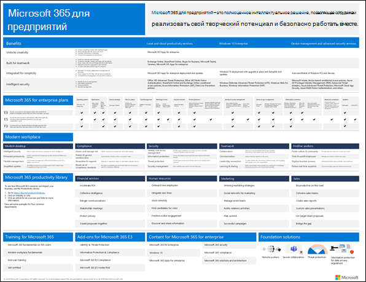

# Обзор Microsoft 365 для предприятий

Microsoft 365 для предприятий — это полноценное интеллектуальное решение, позволяющее сотрудникам реализовать свой творческий потенциал и безопасно работать вместе.

Microsoft 365 для предприятий предназначен для крупных организаций, но его также можно использовать для средних и малых предприятий, которым необходимы самые передовые средства обеспечения безопасности и производительности.

## Компоненты

Microsoft 365 для предприятий включает в себя следующие компоненты:

|Службы|Описание|
|---|---|
|Локальные и облачные приложения и службы для повышения производительности|Включает приложения Microsoft 365 для предприятий, новейшие приложения Office для вашего компьютера и Mac (например, Word, Excel, PowerPoint, Outlook и другие), а также полный набор веб-служб для электронной почты, хранения файлов и совместной работы, собраний и многих других задач.|
|Windows 10 Корпоративная|Соответствует потребностям крупных и средних организаций. Это самая продуктивная и безопасная версия Windows для пользователей. Кроме того, она обеспечивает комплексное управление развертыванием, устройствами и приложениями для ИТ-специалистов.|
|Служба управления устройствами и служба повышенной безопасности|Включает Microsoft Intune — облачную корпоративную службу управления мобильными устройствами, которая помогает сотрудникам эффективно работать и обеспечивает защиту данных организации.|
|||

## Планы

Microsoft 365 для предприятий доступна в трех планах.

|Имя плана|Возможности|
|---|---|
|E3|Получите доступ к основным продуктам и возможностям Microsoft 365 для безопасного повышения производительности труда и внедрения инноваций.|
|E5|Получите доступ к последним продуктам и возможностям Microsoft 365. Сюда входят средства расширенной защиты от угроз, обеспечения безопасности и совместной работы. Этот план включает все возможности E3, а также средства повышенной безопасности, голосовой связи и анализа данных.|
|F3|Специализированные инструменты и ресурсы для связи с сотрудниками без компьютеров, которые помогут им трудиться с максимальной отдачей.|
|||

При наличии Microsoft 365 E3, вы также можете воспользоваться этими надстройками:

- Защита идентификации и защита от угроз
- Защита информации и соответствие требованиям
- [Соответствие требованиям Microsoft 365 E5](https://www.microsoft.com/microsoft-365/business/e5-compliance)
- Внутренние риски в Microsoft 365 E5

Эти надстройки позволяют пользователям Microsoft 365 E3 воспользоваться некоторыми дополнительными возможностями, включенными в Microsoft 365 E5.

Дополнительную информацию см. в разделе [Функции и возможности для каждого плана](https://www.microsoft.com/microsoft-365/compare-all-microsoft-365-plans).

## Общие сведения

[Плакат Microsoft 365 для предприятий](../downloads/Microsoft365Enterprise.pdf) — это основное место для просмотра следующих элементов:

- Преимущества Microsoft 365 для предприятий и сопоставление приложений и служб с их ценностными ориентирами.
- Планы Microsoft 365 для предприятий и включенные в них компоненты.
- Ключевые компоненты современного рабочего места (Майкрософт), которые обеспечивает Microsoft 365 для предприятий.
- [Библиотека ресурсов по производительности Microsoft 365](https://www.microsoft.com/microsoft-365/success/) и репрезентативные сценарии для некоторых распространенных отделов организации.

Вы также можете [скачать копию плаката](https://github.com/MicrosoftDocs/microsoft-365-docs/raw/public/microsoft-365/downloads/Microsoft365Enterprise.pdf).

## Переход всей организации

Чтобы лучше понять, как перевести всю организацию на продукты и службы в Microsoft 365 для предприятий, см. [плакат по переходу](../downloads/transition-org-to-m365.pdf).

Этот двухстраничный плакат позволяет быстро ознакомиться с существующей инфраструктурой. С его помощью вы сможете найти необходимые инструкции и перейти на соответствующий продукт или службу в Microsoft 365 для предприятий. На нем представлены продукты Windows и Office, а также другие элементы инфраструктуры и безопасности, например управление устройствами, удостоверения, защита информации и защита от угроз.

Вы также можете [скачать этот плакат](https://github.com/MicrosoftDocs/microsoft-365-docs/raw/public/microsoft-365/downloads/transition-org-to-m365.pdf) и распечатать его в формате письма, юридического документа или газетном формате (11 х 17).

## Окончание поддержки клиентов и серверов Windows 7 и Office 2010

Поддержка [Windows 7](https://aka.ms/win7upgrade) прекращена **14 января 2020 г.**.

Поддержка следующих продуктов прекращена **13 октября 2020 г.**:

- [Office 2010](https://docs.microsoft.com/DeployOffice/office-2010-end-support-roadmap)
- [Exchange Server 2010](exchange-2010-end-of-support.md)

Поддержка [SharePoint Server 2010](upgrade-from-sharepoint-2010.md)будет прекращена**13 апреля 2021 г.**.

Визуальное представление возможностей обновления, миграции и перехода на облачные решения для этих продуктов см. в [плакате “Прекращение поддержки”](../downloads/Office2010Windows7EndOfSupport.pdf).

Этот одностраничный плакат поможет быстро ознакомиться с различными методами, которые можно использовать, чтобы предотвратить прекращение поддержки клиентских и серверных продуктов Windows 7 и Office 2010, при этом предпочтительные методы и поддержка в Microsoft 365 для предприятий выделены цветом.

Вы также можете [скачать этот плакат](https://github.com/MicrosoftDocs/microsoft-365-docs/raw/public/microsoft-365/downloads/Office2010Windows7EndOfSupport.pdf) и распечатать его в формате письма, юридического документа или газетном формате (11 х 17).

## Планирование и развертывание

Существует три способа планирования и развертывания продуктов, функций и компонентов Microsoft 365 для предприятий:

- Совместно с FastTrack

   С помощью FastTrack, инженеры Майкрософт помогут вам перейти в облако в удобном для вас темпе. См. [FastTrack для Microsoft 365](https://fasttrack.microsoft.com/microsoft365).

- С помощью консультационных служб корпорации Майкрософт или [партнера корпорации Майкрософт](https://partner.microsoft.com/)

   Консультанты могут проанализировать вашу текущую инфраструктуру и помочь в разработке плана внедрения всех служб и программного обеспечения Microsoft 365 для предприятий.

- Самостоятельно

   Начните с [дорожной карты сети](networking-roadmap-microsoft-365.md), чтобы выстроить или проверить существующую инфраструктуру и рабочие нагрузки для повышения производительности.

Пример развертывания Microsoft 365 для предприятий в вымышленной глобальной организации см. в [примере корпорации Contoso](contoso-overview.md).

## Дополнительные продукты Microsoft 365

- [Microsoft 365 бизнес премиум](https://docs.microsoft.com/microsoft-365/business/)

  Используйте решение для малого и среднего бизнеса, в котором объединены первоклассные возможности для повышения производительности труда и совместной работы, а также решения для управления устройствами и защиты бизнес-данных.

- [Microsoft 365 для образования](https://docs.microsoft.com/education)

  Доступное решение для образовательных учреждений, которое позволяет преподавателям раскрывать творческий потенциал, стимулировать совместную работу и обеспечивать простое и безопасное взаимодействие.

- [Microsoft 365 для государственных организаций](https://www.microsoft.com/microsoft-365/government)

  Предоставьте сотрудникам государственного сектора США возможность безопасно работать вместе.

## Обучение работе с Microsoft 365

Чтобы узнать больше о Microsoft 365 и получить сертификацию Microsoft 365, ознакомьтесь со статьей [Сертификация Microsoft 365: основы](https://docs.microsoft.com/learn/paths/m365-fundamentals/).

## См. также

[Страница продукта Microsoft 365 для предприятий](https://www.microsoft.com/microsoft-365/enterprise)
