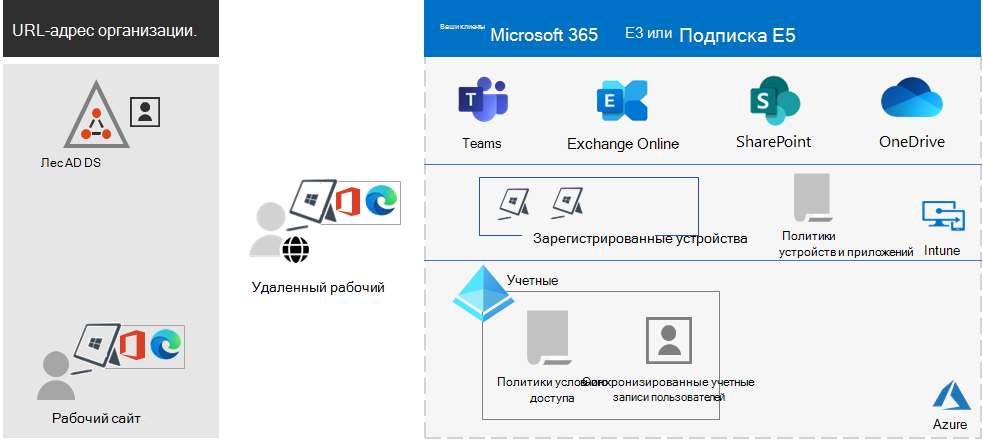
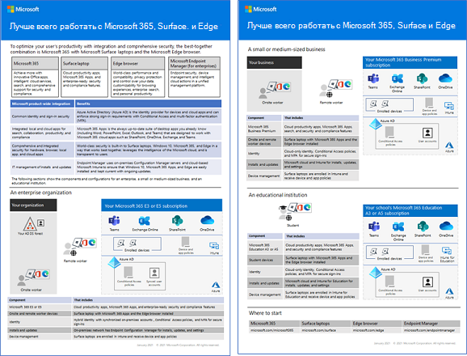

# Обзор Microsoft 365 для предприятийMicrosoft 365 for enterprise overview

Microsoft 365 для предприятий — это полноценное интеллектуальное решение, позволяющее сотрудникам реализовать свой творческий потенциал и безопасно работать вместе.Microsoft 365 for enterprise is a complete, intelligent solution that empowers everyone to be creative and work together securely.

Microsoft 365 для предприятий предназначен для крупных организаций, но его также можно использовать для средних и малых предприятий, которым необходимы самые передовые средства обеспечения безопасности и производительности.Microsoft 365 for enterprise is designed for large organizations, but it can also be used for medium-sized and small businesses that need the most advanced security and productivity capabilities.

## КомпонентыComponents

Microsoft 365 для предприятий включает в себя следующие компоненты:Microsoft 365 for enterprise consists of:

|СлужбыServices|ОписаниеDescription|
|---|---|
|Локальные и облачные приложения и службы для повышения производительностиLocal apps and cloud-based apps and productivity services|Включает приложения Microsoft 365 для предприятий, новейшие приложения Office для вашего компьютера и Mac (например, Word, Excel, PowerPoint, Outlook и другие), а также полный набор веб-служб для электронной почты, хранения файлов и совместной работы, собраний и многих других задач.Includes both Microsoft 365 Apps for enterprise, the latest Office apps for your PC and Mac (such as Word, Excel, PowerPoint, Outlook, and others), and a full suite of online services for email, file storage and collaboration, meetings, and more.|
|Windows 10 КорпоративнаяWindows 10 Enterprise|Соответствует потребностям крупных и средних организаций.Meets the needs of both large and midsize organizations. Это самая продуктивная и безопасная версия Windows для пользователей.It's the most productive and secure version of Windows for users. Кроме того, она обеспечивает комплексное управление развертыванием, устройствами и приложениями для ИТ-специалистов.For IT professionals, it also provides comprehensive deployment, device, and app management.|
|Служба управления устройствами и служба повышенной безопасностиDevice management and advanced security services|Включает Microsoft Intune — облачную корпоративную службу управления мобильными устройствами, которая помогает сотрудникам эффективно работать и обеспечивает защиту данных организации.Includes Microsoft Intune, which is a cloud-based enterprise mobility management service that helps enable your workforce to be productive while protecting your organization data.|
|||

## ПланыPlans

Microsoft 365 для предприятий доступна в трех планах.Microsoft 365 for enterprise is available in three plans.

|Имя планаPlan name|ВозможностиCapabilities|
|---|---|
|E3E3|Получите доступ к основным продуктам и возможностям Microsoft 365 для безопасного повышения производительности труда и внедрения инноваций.Access the Microsoft 365 core products and features to securely enhance workplace productivity and drive innovation.|
|E5E5|Получите доступ к последним продуктам и возможностям Microsoft 365.Access the Microsoft 365 latest products and features. Сюда входят Defender для Office 365, средства обеспечения безопасности и совместной работы.These include Defender for Office 365, security tools, and collaboration tools. Этот план включает все возможности E3, а также средства повышенной безопасности, голосовой связи и анализа данных.This plan includes all E3 capabilities, plus advanced security, voice, and data analysis tools.|
|F3F3|Специализированные инструменты и ресурсы для связи с сотрудниками без компьютеров, которые помогут им трудиться с максимальной отдачей.Connect with your first-line workers through purpose-built tools and resources that they can use to help them do their best work.|
|||

При наличии Microsoft 365 E3, вы также можете воспользоваться этими надстройками:If you have Microsoft 365 E3, you can also get these add-ons:

- Защита идентификации и защита от угрозIdentity & Threat Protection
- Защита информации и соответствие требованиямInformation Protection & Compliance
- [Соответствие требованиям Microsoft 365 E5Microsoft 365 E5 Compliance](https://www.microsoft.com/microsoft-365/business/e5-compliance)
- Внутренние риски в Microsoft 365 E5Microsoft 365 E5 Insider Risk

Эти надстройки позволяют пользователям Microsoft 365 E3 воспользоваться некоторыми дополнительными возможностями, включенными в Microsoft 365 E5.Microsoft 365 E3 users can use these add-ons to take advantage of some of the additional features Microsoft 365 E5 includes.

Дополнительную информацию см. в разделе [Функции и возможности для каждого плана](https://www.microsoft.com/microsoft-365/compare-all-microsoft-365-plans).For more information, see [Features and capabilities for each plan](https://www.microsoft.com/microsoft-365/compare-all-microsoft-365-plans).

## Общие сведенияGet the big picture

[Плакат Microsoft 365 для предприятий](../downloads/Microsoft365Enterprise.pdf) — это основное место для просмотра следующих элементов:The [Microsoft 365 for enterprise poster](../downloads/Microsoft365Enterprise.pdf) is a central location for you to view:

- Преимущества Microsoft 365 для предприятий и сопоставление приложений и служб с их ценностными ориентирами.The benefits of Microsoft 365 for enterprise, and how apps and services map to its value pillars.
- Планы Microsoft 365 для предприятий и включенные в них компоненты.Microsoft 365 for enterprise plans and which components they contain.
- Ключевые компоненты современного рабочего места (Майкрософт), которые обеспечивает Microsoft 365 для предприятий.The key components of the Microsoft modern workplace, which Microsoft 365 for enterprise enables.
- [Библиотека ресурсов по производительности Microsoft 365](https://www.microsoft.com/microsoft-365/success/) и репрезентативные сценарии для некоторых распространенных отделов организации.The [Microsoft 365 Productivity Library](https://www.microsoft.com/microsoft-365/success/) and representative scenarios for some common organization departments.

Вы также можете [скачать копию плаката](https://github.com/MicrosoftDocs/microsoft-365-docs/raw/public/microsoft-365/downloads/Microsoft365Enterprise.pdf).You can also [download a copy of the poster](https://github.com/MicrosoftDocs/microsoft-365-docs/raw/public/microsoft-365/downloads/Microsoft365Enterprise.pdf).

## Переход всей организацииTransition your entire organization

Чтобы лучше понять, как перевести всю организацию на продукты и службы в Microsoft 365 для предприятий, см. [плакат по переходу](https://download.microsoft.com/download/2/c/7/2c7bcc04-aae3-4604-9707-1ffff66b9851/transition-org-to-m365.pdf).To get a better picture about how to move your entire organization to the products and services in Microsoft 365 for enterprise, see the [transition poster](https://download.microsoft.com/download/2/c/7/2c7bcc04-aae3-4604-9707-1ffff66b9851/transition-org-to-m365.pdf).

Этот двухстраничный плакат позволяет быстро ознакомиться с существующей инфраструктурой.This two-page poster is a quick way to inventory your existing infrastructure. С его помощью вы сможете найти необходимые инструкции и перейти на соответствующий продукт или службу в Microsoft 365 для предприятий.It helps you to find guidance and move to the corresponding product or service in Microsoft 365 for enterprise. На нем представлены продукты Windows и Office, а также другие элементы инфраструктуры и безопасности, например управление устройствами, удостоверения, защита информации и защита от угроз.It includes Windows and Office products and other infrastructure and security elements, such as device management, identity, and information and threat protection.

## Окончание поддержки клиентов и серверов Windows 7 и Office 2010End of support for Windows 7 and Office 2010 clients and servers

Поддержка [Windows 7](https://aka.ms/win7upgrade) прекращена **14 января 2020 г.**.[Windows 7](https://aka.ms/win7upgrade) reached end of support on **January 14, 2020**.

Поддержка следующих продуктов прекращена **13 октября 2020 г.**:These products reached end of support on **October 13, 2020**:

- [Office 2010Office 2010](/DeployOffice/office-2010-end-support-roadmap)
- [Exchange Server 2010Exchange Server 2010](exchange-2010-end-of-support.md)

Поддержка [SharePoint Server 2010](upgrade-from-sharepoint-2010.md)будет прекращена **13 апреля 2021 г.**.[SharePoint Server 2010](upgrade-from-sharepoint-2010.md) will reach end of support on **April 13, 2021**.

Визуальное представление возможностей обновления, миграции и перехода на облачные решения для этих продуктов см. в [плакате “Прекращение поддержки”](../downloads/Office2010Windows7EndOfSupport.pdf).For a visual summary of the upgrade, migrate, and move-to-the-cloud options for these products, see the [end of support poster](../downloads/Office2010Windows7EndOfSupport.pdf).

Этот одностраничный плакат поможет быстро ознакомиться с различными методами, которые можно использовать, чтобы предотвратить прекращение поддержки клиентских и серверных продуктов Windows 7 и Office 2010, при этом предпочтительные методы и поддержка в Microsoft 365 для предприятий выделены цветом.This one-page poster is a quick way to understand the various paths you can take to prevent Windows 7 and Office 2010 client and server products from reaching end of support, with preferred paths and support in Microsoft 365 for enterprise highlighted.

Вы также можете [скачать этот плакат](https://github.com/MicrosoftDocs/microsoft-365-docs/raw/public/microsoft-365/downloads/Office2010Windows7EndOfSupport.pdf) и распечатать его в формате письма, юридического документа или газетном формате (11 х 17).You can also [download this poster](https://github.com/MicrosoftDocs/microsoft-365-docs/raw/public/microsoft-365/downloads/Office2010Windows7EndOfSupport.pdf) and print it in letter, legal, or tabloid (11 x 17) formats.

## Планирование и развертываниеPlan for and deploy

Существует три способа планирования и развертывания продуктов, функций и компонентов Microsoft 365 для предприятий:There are three ways to plan for and deploy the products, features, and components of Microsoft 365 for enterprise:

- Совместно с FastTrackIn partnership with FastTrack

   С помощью FastTrack, инженеры Майкрософт помогут вам перейти в облако в удобном для вас темпе.With FastTrack, Microsoft engineers help you move to the cloud at your own pace. См. [FastTrack для Microsoft 365](https://fasttrack.microsoft.com/microsoft365).See [FastTrack for Microsoft 365](https://fasttrack.microsoft.com/microsoft365).

- С помощью консультационных служб корпорации Майкрософт или [партнера корпорации Майкрософт](https://partner.microsoft.com/)With the help of Microsoft Consulting Services or a [Microsoft partner](https://partner.microsoft.com/)

   Консультанты могут проанализировать вашу текущую инфраструктуру и помочь в разработке плана внедрения всех служб и программного обеспечения Microsoft 365 для предприятий.Consultants can analyze your current infrastructure and help you develop a plan to incorporate all the software and services of Microsoft 365 for enterprise.

- СамостоятельноDo it yourself

   Начните с [дорожной карты сети](networking-roadmap-microsoft-365.md), чтобы выстроить или проверить существующую инфраструктуру и рабочие нагрузки для повышения производительности.Start with the [Networking roadmap](networking-roadmap-microsoft-365.md) to build out or verify your existing infrastructure and productivity workloads.

Пример развертывания Microsoft 365 для предприятий в вымышленной глобальной организации см. в [примере корпорации Contoso](contoso-overview.md).For an example of how a fictional but representative multinational organization has deployed Microsoft 365 for enterprise, see the [Contoso Corporation case study](contoso-overview.md).

## Дополнительные продукты Microsoft 365Additional Microsoft 365 products

- [Microsoft 365 бизнес премиумMicrosoft 365 Business Premium](../business/index.yml)

  Используйте решение для малого и среднего бизнеса, в котором объединены первоклассные возможности для повышения производительности труда и совместной работы, а также решения для управления устройствами и защиты бизнес-данных.Bring together the best-in-class productivity and collaboration capabilities with device management and security solutions to safeguard business data for small and midsize businesses.

- [Microsoft 365 для образованияMicrosoft 365 Education](/education)

  Доступное решение для образовательных учреждений, которое позволяет преподавателям раскрывать творческий потенциал, стимулировать совместную работу и обеспечивать простое и безопасное взаимодействие.Empower educators to unlock creativity, promote teamwork, and provide a simple and safe experience in a single, affordable solution built for education.

- [Microsoft 365 для государственных организацийMicrosoft 365 Government](https://www.microsoft.com/microsoft-365/government)

  Предоставьте сотрудникам государственного сектора США возможность безопасно работать вместе.Empower United States public sector employees to work together, securely.

## Surface и браузер Edge лучше всего работают вместеBest together with Surface and the Edge browser

Идеальное сочетание Microsoft 365 для предприятий, Microsoft Surface Devices и браузера Microsoft Edge сделает работу ваших пользователей оптимально безопасной и продуктивной.Optimize your user’s integrated and secure productivity with the best-together combination of Microsoft 365 for enterprise, Microsoft Surface devices, and the Microsoft Edge browser. Эта интеграция между продуктами обеспечивает:This cross-product integration provides:

- единую инфраструктуру удостоверений и безопасности входа;A common identity and sign-in security infrastructure.
- интеграцию локальных и облачных приложений для поиска, взаимодействия, продуктивности и соответствия требованиям;Integrated local and cloud apps for search, collaboration, productivity, and compliance.
- полную и комплексную безопасность оборудования, браузера, локального приложения и облачных приложений;Comprehensive and integrated security for hardware, browser, local app, and cloud apps.
- единую инфраструктуру управления установкой и обновлением ПО.A common infrastructure for IT management of installs and updates.

Ниже приведен пример для крупной организации.Here is an example for an enterprise organization.

Для дополнительных сведений и примеров настройки для малого и среднего бизнеса, а также учебных заведений скачайте [афишу «Лучше всего вместе»](https://download.microsoft.com/download/2/8/d/28db0cf9-2f5a-4f63-91e2-46ff5c4d3baf/microsoft-best-together-poster.pdf).For more information and configuration examples for a small and medium business and an educational institution, download the [Best together poster](https://download.microsoft.com/download/2/8/d/28db0cf9-2f5a-4f63-91e2-46ff5c4d3baf/microsoft-best-together-poster.pdf).

## Обучение работе с Microsoft 365Microsoft 365 training

Чтобы узнать больше о Microsoft 365 и получить сертификацию Microsoft 365, ознакомьтесь со статьей [Сертификация Microsoft 365: основы](/learn/paths/m365-fundamentals/).To learn more about Microsoft 365 and work toward a Microsoft 365 certification, you can start with [Microsoft 365 Certified: Fundamentals](/learn/paths/m365-fundamentals/).

## См. такжеSee also

[Страница продукта Microsoft 365 для предприятийMicrosoft 365 for enterprise product page](https://www.microsoft.com/microsoft-365/enterprise)