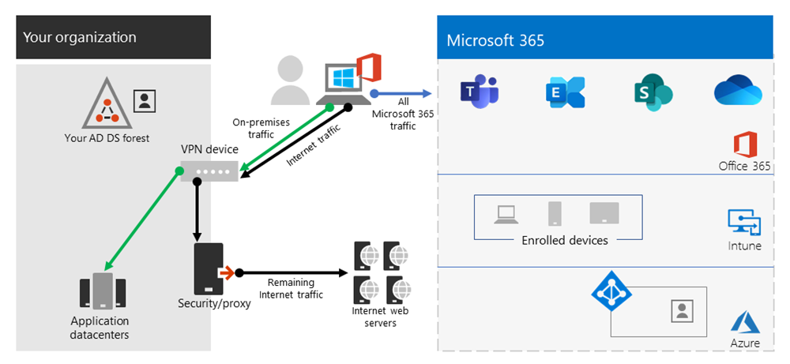

# <a name="implementing-vpn-split-tunneling-for-office-365"></a><span data-ttu-id="52769-103">Внедрение раздельного VPN-туннелирования для Office 365</span><span class="sxs-lookup"><span data-stu-id="52769-103">Implementing VPN split tunneling for Office 365</span></span>

>[!NOTE]
><span data-ttu-id="52769-104">Этот раздел является частью набора тем, посвященных оптимизации Office 365 для удаленных пользователей.</span><span class="sxs-lookup"><span data-stu-id="52769-104">This topic is part of a set of topics that address Office 365 optimization for remote users.</span></span>
>- <span data-ttu-id="52769-105">Обзор использования раздельного VPN-туннелирования для оптимизации подключения Office 365 для удаленных пользователей см. в статье [Обзор: раздельное VPN-туннелирование для Office 365](microsoft-365-vpn-split-tunnel.md).</span><span class="sxs-lookup"><span data-stu-id="52769-105">For an overview of using VPN split tunneling to optimize Office 365 connectivity for remote users, see [Overview: VPN split tunneling for Office 365](microsoft-365-vpn-split-tunnel.md).</span></span>
>- <span data-ttu-id="52769-106">Информацию об оптимизации производительности клиентов Office 365 по всему миру для пользователей в Китае см. в разделе [Оптимизация производительности Office 365 для пользователей из Китая](microsoft-365-networking-china.md).</span><span class="sxs-lookup"><span data-stu-id="52769-106">For information about optimizing Office 365 worldwide tenant performance for users in China, see [Office 365 performance optimization for China users](microsoft-365-networking-china.md).</span></span>

<span data-ttu-id="52769-107">В течение многих лет предприятия использовали VPN для поддержки удаленного взаимодействия для своих пользователей.</span><span class="sxs-lookup"><span data-stu-id="52769-107">For many years enterprises have been using VPNs to support remote experiences for their users.</span></span> <span data-ttu-id="52769-108">Хотя основные рабочие нагрузки оставались локальными, VPN-доступ от удаленного клиента, маршрутизируемый через центр обработки данных в корпоративной сети, был основным способом доступа удаленных пользователей к корпоративным ресурсам.</span><span class="sxs-lookup"><span data-stu-id="52769-108">Whilst core workloads remained on-premises, a VPN from the remote client routed through a datacenter on the corporate network was the primary method for remote users to access corporate resources.</span></span> <span data-ttu-id="52769-109">Чтобы защитить эти соединения, предприятия создают уровни решений сетевой безопасности вдоль путей VPN.</span><span class="sxs-lookup"><span data-stu-id="52769-109">To safeguard these connections, enterprises build layers of network security solutions along the VPN paths.</span></span> <span data-ttu-id="52769-110">Это было сделано для защиты внутренней инфраструктуры, а также для обеспечения мобильного просмотра внешних веб-сайтов путем перенаправления трафика в VPN, а затем через локальный Интернет-периметр.</span><span class="sxs-lookup"><span data-stu-id="52769-110">This was done to protect internal infrastructure as well as to safeguard mobile browsing of external web sites by rerouting traffic into the VPN and then out through the on-premises Internet perimeter.</span></span> <span data-ttu-id="52769-111">Виртуальные частные сети, сети периметра и связанная инфраструктура безопасности часто предназначены для создания и масштабирования определенного объема трафика, обычно с большинством подключений из корпоративной сети, а также в пределах границ внутренней сети.</span><span class="sxs-lookup"><span data-stu-id="52769-111">VPNs, network perimeters, and associated security infrastructure were often purpose built and scaled for a defined volume of traffic, typically with the majority of connectivity being initiated from within the corporate network, and most of it staying within the internal network boundaries.</span></span>

<span data-ttu-id="52769-112">В течение некоторого времени модели VPN, в которых все подключения с удаленного пользовательского устройства перенаправлялись обратно в локальную сеть (известную как **принудительное туннелирование**), были в основном устойчивыми, до тех пор пока количество удаленных пользователей было скромным и объемы трафика, пересекающие VPN, были низкими.</span><span class="sxs-lookup"><span data-stu-id="52769-112">For quite some time, VPN models where all connections from the remote user device are routed back into the on-premises network (known as **forced tunneling**) were largely sustainable as long as the concurrent scale of remote users was modest and the traffic volumes traversing VPN were low.</span></span>  <span data-ttu-id="52769-113">Некоторые клиенты продолжали использовать принудительное VPN-туннелирование в качестве статус-кво даже после того, как их приложения переместились из корпоративного периметра в общедоступные облака SaaS, и Office 365 является ярким примером тому.</span><span class="sxs-lookup"><span data-stu-id="52769-113">Some customers continued to use VPN force tunneling as the status quo even after their applications moved from inside the corporate perimeter to public SaaS clouds, Office 365 being a prime example.</span></span>

<span data-ttu-id="52769-114">Использование VPN с принудительным туннелированием для подключения к распределенным облачным приложениям и приложениям, чувствительным к производительности, является крайне неоптимальным, но некоторые предприятия могут принять это негативное влияние, чтобы сохранить статус-кво с точки зрения безопасности.</span><span class="sxs-lookup"><span data-stu-id="52769-114">The use of forced tunneled VPNs for connecting to distributed and performance sensitive cloud applications is extremely suboptimal, but the negative impact of that may have been accepted by some enterprises so as to maintain the status quo from a security perspective.</span></span> <span data-ttu-id="52769-115">Пример схемы этого сценария можно увидеть ниже:</span><span class="sxs-lookup"><span data-stu-id="52769-115">An example diagram of this scenario can be seen below:</span></span>


<span data-ttu-id="52769-117">Эта проблема нарастала в течение ряда лет, и многие клиенты сообщают о значительном изменении структуры сетевого трафика.</span><span class="sxs-lookup"><span data-stu-id="52769-117">This problem has been growing for a number of years, with many customers reporting a significant shift of network traffic patterns.</span></span> <span data-ttu-id="52769-118">Трафик, который используется для поддержания локальной связи, теперь подключается к внешним облачным конечным точкам.</span><span class="sxs-lookup"><span data-stu-id="52769-118">Traffic that used to stay on premises now connects to external cloud endpoints.</span></span> <span data-ttu-id="52769-119">Многие клиенты Microsoft сообщают, что ранее около 80% их сетевого трафика приходилось на некоторый внутренний источник (обозначенный пунктирной линией на диаграмме выше).</span><span class="sxs-lookup"><span data-stu-id="52769-119">Numerous Microsoft customers report that previously, around 80% of their network traffic was to some internal source (represented by the dotted line in the above diagram).</span></span> <span data-ttu-id="52769-120">В 2020 году это число составляет около 20% или меньше, поскольку они перенесли основные рабочие нагрузки в облако, и эти тенденции не редкость для других предприятий.</span><span class="sxs-lookup"><span data-stu-id="52769-120">In 2020 that number is now around 20% or lower as they have shifted major workloads to the cloud, these trends are not uncommon with other enterprises.</span></span> <span data-ttu-id="52769-121">Со временем, по мере продвижения в облаке, описанная выше модель становится все более обременительной и неустойчивой, не позволяя организации быть гибкой, когда они переходят в облачный первый мир.</span><span class="sxs-lookup"><span data-stu-id="52769-121">Over time, as the cloud journey progresses, the above model becomes increasingly cumbersome and unsustainable, preventing an organization from being agile as they move into a cloud first world.</span></span>

<span data-ttu-id="52769-122">Всемирный кризис, вызванный COVID-19, обострил эту проблему и требует ее быстрого устранения.</span><span class="sxs-lookup"><span data-stu-id="52769-122">The worldwide COVID-19 crisis has escalated this problem to require immediate remediation.</span></span> <span data-ttu-id="52769-123">Необходимость обеспечения безопасности сотрудников вызвала беспрецедентные требования к корпоративным ИТ-специалистам для поддержки производительности на дому в массовом масштабе.</span><span class="sxs-lookup"><span data-stu-id="52769-123">The need to ensure employee safety has generated unprecedented demands on enterprise IT to support work-from-home productivity at a massive scale.</span></span> <span data-ttu-id="52769-124">Microsoft Office 365 хорошо размещается, чтобы помочь клиентам выполнить этот запрос, но высокая одновременная работа из дома приводит к большому объему трафика Office 365, который, при маршрутизации через принудительный туннель VPN и локальной сети, приводит к быстрому повышению и запуску инфраструктуры VPN.</span><span class="sxs-lookup"><span data-stu-id="52769-124">Microsoft Office 365 is well positioned to help customers fulfill that demand, but high concurrency of users working from home generates a large volume of Office 365 traffic which, if routed through forced tunnel VPN and on-premises network perimeters, causes rapid saturation and runs VPN infrastructure out of capacity.</span></span> <span data-ttu-id="52769-125">В этой новой реальности использование VPN для доступа к Office 365 больше не является препятствием, а жесткая стенка, которая не только влияет на Office 365, но и критически важные бизнес-операции, которые по-прежнему должны полагаться на работу сети VPN.</span><span class="sxs-lookup"><span data-stu-id="52769-125">In this new reality, using VPN to access Office 365 is no longer just a performance impediment, but a hard wall that not only impacts Office 365 but critical business operations that still have to rely on the VPN to operate.</span></span>

<span data-ttu-id="52769-126">В течение многих лет Microsoft тесно сотрудничает с заказчиками и отраслью в целом, чтобы предоставлять эффективные современные решения этих проблем в рамках наших собственных услуг и соответствовать лучшим отраслевым практикам.</span><span class="sxs-lookup"><span data-stu-id="52769-126">Microsoft has been working closely with customers and the wider industry for many years to provide effective, modern solutions to these problems from within our own services, and to align with industry best practice.</span></span> <span data-ttu-id="52769-127">[Принципы подключения](https://aka.ms/pnc) для службы Office 365 были разработаны для эффективной работы удаленных пользователей, в то же время позволяя организации поддерживать безопасность и контролировать их подключение.</span><span class="sxs-lookup"><span data-stu-id="52769-127">[Connectivity principles](https://aka.ms/pnc) for the Office 365 service have been designed to work efficiently for remote users whilst still allowing an organization to maintain security and control over their connectivity.</span></span> <span data-ttu-id="52769-128">Эти решения также могут быть реализованы очень быстро при ограниченном объеме работы, но при этом достигают значительного положительного влияния на проблемы, изложенные выше.</span><span class="sxs-lookup"><span data-stu-id="52769-128">These solutions can also be implemented very quickly with limited work yet achieve a significant positive impact on the problems outlined above.</span></span>

<span data-ttu-id="52769-129">Рекомендованная Microsoft стратегия оптимизации подключения удаленных сотрудников направлена на быстрое устранение проблем с помощью традиционного подхода, а также обеспечение высокой производительности за несколько простых шагов.</span><span class="sxs-lookup"><span data-stu-id="52769-129">Microsoft's recommended strategy for optimizing remote worker's connectivity is focused on rapidly alleviating the problems with the traditional approach and also providing high performance with a few simple steps.</span></span> <span data-ttu-id="52769-130">Эти действия позволят настроить устаревший подход к VPN для небольшого количества определенных конечных точек, которые обходят узкие места в VPN-серверах.</span><span class="sxs-lookup"><span data-stu-id="52769-130">These steps adjust the legacy VPN approach for a small number of defined endpoints that bypass bottlenecked VPN servers.</span></span> <span data-ttu-id="52769-131">Эквивалентная или даже превосходная модель безопасности может применяться на разных уровнях, чтобы избавить от необходимости защищать весь трафик на выходе корпоративной сети.</span><span class="sxs-lookup"><span data-stu-id="52769-131">An equivalent or even superior security model can be applied at different layers to remove the need to secure all traffic at the egress of the corporate network.</span></span> <span data-ttu-id="52769-132">В большинстве случаев это может быть эффективно достигнуто в течение нескольких часов, а затем масштабируется для других рабочих нагрузок, если этого требуют требования и время.</span><span class="sxs-lookup"><span data-stu-id="52769-132">In most cases this can be effectively achieved within hours and is then scalable to other workloads as requirements demand and time allows.</span></span>

## <a name="common-vpn-scenarios"></a><span data-ttu-id="52769-133">Общие сценарии VPN</span><span class="sxs-lookup"><span data-stu-id="52769-133">Common VPN scenarios</span></span>

<span data-ttu-id="52769-134">В приведенном ниже списке вы увидите наиболее распространенные сценарии VPN, встречающиеся в корпоративных средах.</span><span class="sxs-lookup"><span data-stu-id="52769-134">In the list below you'll see the most common VPN scenarios seen in enterprise environments.</span></span> <span data-ttu-id="52769-135">Большинство клиентов традиционно используют модель 1 (VPN Forced Tunnel).</span><span class="sxs-lookup"><span data-stu-id="52769-135">Most customers traditionally operate model 1 (VPN Forced Tunnel).</span></span> <span data-ttu-id="52769-136">Этот раздел поможет вам быстро и безопасно переходить на **модель 2**, которая достижима с относительно небольшими усилиями и имеет огромные преимущества для производительности сети и взаимодействия с пользователем.</span><span class="sxs-lookup"><span data-stu-id="52769-136">This section will help you to quickly and securely transition to **model 2**, which is achievable with relatively little effort, and has enormous benefits to network performance and user experience.</span></span>

| <span data-ttu-id="52769-137">**Модель**</span><span class="sxs-lookup"><span data-stu-id="52769-137">**Model**</span></span> | <span data-ttu-id="52769-138">**Описание**</span><span class="sxs-lookup"><span data-stu-id="52769-138">**Description**</span></span> |
| --- | --- |
| [<span data-ttu-id="52769-139">1. VPN Принудительный туннель</span><span class="sxs-lookup"><span data-stu-id="52769-139">1. VPN Forced Tunnel</span></span>](#1-vpn-forced-tunnel) | <span data-ttu-id="52769-140">100% трафика передается в туннель VPN, включая локальные, Интернет и все O365/M365</span><span class="sxs-lookup"><span data-stu-id="52769-140">100% of traffic goes into VPN tunnel, including on-premise, Internet, and all O365/M365</span></span> |
| [<span data-ttu-id="52769-141">2. VPN Forced Tunnel с несколькими исключениями</span><span class="sxs-lookup"><span data-stu-id="52769-141">2. VPN Forced Tunnel with few exceptions</span></span>](#2-vpn-forced-tunnel-with-a-small-number-of-trusted-exceptions) | <span data-ttu-id="52769-142">Туннель VPN используется по умолчанию (точки маршрута по умолчанию - VPN), с несколькими наиболее важными сценариями исключений, которые разрешены для прямого доступа.</span><span class="sxs-lookup"><span data-stu-id="52769-142">VPN tunnel is used by default (default route points to VPN), with few, most important exempt scenarios that are allowed to go direct</span></span> |
| [<span data-ttu-id="52769-143">3. VPN Forced Tunnel с широкими исключениями</span><span class="sxs-lookup"><span data-stu-id="52769-143">3. VPN Forced Tunnel with broad exceptions</span></span>](#3-vpn-forced-tunnel-with-broad-exceptions) | <span data-ttu-id="52769-144">Туннель VPN используется по умолчанию (точки маршрута по умолчанию - VPN), с широкими исключениями, которые разрешены для прямого доступа (например, все Office 365, All Salesforce, All Zoom)</span><span class="sxs-lookup"><span data-stu-id="52769-144">VPN tunnel is used by default (default route points to VPN), with broad exceptions that are allowed to go direct (such as all Office 365, All Salesforce, All Zoom)</span></span> |
| [<span data-ttu-id="52769-145">4. VPN избирательный туннель</span><span class="sxs-lookup"><span data-stu-id="52769-145">4. VPN Selective Tunnel</span></span>](#4-vpn-selective-tunnel) | <span data-ttu-id="52769-146">Туннель VPN используется только для служб на основе корпоративной сети.</span><span class="sxs-lookup"><span data-stu-id="52769-146">VPN tunnel is used only for corpnet-based services.</span></span> <span data-ttu-id="52769-147">Маршрут по умолчанию (Интернет и все Интернет-службы) переходит прямо на экран.</span><span class="sxs-lookup"><span data-stu-id="52769-147">Default route (Internet and all Internet-based services) goes direct.</span></span> |
| [<span data-ttu-id="52769-148">5. Без VPN</span><span class="sxs-lookup"><span data-stu-id="52769-148">5. No VPN</span></span>](#5-no-vpn) | <span data-ttu-id="52769-149">Вариант #2, где вместо устаревшего VPN-подключения все службы в корпоративной сети публикуются с помощью современных подходов к безопасности (таких как Зскалер ЗПА, Azure Active Directory (Azure AD)/МКАС и т. д.).</span><span class="sxs-lookup"><span data-stu-id="52769-149">A variation of #2, where instead of legacy VPN, all corpnet services are published through modern security approaches (like Zscaler ZPA, Azure Active Directory (Azure AD) Proxy/MCAS, etc.)</span></span> |

### <a name="1-vpn-forced-tunnel"></a><span data-ttu-id="52769-150">1. VPN Принудительный туннель</span><span class="sxs-lookup"><span data-stu-id="52769-150">1. VPN Forced Tunnel</span></span>

<span data-ttu-id="52769-151">Это наиболее распространенный стартовый сценарий для большинства корпоративных клиентов.</span><span class="sxs-lookup"><span data-stu-id="52769-151">This is the most common starting scenario for most enterprise customers.</span></span> <span data-ttu-id="52769-152">Используется принудительная виртуальная частная сеть, что означает, что 100% трафика направляется в корпоративную сеть независимо от того факта, что конечная точка находится в корпоративной сети.</span><span class="sxs-lookup"><span data-stu-id="52769-152">A forced VPN is used, which means 100% of traffic is directed into the corporate network regardless of the fact the endpoint resides within the corporate network or not.</span></span> <span data-ttu-id="52769-153">Любой внешний (связанный с Интернетом) трафик, такой как Office 365 или просмотр Интернета, затем прикрепляется обратно из локального оборудования безопасности, такого как прокси.</span><span class="sxs-lookup"><span data-stu-id="52769-153">Any external (Internet) bound traffic such as Office 365 or Internet browsing is then hairpinned back out of the on premises security equipment such as proxies.</span></span> <span data-ttu-id="52769-154">Таким образом, в нынешних условиях, когда почти 100% пользователей работают удаленно, эта модель создает чрезвычайно высокую нагрузку на инфраструктуру VPN и может существенно снизить производительность всего корпоративного трафика и, таким образом, обеспечить эффективную работу предприятия во время кризиса.</span><span class="sxs-lookup"><span data-stu-id="52769-154">In the current climate with nearly 100% of users working remotely, this model therefore puts extremely high load on the VPN infrastructure and is likely to significantly hinder performance of all corporate traffic and thus the enterprise to operate efficiently at a time of crisis.</span></span>


### <a name="2-vpn-forced-tunnel-with-a-small-number-of-trusted-exceptions"></a><span data-ttu-id="52769-156">2. VPN Принудительный туннель с небольшим количеством доверенных исключений</span><span class="sxs-lookup"><span data-stu-id="52769-156">2. VPN Forced Tunnel with a small number of trusted exceptions</span></span>

<span data-ttu-id="52769-157">Эта модель работает значительно эффективнее, так как позволяет работать с небольшим количеством контролируемых и заданных конечных точек, которые имеют очень высокую нагрузку и зависят от задержки, чтобы обойти VPN-туннель, и в этом примере напрямую перейти к службе Office 365.</span><span class="sxs-lookup"><span data-stu-id="52769-157">This model is significantly more efficient for an enterprise to operate under as it allows a small number of controlled and defined endpoints that are very high load and latency sensitive to bypass the VPN tunnel and go direct to the Office 365 service in this example.</span></span> <span data-ttu-id="52769-158">Это значительно повышает производительность для разгрузок служб, а также снижает нагрузку на инфраструктуру VPN, позволяя тем, что для элементов, которые по-прежнему нуждаются в использовании, меньше конфликтов для ресурсов.</span><span class="sxs-lookup"><span data-stu-id="52769-158">This significantly improves the performance for the offloaded services, and also decreases the load on the VPN infrastructure, thus allowing elements that still require it to operate with lower contention for resources.</span></span> <span data-ttu-id="52769-159">Эта модель сосредоточена на том, что в этой статье рассказывается о том, как сделать так, чтобы в ней можно было легко быстро выполнить определенные действия, с множеством положительных результатов.</span><span class="sxs-lookup"><span data-stu-id="52769-159">It is this model that this article concentrates on assisting with the transition to as it allows for simple, defined actions to be taken very quickly with numerous positive outcomes.</span></span>


### <a name="3-vpn-forced-tunnel-with-broad-exceptions"></a><span data-ttu-id="52769-161">3. принудительный туннель VPN с широкими исключениями</span><span class="sxs-lookup"><span data-stu-id="52769-161">3. VPN Forced Tunnel with broad exceptions</span></span>

<span data-ttu-id="52769-162">Третья модель расширяет область каждой модели, а не просто отправляет небольшую группу определенных конечных точек напрямую, но вместо этого отправляет весь трафик напрямую в Доверенные службы, такие как Office 365 и SalesForce.</span><span class="sxs-lookup"><span data-stu-id="52769-162">The third model broadens the scope of model two as rather than just sending a small group of defined endpoints direct, it instead sends all traffic directly to trusted services such Office 365 and SalesForce.</span></span> <span data-ttu-id="52769-163">Это еще больше снижает нагрузку на корпоративную инфраструктуру VPN и повышает производительность определенных услуг.</span><span class="sxs-lookup"><span data-stu-id="52769-163">This further reduces the load on the corporate VPN infrastructure and improves the performance of the services defined.</span></span> <span data-ttu-id="52769-164">Так как эта модель может потребовать больше времени для оценки осуществимости и реализации, вероятно, это шаг, который можно выполнить итеративно позже, после успешного выполнения модели 2.</span><span class="sxs-lookup"><span data-stu-id="52769-164">As this model is likely to take more time to assess the feasibility of and implement, it is likely a step that can be taken iteratively at a later date once model two is successfully in place.</span></span>



### <a name="4-vpn-selective-tunnel"></a><span data-ttu-id="52769-166">4. VPN Выборочный туннель</span><span class="sxs-lookup"><span data-stu-id="52769-166">4. VPN selective Tunnel</span></span>

<span data-ttu-id="52769-167">Эта модель переворачивает третью модель в том смысле, что по VPN-туннелю отправляется только трафик, идентифицированный как имеющий корпоративный IP-адрес, и, таким образом, интернет-путь является маршрутом по умолчанию для всего остального.</span><span class="sxs-lookup"><span data-stu-id="52769-167">This model reverses the third model in that only traffic identified as having a corporate IP address is sent down the VPN tunnel and thus the Internet path is the default route for everything else.</span></span> <span data-ttu-id="52769-168">Эта модель требует, чтобы организация была на пути к [нулевому доверию](https://www.microsoft.com/security/zero-trust?rtc=1) и смогла безопасно реализовать эту модель.</span><span class="sxs-lookup"><span data-stu-id="52769-168">This model requires an organization to be well on the path to [Zero Trust](https://www.microsoft.com/security/zero-trust?rtc=1) in able to safely implement this model.</span></span> <span data-ttu-id="52769-169">Следует отметить, что эта модель или ее разновидность, вероятно, со временем станут необходимыми значениями по умолчанию, поскольку все больше и больше служб уходят из корпоративной сети в облако.</span><span class="sxs-lookup"><span data-stu-id="52769-169">It should be noted that this model or some variation thereof will likely become the necessary default over time as more and more services move away from the corporate network and into the cloud.</span></span> <span data-ttu-id="52769-170">Microsoft использует эту модель внутри организации. Дополнительные сведения о внедрении раздельного VPN-туннелирования Microsoft см. в статье [Запуск по VPN: как Microsoft поддерживает подключение своих удаленных сотрудников](https://www.microsoft.com/itshowcase/blog/running-on-vpn-how-microsoft-is-keeping-its-remote-workforce-connected/?elevate-lv).</span><span class="sxs-lookup"><span data-stu-id="52769-170">Microsoft uses this model internally; you can find more information on Microsoft's implementation of VPN split tunneling at [Running on VPN: How Microsoft is keeping its remote workforce connected](https://www.microsoft.com/itshowcase/blog/running-on-vpn-how-microsoft-is-keeping-its-remote-workforce-connected/?elevate-lv).</span></span>


### <a name="5-no-vpn"></a><span data-ttu-id="52769-172">5. Без VPN</span><span class="sxs-lookup"><span data-stu-id="52769-172">5. No VPN</span></span>

<span data-ttu-id="52769-173">Более сложная версия модели — 2, с помощью которой все внутренние службы публикуются с помощью современного подхода к безопасности или решения СДВАН, например Azure AD proxy, МКАС, Зскалер ЗПА и т. д.</span><span class="sxs-lookup"><span data-stu-id="52769-173">A more advanced version of model number two, whereby any internal services are published through a modern security approach or SDWAN solution such as Azure AD Proxy, MCAS, Zscaler ZPA, etc.</span></span>


## <a name="implement-vpn-split-tunneling"></a><span data-ttu-id="52769-175">Внедрение раздельного VPN-туннелирования</span><span class="sxs-lookup"><span data-stu-id="52769-175">Implement VPN split tunneling</span></span>

<span data-ttu-id="52769-176">В этом разделе вы найдете простые шаги, необходимые для переноса архитектуры вашего VPN-клиента из _принудительного туннеля VPN_ в _принудительный туннель VPN с небольшим количеством доверенных исключений_, [модель #2 VPN-туннеля разделения](#2-vpn-forced-tunnel-with-a-small-number-of-trusted-exceptions), в разделе [Общие сценарии VPN](#common-vpn-scenarios).</span><span class="sxs-lookup"><span data-stu-id="52769-176">In this section, you'll find the simple steps required to migrate your VPN client architecture from a _VPN forced tunnel_ to a _VPN forced tunnel with a small number of trusted exceptions_, [VPN split tunnel model #2](#2-vpn-forced-tunnel-with-a-small-number-of-trusted-exceptions) in the [Common VPN scenarios](#common-vpn-scenarios) section.</span></span>

<span data-ttu-id="52769-177">На приведенной ниже диаграмме показано, как работает рекомендуемое VPN-решение для разделения туннелей</span><span class="sxs-lookup"><span data-stu-id="52769-177">The diagram below illustrates how the recommended VPN split tunnel solution works:</span></span>


### <a name="1-identify-the-endpoints-to-optimize"></a><span data-ttu-id="52769-179">1. Определите конечные точки для оптимизации</span><span class="sxs-lookup"><span data-stu-id="52769-179">1. Identify the endpoints to optimize</span></span>

<span data-ttu-id="52769-180">В разделе [URL-адресов и диапазонов IP-адресов Office 365](urls-and-ip-address-ranges.md) корпорация Майкрософт четко определяет ключевые конечные точки, которые необходимо оптимизировать, и классифицирует их как **Оптимизировать**.</span><span class="sxs-lookup"><span data-stu-id="52769-180">In the [Office 365 URLs and IP address ranges](urls-and-ip-address-ranges.md) topic, Microsoft clearly identifies the key endpoints you need to optimize and categorizes them as **Optimize**.</span></span> <span data-ttu-id="52769-181">В настоящее время существует всего четыре URL-адреса и двадцать подсетей IP, которые необходимо оптимизировать.</span><span class="sxs-lookup"><span data-stu-id="52769-181">There are currently just four URLS and twenty IP subnets that need to be optimized.</span></span> <span data-ttu-id="52769-182">На эту небольшую группу конечных точек приходится около 70% - 80% объема трафика в службу Office 365, включая чувствительные к задержкам конечные точки, например, для Teams СМИ.</span><span class="sxs-lookup"><span data-stu-id="52769-182">This small group of endpoints accounts for around 70% - 80% of the volume of traffic to the Office 365 service including the latency sensitive endpoints such as those for Teams media.</span></span> <span data-ttu-id="52769-183">По сути, это трафик, который необходимо отложить особую осторожность, а также трафик, который будет занимать невероятный нажим для традиционных сетевых путей и VPN-инфраструктуры.</span><span class="sxs-lookup"><span data-stu-id="52769-183">Essentially this is the traffic that we need to take special care of and is also the traffic that will put incredible pressure on traditional network paths and VPN infrastructure.</span></span>

<span data-ttu-id="52769-184">URL в этой категории имеют следующие характеристики:</span><span class="sxs-lookup"><span data-stu-id="52769-184">URLs in this category have the following characteristics:</span></span>

- <span data-ttu-id="52769-185">Находятся ли Microsoft в собственности и управляются конечными точками, размещенными на инфраструктуре Microsoft</span><span class="sxs-lookup"><span data-stu-id="52769-185">Are Microsoft owned and managed endpoints, hosted on Microsoft infrastructure</span></span>
- <span data-ttu-id="52769-186">Есть IP-адреса</span><span class="sxs-lookup"><span data-stu-id="52769-186">Have IPs provided</span></span>
- <span data-ttu-id="52769-187">Низкий уровень изменений и, как ожидается, останется небольшим числом (в настоящее время 20 IP-подсетей)</span><span class="sxs-lookup"><span data-stu-id="52769-187">Low rate of change and are expected to remain small in number (currently 20 IP subnets)</span></span>
- <span data-ttu-id="52769-188">Чувствительны ли пропускная способность и / или задержка</span><span class="sxs-lookup"><span data-stu-id="52769-188">Are bandwidth and/or latency sensitive</span></span>
- <span data-ttu-id="52769-189">Могут иметь необходимые элементы безопасности, предоставляемые в сервисе, а не встроенные в сеть</span><span class="sxs-lookup"><span data-stu-id="52769-189">Are able to have required security elements provided in the service rather than inline on the network</span></span>
- <span data-ttu-id="52769-190">На его долю приходится около 70-80% объема трафика службы Office 365</span><span class="sxs-lookup"><span data-stu-id="52769-190">Account for around 70-80% of the volume of traffic to the Office 365 service</span></span>

<span data-ttu-id="52769-191">Для получения дополнительной информации о конечных точках Office 365 и о том, как они классифицируются и управляются, см. статью [Управление конечными точками Office 365](managing-office-365-endpoints.md).</span><span class="sxs-lookup"><span data-stu-id="52769-191">For more information about Office 365 endpoints and how they are categorized and managed, see the article [Managing Office 365 endpoints](managing-office-365-endpoints.md).</span></span>

#### <a name="optimize-urls"></a><span data-ttu-id="52769-192">Оптимизация URL-адресов</span><span class="sxs-lookup"><span data-stu-id="52769-192">Optimize URLs</span></span>

<span data-ttu-id="52769-193">Текущие URL-адреса оптимизации можно найти в таблице ниже.</span><span class="sxs-lookup"><span data-stu-id="52769-193">The current Optimize URLs can be found in the table below.</span></span> <span data-ttu-id="52769-194">В большинстве случаев необходимо использовать конечные точки URL-адреса только в [файле PAC браузера](managing-office-365-endpoints.md#use-a-pac-file-for-direct-routing-of-vital-office-365-traffic), в котором конечные точки настроены на прямую отправку, а не на прокси-сервер.</span><span class="sxs-lookup"><span data-stu-id="52769-194">Under most circumstances, you should only need to use URL endpoints in a [browser PAC file](managing-office-365-endpoints.md#use-a-pac-file-for-direct-routing-of-vital-office-365-traffic) where the endpoints are configured to be sent direct, rather than to the proxy.</span></span>

| <span data-ttu-id="52769-195">Оптимизация URL-адресов</span><span class="sxs-lookup"><span data-stu-id="52769-195">Optimize URLs</span></span> | <span data-ttu-id="52769-196">Порт/протокол</span><span class="sxs-lookup"><span data-stu-id="52769-196">Port/Protocol</span></span> | <span data-ttu-id="52769-197">Назначение</span><span class="sxs-lookup"><span data-stu-id="52769-197">Purpose</span></span> |
| --- | --- | --- |
| <https://outlook.office365.com> | <span data-ttu-id="52769-198">TCP 443</span><span class="sxs-lookup"><span data-stu-id="52769-198">TCP 443</span></span> | <span data-ttu-id="52769-199">Это один из основных URL-адресов, которые Outlook использует для подключения к своему серверу Exchange Online, и он использует большой объем трафика и количество подключений.</span><span class="sxs-lookup"><span data-stu-id="52769-199">This is one of the primary URLs Outlook uses to connect to its Exchange Online server and has a high volume of bandwidth usage and connection count.</span></span> <span data-ttu-id="52769-200">Низкая задержка в сети требуется для сетевых функций, включая: мгновенный поиск, другие календари почтовых ящиков, поиск занятости / занятости, управление правилами и оповещениями, онлайн-архив Exchange, отправка электронных писем из папки «Исходящие».</span><span class="sxs-lookup"><span data-stu-id="52769-200">Low network latency is required for online features including: instant search, other mailbox calendars, free / busy lookup, manage rules and alerts, Exchange online archive, emails departing the outbox.</span></span> |
| <https://outlook.office.com> | <span data-ttu-id="52769-201">TCP 443</span><span class="sxs-lookup"><span data-stu-id="52769-201">TCP 443</span></span> | <span data-ttu-id="52769-202">Этот URL-адрес используется для Outlook Online Web Access для подключения к серверу Exchange Online и чувствителен к задержке в сети.</span><span class="sxs-lookup"><span data-stu-id="52769-202">This URL is used for Outlook Online Web Access to connect to Exchange Online server, and is sensitive to network latency.</span></span> <span data-ttu-id="52769-203">Связь особенно необходима для загрузки и выгрузки больших файлов с помощью SharePoint Online.</span><span class="sxs-lookup"><span data-stu-id="52769-203">Connectivity is particularly required for large file upload and download with SharePoint Online.</span></span> |
| <span data-ttu-id="52769-204">https:// \<tenant\> . SharePoint.com</span><span class="sxs-lookup"><span data-stu-id="52769-204">https://\<tenant\>.sharepoint.com</span></span> | <span data-ttu-id="52769-205">TCP 443</span><span class="sxs-lookup"><span data-stu-id="52769-205">TCP 443</span></span> | <span data-ttu-id="52769-206">Это основной URL-адрес для SharePoint Online и используется с высокой пропускной способностью.</span><span class="sxs-lookup"><span data-stu-id="52769-206">This is the primary URL for SharePoint Online and has high bandwidth usage.</span></span> |
| <span data-ttu-id="52769-207">https:// \<tenant\> — My.SharePoint.com</span><span class="sxs-lookup"><span data-stu-id="52769-207">https://\<tenant\>-my.sharepoint.com</span></span> | <span data-ttu-id="52769-208">TCP 443</span><span class="sxs-lookup"><span data-stu-id="52769-208">TCP 443</span></span> | <span data-ttu-id="52769-209">Это основной URL-адрес для OneDrive для бизнеса, он имеет высокую пропускную способность и, возможно, большое количество подключений из инструмента OneDrive для бизнеса Sync.</span><span class="sxs-lookup"><span data-stu-id="52769-209">This is the primary URL for OneDrive for Business and has high bandwidth usage and possibly high connection count from the OneDrive for Business Sync tool.</span></span> |
| <span data-ttu-id="52769-210">Команды Media IPs (без URL)</span><span class="sxs-lookup"><span data-stu-id="52769-210">Teams Media IPs (no URL)</span></span> | <span data-ttu-id="52769-211">UDP 3478, 3479, 3480, и 3481</span><span class="sxs-lookup"><span data-stu-id="52769-211">UDP 3478, 3479, 3480, and 3481</span></span> | <span data-ttu-id="52769-212">Распределение для обнаружения ретрансляции и трафик в режиме реального времени (3478), аудио (3479), видео (3480) и общий доступ к экранам видео (3481).</span><span class="sxs-lookup"><span data-stu-id="52769-212">Relay Discovery allocation and real-time traffic (3478), Audio (3479), Video (3480), and Video Screen Sharing (3481).</span></span> <span data-ttu-id="52769-213">Это конечные точки, используемые для трафика в Skype для бизнеса и Microsoft Teams (звонки, собрания и т. д.).</span><span class="sxs-lookup"><span data-stu-id="52769-213">These are the endpoints used for Skype for Business and Microsoft Teams Media traffic (calls, meetings, etc.).</span></span> <span data-ttu-id="52769-214">Большинство конечных точек предоставляются, когда клиент Microsoft Teams устанавливает вызов (и содержатся в IP-адресах, указанных для службы).</span><span class="sxs-lookup"><span data-stu-id="52769-214">Most endpoints are provided when the Microsoft Teams client establishes a call (and are contained within the required IPs listed for the service).</span></span> <span data-ttu-id="52769-215">Использование протокола UDP требуется для оптимального качества медиа.</span><span class="sxs-lookup"><span data-stu-id="52769-215">Use of the UDP protocol is required for optimal media quality.</span></span>   |

<span data-ttu-id="52769-216">В приведенных выше примерах **арендатор** должен быть заменен именем вашего клиента Office 365.</span><span class="sxs-lookup"><span data-stu-id="52769-216">In the above examples, **tenant** should be replaced with your Office 365 tenant name.</span></span> <span data-ttu-id="52769-217">Например, **contoso.onmicrosoft.com** будет использовать _contoso.sharepoint.com_ и _constoso-my.sharepoint.com_.</span><span class="sxs-lookup"><span data-stu-id="52769-217">For example, **contoso.onmicrosoft.com** would use _contoso.sharepoint.com_ and _constoso-my.sharepoint.com_.</span></span>

#### <a name="optimize-ip-address-ranges"></a><span data-ttu-id="52769-218">Оптимизировать диапазоны IP-адресов</span><span class="sxs-lookup"><span data-stu-id="52769-218">Optimize IP address ranges</span></span>

<span data-ttu-id="52769-219">Во время записи диапазонов IP-адресов, соответствующих конечным точкам, будут выглядеть следующим образом.</span><span class="sxs-lookup"><span data-stu-id="52769-219">At the time of writing the IP ranges that these endpoints correspond to are as follows.</span></span> <span data-ttu-id="52769-220">**Настоятельно** рекомендуется использовать [сценарий, такой как этот](https://github.com/microsoft/Office365NetworkTools/tree/master/Scripts/Display%20URL-IPs-Ports%20per%20Category) пример, [веб-службу IP-адресов и URL-адресов Office 365](microsoft-365-ip-web-service.md) или [страницу URL-адресов / IP-адресов](urls-and-ip-address-ranges.md), чтобы проверить наличие обновлений при применении конфигурации, и установить политику для этого на регулярной основе. основа.</span><span class="sxs-lookup"><span data-stu-id="52769-220">It is **very strongly** advised you use a [script such as this](https://github.com/microsoft/Office365NetworkTools/tree/master/Scripts/Display%20URL-IPs-Ports%20per%20Category) example, the [Office 365 IP and URL web service](microsoft-365-ip-web-service.md) or the [URL/IP page](urls-and-ip-address-ranges.md) to check for any updates when applying the configuration, and put a policy in place to do so on a regular basis.</span></span>

```
104.146.128.0/17
13.107.128.0/22
13.107.136.0/22
13.107.18.10/31
13.107.6.152/31
13.107.64.0/18
131.253.33.215/32
132.245.0.0/16
150.171.32.0/22
150.171.40.0/22
191.234.140.0/22
204.79.197.215/32
23.103.160.0/20
40.104.0.0/15
40.108.128.0/17
40.96.0.0/13
52.104.0.0/14
52.112.0.0/14
52.96.0.0/14
52.120.0.0/14
```

### <a name="2-optimize-access-to-these-endpoints-via-the-vpn"></a><span data-ttu-id="52769-221">2. Оптимизируйте доступ к этим конечным точкам через VPN</span><span class="sxs-lookup"><span data-stu-id="52769-221">2. Optimize access to these endpoints via the VPN</span></span>

<span data-ttu-id="52769-222">Теперь, когда мы определили эти критические конечные точки, нам нужно отвести их от VPN-туннеля и позволить им использовать локальное интернет-соединение пользователя для прямого подключения к услуге.</span><span class="sxs-lookup"><span data-stu-id="52769-222">Now that we have identified these critical endpoints, we need to divert them away from the VPN tunnel and allow them to use the user's local Internet connection to connect directly to the service.</span></span> <span data-ttu-id="52769-223">Способ, которым это выполняется, зависит от используемого продукта VPN и платформы компьютера, но большинство решений VPN позволяют применять эту логику в некоторой простой конфигурации политики.</span><span class="sxs-lookup"><span data-stu-id="52769-223">The manner in which this is accomplished will vary depending on the VPN product and machine platform used but most VPN solutions will allow some simple configuration of policy to apply this logic.</span></span> <span data-ttu-id="52769-224">Дополнительные сведения об разделениях связанных туннелей для платформ VPN см. в статье [инструкции по выбору распространенных платформ VPN](#howto-guides-for-common-vpn-platforms).</span><span class="sxs-lookup"><span data-stu-id="52769-224">For information VPN platform-specific split tunnel guidance, see [HOWTO guides for common VPN platforms](#howto-guides-for-common-vpn-platforms).</span></span>

<span data-ttu-id="52769-225">Если вы хотите протестировать решение вручную, вы можете выполнить следующий пример PowerShell, чтобы эмулировать решение на уровне таблицы маршрутов.</span><span class="sxs-lookup"><span data-stu-id="52769-225">If you wish to test the solution manually, you can execute the following PowerShell example to emulate the solution at the route table level.</span></span> <span data-ttu-id="52769-226">В этом примере добавляется маршрут для каждой из подсетей Teams Media IP в таблицу маршрутов.</span><span class="sxs-lookup"><span data-stu-id="52769-226">This example adds a route for each of the Teams Media IP subnets into the route table.</span></span> <span data-ttu-id="52769-227">Вы можете протестировать производительность мультимедии Teams до и после и наблюдать разницу в маршрутах для указанных конечных точек.</span><span class="sxs-lookup"><span data-stu-id="52769-227">You can test Teams media performance before and after, and observe the difference in routes for the specified endpoints.</span></span>

#### <a name="example-add-teams-media-ip-subnets-into-the-route-table"></a><span data-ttu-id="52769-228">Пример: добавление IP-подсетей Teams Media в таблицу маршрутов</span><span class="sxs-lookup"><span data-stu-id="52769-228">Example: Add Teams Media IP subnets into the route table</span></span>

```powershell
$intIndex = "" # index of the interface connected to the internet
$gateway = "" # default gateway of that interface
$destPrefix = "52.120.0.0/14", "52.112.0.0/14", "13.107.64.0/18" # Teams Media endpoints
# Add routes to the route table
foreach ($prefix in $destPrefix) {New-NetRoute -DestinationPrefix $prefix -InterfaceIndex $intIndex -NextHop $gateway}
```

<span data-ttu-id="52769-229">В приведенном выше сценарии _$intIndex_ - это индекс интерфейса, подключенного к Интернету (найдите, запустив **get-netadapter** в PowerShell; найдите значение _ifIndex_), а _$gateway_ - это шлюз по умолчанию для этого интерфейса (найдите, запустив **ipconfig** в командную строку или **(Get-NetIPConfiguration | Foreach IPv4DefaultGateway) .NextHop** в PowerShell).</span><span class="sxs-lookup"><span data-stu-id="52769-229">In the above script, _$intIndex_ is the index of the interface connected to the internet (find by running **get-netadapter** in PowerShell; look for the value of _ifIndex_) and _$gateway_ is the default gateway of that interface (find by running **ipconfig** in a command prompt or **(Get-NetIPConfiguration | Foreach IPv4DefaultGateway).NextHop** in PowerShell).</span></span>

<span data-ttu-id="52769-230">После добавления маршрутов вы можете подтвердить правильность таблицы маршрутов, запустив **печать маршрута** в командной строке или PowerShell.</span><span class="sxs-lookup"><span data-stu-id="52769-230">Once you have added the routes, you can confirm that the route table is correct by running **route print** in a command prompt or PowerShell.</span></span> <span data-ttu-id="52769-231">Вывод должен содержать маршруты, которые вы добавили, показывая индекс интерфейса (_22_ в этом примере) и шлюз для этого интерфейса (_192.168.1.1_ в этом примере):</span><span class="sxs-lookup"><span data-stu-id="52769-231">The output should contain the routes you added, showing the interface index (_22_ in this example) and the gateway for that interface (_192.168.1.1_ in this example):</span></span>


<span data-ttu-id="52769-233">Чтобы добавить маршруты для **всех** текущих диапазонов IP-адресов в категории «Оптимизировать», можно использовать следующий вариант сценария, чтобы запросить [веб-службу IP-адресов и URL-адресов Office 365](microsoft-365-ip-web-service.md) для текущего набора подсетей «Оптимизировать IP» и добавить их в таблицу маршрутов.</span><span class="sxs-lookup"><span data-stu-id="52769-233">To add routes for **all** current IP address ranges in the Optimize category, you can use the following script variation to query the [Office 365 IP and URL web service](microsoft-365-ip-web-service.md) for the current set of Optimize IP subnets and add them to the route table.</span></span>

#### <a name="example-add-all-optimize-subnets-into-the-route-table"></a><span data-ttu-id="52769-234">Пример: добавление всех подсетей оптимизации в таблицу маршрутов</span><span class="sxs-lookup"><span data-stu-id="52769-234">Example: Add all Optimize subnets into the route table</span></span>

```powershell
$intIndex = "" # index of the interface connected to the internet
$gateway = "" # default gateway of that interface
# Query the web service for IPs in the Optimize category
$ep = Invoke-RestMethod ("https://endpoints.office.com/endpoints/worldwide?clientrequestid=" + ([GUID]::NewGuid()).Guid)
# Output only IPv4 Optimize IPs to $optimizeIps
$destPrefix = $ep | where {$_.category -eq "Optimize"} | Select-Object -ExpandProperty ips | Where-Object { $_ -like '*.*' }
# Add routes to the route table
foreach ($prefix in $destPrefix) {New-NetRoute -DestinationPrefix $prefix -InterfaceIndex $intIndex -NextHop $gateway}
```

<span data-ttu-id="52769-235">Если вы случайно добавили маршруты с неверными параметрами или просто хотите отменить изменения, вы можете удалить только что добавленные маршруты с помощью следующей команды:</span><span class="sxs-lookup"><span data-stu-id="52769-235">If you inadvertently added routes with incorrect parameters or simply wish to revert your changes, you can remove the routes you just added with the following command:</span></span>

```powershell
foreach ($prefix in $destPrefix) {Remove-NetRoute -DestinationPrefix $prefix -InterfaceIndex $intIndex -NextHop $gateway}
```

<!--- remmed until we add more reliable interface selection logic
#### Example script to add Teams Media subnets to the route table

```powershell
$adapter = get-netadapter | ? {$_.Status -eq "Up"}
$adapterIndex = $adapter.ifIndex
$gateway = (Get-NetIPConfiguration | Foreach IPv4DefaultGateway).NextHop

$destPrefix = "52.120.0.0/14", "52.112.0.0/14", "13.107.64.0/18"
foreach ($prefix in $destPrefix) {New-NetRoute -DestinationPrefix $prefix -InterfaceIndex $intIndex -NextHop $gateway}
```
-->

<span data-ttu-id="52769-236">Клиент VPN должен быть настроен таким образом, чтобы трафик на IP-адреса **Оптимизация** направлялся таким образом.</span><span class="sxs-lookup"><span data-stu-id="52769-236">The VPN client should be configured so that traffic to the **Optimize** IPs are routed in this way.</span></span> <span data-ttu-id="52769-237">Это позволяет трафику использовать локальные ресурсы Майкрософт, например, переднюю дверцу службы Office 365, [например, переднюю дверцу Azure](https://azure.microsoft.com/blog/azure-front-door-service-is-now-generally-available/) , которая доставлять службы Office 365 и конечные точки подключения как можно ближе к пользователям.</span><span class="sxs-lookup"><span data-stu-id="52769-237">This allows the traffic to utilize local Microsoft resources such as Office 365 Service Front Doors [such as the Azure Front Door](https://azure.microsoft.com/blog/azure-front-door-service-is-now-generally-available/) that deliver Office 365 services and connectivity endpoints as close to your users as possible.</span></span> <span data-ttu-id="52769-238">Это позволяет нам предоставлять пользователям чрезвычайно высокий уровень производительности, где бы они ни находились, и в полной мере использовать преимущества [глобальной сети Microsoft мирового класса](https://azure.microsoft.com/blog/how-microsoft-builds-its-fast-and-reliable-global-network/), которая, скорее всего, займет всего несколько миллисекунд от прямого выхода ваших пользователей.</span><span class="sxs-lookup"><span data-stu-id="52769-238">This allows us to deliver extremely high performance levels to users wherever they are in the world and takes full advantage of [Microsoft's world class global network](https://azure.microsoft.com/blog/how-microsoft-builds-its-fast-and-reliable-global-network/), which is very likely within a small number of milliseconds of your users' direct egress.</span></span>

## <a name="configuring-and-securing-teams-media-traffic"></a><span data-ttu-id="52769-239">Конфигурирование и защита Teams медиа-трафика</span><span class="sxs-lookup"><span data-stu-id="52769-239">Configuring and securing Teams media traffic</span></span>

<span data-ttu-id="52769-240">Некоторым администраторам может потребоваться более подробная информация о том, как потоки звонков работают в Teams при использовании модели раздельного туннелирования и как защищены подключения.</span><span class="sxs-lookup"><span data-stu-id="52769-240">Some administrators may require more detailed information on how call flows operate in Teams using a split tunneling model and how connections are secured.</span></span>

### <a name="configuration"></a><span data-ttu-id="52769-241">Настройка</span><span class="sxs-lookup"><span data-stu-id="52769-241">Configuration</span></span>

<span data-ttu-id="52769-242">Для вызовов и собраний при условии, что необходимые оптимизации IP-подсетей для Teams для Teams правильно размещены в таблице маршрутизации, когда Teams вызывает функцию [жетбестрауте](https://docs.microsoft.com/windows/win32/api/iphlpapi/nf-iphlpapi-getbestroute) , чтобы определить, какой локальный интерфейс соответствует маршруту, который он должен использовать для определенного назначения, локальный интерфейс будет возвращен для мест назначения Майкрософт в указанных выше блоках Microsoft IP.</span><span class="sxs-lookup"><span data-stu-id="52769-242">For both calls and meetings, as long as the required Optimize IP subnets for Teams media are correctly in place in the route table, when Teams calls the [GetBestRoute](https://docs.microsoft.com/windows/win32/api/iphlpapi/nf-iphlpapi-getbestroute) function to determine which local interface corresponds to the route it should use for a particular destination, the local interface will be returned for Microsoft destinations in the Microsoft IP blocks listed above.</span></span>

<span data-ttu-id="52769-243">Некоторое программное обеспечение VPN-клиента позволяет управлять маршрутизацией на основе URL.</span><span class="sxs-lookup"><span data-stu-id="52769-243">Some VPN client software allows routing manipulation based on URL.</span></span> <span data-ttu-id="52769-244">Однако медиа-трафик команд не имеет URL-адреса, связанного с ним, поэтому управление маршрутизацией для этого трафика должно осуществляться с использованием IP-подсетей.</span><span class="sxs-lookup"><span data-stu-id="52769-244">However, Teams media traffic has no URL associated with it, so control of routing for this traffic must be done using IP subnets.</span></span>

<span data-ttu-id="52769-245">В определенных сценариях, которые часто не связаны с конфигурацией клиента команд, трафик мультимедиа по-прежнему проходит через VPN-туннель даже при наличии правильных маршрутов.</span><span class="sxs-lookup"><span data-stu-id="52769-245">In certain scenarios, often unrelated to Teams client configuration, media traffic still traverses the VPN tunnel even with the correct routes in place.</span></span> <span data-ttu-id="52769-246">Если вы сталкиваетесь с этим сценарием, тогда достаточно использовать правило брандмауэра для блокировки IP-подсетей или портов Команд с использованием VPN.</span><span class="sxs-lookup"><span data-stu-id="52769-246">If you encounter this scenario then using a firewall rule to block the Teams IP subnets or ports from using the VPN should suffice.</span></span>

>[!IMPORTANT]
><span data-ttu-id="52769-247">Чтобы убедиться, что трафик Teams в Teams направляется через нужный метод во всех сценариях VPN, убедитесь, что пользователи работают под управлением Microsoft Teams версии **1.3.00.13565** или более поздней.</span><span class="sxs-lookup"><span data-stu-id="52769-247">To ensure Teams media traffic is routed via the desired method in all VPN scenarios, please ensure users are running Microsoft Teams client version **1.3.00.13565** or greater.</span></span> <span data-ttu-id="52769-248">Эта версия включает усовершенствования обнаружения доступных сетевых путей клиентом.</span><span class="sxs-lookup"><span data-stu-id="52769-248">This version includes improvements in how the client detects available network paths.</span></span>

<span data-ttu-id="52769-249">Передача сигналов выполняется по протоколу HTTPS и не так зависят от задержки, как на трафик мультимедиа и помечается как **разрешенный** в URL-адресе/IP-адресе, поэтому при необходимости может быть безопасно маршрутизироваться через VPN-клиент.</span><span class="sxs-lookup"><span data-stu-id="52769-249">Signaling traffic is performed over HTTPS and is not as latency sensitive as the media traffic and is marked as **Allow** in the URL/IP data and thus can safely be routed through the VPN client if desired.</span></span>

### <a name="security"></a><span data-ttu-id="52769-250">Безопасность</span><span class="sxs-lookup"><span data-stu-id="52769-250">Security</span></span>

<span data-ttu-id="52769-251">Одним из распространенных аргументов для избежания разделения туннелей является то, что это менее безопасно, т. Е.</span><span class="sxs-lookup"><span data-stu-id="52769-251">One common argument for avoiding split tunnels is that it is less secure to do so, i.e</span></span> <span data-ttu-id="52769-252">Любой трафик, который не проходит через VPN-туннель, не выиграет от какой-либо схемы шифрования, применяемой к VPN-туннелю, и поэтому является менее безопасным.</span><span class="sxs-lookup"><span data-stu-id="52769-252">any traffic that does not go through the VPN tunnel will not benefit from whatever encryption scheme is applied to the VPN tunnel, and is therefore less secure.</span></span>

<span data-ttu-id="52769-253">Основным контраргументом этого является то, что медиа-трафик уже зашифрован с помощью _безопасного транспортного протокола реального времени (SRTP)_, профиля транспортного протокола реального времени (RTP), который обеспечивает конфиденциальность, аутентификацию и защиту от атак повторного воспроизведения для трафика RTP.</span><span class="sxs-lookup"><span data-stu-id="52769-253">The main counter-argument to this is that media traffic is already encrypted via _Secure Real-Time Transport Protocol (SRTP)_, a profile of Real-Time Transport Protocol (RTP) that provides confidentiality, authentication, and replay attack protection to RTP traffic.</span></span> <span data-ttu-id="52769-254">Сам SRTP использует случайно сгенерированный сеансовый ключ, которым обмениваются через защищенный канал сигнализации TLS.</span><span class="sxs-lookup"><span data-stu-id="52769-254">SRTP itself relies on a randomly generated session key, which is exchanged via the TLS secured signaling channel.</span></span> <span data-ttu-id="52769-255">Это подробно описано в [этом руководстве по безопасности](https://docs.microsoft.com/skypeforbusiness/optimizing-your-network/security-guide-for-skype-for-business-online), но основной раздел, представляющий интерес, - это шифрование мультимедиа.</span><span class="sxs-lookup"><span data-stu-id="52769-255">This is covered in great detail within [this security guide](https://docs.microsoft.com/skypeforbusiness/optimizing-your-network/security-guide-for-skype-for-business-online), but the primary section of interest is media encryption.</span></span>

<span data-ttu-id="52769-256">Медиа-трафик шифруется с использованием SRTP, который использует сеансовый ключ, генерируемый безопасным генератором случайных чисел и обменивающийся с использованием канала TLS сигнализации.</span><span class="sxs-lookup"><span data-stu-id="52769-256">Media traffic is encrypted using SRTP, which uses a session key generated by a secure random number generator and exchanged using the signaling TLS channel.</span></span> <span data-ttu-id="52769-257">Кроме того, носитель, проходящий в обоих направлениях между сервером-посредником и его внутренним следующим участком, также шифруется с использованием SRTP.</span><span class="sxs-lookup"><span data-stu-id="52769-257">In addition, media flowing in both directions between the Mediation Server and its internal next hop is also encrypted using SRTP.</span></span>

<span data-ttu-id="52769-258">Skype для бизнеса Online генерирует имя пользователя / пароли для безопасного доступа к медиа-ретрансляторам через _обход через ретрансляторы NAT (TURN)_.</span><span class="sxs-lookup"><span data-stu-id="52769-258">Skype for Business Online generates username/passwords for secure access to media relays over _Traversal Using Relays around NAT (TURN)_.</span></span> <span data-ttu-id="52769-259">Мультимедийное реле обмениваются именем пользователя/паролем через SIP-канал с поддержкой TLS.</span><span class="sxs-lookup"><span data-stu-id="52769-259">Media relays exchange the username/password over a TLS-secured SIP channel.</span></span> <span data-ttu-id="52769-260">Стоит отметить, что хотя VPN-туннель может использоваться для подключения клиента к корпоративной сети, трафик все еще должен проходить в форме SRTP, когда он покидает корпоративную сеть для доступа к услуге.</span><span class="sxs-lookup"><span data-stu-id="52769-260">It is worth noting that even though a VPN tunnel may be used to connect the client to the corporate network, the traffic still needs to flow in its SRTP form when it leaves the corporate network to reach the service.</span></span>

<span data-ttu-id="52769-261">Информацию о том, как Команды смягчают общие проблемы безопасности, такие как голосовые утилиты или _утилиты обхода сеанса для усиленных атак NAT (STUN)_, можно [найти в этой статье](https://docs.microsoft.com/openspecs/office_protocols/ms-ice2/69525351-8c68-4864-b8a6-04bfbc87785c).</span><span class="sxs-lookup"><span data-stu-id="52769-261">Information on how Teams mitigates common security concerns such as voice or _Session Traversal Utilities for NAT (STUN)_ amplification attacks can be [found in this article](https://docs.microsoft.com/openspecs/office_protocols/ms-ice2/69525351-8c68-4864-b8a6-04bfbc87785c).</span></span>

<span data-ttu-id="52769-262">Вы также можете прочитать о современных средствах управления безопасностью в сценариях удаленной работы в разделе [Альтернативные способы для специалистов по безопасности и ИТ для достижения современных средств управления безопасностью в сегодняшних уникальных сценариях удаленной работы (блог Microsoft Security Team)](https://www.microsoft.com/security/blog/2020/03/26/alternative-security-professionals-it-achieve-modern-security-controls-todays-unique-remote-work-scenarios/).</span><span class="sxs-lookup"><span data-stu-id="52769-262">You can also read about modern security controls in remote work scenarios at [Alternative ways for security professionals and IT to achieve modern security controls in today's unique remote work scenarios (Microsoft Security Team blog)](https://www.microsoft.com/security/blog/2020/03/26/alternative-security-professionals-it-achieve-modern-security-controls-todays-unique-remote-work-scenarios/).</span></span>

## <a name="testing"></a><span data-ttu-id="52769-263">Тестирование</span><span class="sxs-lookup"><span data-stu-id="52769-263">Testing</span></span>

<span data-ttu-id="52769-264">После того, как политика введена в действие, вы должны подтвердить, что она работает как положено.</span><span class="sxs-lookup"><span data-stu-id="52769-264">Once the policy is in place, you should confirm it is working as expected.</span></span> <span data-ttu-id="52769-265">Существует несколько способов проверки правильности установки пути для использования локального подключения к Интернету:</span><span class="sxs-lookup"><span data-stu-id="52769-265">There are multiple ways of testing the path is correctly set to use the local Internet connection:</span></span>

- <span data-ttu-id="52769-266">Запустите [Тест подключения Microsoft 365](https://aka.ms/netonboard) , который будет выполнять тесты подключения для включения маршрутов трассировки, как показано выше.</span><span class="sxs-lookup"><span data-stu-id="52769-266">Run the [Microsoft 365 connectivity test](https://aka.ms/netonboard) that will run connectivity tests for you including trace routes as above.</span></span> <span data-ttu-id="52769-267">Мы также добавим в этот инструмент тесты VPN, которые также должны предоставлять дополнительные сведения.</span><span class="sxs-lookup"><span data-stu-id="52769-267">We're also adding in VPN tests into this tooling that should also provide additional insights.</span></span>

- <span data-ttu-id="52769-268">Простой tracert к конечной точке в пределах области разделенного туннеля должен показать выбранный путь, например:</span><span class="sxs-lookup"><span data-stu-id="52769-268">A simple tracert to an endpoint within scope of the split tunnel should show the path taken, for example:</span></span>

  ```powershell
  tracert worldaz.tr.teams.microsoft.com
  ```

  <span data-ttu-id="52769-269">После этого необходимо просмотреть путь с помощью локального поставщика услуг Интернета к этой конечной точке, которая должна разрешаться в IP-адресах в диапазонах Teams, настроенных для расщепления туннелирования.</span><span class="sxs-lookup"><span data-stu-id="52769-269">You should then see a path via the local ISP to this endpoint that should resolve to an IP in the Teams ranges we have configured for split tunneling.</span></span>

- <span data-ttu-id="52769-270">Сделайте захват сети с помощью такого инструмента, как Wireshark.</span><span class="sxs-lookup"><span data-stu-id="52769-270">Take a network capture using a tool such as Wireshark.</span></span> <span data-ttu-id="52769-271">Отфильтруйте по UDP во время вызова, и вы увидите трафик, идущий на IP, в диапазоне **Оптимизации** Teams.</span><span class="sxs-lookup"><span data-stu-id="52769-271">Filter on UDP during a call and you should see traffic flowing to an IP in the Teams **Optimize** range.</span></span> <span data-ttu-id="52769-272">Если VPN-туннель используется для этого трафика, медиа-трафик не будет виден в трассировке.</span><span class="sxs-lookup"><span data-stu-id="52769-272">If the VPN tunnel is being used for this traffic, then the media traffic will not be visible in the trace.</span></span>

### <a name="additional-support-logs"></a><span data-ttu-id="52769-273">Дополнительные журналы поддержки</span><span class="sxs-lookup"><span data-stu-id="52769-273">Additional support logs</span></span>

<span data-ttu-id="52769-274">Если вам нужны дополнительные данные для устранения неполадок или вы запрашиваете помощь от службы поддержки Microsoft, получение следующей информации должно помочь вам ускорить поиск решения.</span><span class="sxs-lookup"><span data-stu-id="52769-274">If you need further data to troubleshoot, or are requesting assistance from Microsoft support, obtaining the following information should allow you to expedite finding a solution.</span></span> <span data-ttu-id="52769-275">**Универсальный набор средств устранения неполадок на основе Windows Тсс** для службы поддержки Microsoft Windows cmd поможет вам легко собрать нужные журналы.</span><span class="sxs-lookup"><span data-stu-id="52769-275">Microsoft support's **TSS Windows CMD-based universal TroubleShooting Script toolset** can help you to collect the relevant logs in a simple manner.</span></span> <span data-ttu-id="52769-276">Инструмент и инструкции по применению можно найти по адресу <https://aka.ms/TssTools.></span><span class="sxs-lookup"><span data-stu-id="52769-276">The tool and instructions on use can be found at <https://aka.ms/TssTools.></span></span>

## <a name="howto-guides-for-common-vpn-platforms"></a><span data-ttu-id="52769-277">Рекомендации по выбору распространенных платформ VPN</span><span class="sxs-lookup"><span data-stu-id="52769-277">HOWTO guides for common VPN platforms</span></span>

<span data-ttu-id="52769-278">В этом разделе приведены ссылки на подробные руководства по внедрению раздельного туннелирования для трафика Office 365 от самых распространенных партнеров в этом пространстве.</span><span class="sxs-lookup"><span data-stu-id="52769-278">This section provides links to detailed guides for implementing split tunneling for Office 365 traffic from the most common partners in this space.</span></span> <span data-ttu-id="52769-279">Мы добавим дополнительные руководства по мере их появления.</span><span class="sxs-lookup"><span data-stu-id="52769-279">We'll add additional guides as they become available.</span></span>

- <span data-ttu-id="52769-280">**VPN-клиент Windows 10**: [оптимизация трафика Office 365 для удаленных сотрудников с помощью собственного VPN-клиента Windows 10](https://docs.microsoft.com/windows/security/identity-protection/vpn/vpn-office-365-optimization)</span><span class="sxs-lookup"><span data-stu-id="52769-280">**Windows 10 VPN client**: [Optimizing Office 365 traffic for remote workers with the native Windows 10 VPN client](https://docs.microsoft.com/windows/security/identity-protection/vpn/vpn-office-365-optimization)</span></span>
- <span data-ttu-id="52769-281">**Cisco Anyconnect**: [оптимизируйте разделительный туннель Anyconnect для Office365](https://www.cisco.com/c/en/us/support/docs/security/anyconnect-secure-mobility-client/215343-optimize-anyconnect-split-tunnel-for-off.html)</span><span class="sxs-lookup"><span data-stu-id="52769-281">**Cisco Anyconnect**: [Optimize Anyconnect Split Tunnel for Office365](https://www.cisco.com/c/en/us/support/docs/security/anyconnect-secure-mobility-client/215343-optimize-anyconnect-split-tunnel-for-off.html)</span></span>
- <span data-ttu-id="52769-282">**Palo Alto GlobalProtect**: [оптимизация трафика Office 365 через разделенные туннели VPN с исключением маршрутов доступа](https://live.paloaltonetworks.com/t5/Prisma-Access-Articles/GlobalProtect-Optimizing-Office-365-Traffic/ta-p/319669)</span><span class="sxs-lookup"><span data-stu-id="52769-282">**Palo Alto GlobalProtect**: [Optimizing Office 365 Traffic via VPN Split Tunnel Exclude Access Route](https://live.paloaltonetworks.com/t5/Prisma-Access-Articles/GlobalProtect-Optimizing-Office-365-Traffic/ta-p/319669)</span></span>
- <span data-ttu-id="52769-283">**F5 Networks BIG-IP APM**: [оптимизация трафика Office 365 при удаленном доступе через VPN при использовании BIG-IP APM](https://devcentral.f5.com/s/articles/SSL-VPN-Split-Tunneling-and-Office-365)</span><span class="sxs-lookup"><span data-stu-id="52769-283">**F5 Networks BIG-IP APM**: [Optimizing Office 365 traffic on Remote Access through VPNs when using BIG-IP APM](https://devcentral.f5.com/s/articles/SSL-VPN-Split-Tunneling-and-Office-365)</span></span>
- <span data-ttu-id="52769-284">**Citrix Gateway**: [оптимизация раздельного VPN-туннелирования Citrix Gateway для Office365](https://docs.citrix.com/en-us/citrix-gateway/13/optimizing-citrix-gateway-vpn-split-tunnel-for-office365.html)</span><span class="sxs-lookup"><span data-stu-id="52769-284">**Citrix Gateway**: [Optimizing Citrix Gateway VPN split tunnel for Office365](https://docs.citrix.com/en-us/citrix-gateway/13/optimizing-citrix-gateway-vpn-split-tunnel-for-office365.html)</span></span>
- <span data-ttu-id="52769-285">**Pulse Secure**: [VPN-туннелирование: как настроить раздельное туннелирование для исключения приложений Office365](https://kb.pulsesecure.net/articles/Pulse_Secure_Article/KB44417)</span><span class="sxs-lookup"><span data-stu-id="52769-285">**Pulse Secure**: [VPN Tunneling: How to configure split tunneling to exclude Office365 applications](https://kb.pulsesecure.net/articles/Pulse_Secure_Article/KB44417)</span></span>
- <span data-ttu-id="52769-286">**VPN-Виртуальная точка проверки**: [Настройка Расщепленного туннеля для Office 365 и других приложений SaaS](https://supportcenter.checkpoint.com/supportcenter/portal?eventSubmit_doGoviewsolutiondetails=&solutionid=sk167000)</span><span class="sxs-lookup"><span data-stu-id="52769-286">**Check Point VPN**: [How to configure Split Tunnel for Office 365 and other SaaS Applications](https://supportcenter.checkpoint.com/supportcenter/portal?eventSubmit_doGoviewsolutiondetails=&solutionid=sk167000)</span></span>

## <a name="faq"></a><span data-ttu-id="52769-287">Вопросы и ответы</span><span class="sxs-lookup"><span data-stu-id="52769-287">FAQ</span></span>

<span data-ttu-id="52769-288">Группа безопасности Майкрософт опубликовала [статью](https://www.microsoft.com/security/blog/2020/03/26/alternative-security-professionals-it-achieve-modern-security-controls-todays-unique-remote-work-scenarios/) , в которой описываются ключевые способы для специалистов по безопасности, и она может обеспечить современные элементы управления безопасностью в сегодняшних уникальных сценариях удаленной работы.</span><span class="sxs-lookup"><span data-stu-id="52769-288">The Microsoft Security Team has published [an article](https://www.microsoft.com/security/blog/2020/03/26/alternative-security-professionals-it-achieve-modern-security-controls-todays-unique-remote-work-scenarios/) that outlines key ways for security professionals and IT can achieve modern security controls in today's unique remote work scenarios.</span></span> <span data-ttu-id="52769-289">Кроме того, ниже приведены некоторые распространенные вопросы и ответы клиентов по этому вопросу.</span><span class="sxs-lookup"><span data-stu-id="52769-289">In addition, below are some of the common customer questions and answers on this subject.</span></span>

### <a name="how-do-i-stop-users-accessing-other-tenants-i-do-not-trust-where-they-could-exfiltrate-data"></a><span data-ttu-id="52769-290">Как я могу запретить пользователям доступ к другим арендаторам, которым я не доверяю, где они могут отфильтровать данные?</span><span class="sxs-lookup"><span data-stu-id="52769-290">How do I stop users accessing other tenants I do not trust where they could exfiltrate data?</span></span>

<span data-ttu-id="52769-291">Ответ - [функция, называемая ограничениями арендатора](https://docs.microsoft.com/azure/active-directory/manage-apps/tenant-restrictions).</span><span class="sxs-lookup"><span data-stu-id="52769-291">The answer is a [feature called tenant restrictions](https://docs.microsoft.com/azure/active-directory/manage-apps/tenant-restrictions).</span></span> <span data-ttu-id="52769-292">Трафик аутентификации не имеет большого объема и не особенно чувствителен к задержке, поэтому его можно отправить через решение VPN на локальный прокси-сервер, где применяется данная функция.</span><span class="sxs-lookup"><span data-stu-id="52769-292">Authentication traffic is not high volume nor especially latency sensitive so can be sent through the VPN solution to the on-premises proxy where the feature is applied.</span></span> <span data-ttu-id="52769-293">Список разрешенных доверенных клиентов хранится здесь и при попытке клиента получить маркер для клиента, который не является доверенным, прокси просто отклоняет запрос.</span><span class="sxs-lookup"><span data-stu-id="52769-293">An allow list of trusted tenants is maintained here and if the client attempts to obtain a token to a tenant that is not trusted, the proxy simply denies the request.</span></span> <span data-ttu-id="52769-294">Если арендатору доверяют, токен доступен, если у пользователя есть необходимые учетные данные и права.</span><span class="sxs-lookup"><span data-stu-id="52769-294">If the tenant is trusted, then a token is accessible if the user has the right credentials and rights.</span></span>

<span data-ttu-id="52769-295">Таким образом, даже если пользователь может установить TCP / UDP-соединение с отмеченными выше конечными точками Оптимизировать, без действительного токена для доступа к рассматриваемому арендатору, он просто не может войти в систему и получить доступ / переместить любые данные.</span><span class="sxs-lookup"><span data-stu-id="52769-295">So even though a user can make a TCP/UDP connection to the Optimize marked endpoints above, without a valid token to access the tenant in question, they simply cannot login and access/move any data.</span></span>

### <a name="does-this-model-allow-access-to-consumer-services-such-as-personal-onedrive-accounts"></a><span data-ttu-id="52769-296">Разрешает ли эта модель доступ к потребительским службам, таким как личные учетные записи OneDrive?</span><span class="sxs-lookup"><span data-stu-id="52769-296">Does this model allow access to consumer services such as personal OneDrive accounts?</span></span>

<span data-ttu-id="52769-297">Нет, это не так, конечные точки Office 365 не совпадают с потребительскими службами (например, Onedrive.live.com), поэтому разделенный туннель не позволит пользователю получить прямой доступ к потребительским службам.</span><span class="sxs-lookup"><span data-stu-id="52769-297">No, it does not, the Office 365 endpoints are not the same as the consumer services (Onedrive.live.com as an example) so the split tunnel will not allow a user to directly access consumer services.</span></span> <span data-ttu-id="52769-298">Трафик к конечным точкам потребителей будет продолжать использовать VPN-туннель, и существующие политики будут продолжать применяться.</span><span class="sxs-lookup"><span data-stu-id="52769-298">Traffic to consumer endpoints will continue to use the VPN tunnel and existing policies will continue to apply.</span></span>

### <a name="how-do-i-apply-dlp-and-protect-my-sensitive-data-when-the-traffic-no-longer-flows-through-my-on-premises-solution"></a><span data-ttu-id="52769-299">Как применить DLP и защитить свои конфиденциальные данные, когда трафик больше не проходит через мое локальное решение?</span><span class="sxs-lookup"><span data-stu-id="52769-299">How do I apply DLP and protect my sensitive data when the traffic no longer flows through my on-premises solution?</span></span>

<span data-ttu-id="52769-300">Чтобы предотвратить случайное раскрытие конфиденциальной информации, Office 365 имеет богатый набор [встроенных инструментов](https://docs.microsoft.com/microsoft-365/compliance/data-loss-prevention-policies).</span><span class="sxs-lookup"><span data-stu-id="52769-300">To help you prevent the accidental disclosure of sensitive information, Office 365 has a rich set of [built-in tools](https://docs.microsoft.com/microsoft-365/compliance/data-loss-prevention-policies).</span></span> <span data-ttu-id="52769-301">Вы можете использовать встроенные [возможности DLP](https://docs.microsoft.com/microsoft-365/compliance/data-loss-prevention-policies) Teams и SharePoint для обнаружения ненадлежащим образом хранимых или передаваемых конфиденциальных данных.</span><span class="sxs-lookup"><span data-stu-id="52769-301">You can use the built-in [DLP capabilities](https://docs.microsoft.com/microsoft-365/compliance/data-loss-prevention-policies) of Teams and SharePoint to detect inappropriately stored or shared sensitive information.</span></span> <span data-ttu-id="52769-302">Если в рамках стратегии удаленной работы используется политика "применяет собственное устройство" (BYOD), можно использовать [Условный доступ на основе приложений](https://docs.microsoft.com/azure/active-directory/conditional-access/app-based-conditional-access) , чтобы предотвратить загрузку конфиденциальных данных в личные устройства пользователей</span><span class="sxs-lookup"><span data-stu-id="52769-302">If part of your remote work strategy involves a bring-your-own-device (BYOD) policy, you can use [app-based Conditional Access](https://docs.microsoft.com/azure/active-directory/conditional-access/app-based-conditional-access) to prevent sensitive data from being downloaded to users' personal devices</span></span>

### <a name="how-do-i-evaluate-and-maintain-control-of-the-users-authentication-when-they-are-connecting-directly"></a><span data-ttu-id="52769-303">Как мне оценить и поддерживать контроль над аутентификацией пользователей, когда они подключаются напрямую?</span><span class="sxs-lookup"><span data-stu-id="52769-303">How do I evaluate and maintain control of the user's authentication when they are connecting directly?</span></span>

<span data-ttu-id="52769-304">В дополнение к функции ограничения арендатора, отмеченной в В1, [политики условного доступа](https://docs.microsoft.com/azure/active-directory/conditional-access/overview) могут применяться для динамической оценки риска запроса аутентификации и соответствующей реакции.</span><span class="sxs-lookup"><span data-stu-id="52769-304">In addition to the tenant restrictions feature noted in Q1, [conditional access policies](https://docs.microsoft.com/azure/active-directory/conditional-access/overview) can be applied to dynamically assess the risk of an authentication request and react appropriately.</span></span> <span data-ttu-id="52769-305">Microsoft рекомендует, чтобы [модель нулевого доверия](https://www.microsoft.com/security/zero-trust?rtc=1) внедрялась с течением времени, и мы можем использовать политики условного доступа Azure AD для обеспечения контроля в мобильных и облачных системах.</span><span class="sxs-lookup"><span data-stu-id="52769-305">Microsoft recommends the [Zero Trust model](https://www.microsoft.com/security/zero-trust?rtc=1) is implemented over time and we can use Azure AD conditional access policies to maintain control in a mobile and cloud first world.</span></span> <span data-ttu-id="52769-306">Политики условного доступа могут использоваться для принятия в реальном времени решения об успешности запроса на проверку подлинности на основе многочисленных факторов, таких как:</span><span class="sxs-lookup"><span data-stu-id="52769-306">Conditional access policies can be used to make a real-time decision on whether an authentication request is successful based on numerous factors such as:</span></span>

- <span data-ttu-id="52769-307">Устройство, устройство известно / доверено / домен присоединен?</span><span class="sxs-lookup"><span data-stu-id="52769-307">Device, is the device known/trusted/Domain joined?</span></span>
- <span data-ttu-id="52769-308">IP - запрос на аутентификацию поступает с известного корпоративного IP-адреса?</span><span class="sxs-lookup"><span data-stu-id="52769-308">IP – is the authentication request coming from a known corporate IP address?</span></span> <span data-ttu-id="52769-309">Или из страны, которой мы не доверяем?</span><span class="sxs-lookup"><span data-stu-id="52769-309">Or from a country we do not trust?</span></span>
- <span data-ttu-id="52769-310">Приложение - авторизован ли пользователь для использования этого приложения?</span><span class="sxs-lookup"><span data-stu-id="52769-310">Application – Is the user authorized to use this application?</span></span>

<span data-ttu-id="52769-311">Затем мы можем запустить политику, такую как одобрить, запустить MFA или заблокировать аутентификацию на основе этих политик.</span><span class="sxs-lookup"><span data-stu-id="52769-311">We can then trigger policy such as approve, trigger MFA or block authentication based on these policies.</span></span>

### <a name="how-do-i-protect-against-viruses-and-malware"></a><span data-ttu-id="52769-312">Как мне защитить себя от вирусов и вредоносных программ?</span><span class="sxs-lookup"><span data-stu-id="52769-312">How do I protect against viruses and malware?</span></span>

<span data-ttu-id="52769-313">Кроме того, Office 365 обеспечивает защиту для отмеченных конечных точек Оптимизация на различных уровнях в самой службе, [описанной в этом документе](https://docs.microsoft.com/office365/Enterprise/office-365-malware-and-ransomware-protection).</span><span class="sxs-lookup"><span data-stu-id="52769-313">Again, Office 365 provides protection for the Optimize marked endpoints in various layers in the service itself, [outlined in this document](https://docs.microsoft.com/office365/Enterprise/office-365-malware-and-ransomware-protection).</span></span> <span data-ttu-id="52769-314">Как отмечалось, гораздо эффективнее предоставлять эти элементы безопасности в самой службе, а не пытаться работать с устройствами, которые могут не полностью разобраться в протоколах и трафике. По умолчанию SharePoint Online [автоматически сканирует отправку файлов](https://docs.microsoft.com/microsoft-365/security/office-365-security/virus-detection-in-spo) для известных вредоносных программ</span><span class="sxs-lookup"><span data-stu-id="52769-314">As noted, it is vastly more efficient to provide these security elements in the service itself rather than try and do it in line with devices that may not fully understand the protocols/traffic.By default, SharePoint Online [automatically scans file uploads](https://docs.microsoft.com/microsoft-365/security/office-365-security/virus-detection-in-spo) for known malware</span></span>

<span data-ttu-id="52769-315">Для конечных точек Exchange, перечисленных выше, [Exchange Online Protection](https://docs.microsoft.com/office365/servicedescriptions/exchange-online-protection-service-description/exchange-online-protection-service-description) и [Office 365 Advanced Threat Protection](https://docs.microsoft.com/office365/servicedescriptions/office-365-advanced-threat-protection-service-description) отлично справляются с обеспечением безопасности трафика службы.</span><span class="sxs-lookup"><span data-stu-id="52769-315">For the Exchange endpoints listed above, [Exchange Online Protection](https://docs.microsoft.com/office365/servicedescriptions/exchange-online-protection-service-description/exchange-online-protection-service-description) and [Office 365 Advanced Threat Protection](https://docs.microsoft.com/office365/servicedescriptions/office-365-advanced-threat-protection-service-description) do an excellent job of providing security of the traffic to the service.</span></span>

### <a name="can-i-send-more-than-just-the-optimize-traffic-direct"></a><span data-ttu-id="52769-316">Могу ли я отправить больше, чем просто Оптимизировать трафик напрямую?</span><span class="sxs-lookup"><span data-stu-id="52769-316">Can I send more than just the Optimize traffic direct?</span></span>

<span data-ttu-id="52769-317">Приоритет должен быть отдан отмеченным конечным точкам **Оптимизировать**, поскольку они дадут максимальную выгоду для низкого уровня работы.</span><span class="sxs-lookup"><span data-stu-id="52769-317">Priority should be given to the **Optimize** marked endpoints as these will give maximum benefit for a low level of work.</span></span> <span data-ttu-id="52769-318">Однако при желании разрешить помеченные конечные точки необходимо, чтобы служба работала, и при необходимости были указаны IP-адреса для конечных точек, которые можно использовать.</span><span class="sxs-lookup"><span data-stu-id="52769-318">However, if you wish, the Allow marked endpoints are required for the service to work and have IPs provided for the endpoints that can be used if required.</span></span>

<span data-ttu-id="52769-319">Кроме того, существуют различные производители, которые предлагают облачные и контрольные решения, называемые безопасными веб-шлюзами, которые обеспечивают централизованную безопасность, управление и корпоративную политику для общего просмотра в Интернете.</span><span class="sxs-lookup"><span data-stu-id="52769-319">There are also various vendors who offer cloud-based proxy/security solutions called secure web gateways which provide central security, control and corporate policy application for general web browsing.</span></span> <span data-ttu-id="52769-320">Эти решения хорошо подходят для облачного первого мира, если высокодоступные, производительные и подготовленные к работе пользователи могут получить доступ к безопасному доступу через Интернет с облачного расположения, близкого к пользователю.</span><span class="sxs-lookup"><span data-stu-id="52769-320">These solutions can work well in a cloud first world, if highly available, performant, and provisioned close to your users by allowing secure Internet access to be delivered from a cloud-based location close to the user.</span></span> <span data-ttu-id="52769-321">Это устраняет необходимость использования шпильки через VPN / корпоративную сеть для общего просмотра трафика, в то же время позволяя осуществлять централизованный контроль безопасности.</span><span class="sxs-lookup"><span data-stu-id="52769-321">This removes the need for a hairpin through the VPN/corporate network for general browsing traffic, whilst still allowing central security control.</span></span>

<span data-ttu-id="52769-322">Однако даже с учетом этих решений Microsoft по-прежнему настоятельно рекомендует отправлять трафик Office 365 с пометкой «Оптимизация» непосредственно в службу.</span><span class="sxs-lookup"><span data-stu-id="52769-322">Even with these solutions in place however, Microsoft still strongly recommends that Optimize marked Office 365 traffic is sent direct to the service.</span></span>

<span data-ttu-id="52769-323">Инструкции по разрешению прямого доступа к виртуальной сети Azure см. В статье [Удаленная работа с помощью Azure VPN-вход "точка — сеть"](https://docs.microsoft.com/azure/vpn-gateway/work-remotely-support).</span><span class="sxs-lookup"><span data-stu-id="52769-323">For guidance on allowing direct access to an Azure Virtual Network, see the article [Remote work using Azure VPN Gateway Point-to-site](https://docs.microsoft.com/azure/vpn-gateway/work-remotely-support).</span></span>

### <a name="why-is-port-80-required-is-traffic-sent-in-the-clear"></a><span data-ttu-id="52769-324">Зачем нужен порт 80?</span><span class="sxs-lookup"><span data-stu-id="52769-324">Why is port 80 required?</span></span> <span data-ttu-id="52769-325">Трафик отправляется в открытом виде?</span><span class="sxs-lookup"><span data-stu-id="52769-325">Is traffic sent in the clear?</span></span>

<span data-ttu-id="52769-326">Порт 80 используется только для таких вещей, как перенаправление на сеанс порта 443, данные клиента не отправляются или недоступны через порт 80.</span><span class="sxs-lookup"><span data-stu-id="52769-326">Port 80 is only used for things like redirect to a port 443 session, no customer data is sent or is accessible over port 80.</span></span> <span data-ttu-id="52769-327">[В этой статье](https://docs.microsoft.com/microsoft-365/compliance/encryption) описывается шифрование данных в пути и в состоянии покоя для Office 365, а [в этой статье](https://docs.microsoft.com/microsoftteams/microsoft-teams-online-call-flows#types-of-traffic) описывается, как мы используем SRTP для защиты трафика мультимедиа в группах.</span><span class="sxs-lookup"><span data-stu-id="52769-327">[This article](https://docs.microsoft.com/microsoft-365/compliance/encryption) outlines encryption for data in transit and at rest for Office 365, and [this article](https://docs.microsoft.com/microsoftteams/microsoft-teams-online-call-flows#types-of-traffic) outlines how we use SRTP to protect Teams media traffic.</span></span>

### <a name="does-this-advice-apply-to-users-in-china-using-a-worldwide-instance-of-office-365"></a><span data-ttu-id="52769-328">Применяется ли этот совет к пользователям в Китае, использующим всемирный экземпляр Office 365?</span><span class="sxs-lookup"><span data-stu-id="52769-328">Does this advice apply to users in China using a worldwide instance of Office 365?</span></span>

<span data-ttu-id="52769-329">**Нет**.</span><span class="sxs-lookup"><span data-stu-id="52769-329">**No**, it does not.</span></span> <span data-ttu-id="52769-330">Единственное предостережение к приведенному выше совету - пользователи в КНР, которые подключаются к всемирному экземпляру Office 365.</span><span class="sxs-lookup"><span data-stu-id="52769-330">The one caveat to the above advice is users in the PRC who are connecting to a worldwide instance of Office 365.</span></span> <span data-ttu-id="52769-331">Из-за распространенной перегрузки сети в регионе, производительность прямого выхода в Интернет может быть переменной.</span><span class="sxs-lookup"><span data-stu-id="52769-331">Due to the common occurrence of cross border network congestion in the region, direct Internet egress performance can be variable.</span></span> <span data-ttu-id="52769-332">Большинство клиентов в регионе используют VPN для передачи трафика в корпоративную сеть и используют свои авторизованные каналы MPLS или аналогичные для выхода за пределы страны по оптимизированному пути.</span><span class="sxs-lookup"><span data-stu-id="52769-332">Most customers in the region operate using a VPN to bring the traffic into the corporate network and utilize their authorized MPLS circuit or similar to egress outside the country via an optimized path.</span></span> <span data-ttu-id="52769-333">Об этом подробнее говорится в статье [Оптимизация производительности Office 365 для пользователей из Китая](microsoft-365-networking-china.md).</span><span class="sxs-lookup"><span data-stu-id="52769-333">This is outlined further in the article [Office 365 performance optimization for China users](microsoft-365-networking-china.md).</span></span>

## <a name="related-topics"></a><span data-ttu-id="52769-334">Статьи по теме</span><span class="sxs-lookup"><span data-stu-id="52769-334">Related topics</span></span>

[<span data-ttu-id="52769-335">Обзор: раздельное VPN-туннелирование для Office 365</span><span class="sxs-lookup"><span data-stu-id="52769-335">Overview: VPN split tunneling for Office 365</span></span>](microsoft-365-vpn-split-tunnel.md)

[<span data-ttu-id="52769-336">Оптимизация производительности Office 365 для пользователей Китая</span><span class="sxs-lookup"><span data-stu-id="52769-336">Office 365 performance optimization for China users</span></span>](microsoft-365-networking-china.md)

[<span data-ttu-id="52769-337">Альтернативные пути для специалистов по безопасности и ИТ для достижения современных мер безопасности в современных уникальных сценариях удаленной работы (блог Microsoft Security Team)</span><span class="sxs-lookup"><span data-stu-id="52769-337">Alternative ways for security professionals and IT to achieve modern security controls in today's unique remote work scenarios (Microsoft Security Team blog)</span></span>](https://www.microsoft.com/security/blog/2020/03/26/alternative-security-professionals-it-achieve-modern-security-controls-todays-unique-remote-work-scenarios/)

[<span data-ttu-id="52769-338">Улучшение производительности VPN в Майкрософт: использование VPN-профилей Windows 10 для разрешения автоматических подключений</span><span class="sxs-lookup"><span data-stu-id="52769-338">Enhancing VPN performance at Microsoft: using Windows 10 VPN profiles to allow auto-on connections</span></span>](https://www.microsoft.com/itshowcase/enhancing-remote-access-in-windows-10-with-an-automatic-vpn-profile)

[<span data-ttu-id="52769-339">Запуск по VPN: как Microsoft поддерживает подключение своих удаленных сотрудников</span><span class="sxs-lookup"><span data-stu-id="52769-339">Running on VPN: How Microsoft is keeping its remote workforce connected</span></span>](https://www.microsoft.com/itshowcase/blog/running-on-vpn-how-microsoft-is-keeping-its-remote-workforce-connected/?elevate-lv)

[<span data-ttu-id="52769-340">Принципы сетевого подключения к Office 365</span><span class="sxs-lookup"><span data-stu-id="52769-340">Office 365 Network Connectivity Principles</span></span>](microsoft-365-network-connectivity-principles.md)

[<span data-ttu-id="52769-341">Доступ к сетевому подключению Office 365</span><span class="sxs-lookup"><span data-stu-id="52769-341">Assessing Office 365 network connectivity</span></span>](assessing-network-connectivity.md)

[<span data-ttu-id="52769-342">Сеть Office 365 и настройка производительности</span><span class="sxs-lookup"><span data-stu-id="52769-342">Office 365 network and performance tuning</span></span>](network-planning-and-performance.md)
