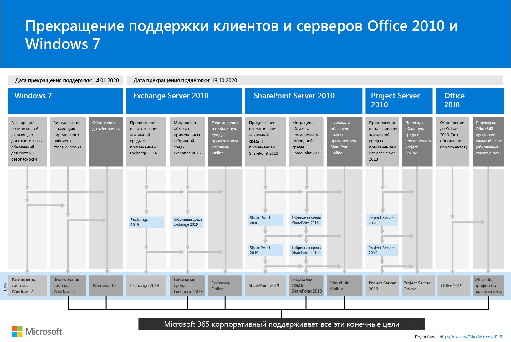
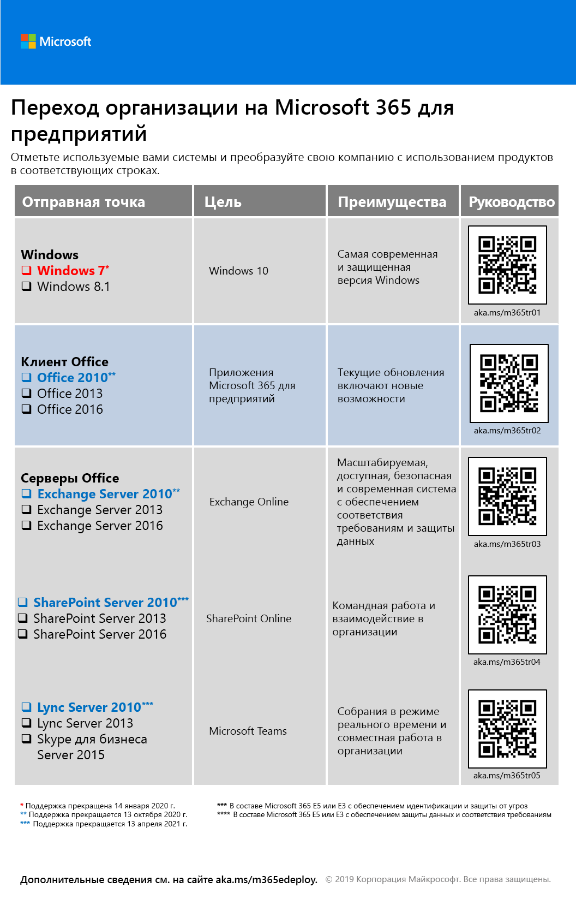

# Миграция в Microsoft 365 корпоративный

В большинстве корпоративных организаций используется разнородная среда с несколькими выпусками операционных систем, а также клиентского и серверного программного обеспечения. Microsoft 365 корпоративный включает наиболее безопасные версии этих ключевых компонентов ИТ-инфраструктуры с функциями для повышения продуктивности, разработанными с применением облачных технологий.

Чтобы максимально повысить ценность интегрированного набора продуктов Microsoft 365 корпоративный для вашего бизнеса, начните планировать и реализовывать стратегию переноса выпусков:

- установленного на компьютерах клиента Office до Приложений Microsoft 365 для предприятий;
- серверов Office, установленных на серверах для эквивалентных служб в Office 365;
- Обновление устройств с Windows 7 и Windows 8.1 до Windows 10 Корпоративная

>[!Note]
>Поддержка Windows 7 прекращена **14 января 2020 г.** Дополнительные сведения см. [здесь](https://support.microsoft.com/help/4057281/windows-7-support-will-end-on-january-14-2020).
>

Выполнение этих операций со временем приблизит вашу организацию к реализации [современного рабочего места](https://www.microsoft.com/microsoft-365/blog/2018/04/27/making-it-simpler-with-a-modern-workplace/) — надежной и интегрированной среды на основе Microsoft 365 корпоративный, которая позволяет работать в команде и способствует творческому решению задач в организации. 

Сведения о миграции пользователей и данных для определенных рабочих нагрузок Office 365:

- Перенос почтовых ящиков пользователей с сервера Exchange в Exchange Online описан в статье [Рабочая нагрузка Exchange Online](exchangeonline-workload.md).
- Перенос данных SharePoint с сервера SharePoint на SharePoint Online описан в статье [Рабочая нагрузка SharePoint Online](sharepoint-online-onedrive-workload.md).
- Переход со Скайпа для бизнеса Online на Microsoft Teams описан в статье [Рабочая нагрузка Microsoft Teams](teams-workload.md).

## Перенос клиентских продуктов Microsoft Office

Во многих организациях (как крупных, так и небольших) может использоваться сочетание более ранних версий клиентских продуктов Office, таких как Word, Excel и PowerPoint.

- Эти старые версии можно [обновить](https://support.office.com/article/install-office-updates-2ab296f3-7f03-43a2-8e50-46de917611c5), применив последние обновления для системы безопасности и исправления, но иногда этот процесс выполняется вручную и может не масштабироваться в организации.
- Эти старые версии не оптимизированы для использования облачных технологий Майкрософт и перехода предприятия на цифровые технологии.
- Эти старые версии не содержат новые функции.
 
Microsoft 365 корпоративный включает Приложения Microsoft 365 для предприятий, версию клиента Office, которая доступна по лицензии на Microsoft 365 корпоративный, а также устанавливается и обновляется из облака Microsoft. Приложения Microsoft 365 для предприятий включает обновления системы безопасности и новейшие функции. Дополнительные сведения см. в статье [О приложениях Microsoft 365 для предприятий](https://docs.microsoft.com/deployoffice/about-microsoft-365-apps).

### Office 2007

Поддержка версий Office в выпуске Office 2007 уже прекращена. Дополнительные сведения см. в статье [План действий после прекращения поддержки Office 2007](https://docs.microsoft.com/deployoffice/office-2007-end-support-roadmap).

Вместо того чтобы обновлять Office 2007 на компьютерах до Office 2010, Office 2013 или Office 2016, вы можете следующее:

1. Получить лицензию на Microsoft 365 и назначить ее пользователям.
2. Удалить Office 2007 на их компьютерах.
3. Установить Приложения Microsoft 365 для предприятий (по отдельности или при развертывании ИТ). Дополнительные сведения см. в статье [Этап 4. Приложения Microsoft 365 для предприятий](office365proplus-infrastructure.md).

Приложения Microsoft 365 для предприятий автоматически устанавливают обновления и могут использовать облачные службы для улучшения безопасности и производительности.

### Office 2010

Для версий Office в выпуске Office 2010 поддержка будет прекращена **13 октября 2020**г. Дополнительные сведения см. в статье [План прекращения поддержки Office 2010](https://docs.microsoft.com/deployoffice/office-2010-end-support-roadmap).

Вместо того чтобы обновлять Office 2010 на компьютерах до Office 2013 или Office 2016 (обновление выполняется вручную), вы можете следующее: 

1. Получить лицензию на Microsoft 365 и назначить ее пользователям.
2. Удалить Office 2010 на их компьютерах.
3. Установить Приложения Microsoft 365 для предприятий (по отдельности или при развертывании ИТ). Дополнительные сведения см. в статье [Этап 4. Приложения Microsoft 365 для предприятий](office365proplus-infrastructure.md).

Приложения Microsoft 365 для предприятий автоматически устанавливают обновления для системы безопасности и новые компоненты и могут использовать облачные службы в Microsoft 365 для улучшения безопасности и производительности.

### Office 2013 и Office 2016

План действий после прекращения поддержки для версий Office 2013 и Office 2016 еще не был определен. Но, как и в Office 2010, по-прежнему нужно [устанавливать обновления для системы безопасности](https://support.office.com/article/install-office-updates-2ab296f3-7f03-43a2-8e50-46de917611c5). В этом случае масштабируемость может быть проблематичной для организаций определенного размера.

Вместо того чтобы устанавливать на компьютерах последние обновления системы безопасности для Office 2013 и Office 2016 либо обновлять Office 2013 на компьютерах до Office 2016, вы можете выполнить следующее:

1. Получить лицензию на Microsoft 365 и назначить ее пользователям.
2. Удалить Office 2013 или Office 2016 на их компьютерах.
3. Установить Приложения Microsoft 365 для предприятий (по отдельности или при развертывании ИТ). Дополнительные сведения см. в статье [Этап 4. Приложения Microsoft 365 для предприятий](office365proplus-infrastructure.md).

Приложения Microsoft 365 для предприятий автоматически устанавливают обновления для системы безопасности и новые компоненты и могут использовать облачные службы в Microsoft 365 для улучшения безопасности и производительности.

## Перенос серверных продуктов Microsoft Office

Во многих организациях (как крупных, так и небольших) может использоваться сочетание более ранних версий серверных продуктов Office, таких как Exchange Server и SharePoint Server.

- Эти старые версии нужно обновить, применив последние обновления для системы безопасности и исправления. В некоторых случаях эти обновления выходят ежемесячно.
- Эти старые версии не оптимизированы для использования облачных технологий Майкрософт и перехода предприятия на цифровые технологии.
- Эти старые версии не включают новые приложения для обеспечения продуктивности, например Microsoft Teams.
- Эти старые версии не включают новые функции безопасности, например Exchange Advanced Threat Protection.

Microsoft 365 корпоративный включает Office 365, в том числе облачные версии серверных служб Office, использующих некоторые из средств, используемых локальными версиями серверного программного обеспечения Office (например, веб-браузеры и клиент Outlook). Эти службы будут постоянно обновляться без участия ИТ-специалистов, что позволяет экономить время на поддержке и обновлении локальных серверов. Эти службы также включают улучшения новых компонентов, отсутствующие в серверном программном обеспечении Office. 

### Office Server 2007

Поддержка серверных продуктов из выпуска Office 2007 уже прекращена. Дополнительные сведения см. в следующих статьях:

- [План действий после прекращения поддержки Exchange 2007](https://docs.microsoft.com/office365/enterprise/exchange-2007-end-of-support);
- [План действий после прекращения поддержки SharePoint Server 2007](https://docs.microsoft.com/office365/enterprise/sharepoint-2007-end-of-support);
- [План действий после прекращения поддержки Project Server 2007](https://docs.microsoft.com/office365/enterprise/project-server-2007-end-of-support);
- [План действий после прекращения поддержки Office Communications Server](https://docs.microsoft.com/skypeforbusiness/plan-your-deployment/upgrade);
- [План действий после прекращения поддержки PerformancePoint Server 2007](https://docs.microsoft.com/office365/enterprise/pps-2007-end-of-support).

Вместо того чтобы обновлять серверные продукты из выпуска Office 2007 до аналогов из выпуска Office 2010, Office 2013 или Office 2016, вы можете следующее:

1. Перенести данные с серверов Office 2007 в Office 365. Для этого заручитесь поддержкой партнера корпорации Майкрософт.
2. Выполнить развертывание новых функций и рабочих процессов для пользователей.
3. Списать локальные серверы под управлением серверных продуктов Office 2007, когда в них больше не будет необходимости.

### Office Server 2010

Поддержка [Exchange Server 2010](https://docs.microsoft.com/office365/enterprise/exchange-2010-end-of-support) прекращается **13 октября 2020 г**.

Поддержка [SharePoint Server 2010](https://docs.microsoft.com/office365/enterprise/upgrade-from-sharepoint-2010) прекращается **13 апреля 2021 г**.

Вместо того чтобы обновлять серверные продукты из выпуска Office 2010 до аналогов из выпуска Office 2013 или Office 2016, вы можете следующее:

1. Перенести данные с серверов Office 2010 в Microsoft 365. Для этого воспользуйтесь [FastTrack для Microsoft 365](https://fasttrack.microsoft.com/microsoft365) или заручитесь поддержкой партнера корпорации Майкрософт.
2. Выполнить развертывание новых функций и рабочих процессов для пользователей.
3. Списать локальные серверы под управлением серверных продуктов Office 2010, когда в них больше не будет необходимости.

### Office Server 2013

Дата прекращения поддержки серверных продуктов из выпуска Office 2013 еще не была определена. Вместо того чтобы обновлять серверные продукты из выпуска Office 2013 до аналогов из выпуска Office 2016, вы можете следующее:

1. Перенести данные с серверов Office 2013 в Office 365. Для этого воспользуйтесь [FastTrack для Microsoft 365](https://fasttrack.microsoft.com/microsoft365) или заручитесь поддержкой партнера корпорации Майкрософт.
2. Выполнить развертывание новых функций и рабочих процессов для пользователей.
3. Списать локальные серверы под управлением серверных продуктов Office 2013, когда в них больше не будет необходимости.

### Office Server 2016

Дата прекращения поддержки для серверных продуктов из выпуска Office 2016 еще не определена. Чтобы воспользоваться преимуществами облачной службы и улучшениями для перехода предприятия на цифровые технологии, вы можете следующее:

1. Перенести данные с серверов Office 2016 в Office 365. Для этого воспользуйтесь [FastTrack для Microsoft 365](https://fasttrack.microsoft.com/microsoft365) или заручитесь поддержкой партнера корпорации Майкрософт.
2. Выполнить развертывание новых функций и рабочих процессов для пользователей.
3. Списать локальные серверы под управлением серверных продуктов Office 2016, когда в них больше не будет необходимости.

## Миграция для Microsoft Windows 7 и 8.1

Поддержка Windows 7 прекращена **14 января 2020 г.** Чтобы выполнить миграцию на устройствах с Windows 7 или Windows 8.1, вы можете запустить [обновление на месте](https://docs.microsoft.com/microsoft-365/enterprise/windows10-deploy-inplaceupgrade). 

Дополнительные методы см в статье [Сценарии развертывания Windows 10](https://docs.microsoft.com/windows/deployment/windows-10-deployment-scenarios). Вы также можете [планировать развертывание Windows 10](https://aka.ms/planforwin10deployment) самостоятельно.

## Сводка вариантов для клиентов и серверов Office 2010 и Windows 7

Визуальное представление возможностей обновления, миграции и перехода на облачные решения для этих продуктов см. в [плакате “Прекращение поддержки”](../media/migration-microsoft-365-enterprise-workload/Office2010Windows7EndOfSupport.pdf).

Этот одностраничный плакат поможет быстро ознакомиться с различными методами, которые можно использовать, чтобы предотвратить прекращение поддержки клиентских и серверных продуктов Office 2010 и Windows 7. В нем указаны предпочтительные методы и конечные цели поддержки в Microsoft 365 корпоративный.

Вы можете [скачать этот плакат](https://github.com/MicrosoftDocs/microsoft-365-docs/raw/public/microsoft-365/media/migration-microsoft-365-enterprise-workload/Office2010Windows7EndOfSupport.pdf) и распечатать его в формате письма, юридического документа или газетном формате (11 х 17).

## Как корпорация Майкрософт реализует Microsoft 365 корпоративный

Узнайте, как ИТ-специалисты корпорации Майкрософт перенесли среду компании в Microsoft 365 корпоративный, из следующих ресурсов: 

- [Развертывание и обновление Приложений Microsoft 365 для предприятий](https://www.microsoft.com/itshowcase/Article/Content/757/Deploying-and-updating-Microsoft-Office-365-ProPlus)
- [Корпорация Майкрософт переносит 150 000 почтовых ящиков в Exchange Online](https://www.microsoft.com/itshowcase/Article/Content/577/Microsoft-migrates-150000-mailboxes-to-Exchange-Online)
- [Из SharePoint в облако: узнайте, как корпорация Майкрософт выполнила свою миграцию](https://www.microsoft.com/itshowcase/Article/Content/691/SharePoint-to-the-cloud-Learn-how-Microsoft-ran-its-own-migration)
- [Развертывание Windows 10 в корпорации Майкрософт путем обновления на месте](https://www.microsoft.com/itshowcase/Article/Content/668/Deploying-Windows-10-at-Microsoft-as-an-inplace-upgrade)
- [Развертывание Windows 10: советы от ИТ-специалистов Майкрософт](https://www.microsoft.com/itshowcase/Article/Content/951/Windows-10-deployment-tips-and-tricks-from-Microsoft-IT) (видео)

## Переход всей организации

Чтобы лучше понять, как перевести всю организацию на продукты и службы в Microsoft 365 корпоративный, см. [плакат по переходу](../media/deploy-microsoft-365-enterprise/transition-org-to-m365.pdf).

Этот двухстраничный плакат содержит быстрый способ определения элементов существующей инфраструктуры и руководство по переходу на соответствующий продукт или службу в Microsoft 365 корпоративный. На нем представлены продукты Windows и Office, а также другие элементы инфраструктуры и безопасности, например управление устройствами, удостоверения, защита информации и защита от угроз.

Вы можете [скачать этот плакат](https://github.com/MicrosoftDocs/microsoft-365-docs/raw/public/microsoft-365/media/deploy-microsoft-365-enterprise/transition-org-to-m365.pdf) и распечатать его в формате письма, юридического документа или газетном формате (11 х 17).

## Результат

Более ранние версии Microsoft Office, серверов Office и Windows, установленные в вашей организации, будут перенесены в Microsoft 365 корпоративный.
