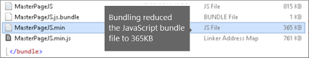

# Минификация и объединение в SharePoint Online

В этой статье описывается, как использовать минификации и объединение технологий с помощью веб-компонентов Web Essentials для уменьшения количества HTTP-запросов и сокращения времени, необходимого для загрузки страниц в SharePoint Online.
  
Когда вы настраиваете свой веб-сайт, вы можете добавить на сервер большое количество дополнительных файлов для поддержки настройки. Добавление дополнительного кода JavaScript, CSS и изображений увеличивает количество HTTP-запросов к серверу, которое, в свою очередь, увеличивает время, необходимое для отображения веб-страницы. Если у вас есть несколько файлов одного типа, вы можете объединить эти файлы, чтобы быстрее скачать эти файлы.
  
Для файлов JavaScript и CSS также можно использовать подход под названием минификации, в котором можно уменьшить общий размер файлов, удалив пробелы и другие ненужные символы.
  
## Минификации и объединение файлов JavaScript и CSS с помощью Web Essentials

Вы можете использовать сторонние программы, такие как Web Essentials, для объединения файлов CSS и JavaScript.
  
> [!IMPORTANT]
> Веб-Essentials — это проект на основе сторонних поставщиков с открытым кодом и сообществом. Программное обеспечение — это расширение Visual Studio 2012 и Visual Studio 2013, которое не поддерживается корпорацией Майкрософт. Чтобы скачать веб-Essentials, посетите веб-сайт по адресу [https://vswebessentials.com/download](https://go.microsoft.com/fwlink/p/?LinkId=525629) . 
  
Веб-компоненты предлагают две формы объединения:
  
- . пакет: для файлов CSS и JavaScript
    
- . спрайт: для изображений (доступно только в Visual Studio 2013)
    
Вы можете использовать Web Essentials, если у вас есть компонент с элементами фирменной символики, на которые ссылается настраиваемая эталонная страница, например:
  

  
 **Создание пакета TE000127218 и CSS в Web Essentials**
  
1. В обозревателе решений Visual Studio выберите файлы, которые нужно включить в пакет.
    
2. Щелкните правой кнопкой мыши выбранные файлы, а затем **Web Essentials** \> в контекстном меню выберите команду **создать файл пакета JavaScript** . Например: 
    
    
  
## Просмотр результатов объединения файлов JavaScript и CSS

При создании набора JavaScript и CSS Web Essentials создает XML-файл с именем рецепта, который определяет файлы JavaScript и CSS, а также другие сведения о конфигурации: 
  

  
Кроме того, если в рецепте объединения для параметра Минификация задано значение true, размер файлов сокращается и объединяется вместе. Это означает, что были созданы новые версии файлов JavaScript сжатые, на которые можно ссылаться на главной странице.
  

  
Когда вы загружаете страницу со своего веб-сайта, вы можете использовать средства разработчика в веб-браузере, например Internet Explorer 11, чтобы увидеть количество запросов, отправленных на сервер, и сколько времени занимает загрузка каждого файла.
  
На следующем рисунке показан результат загрузки файлов JavaScript и CSS перед минификации.
  

  
После объединения файлов CSS и JavaScript число запросов, отброшенных до 74 и потребовалось лишь немного больше времени, чем исходные файлы для загрузки по отдельности:
  

  
После объединения файл пакета JavaScript значительно сокращается с 815KB до 365KB:
  

  
## Объединение изображений путем создания спрайта изображений

Аналогично объединению файлов JavaScript и CSS можно объединять многие мелкие значки и другие общие изображения на более крупный лист спрайта, а затем использовать CSS для отображения отдельных изображений. Вместо того чтобы скачивать каждое отдельное изображение, веб-браузер пользователя загружает лист спрайт один раз, а затем кэширует его на локальном компьютере. Это повышает производительность загрузки страниц за счет уменьшения числа Скачиваний и циклов обработки на веб-сервере.
  
 **Создание спрайта изображений в Web Essentials**
  
1. В обозревателе решений Visual Studio выберите файлы, которые нужно включить в пакет.
    
2. Щелкните правой кнопкой мыши выбранные файлы, а затем **Web Essentials** в \> контекстном меню выберите команду **создать спрайт изображения** Web Essentials. Например: 
    
    
  
3. Выберите расположение для сохранения файла спрайта. Спрайт-файл — это XML-файл, описывающий параметры и файлы в спрайте. На следующих рисунках показан пример файла PNG спрайта и соответствующего XML-файла спрайта.
    
    
  
    
  

