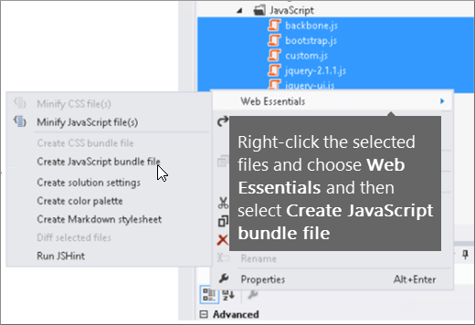

# Минификация и объединение в SharePoint Online

В этой статье описано, как использовать методы сокращения и объединения с Web Essentials, чтобы уменьшить количество HTTP-запросов и сократить время загрузки страниц в SharePoint Online.
  
При настройке веб-сайта можно добавить на сервер большое количество дополнительных файлов для поддержки настройки. Добавление дополнительного кода JavaScript, CSS и изображений увеличивает число HTTP-запросов на сервер, что, в свою очередь, увеличивает время, необходимое для отображения веб-страницы. Если у вас несколько файлов одного типа, вы можете объединить эти файлы, чтобы ускорить загрузку этих файлов.
  
Для файлов JavaScript и CSS можно также использовать подход, называемый уменьшением общего размера файлов, удалив необязательное пространство и другие символы.
  
## Minification and bundling JavaScript and CSS files with Web Essentials

Вы можете использовать стороне программное обеспечение, например Web Essentials, для набора CSS-файлов и файлов JavaScript.
  
> [!IMPORTANT]
> Web Essentials — это сторонний проект, основанный на сообществе с открытым кодом. Программное обеспечение является расширением Visual Studio 2012 и Visual Studio 2013 и не поддерживается корпорацией Майкрософт. Чтобы скачать Web Essentials, посетите веб-сайт по ссылке [https://vswebessentials.com/download](https://go.microsoft.com/fwlink/p/?LinkId=525629) . 
  
Web Essentials предлагает два вида совме-
  
- .bundle: для CSS-файлов и файлов JavaScript
    
- .sprite: для изображений (доступно только в Visual Studio 2013)
    
Можно использовать Web Essentials, если у вас есть функция с некоторыми элементами фирменой настройки, на которые ссылается настраиваемая эталонная страница, например:
  

  
 **Создание пакета TE000127218 и CSS в Web Essentials**
  
1. В Visual Studio в обозревателе решений выберите файлы, которые необходимо включить в пакет.
    
2. Щелкните выбранные файлы правой кнопкой мыши и выберите файл пакета **Web Essentials** \> **Create JavaScript** из контекстного меню. Пример: 
    
    
  
## Просмотр результатов по включению файлов JavaScript и CSS

При создании пакета JavaScript и CSS Web Essentials создает XML-файл, называемый файлом рецепта, который идентифицирует файлы JavaScript и CSS, а также некоторые другие сведения о конфигурации: 
  

  
Кроме того, если для флага minify установлено true в рецепте для пакета, файлы уменьшаются в размере, а также вместе. Это означает, что были созданы новые, минифицированные версии файлов JavaScript, на которые можно ссылаться на эталонной странице.
  

  
При загрузке страницы с веб-сайта можно использовать средства разработчика из веб-браузера, такие как Internet Explorer 11, чтобы увидеть количество запросов, отправленных на сервер, и время загрузки каждого файла.
  
На следующем рисунке по результатам загрузки файлов JavaScript и CSS перед их минификацией.
  

  
После объединяет CSS-файлы и файлы JavaScript, число запросов, отброшенных до 74, и каждый файл занимает немного больше времени, чем исходные файлы для отдельной загрузки:
  

  
После этого размер файла пакета JavaScript значительно сокращается с 815 КБ до 365 КБ:
  

  
## Создание спрайта изображения в единой компании

Подобно тому, как вы объединяете файлы JavaScript и CSS, вы можете объединить множество небольших значков и других распространенных изображений в большую спрайтовую таблицу, а затем использовать CSS для раскрытия отдельных изображений. Вместо того чтобы загружать каждое отдельное изображение, веб-браузер пользователя загружает спрайтовый лист один раз, а затем кэшировать его на локальном компьютере. Это повышает производительность загрузки страниц, сокращая количество загрузок и обращений к веб-серверу.
  
 **Создание спрайта изображения в Web Essentials**
  
1. В Visual Studio в обозревателе решений выберите файлы, которые необходимо включить в пакет.
    
2. Щелкните выбранные файлы правой кнопкой мыши и выберите спрайт создания изображения **Web Essentials** \>  из контекстного меню. Пример: 
    
    
  
3. Выберите расположение для сохранения спрайт-файла. Sprite-файл — это XML-файл, в который описываются параметры и файлы в спрайте. На следующих рисунках приводится пример PNG-файла спрайта и соответствующего XML-файла sprite.
    
    
  
    
  

