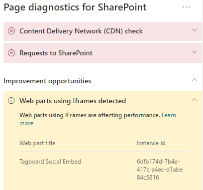

# Оптимизация окон iFrame на страницах современных и классических сайтов публикаций SharePoint Online

Окна iFrame можно использовать для предварительного просмотра расширенного контента, например видео или других файлов мультимедиа. Так как iFrame загружает отдельную страницу на странице сайта SharePoint, содержимое, загружаемое в iFrame, может содержать крупные изображения, видео или другие элементы, которые часто увеличивают общее время загрузки страниц и ограничивают управление страницей. Из этой статьи вы узнаете, как определять, насколько используемые на страницах окна iFrame влияют на задержку, распознаваемую конечным пользователем, и как устранять распространенные проблемы.

>[!NOTE]
>Дополнительные сведения о производительности на современных сайтах SharePoint Online см. в статье [Производительность в современном интерфейсе SharePoint](https://docs.microsoft.com/sharepoint/modern-experience-performance).

## Применение средства диагностики страниц SharePoint для анализа веб-частей, использующих окна iFrame

Средство "Диагностика страниц SharePoint" — это браузерное расширение для браузеров Chrome и новой версии Microsoft Edge (https://www.microsoft.com/edge), анализирующее страницы современных и классических сайтов публикаций SharePoint Online. Это средство предоставляет отчет о каждой проанализированной странице, показывающий, как она работает при заданных критериях производительности. Чтобы установить и изучить средство диагностики страниц SharePoint, ознакомьтесь со статьей [Использование средства диагностики страниц SharePoint Online](page-diagnostics-for-spo.md).

>[!NOTE]
>Средство диагностики страниц работает только в SharePoint Online, и его нельзя использовать на системной странице SharePoint.

При анализе сайта SharePoint с помощью средства диагностики страниц SharePoint вы можете просматривать сведения о веб-частях, содержащих окна iFrame, в области _Диагностические тесты_. Для современных и классических страниц базовый показатель будет одинаковым.

Возможные результаты:

- **Внимание!** (красный цвет) Страница содержит **три или более** веб-частей, использующие окна iFrame
- **Возможна оптимизация** (желтый цвет): Страница содержит **одну или две** веб-части, использующие блоки iFrame
- **Действия не требуются** (зеленый цвет). Страница не содержит веб-части, использующие блоки iFrame

В случае **Обнаружены веб-части, использующие блоки iFrame,** в разделе «Результаты» появятся уведомления **Возможна оптимизация** или **Внимание!**, при нажатии на которые будут показаны выявленные веб-части.

## Устранение проблем производительности окон iFrame

Определяйте, какие веб-части содержат элементы iFrame и могут замедлять загрузку страниц, используя результаты средства диагностики страниц **Обнаружены веб-части, использующие окна iFrame**.

Окна iFrame всегда работают медленно, так как они загружают отдельную внешнюю страницу со всем связанным с ней контентом, например JavaScript, CSS и элементами платформы, потенциально увеличивая служебные данные страницы сайта в два раза или более.

Чтобы обеспечить оптимальное использование iFrame, следуйте указанным ниже рекомендациям.

- По возможности вместо окон iFrame используйте изображения, если предварительный просмотр слишком мал для запуска или не интерактивен.
- При необходимости использовать элементы iFrame минимизируйте их количество и (или) удалите из окна просмотра.
- Внедренные файлы Office, такие как Word, Excel и PowerPoint, остаются интерактивными, но медленно загружаются. Эскизы изображений со ссылкой на полный документ обычно выполняются лучше.
- Внедренные видео YouTube и ленты Twitter успешнее работают в окнах iFrame, но эти виды объектов следует использовать обдуманно.
- Исключением являются изолированные веб-части, но их количество в окне просмотра должно быть минимальным.
- Если iFrame не находится в окне просмотра, можно использовать функцию _IntersectionObserver_ для отсрочки отображения окна iFrame, пока оно само не появится.

Перед изменением в страниц для устранения проблем производительности запомните время загрузки страницы по результатам анализа. Снова запустите средство после внесения изменений, чтобы узнать, соответствует ли новый результат базовому стандарту, и проверить, сократилось ли время загрузки.

>[!NOTE]
>Время загрузки страницы зависит от множества факторов, например от загрузки сети, времени суток и других переменных условий. Следует несколько раз проверить время загрузки страницы до и после внесения изменений, чтобы получить среднестатистические данные.

## Статьи по теме

[Настройка производительности SharePoint Online](tune-sharepoint-online-performance.md)

[Настройка производительности Office 365](tune-microsoft-365-performance.md)

[Производительность в современном интерфейсе SharePoint](https://docs.microsoft.com/sharepoint/modern-experience-performance)
