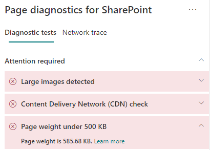

# Оптимизация веса страниц современных сайтов SharePoint Online

Страницы современного сайта SharePoint Online содержат сериализованный код, необходимый для отображения содержимого страницы, включая изображения, текст, объекты в области содержимого под панелью навигации или панелью команд, а также HTML-код для формирования структуры страницы. Вес страницы определяется этим HTML-кодом и должен быть ограничен, чтобы обеспечить оптимальное время загрузки страницы.

Эта статья поможет вам понять, как уменьшить вес страниц современного сайта.

>[!NOTE]
>Дополнительные сведения о производительности на современных порталах SharePoint Online см. в статье [Производительность в современном интерфейсе SharePoint](/sharepoint/modern-experience-performance).

## Использование средства диагностики страниц SharePoint для анализа веса страниц

Средство "Диагностика страниц SharePoint" — это браузерное расширение для браузеров Chrome и новой версии Microsoft Edge (https://www.microsoft.com/edge), анализирующее страницы современных и классических сайтов публикаций SharePoint Online. Это средство предоставляет отчет о каждой проанализированной странице, показывающий, как она работает при заданных критериях производительности. Чтобы установить и изучить средство диагностики страниц SharePoint, ознакомьтесь со статьей [Использование средства диагностики страниц SharePoint Online](page-diagnostics-for-spo.md).

>[!NOTE]
>Средство диагностики страниц работает только в SharePoint Online, и его нельзя использовать на системной странице SharePoint.

При анализе страницы сайта SharePoint с помощью средства диагностики страниц SharePoint вы можете просматривать сведения о странице в результате **Вес страницы до 500 КБ** на панели _Диагностические тесты_. Результат появится в зеленом цвете, если вес страницы ниже базового значения, и в красном, если вес страницы превышает базовое значение.

Возможные результаты:

- **Внимание** (красный): вес страницы превышает 500 КБ
- **Действия не требуются** (зеленый): вес страницы не превышает 500 КБ

Если результат **Вес страницы до 500 КБ** появляется в разделе **Внимание**, щелкните результат, чтобы получить дополнительные сведения.  

## Исправление проблем с весом страниц

Если вес страницы превышает 500 КБ, общее время загрузки можно улучшить, уменьшая количество веб-частей и ограничивая содержимое страницы до соответствующего уровня. 

Общие инструкции по уменьшению веса страницы

- Ограничьте содержимое страницы до приемлемого размера и используйте несколько страниц для связанного контента.
- Минимизируйте использование веб-частей с крупными контейнерами свойств.
- По возможности используйте неинтерактивные представления сведений.
- Оптимизируйте размеры изображений, изменяя их с помощью форматов сжатия и загружая их из CDN.

Дополнительные инструкции по ограничению веса страницы можно найти в следующей статье:

- [Оптимизация производительности страниц в SharePoint](/sharepoint/dev/general-development/optimize-page-performance-in-sharepoint)

Перед внесением изменений в страницы для исправления проблем с производительностью запомните время загрузки страницы в результатах анализа. Снова запустите средство после внесения изменений, чтобы узнать, соответствует ли новый результат базовому стандарту, и проверить, сократилось ли время загрузки.

>[!NOTE]
>Время загрузки страницы зависит от множества факторов, например от загрузки сети, времени суток и других переменных условий. Следует несколько раз проверить время загрузки страницы до и после внесения изменений, чтобы получить среднестатистические данные.

## Статьи по теме

[Настройка производительности SharePoint Online](tune-sharepoint-online-performance.md)

[Настройка производительности Office 365](tune-microsoft-365-performance.md)

[Производительность в современном интерфейсе SharePoint](/sharepoint/modern-experience-performance)

[Сети доставки содержимого](content-delivery-networks.md)

[Использование сети доставки содержимого Office 365 с SharePoint Online](use-microsoft-365-cdn-with-spo.md)