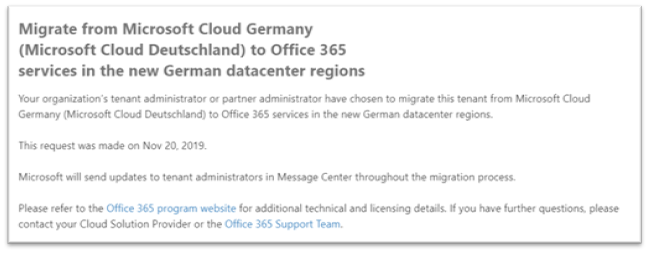

# Как дать согласие на миграцию с Microsoft Cloud для Германии (Microsoft Cloud Deutschland) в службы Office 365 в новых регионах центров обработки данных в Германии

>[!Note]
>Эта статья применяется только к клиентам Microsoft Cloud Germany (Microsoft Cloud Deutschland).
>

## Запрос на миграцию

Если вы имеете право на обслуживание, предусмотренное в Microsoft Cloud Germany (Microsoft Cloud Deutschland) и в качестве глобального администратора, страница в центре администрирования Microsoft 365 позволяет вам принять участие в миграции.

Чтобы получить доступ к странице, разойдите **параметры** в области навигации слева и нажмите кнопку **Профиль организации.**

На странице **Профиль организации** прокрутите вниз до раздела **Миграция с Microsoft Cloud для Германии (Microsoft Cloud Deutschland) в службы Office 365 в новых регионах центров обработки данных в Германии**.

Если вы хотите перенести службу из Microsoft Cloud Germany (Microsoft Cloud Deutschland) в службы Office 365 в новых немецких регионах центра обработки данных, нажмите кнопку **Opt-in**.
 

На правой стороне экрана появляется новый раздел, чтобы принять подтверждение. Выберите **Да,** а затем нажмите **кнопку Сохранить**.
 

После того как вы сделали выбор от имени клиента, все администраторы увидят подтверждение в разделе Миграция из **Microsoft Cloud Germany (Microsoft Cloud Deutschland)** в службы Office 365 в новом разделе немецких регионов обработки данных, включая дату выбора. Администраторы также получат подтверждение в Центре сообщений центра администрирования Microsoft 365. 
 

## Что происходит после выбора для миграции?

Миграции начнутся в начале 2021 г. для организаций, которые выбирают подход, управляемый Корпорацией Майкрософт, и будут завершены до даты выхода на пенсию Microsoft Cloud Germany (Microsoft Cloud Deutschland) 29 октября 2021 г.  В результате миграции основные данные клиента и подписки перемещаются в новые регионы в Германии.  Корпорация Майкрософт будет размещать обновления на протяжении всего процесса миграции в Центре сообщений. Дополнительные [статьи см.](#more-information) в статьях.

## Что произойдет, если вы не решитесь на миграцию в Центре администрирования?

Термины Online Services изменились, чтобы включить термины, которые позволят Корпорации Майкрософт перенести данные и подписки Microsoft Cloud Deutschland на новый центр обработки данных Microsoft 365, Dynamics 365 и Power BI. Эти условия вступает в силу для любой подписки Microsoft Cloud Germany (Microsoft Cloud Deutschland), продленной с 1 мая 2020 г. 

Администратор клиентского клиента получает уведомление в электронной почте, а Центр сообщений сообщает, что переход на миграцию будет автоматически происходить при миграции с помощью Майкрософт. Это уведомление будет отправлено не менее чем за 30 дней до автоматического выбора. После перехода все сообщения и обновления состояния отправляются администраторам клиентов в Центре сообщений.

Администраторам клиентов и партнеров рекомендуется сделать выбор в пользу переноса в центре администрирования Microsoft 365, чтобы процесс миграции начался как можно скорее.

## Следующий шаг

[Понимание клиентской работы во время миграции](ms-cloud-germany-transition-experience.md)

## Дополнительная информация

Начало работы:

- [Миграция из Microsoft Cloud Deutschland в службы Office 365 в новых регионах центра обработки данных в Германии](ms-cloud-germany-transition.md)
- [Помощь по миграции Microsoft Cloud Deutschland](https://aka.ms/germanymigrateassist)
- [Опыт работы с клиентами во время миграции](ms-cloud-germany-transition-experience.md)

Перемещение по переходу:

- [Действия и влияние этапов миграции](ms-cloud-germany-transition-phases.md)
- [Дополнительная предварительная работа](ms-cloud-germany-transition-add-pre-work.md)
- Дополнительные сведения [для Azure AD,](ms-cloud-germany-transition-azure-ad.md) [устройств,](ms-cloud-germany-transition-add-devices.md) [опытом](ms-cloud-germany-transition-add-experience.md)и [AD FS.](ms-cloud-germany-transition-add-adfs.md)

Облачные приложения:

- [Сведения о программе миграции Dynamics 365](/dynamics365/get-started/migrate-data-german-region)
- [Сведения о программе миграции Power BI](/power-bi/admin/service-admin-migrate-data-germany)
- [Начало перехода на Microsoft Teams](/microsoftteams/upgrade-start-here)