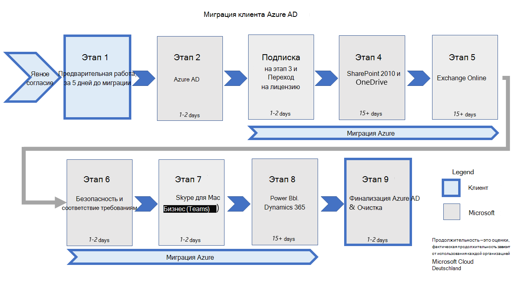

# <a name="migration-phases-actions-and-impacts-for-the-migration-from-microsoft-cloud-deutschland-general"></a><span data-ttu-id="3a5bd-103">Миграция фазы действий и последствий для миграции из Microsoft Cloud Deutschland (общие)</span><span class="sxs-lookup"><span data-stu-id="3a5bd-103">Migration phases actions and impacts for the migration from Microsoft Cloud Deutschland (general)</span></span>

<span data-ttu-id="3a5bd-104">Миграции клиента из Microsoft Cloud Deutschland (MCD) в регион "Германия" глобальных служб Microsoft Office 365 выполняются в наборе этапов и их настроенных действий для каждой рабочей нагрузки.</span><span class="sxs-lookup"><span data-stu-id="3a5bd-104">Tenant migrations from Microsoft Cloud Deutschland (MCD) to the region "Germany" of Microsoft's Office 365 Global services are executed as a set of phases and their configured actions for each workload.</span></span> <span data-ttu-id="3a5bd-105">На этом рисунке показаны десять этапов миграции в новые немецкие центра обработки данных.</span><span class="sxs-lookup"><span data-stu-id="3a5bd-105">This figure shows the ten phases of migration to the new German datacenters.</span></span>



<span data-ttu-id="3a5bd-107">Процесс миграции будет завершен в течение многих недель в зависимости от общего размера и сложности организации.</span><span class="sxs-lookup"><span data-stu-id="3a5bd-107">The migration process will complete over many weeks depending on the overall size and complexity of the organization.</span></span> <span data-ttu-id="3a5bd-108">В то время как миграция продолжается, пользователи и администраторы могут продолжать использовать службы с заметными изменениями, подробными в этой документации.</span><span class="sxs-lookup"><span data-stu-id="3a5bd-108">While the migration is underway, users and administrators are able to continue utilizing the services with notable changes detailed in this documentation.</span></span> <span data-ttu-id="3a5bd-109">График и таблица определяют этапы и действия во время миграции.</span><span class="sxs-lookup"><span data-stu-id="3a5bd-109">The graphic and table define phases and steps during the migration.</span></span>

|<span data-ttu-id="3a5bd-110">Действие</span><span class="sxs-lookup"><span data-stu-id="3a5bd-110">Step</span></span>|<span data-ttu-id="3a5bd-111">Duration</span><span class="sxs-lookup"><span data-stu-id="3a5bd-111">Duration</span></span>|<span data-ttu-id="3a5bd-112">Ответственная сторона</span><span class="sxs-lookup"><span data-stu-id="3a5bd-112">Responsible party</span></span>|<span data-ttu-id="3a5bd-113">Описание</span><span class="sxs-lookup"><span data-stu-id="3a5bd-113">Description</span></span>|
|:--------|:--------|:--------|:--------|
|<span data-ttu-id="3a5bd-114">Opt-In</span><span class="sxs-lookup"><span data-stu-id="3a5bd-114">Opt-In</span></span>|<span data-ttu-id="3a5bd-115">Часы</span><span class="sxs-lookup"><span data-stu-id="3a5bd-115">Hours</span></span>|<span data-ttu-id="3a5bd-116">Клиент</span><span class="sxs-lookup"><span data-stu-id="3a5bd-116">Customer</span></span>|<span data-ttu-id="3a5bd-117">Выбор организации в миграции.</span><span class="sxs-lookup"><span data-stu-id="3a5bd-117">Opt your organization into the migration.</span></span>|
|<span data-ttu-id="3a5bd-118">Предварительная работа</span><span class="sxs-lookup"><span data-stu-id="3a5bd-118">Pre-Work</span></span>|<span data-ttu-id="3a5bd-119">Days</span><span class="sxs-lookup"><span data-stu-id="3a5bd-119">Days</span></span>|<span data-ttu-id="3a5bd-120">Клиент</span><span class="sxs-lookup"><span data-stu-id="3a5bd-120">Customer</span></span>|<span data-ttu-id="3a5bd-121">Выполните работу, необходимую для подготовки пользователей, рабочих станций и сети к миграции.</span><span class="sxs-lookup"><span data-stu-id="3a5bd-121">Complete the work needed to prepare users, workstations, and network for migration.</span></span>|
|<span data-ttu-id="3a5bd-122">Azure Active Directory (Azure AD)</span><span class="sxs-lookup"><span data-stu-id="3a5bd-122">Azure Active Directory (Azure AD)</span></span>|<span data-ttu-id="3a5bd-123">1-2 дня</span><span class="sxs-lookup"><span data-stu-id="3a5bd-123">1-2 days</span></span>|<span data-ttu-id="3a5bd-124">Корпорация Майкрософт</span><span class="sxs-lookup"><span data-stu-id="3a5bd-124">Microsoft</span></span>|<span data-ttu-id="3a5bd-125">Перенос организации Azure AD во всем мире.</span><span class="sxs-lookup"><span data-stu-id="3a5bd-125">Migrate Azure AD organization to worldwide.</span></span>|
|<span data-ttu-id="3a5bd-126">Azure</span><span class="sxs-lookup"><span data-stu-id="3a5bd-126">Azure</span></span>|<span data-ttu-id="3a5bd-127">Недели</span><span class="sxs-lookup"><span data-stu-id="3a5bd-127">Weeks</span></span>|<span data-ttu-id="3a5bd-128">Клиент</span><span class="sxs-lookup"><span data-stu-id="3a5bd-128">Customer</span></span>|<span data-ttu-id="3a5bd-129">Создание новых подписок Azure по всему миру и переход служб Azure.</span><span class="sxs-lookup"><span data-stu-id="3a5bd-129">Create new worldwide Azure subscriptions and transition Azure services.</span></span>|
|<span data-ttu-id="3a5bd-130">Переход & лицензии</span><span class="sxs-lookup"><span data-stu-id="3a5bd-130">Subscription & License Transition</span></span>|<span data-ttu-id="3a5bd-131">1-2 дня</span><span class="sxs-lookup"><span data-stu-id="3a5bd-131">1-2 days</span></span>|<span data-ttu-id="3a5bd-132">Корпорация Майкрософт</span><span class="sxs-lookup"><span data-stu-id="3a5bd-132">Microsoft</span></span>|<span data-ttu-id="3a5bd-133">Приобретение подписок по всему миру, отмена подписки Microsoft Cloud Deutschland и переходные лицензии пользователей.</span><span class="sxs-lookup"><span data-stu-id="3a5bd-133">Purchase worldwide subscriptions, cancel Microsoft Cloud Deutschland subscriptions, and transition user licenses.</span></span>|
|<span data-ttu-id="3a5bd-134">SharePoint и OneDrive</span><span class="sxs-lookup"><span data-stu-id="3a5bd-134">SharePoint and OneDrive</span></span>|<span data-ttu-id="3a5bd-135">15+ дней</span><span class="sxs-lookup"><span data-stu-id="3a5bd-135">15+ days</span></span>|<span data-ttu-id="3a5bd-136">Корпорация Майкрософт</span><span class="sxs-lookup"><span data-stu-id="3a5bd-136">Microsoft</span></span>|<span data-ttu-id="3a5bd-137">Перенос контента SharePoint и OneDrive для бизнеса, sharepoint.de URL-адресов.</span><span class="sxs-lookup"><span data-stu-id="3a5bd-137">Migrate SharePoint and OneDrive for Business content, persisting sharepoint.de URLs.</span></span>|
|<span data-ttu-id="3a5bd-138">Exchange Online</span><span class="sxs-lookup"><span data-stu-id="3a5bd-138">Exchange Online</span></span>|<span data-ttu-id="3a5bd-139">15+ дней</span><span class="sxs-lookup"><span data-stu-id="3a5bd-139">15+ days</span></span>|<span data-ttu-id="3a5bd-140">Корпорация Майкрософт</span><span class="sxs-lookup"><span data-stu-id="3a5bd-140">Microsoft</span></span>|<span data-ttu-id="3a5bd-141">Перенос контента Exchange Online и переход на URL-адреса по всему миру.</span><span class="sxs-lookup"><span data-stu-id="3a5bd-141">Migrate Exchange Online content and transition to worldwide URLs.</span></span>|
|<span data-ttu-id="3a5bd-142">Безопасность и соответствие требованиям</span><span class="sxs-lookup"><span data-stu-id="3a5bd-142">Security & Compliance</span></span>|<span data-ttu-id="3a5bd-143">1-2 дня</span><span class="sxs-lookup"><span data-stu-id="3a5bd-143">1-2 days</span></span>|<span data-ttu-id="3a5bd-144">Корпорация Майкрософт</span><span class="sxs-lookup"><span data-stu-id="3a5bd-144">Microsoft</span></span>|<span data-ttu-id="3a5bd-145">Безопасность перехода & соответствия требованиям и контенту.</span><span class="sxs-lookup"><span data-stu-id="3a5bd-145">Transition security & compliance policies and content.</span></span>|
|<span data-ttu-id="3a5bd-146">Skype для бизнеса</span><span class="sxs-lookup"><span data-stu-id="3a5bd-146">Skype for Business</span></span>|<span data-ttu-id="3a5bd-147">1-2 дня</span><span class="sxs-lookup"><span data-stu-id="3a5bd-147">1-2 days</span></span>|<span data-ttu-id="3a5bd-148">Корпорация Майкрософт</span><span class="sxs-lookup"><span data-stu-id="3a5bd-148">Microsoft</span></span>|<span data-ttu-id="3a5bd-149">Переход из Skype для бизнеса в Microsoft Teams.</span><span class="sxs-lookup"><span data-stu-id="3a5bd-149">Transition from Skype for Business to Microsoft Teams.</span></span>|
|<span data-ttu-id="3a5bd-150">Power BI & Dynamics 365</span><span class="sxs-lookup"><span data-stu-id="3a5bd-150">Power BI & Dynamics 365</span></span>|<span data-ttu-id="3a5bd-151">15+ дней</span><span class="sxs-lookup"><span data-stu-id="3a5bd-151">15+ days</span></span>|<span data-ttu-id="3a5bd-152">Корпорация Майкрософт</span><span class="sxs-lookup"><span data-stu-id="3a5bd-152">Microsoft</span></span>|<span data-ttu-id="3a5bd-153">Перенос контента Power BI и Dynamics 365.</span><span class="sxs-lookup"><span data-stu-id="3a5bd-153">Migrate Power BI and Dynamics 365 content.</span></span>|
|<span data-ttu-id="3a5bd-154">Финализация Azure AD</span><span class="sxs-lookup"><span data-stu-id="3a5bd-154">Finalize Azure AD</span></span>|<span data-ttu-id="3a5bd-155">1-2 дня</span><span class="sxs-lookup"><span data-stu-id="3a5bd-155">1-2 days</span></span>|<span data-ttu-id="3a5bd-156">Корпорация Майкрософт</span><span class="sxs-lookup"><span data-stu-id="3a5bd-156">Microsoft</span></span>|<span data-ttu-id="3a5bd-157">Полное сокращение клиента по всему миру.</span><span class="sxs-lookup"><span data-stu-id="3a5bd-157">Complete tenant cutover to worldwide.</span></span>|
|<span data-ttu-id="3a5bd-158">Clean-Up</span><span class="sxs-lookup"><span data-stu-id="3a5bd-158">Clean-Up</span></span>|<span data-ttu-id="3a5bd-159">1-2 дня</span><span class="sxs-lookup"><span data-stu-id="3a5bd-159">1-2 days</span></span>|<span data-ttu-id="3a5bd-160">Клиент</span><span class="sxs-lookup"><span data-stu-id="3a5bd-160">Customer</span></span>|<span data-ttu-id="3a5bd-161">Очистка устаревших подключений к Microsoft Cloud Deutschland, таких как active Directory Federation Services (AD FS) Доверение сторон, Azure AD Connect и перезапуск клиента Office.</span><span class="sxs-lookup"><span data-stu-id="3a5bd-161">Clean up legacy connections to Microsoft Cloud Deutschland, such as Active Directory Federation Services (AD FS) Relying Party Trust, Azure AD Connect, and Office client restarts.</span></span>|
|<span data-ttu-id="3a5bd-162">Отключены конечные точки</span><span class="sxs-lookup"><span data-stu-id="3a5bd-162">Endpoints Disabled</span></span>|<span data-ttu-id="3a5bd-163">30 дней</span><span class="sxs-lookup"><span data-stu-id="3a5bd-163">30 days</span></span>|<span data-ttu-id="3a5bd-164">Корпорация Майкрософт</span><span class="sxs-lookup"><span data-stu-id="3a5bd-164">Microsoft</span></span>|<span data-ttu-id="3a5bd-165">Через 30 дней после окончания службы Azure AD служба Microsoft Cloud Deutschland Azure AD прекратит доступ к конечной точке для переходной организации.</span><span class="sxs-lookup"><span data-stu-id="3a5bd-165">30 days after the finalization of Azure AD, the Microsoft Cloud Deutschland Azure AD service will stop endpoint access for the transitioned organization.</span></span> <span data-ttu-id="3a5bd-166">Запросы конечной точки, такие как проверка подлинности, с этого момента не будут работать в службе Microsoft Cloud Deutschland.</span><span class="sxs-lookup"><span data-stu-id="3a5bd-166">Endpoint requests such as Authentication will fail from this point forward against the Microsoft Cloud Deutschland service.</span></span> |


<span data-ttu-id="3a5bd-167">Этапы и их действия обеспечивают перенос критически важных данных и опыта в глобальные службы Office 365.</span><span class="sxs-lookup"><span data-stu-id="3a5bd-167">The phases and their actions ensure that critical data and experiences are migrated to the Office 365 Global services.</span></span> <span data-ttu-id="3a5bd-168">После того как клиент будет добавлен в очередь миграции, каждая рабочая нагрузка будет выполнена в качестве набора действий, выполняемых в службе backend.</span><span class="sxs-lookup"><span data-stu-id="3a5bd-168">After your tenant is added to the migration queue, each workload will be completed as a set of steps that are executed on the backend service.</span></span> <span data-ttu-id="3a5bd-169">Некоторые рабочие нагрузки могут требовать действий администратора (или пользователя), или миграция может повлиять на использование для этапов, которые выполняются и обсуждаются в How [is the migration organized?](ms-cloud-germany-transition.md#how-is-the-migration-organized)</span><span class="sxs-lookup"><span data-stu-id="3a5bd-169">Some workloads may require actions by the administrator (or user), or the migration may affect usage for the phases that are executed and discussed in [How is the migration organized?](ms-cloud-germany-transition.md#how-is-the-migration-organized)</span></span>

<span data-ttu-id="3a5bd-170">В следующих разделах содержатся действия и эффекты для рабочих нагрузок по мере их выполнения на различных этапах миграции.</span><span class="sxs-lookup"><span data-stu-id="3a5bd-170">The following sections contain actions and effects for workloads as they progress through various phases of the migration.</span></span> <span data-ttu-id="3a5bd-171">Просмотрите таблицы и определите, какие действия или эффекты применимы к вашей организации.</span><span class="sxs-lookup"><span data-stu-id="3a5bd-171">Review the tables and determine which actions or effects are applicable to your organization.</span></span> <span data-ttu-id="3a5bd-172">Убедитесь, что вы готовы выполнить необходимые действия на соответствующих этапах.</span><span class="sxs-lookup"><span data-stu-id="3a5bd-172">Ensure that you're prepared to execute the steps in the respective phases as required.</span></span> <span data-ttu-id="3a5bd-173">Невыполнение необходимых действий может привести к сбою в работе служб и задержке завершения миграции в службы Office 365.</span><span class="sxs-lookup"><span data-stu-id="3a5bd-173">Failure to complete necessary steps may result in service outage and might delay completion of the migration to the Office 365 services.</span></span>

## <a name="opt-in"></a><span data-ttu-id="3a5bd-174">Opt-In</span><span class="sxs-lookup"><span data-stu-id="3a5bd-174">Opt-In</span></span>

<span data-ttu-id="3a5bd-175">**Применяется к**: Все клиенты с клиентом Office 365, которые будут работать в Microsoft Cloud Deutschland (MCD)</span><span class="sxs-lookup"><span data-stu-id="3a5bd-175">**Applies to**: All customers with an Office 365 tenant hosted in the Microsoft Cloud Deutschland (MCD)</span></span>

| <span data-ttu-id="3a5bd-176">Step(s)</span><span class="sxs-lookup"><span data-stu-id="3a5bd-176">Step(s)</span></span> | <span data-ttu-id="3a5bd-177">Описание</span><span class="sxs-lookup"><span data-stu-id="3a5bd-177">Description</span></span> | <span data-ttu-id="3a5bd-178">Влияние</span><span class="sxs-lookup"><span data-stu-id="3a5bd-178">Impact</span></span> |
|:-------|:-----|:-------|
| <span data-ttu-id="3a5bd-179">Мы не можем перенести клиентов Office 365, которые были организованы в MCD без согласия.</span><span class="sxs-lookup"><span data-stu-id="3a5bd-179">We can't migrate Office 365 tenants hosted in the MCD without consent.</span></span> | <span data-ttu-id="3a5bd-180">Корпорация Майкрософт получает право на миграцию одним из двух способов, что позволяет Корпорации Майкрософт организовать переход данных и служб в экземпляр глобальных служб Office 365.</span><span class="sxs-lookup"><span data-stu-id="3a5bd-180">Microsoft gains the right to migrate in one of two ways, which enables Microsoft to orchestrate the transition of data and services to the Office 365 Global services instance.</span></span> <ol><li><span data-ttu-id="3a5bd-181">Администратор клиента Office 365 выбирает миграцию, вызванную Microsoft.</span><span class="sxs-lookup"><span data-stu-id="3a5bd-181">The Office 365 tenant administrator opts-in to the Microsoft-driven migration.</span></span> </li><li> <span data-ttu-id="3a5bd-182">Клиенты возобновляют подписки в клиенте MCD Office 365 после 1 мая 2020 г.</span><span class="sxs-lookup"><span data-stu-id="3a5bd-182">Customers renew any subscriptions in their MCD Office 365 tenant after May 1, 2020.</span></span> <span data-ttu-id="3a5bd-183">Мы будем уведомлять этих клиентов о переносе каждый месяц, ждать 30 дней, чтобы дать клиентам возможность отменить, а затем непосредственно отказаться.</span><span class="sxs-lookup"><span data-stu-id="3a5bd-183">We'll notify these customers of the migration right each month, wait 30 days to give customers a chance to cancel, and then directly opt-in.</span></span></li></ol> | <ul><li><span data-ttu-id="3a5bd-184">Клиент помечен как согласие на миграцию, и Центр администрирования отображает подтверждение.</span><span class="sxs-lookup"><span data-stu-id="3a5bd-184">Tenant is marked as consented for migration, and Admin Center displays confirmation.</span></span> </li><li><span data-ttu-id="3a5bd-185">Подтверждение размещено в Центре сообщений клиента Office 365.</span><span class="sxs-lookup"><span data-stu-id="3a5bd-185">Acknowledgment is posted to the Office 365 tenant Message Center.</span></span> <span data-ttu-id="3a5bd-186">Конфигурация службы продолжается с конечных точек Microsoft Cloud Deutschland.</span><span class="sxs-lookup"><span data-stu-id="3a5bd-186">Service configuration continues from Microsoft Cloud Deutschland endpoints.</span></span> </li><li><span data-ttu-id="3a5bd-187">Администратор клиента должен отслеживать центр сообщений Office 365 для обновления состояния фазы миграции.</span><span class="sxs-lookup"><span data-stu-id="3a5bd-187">The tenant administrator must monitor the Office 365 Message Center for updates on the migration phase status.</span></span> </li></ul>|

## <a name="before-the-migration-starts"></a><span data-ttu-id="3a5bd-188">Перед началом миграции</span><span class="sxs-lookup"><span data-stu-id="3a5bd-188">Before the migration starts</span></span>

<span data-ttu-id="3a5bd-189">Убедитесь, что вы знакомы с действиями по [подготовке миграции, которые применяются к всем клиентам.](ms-cloud-germany-transition-add-pre-work.md)</span><span class="sxs-lookup"><span data-stu-id="3a5bd-189">Make sure that you are familiar with the [migration preparation steps that apply to all customers](ms-cloud-germany-transition-add-pre-work.md).</span></span>

<span data-ttu-id="3a5bd-190">Если в одном или многих пространствах имен DNS, которые у вас есть, установленО DNS CNAME под названием _msoid,_ необходимо удалить CNAME не позднее конца 8-й фазы.</span><span class="sxs-lookup"><span data-stu-id="3a5bd-190">In case you have set a DNS CNAME called _msoid_ in one or many DNS namespaces that you own, you have to remove the CNAME until the end of phase 8 at the latest.</span></span> <span data-ttu-id="3a5bd-191">Msoid CNAME  можно удалить в любое время до окончания этапа 8.</span><span class="sxs-lookup"><span data-stu-id="3a5bd-191">You can remove the CNAME _msoid_ any time before the end of phase 8.</span></span> <span data-ttu-id="3a5bd-192">См. [предварительную работу для DNS.](ms-cloud-germany-transition-add-pre-work.md#dns)</span><span class="sxs-lookup"><span data-stu-id="3a5bd-192">See the [prework for DNS](ms-cloud-germany-transition-add-pre-work.md#dns).</span></span>

<span data-ttu-id="3a5bd-193">Если в экземпляре Microsoft Cloud Deutschland используется единый вход для Office 365 и Azure, необходимо подготовить и запланировать миграцию подписки Azure соответственно.</span><span class="sxs-lookup"><span data-stu-id="3a5bd-193">In case you are using single sign on for Office 365 and Azure in the Microsoft Cloud Deutschland instance, you must prepare and schedule your Azure subscription migration accordingly.</span></span> <span data-ttu-id="3a5bd-194">Убедитесь, что вы понимаете [предварительную работу для Microsoft Azure.](ms-cloud-germany-transition-add-pre-work.md#microsoft-azure)</span><span class="sxs-lookup"><span data-stu-id="3a5bd-194">Make sure that you understand the [prework for Microsoft Azure](ms-cloud-germany-transition-add-pre-work.md#microsoft-azure).</span></span>

## <a name="before-phase-2-starts"></a><span data-ttu-id="3a5bd-195">Перед началом фазы 2</span><span class="sxs-lookup"><span data-stu-id="3a5bd-195">Before Phase 2 starts</span></span>

<span data-ttu-id="3a5bd-196">Если вы используете ADFS, убедитесь, что перед и после добавления доверяющих сторон для глобальной службы Office 365 необходимо сделать ставку на конфигурацию [ADFS.](ms-cloud-germany-transition-azure-ad.md)</span><span class="sxs-lookup"><span data-stu-id="3a5bd-196">If you are using ADFS, make sure to [back up your ADFS configuration before and after adding the relying party trust](ms-cloud-germany-transition-azure-ad.md) for the Office 365 Global service.</span></span>

## <a name="subscription-transfer-phase-3"></a><span data-ttu-id="3a5bd-197">Передача подписки (этап 3)</span><span class="sxs-lookup"><span data-stu-id="3a5bd-197">Subscription transfer (Phase 3)</span></span>

<span data-ttu-id="3a5bd-198">**Применяется к**: Все клиенты с клиентом Office 365, которые будут работать в Microsoft Cloud Deutschland (MCD)</span><span class="sxs-lookup"><span data-stu-id="3a5bd-198">**Applies to**: All customers with an Office 365 tenant hosted in the Microsoft Cloud Deutschland (MCD)</span></span>

| <span data-ttu-id="3a5bd-199">Step(s)</span><span class="sxs-lookup"><span data-stu-id="3a5bd-199">Step(s)</span></span> | <span data-ttu-id="3a5bd-200">Описание</span><span class="sxs-lookup"><span data-stu-id="3a5bd-200">Description</span></span> | <span data-ttu-id="3a5bd-201">Влияние</span><span class="sxs-lookup"><span data-stu-id="3a5bd-201">Impact</span></span> |
|:-------|:-------|:-------|
| <span data-ttu-id="3a5bd-202">Подписки передаются, а лицензии перенаправяются.</span><span class="sxs-lookup"><span data-stu-id="3a5bd-202">Subscriptions are transferred, and licenses are reassigned.</span></span> | <span data-ttu-id="3a5bd-203">Соответствующие подписки на глобальные службы Office 365 приобретаются в экземпляре Office 365 Global для переданных подписки Microsoft Cloud Deutschland.</span><span class="sxs-lookup"><span data-stu-id="3a5bd-203">Corresponding Office 365 Global services subscriptions are purchased in the Office 365 Global instance for the transferred Microsoft Cloud Deutschland subscriptions.</span></span> <span data-ttu-id="3a5bd-204">Пользователям с назначенными лицензиями Microsoft Cloud Deutschland будут назначены лицензии в экземпляре Office 365 Global.</span><span class="sxs-lookup"><span data-stu-id="3a5bd-204">Users with assigned Microsoft Cloud Deutschland licenses will be assigned licenses in the Office 365 Global instance.</span></span> <span data-ttu-id="3a5bd-205">Устаревшие подписки Microsoft Cloud Deutschland удаляются из клиента служб Office 365 по завершении.</span><span class="sxs-lookup"><span data-stu-id="3a5bd-205">Legacy Microsoft Cloud Deutschland subscriptions are removed from the Office 365 services tenant on completion.</span></span>| <ul><li><span data-ttu-id="3a5bd-206">Изменения существующих подписок будут заблокированы (например, на этом этапе не будут внесены новые покупки или изменения в расстановку мест).</span><span class="sxs-lookup"><span data-stu-id="3a5bd-206">Changes to existing subscriptions will be blocked (for example, no new subscription purchases or seat count changes) during this phase.</span></span></li><li><span data-ttu-id="3a5bd-207">Изменения назначения лицензий будут заблокированы.</span><span class="sxs-lookup"><span data-stu-id="3a5bd-207">License assignment changes will be blocked.</span></span></li><li><span data-ttu-id="3a5bd-208">Подписка Microsoft Cloud Deutschland будет перенесена на соответствующую подписку на глобальные службы Office 365.</span><span class="sxs-lookup"><span data-stu-id="3a5bd-208">The Microsoft Cloud Deutschland subscription will be migrated to corresponding Office 365 Global services subscription.</span></span> <span data-ttu-id="3a5bd-209">Предложение глобальных служб Office 365 для этой подписки определяется Корпорацией Майкрософт (также известное как _сопоставление предложений)._</span><span class="sxs-lookup"><span data-stu-id="3a5bd-209">The Office 365 Global services offer of that subscription is defined by Microsoft (also known as _Offer mapping_).</span></span></li><li><span data-ttu-id="3a5bd-210">Количество функций (планов служб), предлагаемых службами Office 365, может быть больше, чем в первоначальном предложении Microsoft Cloud Deutschland.</span><span class="sxs-lookup"><span data-stu-id="3a5bd-210">The number of features (service plans) offered by Office 365 services can be larger than in the original Microsoft Cloud Deutschland offer.</span></span> <span data-ttu-id="3a5bd-211">Лицензии пользователей в службах Office 365 будут эквивалентны аналогичным функциям Microsoft Cloud Deutschland (планы обслуживания).</span><span class="sxs-lookup"><span data-stu-id="3a5bd-211">User licenses in Office 365 services will be equivalently assigned to similar Microsoft Cloud Deutschland features (service plans).</span></span> <span data-ttu-id="3a5bd-212">Пользовательские лицензии всех пользователей будут автоматически назначены новым функциям.</span><span class="sxs-lookup"><span data-stu-id="3a5bd-212">User licenses of all users will be automatically assigned to the new features.</span></span> <span data-ttu-id="3a5bd-213">Администратору необходимо принять явное действие, чтобы отключить эти лицензии, если это необходимо.</span><span class="sxs-lookup"><span data-stu-id="3a5bd-213">The admin needs to take an explicit action to disable those licenses, if needed.</span></span> </li><li><span data-ttu-id="3a5bd-214">По завершению миграции подписок в портале администрирования Office 365 будут видны как службы Office 365, так и подписки Microsoft Cloud Deutschland, а подписки Microsoft Cloud Deutschland будут отразимы.</span><span class="sxs-lookup"><span data-stu-id="3a5bd-214">When subscription migration is complete, both Office 365 services and Microsoft Cloud Deutschland subscriptions will be visible in the Office 365 Admin Portal, with the status of Microsoft Cloud Deutschland subscriptions as _deprovisioned_.</span></span> </li><li><span data-ttu-id="3a5bd-215">Пользователям будут назначены лицензии, привязанные к новым подпискам на службы Office 365.</span><span class="sxs-lookup"><span data-stu-id="3a5bd-215">Users will be reassigned licenses that are tied to the new Office 365 services subscriptions.</span></span> <span data-ttu-id="3a5bd-216">Любые клиентские процессы, которые имеют зависимости от подписки Microsoft Cloud Deutschland или GUIDs SKU, будут нарушены и должны быть пересмотрены с помощью служб Office 365.</span><span class="sxs-lookup"><span data-stu-id="3a5bd-216">Any customer processes that have dependencies on Microsoft Cloud Deutschland subscriptions or SKU GUIDs will be broken and need to be revised with the Office 365 services offering.</span></span> </li><li><span data-ttu-id="3a5bd-217">Новые подписки в службах Office 365 будут приобретены с новым термином (ежемесячно/ежеквартно/ежегодно), и клиент получит за неиспользованный баланс подписки Microsoft Cloud Deutschland.</span><span class="sxs-lookup"><span data-stu-id="3a5bd-217">New subscriptions in the Office 365 services will be purchased with the new term (monthly/quarterly/yearly), and the customer will receive a prorated refund for the unused balance of the Microsoft Cloud Deutschland subscription.</span></span> </li><li><span data-ttu-id="3a5bd-218">Клиенты партнеров Microsoft Cloud Deutschland не будут перенесены.</span><span class="sxs-lookup"><span data-stu-id="3a5bd-218">Partner Microsoft Cloud Deutschland tenants won't be migrated.</span></span> <span data-ttu-id="3a5bd-219">Клиенты CSP будут перенесены в службы Office 365 в соответствии с новым клиентом служб Office 365 того же партнера.</span><span class="sxs-lookup"><span data-stu-id="3a5bd-219">CSP customers will be migrated to Office 365 services under the new Office 365 services tenant of the same partner.</span></span> <span data-ttu-id="3a5bd-220">После миграции клиента партнер может управлять этим клиентом только из клиента служб Office 365.</span><span class="sxs-lookup"><span data-stu-id="3a5bd-220">After customer migration, the partner can manage this customer only from the Office 365 services tenant.</span></span> </li><li><span data-ttu-id="3a5bd-221">Дополнительные функции доступны (например, Microsoft Planner и Microsoft Flow), если только администратор клиента не отключит их. Сведения о том, как отключить планы служб, назначаемые лицензиям пользователей, см. в документе Отключение доступа к службам [Microsoft 365](disable-access-to-services-while-assigning-user-licenses.md)при назначении лицензий пользователей.</span><span class="sxs-lookup"><span data-stu-id="3a5bd-221">Additional functionality is available (for example, Microsoft Planner and Microsoft Flow), unless disabled by tenant admin. For information about how to disable service plans that are assigned to users' licenses, see [Disable access to Microsoft 365 services while assigning user licenses](disable-access-to-services-while-assigning-user-licenses.md).</span></span></li></ul> |
||||

## <a name="sharepoint-online-phase-4"></a><span data-ttu-id="3a5bd-222">SharePoint Online (этап 4)</span><span class="sxs-lookup"><span data-stu-id="3a5bd-222">SharePoint Online (Phase 4)</span></span>

<span data-ttu-id="3a5bd-223">**Применяется к**: Все клиенты, использующие SharePoint Online</span><span class="sxs-lookup"><span data-stu-id="3a5bd-223">**Applies to**: All customers using SharePoint Online</span></span>

<span data-ttu-id="3a5bd-224">Если вы по-прежнему используете рабочий процесс SharePoint 2013, ограничьте использование рабочего процесса SharePoint 2013 во время миграции SharePoint Online.</span><span class="sxs-lookup"><span data-stu-id="3a5bd-224">In case you are still using SharePoint 2013 workflows, limit the use of SharePoint 2013 workflows during the SharePoint Online migration.</span></span>

| <span data-ttu-id="3a5bd-225">Step(s)</span><span class="sxs-lookup"><span data-stu-id="3a5bd-225">Step(s)</span></span> | <span data-ttu-id="3a5bd-226">Описание</span><span class="sxs-lookup"><span data-stu-id="3a5bd-226">Description</span></span> | <span data-ttu-id="3a5bd-227">Влияние</span><span class="sxs-lookup"><span data-stu-id="3a5bd-227">Impact</span></span> |
|:-------|:-----|:-------|
| <span data-ttu-id="3a5bd-228">SharePoint и OneDrive переходят</span><span class="sxs-lookup"><span data-stu-id="3a5bd-228">SharePoint and OneDrive are transitioned</span></span> | <span data-ttu-id="3a5bd-229">На этом этапе SharePoint Online и OneDrive для бизнеса переносят из Microsoft Cloud Deutschland в глобальные службы Office 365.</span><span class="sxs-lookup"><span data-stu-id="3a5bd-229">SharePoint Online and OneDrive for Business are migrated from Microsoft Cloud Deutschland to Office 365 Global services in this phase.</span></span><br><ul><li><span data-ttu-id="3a5bd-230">Существующие URL-адреса Microsoft Cloud Deutschland сохраняются (например, `contoso.sharepoint.de` ).</span><span class="sxs-lookup"><span data-stu-id="3a5bd-230">Existing Microsoft Cloud Deutschland URLs are preserved (for example, `contoso.sharepoint.de`).</span></span></li><li><span data-ttu-id="3a5bd-231">Существующие сайты сохраняются.</span><span class="sxs-lookup"><span data-stu-id="3a5bd-231">Existing sites are preserved.</span></span></li><li><span data-ttu-id="3a5bd-232">Маркеры проверки подлинности на стороне клиента, которые были выданы службой маркеров безопасности (STS) в экземпляре Microsoft Cloud Deutschland или Office 365 Global services, действительны во время перехода.</span><span class="sxs-lookup"><span data-stu-id="3a5bd-232">Client-side authentication tokens that were issued by the Security Token Service (STS) in the Microsoft Cloud Deutschland or Office 365 Global services instance are valid during the transition.</span></span></li></ul>|<ul><li><span data-ttu-id="3a5bd-233">Содержимое будет читаться только в течение двух кратких периодов во время миграции.</span><span class="sxs-lookup"><span data-stu-id="3a5bd-233">Content will be read-only for two brief periods during migration.</span></span> <span data-ttu-id="3a5bd-234">В течение этого времени следует ожидать баннера "Вы не можете изменить контент" в SharePoint.</span><span class="sxs-lookup"><span data-stu-id="3a5bd-234">During this time, expect a "you can't edit content" banner in SharePoint.</span></span></li><li><span data-ttu-id="3a5bd-235">Индекс поиска не будет сохранен и может потребоваться до 10 дней, чтобы восстановить его.</span><span class="sxs-lookup"><span data-stu-id="3a5bd-235">The search index won't be preserved, and may take up to 10 days to be rebuilt.</span></span></li><li><span data-ttu-id="3a5bd-236">Контент SharePoint Online и OneDrive для бизнеса будет читаться только в течение двух кратких периодов во время миграции.</span><span class="sxs-lookup"><span data-stu-id="3a5bd-236">SharePoint Online and OneDrive for Business content will be read-only for two brief periods during migration.</span></span> <span data-ttu-id="3a5bd-237">В течение этого времени пользователи увидят баннер "You can't edit content".</span><span class="sxs-lookup"><span data-stu-id="3a5bd-237">Users will see a "you can't edit content" banner briefly during this time.</span></span></li><li><span data-ttu-id="3a5bd-238">По завершении миграции SharePoint Online результаты поиска контента SharePoint Online и OneDrive для бизнеса могут быть недоступны во время перестроеки индекса.</span><span class="sxs-lookup"><span data-stu-id="3a5bd-238">Upon completion of the SharePoint Online migration, the search results for SharePoint Online and OneDrive for Business content may be unavailable while the index is rebuilt.</span></span> <span data-ttu-id="3a5bd-239">В течение этого периода поисковые запросы могут не возвращать полные результаты.</span><span class="sxs-lookup"><span data-stu-id="3a5bd-239">During this period, search queries might not return complete results.</span></span> <span data-ttu-id="3a5bd-240">Функции, зависящие от индексов поиска, например SharePoint Online News, могут быть затронуты во время завершения повторного выполнения.</span><span class="sxs-lookup"><span data-stu-id="3a5bd-240">Features that are dependent on search indexes, such as SharePoint Online News, may be affected while reindexing completes.</span></span></li><li><span data-ttu-id="3a5bd-241">Рабочий процесс SharePoint 2013 будет нарушен во время миграции и должен быть переиздаван после миграции.</span><span class="sxs-lookup"><span data-stu-id="3a5bd-241">SharePoint 2013 workflows will be broken during migration and must be republished after migration.</span></span></li></ul>|
||||

<span data-ttu-id="3a5bd-242">Дополнительные соображения:</span><span class="sxs-lookup"><span data-stu-id="3a5bd-242">Additional considerations:</span></span>

- <span data-ttu-id="3a5bd-243">Если ваша организация по-прежнему использует рабочий процесс SharePoint 2010, они больше не будут функционировать после 31 декабря 2021 г.</span><span class="sxs-lookup"><span data-stu-id="3a5bd-243">If your organization still uses SharePoint 2010 workflows, they'll no longer function after December 31, 2021.</span></span> <span data-ttu-id="3a5bd-244">Рабочий процесс SharePoint 2013 будет поддерживаться, хотя и отключен по умолчанию для новых клиентов с 1 ноября 2020 г.</span><span class="sxs-lookup"><span data-stu-id="3a5bd-244">SharePoint 2013 workflows will remain supported, although turned off by default for new tenants starting on November 1, 2020.</span></span> <span data-ttu-id="3a5bd-245">После завершения миграции в службу SharePoint Online рекомендуется перейти на Power Automate или другие поддерживаемые решения.</span><span class="sxs-lookup"><span data-stu-id="3a5bd-245">After migration to the SharePoint Online service is complete, we recommend that you to move to Power Automate or other supported solutions.</span></span>

- <span data-ttu-id="3a5bd-246">Клиентам Microsoft Cloud Deutschland, экземпляр SharePoint Online которых еще не перенесен, необходимо оставаться в модуле SharePoint Online PowerShell/Microsoft.SharePointOnline.CSOM версии 16.0.20616.12000 или ниже.</span><span class="sxs-lookup"><span data-stu-id="3a5bd-246">Microsoft Cloud Deutschland customers whose SharePoint Online instance is not yet migrated need to stay on SharePoint Online PowerShell module/Microsoft.SharePointOnline.CSOM version 16.0.20616.12000 or below.</span></span> <span data-ttu-id="3a5bd-247">В противном случае подключение к SharePoint Online с помощью PowerShell или клиентской объектной модели не удастся.</span><span class="sxs-lookup"><span data-stu-id="3a5bd-247">Otherwise, connections to SharePoint Online via PowerShell or the client-side object model will fail.</span></span>

- <span data-ttu-id="3a5bd-248">Клиенты Microsoft Cloud Deutschland, чьи экземпляры SharePoint Online перенесены, должны обновить модуль PowerShell SharePoint Online/Microsoft.SharePointOnline.CSOM до версии 16.0.20717.12000 или выше.</span><span class="sxs-lookup"><span data-stu-id="3a5bd-248">Microsoft Cloud Deutschland customers whose SharePoint Online instance is migrated must update SharePoint Online PowerShell module/Microsoft.SharePointOnline.CSOM to version 16.0.20717.12000 or above.</span></span> <span data-ttu-id="3a5bd-249">В противном случае подключение к SharePoint Online с помощью PowerShell или клиентской объектной модели не удастся.</span><span class="sxs-lookup"><span data-stu-id="3a5bd-249">Otherwise, connections to SharePoint Online via PowerShell or the client-side object model will fail.</span></span>

> [!NOTE]
> <span data-ttu-id="3a5bd-250">В случае, если вы используете eDiscovery, убедитесь, что вы знаете о миграции [eDiscovery .](ms-cloud-germany-transition-add-experience.md#ediscovery-phase-4-to-the-end-of-phase-9)</span><span class="sxs-lookup"><span data-stu-id="3a5bd-250">In case you are using eDiscovery, make sure you are aware of the [eDiscovery migration experience](ms-cloud-germany-transition-add-experience.md#ediscovery-phase-4-to-the-end-of-phase-9).</span></span>

## <a name="exchange-online-phase-5"></a><span data-ttu-id="3a5bd-251">Exchange Online (этап 5)</span><span class="sxs-lookup"><span data-stu-id="3a5bd-251">Exchange Online (Phase 5)</span></span>

<span data-ttu-id="3a5bd-252">**Применяется к:** Все клиенты, использующие Exchange Online</span><span class="sxs-lookup"><span data-stu-id="3a5bd-252">**Applies to:** All customers using Exchange Online</span></span>

<span data-ttu-id="3a5bd-253">Если вы используете гибрид Exchange Online: администраторы Exchange Online Hybrid должны выполнить мастер гибридной конфигурации  **(HCW)** несколько раз в рамках этого перехода.</span><span class="sxs-lookup"><span data-stu-id="3a5bd-253">If you're using Exchange Online hybrid: Exchange Online Hybrid administrators  **must execute the Hybrid Configuration wizard (HCW) multiple times** as part of this transition.</span></span> <span data-ttu-id="3a5bd-254">Применить [предварительную работу Exchange перед](ms-cloud-germany-transition-add-pre-work.md#exchange-online-hybrid-configuration) началом этапа **миграции 5.**</span><span class="sxs-lookup"><span data-stu-id="3a5bd-254">Apply the [Exchange prework](ms-cloud-germany-transition-add-pre-work.md#exchange-online-hybrid-configuration) **before the migration step phase 5 begins**.</span></span> <span data-ttu-id="3a5bd-255">Гибридные клиенты Exchange Online должны запустить последнюю версию мастера гибридной конфигурации Exchange (HCW) в режиме "Office 365 Germany" для подготовки локальной конфигурации для перехода на глобальные службы Office 365.</span><span class="sxs-lookup"><span data-stu-id="3a5bd-255">Exchange Online hybrid customers must run the latest version of the Exchange Hybrid Configuration Wizard (HCW) in "Office 365 Germany" mode to prepare the on-premises configuration for the migration to Office 365 global services.</span></span>

<span data-ttu-id="3a5bd-256">После завершения этапа **миграции 9** (когда будет опубликовано уведомление Центра сообщений), необходимо снова запустить HCW с помощью параметров Office 365 По всему миру, чтобы указать свои локальной системы на глобальные службы Office 365.</span><span class="sxs-lookup"><span data-stu-id="3a5bd-256">Upon **completion of the migration phase 9** (when the Message Center notice is published), you need to run the HCW again using Office 365 Worldwide settings to point your on-premises systems to the Office 365 Global services.</span></span>

<span data-ttu-id="3a5bd-257">Если вы хотите изменить фотографии пользователей на этапе 5, см. в Set-UserPhoto [Exchange Online во время 5-го этапа](ms-cloud-germany-transition-add-experience.md#exchange-online-set-userphoto-during-phase-5)</span><span class="sxs-lookup"><span data-stu-id="3a5bd-257">If you want to modify user photos during phase 5, see [Exchange Online Set-UserPhoto during phase 5](ms-cloud-germany-transition-add-experience.md#exchange-online-set-userphoto-during-phase-5)</span></span>

| <span data-ttu-id="3a5bd-258">Step(s)</span><span class="sxs-lookup"><span data-stu-id="3a5bd-258">Step(s)</span></span> | <span data-ttu-id="3a5bd-259">Описание</span><span class="sxs-lookup"><span data-stu-id="3a5bd-259">Description</span></span> | <span data-ttu-id="3a5bd-260">Влияние</span><span class="sxs-lookup"><span data-stu-id="3a5bd-260">Impact</span></span> |
|:-------|:-------|:-------|
|<span data-ttu-id="3a5bd-261">Остановите или удалите любые перемещения почтовых ящиков с бортовой или оффборда, а именно не перемещайте почтовые ящики между локальной сетью Exchange и Exchange Online.</span><span class="sxs-lookup"><span data-stu-id="3a5bd-261">Stop or delete any onboarding or offboarding mailbox moves, namely don't move mailboxes between Exchange on-premises and Exchange Online.</span></span>  | <span data-ttu-id="3a5bd-262">Это гарантирует, что запросы на перемещение почтовых ящиков не сбой с ошибкой.</span><span class="sxs-lookup"><span data-stu-id="3a5bd-262">This ensures the mailbox move requests don't fail with an error.</span></span> | <span data-ttu-id="3a5bd-263">Невыполнение этого может привести к сбою службы или клиентов Office.</span><span class="sxs-lookup"><span data-stu-id="3a5bd-263">Failure to do so may result in failure of the service or Office clients.</span></span> |
| <span data-ttu-id="3a5bd-264">Почтовые ящики Exchange Online перемещаются из Microsoft Cloud Deutschland в глобальные службы Office 365.</span><span class="sxs-lookup"><span data-stu-id="3a5bd-264">Exchange Online mailboxes are moved from Microsoft Cloud Deutschland to Office 365 Global services.</span></span>| <span data-ttu-id="3a5bd-265">Конфигурация Exchange Online добавляет новый локальный немецкий регион в организацию перехода.</span><span class="sxs-lookup"><span data-stu-id="3a5bd-265">Exchange Online configuration adds the new go-local German region to the transitioning organization.</span></span> <span data-ttu-id="3a5bd-266">Область глобальных служб Office 365 установлена по умолчанию, что позволяет внутренней службе балансировки нагрузки перераспределять почтовые ящики в соответствующий регион по умолчанию в службах Office 365.</span><span class="sxs-lookup"><span data-stu-id="3a5bd-266">The Office 365 Global services region is set as default, which enables the internal load-balancing service to redistribute mailboxes to the appropriate default region in Office 365 services.</span></span> <span data-ttu-id="3a5bd-267">В этом переходе пользователи с обеих сторон (MCD или Глобальные службы) находятся в одной организации и могут использовать конечную точку URL-адреса.</span><span class="sxs-lookup"><span data-stu-id="3a5bd-267">In this transition, users on either side (MCD or Global services) are in the same organization and can use either URL endpoint.</span></span> |<ul><li><span data-ttu-id="3a5bd-268">Переход пользователей и служб из старых URL-адресов MCD (outlook.office.de) в новые URL-адреса служб Office 365 ( `https://outlook.office365.com` ).</span><span class="sxs-lookup"><span data-stu-id="3a5bd-268">Transition users and services from your legacy MCD URLs (outlook.office.de) to new Office 365 services URLs (`https://outlook.office365.com`).</span></span></li><li><span data-ttu-id="3a5bd-269">Пользователи могут продолжать получать доступ к службе с помощью устаревших URL-адресов MCD во время миграции, однако после завершения миграции им необходимо прекратить использование устаревших URL-адресов.</span><span class="sxs-lookup"><span data-stu-id="3a5bd-269">Users may continue to access the service through legacy MCD URLs during the migration, however they need to stop using the legacy URLs on completion of the migration.</span></span></li><li><span data-ttu-id="3a5bd-270">Пользователям следует перейти на использование всемирного портала Office для функций Office Online (Calendar, Mail, People).</span><span class="sxs-lookup"><span data-stu-id="3a5bd-270">Users should transition to using the worldwide Office portal for Office Online features (Calendar, Mail, People).</span></span> <span data-ttu-id="3a5bd-271">Навигация по службам, которые еще не перенесены в службы Office 365, не будет работать, пока они не будут перенесены.</span><span class="sxs-lookup"><span data-stu-id="3a5bd-271">Navigation to services that aren't yet migrated to Office 365 services won't function until they are migrated.</span></span> </li><li><span data-ttu-id="3a5bd-272">В Outlook Web App не будет предоставляться доступ к общедоступным папкам во время миграции.</span><span class="sxs-lookup"><span data-stu-id="3a5bd-272">The Outlook Web App won't provide the public folder experience during migration.</span></span> </li></ul>|
| <span data-ttu-id="3a5bd-273">Обновление настраиваемого DNS-параметров для автооткрытия</span><span class="sxs-lookup"><span data-stu-id="3a5bd-273">Update custom DNS Settings for AutoDiscover</span></span>| <span data-ttu-id="3a5bd-274">Параметры DNS, управляемые клиентом для autoDiscover, которые в настоящее время указывают на Microsoft Cloud Deutschland, необходимо обновить для ссылки на глобальную конечную точку Office 365 по завершении этапа Exchange Online (этап 5).</span><span class="sxs-lookup"><span data-stu-id="3a5bd-274">Customer-managed DNS settings for AutoDiscover that currently point to Microsoft Cloud Deutschland need to be updated to refer to the Office 365 Global endpoint on completion of the Exchange Online phase (phase 5).</span></span> <br> <span data-ttu-id="3a5bd-275">Существующие записи DNS с CNAME с autodiscover-outlook.office.de должны быть обновлены, чтобы указать на autodiscover.outlook.com.</span><span class="sxs-lookup"><span data-stu-id="3a5bd-275">Existing DNS entries with CNAME pointing to autodiscover-outlook.office.de need to be updated to point to autodiscover.outlook.com.</span></span> |  <span data-ttu-id="3a5bd-276">Запросы на доступность и вызовы обнаружения служб с помощью точки автоматического обнаружения непосредственно в службы Office 365.</span><span class="sxs-lookup"><span data-stu-id="3a5bd-276">Availability requests and service discovery calls via AutoDiscover point directly to the Office 365 services.</span></span> <span data-ttu-id="3a5bd-277">Клиенты, которые не выполняют эти обновления DNS, могут испытывать проблемы со службой автооткрытия после завершения миграции.</span><span class="sxs-lookup"><span data-stu-id="3a5bd-277">Customers who do not perform these DNS updates may experience Autodiscover service issues when the migration is finalized.</span></span> |
| <span data-ttu-id="3a5bd-278">Пользователи должны обновить конфигурацию клиентов POP3, IMAP4, SMTP.</span><span class="sxs-lookup"><span data-stu-id="3a5bd-278">Users must update POP3, IMAP4, SMTP client configuration.</span></span> | <span data-ttu-id="3a5bd-279">Пользователи, подключенные к конечным точкам Microsoft Cloud Deutschland для клиентских протоколов POP3, IMAP4, SMTP, должны вручную обновлять свои клиентские устройства, чтобы перейти на конечные точки [Office 365](https://docs.microsoft.com/microsoft-365/enterprise/urls-and-ip-address-ranges?view=o365-worldwide) по всему миру одновременно с миграцией почтовых ящиков в регион Office 365 в Германии.</span><span class="sxs-lookup"><span data-stu-id="3a5bd-279">Users who have device connections to Microsoft Cloud Deutschland endpoints for client protocols POP3, IMAP4, SMTP are required to manually update their client devices to switch to the [Office 365 worldwide endpoints](https://docs.microsoft.com/microsoft-365/enterprise/urls-and-ip-address-ranges?view=o365-worldwide) concurrent with their mailbox migration to Office 365 Germany region.</span></span> <br> <span data-ttu-id="3a5bd-280">smtp.office365.com: SMTP (TCP:587), outlook.office365.com : IMAP4 (TCP:993), POP3 (TCP:995)</span><span class="sxs-lookup"><span data-stu-id="3a5bd-280">smtp.office365.com : SMTP (TCP:587), outlook.office365.com : IMAP4 (TCP:993), POP3 (TCP:995)</span></span>| <span data-ttu-id="3a5bd-281">Пользователи этих протоколов должны либо перейти на использование Outlook mobile или Outlook в Интернете, пока их почтовый ящик переключен, и обновить параметры IMAP4, POP3, SMTP на клиентских устройствах до новых конечных точек по завершении.</span><span class="sxs-lookup"><span data-stu-id="3a5bd-281">Users of these protocols must either switch to use Outlook mobile or Outlook on the web while their mailbox is transioned and update IMAP4, POP3, SMTP settings on client devices to the new endpoints on completion.</span></span> <span data-ttu-id="3a5bd-282">Если клиентские конечные точки не будут обновлены, при миграции почтовых ящиков пользователей будут сбои в работе с microsoft Cloud Deutschland.</span><span class="sxs-lookup"><span data-stu-id="3a5bd-282">Failure to update client endpoints will result in client connection failures against Microsoft Cloud Deutschland when user mailboxes are migrated.</span></span> |
||||

<span data-ttu-id="3a5bd-283">Дополнительные соображения:</span><span class="sxs-lookup"><span data-stu-id="3a5bd-283">Additional considerations:</span></span>
<!--
    The statement below is not clear. What does myaccount.microsoft.com mean?
-->

- <span data-ttu-id="3a5bd-284">`myaccount.microsoft.com` будет работать только после сокращения клиента на этапе 9.</span><span class="sxs-lookup"><span data-stu-id="3a5bd-284">`myaccount.microsoft.com` will only work after the tenant cutover in phase 9.</span></span> <span data-ttu-id="3a5bd-285">Ссылки будут производить "что-то пошло не так" сообщения об ошибках до этого времени.</span><span class="sxs-lookup"><span data-stu-id="3a5bd-285">Links will produce "something went wrong" error messages until that time.</span></span>

- <span data-ttu-id="3a5bd-286">Пользователям Outlook Web App, которые имеют доступ к общему почтовому ящику в другой среде (например, пользователь в среде MCD получает доступ к общему почтовому ящику в глобальной среде), будет предложено проверить подлинность во второй раз.</span><span class="sxs-lookup"><span data-stu-id="3a5bd-286">Users of Outlook Web App that access a shared mailbox in the other environment (for example, a user in the MCD environment accesses a shared mailbox in the Global environment) will be prompted to authenticate a second time.</span></span> <span data-ttu-id="3a5bd-287">Пользователь должен сначала проверить подлинность и получить доступ к своему почтовому ящику, а затем открыть общий почтовый `outlook.office.de` ящик, который находится `outlook.office365.com` в .</span><span class="sxs-lookup"><span data-stu-id="3a5bd-287">The user must first authenticate and access their mailbox in `outlook.office.de`, then open the shared mailbox that is in `outlook.office365.com`.</span></span> <span data-ttu-id="3a5bd-288">При доступе к общим ресурсам, которые находятся в другой службе, им потребуется второй раз проверить подлинность.</span><span class="sxs-lookup"><span data-stu-id="3a5bd-288">They'll need to authenticate a second time when accessing the shared resources that are hosted in the other service.</span></span>

- <span data-ttu-id="3a5bd-289">Для существующих клиентов Microsoft Cloud Deutschland или для тех, кто находится в переходном периоде, когда общий почтовый ящик добавляется в Outlook с помощью Файла > **Info > Добавление** учетной записи, разрешения на просмотр календаря могут привести к сбою (клиент Outlook пытается использовать API `https://outlook.office.de/api/v2.0/Me/Calendars` Rest).</span><span class="sxs-lookup"><span data-stu-id="3a5bd-289">For existing Microsoft Cloud Deutschland customers or those in transition, when a shared mailbox is added to Outlook by using **File > Info > Add Account**, viewing calendar permissions may fail (the Outlook client attempts to use the Rest API `https://outlook.office.de/api/v2.0/Me/Calendars`).</span></span> <span data-ttu-id="3a5bd-290">Клиенты, которые хотят добавить учетную запись для просмотра разрешений календаря, могут добавить ключ реестра, как описано в изменениях пользовательского опыта для общего доступа к календарю в [Outlook,](https://support.microsoft.com/office/user-experience-changes-for-sharing-a-calendar-in-outlook-5978620a-fe6c-422a-93b2-8f80e488fdec) чтобы убедиться, что это действие будет успешным.</span><span class="sxs-lookup"><span data-stu-id="3a5bd-290">Customers who want to add an account to view calendar permissions can add the registry key as described in [User experience changes for sharing a calendar in Outlook](https://support.microsoft.com/office/user-experience-changes-for-sharing-a-calendar-in-outlook-5978620a-fe6c-422a-93b2-8f80e488fdec) to ensure this action will succeed.</span></span> <span data-ttu-id="3a5bd-291">Этот ключ реестра можно развернуть по всей организации с помощью групповой политики.</span><span class="sxs-lookup"><span data-stu-id="3a5bd-291">This registry key can be deployed organization-wide by using Group Policy.</span></span>

- <span data-ttu-id="3a5bd-292">На этапе миграции с помощью cmdlets PowerShell **New-migrationEndpoint,** **Set-MigrationEndpoint** и **Test-MigrationsServerAvailability** могут привести к ошибкам (ошибка в прокси-сервере).</span><span class="sxs-lookup"><span data-stu-id="3a5bd-292">During the migration phase, using the PowerShell cmdlets **New-migrationEndpoint**, **Set-MigrationEndpoint**, and **Test-MigrationsServerAvailability** can result in errors (error on proxy).</span></span> <span data-ttu-id="3a5bd-293">Это происходит, когда почтовый ящик арбитража мигрирует во всем мире, но почтовый ящик администратора не имеет или наоборот.</span><span class="sxs-lookup"><span data-stu-id="3a5bd-293">This happens when the arbitration mailbox has migrated to worldwide but the admin mailbox hasn't or vice-versa.</span></span> <span data-ttu-id="3a5bd-294">Чтобы устранить это, создав сеанс PowerShell клиента, используйте почтовый ящик арбитража в качестве подсказки маршрутивки **в ConnectionUri**.</span><span class="sxs-lookup"><span data-stu-id="3a5bd-294">To resolve this, while creating the tenant PowerShell session, use the arbitration mailbox as the routing hint in the **ConnectionUri**.</span></span> <span data-ttu-id="3a5bd-295">Например:</span><span class="sxs-lookup"><span data-stu-id="3a5bd-295">For example:</span></span>

```powershell
New-PSSession 
    -ConfigurationName Microsoft.Exchange 
    -ConnectionUri "https://outlook.office365.com/powershell-liveid?email=Migration.8f3e7716-2011-43e4-96b1-aba62d229136@TENANT.onmicrosoft.de"
    -Credential $UserCredential
    -Authentication Basic
    -AllowRedirection
```

<span data-ttu-id="3a5bd-296">Чтобы узнать больше о различиях для организаций в миграции и после переноса ресурсов Exchange Online, просмотрите сведения в клиентском опыте во время миграции в [службы Office 365](ms-cloud-germany-transition-experience.md)в новых немецких регионах центра обработки данных.</span><span class="sxs-lookup"><span data-stu-id="3a5bd-296">To find out more about the differences for organizations in migration and after Exchange Online resources are migrated, review the information in [Customer experience during the migration to Office 365 services in the new German datacenter regions](ms-cloud-germany-transition-experience.md).</span></span>

## <a name="exchange-online-protection--security-and-compliance-phase-6"></a><span data-ttu-id="3a5bd-297">Exchange Online Protection / Security and Compliance (Phase 6)</span><span class="sxs-lookup"><span data-stu-id="3a5bd-297">Exchange Online Protection / Security and Compliance (Phase 6)</span></span>

<span data-ttu-id="3a5bd-298">**Применяется к:** Все клиенты, использующие Exchange Online</span><span class="sxs-lookup"><span data-stu-id="3a5bd-298">**Applies to:** All customers using Exchange Online</span></span><br>

<span data-ttu-id="3a5bd-299">Функции back-end Exchange Online Protection (EOP) копируется в новом регионе "Германия".</span><span class="sxs-lookup"><span data-stu-id="3a5bd-299">Back-end Exchange Online Protection (EOP) features are copied to the new region "Germany".</span></span>

| <span data-ttu-id="3a5bd-300">Step(s)</span><span class="sxs-lookup"><span data-stu-id="3a5bd-300">Step(s)</span></span> | <span data-ttu-id="3a5bd-301">Описание</span><span class="sxs-lookup"><span data-stu-id="3a5bd-301">Description</span></span> | <span data-ttu-id="3a5bd-302">Влияние</span><span class="sxs-lookup"><span data-stu-id="3a5bd-302">Impact</span></span> |
|:-------|:-------|:-------|
| <span data-ttu-id="3a5bd-303">Миграция маршрутов Exchange Online и исторических сообщений.</span><span class="sxs-lookup"><span data-stu-id="3a5bd-303">Migration of Exchange Online routing and historical message detail.</span></span> | <span data-ttu-id="3a5bd-304">Exchange Online включает маршрутику из внешних хостов в Office 365.</span><span class="sxs-lookup"><span data-stu-id="3a5bd-304">Exchange Online enables routing from external hosts to Office 365.</span></span> <span data-ttu-id="3a5bd-305">Внешние записи MX переходят на маршрут в службу EOP.</span><span class="sxs-lookup"><span data-stu-id="3a5bd-305">The external MX records are transitioned to route to the EOP service.</span></span> <span data-ttu-id="3a5bd-306">Конфигурация клиента и исторические сведения переносились.</span><span class="sxs-lookup"><span data-stu-id="3a5bd-306">Tenant configuration and historical details are migrated.</span></span> |<ul><li><span data-ttu-id="3a5bd-307">Записи DNS, управляемые Корпорацией Майкрософт, обновляются с office 365 Germany EOP до служб Office 365.</span><span class="sxs-lookup"><span data-stu-id="3a5bd-307">Microsoft–managed DNS entries are updated from Office 365 Germany EOP to Office 365 services.</span></span></li><li><span data-ttu-id="3a5bd-308">Клиенты должны ждать в течение 30 дней после двойной записи EOP для миграции EOP.</span><span class="sxs-lookup"><span data-stu-id="3a5bd-308">Customers should wait for 30 days after EOP dual write for EOP migration.</span></span> <span data-ttu-id="3a5bd-309">В противном случае может возникнуть потеря данных.</span><span class="sxs-lookup"><span data-stu-id="3a5bd-309">Otherwise, there may be data loss.</span></span></li></ul>|
||||

## <a name="skype-for-business-online-phase-7"></a><span data-ttu-id="3a5bd-310">Skype для бизнеса Online (этап 7)</span><span class="sxs-lookup"><span data-stu-id="3a5bd-310">Skype for Business Online (Phase 7)</span></span>

<span data-ttu-id="3a5bd-311">**Применяется к:** Все клиенты, использующие Skype для бизнеса Online</span><span class="sxs-lookup"><span data-stu-id="3a5bd-311">**Applies to:** All customers using Skype for Business Online</span></span>

<span data-ttu-id="3a5bd-312">Убедитесь, что вы знакомы с предварительной работой для процедуры миграции [Skype для бизнеса Online.](ms-cloud-germany-transition-add-pre-work.md#skype-for-business-online)</span><span class="sxs-lookup"><span data-stu-id="3a5bd-312">Make sure that you are familiar with the [prework for your Skype for Business Online migration](ms-cloud-germany-transition-add-pre-work.md#skype-for-business-online) procedure.</span></span>

<!--
    Question from ckinder
    the PowerShell command seems to be incomplete
-->

| <span data-ttu-id="3a5bd-313">Step(s)</span><span class="sxs-lookup"><span data-stu-id="3a5bd-313">Step(s)</span></span> | <span data-ttu-id="3a5bd-314">Описание</span><span class="sxs-lookup"><span data-stu-id="3a5bd-314">Description</span></span> | <span data-ttu-id="3a5bd-315">Влияние</span><span class="sxs-lookup"><span data-stu-id="3a5bd-315">Impact</span></span> |
|:-------|:-------|:-------|
| <span data-ttu-id="3a5bd-316">Миграция Skype для бизнеса в teams.</span><span class="sxs-lookup"><span data-stu-id="3a5bd-316">Migration of Skype for Business to Teams.</span></span> | <span data-ttu-id="3a5bd-317">Существующие клиенты Skype для бизнеса переходят в глобальные службы Office 365 в Европе, а затем переходят в Microsoft Teams в регионе "Германия" служб Office 365.</span><span class="sxs-lookup"><span data-stu-id="3a5bd-317">Existing Skype for Business customers are migrated to Office 365 Global services in Europe and then transitioned to Microsoft Teams in the region "Germany" of Office 365 services.</span></span> |<ul><li><span data-ttu-id="3a5bd-318">Пользователи не смогут войти в Skype для бизнеса в день миграции.</span><span class="sxs-lookup"><span data-stu-id="3a5bd-318">Users won't be able to sign in to Skype for Business on the migration date.</span></span> <span data-ttu-id="3a5bd-319">За десять дней до миграции мы выпустим сообщение в центр администрирования, чтобы вы знали о том, когда миграция будет происходить, и снова, когда мы начнем миграцию.</span><span class="sxs-lookup"><span data-stu-id="3a5bd-319">Ten days before migration, we'll post to the Admin center to let you know about when the migration will take place, and again when we begin the migration.</span></span></li><li> <span data-ttu-id="3a5bd-320">Конфигурация политики перенесена.</span><span class="sxs-lookup"><span data-stu-id="3a5bd-320">Policy configuration is migrated.</span></span> </li><li><span data-ttu-id="3a5bd-321">Пользователи будут перенесены в Teams и больше не будут иметь Skype для бизнеса после миграции.</span><span class="sxs-lookup"><span data-stu-id="3a5bd-321">Users will be migrated to Teams and will no longer have Skype for Business after migration.</span></span> </li><li><span data-ttu-id="3a5bd-322">Пользователи должны установить настольный клиент Teams.</span><span class="sxs-lookup"><span data-stu-id="3a5bd-322">Users must have the Teams desktop client installed.</span></span> <span data-ttu-id="3a5bd-323">Установка будет происходить в течение 10 дней с помощью политики в инфраструктуре Skype для бизнеса, но если это не удастся, пользователям все равно потребуется скачать клиента или подключиться к поддерживаемому браузеру.</span><span class="sxs-lookup"><span data-stu-id="3a5bd-323">Installation will happen during the 10 days via policy on the Skype for Business infrastructure, but if this fails, users will still need to download the client or connect with a supported browser.</span></span> </li><li><span data-ttu-id="3a5bd-324">Контакты и собрания будут перенесены в Teams.</span><span class="sxs-lookup"><span data-stu-id="3a5bd-324">Contacts and meetings will be migrated to Teams.</span></span></li><li><span data-ttu-id="3a5bd-325">Пользователи не смогут войти в Skype для бизнеса между переходами службы времени на службы Office 365 и только после завершения записей DNS клиента.</span><span class="sxs-lookup"><span data-stu-id="3a5bd-325">Users won't be able to sign in to Skype for Business between time service transitions to Office 365 services, and not until customer DNS entries are completed.</span></span> </li><li><span data-ttu-id="3a5bd-326">Контакты и существующие собрания будут по-прежнему функционировать в качестве собраний Skype для бизнеса.</span><span class="sxs-lookup"><span data-stu-id="3a5bd-326">Contacts and existing meetings will continue to function as Skype for Business meetings.</span></span> </li></ul>|
||||

<span data-ttu-id="3a5bd-327">Если после завершения 9-го этапа миграции необходимо подключиться к Skype для бизнеса Online с Помощью PowerShell, используйте следующий код для подключения:</span><span class="sxs-lookup"><span data-stu-id="3a5bd-327">If you have to connect to Skype for Business Online with PowerShell after migration phase 9 has been completed, use the following code to connect:</span></span>

```powershell
Import-Module MicrosoftTeams
$userCredential = Get-Credential
Connect-MicrosoftTeams -Credential $userCredential -OverridePowershellUri "https://admin4E.online.lync.com/OcsPowershellOAuth"
```

## <a name="dynamics-365-phase-8"></a><span data-ttu-id="3a5bd-328">Динамика 365 (этап 8)</span><span class="sxs-lookup"><span data-stu-id="3a5bd-328">Dynamics 365 (Phase 8)</span></span>

<span data-ttu-id="3a5bd-329">**Применяется к:** Все клиенты, использующие Microsoft Dynamics 365</span><span class="sxs-lookup"><span data-stu-id="3a5bd-329">**Applies to:** All customers using Microsoft Dynamics 365</span></span>

<span data-ttu-id="3a5bd-330">Убедитесь, что вы знакомы с предварительной [работой для процедуры установки Microsoft Dynamics 365.](ms-cloud-germany-transition-add-pre-work.md#dynamics365)</span><span class="sxs-lookup"><span data-stu-id="3a5bd-330">Make sure that you are familiar with the [prework for your Microsoft Dynamics 365 installation](ms-cloud-germany-transition-add-pre-work.md#dynamics365) procedure.</span></span>

<span data-ttu-id="3a5bd-331">Клиентам с Dynamics 365 требуется дополнительное взаимодействие для самостоятельной миграции организаций dynamics организации.</span><span class="sxs-lookup"><span data-stu-id="3a5bd-331">Customers with Dynamics 365 require additional engagement to migrate the organization's Dynamics organizations independently.</span></span>

| <span data-ttu-id="3a5bd-332">Step(s)</span><span class="sxs-lookup"><span data-stu-id="3a5bd-332">Step(s)</span></span> | <span data-ttu-id="3a5bd-333">Описание</span><span class="sxs-lookup"><span data-stu-id="3a5bd-333">Description</span></span> | <span data-ttu-id="3a5bd-334">Влияние</span><span class="sxs-lookup"><span data-stu-id="3a5bd-334">Impact</span></span> |
|:-------|:-------|:-------|
| <span data-ttu-id="3a5bd-335">Ресурсы Microsoft Dynamics</span><span class="sxs-lookup"><span data-stu-id="3a5bd-335">Microsoft Dynamics resources</span></span> | <span data-ttu-id="3a5bd-336">Клиенты с Microsoft Dynamics будут вовлечены Microsoft Engineering или Microsoft FastTrack для перехода Microsoft Dynamics 365 в экземпляр глобальных служб Office 365.\*</span><span class="sxs-lookup"><span data-stu-id="3a5bd-336">Customers with Microsoft Dynamics will be engaged by Microsoft Engineering or Microsoft FastTrack to transition Microsoft Dynamics 365 to the Office 365 Global services instance.\*</span></span> |<ul><li><span data-ttu-id="3a5bd-337">После переноса администратор проверяет организацию.</span><span class="sxs-lookup"><span data-stu-id="3a5bd-337">After migration, the admin validates the organization.</span></span> <</li><li><span data-ttu-id="3a5bd-338">При необходимости администратор изменяет рабочий процесс.</span><span class="sxs-lookup"><span data-stu-id="3a5bd-338">The admin modifies workflows, as necessary.</span></span> </li><li><span data-ttu-id="3a5bd-339">Администратор очищает режим AdminOnly по мере необходимости.</span><span class="sxs-lookup"><span data-stu-id="3a5bd-339">The admin clears AdminOnly mode as appropriate.</span></span></li><li><span data-ttu-id="3a5bd-340">Администратор изменяет тип организации из _"Песочницы"_ по мере необходимости</span><span class="sxs-lookup"><span data-stu-id="3a5bd-340">The admin changes the organization type from _Sandbox_, as appropriate</span></span></li><li><span data-ttu-id="3a5bd-341">Уведомить конечных пользователей о новом URL-адресе для доступа к экземпляру (org).</span><span class="sxs-lookup"><span data-stu-id="3a5bd-341">Notify end users of the new URL to access the instance (org).</span></span></li><li><span data-ttu-id="3a5bd-342">Обновление любых входящие подключений к новому URL-адресу конечной точки.</span><span class="sxs-lookup"><span data-stu-id="3a5bd-342">Update any inbound connections to the new endpoint URL.</span></span> </li><li><span data-ttu-id="3a5bd-343">Во время перехода служба Dynamics будет недоступна для пользователей.</span><span class="sxs-lookup"><span data-stu-id="3a5bd-343">The Dynamics service will be unavailable to users during the transition.</span></span> </li><li><span data-ttu-id="3a5bd-344">Пользователи должны проверять состояние и функции организации после миграции каждой организации.</span><span class="sxs-lookup"><span data-stu-id="3a5bd-344">Users are required to validate the org health and features after migration of each org.</span></span></li></ul>|
||||

<span data-ttu-id="3a5bd-345">\* i) Клиенты с Microsoft Dynamics 365 должны принять меры в этом сценарии миграции, как это определено в процессе миграции.</span><span class="sxs-lookup"><span data-stu-id="3a5bd-345">\* (i) Customers with Microsoft Dynamics 365 must take action in this migration scenario as defined by the migration process provided.</span></span> <span data-ttu-id="3a5bd-346">ii) Если клиент не выполнит действия, корпорация Майкрософт не сможет завершить миграцию.</span><span class="sxs-lookup"><span data-stu-id="3a5bd-346">(ii) Failure by the customer to take action will mean that Microsoft will be unable to complete the migration.</span></span> <span data-ttu-id="3a5bd-347">(iii) Если Корпорация Майкрософт не может завершить миграцию из-за бездействия клиента, срок действия подписки клиента истекает 29 октября 2021 г.</span><span class="sxs-lookup"><span data-stu-id="3a5bd-347">(iii) When Microsoft is unable to complete the migration due to the customer's inaction, then the customer's subscription will expire on October 29, 2021.</span></span>

## <a name="power-bi-phase-8"></a><span data-ttu-id="3a5bd-348">Power BI (Phase 8)</span><span class="sxs-lookup"><span data-stu-id="3a5bd-348">Power BI (Phase 8)</span></span>

<span data-ttu-id="3a5bd-349">**Применяется к:** Все клиенты, использующие Microsoft Power BI (PBI)</span><span class="sxs-lookup"><span data-stu-id="3a5bd-349">**Applies to:** All customers using Microsoft Power BI (PBI)</span></span>

| <span data-ttu-id="3a5bd-350">Step(s)</span><span class="sxs-lookup"><span data-stu-id="3a5bd-350">Step(s)</span></span> | <span data-ttu-id="3a5bd-351">Описание</span><span class="sxs-lookup"><span data-stu-id="3a5bd-351">Description</span></span> | <span data-ttu-id="3a5bd-352">Влияние</span><span class="sxs-lookup"><span data-stu-id="3a5bd-352">Impact</span></span> |
|:-------|:-------|:-------|
| <span data-ttu-id="3a5bd-353">Миграция ресурсов Power BI</span><span class="sxs-lookup"><span data-stu-id="3a5bd-353">Migration of Power BI resources</span></span> | <span data-ttu-id="3a5bd-354">Клиенты с Microsoft Power BI (PBI) будут вовлечены Microsoft Engineering или Microsoft FastTrack после вручную запуска существующего средства миграции PBI для перехода Power BI в экземпляр глобальных служб Office 365.\*\*</span><span class="sxs-lookup"><span data-stu-id="3a5bd-354">Customers with Microsoft Power BI (PBI) will be engaged by Microsoft Engineering or Microsoft FastTrack after manually triggering an existing PBI migration tool to transition Power BI to the Office 365 Global services instance.\*\*</span></span> |<ul><li><span data-ttu-id="3a5bd-355">Следующие элементы Power BI не _будут_ перенастроены, и их придется повторно создать: <</span><span class="sxs-lookup"><span data-stu-id="3a5bd-355">The following Power BI items will _not_ be transitioned, and they'll have to be re-created: <</span></span></li><li><span data-ttu-id="3a5bd-356">Наборы данных в режиме реального времени (например, потоковые или push-наборы данных).</span><span class="sxs-lookup"><span data-stu-id="3a5bd-356">Real-time datasets (for example, streaming or push datasets).</span></span> </li><li><span data-ttu-id="3a5bd-357">Конфигурация локального шлюза данных Power BI и источник данных.</span><span class="sxs-lookup"><span data-stu-id="3a5bd-357">Power BI on-premises data gateway configuration and data source.</span></span> </li><li><span data-ttu-id="3a5bd-358">Отчеты, построенные поверх наборов данных в режиме реального времени, не будут доступны после переноса и требуются для воссоздания.</span><span class="sxs-lookup"><span data-stu-id="3a5bd-358">Reports built on top of the real-time datasets won't be available after migration and are required to be recreated.</span></span> </li><li><span data-ttu-id="3a5bd-359">Службы Power BI будут недоступны пользователям во время перехода.</span><span class="sxs-lookup"><span data-stu-id="3a5bd-359">Power BI services will be unavailable to users during the transition.</span></span> <span data-ttu-id="3a5bd-360">Недоступность службы не должна быть более 24 часов.</span><span class="sxs-lookup"><span data-stu-id="3a5bd-360">The unavailability of the service shouldn't be more than 24 hours.</span></span></li><li><span data-ttu-id="3a5bd-361">Пользователи должны будут перенастроить источники данных и их шлюзы данных на локальной основе с помощью службы Power BI после миграции.</span><span class="sxs-lookup"><span data-stu-id="3a5bd-361">Users will be required to reconfigure data sources and their on-premise data gateways with the Power BI service after migration.</span></span>  <span data-ttu-id="3a5bd-362">Пока они этого не делают, пользователи не смогут использовать эти источники данных для выполнения запланированных обновлений и/или прямых запросов в отношении этих источников данных.</span><span class="sxs-lookup"><span data-stu-id="3a5bd-362">Until they do so, users will be unable to use these data sources to perform scheduled refresh and/or direct queries against these data sources.</span></span> </li><li><span data-ttu-id="3a5bd-363">Невозможно перенести емкости и премиум-пространства.</span><span class="sxs-lookup"><span data-stu-id="3a5bd-363">Capacities and premium workspaces cannot be migrated.</span></span> <span data-ttu-id="3a5bd-364">Клиенты должны удалить все возможности перед миграцией и повторно создать их после миграции.</span><span class="sxs-lookup"><span data-stu-id="3a5bd-364">Customers need to delete all capacities before migration and re-create them after migration.</span></span> <span data-ttu-id="3a5bd-365">Перемещение рабочего пространства обратно в емкости по желанию.</span><span class="sxs-lookup"><span data-stu-id="3a5bd-365">Move workspaces back to capacities as desired.</span></span></li></ul>  |
||||

<span data-ttu-id="3a5bd-366">\*\* i) Клиенты с Microsoft Power BI должны принять меры в этом сценарии миграции, как это определено в процессе миграции.</span><span class="sxs-lookup"><span data-stu-id="3a5bd-366">\*\* (i) Customers with Microsoft Power BI must take action in this migration scenario as defined by the Migration process provided.</span></span> <span data-ttu-id="3a5bd-367">ii) Если клиент не выполнит действия, корпорация Майкрософт не сможет завершить миграцию.</span><span class="sxs-lookup"><span data-stu-id="3a5bd-367">(ii) Failure by the customer to take action will mean that Microsoft will be unable to complete the migration.</span></span> <span data-ttu-id="3a5bd-368">(iii) Если Корпорация Майкрософт не может завершить миграцию из-за бездействия клиента, срок действия подписки клиента истекает 29 октября 2021 г.</span><span class="sxs-lookup"><span data-stu-id="3a5bd-368">(iii) When Microsoft is unable to complete the migration due to the customer's inaction, then the customer's subscription will expire on October 29, 2021.</span></span>

## <a name="azure-ad-finalization-phase-9-10"></a><span data-ttu-id="3a5bd-369">Финализация Azure AD (этап 9, 10)</span><span class="sxs-lookup"><span data-stu-id="3a5bd-369">Azure AD Finalization (Phase 9, 10)</span></span>

<span data-ttu-id="3a5bd-370">**Применяется к:** Все клиенты</span><span class="sxs-lookup"><span data-stu-id="3a5bd-370">**Applies to:** All customers</span></span>

<span data-ttu-id="3a5bd-371">Когда клиент Office 365 завершает заключительный этап миграции [Завершение Azure AD (фаза 9)], все службы переходят в мир.</span><span class="sxs-lookup"><span data-stu-id="3a5bd-371">When the Office 365 tenant completes the final step of the migration [Azure AD Finalization (Phase 9)] all services are transitioned to worldwide.</span></span> <span data-ttu-id="3a5bd-372">Никакие приложения или пользователи не должны получать доступ к ресурсам для клиента с любой из конечных точек Microsoft Cloud Deutschland.</span><span class="sxs-lookup"><span data-stu-id="3a5bd-372">No application or user should be accessing resources for the tenant against any of the Microsoft Cloud Deutschland endpoints.</span></span> <span data-ttu-id="3a5bd-373">Автоматически, через 30 дней после завершения завершения, служба Microsoft Cloud Deutschland Azure AD остановит доступ конечных точек для переходного клиента.</span><span class="sxs-lookup"><span data-stu-id="3a5bd-373">Automatically, 30 days after the finalization completes, the Microsoft Cloud Deutschland Azure AD service will stop endpoint access for the transitioned tenant.</span></span> <span data-ttu-id="3a5bd-374">Запросы конечной точки, такие как проверка подлинности, с этого момента не будут работать в службе Microsoft Cloud Deutschland.</span><span class="sxs-lookup"><span data-stu-id="3a5bd-374">Endpoint requests such as Authentication will fail from this point forward against the Microsoft Cloud Deutschland service.</span></span> 

| <span data-ttu-id="3a5bd-375">Step(s)</span><span class="sxs-lookup"><span data-stu-id="3a5bd-375">Step(s)</span></span> | <span data-ttu-id="3a5bd-376">Описание</span><span class="sxs-lookup"><span data-stu-id="3a5bd-376">Description</span></span> | <span data-ttu-id="3a5bd-377">Влияние</span><span class="sxs-lookup"><span data-stu-id="3a5bd-377">Impact</span></span> |
|:-------|:-------|:-------|
| <span data-ttu-id="3a5bd-378">Обновление конечных точек пользователя</span><span class="sxs-lookup"><span data-stu-id="3a5bd-378">Update user endpoints</span></span> | <span data-ttu-id="3a5bd-379">Убедитесь, что все пользователи имеют доступ к службе с помощью соответствующих конечных точек Майкрософт во всем мире</span><span class="sxs-lookup"><span data-stu-id="3a5bd-379">Ensure all users access the service using the proper Microsoft worldwide endpoints</span></span> |<span data-ttu-id="3a5bd-380">Через 30 дней после завершения миграции конечные точки Microsoft Cloud Deutschland перестанут соблюдать запросы; клиент или трафик приложений не удастся.</span><span class="sxs-lookup"><span data-stu-id="3a5bd-380">30 days after the migration finalizes, the Microsoft Cloud Deutschland endpoints will stop honoring requests; client or application traffic will fail.</span></span>  |
| <span data-ttu-id="3a5bd-381">Обновление конечных точек приложения Azure AD</span><span class="sxs-lookup"><span data-stu-id="3a5bd-381">Update Azure AD application endpoints</span></span> | <span data-ttu-id="3a5bd-382">Необходимо обновить конечные точки проверки подлинности, Azure Active Directory (Azure AD) и конечные точки MS Graph для приложений для служб Microsoft Worldwide.</span><span class="sxs-lookup"><span data-stu-id="3a5bd-382">You must update Authentication, Azure Active Directory (Azure AD) Graph, and MS Graph endpoints for your applications to those of the Microsoft Worldwide service.</span></span> | <span data-ttu-id="3a5bd-383">Через 30 дней после завершения миграции конечные точки Microsoft Cloud Deutschland перестанут соблюдать запросы; клиент или трафик приложений не удастся.</span><span class="sxs-lookup"><span data-stu-id="3a5bd-383">30 days after the migration finalizes, the Microsoft Cloud Deutschland endpoints will stop honoring requests; client or application traffic will fail.</span></span> |
||||

## <a name="office-apps"></a><span data-ttu-id="3a5bd-384">Приложения Office</span><span class="sxs-lookup"><span data-stu-id="3a5bd-384">Office Apps</span></span>

<span data-ttu-id="3a5bd-385">**Применяется к:** Все клиенты, использующие настольные приложения Office (Word, Excel, PowerPoint, Outlook, ...)</span><span class="sxs-lookup"><span data-stu-id="3a5bd-385">**Applies to:** All customers using Office desktop applications (Word, Excel, PowerPoint, Outlook, ...)</span></span>

<span data-ttu-id="3a5bd-386">Клиенты Office 365, переехав в регион "Германия", требуют, чтобы все пользователи закрыли, вышли из Office 365 и вернулись для всех настольных приложений Office (Word, Excel, PowerPoint, Outlook и т.д.) и OneDrive для бизнеса после того, как миграция клиента достигла этапа 9.</span><span class="sxs-lookup"><span data-stu-id="3a5bd-386">Office 365 tenants transitioning to the region "Germany" require all users to close, sign out from Office 365 and back in for all Office desktop applications (Word, Excel, PowerPoint, Outlook, etc.) and OneDrive for Business client after the tenant migration has reached phase 9.</span></span> <span data-ttu-id="3a5bd-387">Вход и вход позволяет службам Office получать новые маркеры проверки подлинности из глобальной службы Azure AD.</span><span class="sxs-lookup"><span data-stu-id="3a5bd-387">Signing out and in, allows the Office services to obtain new authentication tokens from the global Azure AD service.</span></span>

<span data-ttu-id="3a5bd-388">Убедитесь, что вы завершили [предварительную работу для мобильных устройств.](ms-cloud-germany-transition-add-pre-work.md#mobile-device-management)</span><span class="sxs-lookup"><span data-stu-id="3a5bd-388">Make sure you have completed the [prework for mobile devices](ms-cloud-germany-transition-add-pre-work.md#mobile-device-management) procedure.</span></span>

| <span data-ttu-id="3a5bd-389">Step(s)</span><span class="sxs-lookup"><span data-stu-id="3a5bd-389">Step(s)</span></span> | <span data-ttu-id="3a5bd-390">Описание</span><span class="sxs-lookup"><span data-stu-id="3a5bd-390">Description</span></span> | <span data-ttu-id="3a5bd-391">Влияние</span><span class="sxs-lookup"><span data-stu-id="3a5bd-391">Impact</span></span> |
|:-------|:-------|:-------|
| <span data-ttu-id="3a5bd-392">Клиенты, Office Online во время сокращения клиентской сети Office, Azure AD завершает область клиента, чтобы указать на службы Office 365.</span><span class="sxs-lookup"><span data-stu-id="3a5bd-392">Clients, Office Online during Office client cutover, Azure AD finalizes the tenant scope to point to the Office 365 services.</span></span> | <span data-ttu-id="3a5bd-393">Это изменение конфигурации позволяет клиентам Office обновлять и указать конечные точки служб Office 365.</span><span class="sxs-lookup"><span data-stu-id="3a5bd-393">This configuration change enables Office clients to update and point to the Office 365 services endpoints.</span></span> | <ul><li><span data-ttu-id="3a5bd-394">Оповещать пользователей о закрытии всех приложений _Office_ и обратном входе (или принудительном перезапуске и входе пользователей), чтобы клиенты Office могли получить изменения.</span><span class="sxs-lookup"><span data-stu-id="3a5bd-394">Notify users to close _all_ Office apps and then sign back in (or force clients to restart and users to sign in) to enable Office clients to pick up the change.</span></span> </li><li><span data-ttu-id="3a5bd-395">Оповещайте пользователей  и сотрудников службы поддержки о том, что пользователи могут видеть баннер Office, который побуждает их активировать приложения Office в течение 72 часов после отключения.</span><span class="sxs-lookup"><span data-stu-id="3a5bd-395">Notify users and help desk staff that users *may* see an Office banner that prompts them to reactivate Office apps within 72 hours of the cutover.</span></span> </li><li><span data-ttu-id="3a5bd-396">Все приложения Office на персональных машинах должны быть закрыты, а пользователи должны зарегистрироваться, а затем снова войти.</span><span class="sxs-lookup"><span data-stu-id="3a5bd-396">All Office applications on personal machines must be closed, and users must sign out then sign in again.</span></span> <span data-ttu-id="3a5bd-397">В панели активации Yellow включайся, чтобы активировать службы Office 365.</span><span class="sxs-lookup"><span data-stu-id="3a5bd-397">In the Yellow activation bar, sign in to reactivate against Office 365 services.</span></span></li><li><span data-ttu-id="3a5bd-398">Общие машины требуют действий, аналогичных персональным машинам, и не требуют специальной процедуры.</span><span class="sxs-lookup"><span data-stu-id="3a5bd-398">Shared machines will require actions that are similar to personal machines, and won't require a special procedure.</span></span> </li><li><span data-ttu-id="3a5bd-399">На мобильных устройствах пользователи должны выйти из приложений, закрыть их и снова войти.</span><span class="sxs-lookup"><span data-stu-id="3a5bd-399">On mobile devices, users must sign out of apps, close them, and then sign in again.</span></span></li></ul>|
||||

## <a name="line-of-business-apps"></a><span data-ttu-id="3a5bd-400">Приложения для бизнеса</span><span class="sxs-lookup"><span data-stu-id="3a5bd-400">Line-of-business apps</span></span>

<span data-ttu-id="3a5bd-401">В случае, если у вас есть бизнес-приложения, убедитесь, что вы выполнили предварительную работу для процедуры [бизнес-приложений.](ms-cloud-germany-transition-add-pre-work.md#line-of-business-apps)</span><span class="sxs-lookup"><span data-stu-id="3a5bd-401">In case you have line-of-business apps, make sure you have completed the [prework for line-of-business apps](ms-cloud-germany-transition-add-pre-work.md#line-of-business-apps) procedure.</span></span>

## <a name="office-services"></a><span data-ttu-id="3a5bd-402">Службы Office</span><span class="sxs-lookup"><span data-stu-id="3a5bd-402">Office Services</span></span>

<span data-ttu-id="3a5bd-403">Самая недавно используемая служба (MRU) в Office — это переход от Microsoft Cloud Deutschland к глобальным службам Office 365, а не миграции.</span><span class="sxs-lookup"><span data-stu-id="3a5bd-403">The most recently used (MRU) service in Office is a cutover from the Microsoft Cloud Deutschland to Office 365 Global services, not a migration.</span></span> <span data-ttu-id="3a5bd-404">Только ссылки на MRU со стороны глобальных служб Office 365 будут видны после миграции с Office.com портала.</span><span class="sxs-lookup"><span data-stu-id="3a5bd-404">Only MRU links from the Office 365 Global services side will be visible after migration from the Office.com portal.</span></span> <span data-ttu-id="3a5bd-405">Ссылки MRU из Microsoft Cloud Deutschland не видны в качестве ссылок MRU в глобальных службах Office 365.</span><span class="sxs-lookup"><span data-stu-id="3a5bd-405">MRU links from the Microsoft Cloud Deutschland aren't visible as MRU links in Office 365 Global services.</span></span> <span data-ttu-id="3a5bd-406">В службах Office 365 Global ссылки MRU доступны только после того, как миграция клиента достигла этапа 9.</span><span class="sxs-lookup"><span data-stu-id="3a5bd-406">In Office 365 Global services, MRU links are accessible only after the tenant migration has reached phase 9.</span></span>

## <a name="post-migration"></a><span data-ttu-id="3a5bd-407">После миграции</span><span class="sxs-lookup"><span data-stu-id="3a5bd-407">Post migration</span></span>

<span data-ttu-id="3a5bd-408">Убедитесь, что вы читаете статью о действиях [после миграции](ms-cloud-germany-transition-add-experience.md#post-migration) и выполните их соответствующим образом.</span><span class="sxs-lookup"><span data-stu-id="3a5bd-408">Make sure you read the [post migration activities](ms-cloud-germany-transition-add-experience.md#post-migration) article and execute them accordingly.</span></span>

## <a name="more-information"></a><span data-ttu-id="3a5bd-409">Дополнительные сведения</span><span class="sxs-lookup"><span data-stu-id="3a5bd-409">More information</span></span>

<span data-ttu-id="3a5bd-410">Начало работы:</span><span class="sxs-lookup"><span data-stu-id="3a5bd-410">Getting started:</span></span>

- [<span data-ttu-id="3a5bd-411">Миграция из Microsoft Cloud Deutschland в службы Office 365 в новых регионах центра обработки данных в Германии</span><span class="sxs-lookup"><span data-stu-id="3a5bd-411">Migration from Microsoft Cloud Deutschland to Office 365 services in the new German datacenter regions</span></span>](ms-cloud-germany-transition.md)
- [<span data-ttu-id="3a5bd-412">Помощь по миграции Microsoft Cloud Deutschland</span><span class="sxs-lookup"><span data-stu-id="3a5bd-412">Microsoft Cloud Deutschland Migration Assistance</span></span>](https://aka.ms/germanymigrateassist)
- [<span data-ttu-id="3a5bd-413">Как принять участие в миграции</span><span class="sxs-lookup"><span data-stu-id="3a5bd-413">How to opt-in for migration</span></span>](ms-cloud-germany-migration-opt-in.md)
- [<span data-ttu-id="3a5bd-414">Опыт работы с клиентами во время миграции</span><span class="sxs-lookup"><span data-stu-id="3a5bd-414">Customer experience during the migration</span></span>](ms-cloud-germany-transition-experience.md)

<span data-ttu-id="3a5bd-415">Перемещение по переходу:</span><span class="sxs-lookup"><span data-stu-id="3a5bd-415">Moving through the transition:</span></span>

- [<span data-ttu-id="3a5bd-416">Дополнительная предварительная работа</span><span class="sxs-lookup"><span data-stu-id="3a5bd-416">Additional pre-work</span></span>](ms-cloud-germany-transition-add-pre-work.md)
- <span data-ttu-id="3a5bd-417">Дополнительные сведения [для Azure AD,](ms-cloud-germany-transition-azure-ad.md) [устройств,](ms-cloud-germany-transition-add-devices.md) [опытом](ms-cloud-germany-transition-add-experience.md)и [AD FS.](ms-cloud-germany-transition-add-adfs.md)</span><span class="sxs-lookup"><span data-stu-id="3a5bd-417">Additional information for [Azure AD](ms-cloud-germany-transition-azure-ad.md), [devices](ms-cloud-germany-transition-add-devices.md), [experiences](ms-cloud-germany-transition-add-experience.md), and [AD FS](ms-cloud-germany-transition-add-adfs.md).</span></span>

<span data-ttu-id="3a5bd-418">Облачные приложения:</span><span class="sxs-lookup"><span data-stu-id="3a5bd-418">Cloud apps:</span></span>

- [<span data-ttu-id="3a5bd-419">Сведения о программе миграции Dynamics 365</span><span class="sxs-lookup"><span data-stu-id="3a5bd-419">Dynamics 365 migration program information</span></span>](/dynamics365/get-started/migrate-data-german-region)
- [<span data-ttu-id="3a5bd-420">Сведения о программе миграции Power BI</span><span class="sxs-lookup"><span data-stu-id="3a5bd-420">Power BI migration program information</span></span>](/power-bi/admin/service-admin-migrate-data-germany)
- [<span data-ttu-id="3a5bd-421">Начало перехода на Microsoft Teams</span><span class="sxs-lookup"><span data-stu-id="3a5bd-421">Getting started with your Microsoft Teams upgrade</span></span>](/microsoftteams/upgrade-start-here)
