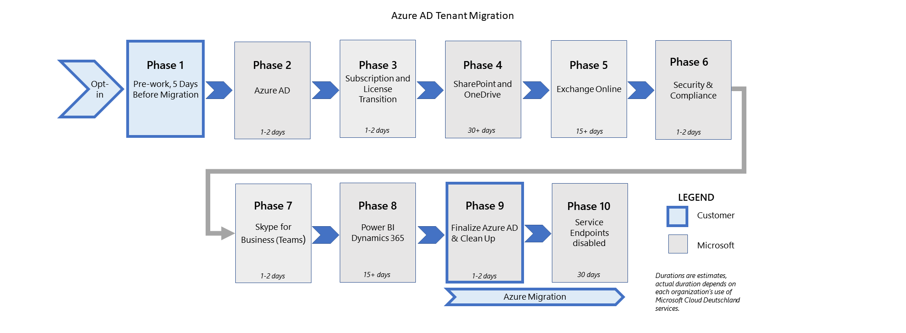

# Миграция фазы действий и последствий для миграции из Microsoft Cloud Deutschland (общие)Migration phases actions and impacts for the migration from Microsoft Cloud Deutschland (general)

Миграции клиентов из Microsoft Cloud Deutschland в немецкий регион служб Microsoft Office 365 выполняются в наборе этапов и их настроенных действий для каждой рабочей нагрузки.Tenant migrations from Microsoft Cloud Deutschland to the Germany region of Microsoft's Office 365 services are executed as a set of phases and their configured actions for each workload. На этом рисунке показаны девять этапов миграции в новые немецкие центр обработки данных.This figure shows the nine phases of migration to the new German datacenters.

Этапы и их действия обеспечивают перенос критически важных данных и опытом в службы Office 365.The phases and their actions ensure that critical data and experiences are migrated to the Office 365 services. После того как клиент будет добавлен в очередь миграции, каждая рабочая нагрузка будет выполнена в качестве набора действий, выполняемых в службе backend.After your tenant is added to the migration queue, each workload will be completed as a set of steps that are executed on the backend service. Некоторые рабочие нагрузки могут требовать действий администратора (или пользователя), или миграция может повлиять на использование для этапов, которые выполняются и обсуждаются в How [is the migration organized?](ms-cloud-germany-transition.md#how-is-the-migration-organized)Some workloads may require actions by the administrator (or user), or the migration may affect usage for the phases that are executed and discussed in [How is the migration organized?](ms-cloud-germany-transition.md#how-is-the-migration-organized)

В следующих разделах содержатся действия и эффекты для рабочих нагрузок по мере их выполнения на различных этапах миграции.The following sections contain actions and effects for workloads as they progress through various phases of the migration. Просмотрите таблицы и определите, какие действия или эффекты применимы к вашей организации.Review the tables and determine which actions or effects are applicable to your organization. Убедитесь, что вы готовы выполнить необходимые действия на соответствующих этапах.Ensure that you're prepared to execute the steps in the respective phases as required. Невыполнение необходимых действий может привести к сбою в работе служб и задержке завершения миграции в службы Office 365.Failure to complete necessary steps may result in service outage and might delay completion of the migration to the Office 365 services.

## SharePoint Online (этап 4 из 9)SharePoint Online (Phase 4 of 9)

| Step(s)Step(s) | ОписаниеDescription | Область примененияApplies to | ВлияниеImpact |
|:-------|:-----|:-------|:-------|
| SharePoint и OneDrive переходят.SharePoint and OneDrive are transitioned. | На этом этапе SharePoint и OneDrive переносят из Microsoft Cloud Deutschland в службы Office 365.SharePoint and OneDrive are migrated from Microsoft Cloud Deutschland to Office 365 services in this phase. Существующие URL-адреса Microsoft Cloud Deutschland сохраняются (например, `contoso.sharepoint.de` ).Existing Microsoft Cloud Deutschland URLs are preserved (for example, `contoso.sharepoint.de`). Маркеры, которые были выданы службами Microsoft Cloud Deutschland или Office 365, действительны во время перехода.Tokens that were issued by Microsoft Cloud Deutschland or Office 365 services are valid during the transition. | Клиенты SharePointSharePoint customers | - Содержимое будет читаться только в течение двух кратких периодов во время миграции.- Content will be read-only for two brief periods during migration. В течение этого времени следует ожидать баннера "Вы не можете изменить контент" в SharePoint.During this time, expect a "you can't edit content" banner in SharePoint.    — Индекс поиска не будет сохранен и может потребоваться до 10 дней для повторного отстройки.- The search index won't be preserved, and may take up to 10 days to be rebuilt.    - Контент SharePoint/OneDrive будет читаться только в течение двух кратких периодов во время миграции.- SharePoint/OneDrive content will be read-only for two brief periods during migration. В течение этого времени пользователи увидят баннер "You can't edit content".Users will see a "you can't edit content" banner briefly during this time.    - Индекс поиска может быть недоступен при восстановлении индекса.- The search index may be unavailable while the index is rebuilt. В течение этого периода поисковые запросы могут не возвращать полные результаты.During this period, search queries might not return complete results.    - Существующие сайты сохраняются.- Existing sites are preserved. |
|||||

Дополнительные соображения:Additional considerations:

- После завершения миграции SharePoint Online в регион в Германии будут перестроены только индексы данных.Upon completion of the SharePoint Online migration to the German region, data indexes are rebuilt. Функции, зависящие от индексов поиска, могут быть затронуты во время завершения реиндексации.Features that are dependent on search indexes may be affected while reindexing completes.

- Если ваша организация по-прежнему использует рабочий процесс SharePoint 2010, они больше не будут функционировать после 31 декабря 2021 г.If your organization still uses SharePoint 2010 workflows, they'll no longer function after December 31, 2021. Рабочий процесс SharePoint 2013 будет поддерживаться, хотя и отключен по умолчанию для новых клиентов с 1 ноября 2020 г.SharePoint 2013 workflows will remain supported, although turned off by default for new tenants starting on November 1, 2020. После завершения миграции в службу SharePoint Online рекомендуется перейти на Power Automate или другие поддерживаемые решения.After migration to the SharePoint Online service is complete, we recommend that you to move to Power Automate or other supported solutions.

- После завершения миграции OneDrive в немецкий регион индексы данных восстанавливаются.Upon completion of the OneDrive migration to the German region, data indexes are rebuilt. Функции, зависят от индексов поиска, могут оказаться затронутыми во время повторного реиндексинга.Features that depend on search indexes may be affected while reindexing is in progress.

- Клиентам Microsoft Cloud Deutschland, экземпляр SharePoint Online которых еще не перенесен, необходимо оставаться в модуле SharePoint Online PowerShell/Microsoft.SharePointOnline.CSOM версии 16.0.20616.12000 или ниже.Microsoft Cloud Deutschland customers whose SharePoint Online instance is not yet migrated need to stay on SharePoint Online PowerShell module/Microsoft.SharePointOnline.CSOM version 16.0.20616.12000 or below. В противном случае подключение к SharePoint Online с помощью PowerShell или клиентской объектной модели не удастся.Otherwise, connections to SharePoint Online via PowerShell or the client-side object model will fail.

- Клиенты Microsoft Cloud Deutschland, чьи экземпляры SharePoint Online перенесены, должны обновить модуль PowerShell SharePoint Online/Microsoft.SharePointOnline.CSOM до версии 16.0.20717.12000 или выше.Microsoft Cloud Deutschland customers whose SharePoint Online instance is migrated must update SharePoint Online PowerShell module/Microsoft.SharePointOnline.CSOM to version 16.0.20717.12000 or above. В противном случае подключение к SharePoint Online с помощью PowerShell или клиентской объектной модели не удастся.Otherwise, connections to SharePoint Online via PowerShell or the client-side object model will fail.

## Exchange Online (этап 5 из 9)Exchange Online (Phase 5 of 9)

| Step(s)Step(s) | ОписаниеDescription | Область примененияApplies to | ВлияниеImpact |
|:-------|:-----|:-------|:-------|
| К существующей организации добавляется регион Новая Германия, а почтовые ящики перемещаются в службы Office 365.New Germany region is added to existing organization setup and mailboxes are moved to Office 365 services. | Конфигурация Exchange Online добавляет новый локальный немецкий регион в организацию перехода.Exchange Online configuration adds the new go-local German region to the transitioning organization. Этот регион служб Office 365 заданной как по умолчанию, что позволяет внутренней службе балансировки нагрузки перераспределять почтовые ящики в соответствующий регион по умолчанию в службах Office 365.This Office 365 services region is set as default, which enables the internal load-balancing service to redistribute mailboxes to the appropriate default region in Office 365 services. В этом переходе пользователи с обеих сторон (службы Германии или Office 365) находятся в одной организации и могут использовать конечную точку URL-адреса.In this transition, users on either side (Germany or Office 365 services) are in the same organization and can use either URL endpoint. | Exchange OnlineExchange Online | - Переход пользователей и служб из старых URL-адресов Германии (outlook.office.de) в новые URL-адреса служб Office 365 ( `https://outlook.office365.com` ).- Transition users and services from your legacy Germany URLs (outlook.office.de) to new Office 365 services URLs (`https://outlook.office365.com`).    - Пользователи могут продолжать получать доступ к службе с помощью устаревших URL-адресов Германии во время миграции, однако после завершения миграции им необходимо прекратить использование устаревших URL-адресов.- Users may continue to access the service through legacy Germany URLs during the migration, however they need to stop using the legacy URLs on completion of the migration.    - Пользователи должны перейти на использование всемирного портала Office для функций Office Online (Calendar, Mail, People).- Users should transition to using the worldwide Office portal for Office Online features (Calendar, Mail, People). Навигация по службам, которые еще не перенесены в службы Office 365, не будет работать, пока они не будут перенесены.Navigation to services that aren't yet migrated to Office 365 services won't function until they are migrated.    - Outlook Web App не предоставляет доступ к общедоступным папкам во время миграции.- The Outlook Web App won't provide the public folder experience during migration. |
| Обновление настраиваемого DNS-параметров для автооткрытияUpdate custom DNS Settings for AutoDiscover| Управляемые клиентом DNS-параметры для autoDiscover, которые в настоящее время указывают на Microsoft Cloud Deutschland, необходимо обновить, чтобы указать на Office 365 по завершении этапа Exchange Online (этап 5).Customer-managed DNS settings for AutoDiscover that currently point to Microsoft Cloud Deutschland need to be updated to point to Office 365 on completion of the Exchange Online phase (phase 5).   Существующие записи DNS с CNAME с autodiscover-outlook.office.de необходимо обновить, чтобы указать на autodiscover.outlook.com.Existing DNS entries with CNAME pointing to autodiscover-outlook.office.de need to updated to point to autodiscover.outlook.com. | Exchange OnlineExchange Online | Запросы на доступность и вызовы обнаружения служб с помощью точки автоматического обнаружения непосредственно в службы Office 365.Availability requests and service discovery calls via AutoDiscover point directly to the Office 365 services. Клиенты, которые не выполняют эти обновления DNS, могут испытывать проблемы со службой автооткрытия после завершения миграции.Customers who do not perform these DNS updates may experience Autodiscover service issues when the migration is finalized. |
|||||

Дополнительные соображения:Additional considerations:

- `myaccount.msft.com` будет работать только после сокращения Office 365.`myaccount.msft.com` will only work after the cutover of Office 365. Ссылки будут производить "что-то пошло не так" сообщения об ошибках до этого времени.Links will produce "something went wrong" error messages until that time.

- Пользователям Outlook Web App, которые имеют доступ к общему почтовому ящику в другой среде (например, пользователь в среде Германии получает доступ к общему почтовому ящику в глобальной среде), будет предложено проверить подлинность во второй раз.Users of Outlook Web App that access a shared mailbox in the other environment (for example, a user in the Germany environment accesses a shared mailbox in the global environment) will be prompted to authenticate a second time. Пользователь должен сначала проверить подлинность и получить доступ к своему почтовому ящику, а затем открыть общий почтовый `outlook.office.de` ящик, который находится `outlook.office365.com` в .The user must first authenticate and access their mailbox in `outlook.office.de`, then open the shared mailbox that is in `outlook.office365.com`. При доступе к общим ресурсам, которые находятся в другой службе, им потребуется второй раз проверить подлинность.They'll need to authenticate a second time when accessing the shared resources that are hosted in the other service.

- Для существующих клиентов Microsoft Cloud Deutschland или для тех, кто находится в переходном периоде, когда общий почтовый ящик добавляется в Outlook с помощью Файла > **Info > Добавление** учетной записи, просмотр разрешений календаря может привести к сбою (клиент Outlook пытается использовать API `https://outlook.office.de/api/v2.0/Me/Calendars` rest.) Клиенты, которые хотят добавить учетную запись для просмотра разрешений календаря, могут добавить ключ реестра, как описано в изменениях пользовательского опыта для общего доступа к календарю в [Outlook,](https://support.microsoft.com/office/user-experience-changes-for-sharing-a-calendar-in-outlook-5978620a-fe6c-422a-93b2-8f80e488fdec) чтобы убедиться, что это действие будет успешным.For existing Microsoft Cloud Deutschland customers or those in transition, when a shared mailbox is added to Outlook by using **File > Info > Add Account**, viewing calendar permissions may fail (the Outlook client attempts to use the Rest API `https://outlook.office.de/api/v2.0/Me/Calendars`.) Customers who want to add an account to view calendar permissions can add the registry key as described in [User experience changes for sharing a calendar in Outlook](https://support.microsoft.com/office/user-experience-changes-for-sharing-a-calendar-in-outlook-5978620a-fe6c-422a-93b2-8f80e488fdec) to ensure this action will succeed. Этот ключ реестра можно развернуть по всей организации с помощью групповой политики.This registry key can be deployed organization-wide by using Group Policy.

- На этапе миграции с помощью cmdlets PowerShell **New-migrationEndpoint,** **Set-MigrationEndpoint** и **Test-MigrationsServerAvailability** могут привести к ошибкам (ошибка в прокси-сервере).During the migration phase, using the PowerShell cmdlets **New-migrationEndpoint**, **Set-MigrationEndpoint**, and **Test-MigrationsServerAvailability** can result in errors (error on proxy). Это происходит, когда почтовый ящик арбитража мигрирует во всем мире, но почтовый ящик администратора не имеет или наоборот.This happens when the arbitration mailbox has migrated to worldwide but the admin mailbox hasn't or vice-versa. Чтобы устранить это, создав сеанс PowerShell клиента, используйте почтовый ящик арбитража в качестве подсказки маршрутивки **в ConnectionUri**.To resolve this, while creating the tenant PowerShell session, use the arbitration mailbox as the routing hint in the **ConnectionUri**. Пример: `New-PSSession -ConfigurationName Microsoft.Exchange -ConnectionUri "https://outlook.office365.com/powershell-liveid?email=Migration.8f3e7716-2011-43e4-96b1-aba62d229136@TENANT.onmicrosoft.de" -Credential $UserCredential -Authentication Basic -AllowRedirection`For example: `New-PSSession -ConfigurationName Microsoft.Exchange -ConnectionUri "https://outlook.office365.com/powershell-liveid?email=Migration.8f3e7716-2011-43e4-96b1-aba62d229136@TENANT.onmicrosoft.de" -Credential $UserCredential -Authentication Basic -AllowRedirection`

- Если вы используете гибрид Exchange Online:If you're using Exchange Online hybrid:

    - Клиенты Exchange Online Hybrid должны выполнить мастер гибридной конфигурации (HCW) несколько раз в рамках этого перехода.Exchange Online Hybrid customers must execute the Hybrid Configuration wizard (HCW) multiple times as part of this transition. Перед началом **5-го** этапа миграции любой гибридный клиент Exchange Online должен запустить последнюю версию режима HCW в Office 365 Germany для подготовки локальной конфигурации для миграции в Office 365 глобальной.**Before the migration step phase 5 begins,** any Exchange Online hybrid customer needs to run the latest version of the HCW in Office 365 Germany mode to prepare on-premises configuration for the migration to Office 365 global. После завершения фазы **миграции 5** (после публикации уведомления Центра сообщений) необходимо запустить HCW с использованием параметров Office 365 по всему миру, чтобы указать локальной системе глобальную службу.On **completion of the migration phase 5** (when the Message Center notice is published), you need to run the HCW against using Office 365 Worldwide settings to point your on-premises systems to the global service. Дополнительные обновления DNS могут потребоваться, если вы используете настраиваемые домены.Additional DNS updates may be required if you use custom domains.

Чтобы узнать больше о различиях для организаций в миграции и после переноса ресурсов Exchange Online, просмотрите сведения в клиентском опыте во время миграции в [службы Office 365](ms-cloud-germany-transition-experience.md)в новых немецких регионах центра обработки данных.To find out more about the differences for organizations in migration and after Exchange Online resources are migrated, review the information in [Customer experience during the migration to Office 365 services in the new German datacenter regions](ms-cloud-germany-transition-experience.md).

## Exchange Online Protection (этап 6 из 9)Exchange Online Protection (Phase 6 of 9)

Функции back-end Exchange Online Protection (EOP) копируется в новом регионе Германии.Back-end Exchange Online Protection (EOP) features are copied to new Germany region. 

| Step(s)Step(s) | ОписаниеDescription | Область примененияApplies to | ВлияниеImpact |
|:-------|:-----|:-------|:-------|
| Миграция маршрутов Exchange Online и исторических сообщений.Migration of Exchange Online routing and historical message detail. | Exchange Online включает маршрутику из внешних хостов в Office 365.Exchange Online enables routing from external hosts to Office 365. Внешние записи MX переходят на маршрут в службу EOP.The external MX records are transitioned to route to the EOP service. Конфигурация клиента и исторические сведения переносились.Tenant configuration and historical details are migrated. | Клиенты Exchange OnlineExchange Online customers | - Записи DNS, управляемые Корпорацией Майкрософт, обновляются с office 365 Germany EOP до служб Office 365.- Microsoft–managed DNS entries are updated from Office 365 Germany EOP to Office 365 services.    - Клиенты должны ждать в течение 30 дней после двойной записи EOP для миграции EOP.- Customers should wait for 30 days after EOP dual write for EOP migration. В противном случае может возникнуть потеря данных.Otherwise, there may be data loss. |
|||||

## Skype для бизнеса Online (этап 7 из 9)Skype for Business Online (Phase 7 of 9)

| Step(s)Step(s) | ОписаниеDescription | Область примененияApplies to | ВлияниеImpact |
|:-------|:-----|:-------|:-------|
| Миграция Skype для бизнеса в teams.Migration of Skype for Business to Teams. | Существующие клиенты Skype для бизнеса перенаселяются в службы Office 365 в Европе, а затем переходят в Microsoft Teams в германии, где работают службы Office 365.Existing Skype for Business customers are migrated to Office 365 services in Europe and then transitioned to Microsoft Teams in the Germany region of Office 365 services. | Клиенты Skype для бизнесаSkype for Business customers | - Пользователи не смогут войти в Skype для бизнеса в день миграции.- Users won't be able to sign in to Skype for Business on the migration date. За десять дней до миграции мы выпустим сообщение в центр администрирования, чтобы вы знали о том, когда миграция будет происходить, и снова, когда мы начнем миграцию.Ten days before migration, we'll post to the Admin center to let you know about when the migration will take place, and again when we begin the migration.    - Конфигурация политики перенесена.- Policy configuration is migrated.    - Пользователи будут перенесены в Teams и больше не будут иметь Skype для бизнеса после миграции.- Users will be migrated to Teams and will no longer have Skype for Business after migration.    - Пользователи должны иметь настольный клиент Teams установлен.- Users must have the Teams desktop client installed. Установка будет происходить в течение 10 дней с помощью политики в инфраструктуре Skype для бизнеса, но если это не удастся, пользователям все равно потребуется скачать клиента или подключиться к поддерживаемому браузеру.Installation will happen during the 10 days via policy on the Skype for Business infrastructure, but if this fails, users will still need to download the client or connect with a supported browser.    - Контакты и собрания будут перенесены в Teams.- Contacts and meetings will be migrated to Teams.    - Пользователи не смогут войти в Skype для бизнеса между переходами службы времени на службы Office 365 и только после завершения записей DNS клиента.- Users won't be able to sign in to Skype for Business between time service transitions to Office 365 services, and not until customer DNS entries are completed.    - Контакты и существующие собрания будут по-прежнему функционировать в качестве собраний Skype для бизнеса.- Contacts and existing meetings will continue to function as Skype for Business meetings. |
|||||

## Приложения Office (фаза 8 из 9)Office Apps (Phase 8 of 9)

| Step(s)Step(s) | ОписаниеDescription | Область примененияApplies to | ВлияниеImpact |
|:-------|:-----|:-------|:-------|
| Клиенты, Office Online во время сокращения клиентской сети Office, Azure AD завершает область клиента, чтобы указать на службы Office 365.Clients, Office Online during Office client cutover, Azure AD finalizes the tenant scope to point to the Office 365 services. | Это изменение конфигурации позволяет клиентам Office обновлять и указать конечные точки служб Office 365.This configuration change enables Office clients to update and point to the Office 365 services endpoints. | Все клиенты OfficeAll Office customers | - Уведомите пользователей о закрытии всех _приложений_ Office, а затем во входе (или принудить клиентов к перезапуску и входу пользователей), чтобы клиенты Office могли получить изменения.- Notify users to close _all_ Office apps and then sign back in (or force clients to restart and users to sign in) to enable Office clients to pick up the change.    - Оповещайте пользователей  и сотрудников службы поддержки о том, что пользователи могут видеть баннер Office, который побуждает их активировать приложения Office в течение 72 часов после отключения.- Notify users and help desk staff that users *may* see an Office banner that prompts them to reactivate Office apps within 72 hours of the cutover.    - Все приложения Office на персональных машинах должны быть закрыты, а пользователи должны зарегистрироваться, а затем снова войти.- All Office applications on personal machines must be closed, and users must sign out then sign in again. В панели активации Yellow включайся, чтобы активировать службы Office 365.In the Yellow activation bar, sign in to reactivate against Office 365 services.    — Для общих машин потребуются действия, аналогичные персональным машинам, и не требуется специальная процедура.- Shared machines will require actions that are similar to personal machines, and won't require a special procedure.    — На мобильных устройствах пользователи должны выйти из приложений, закрыть их и снова войти.- On mobile devices, users must sign out of apps, close them, and then sign in again. |
|||||

## Службы OfficeOffice Services

Самая недавно используемая служба (MRU) в Office — это переход от службы Германии к службам Office 365, а не миграция.The most recently used (MRU) service in Office is a cutover from the Germany service to Office 365 services, not a migration. Только ссылки на MRU со стороны служб Office 365 будут видны после миграции с Office.com портала.Only MRU links from the Office 365 services side will be visible after migration from the Office.com portal. Ссылки на MRU из службы Германии не видны как ссылки MRU в службах Office 365.MRU links from the Germany service aren't visible as MRU links in Office 365 services. В Office 365 ссылки MRU доступны только после завершения миграции клиента.In Office 365, MRU links are accessible only after the tenant migration is complete.

## ПодпискаSubscription

| Step(s)Step(s) | ОписаниеDescription | Область примененияApplies to | ВлияниеImpact |
|:-------|:-----|:-------|:-------|
| Мы не можем перенести клиентов без согласия.We can't migrate customers without consent. | Корпорация Майкрософт получает право на перенос одним из двух способов, что позволяет Корпорации Майкрософт организовать переход данных и служб в экземпляр служб Office 365.Microsoft gains the right to migrate in one of two ways, which enables Microsoft to orchestrate the transition of data and services to the Office 365 services instance.   Администратор выбирает миграцию, вызванную Microsoft.The admin opts-in to the Microsoft-driven migration.   Клиенты возобновляют подписки в клиенте Microsoft Cloud Deutschland после 1 мая 2020 г.Customers renew any subscriptions in their Microsoft Cloud Deutschland tenant after May 1, 2020. Мы будем уведомлять этих клиентов о переносе каждый месяц, ждать 30 дней, чтобы дать клиентам возможность отменить, а затем непосредственно выбрать, отслеживается в ICM.We'll notify these customers of the migration right each month, wait 30 days to give customers a chance to cancel, and then directly opt-in, tracked in ICM. | Все клиенты OfficeAll Office Customers | - Клиент помечен как согласие на миграцию, а Центр администрирования отображает подтверждение.- Tenant is marked as consented for migration, and Admin Center displays confirmation.    - Подтверждение размещено в Cloud Germany Message Center Tenant.- Acknowledgment is posted to Cloud Germany Message Center Tenant. Конфигурация службы продолжается с конечных точек Microsoft Cloud Deutschland.Service configuration continues from Microsoft Cloud Deutschland endpoints.    - Монитор Центра сообщений для обновления состояния фазы миграции.- Monitor Message Center for updates on Migration phase status. |
| Подписки передаются, а лицензии перенаправяются.Subscriptions are transferred, and licenses are reassigned. | После перехода клиента на службы Office 365 соответствующие подписки на службы Office 365 приобретаются для переданных подписки Microsoft Cloud Deutschland.After the tenant is transitioned to Office 365 services, corresponding Office 365 services subscriptions are purchased for the transferred Microsoft Cloud Deutschland subscriptions. Пользователям с назначенными лицензиями Microsoft Cloud Deutschland будут назначены лицензии на службы Office 365.Users with assigned Microsoft Cloud Deutschland licenses will be assigned Office 365 services licenses. Устаревшие подписки Microsoft Cloud Deutschland удаляются из клиента служб Office 365 по завершении.Legacy Microsoft Cloud Deutschland subscriptions are removed from the Office 365 services tenant on completion. | Все клиенты OfficeAll Office customers | - Изменения существующих подписок будут заблокированы (например, на этом этапе не будут внесены новые покупки или изменения в расстановку мест).- Changes to existing subscriptions will be blocked (for example, no new subscription purchases or seat count changes) during this phase.    — Изменения назначения лицензий будут заблокированы.- License assignment changes will be blocked.    - Подписка Microsoft Cloud Deutschland будет перенесена на соответствующую подписку на службы Office 365.- The Microsoft Cloud Deutschland subscription will be migrated to corresponding Office 365 services subscription. Предложение служб Office 365 для этой подписки определяется Корпорацией Майкрософт (также известное как _сопоставление предложений)._The Office 365 services offer of that subscription is defined by Microsoft (also known as _Offer mapping_).    — Количество функций (планов служб), предлагаемых службами Office 365, может быть больше, чем в первоначальном предложении Microsoft Cloud Deutschland.- The number of features (service plans) offered by Office 365 services can be larger than in the original Microsoft Cloud Deutschland offer. Лицензии пользователей в службах Office 365 будут эквивалентны аналогичным функциям Microsoft Cloud Deutschland (планы обслуживания).User licenses in Office 365 services will be equivalently assigned to similar Microsoft Cloud Deutschland features (service plans). Пользовательские лицензии всех пользователей будут автоматически назначены новым функциям.User licenses of all users will be automatically assigned to the new features. Администратору необходимо принять явное действие, чтобы отключить эти лицензии, если это необходимо.The admin needs to take an explicit action to disable those licenses, if needed.    - По завершению миграции подписок на портал администрирования Office 365 будут видны как службы Office 365, так и подписки в Германии. - When subscription migration is complete, both Office 365 services and Germany subscriptions will be visible in the Office 365 Admin Portal, with the status of Germany subscriptions as _deprovisioned_.    — Пользователям будут назначены лицензии, привязанные к новым подпискам на службы Office 365.- Users will be reassigned licenses that are tied to the new Office 365 services subscriptions. Любые процессы клиентов, которые имеют зависимости от подписок в Германии или GUID-интерфейсов SKU, будут нарушены, и их необходимо пересмотреть с помощью служб Office 365.Any customer processes that have dependencies on Germany subscriptions or SKU GUIDs will be broken and need to be revised with the Office 365 services offering.    - Новые подписки в службах Office 365 будут приобретены с новым термином (ежемесячно/ежеквартно/ежегодно), и клиент получит удвоинный возврат за неиспользованный баланс подписки Microsoft Cloud Deutschland.- New subscriptions in the Office 365 services will be purchased with the new term (monthly/quarterly/yearly), and the customer will receive a prorated refund for the unused balance of the Microsoft Cloud Deutschland subscription.    - Клиенты партнеров Microsoft Cloud Deutschland не будут перенесены.- Partner Microsoft Cloud Deutschland tenants won't be migrated. Клиенты CSP будут перенесены в службы Office 365 в соответствии с новым клиентом служб Office 365 того же партнера.CSP customers will be migrated to Office 365 services under the new Office 365 services tenant of the same partner. После миграции клиента партнер может управлять этим клиентом только из клиента служб Office 365.After customer migration, the partner can manage this customer only from the Office 365 services tenant.    — Дополнительные функции доступны (например, Microsoft Planner и Microsoft Flow), если только администратор клиента не отключит их. Сведения о том, как отключить планы служб, назначаемые лицензиям пользователей, см. в документе Отключение доступа к службам [Microsoft 365](disable-access-to-services-while-assigning-user-licenses.md)при назначении лицензий пользователей.- Additional functionality is available (for example, Microsoft Planner and Microsoft Flow), unless disabled by tenant admin. For information about how to disable service plans that are assigned to users' licenses, see [Disable access to Microsoft 365 services while assigning user licenses](disable-access-to-services-while-assigning-user-licenses.md).  |
|||||

## Следующий этапNext step

[Выполнение дополнительной предварительной работыPerform additional pre-work](ms-cloud-germany-transition-add-pre-work.md)

## Дополнительные сведенияMore information

Начало работы:Getting started:

- [Миграция из Microsoft Cloud Deutschland в службы Office 365 в новых регионах центра обработки данных в ГерманииMigration from Microsoft Cloud Deutschland to Office 365 services in the new German datacenter regions](ms-cloud-germany-transition.md)
- [Помощь по миграции Microsoft Cloud DeutschlandMicrosoft Cloud Deutschland Migration Assistance](https://aka.ms/germanymigrateassist)
- [Как принять участие в миграцииHow to opt-in for migration](ms-cloud-germany-migration-opt-in.md)
- [Опыт работы с клиентами во время миграцииCustomer experience during the migration](ms-cloud-germany-transition-experience.md)

Перемещение по переходу:Moving through the transition:

- [Дополнительная предварительная работаAdditional pre-work](ms-cloud-germany-transition-add-pre-work.md)
- Дополнительные сведения [для Azure AD,](ms-cloud-germany-transition-azure-ad.md) [устройств,](ms-cloud-germany-transition-add-devices.md) [опытом](ms-cloud-germany-transition-add-experience.md)и [AD FS.](ms-cloud-germany-transition-add-adfs.md)Additional information for [Azure AD](ms-cloud-germany-transition-azure-ad.md), [devices](ms-cloud-germany-transition-add-devices.md), [experiences](ms-cloud-germany-transition-add-experience.md), and [AD FS](ms-cloud-germany-transition-add-adfs.md).

Облачные приложения:Cloud apps:

- [Сведения о программе миграции Dynamics 365Dynamics 365 migration program information](https://aka.ms/d365ceoptin)
- [Сведения о программе миграции Power BIPower BI migration program information](https://aka.ms/pbioptin)
- [Начало перехода на Microsoft TeamsGetting started with your Microsoft Teams upgrade](https://aka.ms/SkypeToTeams-Home)
