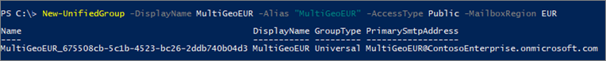

# <a name="create-a-microsoft-365-group-with-a-specific-pdl"></a><span data-ttu-id="0a96c-103">Создание группы Microsoft 365 с определенным PDL</span><span class="sxs-lookup"><span data-stu-id="0a96c-103">Create a Microsoft 365 Group with a specific PDL</span></span>

<span data-ttu-id="0a96c-104">Когда пользователи в среде с несколькими географическими средами создают группу Microsoft 365, предпочтительное расположение данных группы автоматически устанавливается для пользователя.</span><span class="sxs-lookup"><span data-stu-id="0a96c-104">When users in a multi-geo environment create a Microsoft 365 Group, the group preferred data location is automatically set to that of the user.</span></span> <span data-ttu-id="0a96c-105">Глобальные администраторы, администраторы SharePoint и Exchange могут создавать группы в любом выбранном регионе.</span><span class="sxs-lookup"><span data-stu-id="0a96c-105">Global, SharePoint, and Exchange Administrators can create groups in any region they select.</span></span> 

<span data-ttu-id="0a96c-106">Если нужно создать группу с определенным PDL, можно использовать Центр администрирования SharePoint или командлет Microsoft PowerShell New-UnifiedGroup для Exchange Online.</span><span class="sxs-lookup"><span data-stu-id="0a96c-106">If you need to create a group with a specific PDL, you can do that using from the SharePoint admin center or through the Exchange Online New-UnifiedGroup Microsoft PowerShell cmdlet.</span></span> <span data-ttu-id="0a96c-107">При этом как почтовый ящик группы, так и сайт SharePoint, связанный с группой, подготавливаются в указанном предпочтительном расположении данных (PDL).</span><span class="sxs-lookup"><span data-stu-id="0a96c-107">When you do this, both the group mailbox and SharePoint site associated with the group will be provisioned in the specified PDL.</span></span>

<span data-ttu-id="0a96c-108">Чтобы создать группу Microsoft 365 с указанием PDL, перейдите в Центр администрирования SharePoint в географическом расположении, где вы хотите создать сайт группы.</span><span class="sxs-lookup"><span data-stu-id="0a96c-108">To create a Microsoft 365 Group with the PDL that you specify, go to the SharePoint admin center in the geo location where you want to create the group site.</span></span>

<span data-ttu-id="0a96c-109">Пример:</span><span class="sxs-lookup"><span data-stu-id="0a96c-109">For example:</span></span>

<span data-ttu-id="0a96c-110">Если нужно создать сайт группы в Австралии, вы можете перейти на страницу https://ContosoAUS-admin.sharepoint.com/_layouts/15/online/AdminHome.aspx#/siteManagement</span><span class="sxs-lookup"><span data-stu-id="0a96c-110">If you want to create a group site in your Australia location, you can go to https://ContosoAUS-admin.sharepoint.com/_layouts/15/online/AdminHome.aspx#/siteManagement</span></span>

1. <span data-ttu-id="0a96c-111">Нажмите **+ Создать**.</span><span class="sxs-lookup"><span data-stu-id="0a96c-111">Select **+ Create**.</span></span>
2. <span data-ttu-id="0a96c-112">Следуйте инструкциям, чтобы создать сайт группы.</span><span class="sxs-lookup"><span data-stu-id="0a96c-112">Follow the process to create a group site.</span></span>

<span data-ttu-id="0a96c-113">Сайт группы будет подготовлен в географическом расположении, соответствующем Центру администрирования SharePoint, из которого вы отправили запрос на создание сайта.</span><span class="sxs-lookup"><span data-stu-id="0a96c-113">Your group site will be provisioned in the geo location corresponding to the SharePoint admin center from which you initiated the site creation request.</span></span> 

<span data-ttu-id="0a96c-114">Использование Exchange PowerShell</span><span class="sxs-lookup"><span data-stu-id="0a96c-114">Using Exchange PowerShell</span></span> 

<span data-ttu-id="0a96c-115">Подключитесь к Exchange Online PowerShell и передайте параметр *- MailBoxRegion* с кодом региона.</span><span class="sxs-lookup"><span data-stu-id="0a96c-115">Connect to Exchange Online PowerShell and pass the parameter *-MailBoxRegion* with the geo location code.</span></span>

<span data-ttu-id="0a96c-116">Пример:</span><span class="sxs-lookup"><span data-stu-id="0a96c-116">For example:</span></span> 

```PowerShell
New-UnifiedGroup -DisplayName MultiGeoEUR -Alias "MultiGeoEUR" -AccessType Public -MailboxRegion EUR 
```



<span data-ttu-id="0a96c-118">Обратите внимание, что подготовка сайта группы SharePoint выполняется по запросу.</span><span class="sxs-lookup"><span data-stu-id="0a96c-118">Note that SharePoint group site provisioning is on-demand.</span></span> <span data-ttu-id="0a96c-119">В первый раз сайт будет подготовлен владельцем группы или участником, пытающимся получить к нему доступ.</span><span class="sxs-lookup"><span data-stu-id="0a96c-119">The site will be provisioned the first time a group owner or member attempts to access it.</span></span>

## <a name="geo-location-codes"></a><span data-ttu-id="0a96c-120">Коды регионов</span><span class="sxs-lookup"><span data-stu-id="0a96c-120">Geo location codes</span></span>

[!INCLUDE [Microsoft 365 Multi-Geo locations](../includes/microsoft-365-multi-geo-locations.md)]

## <a name="related-topics"></a><span data-ttu-id="0a96c-121">Связанные статьи</span><span class="sxs-lookup"><span data-stu-id="0a96c-121">Related topics</span></span>

[<span data-ttu-id="0a96c-122">Подключение к PowerShell Exchange Online</span><span class="sxs-lookup"><span data-stu-id="0a96c-122">Connect to Exchange Online PowerShell</span></span>](https://docs.microsoft.com/powershell/exchange/connect-to-exchange-online-powershell)
