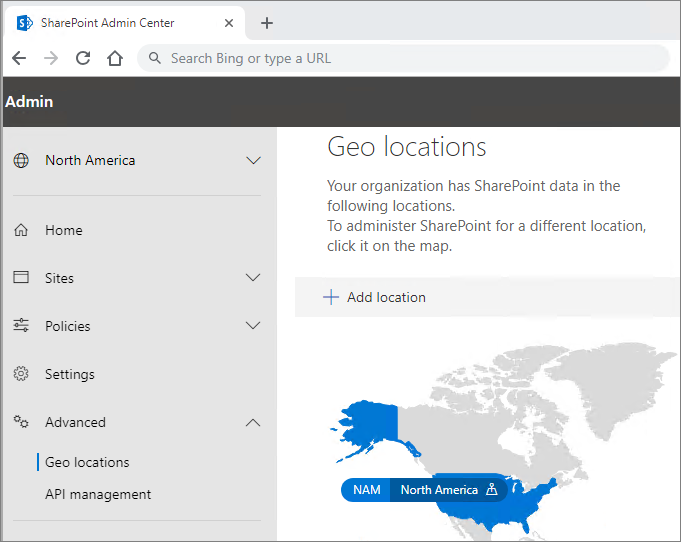

# Поддержка нескольких регионов в OneDrive и SharePoint OnlineMulti-Geo Capabilities in OneDrive and SharePoint Online

Возможности multi-Geo в OneDrive и SharePoint Online позволяют управлять общими ресурсами, например сайтами SharePoint и почтовыми ящиками Microsoft 365 Group, хранимых в покое в указанном географическом расположении.Multi-Geo capabilities in OneDrive and SharePoint Online enables control of shared resources like SharePoint team sites and Microsoft 365 Group mailboxes stored at rest in a specified geo location.

У каждого пользователя, почтового ящика группы и сайта SharePoint есть предпочтительное расположение данных (PDL), обозначающее географическое расположение для хранения соответствующих данных.Each user, Group mailbox, and SharePoint site has a Preferred Data Location (PDL) which denotes the geo location where related data is to be stored. Персональные данные пользователей (почтовый ящик Exchange и OneDrive), а также любые созданные им группы Microsoft 365 или сайты SharePoint могут храниться в указанном географическом расположении для соблюдения требований к месту расположения данных.Users' personal data (Exchange mailbox and OneDrive) along with any Microsoft 365 Groups or SharePoint sites that they create can be stored in the specified geo location to meet data residency requirements. Можно [указывать разных администраторов для каждого географического расположения](add-a-sharepoint-geo-admin.md).You can [specify different administrators for each geo location](add-a-sharepoint-geo-admin.md).

Для пользователей обеспечивается удобство взаимодействия при использовании служб Microsoft 365, включая приложения Office, OneDrive и поиск.Users get a seamless experience when using Microsoft 365 services, including Office applications, OneDrive, and Search. Подробные сведения см. в статье [Взаимодействие с пользователем в среде с поддержкой нескольких регионов](multi-geo-user-experience.md).See [User experience in a multi-geo environment](multi-geo-user-experience.md) for details.

## OneDriveOneDrive

Хранилище OneDrive каждого пользователя может быть подготовлено или [перемещено администратором](move-onedrive-between-geo-locations.md) в периферийное расположение в соответствии с предпочтительным расположением данных (PDL) пользователя.Each user's OneDrive can be provisioned in or [moved by an administrator](move-onedrive-between-geo-locations.md) to a satellite location in accordance with the user's PDL. После этого личные файлы хранятся в этом географическом расположении, но ими можно делиться с пользователями из других географических расположений.Personal files are then kept in that geo location, though they can be shared with users in other geo locations.

## Сайты и группы SharePointSharePoint Sites and Groups

Функцией поддержки нескольких регионов можно управлять в Центре администрирования SharePoint.Management of the Multi-Geo feature is available through the SharePoint admin center. Подробные сведения см. в [соответствующей записи блога](https://techcommunity.microsoft.com/t5/Office-365-Blog/Now-available-Multi-Geo-in-SharePoint-and-Office-365-Groups/ba-p/263302).Detailed information can be found in the [corresponding blog post](https://techcommunity.microsoft.com/t5/Office-365-Blog/Now-available-Multi-Geo-in-SharePoint-and-Office-365-Groups/ba-p/263302).

Когда пользователь создает подключенный к группе сайт SharePoint в среде с поддержкой нескольких регионов, его значение PDL используется для определения географического расположения, в котором создается сайт и почтовый ящик связанной группы.When a user creates a SharePoint group-connected site in a multi-geo environment, their PDL is used to determine the geo location where the site and its associated Group mailbox is created. (Если значение PDL пользователя не задано или присвоено географическое расположение, не настроенное в качестве периферийного расположения, сайт и почтовый ящик создаются в центральном расположении.)(If the user's PDL value hasn't been set, or has been set to geo location that hasn't been configured as a satellite location, then the site and mailbox are created in the central location.)

Microsoft 365, кроме Exchange, OneDrive, SharePoint и Teams, не являются Multi-Geo.Microsoft 365 services other than Exchange, OneDrive, SharePoint, and Teams are not Multi-Geo. Однако Microsoft 365 группы, созданные этими службами, будут настроены с помощью PDL создателя и их Exchange группового почтового ящика, SharePoint сайт будет создан в соответствующем geo.However, Microsoft 365 Groups that are created by these services will be configured with the PDL of the creator and their Exchange Group mailbox, SharePoint site are provisioned in the corresponding geo. 

## Управление средой с поддержкой нескольких регионовManaging the multi-geo environment

Настройка и управление средой с поддержкой нескольких регионов осуществляется через Центр администрирования SharePoint.Setting up and managing your multi-geo environment is done through the SharePoint admin center. 

(Некоторые действия, например перемещение сайта SharePoint или сайта OneDrive, требуют использования Microsoft PowerShell.)(Some actions, such as moving a SharePoint site or a OneDrive site require Microsoft PowerShell.)

## См. такжеSee also

[Поддержка нескольких регионов в SharePoint и группах Microsoft 365Multi-Geo in SharePoint and Microsoft 365 Groups](https://techcommunity.microsoft.com/t5/Office-365-Blog/Now-available-Multi-Geo-in-SharePoint-and-Office-365-Groups/ba-p/263302)

[Администрирование среды с поддержкой нескольких регионовAdministering a multi-geo environment](administering-a-multi-geo-environment.md)

[Квоты хранилища SharePoint в средах с поддержкой нескольких регионовSharePoint storage quotas in multi-geo environments](sharepoint-multi-geo-storage-quota.md)

[Администрирование почтовых ящиков Exchange Online в среде с поддержкой нескольких регионовAdministering Exchange Online mailboxes in a multi-geo environment](administering-exchange-online-multi-geo.md)
