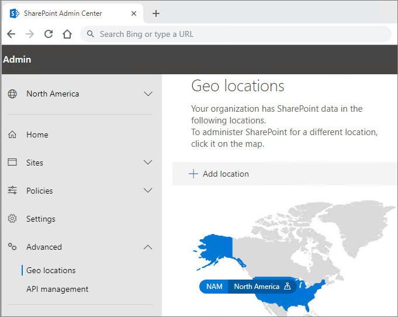

# Конфигурация клиента Microsoft 365 Multi-Geo

Прежде чем настраивать клиент Microsoft 365 Multi-Geo, прочтите статью [План для Microsoft 365 Multi-Geo](plan-for-multi-geo.md). Чтобы выполнить шаги, описанные в этой статье, вам понадобится список географических расположений, которые нужно включить в качестве периферийных расположений, а также тестовые пользователи, которых нужно подготовить к работе для этих расположений.

## Добавление поддержки нескольких регионов в план Microsoft 365 для клиента

Чтобы использовать Microsoft 365 Multi-Geo, вам понадобится план _поддержки нескольких регионов в Microsoft 365_. Вместе с сотрудниками, занимающимися учетными записями, добавьте этот план для клиента. Эти сотрудники свяжут вас с подходящим специалистом по лицензированию и помогут настроить клиент.

Обратите внимание, что план _поддержки нескольких регионов в Microsoft 365_ — это план обслуживания на уровне пользователя. Для каждого пользователя, которого нужно разместить во вспомогательном расположении, необходима лицензия. Дополнительные лицензии можно добавлять постепенно, по мере добавления пользователей во вспомогательные расположения.

Когда клиент будет подготовлен к работе с планом _поддержки нескольких регионов в Microsoft 365_, в Центрах администрирования OneDrive и SharePoint станет доступной вкладка **Географические расположения**.

## Добавление периферийных расположений к клиенту

Для каждого географического расположения, в котором нужно хранить данные, необходимо добавить периферийное расположение. Доступные географические расположения показаны в таблице ниже.

[!INCLUDE [Microsoft 365 Multi-Geo locations](../includes/microsoft-365-multi-geo-locations.md)]

Добавление периферийного расположения

1. Откройте Центр администрирования SharePoint.

2. Перейдите на вкладку **Географические расположения**.

3. Нажмите кнопку **Добавить расположение**.

4. Выберите нужное расположение и нажмите кнопку **Далее**.

5. Укажите домен, который хотите использовать для географического расположения, и нажмите кнопку **Добавить**.

6. Нажмите кнопку **Закрыть**.

В зависимости от размера клиента подготовка к работе может занять от нескольких до 72 часов. Как только подготовка вспомогательного расположения завершится, вы получите подтверждение по электронной почте. Когда новое географическое расположение отобразится в синем цвете на карте вкладки **Географические расположения** в Центре администрирования OneDrive, вы сможете перейти к настройке предпочтительного расположения данных пользователей для этого географического расположения. 

> [!IMPORTANT]
> Для нового периферийного расположения будут заданы параметры по умолчанию. Это позволит настроить его в соответствии с локальными требованиями.

## Настройка предпочтительного расположения данных пользователей
 

Настроив необходимые периферийные расположения данных, вы можете обновить учетные записи пользователей для применения соответствующих предпочтительных расположений данных. Рекомендуем задать предпочтительное расположение данных для каждого пользователя, даже если какие-то пользователи остаются в центральном расположении.

> [!IMPORTANT]
> Если для предпочтительного расположения данных пользователя задано расположение, не настроенное в качестве периферийного или центрального, система по умолчанию использует центральное расположение при подготовке сайтов OneDrive и SharePoint, а также почтовых ящиков групп.

> [!TIP]
> Прежде чем развертывать поддержку нескольких регионов для всей организации, рекомендуем начать проверки с вовлечением тестового пользователя или небольшой группы пользователей.

В Azure Active Directory (Azure AD) существует два типа объектов пользователя: синхронизированные и только облачные. Следуйте соответствующим инструкциям для вашего типа пользователей.

### Синхронизация предпочтительного расположения данных пользователя с помощью Azure AD Connect 

Если пользователи вашей организации синхронизируются с Azure AD из локальной системы Active Directory, PreferredDataLocation заполняется в AD и синхронизируется с Azure AD.

Выполните действия, описанные в разделе [Синхронизация Azure Active Directory Connect: настройка предпочтительного расположения данных для ресурсов Microsoft 365](/azure/active-directory/hybrid/how-to-connect-sync-feature-preferreddatalocation), чтобы настроить синхронизацию предпочтительного расположения данных с Azure AD из локальных доменных служб Active Directory (AD DS).

Рекомендуем включить настройку предпочтительного расположения данных пользователя в стандартный рабочий процесс создания пользователей.

> [!IMPORTANT]
> В случае новых пользователей, для которых служба OneDrive не подготовлена к работе, следует подождать по крайней мере 24 часа после синхронизации PDL пользователя с Azure AD. Это срок распространения изменений, по завершении которого пользователи смогут войти в OneDrive для бизнеса. (Настройка предпочтительного расположения данных до входа пользователя с целью подготовки к работе OneDrive для бизнеса позволяет обеспечить подготовку OneDrive в правильном расположении.)

### Настройка предпочтительного расположения данных для облачных пользователей 

Если пользователи вашей организации не синхронизируются с Azure AD из локальной системы Active Directory, то есть создаются в Microsoft 365 или Azure AD, тогда PDL задается с помощью модуля Microsoft Azure Active Directory для Windows PowerShell.

Для выполнения процедур, описанных в этом разделе, требуется [Модуль Azure Active Directory для Windows PowerShell](https://www.powershellgallery.com/packages/MSOnline/1.1.166.0). Если у вас уже установлен этот модуль, убедитесь, что он обновлен до последней версии.

1.  [Подключитесь и выполните вход](/powershell/connect-to-microsoft-365-powershell.md#connect-with-the-microsoft-azure-active-directory-module-for-windows-powershell) с помощью набора учетных данных глобального администратора для вашего клиента.

2.  Запустите командлет [Set-MsolUser](https://docs.microsoft.com/powershell/msonline/v1/set-msoluser), чтобы задать предпочтительное расположение данных для каждого из пользователей. Пример:

    `Set-MsolUser -userprincipalName Robyn.Buckley@Contoso.com -PreferredDatalocation EUR`

    Командлет Get-MsolUser позволяет проверить обновление предпочтительного расположения данных. Пример:

    `(Get-MsolUser -userprincipalName Robyn.Buckley@Contoso.com).PreferredDatalocation`

Рекомендуем включить настройку предпочтительного расположения данных пользователя в стандартный рабочий процесс создания пользователей.

> [!IMPORTANT]
> В случае новых пользователей, для которых служба OneDrive не подготовлена к работе, следует подождать по крайней мере 24 часа после настройки PDL пользователя. Это срок распространения изменений, по завершении которого пользователи смогут войти в OneDrive. (Настройка предпочтительного расположения данных до входа пользователя с целью подготовки к работе OneDrive для бизнеса позволяет обеспечить подготовку OneDrive в правильном расположении.)

## Подготовка к работе OneDrive и влияние PDL

Если у пользователя уже есть сайт OneDrive, созданный в клиенте, при настройке его PDL не будет автоматически выполняться перемещение его сайта OneDrive. Чтобы переместить сайт OneDrive пользователя, см. статью [Перемещение OneDrive для бизнеса в отношении геообъекта](move-onedrive-between-geo-locations.md). Выполните инструкции из раздела о перемещении OneDrive из одного геообъекта в другой. (Обратите внимание, что почтовый ящик Exchange пользователя не перемещается автоматически при настройке PDL пользователя.)

Если у пользователя нет сайта OneDrive в клиенте, для этого пользователя будет выполнена подготовка OneDrive к работе в соответствии со значением его PDL (при условии, что PDL пользователя соответствует одному из периферийных расположений компании).

## Настройка поиска с поддержкой нескольких регионов

Для клиента с несколькими регионами будет доступен поиск с объединением результатов, благодаря которому при отправке поискового запроса будут возвращаться данные из любого расположения клиента.

По умолчанию возвращаются объединенные результаты, даже когда каждый индекс поиска находится в пределах релевантного геообъекта, если поиск выполняется из этих точек входа:

- OneDrive для бизнеса

- Delve;

- домашняя страница SharePoint;

- центр поиска.

Кроме этого, возможности поиска с поддержкой нескольких регионов можно настроить для специальных поисковых приложений, которые используют API поиска SharePoint.

Ознакомьтесь со статьей [Настройка поиска в OneDrive для бизнеса с поддержкой нескольких регионов](configure-search-for-multi-geo.md), в которой изложены соответствующие инструкции, а также описаны ограничения и различия.

## Проверка конфигурации Microsoft 365 Multi-Geo

Ниже приведены некоторые основные варианты использования, которые можно включить в свой план проверки перед полным развертыванием Microsoft 365 Multi-Geo в организации. Выполнив эти тесты и проработав дополнительные варианты использования, подходящие для вашей организации, можно перейти к добавлению пользователей в начальную пилотную группу.

**OneDrive для бизнеса**

В средстве запуска приложений Microsoft 365 выберите OneDrive и убедитесь, что вы автоматически направляетесь к соответствующему географическому расположению пользователя с учетом PDL пользователя. Теперь должна начаться подготовка OneDrive для бизнеса в этом расположении. Когда подготовка будет завершена, попробуйте отправить и скачать несколько документов.

**Мобильное приложение OneDrive**

Войдите в мобильное приложение OneDrive, используя учетные данные тестовой учетной записи. Убедитесь, что файлы в OneDrive для бизнеса отображаются и вы можете работать с ними на мобильном устройстве.

**Клиент синхронизации OneDrive**

Убедитесь в том, что клиент синхронизации OneDrive автоматически определяет географическое расположение OneDrive для бизнеса после входа. Если вам нужно скачать клиент синхронизации, в библиотеке OneDrive выберите **Синхронизация**.

**Приложения Office**

Убедитесь, что можете войти в OneDrive для бизнеса из приложения Office, например Word. Откройте приложение Office и выберите "OneDrive – <TenantName>". Office обнаружит географическое расположение OneDrive и отобразит файлы, которые вы можете открыть.

**Общий доступ**

Попробуйте предоставить доступ к файлам в OneDrive. Убедитесь в том, что средство выбора людей показывает вам всех пользователей SharePoint Online независимо от того, каковы их географические расположения.
