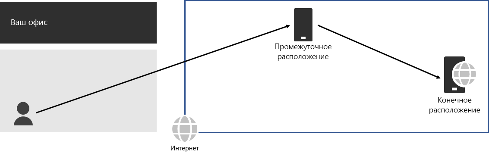
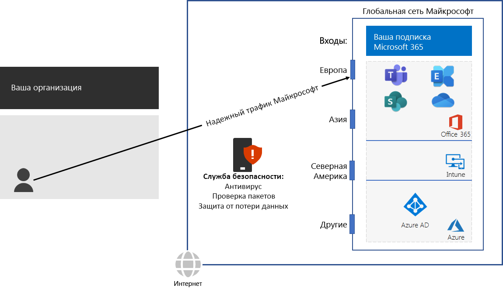

# Шаг 3. Удаление разворотов пакетовStep 3: Avoid network hairpins

*Этот шаг — обязательный; он применяется к планам E3 и E5 Microsoft 365 корпоративный.**This step is required and applies to both the E3 and E5 versions of Microsoft 365 Enterprise*

[Разворот пакетов](https://docs.microsoft.com/office365/enterprise/office-365-network-connectivity-principles#BKMK_P3) происходит, когда трафик вместо пункта назначения сначала направляется в локальный стек безопасности, брокер доступа в облако или облачный веб-шлюз.A [network hairpin](https://docs.microsoft.com/office365/enterprise/office-365-network-connectivity-principles#BKMK_P3) happens when traffic bound for a destination is first directed to another intermediate location, such as an on-premises security stack, cloud access broker, or cloud-based web gateway. Пример:Here is an example.

Разворот пакетов также может объясняться плохой маршрутизацией в Интернете из-за поставщиков сетевых услуг.A network hairpin could also be caused by poor routing on the Internet due to network service providers. 

Разворот увеличивает задержку и может перенаправлять трафик далеко от пункта назначения.A hairpin adds latency and can potentially redirect traffic to a geographically distant location.

Чтобы оптимизировать производительность для трафика в облачные службы Microsoft 365, проверьте, есть ли у поставщика локального подключения к Интернету прямой обмен трафиком с глобальной сетью Майкрософт в непосредственной близости от этого места. Эти подключения не имеют разворотов.To optimize performance for traffic to Microsoft 365 cloud-based services, check whether the ISP providing the local Internet connection has a direct peering relationship with the Microsoft Global Network in close proximity to that location. These connections do not have hairpins.

Если вы используете облачные службы безопасности сети для трафика Microsoft 365, оцените разворот пакетов и его влияние на производительность. Изучите следующие параметры:If you use cloud-based network or security services for your Microsoft 365 traffic, ensure that the hairpinning effect is evaluated and its impact on performance is understood. Examine the following:

- количество и адреса служб, через которые перенаправляется трафик, относительно своих филиалов и точек обмена трафиком глобальной сети Майкрософт;The number and locations of your service providers through which the traffic is forwarded in relationship to your branch offices and Microsoft Global Network peering points 
- качество сетевого обмена трафиком между поставщиком услуг и вашим поставщиком услуг Интернета и Майкрософт;The quality of the network peering relationship of the service provider with your ISP and Microsoft 
- влияние обратной передачи в инфраструктуре поставщика услуг на производительность.The performance impact of backhauling in the service provider infrastructure

По возможности настройте пограничные маршрутизаторы так, чтобы они передавали доверенный трафик Microsoft 365 напрямую, не перенаправляя его через стороннее облако или облачную службу безопасности сети, которая обрабатывает ваш интернет-трафик.Whenever possible, configure your edge routers to send trusted Microsoft 365 traffic directly, instead of proxying or tunneling through a third-party cloud or cloud-based network security vendor that processes your Internet traffic. 

Прежде чем переходить к следующему этапу, проверьте [условия](networking-exit-criteria.md#crit-networking-step3), при выполнении которых можно считать данный этап завершенным.As an interim checkpoint, you can see the [exit criteria](networking-exit-criteria.md#crit-networking-step3) for this step.

## Следующий шагNext step

|||
|:-------|:-----|
||[Настройка обхода трафикаConfigure traffic bypass](networking-configure-proxies-firewalls.md)|
