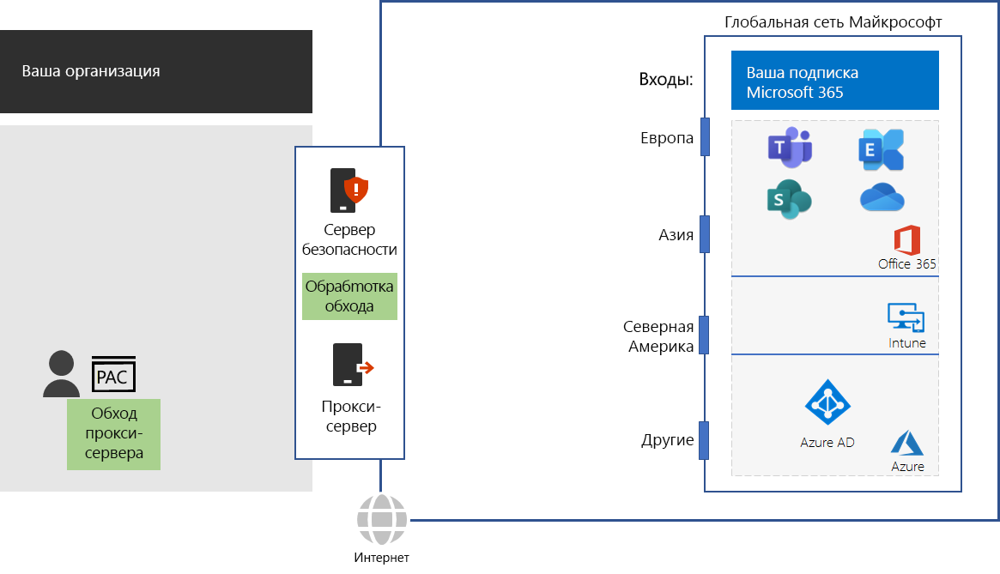

# Шаг 4. Настройка обхода трафикаStep 4: Configure traffic bypass

*Этот этап не является обязательным. Он применяется к планам E3 и E5 Microsoft 365 корпоративный.**This step is optional and applies to both the E3 and E5 versions of Microsoft 365 Enterprise*

Так как обычный интернет-трафик может быть опасным, в традиционных сетях организаций для обеспечения безопасности используются пограничные устройства, такие как прокси-серверы, устройства расшифровки и анализа SSL-трафика, устройства анализа пакетов и системы защиты от потери данных. Because general Internet traffic can be risky, typical organization networks enforce security with edge devices such as proxy servers, SSL Break and Inspect, packet inspection devices, and data loss prevention systems. Некоторые проблемы, связанные с устройствами сетевого перехвата, описаны в статье [Использование сторонних сетевых устройств или решений для трафика Microsoft 365](https://support.microsoft.com/help/2690045/using-third-party-network-devices-or-solutions-with-office-365).Read about some of the issues with network interception devices at [Using third-party network devices or solutions on Microsoft 365 traffic](https://support.microsoft.com/help/2690045/using-third-party-network-devices-or-solutions-with-office-365).

Однако доменные имена DNS и IP-адреса, используемые облачными службами Microsoft 365, хорошо известны. Кроме того, сам трафик и службы надежно защищены. Поэтому вашим пограничным устройствам не нужно дублировать эту защиту. Промежуточные адреса и двойная обработка трафика Microsoft 365 могут значительно снизить производительность.However, the DNS domain names and IP addresses used by Microsoft 365 cloud-based services are well known. Additionally, the traffic and services themselves are protected with many security features. Because this security and protection is already in place, your edge devices don’t need to duplicate it. Intermediate destinations and duplicate security processing for Microsoft 365 traffic can dramatically decrease performance.

Первым шагом в устранении промежуточных адресов и двойной обработки является идентификация трафика Microsoft 365. Корпорация Майкрософт определила следующие типы доменных имен DNS и диапазонов IP-адресов (так называемые конечные точки):The first step in eliminating intermediate destinations and duplicate security processing is to identify Microsoft 365 traffic. Microsoft has defined the following types of DNS domain names and IP address ranges, known as endpoints:

- **Оптимизация.** Требуются для подключения ко всем службам Microsoft 365 и представляют более 75 % пропускной способности, подключений и данных Microsoft 365.**Optimize** - Required for connectivity to every Microsoft 365 service and represent over 75% of Microsoft 365 bandwidth, connections, and volume of data. Эти конечные точки представляют сценарии Microsoft 365, которые наиболее чувствительны к производительности, задержке в сети и доступности.These endpoints represent Microsoft 365 scenarios that are the most sensitive to network performance, latency, and availability.
- **Разрешение.** Требуются для подключения к определенным службам и функциям Microsoft 365, но не так чувствительны к производительности и задержке в сети, как конечные точки категории "Оптимизация".**Allow** - Required for connectivity to specific Microsoft 365 services and features but are not as sensitive to network performance and latency as those in the Optimize category.
 - **По умолчанию.** Представляют службы и зависимости Microsoft 365, не требующие оптимизации. Конечные точки категории "По умолчанию" можно рассматривать как обычный интернет-трафик.**Default** - Represent Microsoft 365 services and dependencies that do not require any optimization. You can treat Default category endpoints as normal Internet traffic.

Доменные имена DNS и диапазоны IP-адресов можно найти на странице [https://aka.ms/o365endpoints](https://aka.ms/o365endpoints).You can find the DNS domain names and IP address ranges at [https://aka.ms/o365endpoints](https://aka.ms/o365endpoints).

Корпорация Майкрософт рекомендует:Microsoft recommends that you:

- использовать скрипты автоматической настройки прокси-сервера (PAC) в интернет-браузерах локальных компьютеров для обхода прокси-серверов для доменных имен DNS облачных служб Microsoft 365.Use Proxy Automatic Configuration (PAC) scripts on the Internet browsers of your on-premises computers to bypass your proxy servers for the DNS domain names of Microsoft 365 cloud-based services. См. последний скрипт PAC для Microsoft 365 в статье [Скрипт Get-Pacfile в PowerShell](https://docs.microsoft.com/office365/enterprise/managing-office-365-endpoints#use-a-pac-file-for-direct-routing-of-vital-office-365-traffic).For the latest Microsoft 365 PAC script, see the [Get-Pacfile PowerShell script](https://docs.microsoft.com/office365/enterprise/managing-office-365-endpoints#use-a-pac-file-for-direct-routing-of-vital-office-365-traffic).

- проанализировать пограничные устройства, чтобы определить двойную обработку, а затем настроить пересылку трафика в конечные точки "Оптимизировать" и "Разрешить" без обработки. Это известно как обход трафика.Analyze your edge devices to determine the duplicate processing and then configure them to forward traffic to Optimize and Allow endpoints without processing. This is known as traffic bypass. 

Ниже описаны рекомендации для вашей сетевой инфраструктуры.Here are these recommendations in your network infrastructure.

К пограничным устройствам относятся брандмауэры, устройства расшифровки и анализа SSL-трафика, устройства анализа пакетов и системы защиты от потери данных.Edge devices include firewalls, SSL Break and Inspect, packet inspection devices, and data loss prevention systems. Чтобы настроить или обновить конфигурацию пограничных устройств, можно использовать сценарий или вызов метода REST для применения структурированного списка конечных точек в веб-службе конечных точек Office 365.To configure and update the configurations of edge devices, you can use a script or a REST call to consume a structured list of endpoints from the Office 365 Endpoints web service. Дополнительные сведения см. в статье [Веб-служба IP-адресов и URL-адресов в Microsoft 365](https://docs.microsoft.com/office365/enterprise/office-365-ip-web-service).For more information, see [Microsoft 365 IP Address and URL Web service](https://docs.microsoft.com/office365/enterprise/office-365-ip-web-service).

Обратите внимание, что вы настраиваете обход только для трафика в конечные точки Microsoft 365 категорий "Оптимизировать" и "Разрешить". Остальной интернет-трафик будет передаваться через прокси и обрабатываться системами безопасности.Note that you are only bypassing normal proxy and network security processing for traffic to Microsoft 365 Optimize and Allow categories endpoints. All other general Internet traffic will be proxied and be subject to your existing network security processing.

## Оптимизация трафика для удаленных сотрудников, использующих VPN-подключенияOptimizing traffic for remote workers that use VPN connections

Подключения виртуальной частной сети (VPN) обычно используются удаленными сотрудниками для доступа к ресурсам в интрасети организации.Virtual private network (VPN) connections are commonly used by remote workers to access resources on an organization intranet. Обычное VPN-подключение направляет ВЕСЬ трафик, включая интернет-трафик, в интрасеть организации.A conventional VPN connection routes ALL traffic, including Internet traffic, to the organization intranet. Интернет-трафик направляется на устройства периметра сети организации и устройства обработки пакетов.The Internet traffic gets routed to the organization's edge network and packet processing devices. На этот трафик влияют задержки пути и обработки, которые могут значительно снизить скорость работы и повлиять на производительность ваших удаленных сотрудников.This traffic is subject to travel and processing delays that can dramatically decrease performance and impact the productivity of your remote workers. 

Раздельное туннелирование — это возможность VPN-подключения для направления определенного трафика через Интернет вместо его отправки через VPN-подключение к интрасети.Split tunneling is the capability of a VPN connection to route specified traffic over the Internet rather than sending it over the VPN connection to your intranet. Для оптимизации производительности удаленных сотрудников при работе с основными службами Microsoft 365, такими как Teams, SharePoint Online и Exchange Online, настройте раздельное туннелирование VPN-подключений для отправки трафика с целью оптимизации категории конечных точек прямо через Интернет.For the best performance for remote workers to critical Microsoft 365 services such as Teams, SharePoint Online, and Exchange Online, configure your split tunneling VPN connections to send traffic to Optimize category endpoints directly over the Internet. 

Подробные сведения см. в статье [Оптимизация подключения для удаленных пользователей с помощью раздельного VPN-туннелирования](https://docs.microsoft.com/office365/enterprise/office-365-vpn-split-tunnel).For detailed information, see [Optimize connectivity for remote users using VPN split tunnelling](https://docs.microsoft.com/office365/enterprise/office-365-vpn-split-tunnel).

Чтобы протестировать, насколько близко вы находитесь к точке входа в глобальную сеть Майкрософт, а также к точке подключения сети организации к поставщику услуг интернета, воспользуйтесь [средством подключения сети Office 365](https://connectivity.office.com/).To test how close you are to an entry point for Microsoft’s global network and how close you are to the point where your organization network connects to your ISP, use the [Office 365 Network Onboarding tool](https://connectivity.office.com/).

Прежде чем перейти к следующему шагу, проверьте [условия](networking-exit-criteria.md#crit-networking-step4), при выполнении которых можно считать данный шаг завершенным.As an interim checkpoint, you can see the [exit criteria](networking-exit-criteria.md#crit-networking-step4) for this step.

## Следующий шагNext step

|||
|:-------|:-----|
||[Оптимизация производительности клиентов и службOptimize client and service performance](networking-optimize-tcp-performance.md) |

