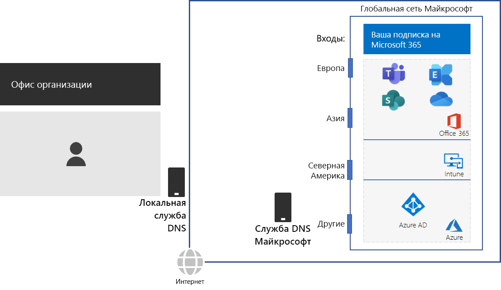
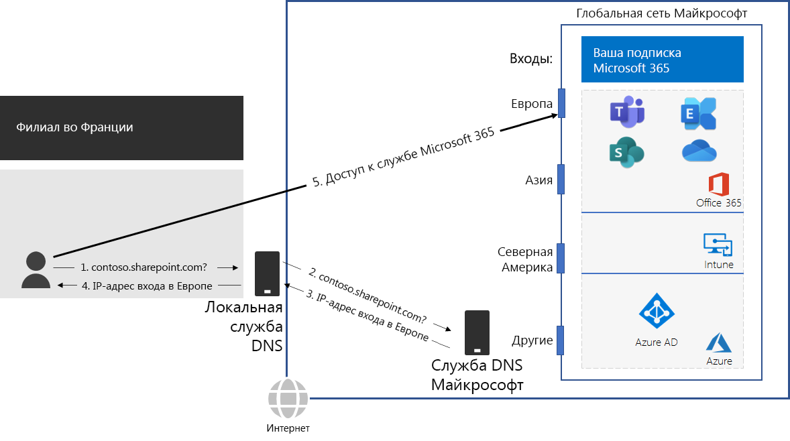

# Шаг 2. Настройка локальных подключений к Интернету для всех офисовStep 2: Configure local Internet connections for each office

*Этот шаг — обязательный; он применяется к планам E3 и E5 Microsoft 365 корпоративный.**This step is required and applies to both the E3 and E5 versions of Microsoft 365 Enterprise*

На шаге 2 вы настраиваете локальные подключения к Интернету с использованием локальных DNS-серверов для всех офисов. Это необходимо для того, чтобы снизить задержку подключения и обеспечить подключение локальных клиентских компьютеров к ближайшей точке входа в облачные службы Microsoft 365.In Step 2, you ensure that each of your offices have local Internet connections and use local DNS servers. Both of these elements are required to reduce connection latency and ensure that on-premises client computers make connections to the nearest point of entry to Microsoft 365 cloud-based services.

В традиционных сетях для крупных организаций Интернет-трафик передается по сетевой магистрали на центральное подключение к Интернету.In traditional networks for large organizations, Internet traffic travels across the network backbone to a central Internet connection. Это не способствует оптимизации производительности глобально распределенной инфраструктуры SaaS, включающей продукты Office 365 и Intune в Microsoft 365.This does not work well for optimizing performance to a globally distributed Software-as-a-Service (SaaS) infrastructure, which includes the Office 365 and Intune products in Microsoft 365.

Глобальная сеть Майкрософт включает инфраструктуру *Distributed Service Front Door* — высокодоступную и масштабируемую граничную область сети с географически распределенными расположениями.The Microsoft Global Network includes a *Distributed Service Front Door* infrastructure, a highly available and scalable network edge with geographically distributed locations. Она разрывает подключение конечных пользователей в серверной части и эффективно перенаправляет трафик в глобальной сети Майкрософт.It terminates end user connections at a front door server and efficiently routes end user traffic within the Microsoft Global Network.

Для обеспечения максимальной производительности локальные клиенты должны иметь доступ к ближайшему расположению Front Door, а не отправлять трафик через сетевую магистраль на расположение, ближайшее к центральному подключению организации к Интернету.For the best performance, on-premises clients should access a front door location that is geographically closest to them, rather than sending the traffic over a network backbone and to the front door that is closest to the organization’s central Internet connection.

Приведем пример.Here’s an example.

Если пользователь в парижском филиале хочет получить доступ к сайту SharePoint Online, When a user in the Paris branch office wants to access a SharePoint Online site:

1. то для разрешения имени, например contoso.sharepoint.com, направляется запрос DNS.It sends a DNS query to resolve a name, such as contoso.sharepoint.com. 
2. DNS-сервер, предоставляемый поставщиком услуг Интернета, пересылает его на DNS-сервер Майкрософт.The DNS server provided by the ISP forwards that query to a Microsoft DNS server.
3. DNS-серверы Майкрософт сопоставляют исходный IP-адрес перенаправленного запроса DNS с регионом, которому назначен этот адрес.Microsoft’s DNS servers match the source IP address of the forwarded DNS query to the region of the world assigned that address. DNS-сервер Майкрософт сообщает в ответ IP-адрес ближайшего расположения Front Door в сети Майкрософт в Европе.The Microsoft DNS server responds with the IP address of the nearest Microsoft Network front door in Europe.
4. DNS-сервер поставщика услуг Интернета отправляет этот IP-адрес пользователю.The ISP DNS server sends that IP address to the user.
5. Пользователь инициирует подключение к серверу SharePoint через Front Door в Европе.The user initiates a connection to the SharePoint server through the Europe front door.

Чтобы направлять клиентский запрос в ближайшее расположение Front Door, DNS-серверы Майкрософт используют запросы DNS, соответствующие исходному запросу клиента на подключение. To direct a client request to the geographically nearest front door, Microsoft’s DNS servers use the DNS queries corresponding the client’s initial connection request. Поэтому для минимальной задержки в сети:Therefore, for the lowest network latency:

- Все офисы вашей организации должны иметь локальные подключения к Интернету для сетевого трафика категории [Оптимизировать](https://docs.microsoft.com/office365/enterprise/office-365-network-connectivity-principles#new-office-365-endpoint-categories).All offices of your organization should have local Internet connections for [Optimize](https://docs.microsoft.com/office365/enterprise/office-365-network-connectivity-principles#new-office-365-endpoint-categories) category network traffic.
- Каждое локальное подключение к Интернету должно использовать региональный DNS-сервер для исходящего интернет-трафика из этого места.Each local Internet connection should be using a regionally local DNS server for outbound Internet traffic from that location.

Дополнительную информацию см. в разделе [Локальная организация исходящего трафика для сетевых подключений](https://docs.microsoft.com/office365/enterprise/office-365-network-connectivity-principles#egress-network-connections-locally).For more information, see [Egress network connections locally](https://docs.microsoft.com/office365/enterprise/office-365-network-connectivity-principles#egress-network-connections-locally). 

Прежде чем перейти к следующему шагу, проверьте [условия](networking-exit-criteria.md#crit-networking-step2), при выполнении которых можно считать данный шаг завершенным.As an interim checkpoint, you can see the [exit criteria](networking-exit-criteria.md#crit-networking-step2) for this step.

## Следующий шагNext step

|||
|:-------|:-----|
||[Удаление разворотов пакетовAvoid network hairpins](networking-avoid-network-hairpins.md)|
