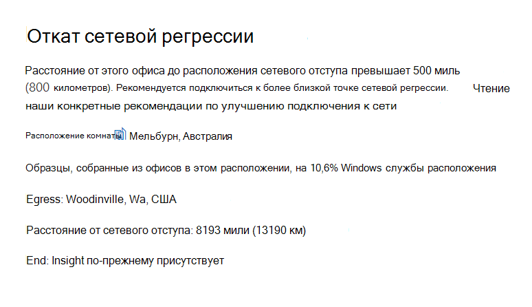
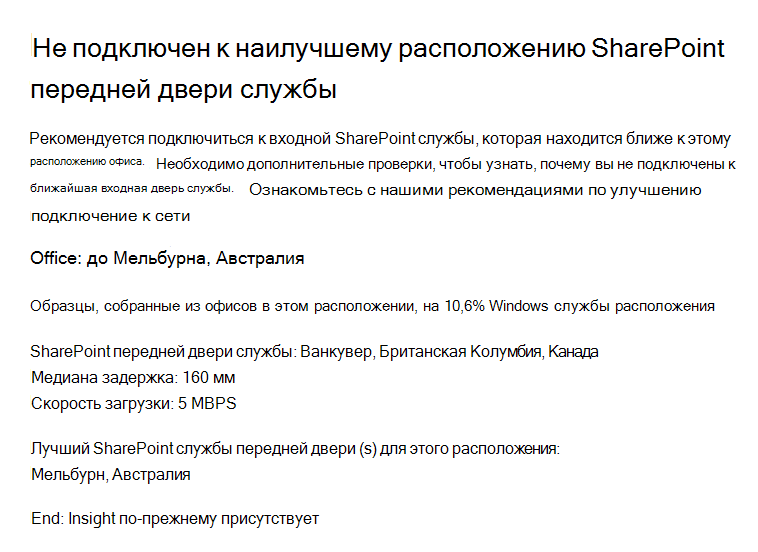

# Microsoft 365 Network Insights (предварительная версия)

**Данные о сети —** это показатели производительности, собранные из клиента Microsoft 365 и доступные для просмотра только пользователями администраторов в клиенте. Insights are displayed in the Microsoft 365 Admin Center at <https://portal.microsoft.com/adminportal/home#/networkperformance> .

Анализ помогает при проектировании сетевых периметров для местоположений офисов. Каждый анализ предоставляет подробные сведения о характеристиках производительности для конкретной общей проблемы для каждого географического расположения, в котором пользователи имеют доступ к вашему арендатору.

Существует шесть определенных сетевых данных, которые могут быть показаны для каждого расположения офиса:

- [Откат сетевого эксгрега](#backhauled-network-egress)
- [Устройство-посредник сети](#network-intermediary-device)
- [Более емкие показатели производительности для клиентов рядом с вами](#better-performance-detected-for-customers-near-you)
- [Использование не оптимальной службы Exchange Online переднего входа](#use-of-a-non-optimal-exchange-online-service-front-door)
- [Использование не оптимальной входной точки службы SharePoint Online](#use-of-a-non-optimal-sharepoint-online-service-front-door)
- [Низкая скорость скачивания из переднего входа SharePoint](#low-download-speed-from-sharepoint-front-door)
- [Оптимальный сетевой эксгрим для пользователей Китая](#china-user-optimal-network-egress)

Существует две сетевые статистики на уровне клиента, которые могут быть показаны для клиента. Они также отображаются на страницах показателей создания.

- [Примеры подключений Exchange, на которые влияют проблемы с подключением](#exchange-sampled-connections-impacted-by-connectivity-issues)
- [Примеры подключений SharePoint, на которые влияют проблемы с подключением](#sharepoint-sampled-connections-impacted-by-connectivity-issues)

>[!IMPORTANT]
>Анализ сети, рекомендации по производительности и оценки в Центре администрирования Microsoft 365 в настоящее время находятся в состоянии предварительной версии и доступны только для клиентов Microsoft 365, которые зарегистрированы в программе предварительного просмотра функций.

## Откат сетевого экскурса

Эта информация будет отображаться, если служба анализа сети обнаружит, что расстояние от заданного расположения пользователя до сетевого трафика превышает 500 метров (800 метров), что указывает на то, что трафик Microsoft 365 возвращается на общее устройство или прокси-сервер Интернета.

В некоторых сводных представлениях это представление сокращено как "Egress".

### Что это означает?

Это определяет, что расстояние между расположением офиса и сетевым игресом превышает 500 метров (800 метров). Расположение офиса идентифицировано запутавленным расположением клиентского компьютера, а расположение сетевого выпада из сети — обратным IP-адресом в базах данных расположений. Расположение офиса может быть неточным, если службы расположения Windows отключены на компьютерах. Если данные базы данных обратных IP-адресов неточны, расположение сетевого адреса может быть неточным.

Сведения для этой аналитики включают расположение офиса, примерный процент от общего числа пользователей клиента в расположении, текущее расположение выхода из сети, релевантность расположения выхода, расстояние между расположением и текущей точкой выхода, дату первого обнаружения условия и дату разрешения условия.

### Что делать?

Для этого мы рекомендуем использовать сетевой выход ближе к расположению офиса, чтобы обеспечить оптимальную маршрутность подключения к глобальной сети Майкрософт и к ближайшему входу службы Microsoft 365. При закрытии сетевого входа в расположения офисов пользователей также можно повысить производительность в будущем, так как Корпорация Майкрософт расширяет точки присутствия сети и входные точки службы Microsoft 365 в будущем.

Дополнительные сведения о том, как устранить эту проблему, см. в локальных сетевых подключениях [egress](microsoft-365-network-connectivity-principles.md#egress-network-connections-locally) в office [365 Network Connectivity Principles.](microsoft-365-network-connectivity-principles.md)

## Устройство-посредник сети

Эта информация будет отображаться, если мы обнаружили устройства между вашими пользователями и сетью Майкрософт, которые могут повлиять на пользовательский интерфейс Office 365. Рекомендуется обходить их для определенного сетевого трафика Microsoft 365, предназначенного для центра обработки данных Майкрософт. Эта рекомендация также описана в принципах сетевого подключения [Microsoft 365](microsoft-365-network-connectivity-principles.md)

### Что это означает?

Устройства-посредники сети, такие как прокси-серверы, VPN и устройства защиты от потери данных, могут влиять на производительность и стабильность клиентов Microsoft 365, где трафик является промежуточным.

### Что делать?

Настройте промежуточное сетевое устройство, которое было обнаружено для обхода обработки сетевого трафика Microsoft 365.

## Более емкие показатели производительности для клиентов, которые рядом с вами

Эта информация будет отображаться, если служба анализа сети обнаружит, что значительное количество клиентов в вашей области имеет более качественую производительность, чем пользователи в вашей организации в этом офисе.

В некоторых сводных представлениях это представление сокращено как "Одноранговая информация".

### Что это означает?

В этом анализе проверяется совокупная производительность клиентов Microsoft 365 в одном городе с этим офисом. Эта информация отображается, если средняя задержка ваших пользователей на 10 % больше средней задержки в соседних клиентах.

### Что делать?

Это условие может быть обусловлено множеством причин, в том числе задержкой в корпоративной сети или isP, узкими местами или вопросами проектирования архитектуры. Проверьте задержку между каждым прыжком в маршруте между сетью Office и текущей входной линией Microsoft 365. Дополнительные сведения см. в сведениях о принципах [сетевого подключения Microsoft 365.](microsoft-365-network-connectivity-principles.md)

## Использование не оптимальной службы Exchange Online переднего входа

Эта информация будет отображаться, если служба анализа сети обнаружит, что пользователи в определенном расположении не подключаются к оптимальной входной окне службы Exchange Online.

В некоторых сводных представлениях это представление сокращено как "Маршруты".

### Что это означает?

Мы перечисляем входные стижки службы Exchange Online, которые подходят для использования из города офисов с хорошей производительностью. Если в текущем тесте показано использование переднего входа службы Exchange Online в этом списке, мы вызовите эту рекомендацию.

### Что делать?

Использование не оптимального входа службы Exchange Online может быть вызвано выходом сети перед выходом корпоративной сети, в этом случае рекомендуется локальный и прямой выход из сети. Это также может быть вызвано использованием удаленного сервера рекурсивного разрешения DNS, в этом случае мы рекомендуем привязывать DNS-сервер рекурсивного разрешения с сетевым перегресом.

## Использование не оптимальной входной точки службы SharePoint Online

Эта информация будет отображаться, если служба анализа сети обнаружит, что пользователи в определенном расположении не подключаются к ближайшему входу в службу SharePoint Online.

В некоторых сводных представлениях эта информация сокращена как "Afd".

### Что это означает?

Мы определяем входную точку службы SharePoint Online, к которую подключается тестовый клиент. Затем для города расположения офиса мы сравниваем это с ожидаемым входным входом службы SharePoint Online для этого города. Если оно не совпадает, мы делайте эту рекомендацию.

### Что делать?

Использование не оптимальной входной точки службы SharePoint Online может быть вызвано выходом сети из сети перед выходом корпоративной сети, в этом случае рекомендуется локальный и прямой выход из сети. Это также может быть вызвано использованием удаленного сервера рекурсивного разрешения DNS, в этом случае мы рекомендуем выровнять DNS-сервер рекурсивного разрешения с сетевым экскурсивным разрешением.

## Низкая скорость скачивания из переднего входа SharePoint

Эта информация будет отображаться, если служба анализа сети обнаружит, что пропускная способность между конкретным расположением офиса и SharePoint Online составляет менее 1 Мбайт/с.

В некоторых сводных представлениях это представление сокращено как "Пропускная способность".

### Что это означает?

Скорость скачивания, которую пользователь может получить из SharePoint Online и переднего входа службы OneDrive для бизнеса, измеряется в мегабайтах в секунду (MBps). Если это значение меньше 1 MBps, мы предоставляем эту информацию.

### Что делать?

Чтобы повысить скорость скачивания, может потребоваться увеличить пропускную способность. Кроме того, может возникнуть перегрузка сети между компьютерами пользователей в расположении офиса и входе в службу SharePoint Online. Это иногда называется застойной потерей и ограничивает скорость скачивания, доступную пользователям, даже если доступна достаточная пропускная способность.

## Оптимальный сетевой эксгрим для пользователей Китая

Эта информация будет отображаться, если пользователи вашей организации в Китае подключаются к вашему арендатору Microsoft 365 в других географических расположениях. 

### Что это означает?

Если в вашей организации есть частное подключение к WAN, мы рекомендуем настроить сетевую сеть WAN из офисов в Китае, которая имеет сетевой доступ к Интернету в любом из следующих мест:

- Гонконг, САР
- Япония
- Тайвань
- Южная Корея
- Сингапур
- Малайзия

При более позднем отсечении от пользователей, чем в этих расположениях, снижается производительность, а при переходе в Китае могут возникнуть проблемы с высокой задержкой и подключением из-за перегрузки границы.

### Что делать?

Дополнительные сведения о том, как устранить проблемы с производительностью, связанные с этой информацией, см. в глобальной оптимизации производительности клиентов [Microsoft 365](microsoft-365-networking-china.md)для пользователей Китая.

## Примеры подключений Exchange, на которые влияют проблемы с подключением

Эта информация будет показывать, когда влияет 50 % или более подключений с образцами. Влияние определяется оценкой Exchange ниже 60 % для каждого примера.

### Что это означает?

Это указывает на то, что у большинства пользователей могут быть проблемы с пользовательским интерфейсом при подключении Outlook к Exchange Online. Процент примеров, скорее всего, представляет процент пользователей, которые показывают меньше 60 баллов.  

### Что делать?

В случае, если это еще не сделано, в случае, если вы еще не сделали этого, в сети расположения Office. Вы хотите определить, на какие офисы влияет плохое сетевое подключение, которое влияет на Exchange, и найти способы улучшения периметра сети на каждом из них, который подключает пользователей к сети Майкрософт.

## Примеры подключений SharePoint, на которые влияют проблемы с подключением

Эта информация будет показывать, когда влияет 50 % или более подключений с образцами. Влияние определяется оценкой SharePoint ниже 40 % для каждого примера.

### Что это означает?

Это указывает на то, что у большинства пользователей могут быть проблемы с интерфейсом пользователя в SharePoint и OneDrive. Процент примеров, скорее всего, представляет процент пользователей, которые показывают менее 40 баллов.  

### Что делать?

В случае, если это еще не сделано, в этом случае необходимо включить видимость сетевого подключения к расположениям Office. Вы хотите определить, на какие офисы влияет плохое сетевое подключение, которое влияет на SharePoint, и найти способы улучшения периметра сети на каждом из них, который подключает пользователей к сети Майкрософт.

## Статьи по теме

[Сетевое подключение в Центре администрирования Microsoft 365 (предварительная версия)](office-365-network-mac-perf-overview.md)

[Оценка сети Microsoft 365 (предварительная версия)](office-365-network-mac-perf-score.md)

[Средство проверки сетевого подключения Microsoft 365 (предварительная версия)](office-365-network-mac-perf-onboarding-tool.md)

[Microsoft 365 Network Connectivity Location Services (предварительная версия)](office-365-network-mac-location-services.md)
