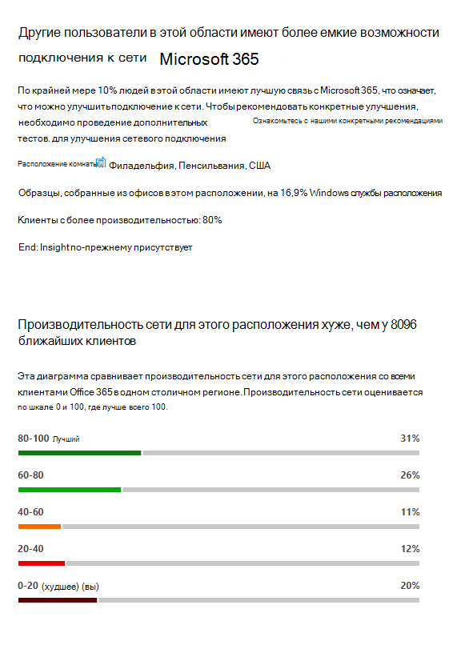

# Microsoft 365 Network Insights (Предварительная версия)Microsoft 365 Network Insights (preview)

**Сетевая аналитика** — это показатели производительности, полученные от клиента Microsoft 365 и доступные для просмотра только администраторами в вашем клиенте.**Network insights** are live performance metrics collected from your Microsoft 365 tenant, and available to view only by administrative users in your tenant. Аналитика отображается в центре администрирования Microsoft 365 по адресу <https://portal.microsoft.com/adminportal/home#/networkperformance> .Insights are displayed in the Microsoft 365 Admin Center at <https://portal.microsoft.com/adminportal/home#/networkperformance>.

Insights призваны помочь при проектировании периметров сети для расположений в офисе.Insights are intended to help in designing network perimeters for your office locations. Каждый из них предоставляет сведения о характеристиках производительности для определенной распространенной ситуации для каждого географического расположения, в котором пользователи обращаются к клиенту.Each insight provides live details about the performance characteristics for a specific common issue for each geographic location where users are accessing your tenant.

Существует пять сведений о сети, которые могут отображаться для каждого местоположения Office:There are five specific network insights that may be shown for each office location:

- [Выход сети с обратной допускной подсистемойBackhauled network egress](#backhauled-network-egress)
- [Более высокая производительность обнаружено соседних клиентовBetter performance detected for customers near you](#better-performance-detected-for-customers-near-you)
- [Использование неоптимальной передней дверцы службы Exchange OnlineUse of a non-optimal Exchange Online service front door](#use-of-a-non-optimal-exchange-online-service-front-door)
- [Использование неоптимальной передней дверцы службы SharePoint OnlineUse of a non-optimal SharePoint Online service front door](#use-of-a-non-optimal-sharepoint-online-service-front-door)
- [Минимальная скорость скачивания из передней дверцы SharePointLow download speed from SharePoint front door](#low-download-speed-from-sharepoint-front-door)

>[!IMPORTANT]
>Сведения о сети, рекомендации по производительности и оценки в центре администрирования Microsoft 365 в настоящее время находятся в состоянии предварительной версии и доступны только для клиентов Microsoft 365, зарегистрированных в программе предварительного просмотра компонентов.Network insights, performance recommendations and assessments in the Microsoft 365 Admin Center is currently in preview status, and is only available for Microsoft 365 tenants that have been enrolled in the feature preview program.

## Выход сети с обратной допускной подсистемойBackhauled network egress

Это значение будет отображаться, если служба Network Insights обнаружит, что расстояние от конкретного пользователя до выхода в сеть превышает 500 миль (800 километров), что указывает на то, что трафик Microsoft 365 передается на распространенное пограничный порт или прокси-сервер Интернета.This insight will be displayed if the network insights service detects that the distance from a given user location to the network egress is greater than 500 miles (800 kilometers), indicating that Microsoft 365 traffic is being backhauled to a common Internet edge device or proxy.

Это сокращение является сокращенным в некоторых сводных представлениях.This insight is abbreviated as "Egress" in some summary views.

### СценарийWhat does this mean?

Это указывает, что расстояние между расположением офиса и выходом сети превышает 500 миль (800 километров).This identifies that the distance between the office location and the network egress is more than 500 miles (800 kilometers). Расположение офиса идентифицируется с помощью непонятного места на клиентском компьютере, а расположение выходного трафика определяется с помощью обратного IP-адреса в базы данных расположения.The office location is identified by an obfuscated client machine location and the network egress location is identified by using reverse IP Address to location databases. Если служба расположения Windows отключена на компьютерах, расположение Office может быть неточным.The office location may be inaccurate if Windows Location Services is disabled on machines. Расположение выхода из сети может быть неточным, если информация о базе данных обратного IP-адреса неточна.The network egress location may be inaccurate if the reverse IP Address database information is inaccurate.

Подробные сведения об этом сопоставлении включают расположение Office, предполагаемый процент от общего числа пользователей клиента в расположении, расположение текущего сетевого выхода, релевантность расположения выходных данных, расстояние между расположением и текущей точкой выхода, Дата первого обнаружения условия и Дата разрешения условия.Details for this insight include the office location, estimated percentage of total tenant user at the location, the current network egress location, relevance of the egress location, the distance between the location and the current egress point, the date the condition was first detected, and the date the condition was resolved.

### Что делать?What should I do?

Для этого мы рекомендуем использовать сетевой выход ближе к расположению Office, чтобы обеспечить оптимальную маршрутизацию подключений в глобальную сеть Майкрософт и на ближайшую переднюю дверцу службы Microsoft 365.For this insight, we would recommend network egress closer to the office location so that connectivity can route optimally to Microsoft's global network and to the nearest Microsoft 365 service front door. Если вы развернете доступ к сетевым выходным пользователям для пользователей, вы также можете улучшить производительность в будущем, так как корпорация Майкрософт развертывает в будущем как сетевые точки присутствия, так и передние двери обслуживания Microsoft 365.Having close network egress to users office locations also allows for improved performance in the future as Microsoft expands both network points of presence and Microsoft 365 service front doors in the future.

Для получения дополнительных сведений о том, как устранить эту проблему, просмотрите раздел исходящих [сетевых подключений локально](microsoft-365-network-connectivity-principles.md#egress-network-connections-locally) в [принципах подключения к сети Office 365](microsoft-365-network-connectivity-principles.md).For more information about how to resolve this issue, see [Egress network connections locally](microsoft-365-network-connectivity-principles.md#egress-network-connections-locally) in [Office 365 Network Connectivity Principles](microsoft-365-network-connectivity-principles.md).

## Более высокая производительность обнаружено соседних клиентовBetter performance detected for customers near you

Это значение будет отображаться, если служба Network Insights обнаружит, что значительное количество клиентов в области Metro имеет лучшую производительность, чем у пользователей в вашей организации в этом расположении.This insight will be displayed if the network insights service detects that a significant number of customers in your metro area have better performance than users in your organization at this office location.

В некоторых сводных представлениях это аббревиатура "Peers".This insight is abbreviated as "Peers" in some summary views.

### СценарийWhat does this mean?

В этом изучении изучается сводная производительность клиентов Microsoft 365 в том же городе, что и это расположение Office.This insight examines the aggregate performance of Microsoft 365 customers in the same city as this office location. Это представление отображается в том случае, если средняя задержка пользователей составляет 10% выше средней задержки соседних клиентов.This insight is displayed if the average latency of your users is 10% greater than the average latency of neighboring tenants.

### Что делать?What should I do?

Это условие может быть связано с несколькими причинами, включая задержку в корпоративной сети или поставщике услуг Интернета, узких мест или архитектурные проблемы.There could be many reasons for this condition, including latency in your corporate network or ISP, bottlenecks, or architecture design issues. Проверьте задержку между каждым переходом между сетью Office и текущей передней дверцей Microsoft 365.Examine the latency between each hop in the route between your office network and the current Microsoft 365 front door. Дополнительные сведения см. в статье [принципы сетевого подключения Office 365](microsoft-365-network-connectivity-principles.md).For more information, see [Office 365 Network Connectivity Principles](microsoft-365-network-connectivity-principles.md).

## Использование неоптимальной передней дверцы службы Exchange OnlineUse of a non-optimal Exchange Online service front door

Это значение будет отображаться, если служба Network Insights обнаруживает, что пользователи в определенном расположении не подключаются к оптимальной передней дверце службы Exchange Online.This insight will be displayed if the network insights service detects that users in a specific location are not connecting to an optimal Exchange Online service front door.

Эта аналитика сокращена в виде "маршрутизации" в некоторых сводных представлениях.This insight is abbreviated as "Routing" in some summary views.

### СценарийWhat does this mean?

Мы перечислим передние двери служб Exchange Online, которые подходят для использования из города местонахождения Office с хорошей производительностью.We list Exchange Online service front doors which are suitable for use from the office location city with good performance. Если в текущем тесте показывается использование передней дверцы службы Exchange Online, которой нет в этом списке, мы вызываем эту рекомендацию.If the current test shows use of an Exchange Online service front door not on this list, then we call out this recommendation.

### Что делать?What should I do?

Использование неоптимальной передней дверцы службы Exchange Online может быть вызвано обратной связи в сети перед выходом в корпоративную сеть, в этом случае мы рекомендуем использовать локальную и прямую сеть.Use of a non-optimal Exchange Online service front door could be caused by network backhaul before the corporate network egress in which case we recommend local and direct network egress. Кроме того, это может быть вызвано использованием удаленного сервера рекурсивного разрешения DNS, в результате чего мы рекомендуем выравнивать рекурсивный сервер сопоставителя DNS с выходом в сеть.It could also be caused by use of a remote DNS Recursive Resolver server in which case we recommend aligning the DNS Recursive Resolver server with the network egress.

## Использование неоптимальной передней дверцы службы SharePoint OnlineUse of a non-optimal SharePoint Online service front door

Это значение будет отображаться, если служба Network Insights обнаружит, что пользователи в определенном расположении не подключаются к ближайшей передней дверце службы SharePoint Online.This insight will be displayed if the network insights service detects that users in a specific location are not connecting to the closest SharePoint Online service front door.

Это сокращение сокращается как "АФД" в некоторых сводных представлениях.This insight is abbreviated as "Afd" in some summary views.

### СценарийWhat does this mean?

Мы идентифицируем переднюю дверцу службы SharePoint Online, к которой подключается тестовый клиент.We identify the SharePoint Online service front door that the test client is connecting to. Затем в городе местонахождения Office мы сравниваемся с ожидаемой внешней дверце службы SharePoint Online для этого города.Then for the office location city we compare that to the expected SharePoint Online service front door for that city. Если это не так, мы будем использовать эту рекомендацию.If it doesn't match, then we make this recommendation.

### Что делать?What should I do?

Использование неоптимальной передней дверцы службы SharePoint Online может быть вызвано обратной связи в сети перед выходом в корпоративную сеть, в этом случае мы рекомендуем использовать локальную и прямую сеть.Use of a non-optimal SharePoint Online service front door could be caused by network backhaul before the corporate network egress in which case we recommend local and direct network egress. Кроме того, это может быть вызвано использованием удаленного сервера рекурсивного разрешения DNS, в результате чего мы рекомендуем выравнивать рекурсивный сервер сопоставителя DNS с выходом в сеть.It could also be caused by use of a remote DNS Recursive Resolver server in which case we recommend aligning the DNS Recursive Resolver server with the network egress.

## Минимальная скорость скачивания из передней дверцы SharePointLow download speed from SharePoint front door

Это значение будет отображаться, если служба Network Insights обнаружит, что пропускная способность между определенным расположением Office и SharePoint Online менее 1 Мбит/с.This insight will be displayed if the network insights service detects that bandwidth between the specific office location and SharePoint Online is less than 1 MBps.

Это сокращение сокращается до "пропускная способность" в некоторых сводных представлениях.This insight is abbreviated as "Throughput" in some summary views.

### СценарийWhat does this mean?

Скорость скачивания, которую пользователь может получить из SharePoint Online и фронтальных дверей службы OneDrive для бизнеса, измеряется в мегабайтах в секунду (Мбит/с).The download speed that a user can get from SharePoint Online and OneDrive for Business service front doors is measured in megabytes per second (MBps). Если это значение меньше 1 Мбит/с, мы предоставляем эту информацию.If this value is less than 1 MBps then we provide this insight.

### Что делать?What should I do?

Для повышения скорости загрузки может потребоваться увеличить пропускную способность.To improve download speeds, bandwidth may need to be increased. Кроме того, может возникнуть перегрузка сети между пользовательскими машинами в расположении Office и внешней дверце службы SharePoint Online.Alternatively, there may be network congestion between user machines at the office location and the SharePoint Online service front door. Иногда это называется перегруженной потерей и позволяет ограничить скорость загрузки, доступную пользователям даже при наличии достаточной пропускной способности.This is sometimes called congestive loss and it restricts the download speed available to users even if sufficient bandwidth is available.

## Оптимальный сетевой выход для пользователя в КитаеChina user optimal network egress

Это представление будет отображаться, если в Организации есть пользователи, подключающиеся к клиенту Microsoft 365 в других географических регионах.This insight will be displayed if your organization has users in China connecting to your Microsoft 365 tenant in other geographic locations. 

### СценарийWhat does this mean?

Если в вашей организации есть подключение к частной глобальной сети, рекомендуется настроить сетевую цепь WAN из расположений Office в Китае, в которой есть сетевой выход в Интернет, в любом из следующих расположений:If your organization has private WAN connectivity, we recommend configuring a network WAN circuit from your office locations in China that has network egress to the Internet in any of the following locations:

- Гонконг, САРHong Kong
- ЯпонияJapan
- ТайваньTaiwan
- Республика КореяSouth Korea
- СингапурSingapore
- МалайзияMalaysia

Исходящий трафик из Интернета больше не влияет на производительность, а исходящий трафик в Китае может привести к большим задержкам и проблемам с подключением из-за перегрузки с перекрестными границами.Internet egress further away from users than these locations will reduce performance, and egress in China may cause high latency and connectivity issues due to cross-border congestion.

### Что делать?What should I do?

Для получения дополнительных сведений об устранении проблем с производительностью, связанных с этим представлением, ознакомьтесь со статьей [Оптимизация производительности глобального клиента Office 365 для пользователей Китая](microsoft-365-networking-china.md).For more information about how to mitigate performance issues related to this insight, see [Office 365 global tenant performance optimization for China users](microsoft-365-networking-china.md).

## Связанные статьиRelated topics

[Рекомендации по повышению производительности сети в центре администрирования Microsoft 365 (Предварительная версия)Network performance recommendations in the Microsoft 365 Admin Center (preview)](office-365-network-mac-perf-overview.md)

[Оценка сети Microsoft 365 (Предварительная версия)Microsoft 365 network assessment (preview)](office-365-network-mac-perf-score.md)

[Проверка подключения Microsoft 365 в центре администрирования M365 (Предварительная версия)Microsoft 365 connectivity test in the M365 Admin Center (preview)](office-365-network-mac-perf-onboarding-tool.md)

[Служба расположения сетевых подключений (Предварительная версия) Microsoft 365Microsoft 365 Network Connectivity Location Services (preview)](office-365-network-mac-location-services.md)
