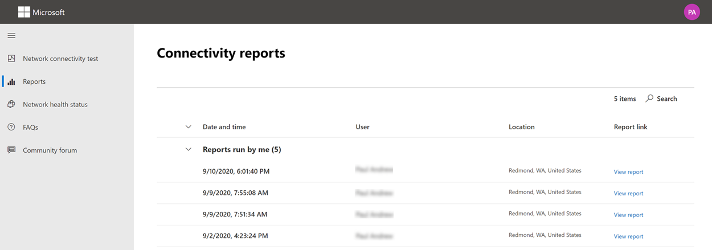

# Microsoft 365 тестовый инструмент подключения к сети

Средство Microsoft 365 сетевого подключения расположено по адресу <https://connectivity.office.com> . Это дополнительный инструмент для оценки сети и сведений о сетевых сведениях, доступных в центре администрирования Microsoft 365 в центре **| Меню подключения.**

> [!IMPORTANT]
> Важно войти в клиент Microsoft 365, так как все отчеты о проверках будут совместно с администратором и загружены в клиента во время регистрации.

> [!div class="mx-imgBorder"]
> 

>[!NOTE]
>Средство тестирования сетевого подключения поддерживает клиентов в WW Commercial и Германии, но не GCC, GCC High, DoD или Китае.

Сведения о сети в центре администрирования Microsoft 365 основаны на регулярных измерениях в продукте для Microsoft 365 клиента, которые агрегируются каждый день. Для сравнения, сетевые сведения из Microsoft 365 сетевого подключения запускаются локально и один раз в инструменте. Тестирование, которое можно сделать в продукте, ограничено, и при запуске локальных тестов пользователю можно собрать больше данных, что приведет к более глубокому анализу. Затем следует учитывать, что сетевые сведения в центре администрирования Microsoft 365 покажут, что существует проблема сетевого использования Microsoft 365 в определенном расположении офиса. Тест Microsoft 365 может помочь определить первопричину этой проблемы, что приведет к рекомендуемой работе по улучшению производительности сети.

Мы рекомендуем использовать эти сведения вместе, где можно оценить состояние качества сети для каждого расположения офиса в центре администрирования Microsoft 365 и дополнительные сведения можно найти после развертывания тестирования на основе теста Microsoft 365 подключения.

>[!IMPORTANT]
>Сведения о сети, рекомендации по производительности и оценки в центре администрирования Microsoft 365 в настоящее время находятся в состоянии предварительного просмотра и доступны только для Microsoft 365 клиентов, которые были зарегистрированы в программе предварительного просмотра функций.

## Что происходит на каждом шаге тестирования

### Office расположения

При нажатии кнопки тестирования запуска мы показывем запущенную тестовую страницу и определяем расположение офиса. Вы можете ввести в своем расположении по городу, штату и стране или его можно обнаружить в веб-браузере. Если вы обнаружите его, мы запрашиваем широту и долготу в веб-браузере и ограничим точность до 300 метров на 300 метров перед использованием. Мы делаем это, так как нет необходимости идентифицировать расположение более точно, чем здание для производительности сети. 

### Тесты JavaScript

После идентификации местоположения офиса мы запускаем тест задержки TCP в JavaScript и запрашиваем данные из службы об использовании и рекомендуемых Office 365 серверов передней двери службы. По завершению этих тестов мы показывем их на карте и на вкладке сведений, где их можно просмотреть до следующего шага.

### Скачайте клиентскую заявку на расширенные тесты

Далее начинается загрузка клиентского приложения расширенных тестов. Мы полагаемся на пользователя для запуска клиентского приложения, и у них также должен быть установлен .NET Core.

В тесте Microsoft 365 сетевых подключений есть две части: веб-сайт и загружаемое клиентное приложение Windows которое выполняет расширенные тесты подключения <https://connectivity.office.com> к сети. Большинство тестов требуют запуска приложения. Он будет заполнять результаты обратно на веб-страницу по мере ее работы.

После завершения тестов веб-браузера вам будет предложено скачать с веб-сайта продвинутую клиентскую тестовую заявку. Откройте и запустите файл при запросе.

> [!div class="mx-imgBorder"]
> 

### Запуск клиентского приложения расширенных тестов

После начала работы клиентского приложения веб-страница будет обновляться, чтобы показать этот результат. Тестовые данные будут получены на веб-страницу. Страница обновляется при каждом получении новых данных, и вы можете просмотреть данные по мере их поступления.

### Расширенные тесты, завершенные и отправка отчетов о проверке

Когда тесты будут завершены, веб-страница и клиент расширенных тестов покажут это. Если пользователь вошел, тестовый отчет будет загружен клиенту.

## Совместное использование тестового отчета

В тестовом отчете требуется вход в Office 365 учетную запись. Администратор выбирает, как вы можете поделиться своим отчетом о проверке.

### Обмен отчетом с администратором

Если вы подписаны при проверке отчета, эти отчеты делятся с администратором.

### Совместное использование с командой учетных записей Майкрософт, службой поддержки или другим персоналом

Отчеты о проверках (за исключением личной идентификации) делятся с сотрудниками Майкрософт. Этот общий доступ включен по умолчанию и может быть отключен администратором в службе **| Страница подключения к сети** в центре Microsoft 365 администрирования.

### Совместное использование с другими пользователями, входивших в один Office 365 клиента

Вы можете выбрать пользователей, с помощью которые можно поделиться своим отчетом. Возможность выбора включена по умолчанию, но может быть отключена администратором.

> [!div class="mx-imgBorder"]
> 

### Общий доступ к любому, кто использует ссылку ReportID

Вы можете поделиться своим тест-отчетом с любыми, предоставив доступ к ссылке ReportID. По этой ссылке создается URL-адрес, который можно отправить кому-либо, чтобы он не входил в отчет о проверке. Этот общий доступ отключен по умолчанию и должен быть включен администратором.

> [!div class="mx-imgBorder"]
> 

## Результаты тестирования подключения к сети

Результаты показаны на вкладке **Сводка** и **Сведения.** На вкладке сводки показана карта обнаруженного периметра сети и сравнение оценки сети с другими Office 365 поблизости. Он также позволяет совместно использовать отчет о проверке. Вот как выглядит представление результатов сводки:

> [!div class="mx-imgBorder"]
> 

Вот пример вывода вкладки подробных сведений, показанных средством. На вкладке подробные сведения мы показываем знак проверки зеленого круга, если результат был положительно сравнен с порогом. Мы показываем восклицательный знак красного треугольника, если результат превысил пороговое значение, указывающее на понимание сети. В следующих разделах описываются все строки результатов вкладки и объясняются пороговые значения, используемые для анализа сетевых данных.

> [!div class="mx-imgBorder"]
> 

### Сведения о расположении

В этом разделе показаны результаты тестирования, связанные с вашим расположением.

#### Ваше расположение

Расположение пользователя определяется из веб-браузера пользователей. Его также можно ввести по выбору пользователя. Он используется для определения расстояний сети до определенных частей периметра корпоративной сети. В отчете сохраняются только город от этого обнаружения расположения и расстояние до других точек сети.

Расположение офиса пользователя отображается на представлении карты.

#### Расположение сетевого отступа (расположение, в котором ваша сеть подключается к вашему интернет-ипу)

Мы определяем IP-адрес сетевого отступа на стороне сервера. Базы данных расположения используются для поиска приблизительного расположения для сетевой регрессии. Эти базы данных обычно имеют точность около 90% IP-адресов. Если расположение с IP-адреса сетевой регрессии не является точным, это приведет к ложному результату этого теста. Чтобы проверить, существует ли эта ошибка для определенного IP-адреса, можно использовать общедоступные веб-сайты расположения IP-адресов сети для сравнения с фактическим расположением.

#### Расстояние от вас до расположения исходящего трафика

Мы определяем расстояние от этого расположения до расположения офиса. Это показано в качестве сетевого анализа, если расстояние превышает **500** миль (800 километров), так как это может увеличить задержку TCP более чем на 25 мс и может повлиять на пользовательский опыт.

Расположение сетевой регрессии отображается на представлении карты и подключено к расположению офиса пользователя, указывающее на задок сети внутри корпоративного WAN.

Реализация локального и прямого сетевого отступа от расположения офисов пользователей к Интернету рекомендуется для Microsoft 365 подключения к сети. Улучшение локального и прямого отступа — это лучший способ решения этой сетевой идеи.

#### Сведения о прокси-сервере

Мы определяем прокси-сервер(ы), настроенный на локальном компьютере. Мы определяем, настроены ли какие-либо из них в сетевом пути для оптимизации Microsoft 365 сетевого трафика. Мы определяем расстояние от расположения офиса пользователя до прокси-серверов. Сначала дистанция тестирована ICMP-ping, и если это не удается, мы протестировали с помощью TCP-ping и, наконец, если это не удалось, мы направим IP-адрес прокси-сервера в базу данных расположения IP-адресов. Мы покажем представление о сети, если прокси-сервер находится на расстоянии более **500** миль (800 километров) от расположения офиса пользователя.

#### Виртуальная частная сеть (VPN), используемая для подключения к организации

Это определяет, используется ли VPN для подключения к Office 365. Попутный результат покажет, нет ли у вас VPN или если у вас есть VPN с рекомендуемой конфигурацией раздельного туннеля для Office 365.

#### VPN Split Tunnel

Каждый оптимизированный маршрут категорий для Exchange Online, SharePoint Online и Microsoft Teams тестируем, чтобы проверить, пролегет ли он в VPN или нет. Разделенная рабочая нагрузка полностью избегает VPN. Через VPN отправляется туннельная рабочая нагрузка. Выборочная рабочая нагрузка в туннелях имеет некоторые маршруты, отправленные через VPN, а некоторые разделены. Попутный результат покажет, разделены ли все рабочие нагрузки или выборочный туннель.

#### Клиенты в вашем столичном регионе с более производительностью

Задержка сетевого TCP расположения пользовательского офиса до входной двери Exchange Online службы сравнивается с другими клиентами Microsoft 365 в том же районе метро. Показано представление о сети, если 10% или более клиентов в том же районе метро имеют лучшую производительность. Это означает, что их пользователи будут иметь лучшую производительность в Microsoft 365 пользовательском интерфейсе.

Это представление о сети создается на основе того, что все пользователи в городе имеют доступ к одной и той же инфраструктуре телекоммуникаций и одинаковой близости к схемам Интернета и сети Майкрософт.

#### Время для запроса DNS в сети

Это показывает сервер DNS, настроенный на клиентской машине, которая запустила тесты. Это может быть сервер DNS Recursive Resolver, однако это редкость. Скорее всего, это сервер DNS-переадтрансатора, который закаповывал результаты DNS и переадтрансловывал любые незаконченные запросы DNS на другой DNS-сервер.

Это предоставляется только для сведений и не способствует ни одной сетевой проницательности.

#### Расстояние от и/или времени подключения к рекурсивным разрешательным решением DNS

Рекурсивный рекурсивный разрешительный сервер DNS устанавливается путем создания определенного запроса DNS, а затем запроса сервера имени DNS для IP-адреса, с которого он получил тот же запрос. Этот IP-адрес является рекурсивным разрешительным решением DNS, и его будут искать в базах данных расположения IP-адресов, чтобы найти расположение. Затем вычисляется расстояние от расположения офиса пользователя до расположения сервера DNS Recursive Resolver. Это показано как сетевое представление, если расстояние превышает **500 миль** (800 километров).

Расположение, выглядывее из IP-адреса сетевой регрессии, может быть не точным, и это приведет к ложному результату этого теста. Чтобы проверить, существует ли эта ошибка для определенного IP-адреса, можно использовать общедоступные веб-сайты расположения IP-адресов сети.

Это сетевое представление будет конкретно влиять на выбор Exchange Online входной двери службы. Для решения этой идеи локальный и прямой сетевой регресс должен быть предварительным, а затем DNS Recursive Resolver должен быть расположен близко к этой сетевой регрессии.

### Exchange Online

В этом разделе показаны результаты тестирования, связанные с Exchange Online.

#### Exchange расположение передней двери службы

Входная дверь Exchange службы определена таким же образом, Outlook это делается, и мы измеряем задержку сетевого TCP от расположения пользователя к ней. Показана задержка TCP, а входная дверь Exchange службы сравнивается со списком лучших входных дверей службы для текущего расположения. Это показано как сетевое представление, если один из Exchange службы входной двери (s) не используется.

Не использование одной из Exchange службы передней двери (ы) может быть вызвано сетевым backhaul перед отступлением корпоративной сети, в этом случае мы рекомендуем локальный и прямой выход сети. Это также может быть вызвано использованием удаленного сервера рекурсивного ретранслятива DNS, в этом случае рекомендуется привести сервер рекурсивного ретранслятива DNS в соответствие с сетевой регрессией.

Мы вычисляем потенциальное улучшение задержки TCP (ms) до Exchange входной двери службы. Это делается с помощью проверки задержки в сети расположения офиса пользователя и вычитания задержки сети из текущего расположения в шкафы Exchange входной двери службы. Разница представляет потенциальную возможность для улучшения.

#### Лучший Exchange службы передней двери (s) для вашего расположения

В этом списке перечислены Exchange расположения входных дверей службы по городу для вашего расположения.

#### Входная дверь службы, записанная в клиентской DNS

Здесь показаны имя DNS и IP-адрес сервера Exchange службы передней двери, на который вы были направлены. Он предоставляется только для сведений и не имеет связанной сетевой информации.

### SharePoint Online

В этом разделе показаны результаты тестирования, связанные с SharePoint Online и OneDrive.

#### Расположение передней двери службы

Входная дверь SharePoint службы определена таким же образом, как и клиент OneDrive, и мы измеряем задержку сетевого TCP от расположения офиса пользователя до него.

#### Скорость загрузки

Мы измеряем скорость загрузки файла 15Мб из SharePoint входной двери службы. Результат показан в мегабайтах в секунду, чтобы указать, какой размер файла в мегабайтах можно загрузить из SharePoint или OneDrive за **одну секунду.** Это число должно быть похоже на одну десятую минимальной пропускной способности цепи в мегабитах в секунду. Например, если подключение к Интернету имеет 100 Мбит/с, можно ожидать 10 мегабайт в секунду (10 МБит/с).

#### Буферная раздувка

Во время загрузки 15Mb мы измеряем задержку TCP до SharePoint входной двери службы. Это задержка нагрузки, и ее сравнивают с задержкой, когда она не загружается. Увеличение задержки при нагрузке часто объясняется загрузкой буферов сетевых устройств потребителей (или раздутыми). Для любого раздува 1000 или более показана проницательность сети.

#### Входная дверь службы, записанная в клиентской DNS

Здесь показано имя DNS и IP-адрес сервера SharePoint службы передней двери, на который вы были направлены. Он предоставляется только для сведений и не имеет связанной сетевой информации.

### Microsoft Teams

В этом разделе показаны результаты тестирования, связанные с Microsoft Teams.

#### Подключение к мультимедиа (совместное использование аудио, видео и приложений)

Это тестирует подключение UDP к Microsoft Teams входной двери службы. Если это заблокировано, Microsoft Teams может работать с помощью TCP, но звук и видео будут нарушены. Дополнительные данные об этих измерениях сети UDP, которые также применяются к Microsoft Teams в области качества мультимедиа и производительности подключения к сети [в Skype для бизнеса Online](/skypeforbusiness/optimizing-your-network/media-quality-and-network-connectivity-performance).

#### потерь пакетов

Показывает потерю пакета UDP, измеряемую в 10-секундной тестовой аудиозвонке от клиента до Microsoft Teams входной двери службы. Это должно быть меньше **1,00%** для прохода.

#### Задержка

Показывает измеренную задержку UDP, которая должна быть ниже **100 мс.**

#### Jitter

Показывает измеряемую дрожать UDP, которая должна быть ниже **30 мс.**

#### Подключение

Мы проверяем возможность подключения HTTP из расположения офиса пользователя во все необходимые Microsoft 365 конечные точки сети. Они опубликованы на [https://aka.ms/o365ip](./urls-and-ip-address-ranges.md) сайте . Для любых необходимых конечных точек сети отображается представление о сети, к которым невозможно подключаться.

Подключение может быть заблокировано прокси-сервером, брандмауэром или другим устройством сетевой безопасности в периметре корпоративной сети. Подключение к порту TCP 80 тестуется с помощью http-запроса, а подключение к порту TCP 443 тестуется с помощью запроса HTTPS. Если ответа нет, FQDN помечен как сбой. Если код ответа HTTP 407 имеется, код FQDN помечен как сбой. Если есть код http-ответа 403, мы проверяем атрибут Server ответа, и если это прокси-сервер, мы пометим это как сбой. Вы можете имитировать тесты, выполняемые с помощью Windows командной строки curl.exe.

Мы тестируем сертификат SSL на каждой Microsoft 365 конечной точке сети, которая находится в категории оптимизация или разрешить, как определено в [https://aka.ms/o365ip](./urls-and-ip-address-ranges.md) . Если какие-либо тесты не находят сертификат Microsoft SSL, то зашифрованная сеть, подключенная к сети, должна быть перехвачена промежуточным сетевым устройством. Представление о сети отображается на любых перехваченных конечных точках зашифрованной сети.

При обнаружении сертификата SSL, не предоставленного Корпорацией Майкрософт, мы показываем FQDN для теста и владельца SSL-сертификата, используемого в использовании. Этот владелец сертификата SSL может быть поставщиком прокси-серверов или сертификатом самозаверяемого предприятия.

#### Путь сети

В этом разделе показаны результаты трассировки ICMP к входной Exchange Online службы, входной двери службы SharePoint Online и Microsoft Teams входной двери службы. Он предоставляется только для сведений и не имеет связанной сетевой информации. Предусмотрены три трассировки. Трассировка для _outlook.office365.com,_ трассировка для клиентов SharePoint переднего microsoft.sharepoint.com,  если не предоставлена, и трассировка для _world.tr.teams.microsoft.com_.

## Отчеты о подключении

При подписании вы можете просмотреть предыдущие отчеты, которые вы уже запускали. Вы также можете поделиться ими или удалить их из списка.

> [!div class="mx-imgBorder"]
> 

## Состояние сетевого состояния

Это показывает, какие-либо значительные проблемы со здоровьем глобальной сети Майкрософт, которые могут повлиять Microsoft 365 клиентов.

> [!div class="mx-imgBorder"]
> 

## Вопросы и ответы

Вот ответы на некоторые часто задамые вопросы.

### Этот инструмент выпущен и поддерживается Корпорацией Майкрософт?

В настоящее время это предварительный просмотр, и мы планируем регулярно предоставлять обновления, пока не достигнем общего состояния выпуска доступности при поддержке Корпорации Майкрософт. Пожалуйста, предосообщите нам отзывы, которые помогут нам улучшить ситуацию. В рамках этого средства планируется опубликовать более подробное руководство по Office 365 сетевой доске, которое настраивается для организации по результатам тестирования.

### Что требуется для запуска клиента с расширенным тестом?

Передовая тестовая клиентка требует .NET Core 3.1 Время работы на рабочем столе. Если вы запустите расширенный тестовый клиент без установленного, вы будете направлены на страницу [установки .NET Core 3.1](https://dotnet.microsoft.com/download/dotnet-core/3.1). Не забудьте установить рабочий стол, а не SDK или ASP.NET Core, которые выше на странице. Разрешения администратора на компьютере необходимы для установки .NET Core.

### Что такое Microsoft 365 входная дверь службы?

Входная Microsoft 365 является точкой входа в глобальную сеть Майкрософт, где Office и службы прекращают свое сетевое подключение. Для оптимального подключения к Microsoft 365 сети рекомендуется прекратить подключение к сети в ближайшую Microsoft 365 входную дверь в вашем городе или метро.

> [!NOTE]
> Microsoft 365 входная дверь службы не имеет прямого отношения к продукту службы входных дверей **Azure,** доступному на рынке Azure.

### Что является наилучшим Microsoft 365 входной двери службы?

Передняя Microsoft 365 службы (ранее известная как оптимальная входная дверь службы) — это входная дверь, которая ближе всего к вашей сетевой отступной, как правило, в вашем городе или области метро. Используйте средство Microsoft 365 для определения расположения вашей входной двери Microsoft 365 службы и наилучшей входной двери службы. Если средство определяет, что входная дверь является одной из лучших, следует ожидать подключения к глобальной сети Майкрософт.

### Что такое расположение egress Интернета?

Расположение выхода из Интернета — это расположение, в котором сетевой трафик выходит из корпоративной сети и подключается к Интернету. Это также определено как место, где у вас есть устройство сетевого перевода адресов (NAT) и обычно, где вы подключаетсяе к поставщику интернет-служб (ISP). Если вы видите расстояние между расположением и расположением egress Интернета, то это может определить значительный backhaul WAN.

## Статьи по теме

[Подключение к сети в центре администрирования Microsoft 365 (предварительный просмотр)](office-365-network-mac-perf-overview.md)

[Microsoft 365 производительности сети (предварительный просмотр)](office-365-network-mac-perf-insights.md)

[Microsoft 365 сети (предварительный просмотр)](office-365-network-mac-perf-score.md)

[Microsoft 365 Службы расположения сетевых подключений (предварительный просмотр)](office-365-network-mac-location-services.md)