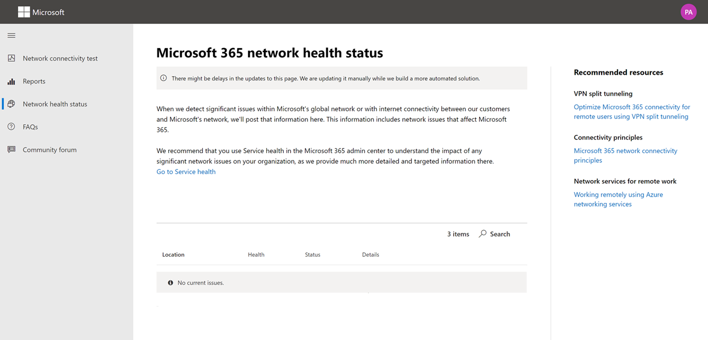

# Проверка сетевого подключения Microsoft 365 (Предварительная версия)Microsoft 365 network connectivity test (preview)

Средство тестирования сетевых подключений (Майкрософт) 365 находится по адресу <https://connectivity.office.com> .The Microsoft 365 network connectivity test tool is located at <https://connectivity.office.com>. Это средство аджункт для оценки сети и сведений о сети, доступных в центре администрирования Microsoft 365 в области **работоспособность | Меню подключения** .It is an adjunct tool to the network assessment and network insights information available in the Microsoft 365 admin center under the **Health | Connectivity** menu.

>[!NOTE]
>Средство проверки сетевого подключения поддерживает клиентов в WW и Германии, но не на GCC умеренный, GCC High, DoD или Китае.The network connectivity test tool supports tenants in WW Commercial and Germany but not GCC Moderate, GCC High, DoD or China.

Сведения о сети в центре администрирования Microsoft 365 основаны на регулярных измерениях для вашего клиента Microsoft 365, которые ежемесячно собраны.The network insights in the Microsoft 365 Admin Center are based on regular in-product measurements for your Microsoft 365 tenant which are aggregated each day. В сравнении с проверкой сетевых подключений Microsoft 365 выполняется локально и один раз в средстве.In comparison, the network insights from the Microsoft 365 network connectivity test are run locally and one time in the tool. Тестирование, которое можно выполнить в продукте, ограничено, и при выполнении тестов, локальных для пользователя, могут быть собраны сведения, полученные в результате более глубокого анализа.Testing that can be done in-product is limited and by running tests local to the user more data can be gathered resulting in deeper insights. Обратите внимание на то, что в центре администрирования Microsoft 365 есть проблема с сетью для использования Microsoft 365 в определенном расположении Office.Consider then that the network insights in the Microsoft 365 Admin Center will show that there is a networking problem for use of Microsoft 365 at a specific office location. Проверка возможности подключения к Microsoft 365 поможет определить основную причину проблемы, которая привела к рекомендованному действию по улучшению производительности сети.The Microsoft 365 connectivity test can help to identify the root cause of that problem leading to a recommended network performance improvement action.

Рекомендуется использовать их вместе с тем, где состояние качества сети можно оценить для каждого расположения Office в центре администрирования Microsoft 365, а дополнительные сведения можно найти после развертывания тестирования на основе проверки подключения Microsoft 365.We recommend that these be used together where networking quality status can be assessed for each office location in the Microsoft 365 Admin Center and more specifics can be found after deployment of testing based on the Microsoft 365 connectivity test.

>[!IMPORTANT]
>Сведения о сети, рекомендации по производительности и оценки в центре администрирования Microsoft 365 в настоящее время находятся в состоянии предварительной версии и доступны только для клиентов Microsoft 365, зарегистрированных в программе предварительного просмотра компонентов.Network insights, performance recommendations and assessments in the Microsoft 365 Admin Center is currently in preview status, and is only available for Microsoft 365 tenants that have been enrolled in the feature preview program.

## Клиентское приложение расширенных тестовThe advanced tests client application

Проверка сетевого подключения Microsoft 365 состоит из двух частей; веб-сайт <https://connectivity.office.com> и загружаемое клиентское приложение Windows, в котором выполняются расширенные проверки сетевого подключения.There are two parts to the Microsoft 365 network connectivity test; the web site <https://connectivity.office.com> and a downloadable Windows client application that runs advanced network connectivity tests. Большинство тестов требуют запуска приложения.Most of the tests require the application to be run. Они заполняют результаты обратно на веб-странице в ходе ее выполнения.It will populate results back into the web page as it runs.

После завершения тестирования веб-браузера вам будет предложено скачать тестовое приложение расширенного клиента с веб-сайта.You will be prompted to download the advanced client test application from the web site after the web browser tests have completed. Откройте и запустите файл при появлении соответствующего запроса.Open and run the file when prompted.

## Общий доступ к тестовому отчетуSharing your test report

Для тестового отчета требуется войти в учетную запись Office 365.The test report requires sign-in to your Office 365 account. Администратор выбирает, как можно предоставить общий доступ к тестовому отчету.Your administrator selects how you can share your test report.

### Предоставление общего доступа к отчету администраторуSharing your report with your administrator

Все тестовые отчеты, когда вы вошли в учетную запись, совместно используются администратором.All test reports while you are signed in are shared with your administrator.

### Предоставление доступа с помощью команды учетной записи Майкрософт, поддержки или других сотрудниковSharing with your Microsoft account team, support or other personnel

Тестовые отчеты, за исключением личного кода, предоставлены сотрудникам Майкрософт.Test reports excluding any personal identification are shared with Microsoft employees. Этот параметр включен по умолчанию и может быть отключен администратором в **работоспособности | Страница "Сетевое подключение** " в центре администрирования Microsoft 365.This is enabled by default and can be disabled by your administrator in the **Health | Network Connectivity** page in the Microsoft 365 Admin Center.

### Совместное использование с другими пользователями, которые входят в тот же клиент Office 365Sharing with other users who sign in to the same Office 365 tenant

Вы можете выбрать пользователей, которым требуется предоставить общий доступ к отчету, и он включен по умолчанию.You can choose users to share your report with and this is enabled by default. Он также может быть отключен администратором.It can also be disabled by your administrator.

### Предоставление доступа всем пользователям с помощью ссылки РепортидSharing with anyone using a ReportID link

Вы можете предоставить доступ к тестовому отчету всем пользователям, предоставив доступ к ссылке Репортид.You can share your test report with anyone by providing access to a ReportID link. При этом создается URL-адрес, который можно отправить пользователю, чтобы он мог открыть тестовый отчет, не входя в него.This generates a URL that you can send to someone so that they can bring up the test report without signing in. Этот параметр отключен по умолчанию и должен быть включен администратором.This is disabled by default and must be enabled by your administrator.

## Результаты проверки подключения к сетиNetwork Connectivity Test Results

Результаты отображаются на вкладках **сводки** и **подробных сведений** .The results are shown in the **Summary** and **Details** tabs. На вкладке Сводка отображается карта обнаруженного периметра сети и сравнение оценки сети с другими клиентами Office 365 поблизости.The summary tab shows a map of the detected network perimeter and a comparison of the network assessment to other Office 365 customers nearby. Он также позволяет совместно использовать тестовый отчет.It also allows for sharing of the test report. Ниже показано, как выглядит представление сводки результатов.Here's what the summary results view looks like.

Ниже приведен пример вывода вкладки сведений, показанной средством.Here is an example of the details tab output that the tool shows. На вкладке сведения отображается зеленый кружок, если результат сравнивается с пороговое значение.On the details tab we show a green circle check mark if the result was compared favorably to a threshold. Мы отображаем красный треугольник восклицательный знак, если результат превысил пороговое значение, указывающее на неинформативность сети.We show a red triangle exclamation point if the result exceeded a threshold indicating a network insight. В следующих разделах описываются все строки результатов на вкладке сведения и объясняются пороговые значения, используемые для анализа сети.The following sections describe each of the details tab results rows and explains the thresholds used for network insights.

### Сведения о расположенииYour location information

В этом разделе показаны результаты тестирования, связанные с вашим расположением.This section shows test results related to your location.

#### Ваше расположениеYour location

Расположение пользователя определяется в веб-браузере пользователей, или его можно ввести в варианте пользователи.The user location is detected from the users web browser, or it can be typed in at the users choice. Он используется для идентификации расстояний по сети для определенных частей периметра сети предприятия.It is used to identify network distances to specific parts of the enterprise network perimeter. В отчете сохраняются только город из этого определения расположения и расстояние до других точек сети.Only the city from this location detection and the distance to other network points are saved in the report.

Расположение пользователя в офисе отображается в представлении "карта".The user office location is shown on the map view.

#### Расположение сетевого выхода (расположение, в которое сеть подключается к поставщику услуг Интернета)Network egress location (the location where your network connects to your ISP)

Мы идентифицирующее IP-адрес выхода сети на стороне сервера.We identify the network egress IP address on the server side. Базы данных расположений используются для поиска приближенного места для выхода в сеть.Location databases are used to look up the approximate location for the network egress. Как правило, эти базы данных имеют точность около 90% IP-адресов.These databases typically have an accuracy of about 90% of IP addresses. Если расположение с IP-адресом выхода из сети неточнее, это приведет к ложному результату проверки.If the location looked up from the network egress IP address is not accurate then this would lead to a false result from this test. Чтобы проверить, возникает ли эта ошибка по определенному IP-адресу, вы можете использовать общедоступные веб-сайты местоположения сетевых IP-адресов для сравнения с фактическим расположением.To validate if this error is occurring for a specific IP address you can use publicly accessible network IP address location web sites to compare to your actual location.

#### Ваше расстояние от расположения сетевого выходаYour distance from the network egress location

Мы определим расстояние от этого расположения до расположения Office.We determine the distance from that location to the office location. Это отображается как анализ сети, если расстояние больше **500 миль** (800 километров), так как это может привести к увеличению задержки TCP на более чем 25ms и повлиять на взаимодействие с пользователем.This is shown as a network insight if the distance is greater than **500 miles** (800 kilometers) since that is likely to increase the TCP latency by more than 25ms and may affect user experience.

Расположение сетевого выхода отображается в представлении карты и подключается к расположению пользователя, которое указывает, что в корпоративной глобальной сети выполняется обратной связи.The network egress location is shown on the map view and connected to the user office location indicating the network backhaul inside of the enterprise WAN.

Реализация локального и прямого сетевого выхода из мест в офисах пользователей в Интернете рекомендуется для подключения к сети Microsoft 365.Implementing local and direct network egress from user office locations to the Internet is recommended for Microsoft 365 network connectivity. Улучшения локального и прямого выхода — лучший способ устранить эту информацию об этой сети.Improvements to local and direct egress are the best way to address this network insight.

#### Сведения о прокси-сервереProxy server information

Мы выявление прокси-серверов, настроенных на локальном компьютере.We identify proxy server(s) configured on the local machine. Мы вычислим, какие из них настроены в сетевом пути для категории оптимизировать сетевой трафик Microsoft 365.We identify if any of these are configured in the network path for optimize category Microsoft 365 network traffic. Мы определяем расстояние от местонахождения пользователя в офисе до прокси-серверов.We identify the distance from the user office location to the proxy servers. Расстояние проверяется сначала с помощью ICMP ping и в случае неудачного протеста с помощью протокола TCP ping и, если это не удается выполнить поиск IP-адреса прокси-сервера в базе данных расположения IP-адресов.The distance is tested first by ICMP ping and if that fails we test with TCP ping and finally if that fails we look up the proxy server IP Address in an IP Address location database. Мы видим, что если прокси-сервер больше **500 миль** (800 километров) из расположения для пользователя, мы видим, что в сети есть информация о сети.We show a network insight if the proxy server is further than **500 miles** (800 kilometers) away from the user office location.

#### Виртуальная частная сеть (VPN), используемая для подключения к ОрганизацииVirtual private network (VPN) you use to connect to your organization

Это определяет, используется ли VPN для подключения к Office 365.This detects if you are using a VPN to connect to Office 365. Передаваемый результат будет отображаться, если у вас нет VPN или у вас есть VPN с рекомендуемой конфигурацией расщепленных туннелей для Office 365.A passing result will show if you have no VPN, or if you have a VPN with recommended split tunnel configuration for Office 365.

#### Разделенный туннель VPNVPN Split Tunnel

Каждый процесс оптимизации маршрута категорий для Exchange Online, SharePoint Online и Microsoft Teams тестируется, чтобы проверить, обработано ли это туннелирование в VPN.Each optimize category route for Exchange Online, SharePoint Online, and Microsoft Teams is tested to see if it is tunnelled on the VPN or not. При разделении рабочей нагрузки виртуальную сеть полностью обходится.A split out workload avoids the VPN entirely. Рабочая нагрузка с туннелированием передается по сети VPN.A tunnelled workload is all sent over the VPN. В выборочной рабочей нагрузке некоторые маршруты передаются по сети VPN и частично разбиваются. Передаваемый результат будет отображаться, если все рабочие нагрузки разбиваются или передаются выборочным туннелированием.A selective tunnelled workload has some routes sent over the VPN and some split out. A passing result will show if all workloads are split out or selective tunnelled.

#### Клиенты в районе городов с более высокой производительностьюCustomers in your metropolitan area with better performance

Задержка TCP в сети для местонахождения пользователя в передней дверце службы Exchange Online сравнивается с другими клиентами Microsoft 365 в той же области Metro.The network TCP latency of the user office location to the Exchange Online service front door is compared to other Microsoft 365 customers in the same metro area. Обзор сети отображается, если 10% или более клиентов в одной области Metro имеют лучшую производительность.A network insight is shown if 10% or more of customers in the same metro area have better performance. Это означает, что их пользователи имеют лучшую производительность в пользовательском интерфейсе Microsoft 365.This means their users will have better performance in the Microsoft 365 user interface.

Эта информация о сети создается на основе того, что все пользователи в городе имеют доступ к одной и той же инфраструктуре связи, а также к Интернет-цепям и сети корпорации Майкрософт.This network insight is generated on the basis that all users in a city have access to the same telecommunications infrastructure and the same proximity to Internet circuits and Microsoft's network.

#### Время на создание DNS-запроса в сетиTime to make a DNS request on your network

В этом примере показан DNS-сервер, настроенный на клиентском компьютере, на котором выполнялись тесты.This shows the DNS server configured on the client machine that ran the tests. Это может быть рекурсивный сервер распознавателя DNS, но это нераспространенный.It might be a DNS Recursive Resolver server however this is uncommon. Скорее всего, это сервер пересылки DNS, который кэширует результаты DNS и пересылает все некэшированные DNS-запросы на другой DNS-сервер.It is more likely to be a DNS forwarder server which caches DNS results and forwards any uncached DNS requests to another DNS server.

Он предоставляется только для информации и не участвует в недоступности сети.This is provided for information only and does not contribute to any network insight.

#### Ваше расстояние от или до времени для подключения к рекурсивному распознавателю DNSYour distance from and/or time to connect to a DNS recursive resolver

Используемый рекурсивный арбитр DNS идентифицируется путем создания определенного DNS-запроса и запроса DNS-сервера DNS для IP-адреса, полученного от этого запроса.The in-use DNS Recursive Resolver is identified by making a specific DNS request and then asking the DNS Name Server for the IP Address that it received the same request from. Этот IP-адрес является рекурсивным распознавателем DNS, и он будет искаться в базах данных расположения IP-адресов, чтобы найти расположение.This IP Address is the DNS Recursive Resolver and it will be looked up in IP Address location databases to find the location. После этого рассчитывается расстояние от местонахождения пользователя в офисе до сервера DNS с рекурсивным распознавательм.The distance from the user office location to the DNS Recursive Resolver server location is then calculated. Это отображается в виде анализа сети, если расстояние больше **500 миль** (800 километров).This is shown as a network insight if the distance is greater than **500 miles** (800 kilometers).

Адрес, проходящий из IP-адреса выхода сети, может быть неточным, и это может привести к ложному результату проверки.The location looked up from the network egress IP Address may not be accurate and this would lead to a false result from this test. Чтобы проверить, возникает ли эта ошибка по определенному IP-адресу, вы можете использовать общедоступные веб-сайты расположения сетевых IP-адресов.To validate if this error is occurring for a specific IP Address you can use publicly accessible network IP Address location web sites.

Эта информация о сети будет оказывать влияние на выбор передней дверцы службы Exchange Online.This network insight will specifically impact the selection of the Exchange Online service front door. Чтобы устранить эту проблему, необходимо быть предварительным условием, а затем рекурсивным распознавателем DNS, который должен находиться ближе к этой сети.To address this insight local and direct network egress should be a pre-requisite and then DNS Recursive Resolver should be located close to that network egress.

### Exchange OnlineExchange Online

В этом разделе показаны результаты тестирования, связанные с Exchange Online.This section shows test results related to Exchange Online.

#### Расположение передней дверцы службы ExchangeExchange service front door location

Используемая Передняя дверца службы Exchange идентифицируется так же, как и в Outlook, и мы измеряем задержку TCP в сети от расположения пользователя до этого.The in-use Exchange service front door is identified in the same way that Outlook does this and we measure the network TCP latency from the user location to it. Задержка TCP отображается, а используемая в ней Передняя дверца службы Exchange сравнивается со списком лучших дверей для текущего расположения.The TCP latency is shown and the in-use Exchange service front door is compared to the list of best service front doors for the current location. Это отображается как анализ сети, если одна из лучших дверей (-ов) службы Exchange не используется.This is shown as a network insight if one of the best Exchange service front door(s) is not in use.

Использование одной из лучших дверей (s) службы Exchange может быть вызвано обратной связи сети до выхода корпоративной сети, в которой мы рекомендуем использовать локальную и прямую сеть.Not using one of the best Exchange service front door(s) could be caused by network backhaul before the corporate network egress in which case we recommend local and direct network egress. Кроме того, это может быть вызвано использованием удаленного сервера рекурсивного разрешения DNS, в результате чего мы рекомендуем выравнивать рекурсивный сервер сопоставителя DNS с выходом в сеть.It could also be caused by use of a remote DNS recursive resolver server in which case we recommend aligning the DNS recursive resolver server with the network egress.

Мы вычисляем возможное улучшение задержки TCP (МС) до передней дверцы службы Exchange.We calculate a potential improvement in TCP latency (ms) to the Exchange service front door. Для этого необходимо протестировать сетевое расположение протестированного пользователя в сети и прочесть задержку сети из текущего расположения в переднюю дверцу службы Exchange.This is done by looking at the tested user office location network latency and subtracting the network latency from the current location to the closets Exchange service front door. Разница представляет потенциальную возможность для улучшения.The difference represents the potential opportunity for improvement.

#### Лучшие передние двери службы Exchange для вашего расположенияBest Exchange service front door(s) for your location

В этом списке представлены наиболее подходящие расположения передней дверцы службы Exchange по городу для своего расположения.This lists the best Exchange service front door locations by city for your location.

#### Передняя дверца службы, записанная в DNS-клиентеService front door recorded in the client DNS

Здесь отображается DNS-имя и IP-адрес сервера переднего плана службы Exchange, на который вы нанаправлялись.This shows the DNS name and IP Address of the Exchange service front door server that you were directed to. Он предоставляется только для информации и не имеет связанного анализа сети.It is provided for information only and there is no associated network insight.

### SharePoint OnlineSharePoint Online

В этом разделе показаны результаты тестирования, связанные с SharePoint Online и OneDrive.This section shows test results related to SharePoint Online and OneDrive.

#### Положение передней дверцы службыThe service front door location

Передняя дверца службы SharePoint используется так же, как и клиент OneDrive, и она измеряет задержку TCP в сети от расположения пользователя в офисе.The in-use SharePoint service front door is identified in the same way that the OneDrive client does and we measure the network TCP latency from the user office location to it.

#### Скорость скачиванияDownload speed

Мы измеряем скорость загрузки файла 15Mb из передней дверцы службы SharePoint.We measure the download speed for a 15Mb file from the SharePoint service front door. Результат отображается в мегабайтах в секунду, чтобы указать, какой размер файла в мегабайтах можно скачать из SharePoint или OneDrive, за **одну секунду**.The result is shown in megabytes per second to indicate what size file in megabytes can be downloaded from SharePoint or OneDrive in **one second**. Число должно быть приблизительно равно одной десятой минимальной пропускной способности в мегабит в секунду.The number should be similar to one tenth of the minimum circuit bandwidth in megabits per second. Например, если у вас есть 100 Мбит/с, то вы можете ожидать 10 мегабайт в секунду (10 Мбит/с).For example if you have a 100mbps internet connection, you may expect 10 megabytes per second (10MBps).

#### Чрезмерное помещает буферBuffer bloat

Во время загрузки 15Mb мы измеряем задержку TCP на переднюю дверцу службы SharePoint.During the 15Mb download we measure the TCP latency to the SharePoint service front door. Это задержка при нагрузке, и она сравнивается с задержкой при загрузке.This is the latency under load and it is compared to the latency when not under load. Частое увеличение задержек при загрузке при загрузке часто соотнесено на загружаемые и загруженные буферы сетевых устройств потребителя.The increase in latency when under load is often attributable to consumer network device buffers being loaded (or bloated). Обзор сети отображается для любого чрезмерного числа 1 000 или более.A network insight is shown for any bloat of 1,000 or more.

#### Передняя дверца службы, записанная в DNS-клиентеService front door recorded in the client DNS

Здесь отображается DNS-имя и IP-адрес сервера переднего плана службы SharePoint, на который вы нанаправлялись.This shows the DNS name and IP Address of the SharePoint service front door server that you were directed to. Он предоставляется только для информации и не имеет связанного анализа сети.It is provided for information only and there is no associated network insight.

### Microsoft TeamsMicrosoft Teams

В этом разделе показаны результаты тестирования, связанные с Microsoft Teams.This section shows test results related to Microsoft Teams.

#### Подключение к мультимедиа (аудио, видео и общий доступ к приложениям)Media connectivity (audio, video, and application sharing)

Это позволяет проверить возможность подключения по протоколу UDP к передней дверце службы Microsoft Teams.This tests for UDP connectivity to the Microsoft Teams service front door. Если этот параметр заблокирован, Microsoft Teams может по-прежнему работать с использованием протокола TCP, но в этом случае будет нарушена связь звука и видео.If this is blocked then Microsoft Teams may still work using TCP, but audio and video will be impaired. Дополнительные сведения об этих измерениях сети UDP, которые также применяются к Microsoft Teams по [качеству мультимедиа и производительности сетевого подключения в Skype для бизнеса Online](https://docs.microsoft.com/skypeforbusiness/optimizing-your-network/media-quality-and-network-connectivity-performance)Read more about these UDP network measurements which also apply to Microsoft Teams at [Media Quality and Network Connectivity Performance in Skype for Business Online](https://docs.microsoft.com/skypeforbusiness/optimizing-your-network/media-quality-and-network-connectivity-performance)

#### потерь пакетовPacket loss

Показывает потерю пакетов UDP, измеренное в 10-секундной тестовой голосовой связи от клиента до передней дверцы службы Microsoft Teams.Shows the UDP packet loss measured in a 10 second test audio call from the client to the Microsoft Teams service front door. Для прохода это значение должно быть меньше **1,00%** .This should be lower than **1.00%** for a pass.

### ЗадержкаLatency

Показывает измеряемую задержку UDP, которая должна быть меньше, чем **100 мс**.Shows the measured UDP latency, which should be lower than **100ms**.

#### КолебаниJitter

Показывает измеряемую колебание UDP, которая должна быть меньше, чем **30ms**.Shows the measured UDP jitter, which should be lower than **30ms**.

#### ПодключениеConnectivity

Мы проверим возможность подключения по протоколу HTTP из расположения пользователя в офисе ко всем необходимым конечным точкам сети Microsoft 365.We test for HTTP connectivity from the user office location to all of the required Microsoft 365 network endpoints. Они публикуются на сайте [https://aka.ms/o365ip](https://aka.ms/o365ip) .These are published at [https://aka.ms/o365ip](https://aka.ms/o365ip). Для всех необходимых конечных точек сети, к которым невозможно подключиться, отображается сетевое представление.A network insight is shown for any required network endpoints which cannot be connected to.

Подключение Ай заблокировано прокси-сервером, брандмауэром или другим устройством безопасности сети на периметре сети предприятия или используется в качестве облачного прокси-сервера.Connectivity ay be blocked by a proxy server, a firewall, or another network security device on the enterprise network perimeter or in use as a cloud proxy.

Мы протестируем SSL-сертификат на каждой необходимой конечной точке сети Microsoft 365, которая находится в категории оптимизировать или разрешить, как определено в [https://aka.ms/o365ip](https://aka.ms/o365ip) .We test the SSL certificate at each required Microsoft 365 network endpoint that is in the optimize or allow category as defined at [https://aka.ms/o365ip](https://aka.ms/o365ip). Если какие-либо тесты не нашли SSL-сертификат Майкрософт, то зашифрованная сеть должна быть перехвачена сетевым устройством.If any tests do not find a Microsoft SSL certificate, then the encrypted network connected must have been intercepted by an intermediary network device. Анализ сети отображается во всех перехваченных зашифрованных конечных точках сети.A network insight is shown on any intercepted encrypted network endpoints.

Где обнаруживается SSL-сертификат, который не предоставляется корпорацией Майкрософт, мы отображаем полное доменное имя для проверки и владельца используемого SSL-сертификата.Where an SSL certificate is found that isn't provided by Microsoft, we show the FQDN for the test and the in-use SSL certificate owner. Этот владелец сертификата SSL может быть поставщиком прокси-сервера или самозаверяющим самозаверяющим сертификатом предприятия.This SSL certificate owner may be a proxy server vendor, or it may be an enterprise self-signed certificate.

#### Сетевой путьNetwork path

В этом разделе показаны результаты протокола ICMP трацерауте к передней дверце службы Exchange Online, передней дверце службы SharePoint Online и передней дверце службы Microsoft Teams.This section shows the results of an ICMP traceroute to the Exchange Online service front door, the SharePoint Online service front door, and the Microsoft Teams service front door. Он предоставляется только для информации и не имеет связанного анализа сети.It is provided for information only and there is no associated network insight. Существует три указанных ниже трацераутес.There are three traceroutes provided. Трацерауте to _Outlook.Office365.com_, трацерауте для клиента SharePoint или _Microsoft.SharePoint.com_ , если он не указан, и трацерауте для _World.tr.Teams.Microsoft.com_.A traceroute to _outlook.office365.com_, a traceroute to the customers SharePoint front end or to _microsoft.sharepoint.com_ if one was not provided, and a traceroute to _world.tr.teams.microsoft.com_.

## Что происходит на каждом шаге тестаWhat happens at each test step

### Идентификация местоположения OfficeOffice location identification

Когда вы нажимайте кнопку Run Test (выполнить тест), на которой отображается выполняемая тестовая страница, и определите расположение Office.When you click the run test button we show the running test page and identify the office location. Вы можете ввести свое местоположение по городу, региону и стране или в веб-браузере.You can type in your location by city, state, and country or you can have it detected from the web browser. Если вы обнаружите его, вы запрашиваете широту и долготу в веб-браузере и ограничиваете точность 300m до 300m перед использованием.If you detect it then we request the latitude and longitude from the web browser and limit the accuracy to 300m by 300m before use. Это делается потому, что нет необходимости определять расположение более точно, чем здание для производительности сети.We do this because it is not necessary to identify the location more accurately than the building for network performance. 

### Проверки JavaScriptJavaScript tests

После идентификации местоположения Office мы выполняем тест задержки TCP в JavaScript и запросили данные из службы об используемых и рекомендуемых серверах передней дверцы службы Office 365.After office location identification we run a TCP latency test in JavaScript and we request data from the service about in-use and recommended Office 365 service front door servers. По завершении они отображаются на карте и на вкладке сведения, где их можно просмотреть перед следующим шагом.When these are completed we show them on the map and in the details tab where they can be viewed prior to the next step.

### Скачайте клиентское приложение расширенных тестовDownload the advanced tests client application

Далее мы начнем загрузку клиентского приложения с расширенными тестами.Next we start the download of the advanced tests client application. Мы используем пользователь для запуска клиентского приложения, а также должны быть установлены компоненты .NET Core.We rely on the user to launch the client application and they must also have .NET Core installed.

### Запуск клиентского приложения расширенных тестовStart the advanced tests client application

После запуска клиентского приложения веб-страница будет обновлена, чтобы показать, что эти и тестовые данные будут запущены на веб-странице.Once the client application starts the web page will update to show this and test data will start to be received to the web page. Он обновляется каждый раз, когда получаются новые данные, и вы можете просмотреть данные по мере их поступления.It updates each time new data is received and you can review the data as it arrives.

### Расширенные тесты завершены и тест отправки отчетаAdvanced tests completed and test report upload

После завершения тестирования веб-страница и клиент расширенных тестов будут указывать этот параметр и, если пользователь вошел в тестовый отчет, будут отправлены в клиент клиентов.Once the tests are completed the web page and the advanced tests client will both indicate this and if the user is signed in the test report will be uploaded to the customers tenant.

## Отчеты о подключенияхConnectivity reports

После входа вы сможете просмотреть предыдущие отчеты, которые были выполнены.When you are signed in you can review previous reports that you have run. Вы также можете поделиться ими или удалить их из списка.You can also share them or delete them from the list.

## Состояние работоспособности сетиNetwork health status

Это показывает все существенные проблемы с работоспособностью глобальной сети корпорации Майкрософт, которые могут повлиять на клиентов Microsoft 365.This shows any significant health issues with Microsoft's global network which might impact Microsoft 365 customers.

## Вопросы и ответыFAQ

Здесь приведены ответы на некоторые часто задаваемые вопросы.Here are answers to some of our frequently asked questions.

### Это средство выпущено и поддерживается корпорацией Майкрософт?Is this tool released and supported by Microsoft?

В настоящее время это предварительная версия, и мы планируем обеспечить регулярное предоставление обновлений, пока не будет достигнут общий статус выпуска от Майкрософт.It is currently a preview and we plan to provide updates regularly until we reach general availability release status with support from Microsoft. Отправьте свои отзывы, чтобы помочь нам улучшить.Please provide feedback to help us improve. Мы планируем опубликовать более подробное руководство по подключению сети Office 365 в рамках этого средства, которое настроено для Организации по результатам тестирования.We are planning to publish a more detailed Office 365 Network Onboarding guide as part of this tool which is customized for the organization by its test results.

### Что требуется для запуска клиента расширенной проверки?What is required to run the advanced test client?

Клиент расширенной проверки требует среды выполнения .NET Core 3,1 для настольных ПК.The advanced test client requires .NET Core 3.1 Desktop Runtime. Если вы запускаете расширенный тестовый клиент без установки, вы будете перенаправлены на [страницу установщика .NET Core 3,1](https://dotnet.microsoft.com/download/dotnet-core/3.1).If you run the advanced test client without that installed you will be directed to [the .NET Core 3.1 installer page](https://dotnet.microsoft.com/download/dotnet-core/3.1). Обязательно установите среду выполнения для настольных ПК, а не пакет SDK или основную среду выполнения ASP.NET, которая выше на странице.Be sure to install the Desktop Runtime and not the SDK, or the ASP.NET Core Runtime which are higher up on the page. Разрешения администратора на компьютере реукиред, чтобы установить .NET Core.Administrator permissions on the machine is reuqired to install .NET Core. 

### Что такое Передняя дверца службы Microsoft 365?What is Microsoft 365 service front door?

Передняя дверца службы Microsoft 365 — это точка входа в глобальной сети Майкрософт, в которой клиенты и службы Office завершают свое сетевое подключение.The Microsoft 365 service front door is an entry point on Microsoft's global network where Office clients and services terminate their network connection. Для оптимального сетевого подключения к Microsoft 365 рекомендуется завершить сетевое подключение к ближайшему передней дверце Microsoft 365 в городе или Metro.For an optimal network connection to Microsoft 365, it is recommended that your network connection is terminated into the closest Microsoft 365 front door in your city or metro.

Note: у передней дверцы службы Microsoft 365 нет прямого отношения к продукту **службы Front дверь Azure** , доступному в Azure Marketplace.Note: Microsoft 365 service front door has no direct relationship to the **Azure Front Door Service** product available in the Azure marketplace.

### Какова лучшая Передняя дверца службы Microsoft 365?What is the best Microsoft 365 service front door?

Лучшей дверце службы Microsoft 365 (прежнее название — оптимальная дверца службы) — это наиболее близкий к выходу из сети, как правило, в области город или Metro.A best Microsoft 365 service front door (formerly known as an optimal service front door) is one that is closest to your network egress, generally in your city or metro area. Используйте средство Microsoft 365 Network Performance Tool, чтобы определить расположение вашей передней дверцы службы Microsoft 365 и лучших дверей (s).Use the Microsoft 365 network performance tool to determine location of your in-use Microsoft 365 service front door and the best service front door(s). Если вы определили, что используемая Передняя дверца является одной из лучших, то вы должны ожидать, что в глобальную сеть корпорации Майкрософт вы будете иметь доступ к глобальной сети.If the tool determines your in-use front door is one of the best ones, then you should expect great connectivity into Microsoft's global network.

### Что такое расположение для выхода в Интернет?What is an internet egress location?

Расположение для выхода в Интернет — это расположение, в котором сетевой трафик выходит из корпоративной сети и подключается к Интернету.The internet egress Location is the location where your network traffic exits your enterprise network and connects to the Internet. Это также определяется как расположение, в котором у вас есть устройство преобразования сетевых адресов (NAT) и который обычно используется для подключения к поставщику услуг Интернета.This is also identified as the location where you have a Network Address Translation (NAT) device and usually where you connect with an Internet Service Provider (ISP). Если вы видите большое расстояние между местоположением и расположением для выхода в Интернет, это может привести к значительной обратной связи глобальной сети.If you see a long distance between your location and your internet egress location, then this may identify a significant WAN backhaul.

## Связанные статьиRelated topics

[Рекомендации по повышению производительности сети в центре администрирования Microsoft 365 (Предварительная версия)Network performance recommendations in the Microsoft 365 Admin Center (preview)](office-365-network-mac-perf-overview.md)

[Анализ производительности сети Microsoft 365 (Предварительная версия)Microsoft 365 network performance insights (preview)](office-365-network-mac-perf-insights.md)

[Оценка сети Microsoft 365 (Предварительная версия)Microsoft 365 network assessment (preview)](office-365-network-mac-perf-score.md)

[Служба расположения сетевых подключений (Предварительная версия) Microsoft 365Microsoft 365 Network Connectivity Location Services (preview)](office-365-network-mac-location-services.md)
