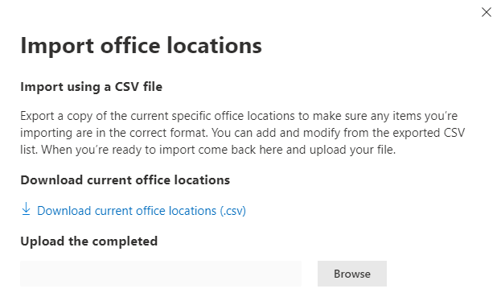

# Подключение к сети в центре Microsoft 365 AdminNetwork connectivity in the Microsoft 365 Admin Center

Центр Microsoft 365 Admin теперь включает агрегированные метрики сетевого подключения, собранные из Microsoft 365 клиента и доступные для просмотра только административными пользователями в клиенте.The Microsoft 365 Admin Center now includes aggregated network connectivity metrics collected from your Microsoft 365 tenant and available to view only by administrative users in your tenant.

> [!div class="mx-imgBorder"]
> 

**Сетевые оценки** и **сетевые** сведения отображаются в центре Microsoft 365 Admin в области **здравоохранения | Подключение к сети.****Network assessments** and **network insights** are displayed in the Microsoft 365 Admin Center under **Health | Network connectivity**.

> [!div class="mx-imgBorder"]
> 

>[!NOTE]
>Подключение к сети в Центре администрирования поддерживает клиентов в WW Commercial и Германии, но не GCC, GCC High, DoD или Китае.Network connectivity in the Admin Center supports tenants in WW Commercial and Germany but not GCC Moderate, GCC High, DoD or China.

При первом переходе на страницу производительности сети необходимо настроить расположения для того, чтобы увидеть карту производительности глобальной сети, оценку сети для всего клиента, процент пользователей, работающих удаленно или на месте, а также список текущих проблем для принятия мер и/или дальнейших исследований.When you first navigate to the network performance page, you will have to configure your locations in order to see the map of global network performance, a network assessment scoped to the entire tenant, percentage of your users working remotely vs onsite, and a list of current issues to take action on and/or to research further. На области обзоров можно сверлить, чтобы просмотреть конкретные показатели производительности сети и проблемы по расположению.From the overview pane, you can drill down to view specific network performance metrics and issues by location. Дополнительные сведения см. в обзоре производительности [сети в центре Microsoft 365 Admin.](#network-connectivity-overview-in-the-microsoft-365-admin-center)For more information, see [Network performance overview in the Microsoft 365 Admin Center](#network-connectivity-overview-in-the-microsoft-365-admin-center).

Вам может быть предложено присоединиться к общедоступным предварительным просмотрам этой функции от имени организации.You may be asked to join the public preview for this feature on behalf of your organization. Принятие обычно происходит немедленно, после чего вы увидите страницу подключения к сети.Acceptance usually happens immediately, after which you would see the network connectivity page.

Чтобы получить доступ к странице подключения к сети, необходимо быть администратором организации в Microsoft 365.To access the network connectivity page, you must be an administrator for the organization within Microsoft 365. Административная роль "Читатель отчетов" будет иметь доступ к этой информации.The Report Reader administrative role will have read access to this information. Чтобы настроить расположения и другие элементы сетевого подключения, администратор должен быть частью роли администратора сервера, например роли администратора службы поддержки.To configure locations and other elements of network connectivity an administrator must be part of a server administrator role such as the Service support admin role.

## Предварительные требования к оценке сетевого подключенияPre-requisites for network connectivity assessments to appear

Чтобы начать работу, включите параметр выбора расположения, чтобы автоматически собирать данные с устройств с помощью служб Windows Location Services, перейдите в список расположения, чтобы добавить или загрузить данные о расположении, или запустите Microsoft 365 сетевого подключения из офисных расположений.To get started, turn on your location opt-in setting to automatically collect data from devices using Windows Location Services, go to your Locations list to add or upload location data, or run the Microsoft 365 network connectivity test from your office locations. В то время как возможность подключения к сети может быть оценена по всей организации, для определенных офисных местоположений необходимо будет сделать любые улучшения в области сетевого проектирования.Whilst network connectivity can be evaluated across the organization, any network design improvements will need to be done for specific office locations. Сведения о подключении к сети предоставляются для каждого расположения офиса после определения этих расположений.Network connectivity information is provided for each office location once those locations can be determined. Существует три варианта получения сетевых оценок из офисных местоположений:There are three options for getting network assessments from your office locations:

### 1. Включить Windows службы расположения1. Enable Windows Location Services

Для этого параметра необходимо иметь не менее двух компьютеров, работающих в каждом расположении офиса, которые поддерживают предварительные требования.For this option, you must have at least two computers running at each office location that support the pre-requisites. OneDrive для Windows должна быть в курсе и устанавливаться на каждом компьютере.OneDrive for Windows version must be up-to-date and installed on each computer. Дополнительные сведения о OneDrive версиях см. в OneDrive [заметки о выпуске.](https://support.office.com/article/onedrive-release-notes-845dcf18-f921-435e-bf28-4e24b95e5fc0)For more information on OneDrive versions, see the [OneDrive release notes](https://support.office.com/article/onedrive-release-notes-845dcf18-f921-435e-bf28-4e24b95e5fc0). В ближайшем будущем планируется добавить сетевые измерения в другие Office 365 клиентские приложения.Network measurements are planned to be added to other Office 365 client applications in the near future.

Windows Служба расположения должна иметь согласие на компьютерах.Windows Location Service must be consented on the machines. Вы можете проверить это, запуская **приложение Карты** и найди себя.You can test this by running the **Maps** app and locating yourself. Его можно включить на одной машине с **Параметры | Конфиденциальность | Расположение,** в котором необходимо включить параметр _Разрешить приложениям_ доступ к вашему расположению.It can be enabled on a single machine with **Settings | Privacy | Location** where the setting _Allow apps to access your location_ must be enabled. Windows Согласие служб расположения можно развернуть на ПК с помощью MDM или групповой политики с помощью параметра _LetAppsAccessLocation._Windows Location Services consent can be deployed to PCs using MDM or Group Policy with the setting _LetAppsAccessLocation_.

Вам не нужно добавлять расположения в Центре администрирования с помощью этого метода, так как они автоматически идентифицированы в разрешении города.You do not need to add locations in the Admin Center with this method as they are automatically identified at the city resolution. Несколько расположений в одном городе не будут показаны при использовании служб Windows расположения.Multiple office locations within the same city will not be shown when using Windows Location Services. Сведения о расположении округлились до ближайших 300 метров на 300 метров, чтобы не было доступа к более точным сведениям о расположении.Location information is rounded to the nearest 300 meters by 300 meters so that more precise location information is not accessed.

Машины должны иметь Wi-Fi, а не кабель ethernet.The machines should have Wi-Fi networking rather than an ethernet cable. Машины с кабелем ethernet не имеют точной информации о расположении.Machines with an ethernet cable do not have accurate location information.

Образцы измерений и расположения офисов должны появиться через 24 часа после того, как эти предварительные требования будут выполнены.Measurement samples and office locations should start to appear 24 hours after these pre-requisites have been met.

### 2. Добавление местоположений и предоставление сведений о подсетях LAN2. Add locations and provide LAN subnet information

Для этого параметра Windows службы расположения или Wi-Fi не требуется.For this option, neither Windows Location Services nor Wi-Fi are required. Ваша OneDrive для Windows должна быть в курсе и установлена по крайней мере на одном компьютере в этом расположении.Your OneDrive for Windows version must be up-to-date and installed on at least one computer at the location.

Кроме того, необходимо добавить расположения на странице **Locations или** импортировать их из CSV-файла.You also need to add locations in the **Locations page** or to import them from a CSV file. Добавленные расположения должны включать сведения о подсети локальной сети office.The locations added must include your office LAN subnet information.

Этот параметр позволяет иметь несколько офисов, определенных в городе.This option allows you to have multiple offices defined within a city.

Все тестовые измерения с клиентских компьютеров включают данные подсети LAN, которые соотносятся с данными о расположении офиса, которые вы ввели.All test measurements from client machines include the LAN subnet information, which is correlated with the office location details that you have entered. Образцы измерений и расположения офисов должны появиться через 24 часа после того, как эти предварительные требования будут выполнены.Measurement samples and office locations should start to appear 24 hours after these pre-requisites have been met.

### 3. Вручную собирать тестовые отчеты с помощью средства Microsoft 365 подключения к сети3. Manually gather test reports with the Microsoft 365 network connectivity test tool

Для этого параметра необходимо идентифицировать человека в каждом расположении.For this option, you need to identify a person at each location. Попросите их просмотреть [Microsoft 365](https://connectivity.office.com) тест подключения к сети на компьютере Windows, на котором у них есть административные разрешения.Ask them to browse to [Microsoft 365 network connectivity test](https://connectivity.office.com) on a Windows machine on which they have administrative permissions. На веб-сайте они должны войти в свою учетную запись Office 365 для той же организации, что вы хотите увидеть результаты.On the web site, they need to sign in to their Office 365 account for the same organization that you want to see the results. Затем они должны щелкнуть **выполнить тест**.Then they should click **Run test**. Во время теста есть скачаный тест подключения EXE.During the test there is a downloaded Connectivity test EXE. Они должны открыть и выполнить это.They need to open and execute that. После завершения тестов результат теста загружается в Центр администрирования.Once the tests are completed, the test result is uploaded to the Admin Center.

Тестовые отчеты связаны с расположением, если оно было добавлено с данными подсети LAN, в противном случае они показаны только в расположении города.Test reports are linked to a location if it was added with LAN subnet information, otherwise they are shown at the city location only.

Образцы измерений и расположения офисов должны появиться через 2-3 минуты после завершения тестового отчета.Measurement samples and office locations should start to appear 2-3 minutes after a test report is completed. Дополнительные сведения см. в Microsoft 365 тест подключения [к сети.](office-365-network-mac-perf-onboarding-tool.md)For more information, see [Microsoft 365 network connectivity test](office-365-network-mac-perf-onboarding-tool.md).

> [!NOTE]
> В настоящее время, если wWhen добавляет расположения вашего офиса для Microsoft 365 подключения к сети в Центр администрирования Microsoft 365, вы можете предоставить только адреса IPv4 для ваших lan-сетей.Currently, wWhen adding your office locations to Microsoft 365 network connectivity in the Microsoft 365 admin center, you can provide only IPv4 addresses for your LAN subnets. Egress IP-адреса должны использовать IPv4.Egress IP addresses must use IPv4.

## Как использовать эти сведения?How do I use this information?

**Сведения о сети,** связанные с ними рекомендации по производительности и сетевые оценки предназначены для разработки периметров сети для расположения офисов.**Network insights**, their related performance recommendations and network assessments are intended to help in designing network perimeters for your office locations. Каждое представление содержит сведения о характеристиках производительности для определенного общего сетевого вопроса для каждого географического расположения, в котором пользователи имеют доступ к вашему клиенту.Each insight provides details about the performance characteristics for a specific common networking issue for each geographic location where users are accessing your tenant. **Рекомендации по производительности** для каждой сетевой идеи предлагают определенные изменения в дизайне сетевой архитектуры, которые можно внести для улучшения взаимодействия пользователей, связанных Microsoft 365 подключения к сети.**Performance recommendations** for each network insight offer specific network architecture design changes you can make to improve user experience related to Microsoft 365 network connectivity. Оценка сети показывает, как подключение к сети влияет на взаимодействие пользователей, что позволяет сравнивать различные сетевые подключения расположения пользователей.The network assessment shows how network connectivity impacts user experience, allowing for comparison of different user location network connections.

**Сетевые оценки** перегоняют совокупность многих показателей производительности сети в снимок работоспособности корпоративной сети, представляющую значение точки от 0 до 100.**Network assessments** distill an aggregate of many network performance metrics into a snapshot of your enterprise network health, represented by a points value from 0 - 100. Сетевые оценки охватываются как для всего клиента, так и для каждого географического расположения, из которого пользователи подключаются к вашему клиенту, предоставляя администраторам Microsoft 365 простой способ мгновенно понять состояние сети предприятия и быстро сверлить подробный отчет для любого глобального расположения офиса.Network assessments are scoped to both the entire tenant and for each geographic location from which users connect to your tenant, providing Microsoft 365 administrators with an easy way to instantly grasp a gestalt of the enterprise's network health and quickly drill down into a detailed report for any global office location.

Сложные предприятия с несколькими расположениями офисов и нетривиальными архитектурами периметра сети могут извлечь выгоду из этой информации либо во время первоначальной работы в Microsoft 365, либо для устранения проблем с производительностью сети, обнаруженных при росте использования.Complex enterprises with multiple office locations and non-trivial network perimeter architectures can benefit from this information either during their initial onboarding to Microsoft 365 or to remediate network performance issues discovered with usage growth. Обычно это необязательно для малых предприятий, использующих Microsoft 365, или для любых предприятий, у которых уже есть простое и прямое подключение к сети.This is usually not necessary for small businesses using Microsoft 365, or any enterprises who already have simple and direct network connectivity. Предприятия с более чем 500 пользователями и несколькими офисными расположениями, как ожидается, выиграют больше всего.Enterprises with over 500 users and multiple office locations are expected to benefit the most.

>[!IMPORTANT]
>Сведения о сети, рекомендации по производительности и оценки в центре Microsoft 365 Admin в настоящее время находятся в состоянии предварительного просмотра и доступны только для Microsoft 365 клиентов, которые были зарегистрированы в программе предварительного просмотра функций.Network insights, performance recommendations and assessments in the Microsoft 365 Admin Center is currently in preview status, and is only available for Microsoft 365 tenants that have been enrolled in the feature preview program.

## Enterprise сетевых подключенийEnterprise network connectivity challenges

> [!div class="mx-imgBorder"]
> 

Многие предприятия имеют конфигурации периметра сети, которые со временем выросли и в основном предназначены для размещения доступа сотрудников к веб-сайту, где большинство веб-сайтов не известны заранее и не соответствуют действительности.Many enterprises have network perimeter configurations which have grown over time and are primarily designed to accommodate employee Internet web site access where most web sites are not known in advance and are untrusted. Основное внимание уделяется предотвращению вредоносных программ и фишинговых атак с этих неизвестных веб-сайтов.The prevailing and necessary focus is avoiding malware and phishing attacks from these unknown web sites. Эта стратегия конфигурации сети, хотя и полезна в целях безопасности, может привести к ухудшению Microsoft 365 производительности и пользовательского интерфейса.This network configuration strategy, while helpful for security purposes, can lead to degradation of Microsoft 365 user performance and user experience.

## Как мы можем решить эти проблемыHow we can solve these challenges

Предприятия могут улучшить общее взаимодействие с  пользователями и обеспечить безопасность среды, следуя Office 365 принципам подключения и используя функцию сетевого подключения Microsoft 365 Admin Центра.Enterprises can improve general user experience and secure their environment by following [Office 365 connectivity principles](./microsoft-365-network-connectivity-principles.md) and by using the Microsoft 365 Admin Center network connectivity feature. В большинстве случаев выполнение этих общих принципов будет иметь значительное положительное влияние на задержку конечного пользователя, надежность службы и общую производительность Microsoft 365.In most cases, following these general principles will have a significant positive impact on end-user latency, service reliability and overall performance of Microsoft 365.

Иногда корпорации Майкрософт предложено исследовать проблемы производительности сети с Microsoft 365 для крупных корпоративных клиентов, и это часто имеет корневую причину, связанную с инфраструктурой периметра сети клиента.Microsoft is sometimes asked to investigate network performance issues with Microsoft 365 for large enterprise customers, and these frequently have a root cause related to the customer's network perimeter infrastructure. При обнаружении распространенной первопричины проблемы периметра клиентской сети мы стремимся определить простые тестовые измерения, которые ее идентифицируют.When a common root cause of a customer network perimeter issue is found we seek to identify simple test measurements that identifies it. Тест с порогом измерения, который определяет определенную проблему, имеет важное значение, так как мы можем проверить одно и то же измерение в любом месте, определить, присутствует ли эта корневая причина, и поделиться им в качестве сетевой информации с администратором.A test with a measurement threshold that identifies a specific problem is valuable because we can test the same measurement at any location, tell whether this root cause is present there and share it as a network insight with the administrator.

Некоторые сетевые сведения просто указывают на проблему, которая требует дополнительного исследования.Some network insights will merely indicate a problem that needs further investigation. Представление о сети, в котором у нас достаточно тестов, чтобы показать определенное действие по исправлению, чтобы исправить корневую причину, перечислены в качестве **рекомендуемых действий.**A network insight where we have enough tests to show a specific remediation action to correct the root cause is listed as a **recommended action**. Эти рекомендации, основанные на живых метриках, которые раскрывают значения, которые находятся за пределами заранее определенного порога, гораздо более ценны, чем рекомендации по рекомендациям общей практики, так как они специфичная для вашей среды и покажут фактическое улучшение после внесения рекомендуемых изменений.These recommendations, based on live metrics that reveal values that fall outside a predetermined threshold, are much more valuable than general best practice advice since they are specific to your environment and will show the actual improvement once the recommended changes have been made.

## Обзор подключения к сети в центре Microsoft 365 AdminNetwork connectivity overview in the Microsoft 365 Admin Center

Корпорация Майкрософт имеет существующие сетевые измерения из нескольких Office и веб-клиентов, которые поддерживают работу Microsoft 365.Microsoft has existing network measurements from several Office desktop and web clients which support the operation of Microsoft 365. Эти измерения в настоящее время используются для предоставления анализа архитектуры сетевой архитектуры и оценки сетевой сети, которые показаны на странице подключения к сети в центре Microsoft 365 Admin. These measurements are now being used to provide network architecture design insights and a network assessment which are shown in the **Network connectivity** page in the Microsoft 365 Admin Center.

По умолчанию приблизительные сведения о расположении, связанные с сетевыми измерениями, определяют город, в котором находятся клиентские устройства.By default, approximate location information associated with the network measurements identify the city where client devices are located. Оценка сети в каждом расположении отображается с цветом, а относительное число пользователей в каждом расположении представлено размером круга.The network assessment at each location is shown with color and the relative number of users at each location is represented by the size of the circle.

> [!div class="mx-imgBorder"]
> 

На странице обзор также показана оценка сети для клиента в качестве средневзвешеного показателя по всем расположениям офисов.The overview page also shows the network assessment for the customer as a weighted average across all office locations.

> [!div class="mx-imgBorder"]
> 

На вкладке Locations можно просмотреть представление таблицы о местах, где  их можно отфильтровать, отсортировать и изменить. Расположения с определенными рекомендациями также могут включать предполагаемое улучшение задержки.You can view a table view of the locations where they can be filtered, sorted, and edited in the **Locations** tab. Locations with specific recommendations may also include an estimated potential latency improvement. Это рассчитывается путем принятия медиана задержки пользователей организации в расположении и вычитания медиана задержки для всех организаций в одном городе.This is calculated by taking the median latency of your organization users at the location and subtracting the median latency for all organizations in the same city.

> [!div class="mx-imgBorder"]
> 

## Удаленная оценка рабочих и метрики подключения к пользователюRemote worker assessment and user connection metrics

Мы классифицировать журналы сетевого трафика как удаленных или удаленных пользователей и показывать их проценты в разделе метрики подключения пользователей области обзора.We classify network traffic logs as remote or onsite users and show their percentages in the user connection metrics section of the overview pane. Для городов, в которых есть удаленные пользователи, при открываемой странице этого расположения вы найдете конкретный балл оценки удаленной сети.For cities where you have remote users, you will find the location specific remote network assessment score when you open that location’s page. В списке расположения будут как офисные расположения, так и удаленные рабочие города, которые можно отфильтровать и отсортировать.The locations list will have both office locations and remote worker cities, which can be filtered and sorted. Мы предоставляем оценку удаленного работника с разбивкой точек для Exchange, SharePoint и Teams.We provide the remote worker assessment score, with points breakdown for Exchange, SharePoint and Teams.

Сведения о сетевых сетях домашних пользователей агрегируются и сообщаются на уровне города и ограничиваются городами с не менее чем 5 удаленными сотрудниками.Home user networking insights are aggregated and reported at a city level and limited to cities with a minimum of 5 remote employees. Мы не идентифицируем отдельных сотрудников, работающих из дома.We are not identifying individual employees working from home.

Расположения автоматически классифицируются как удаленные или удаленные, однако для обеспечения 100% классификации вы можете вводить все IP-адреса удаленного входа вручную.Locations are auto classified as onsite or remote, however, you have the option to enter all your onsite egress IP addresses manually to ensure a 100% classification. Если вы решите перейти по этому маршруту, после добавления всех IP-адресов **egress** enter вручную в флажке Locations Параметры после добавления всех IP-адресов отступа.If you decide to go this route, you will have to check the **Enter all onsite egress IP addresses manually** checkbox in the Locations Settings flyout after adding all your egress IP addresses. Когда это будет сделано, все журналы сетевого трафика с IP-адресов, помеченных вами как на месте, всегда будут классифицироваться как офисы, а все другие IP-адреса отступа будут классифицироваться как удаленные.When this is done, all network traffic logs from egress IP addresses you have marked as onsite will always be classified as offices and every other egress IP address will be classified as remote.

## Конкретные сводки и сведения о производительности сети расположения офисовSpecific office location network performance summary and insights

Выбор расположения офиса открывает страницу сводки, относящаяся к определенному расположению, с подробными сведениями о сетевом отступе, который был определен в результате измерений для этого расположения офиса.Selecting an office location opens a location-specific summary page showing details of the network egress that has been identified from measurements for that office location.

> [!div class="mx-imgBorder"]
> 

Карта сети периметра для пользователей организации в расположении показана с некоторыми или всеми этими элементами:A map of the perimeter network for your organization users at the location is shown with some or all of these elements:

- **Office** - расположение офиса для страницы, на которая вы смотрите**Office location** - The office location for the page you are looking at
- **Периметр сети** — расположение источника IP-адреса для подключений из расположения офиса.**Network perimeter** - The location of the source IP Address for connections from the office location. Это зависит от точности баз данных гео-IP-расположенияThis depends on the accuracy of geo-IP location databases
- **Exchange** передняя дверь службы — одна из рекомендуемых Exchange, к которую пользователи в этом расположении офиса должны подключаться**Exchange optimal service front door** - One of the recommended Exchange service front doors that users in this office location should connect to
- **Exchange-** входная дверь Exchange службы, к которую подключены пользователи, но не рекомендуется**Exchange sub-optimal front door** - An Exchange service front door that users are connected to, but is not recommended
- **SharePoint входной** двери службы — одна из рекомендуемых SharePoint, к которую пользователи в этом расположении офиса должны подключаться**SharePoint optimal service front door** - One of the recommended SharePoint service front doors that users in this office location should connect to
- **SharePoint-оптимальной** входной двери службы — входная дверь SharePoint, к которую подключены пользователи, но не рекомендуется**SharePoint sub-optimal service front door** - A SharePoint service front door that users are connected to, but is not recommended
- **Сервер рекурсивного** решения DNS — расположение из базы данных геоИП обнаруженного рекурсивного рекурсизатора DNS, используемого для Exchange Online (при наличии)**DNS recursive resolver server** - The location from a geo IP database of the detected DNS recursive resolver used for Exchange Online (if available)
- **Прокси-сервер** — расположение из базы данных ip-адресов обнаруженного прокси-сервера (при наличии)**Your proxy server** - The location from a geo IP database of the detected proxy server (if available)

На странице сводки расположения офиса дополнительно показаны оценка сети расположения, история оценки сети, сравнение оценки этого расположения с другими клиентами в том же городе, а также список конкретных рекомендаций и рекомендаций, которые можно предпринять для повышения производительности и надежности сети.The office location summary page additionally shows the location's network assessment, network assessment history, a comparison of this location's assessment to other customers in the same city, and a list of specific insights and recommendations that you can undertake to improve network performance and reliability.

Сравнение между клиентами в одном городе основано на ожидании того, что все клиенты имеют равный доступ к поставщикам сетевых услуг, инфраструктуре телекоммуникаций и расположенным поблизости точкам присутствия сети Майкрософт.Comparisons between customers in the same city are based on the expectation that all customers have equal access to network service providers, telecommunications infrastructure, and nearby Microsoft network points of presence.

Имена местоположений можно настроить при добавлении нового расположения или редактировании существующего расположения в пролете расположения.Location names can be customized when adding a new location or editing an existing location in the location flyout. Это обеспечивает гибкость для настройки имен расположения в любое время.This provides you with the flexibility to customize your location names at any time. Кроме того, при добавлении lan-подсетей непосредственно в вылет расположения мы показывем выпадающе список подсетей LAN с мягким соответствием, которые можно выбрать из.Also, when adding LAN subnets directly in the location flyout, we show a drop-down list of soft-matched LAN subnets that you can select from. Можно добавить и изменить имена отдельных IP-адресов, отступив от офиса.Circuit names for specific office egress IP addresses can be added and edited as well.

На вкладке подробные сведения на странице расположения офиса показаны конкретные результаты измерений, которые использовались для представления каких-либо сведений, рекомендаций и оценки сети.The details tab on the office location page shows the specific measurement results that were used to come up with any insights, recommendations, and the network assessment. Это предусмотрено для того, чтобы сетевые инженеры могли проверять рекомендации и факторы в любых ограничениях или специфике в своей среде.This is provided so that network engineers can validate the recommendations and factor in any constraints or specifics in their environment. Вы также найдете предполагаемое число пользователей для собранных образцов в этом офисе, а также удаленных рабочих в этом городе.You will also find the estimated number of users for collected samples at that office locations as well as the remote workers in that city.

> [!div class="mx-imgBorder"]
> 

## Совместное использование данных оценки сети с Корпорацией МайкрософтSharing network assessment data with Microsoft

По умолчанию сетевые оценки для организации и сетевые сведения делятся с сотрудниками Майкрософт.By default, the network assessments for your organization and the network insights are shared with Microsoft employees. Это не включает личные данные сотрудников, а только конкретные метрики сетевой оценки и сетевые сведения, показанные в центре администрирования для расположения вашего офиса.This does not include any personal data from your staff but only the specific network assessment metrics and network insights shown in the admin center for your office locations. Кроме того, в него не включены имена расположения офиса или уличные адреса, поэтому необходимо сообщить им город и узнать, как будет поддерживаться имя офиса, который необходимо обсудить.It also does not include your office location names or street addresses so you would need to tell them the city and support ID of the office you want to discuss. Если это отключено, инженеры Корпорации Майкрософт, с помощью которые вы обсуждаете подключение к сети, не смогут просмотреть эту информацию.If this is turned off, the Microsoft engineers that you are discussing your network connectivity with cannot view any of this information. Включение этого параметра позволяет использовать только будущие данные, начиная со дня включения.Enabling this setting only shares future data starting the day after you enable it.

## CSV Import для расположения локального офиса подсети LANCSV Import for LAN subnet office locations

Для идентификации локального офиса подсети необходимо заранее добавить каждое расположение.For LAN subnet office identification, you need to add each location in advance. Вместо добавления отдельных местоположений в вкладке **Locations** их можно импортировать из CSV-файла.Instead of adding individual office locations in the **Locations** tab you can import them from a CSV file. Вы можете получить эти данные из других хранимых вами мест, таких как панель мониторинга качества вызовов или сайты и службы Active Directory.You may be able to obtain this data from other places you have stored it such as the Call Quality Dashboard or Active Directory Sites and Services

В CSV-файле обнаруженное расположение города в столбце userEntered указывается как пустое, а вручную добавленное расположение офиса — 1.In the CSV file, a discovered city location shows in the userEntered column as blank, and a manually added office location shows as 1.

1. В главном _окне Подключение к Microsoft 365_ щелкните вкладку **Locations.**In the main _Connectivity to Microsoft 365_ window, click the **Locations** tab.

1. Нажмите **кнопку Импорт** чуть выше списка расположения.Click the **Import** button just above the locations list. Появится **вылет местоположений** импортных офисов.The **Import office locations** flyout will appear.

   > [!div class="mx-imgBorder"]
   > 

1. Щелкните ссылку **Download current office (.csv)** для экспорта текущего списка местоположений в CSV-файл и сохраните его на локальном жестком диске.Click the **Download current office locations (.csv)** link to export the current locations list to a CSV file, and save it to your local hard disk. Это позволит вам правильно отформатировать CSV с заголовками столбцов, к которым можно добавить расположения.This will provide you with a correctly formatted CSV with column headings to which you can add locations. Вы можете оставить существующие экспортируемые расположения как они есть; они не будут дублироваться при импорте обновленного CSV.You can leave the existing exported locations as they are; they will not be duplicated when you import the updated CSV. Если вы хотите изменить адрес существующего расположения, он будет обновлен при импорте CSV.If you wish to change the address of an existing location, it will be updated when you import the CSV. Вы не можете изменить адрес обнаруженного города.You cannot change the address of a discovered city.

1. Откройте CSV и добавьте свои расположения, заполнив следующие поля в новой строке для каждого расположения, которые вы хотите добавить.Open the CSV and add your locations by filling out the following fields on a new line for each location you want to add. Оставьте все остальные поля пустыми; значения, которые вы вводите в других полях, будут игнорироваться.Leave all other fields blank; values you enter in other fields will be ignored.

   1. **userEntered** (обязательно): должно быть 1 для добавленного нового расположения office subnet LAN**userEntered** (required): Must be 1 for a new LAN Subnet office location being added
   1. **Имя** (обязательно): имя расположения офиса**Name** (required): The name of the office location
   1. **Адрес** (обязательно): физический адрес офиса**Address** (required): The physical address of the office
   1. **Широта** (необязательный вариант): заполнение Bing карт при пустом**Latitude** (optional): Populated from Bing maps lookup of the address if blank
   1. **Долгота** (необязательный вариант): заполненная Bing на картах при пустых адресах**Longitude** (optional): Populated from Bing maps lookup of the address if blank
   1. **Egress IP-адрес варьируется от 1** до 5 (необязательно): Для каждого диапазона введите имя схемы, за которым следует разделенный пробелом список действительных адресов CIDR IPv4.**Egress IP Address ranges 1-5** (optional): For each range, enter the circuit name followed by a space separated list of valid IPv4 CIDR addresses. Эти значения используются для дифференцированного расположения нескольких офисов, в которых используются те же IP-адреса подсети LAN.These values are used to differentiate multiple office locations where you use the same LAN subnet IP Addresses. Egress Диапазоны IP-адресов должны быть /24 размера сети и /24 не включены в ввод.Egress IP Address ranges all must be /24 network size and the /24 is not included in the input.
   1. **LanIps** (обязательно): Список диапазонов подсетей LAN, которые используются в этом расположении офиса.**LanIps** (required): List the LAN subnet ranges in use at this office location. Для ID-id-сетей lan-сетей необходимо включить размер сети CIDR, в котором размер сети может быть между /8 и /29.LAN subnet IDs need to have a CIDR network size included where the network size can be between /8 and /29. Несколько диапазонов подсетей LAN можно разделить запятой или запятой.Multiple LAN subnet ranges can be separated by a comma or a semicolon.

1. При добавлении расположения офиса и сберегнуть файл нажмите кнопку **Обзор** рядом с завершенным полем **Upload** и выберите сохраненный CSV-файл.When you have added your office locations and saved the file, click the **Browse** button next to the **Upload the completed** field and select the saved CSV file.

1. Файл будет проверяться автоматически.The file will be automatically validated. Если есть ошибки проверки, вы увидите сообщение об ошибке. В файле импорта есть некоторые _ошибки. Просмотрите ошибки, исправь файл импорта и попробуйте еще раз._If there are validation errors, you will see the error message: _There are some errors in the import file. Review the errors, correct the import file, and then try again._ Щелкните **ссылку Откройте сведения об** ошибках для списка определенных ошибок проверки поля.Click the link **Open error details** for a list of specific field validation errors.

   > [!div class="mx-imgBorder"]
   > 

1. Если в файле нет ошибок, вы увидите сообщение: _отчет готов. Найдено x расположения для добавления и x расположения для обновления._If there are no errors in the file, you will see the message: _The report is ready. Found x locations to add and x locations to update._ Нажмите **кнопку Импорт,** чтобы загрузить CSV.Click the **Import** button to upload the CSV.

   > [!div class="mx-imgBorder"]
   > 

## Вопросы и ответыFAQ

### Что такое Microsoft 365 входная дверь службы?What is a Microsoft 365 service front door?

Входная Microsoft 365 является точкой входа в глобальную сеть Майкрософт, где Office и службы прекращают свое сетевое подключение.The Microsoft 365 service front door is an entry point on Microsoft's global network where Office clients and services terminate their network connection. Для оптимального подключения к Microsoft 365 сети рекомендуется прекратить подключение к сети в ближайшую Microsoft 365 входную дверь.For an optimal network connection to Microsoft 365, it is recommended that your network connection is terminated into the closest Microsoft 365 front door.

>[!NOTE]
>Microsoft 365 входная дверь службы не имеет прямого отношения к продукту службы входных дверей Azure, доступному на рынке Azure.Microsoft 365 service front door has no direct relationship to the Azure Front Door Service product available in the Azure marketplace.

### Что является оптимальным Microsoft 365 входной двери службы?What is an optimal Microsoft 365 service front door?

Оптимальной Microsoft 365 входной двери службы является входная дверь, которая ближе всего к вашей сетевой отступной, как правило, в вашем городе или области метро.An optimal Microsoft 365 service front door is one that is closest to your network egress, generally in your city or metro area. Используйте средство [Microsoft 365 (предварительный просмотр)](office-365-network-mac-perf-onboarding-tool.md) для определения расположения вашей входной двери Microsoft 365 службы и оптимальной входной двери службы.Use the [Microsoft 365 connectivity test tool (preview)](office-365-network-mac-perf-onboarding-tool.md) to determine the location of your in-use Microsoft 365 service front door and optimal service front door. Если средство определяет оптимальное использование входной двери, вы оптимально подключайтесь к глобальной сети Майкрософт.If the tool determines your in-use front door is optimal, you are optimally connecting to Microsoft's global network.

### Что такое расположение egress Интернета?What is an internet egress location?

Расположение выхода из Интернета — это расположение, в котором сетевой трафик выходит из корпоративной сети и подключается к Интернету.The internet egress location is the location where your network traffic exits your enterprise network and connects to the Internet. Это также определено как место, где у вас есть устройство сетевого перевода адресов (NAT) и обычно, где вы подключаетсяе к поставщику интернет-служб (ISP).This is also identified as the location where you have a Network Address Translation (NAT) device and usually where you connect with an Internet Service Provider (ISP). Если вы видите расстояние между расположением и расположением отступа к Интернету, это может указывать на значительный откат WAN.If you see a long distance between your location and your internet egress location, this may indicate a significant WAN backhaul.

### Какая лицензия нужна для этой возможности?What license is needed for this capability?

Требуется лицензия, которая предоставляет доступ к Центр администрирования Microsoft 365.You require a  license that provides access to the Microsoft 365 admin center.

## Статьи по темеRelated topics

[Microsoft 365 (предварительный просмотр)Microsoft 365 network insights (preview)](office-365-network-mac-perf-insights.md)

[Microsoft 365 сети (предварительный просмотр)Microsoft 365 network assessment (preview)](office-365-network-mac-perf-score.md)

[Microsoft 365 для тестирования подключения (предварительный просмотр)Microsoft 365 connectivity test tool (preview)](office-365-network-mac-perf-onboarding-tool.md)

[Microsoft 365 Службы расположения сетевых подключений (предварительный просмотр)Microsoft 365 Network Connectivity Location Services (preview)](office-365-network-mac-location-services.md)
