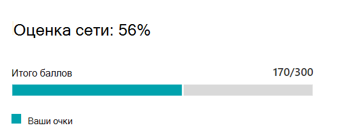

# Оценка сети Microsoft 365 (предварительная версия)Microsoft 365 network assessment (preview)

В сетевых подключениях Центра администрирования Microsoft  365 оценки сети объединяют множество метрик производительности сети в моментальный снимок работоспособности сети периметра предприятия, представленный значением 0–100.In the Microsoft 365 Admin Center's network connectivity, **network assessments** distill an aggregate of many network performance metrics into a snapshot of your enterprise network perimeter health, represented by a points value from 0 - 100. Оценка сети показывает, насколько проектирование сети, ответственное с клиентами, влияет на пользовательский интерфейс Office 365.A network assessment tells you how much the customer responsible network design is impacting Office 365 user experience. Оценка сети зависит как от всего клиента, так и для каждого географического расположения, из которого пользователи подключаются к вашему арендатору, предоставляя администраторам Microsoft 365 простой способ мгновенно понять состояние сети предприятия и быстро детализированную информацию о подробном отчете по любому расположению глобального офиса.Network assessments are scoped to both the entire tenant and for each geographic location from which users connect to your tenant, providing Microsoft 365 administrators with an easy way to instantly grasp a gestalt of the enterprise's network health and quickly drill down into a detailed report for any global office location.

Значение точек оценки сети — это среднее значение задержки TCP, скорости скачивания и показателей качества подключения UDP, скомпилировать один раз в день.The network assessment points value is an average of TCP latency, download speed and UDP connection quality metrics compiled once a day. Показатели производительности для сетей, владельцев корпорации Майкрософт, исключаются из этих показателей, чтобы убедиться, что результаты оценки являются однозначно определенными и характерными для корпоративной сети.Performance metrics for Microsoft-owned networks are excluded from these measurements to ensure that assessment results are unambiguous and specific to the corporate network.

Очень низкое значение оценки сети указывает на то, что клиенты Microsoft 365 будут испытывать значительные проблемы при подключении к клиенту или поддержании отзывчивого пользовательского интерфейса, а высокое значение указывает на правильно настроенную сеть с низким количеством текущих проблем с производительностью.A very low network assessment value suggests that Microsoft 365 clients will have significant problems connecting to the tenant or maintaining a responsive user experience, while a high value indicates a properly configured network with few ongoing performance issues. Значение 80 % представляет собой работоспособное базовое значение, в котором не следует ожидать регулярных жалоб пользователей на подключение к Microsoft 365 или быстроту отклика из-за производительности сети.A value of 80% represents a healthy baseline where you should not expect to receive regular user complaints about Microsoft 365 connectivity or responsiveness due to network performance. По мере улучшения итеративных сетевых подключений это значение будет увеличиваться вместе с взаимодействием с пользователем.As iterative network connectivity improvements are made, this value will increase along with user experience.

| Оценка сетиNetwork assessment | Ожидаемое пользовательское интерфейсExpected user experience |
| :----------------- | :----------------------- |
| 100100                | ЛучшийBest                     |
| 8080                 | Соответствует рекомендациямMeets recommendations    |
| 6060                 | ХорошоAcceptable               |
| 4040                 | У пользователей могут возникнуть проблемыUsers may experience issues |
| 2020                 | Пользователи могут пожаловатьсяUsers may complain       |
| 00                  | Проблемы с сетью часто обсуждаютсяNetwork problems a common topic of discussion |

>[!IMPORTANT]
>Анализ сети, рекомендации по производительности и оценки в Центре администрирования Microsoft 365 в настоящее время находятся в состоянии предварительной версии и доступны только для клиентов Microsoft 365, которые зарегистрированы в программе предварительного просмотра функций.Network insights, performance recommendations and assessments in the Microsoft 365 Admin Center is currently in preview status, and is only available for Microsoft 365 tenants that have been enrolled in the feature preview program.

## Панель оценки сетиNetwork assessment panel

В каждой оценке сети в области действия клиента или определенного расположения офиса показана панель с подробными сведениями об оценке.Each network assessment, whether scoped to the tenant or to a specific office location, shows a panel with details about the assessment. На этой панели показана лихая диаграмма оценки как в виде процентного соотношения, так и в виде общего числа точек для каждой рабочей нагрузки компонента, включая только рабочие нагрузки, для которых получены данные измерений.This panel shows a bar chart of the assessment both as a percentage and as the total points for each component workload including only workloads where measurement data was received. Для оценки сети расположения office мы также покажем сравнение с процентом пользователей Microsoft 365 в каждом из пяти долейтов, которые сообщили данные в одном городе с вашим офисом.For an office location network assessment, we also show a comparison to the percent of Microsoft 365 customers in each of five quintiles that reported data in the same city as your office location.

В **этой панели показана** оценка для каждой рабочей нагрузки компонента.The **Assessment breakdown** in the panel shows the assessment for each of the component workloads.

В **истории оценки** показаны последние 30 дней оценки и контрольные показатели.The **Assessment history** shows the past 30 days of the assessment and the benchmark. На вкладке "История" также можно отвести отчет по истории метрик для любого расположения в офисе в течение двух лет. Вкладка "История" позволяет выбрать атрибуты для отчета, а также выбрать временные рамки отчета, чтобы выделить влияние проекта обновления сети и увидеть улучшения оценки сети.You can also report on the metrics history for any office location for up to two years using the history tab. The history tab allows you to select your attributes to report on and by choosing a report timeframe you can highlight the impact of a network update project and see the improvement to your network assessment.

## Оценки сети клиента и оценка сети расположения офисаTenant network assessments and office location network assessments

Оценка сети измеряет проект сетевого периметра расположения офиса в сети Майкрософт.A network assessment measures the design of the network perimeter of an office location to Microsoft's network. Улучшения периметра сети лучше всего сделать в каждом расположении офиса.Improvements to the network perimeter is best done at each office location.

Мы откажем значение оценки сети для всего клиента Microsoft 365 на странице обзора производительности сети, которое является взвешаемой средней оценкой сети для всех местоположений офисов.We show a network assessment value for the whole Microsoft 365 tenant on the network performance overview page which is a weighted average of the network assessments for all office locations. Кроме того, существует определенное значение оценки сети для каждого обнаруженного расположения офиса на странице сводки этого расположения.There is also a specific network assessment value for each detected office location on that location's summary page.

## Exchange OnlineExchange Online

Для Exchange Online измеряется задержка TCP с клиентского компьютера на входную линию службы Exchange.For Exchange Online the TCP latency from the client machine to the Exchange service front door is measured. На это может повлиять расстояние, на которое сеть передается через клиенты по локальной и WAN-сети.This can be impacted by the distance the network travels over the customers LAN and WAN. На это также могут влиять промежуточные сетевые устройства или службы, которые задерживают подключение или вызывают повторное обслуживание пакетов.It can also be impacted by network intermediary devices or services which delay the connectivity or cause packets to be resent. На него влияет то, насколько далеко находится ближайший вход в службу Exchange.And it is impacted by how far away the nearest Exchange service front door is. Медиана (также известная как 50-й процентиль или показатель P50) измеряется для всех измерений за предыдущие три дня.The median (also known as the 50th percentile or P50 measure) is taken for all measurements over the previous three days.

Оценка Exchange Online оценивается с помощью следующей таблицы.The Exchange Online assessment is made using the following table. Любые значения задержки TCP между порогами налагаются линейно внутри полосы.Any TCP latency number between the thresholds are assigned points linearly within the band.

| Задержка TCPTCP Latency   | PointsPoints |
| :------------ | :----- |
| 10 мс или меньше10ms or less  | 100100    |
| 25 мс25ms          | 8080     |
| 100 мс100ms         | 6060     |
| 200 мс200ms         | 4040     |
| 300 мс300ms         | 2020     |
| 350 мс или больше350ms or more | 00      |

## SharePoint OnlineSharePoint Online

Для SharePoint Online измеряется скорость скачивания, доступная пользователю к документу из SharePoint или OneDrive.For SharePoint Online the download speed available for a user to access a document from SharePoint or OneDrive is measured. На это может повлиять полоса пропускания, доступная для сетевых каналов между клиентской машиной и сетью Майкрософт.This can be impacted by the bandwidth available on network circuits between the client machine and Microsoft's network. На него также часто влияет перегрузка сети, которая существует в узких местах на сложных сетевых устройствах или в плохом Wi-Fi областях.It is also often impacted by network congestion that exists in bottlenecks in complex network devices or in poor coverage Wi-Fi areas. Скорость скачивания измеряется в мегабайтах в секунду, что составляет примерно одну десятую часть каналов с оценкой мегабит в секунду.The download speed is measured in megabytes per second which is approximately one tenth of a circuits rated megabits per second. Мегабайт в секунду полезен, так как вы можете напрямую узнать, какой размер файла можно скачать за 1 секунду.The MegaByte per second unit is helpful because you can directly see what size file can be downloaded in 1 second. 25-й процентиль (также известный как показатель P25) взят для всех измерений за предыдущие три дня.The 25th percentile (also known as the P25 measure) is taken for all measurements over the previous three days. Этот 25-й процентиль помогает уменьшить влияние различной перегрузки с течением времени.This 25th percentile helps reduce the impact of varying congestion over time.

Оценка SharePoint Online оценивается с помощью следующей таблицы.The SharePoint Online assessment is made using the following table. Любой номер скорости скачивания между порогами будет назначен линейно внутри полосы.Any download speed number between the thresholds are assigned points linearly within the band.

| Скорость скачиванияDownload speed | PointsPoints |
| :------------- | :----- |
| 20MBps или более20MBps or more | 100100    |
| 14MBps14MBps         | 8080     |
| 8MBps8MBps          | 6060     |
| 4MBps4MBps          | 4040     |
| 2MBps2MBps          | 2020     |
| 0MBps0MBps          | 00      |

## Microsoft TeamsMicrosoft Teams

Для Microsoft Teams качество сети измеряется как задержка UDP, дрожание UDP и потеря пакетов UDP.For Microsoft Teams the Network quality is measured as UDP latency, UDP jitter, and UDP packet loss. UDP используется для подключения аудио- и видеоконференций к аудио- и видеоконференциям для Microsoft Teams.UDP is used for call and conferencing audio and video media connectivity for Microsoft Teams. На это могут влиять те же факторы, что и для задержки и скорости скачивания в дополнение к пробелам в поддержке UDP сети, так как UDP настраивается отдельно для более распространенного протокола TCP.This can be impacted by the same factors as for latency and download speed in addition to connectivity gaps in a network's UDP support since UDP is configured separately to the more common TCP protocol. Медиана (также известная как 50-й процентиль или показатель P50) измеряется для всех измерений за предыдущие три дня.The median (also known as the 50th percentile or P50 measure) is taken for all measurements over the previous three days. 

Мы вычисляем показатель экспертного мнения на точки зрения из этих показателей UDP для шкалы от одного до пяти.We calculate a mean opinion score from these UDP measurements for a scale from one to five. Затем мы сомем это с масштабом от 0 до 100 точек для оценки сети Microsoft Teams.Then we map that to the 0-100 points scale for the Microsoft Teams network assessment.  Общий хороший результат составляет более 87,5 баллов, а общий плохой — менее 50 баллов.Overall good is over 87.5 points and overall bad is below 50 points.

## Связанные статьиRelated topics

[Сетевое подключение в Центре администрирования Microsoft 365 (предварительная версия)Network connectivity in the Microsoft 365 Admin Center (preview)](office-365-network-mac-perf-overview.md)

[Анализ производительности сети Microsoft 365 (предварительная версия)Microsoft 365 network performance insights (preview)](office-365-network-mac-perf-insights.md)

[Средство проверки сетевого подключения Microsoft 365 (предварительная версия)Microsoft 365 network connectivity test tool (preview)](office-365-network-mac-perf-onboarding-tool.md)

[Microsoft 365 Network Connectivity Location Services (предварительная версия)Microsoft 365 Network Connectivity Location Services (preview)](office-365-network-mac-location-services.md)
