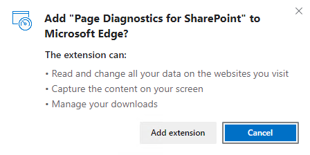
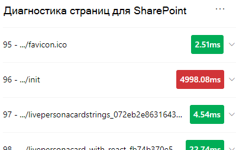
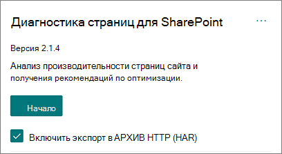

# Используйте средство диагностики страниц для SharePoint

В этой статье описывается  использование средства диагностики страниц для SharePoint для анализа современных и классических страниц веб-сайтов SharePoint Online по заранее определенному набору критериев производительности.

Средство диагностики страниц для SharePoint может быть установлено для:

- **Microsoft Edge** [(расширение edge)](https://microsoftedge.microsoft.com/addons/detail/ocemkolpnamjcacndljdfmhlpcaoipji)
- **Chrome** [(расширение Chrome)](https://chrome.google.com/webstore/detail/inahogkhlkbkjkkaleonemeijihmfagi)

>[!TIP]
>Версия **2.0.0** и более поздние версии включают поддержку современных страниц в дополнение к классическим страницам сайта. Если вы не знаете, какую версию инструмента вы используете, вы можете выбрать ссылку **About** или эллипсы (...) для проверки версии. **Всегда обновляй последнюю версию** при использовании средства.

Средство "Диагностика страниц SharePoint" — это браузерное расширение для браузеров Chrome и новой версии Microsoft Edge (https://www.microsoft.com/edge), анализирующее страницы современных и классических сайтов публикаций SharePoint Online. Этот инструмент работает только для SharePoint Online и не может использоваться на SharePoint странице системы.

Средство создает отчет для каждой анализируемой страницы с указанием того, как страница выполняется в отношении заранее определенного набора правил, и отображает подробные сведения, когда результаты теста выпадают за пределы базового значения. SharePoint Администраторы и дизайнеры в Интернете могут использовать этот инструмент для устранения проблем с производительностью и оптимизации новых страниц перед публикацией.

Средство диагностики страниц предназначено для анализа только SharePoint страниц сайта, а не системных страниц, таких как *allitems.aspx* или *sharepoint.aspx.* Если вы попытается запустить средство на странице системы или на любой другой странице, не на сайте, вы получите сообщение об ошибке, в которой сообщается, что этот инструмент нельзя запустить для такого типа страницы.

> [!div class="mx-imgBorder"]
> 

Это не ошибка в инструменте, так как нет значения при оценке библиотек или системных страниц. Перейдите на страницу SharePoint сайта, чтобы использовать средство. Если эта ошибка возникает на SharePoint странице, ознакомьтесь с этой страницей, чтобы убедиться, что SharePoint метатаги не удалены.

Чтобы предоставить обратную связь о инструменте, выберите эллипсис в правом верхнем углу инструмента, а затем выберите [Дать обратную связь](https://go.microsoft.com/fwlink/?linkid=874109).

> [!div class="mx-imgBorder"]
> 
  
## Установка средства диагностики страниц для SharePoint

Процедура установки в этом разделе будет работать как для браузеров Chrome, так и Microsoft Edge браузеров.

> [!IMPORTANT]
> Корпорация Майкрософт не читает данные или содержимое страницы, которые анализируются средством диагностики страниц для SharePoint, и мы не запечатлели личные данные, веб-сайт или не скачиваем информацию. Единственными идентифицируемыми сведениями, зарегистрированными в Корпорации Майкрософт с помощью средства, является имя клиента, количество сбойных правил и дата и время запуска средства. Эта информация используется корпорацией Майкрософт для лучшего понимания современных тенденций использования портала и публикации сайтов и распространенных проблем производительности.

1. Установите средство диагностики страниц для SharePoint для **Microsoft Edge** [(расширение edge)](https://microsoftedge.microsoft.com/addons/detail/ocemkolpnamjcacndljdfmhlpcaoipji) или **Chrome** [(расширение Chrome).](https://chrome.google.com/webstore/detail/inahogkhlkbkjkkaleonemeijihmfagi) Просмотрите политику конфиденциальности пользователей, представленную на странице описания в магазине. При добавлении средства в браузер вы увидите следующие разрешения.

    > [!div class="mx-imgBorder"]
    > 

    Это уведомление имеет место, так как страница может содержать содержимое из расположения за пределами SharePoint в зависимости от веб-частей и настроек на странице. Это означает, что средство будет читать запросы и ответы при нажатии кнопки запуска и только для активной вкладки SharePoint, на которой работает средство. Эти сведения локализованы веб-браузером и доступны для вас с помощью кнопки Экспорт в **JSON** или Экспорт в **HAR** в вкладке Трассировка сети средства. Сведения не отправляются в Корпорацию Майкрософт и не  отсвечены.  (Средство уважает политику конфиденциальности Майкрософт, доступную [здесь.)](https://go.microsoft.com/fwlink/p/?linkid=857875)

    Разрешение _"Управление загрузкой"_ охватывает использование функции Экспорта средства **в JSON.** Прежде чем делиться файлом JSON за пределами организации, следуйте собственным рекомендациям по конфиденциальности вашей компании, так как результаты содержат URL-адреса, которые можно классифицировать как PII (Персональные сведения).
1. Если вы хотите использовать средство в режиме Инкогнито или InPrivate, выполните процедуру для браузера:
    1. В Microsoft Edge перейдите к **расширениям** _или введите edge://extensions_ в панели URL-адресов и выберите **Сведения** для расширения. В параметрах расширения выберите почтовый ящик для **допуска в InPrivate.**
    1. В Chrome перейдите к **расширениям** _или введите chrome://extensions_ в панели URL-адресов и выберите **Сведения** для расширения. В параметрах расширения выберите ползунок для **допуска в Incognito**.
1. Перейдите на страницу SharePoint в SharePoint Online, которую вы хотите просмотреть. Мы разрешили "задержку загрузки" элементов на страницах; Поэтому средство не остановится автоматически (это по проекту для размещения всех сценариев загрузки страниц). Чтобы остановить коллекцию, выберите **Stop**. Убедитесь, что загрузка страницы завершена до остановки сбора данных или вы зафиксировать только частичный след.
1. Нажмите кнопку панели инструментов расширения  для загрузки средства и вам будет представлено следующее всплывающее окно расширения:

    

Выберите **Начните** сбор данных для анализа.

## Что вы увидите в средстве Page Diagnostics for SharePoint

1. Щелкните эллипсы (...) в правом верхнем углу инструмента, чтобы найти следующие ссылки:
   1. Ссылка **Дополнительные ресурсы** содержит общие рекомендации и сведения о инструменте, включая ссылку на эту статью.
   1. Ссылка **На обратную** связь дает ссылку на веб-сайт _SharePoint и голосовой голос_ пользователя.
   1. Ссылка **About** включает установленную в настоящее время версию средства и прямую ссылку на уведомление третьей стороны.  
1. ID **корреляции, SPRequestDuration, SPIISLatency,** **время** загрузки страницы и URL-адреса являются информационными и могут использоваться для нескольких целей. 

    > [!div class="mx-imgBorder"]
    > 

   - **CorrelationID** является важным элементом при работе с microsoft Support, так как позволяет им собирать дополнительные диагностические данные для определенной страницы.
   - **SPRequestDuration** — это время, SharePoint для обработки страницы. Структурная навигация, большие изображения, множество вызовов API могут способствовать более длительным срокам.
   - **SPIISLatency** — это время миллисекунд, которые принимаются для SharePoint Online, приступить к загрузке страницы. Это значение не включает время, необходимое для ответа веб-приложения.
   - **Время загрузки** страницы — это общее время, записанного страницей со времени запроса до времени, когда ответ был получен и отрисовыт в браузере. На это значение влияют различные факторы, включая задержку сети, производительность компьютера и время загрузки страницы браузером.
   - **URL-адрес страницы** (Единообразный локатор ресурсов) — это веб-адрес текущей страницы.

1. На [**вкладке Диагностические**](#how-to-use-the-diagnostic-tests-tab) тесты отображаются результаты анализа в трех категориях; **Никаких действий, необходимых** для **улучшения возможностей** **и внимания.** Каждый результат теста представлен элементом в одной из этих категорий, как описано в следующей таблице:

    |Category  |Цвет  |Описание  |
    |---------|---------|---------|
    |**Необходимое внимание** |Красный |Результат тестирования не имеет базового значения и влияет на производительность страницы. Следуйте рекомендациям по исправлению.|
    |**Возможности улучшения** |Желтый |Результат тестирования не имеет базового значения и может быть причиной проблем с производительностью. Могут применяться критерии, определенные для тестирования.|
    |**Никаких действий не требуется** |Зеленый |Результат тестирования относится к базовому значению теста.|

    > [!div class="mx-imgBorder"]
    > 

1. Вкладка [**Трассировка**](#how-to-use-the-network-trace-tab-and-how-to-export-a-har-file) Сети содержит сведения о запросах и ответах на сборку страниц.

## Использование вкладки Диагностические тесты

При анализе SharePoint или классической страницы сайта публикации с помощью средства Page Diagnostics for SharePoint результаты анализируются с помощью заранее определенных правил,  которые сравнивают результаты с базовыми значениями и отображаются на вкладке Диагностические тесты. Правила для определенных тестов могут использовать различные базовые значения для современных порталов и классических сайтов публикации в зависимости от того, насколько отличаются характеристики производительности между ними.

Результаты тестирования, которые отображаются  в категориях **"Возможности** улучшения" или "Внимание", указывают области, которые следует рассматривать в отношении рекомендуемых методов, и могут быть выбраны для отображения дополнительных сведений о результатах. Сведения для каждого элемента включают _дополнительные_ ссылки, которые будут принимать вас непосредственно к соответствующим указаниям, связанным с тестом. Результаты тестирования, которые отображаются в категории **"Нет** действий", указывают на соответствие соответствующему правилу и не отображают дополнительные сведения при выборе.

Сведения на вкладке Тесты диагностики не расскажут вам, как создать страницы, но будут выделены факторы, которые могут повлиять на производительность страницы. Некоторые функциональные возможности и настройки страниц оказывают неизбежное влияние на производительность страницы и должны быть рассмотрены для потенциального восстановления или бездействия со страницы, если их влияние существенно.

Красные или желтые результаты также могут указывать на веб-части, которые слишком часто обновляют данные. Например, корпоративные новости обновляются не каждую секунду, но пользовательские веб-части часто строятся для получения последних новостей каждую секунду вместо реализации элементов кэшинга, которые могли бы улучшить общий пользовательский интерфейс. Помните, что при включив веб-части на страницу, часто существуют простые способы снижения их влияния на производительность, оценивая значение каждого доступного параметра, чтобы убедиться, что он установлен надлежащим образом по назначению.

>[!NOTE]
>Классические сайты команд, не включенные в функцию публикации, не могут использовать CDNs. При запуске средства на этих сайтах ожидается сбой CDN, который может быть проигнорирован, но все оставшиеся тесты применимы. Дополнительные функции функции SharePoint публикации могут увеличить время загрузки страницы, поэтому ее нельзя включить только для CDN функций.

>[!IMPORTANT]
>Правила тестирования регулярно добавляются и обновляются, поэтому обратитесь к последней версии средства для получения сведений о текущих правилах и конкретных сведениях, включенных в результаты тестирования. Вы можете проверить версию, управляя расширениями, и расширение посоветует, доступно ли обновление.

## Использование вкладки Сетевой трассировки и экспорт файла HAR

Вкладка **Network Trace** содержит подробные сведения о запросах на создание страницы и ответах, полученных SharePoint.

1. **Найди время загрузки элементов, помеченное как красное.** Каждый запрос и ответ закодировать цвет, чтобы указать его влияние на общую производительность страницы с помощью следующих показателей задержки:
    - Зеленый цвет: \< 500 мс
    - Желтый: 500-1000ms
    - Красный цвет: \> 1000ms

    > [!div class="mx-imgBorder"]
    > 

    На изображении, показанного выше, красный элемент относится к странице по умолчанию. Он всегда будет показывать красный цвет, если страница не загружается в \< 1000 мс (менее 1 секунды).

2. **Время загрузки элемента тестирования.** В некоторых случаях не будет индикатора времени или цвета, так как элементы уже кэшировали в браузере. Чтобы проверить это правильно, откройте страницу, очистить кэш браузера, а затем нажмите кнопку Начните, как это заставит "холодной" загрузки страницы и быть истинным отражением начальной нагрузки страницы.  Это следует сравнить с "теплой" загрузкой страницы, так как это также поможет определить, какие элементы кэшировали на странице.

3. **Поделитесь соответствующими сведениями с другими людьми, которые могут помочь в расследовании проблем.** Рекомендуется делиться сведениями или сведениями, предоставленными в инструменте с разработчиками или лицом технической поддержки, с помощью приложения **Enable exporting to HTTP Archive (HAR).** 

   > [!div class="mx-imgBorder"]
   > 

Это должно быть включено перед нажатием кнопки Начните, что позволит включить режим отключки в браузере. Он будет создавать файл архива HTTP (HAR), к которому можно получить доступ через вкладку "Сетевой след". Нажмите кнопку "Экспорт в HAR" и загрузите файл на компьютер, и вы можете поделиться им соответствующим образом. Файл может быть открыт в различных средствах отлаживки, таких как средства разработчика F12 и Fiddler.

> [!div class="mx-imgBorder"]
> 

> [!IMPORTANT]
> Эти результаты содержат URL-адреса, которые можно классифицировать как PII (персональные сведения). Перед распространением этих сведений обязательно следуйте рекомендациям организации.

## Взаимодействие с поддержкой Майкрософт

Мы включили функцию **уровня поддержки Майкрософт,** которую следует использовать только при работе непосредственно над случаем поддержки. Использование этой функции не даст вам никакой пользы при использовании без участия группы поддержки и может значительно замедлить выполнение страницы. При использовании этой функции в средстве нет дополнительных сведений, так как дополнительные сведения добавляются в ведение журнала в службе.

Изменения не видны, за исключением того, что вы будете уведомлены о том, что вы включили его и производительность страницы значительно ухудшилась на 2-3 раза медленнее производительности при включенной. Он будет иметь значение только для конкретной страницы и этого активного сеанса. По этой причине его следует использовать экономно и только при активном вовлечении в поддержку.

### Включить функцию уровня поддержки Майкрософт

1. Откройте средство диагностики страниц для SharePoint.
2. На клавиатуре нажмите **ALT-Shift-L**. В этом случае будет **отображаться поле для ведения журнала журнала** поддержки.
3. Выберите шажок, а затем нажмите **кнопку Начните** перезагружать страницу и создать подробный журнал.

   > [!div class="mx-imgBorder"]
   > 
  
    Необходимо отметить CorrelationID (отображается в верхней части средства) и предоставить его представителю службы поддержки, чтобы они могли собирать дополнительные сведения о сеансе диагностики.

## Статьи по теме

[Настройка производительности SharePoint Online](tune-sharepoint-online-performance.md)

[Настройка производительности Office 365](tune-microsoft-365-performance.md)

[Производительность в современном интерфейсе SharePoint](/sharepoint/modern-experience-performance)

[Сети доставки содержимого](content-delivery-networks.md)

[Использование сети доставки содержимого Office 365 с SharePoint Online](use-microsoft-365-cdn-with-spo.md)