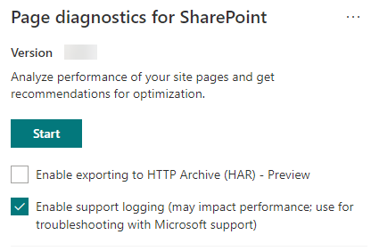

# Использование средства диагностики страниц для SharePoint

В этой статье описывается, как использовать средство диагностики страниц **для SharePoint** для анализа современных и классических страниц сайтов SharePoint Online на предмет предварительно определенного набора критериев производительности.

Средство диагностики страниц для SharePoint можно установить для:

- **Microsoft Edge** [(расширение Edge)](https://microsoftedge.microsoft.com/addons/detail/ocemkolpnamjcacndljdfmhlpcaoipji)
- **Chrome** [(расширение Chrome)](https://chrome.google.com/webstore/detail/inahogkhlkbkjkkaleonemeijihmfagi)

>[!TIP]
>Версия **2.0.0 и** более поздние версии включает поддержку современных страниц в дополнение к классическим страницам сайта. Если вы не знаете, какую версию средства вы  используете, можно выбрать ссылку "О", или многолинейные (...), чтобы проверить свою версию. **Всегда обновляются до последней версии** при использовании средства.

Средство "Диагностика страниц SharePoint" — это браузерное расширение для браузеров Chrome и новой версии Microsoft Edge (https://www.microsoft.com/edge), анализирующее страницы современных и классических сайтов публикаций SharePoint Online. Это средство работает только для SharePoint Online и не может использоваться на системной странице SharePoint.

Средство создает отчет для каждой проанализированой страницы, в котором показывая, как страница работает с заранее определенным набором правил, и отображает подробные сведения, когда результаты теста не попадают за пределы базового значения. Администраторы и дизайнеры SharePoint Online могут использовать это средство для устранения проблем с производительностью и оптимизации новых страниц перед публикацией.

Средство диагностики страниц предназначено для анализа только страниц сайта SharePoint, а не системных страниц, таких как *allitems.aspx* или *sharepoint.aspx.* При попытке запустить средство на системной странице или любой другой странице вне сайта вы получите сообщение об ошибке с сообщением о том, что средство не может быть запускаться для страницы этого типа.

Это не является ошибкой в средстве, так как нет значения при оценке библиотек или системных страниц. Перейдите на страницу сайта SharePoint, чтобы использовать это средство. Если эта ошибка возникает на странице SharePoint, проверьте этакшную страницу, чтобы убедиться, что метатеги SharePoint не были удалены.

Чтобы предоставить отзыв о средстве, выберите многоязык в правом верхнем углу инструмента, а затем выберите ["Обратная связь".](https://go.microsoft.com/fwlink/?linkid=874109)

  
## Установка средства диагностики страниц для SharePoint

Процедура установки в этом разделе будет работать как для браузеров Chrome, так и для браузеров Microsoft Edge.

> [!IMPORTANT]
> Корпорация Майкрософт не читает данные или содержимое страницы, анализируются средством диагностики страниц для SharePoint, и мы не записываем личные сведения, веб-сайт и не загружаем информацию. Единственная идентифицируемая информация, зарегистрированная средством в Корпорацию Майкрософт, — это имя клиента, количество сбойных правил и дата и время запуска средства. Эти сведения используются корпорацией Майкрософт для лучшего понимания современных порталов, тенденций использования сайтов публикации и распространенных проблем с производительностью.

1. Установите средство диагностики страниц SharePoint для **Microsoft Edge** [(расширение Edge)](https://microsoftedge.microsoft.com/addons/detail/ocemkolpnamjcacndljdfmhlpcaoipji) или **Chrome** [(расширение Chrome).](https://chrome.google.com/webstore/detail/inahogkhlkbkjkkaleonemeijihmfagi) Просмотрите политику конфиденциальности пользователей, предоставленную на странице описания в Магазине. При добавлении средства в браузер вы увидите следующее уведомление о разрешениях.

    

    Это уведомление существует, так как страница может содержать контент из местоположений за пределами SharePoint в зависимости от веб-частей и настроек на странице. Это означает, что средство будет читать запросы и ответы при нажатии кнопки запуска и только для активной вкладки SharePoint, где запущено средство. Эти сведения фиксируются локально в веб-браузере и доступны с помощью кнопки "Экспорт в  **JSON"** или "Экспорт в **HAR"** на вкладке "Трассировка сети" средства. Эти сведения не отправляются и не захватывается корпорацией **Майкрософт.** (Это средство соблюдает политику конфиденциальности Майкрософт, доступную [здесь.)](https://go.microsoft.com/fwlink/p/?linkid=857875)

    Разрешение _на управление скачиванием_ распространяется на использование функции экспорта в **JSON** средства. Прежде чем делиться JSON-файлом за пределами организации, следуйте рекомендациям вашей компании по конфиденциальности, так как результаты содержат URL-адреса, которые можно классифицировать как персональные данные (персональные данные).
1. Если вы хотите использовать средство в режиме Инкогнито или InPrivate, выполните процедуру для браузера:
    1. В Microsoft Edge перейдите к **расширениям** или введите edge://extensions _на_ панели URL-адресов и выберите "Сведения **для** расширения". В параметрах расширения выберите параметр "Разрешить" **в InPrivate.**
    1. В Chrome перейдите к **расширениям** или введите _chrome://extensions_ на панели URL-адресов и выберите "Сведения"  для расширения. В параметрах расширения выберите ползунок для **в инкогнито.**
1. Перейдите на страницу сайта SharePoint в SharePoint Online, которую вы хотите просмотреть. Мы разрешили "задержку загрузки" элементов на страницах; Следовательно, средство не остановится автоматически (это делается с учетом всех сценариев загрузки страниц). Чтобы остановить сбор, выберите **"Остановить".** Убедитесь, что загрузка страницы завершена до остановки сбора данных или будет выполнена только частичная трассировка.
1. Нажмите кнопку панели инструментов расширения  для загрузки средства, и вы будете представлены с помощью следующего всплывающее окно расширения:

    

Выберите **начало** сбора данных для анализа.

## Что вы увидите в средстве диагностики страниц SharePoint

1. Щелкните многолипсы (...) в правом верхнем углу инструмента, чтобы найти следующие ссылки:
   1. Ссылка **"Дополнительные** ресурсы" содержит общие рекомендации и подробные сведения о средстве, включая ссылку на эту статью.
   1. Ссылка **"Обратная связь"** предоставляет ссылку на сайт _"Сайты SharePoint и голосовая_ связь для совместной работы".
   1. Ссылка **"О** компании" содержит установленную в настоящее время версию средства и прямую ссылку на уведомление сторонних средств.  
1. ИД **корреляции, SPRequestDuration, SPIISLatency,** время загрузки страницы и **URL-адрес** являются информационными и могут использоваться для нескольких целей. 

    

   - **CorrelationID** — важный элемент при работе с службой поддержки Майкрософт, так как он позволяет собирать дополнительные диагностические данные для определенной страницы.
   - **SPRequestDuration —** это время, необходимое SharePoint для обработки страницы. Структурная навигация, большие изображения, большое количество вызовов API могут привести к длительности.
   - **SPIISLatency** — это время в миллисекунах, за которые SharePoint Online начинает загрузку страницы. Это значение не включает время, за которое веб-приложение отвечает.
   - **Время загрузки страницы** — это общее время, записанного страницей с времени запроса до времени, когда ответ был получен и отрисовки в браузере. На это значение влияет множество факторов, включая задержку сети, производительность компьютера и время, необходимое браузеру для загрузки страницы.
   - **URL-адрес страницы** (uniform Resource Locator) — это веб-адрес текущей страницы.

1. На [**вкладке "Диагностические**](#how-to-use-the-diagnostic-tests-tab) тесты" результаты анализа отображаются в трех категориях. **Никаких действий не требуется,** **возможности улучшения** и **внимание.** Каждый результат теста представлен элементом в одной из этих категорий, как описано в следующей таблице:

    |Category  |Цвет  |Description  |
    |---------|---------|---------|
    |**Требуется внимание** |Красный |Результат теста не относится к базовому значению и влияет на производительность страницы. Следуйте рекомендациям по исправлению.|
    |**Возможности улучшения** |Желтый |Результаты тестирования не являются базовыми значениями и могут привести к проблеме производительности. Могут применяться критерии тестирования.|
    |**Никаких действий не требуется** |Зеленый |Результат теста попадает в базовое значение теста.|

    

1. Вкладка [**"Трассировка**](#how-to-use-the-network-trace-tab) сети" содержит сведения о запросах на сборку страниц и ответах.

## Использование вкладки "Диагностические тесты"

При анализе страницы современного портала SharePoint или классической страницы сайта публикации с помощью средства диагностики страниц SharePoint результаты анализируются с  помощью предварительно определенных правил, сравнивающих результаты с базовыми значениями, и отображаются на вкладке "Диагностические тесты". Правила для определенных тестов могут использовать различные базовые значения для современных порталов и классических сайтов публикации в зависимости от того, чем отличаются конкретные характеристики производительности.

Результаты тестирования, которые  отображаются  в категориях "Усовершенствование возможностей" или "Внимание", указывают области, которые следует проанализировать в связи с рекомендациями, и их можно выбрать для отображения дополнительных сведений о результатах. Сведения о каждом элементе включают ссылку _"Подробнее",_ которая поможет вам непосредственно перейти к соответствующим рекомендациям, связанным с тестом. Результаты тестирования, которые  отображаются в категории "Нет действий", указывают на соответствие соответствующему правилу и не отображают дополнительные сведения при выборе.

Информация на вкладке "Тесты диагностики" не поможет вам разработать страницы, но выделит факторы, которые могут повлиять на производительность страницы. Некоторые функции и настройки страниц оказывают неизбежное влияние на производительность страницы и должны быть проанализированы на возможность возможного устранения или бездействия со страницы, если их влияние существенно.

Красный или желтый цвет также может указывать на веб-части, которые слишком часто обновляют данные. Например, корпоративные новости обновляются не каждую секунду, но настраиваемые веб-части часто настраиваются для получения последних новостей каждую секунду вместо реализации элементов кэшинга, которые могут улучшить общий пользовательский интерфейс. При добавлении веб-частей на страницу следует помнить, что часто существуют простые способы снижения их влияния на производительность путем оценки значения каждого доступного параметра, чтобы убедиться, что он задан соответствующим образом по назначению.

>[!NOTE]
>Классические сайты группы, на которые не включена функция публикации, не могут использовать сети CDNs. При запуске средства на этих сайтах ожидается сбой теста CDN, который можно проигнорировать, но все остальные тесты применимы. Дополнительные функции функции публикации SharePoint могут увеличить время загрузки страницы, поэтому ее не следует включить только для того, чтобы разрешить функции CDN.

>[!IMPORTANT]
>Правила тестирования добавляются и регулярно обновляются, поэтому подробные сведения о текущих правилах и конкретные сведения, включенные в результаты тестирования, можно найти в последней версии средства. Вы можете проверить версию, управляя расширениями, и оно будет рекомендовать, доступно ли обновление.

## Использование вкладки "Трассировка сети"

Вкладка **"Трассировка** сети" содержит подробные сведения о запросах на построение страницы и ответах, полученных от SharePoint.

1. **Найди время загрузки элемента, помеченное красным цветом.** Каждый запрос и ответ закодировать цвет, чтобы показать его влияние на общую производительность страницы с помощью следующих метрик задержки:
    - Зеленый: \< 500 мс
    - Желтый: 500–1000 мс
    - Красный цвет: \> 1000 мс

    

    На изображении выше красный элемент относится к странице по умолчанию. Она всегда будет красной, если страница не загружается за \< 1000 мс (менее 1 секунды).

2. **Время загрузки тестового элемента.** В некоторых случаях не будет индикатора времени или цвета, так как элементы уже были кэшировали браузером. Чтобы проверить это правильно, откройте страницу, очищайте  кэш браузера и нажмите кнопку "Начните", чтобы принудительно загрузить "холодные" страницы и стать истинным отражением начальной загрузки страницы. Затем его следует сравнить с "теплой" загрузкой страницы, так как это также поможет определить, какие элементы кэшются на странице.

3. **Поделитесь соответствующими сведениями с другими людьми, которые могут помочь в расследовании проблем.** Чтобы поделиться сведениями, предоставленными в средстве, с разработчиками или лицом технической поддержки, нажмите кнопку "Экспорт в **JSON"** (как показано на рисунке выше). Это позволит скачать результаты, которые можно просмотреть с помощью просмотра файлов JSON.

    Если вы решили использовать функцию предварительного просмотра, чтобы включить экспорт в *HAR,* то тип экспорта будет иметь вид **"Экспорт в HAR".**

    

> [!IMPORTANT]
> Эти результаты содержат URL-адреса, которые можно классифицировать как личные сведения (персональные данные). Перед распространением этой информации обязательно следуйте рекомендациям вашей организации.

## Взаимодействие с службой поддержки Майкрософт

Мы включили функцию уровня поддержки **Майкрософт,** которую следует использовать только при работе непосредственно в случае поддержки. Использование этой функции не даст никаких преимуществ при использовании без участия команды поддержки и может значительно замедлить выполнение страницы. При использовании этой функции в средстве нет дополнительных сведений, так как они добавляются в журнал в службе.

Изменения не видны, за исключением того, что вы будете уведомлены о том, что вы включили его и производительность страницы значительно ухудшена в 2-3 раза медленнее производительности. Он будет релевантн только для конкретной страницы и этого активного сеанса. По этой причине этот способ следует использовать экономно и только при активном вовлечении в работу службы поддержки.

### Чтобы включить функцию уровня поддержки Майкрософт

1. Откройте средство диагностики страниц SharePoint.
2. На клавиатуре нажмите **клавиши ALT-SHIFT-L.** На экране отобразится **окно "Включить ведение журнала** поддержки".
3. Чтобы перезагрузить страницу  и создать подробное ведение журнала, нажмите кнопку "Начните".

    
  
    Следует отметить CorrelationID (отображается в верхней части средства) и предоставить его представителю службы поддержки, чтобы позволить ему собирать дополнительные сведения о сеансе диагностики.

## Статьи по теме

[Настройка производительности SharePoint Online](tune-sharepoint-online-performance.md)

[Настройка производительности Office 365](tune-microsoft-365-performance.md)

[Производительность в современном интерфейсе SharePoint](https://docs.microsoft.com/sharepoint/modern-experience-performance)

[Сети доставки содержимого](content-delivery-networks.md)

[Использование сети доставки содержимого Office 365 с SharePoint Online](use-microsoft-365-cdn-with-spo.md)
